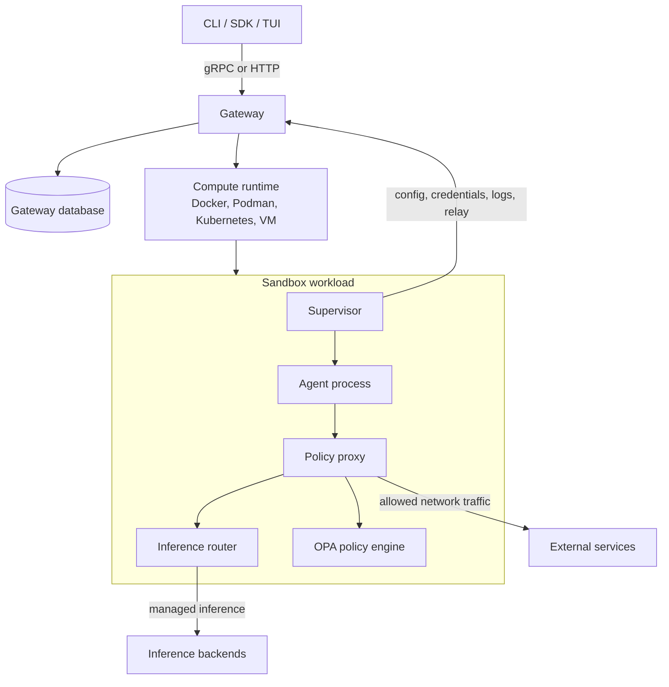

# OpenShell Architecture

OpenShell runs AI agents in sandboxed environments behind a gateway control
plane. The gateway owns API access, persistence, credentials, and lifecycle
orchestration. A compute runtime creates sandbox workloads. Each sandbox runs a
supervisor that launches the agent as a restricted child process and enforces
policy locally.

## Core Boundaries

| Component | Boundary |
|---|---|
| Gateway | Authenticated control plane, state store, provider records, sandbox lifecycle, relay coordination. |
| Compute runtime | Driver-specific creation and deletion of sandbox workloads. |
| Sandbox supervisor | Local sandbox setup, credential injection, policy polling, SSH relay, log push. |
| Policy proxy | Mandatory egress path for agent traffic and policy decisions. |
| Inference router | Sandbox-local forwarding for `https://inference.local`. |

## Request Flow

1. A user creates or manages a sandbox through the CLI, SDK, or TUI.
2. The gateway persists state and asks the selected compute runtime to create a workload.
3. The sandbox supervisor starts, fetches policy, settings, providers, and inference routes from the gateway.
4. The supervisor launches the agent as a restricted user in an isolated environment.
5. Agent network traffic goes through the sandbox proxy. The proxy allows, denies, inspects, or routes requests according to policy and inference configuration.
6. Connect, exec, and file sync traffic use a gateway relay to the sandbox supervisor. The gateway does not require direct inbound access to sandbox workloads.

## Driver Philosophy

OpenShell should integrate with the compute ecosystem instead of replacing it.
Drivers adapt Docker, Podman, Kubernetes, and VM runtimes to a common sandbox
contract, while those runtimes keep ownership of scheduling, image management,
storage primitives, GPU/device exposure, and platform lifecycle.

Drivers should stay thin:

- Translate OpenShell sandbox specs into native runtime objects.
- Inject the supervisor, sandbox identity, callback configuration, and runtime
  credentials needed by the supervisor.
- Report lifecycle and platform events back through the shared driver contract.
- Preserve native runtime behavior unless it conflicts with the sandbox security
  contract.

The supervisor is where OpenShell-specific enforcement belongs. Filesystem
policy, process privilege reduction, network proxying, inference interception,
credential injection, log emission, and gateway relay behavior should be
consistent across runtimes. If a runtime needs special handling, keep that logic
inside the driver or crate README rather than leaking it into the core sandbox
model.

When adding a new runtime, prefer native APIs and conventions over bespoke
orchestration. The driver should make OpenShell feel like a well-behaved member
of that ecosystem: observable through standard tools, compatible with existing
image and device workflows, and clear about the small set of assumptions
OpenShell requires.

## Architecture Docs

Architecture docs are short subsystem overviews. User-facing how-to content
lives in `docs/`. Implementation notes that only matter to one crate belong in
that crate's `README.md`.

| Document | Purpose |
|---|---|
| [Gateway](gateway.md) | Gateway control plane, auth, APIs, persistence, settings, and relay coordination. |
| [Sandbox](sandbox.md) | Sandbox supervisor, child process isolation, proxy, credentials, inference, connect, and logs. |
| [Security Policy](security-policy.md) | Policy model, enforcement layers, policy updates, policy advisor, and security logging. |
| [Compute Runtimes](compute-runtimes.md) | Docker, Podman, Kubernetes, VM, sandbox images, and runtime-specific responsibilities. |
| [Build](build.md) | Build artifacts, CI/E2E, docs site validation, and release packaging. |

For broad design proposals, use `rfc/`. For temporary working plans, use the
ignored `architecture/plans/` directory.
