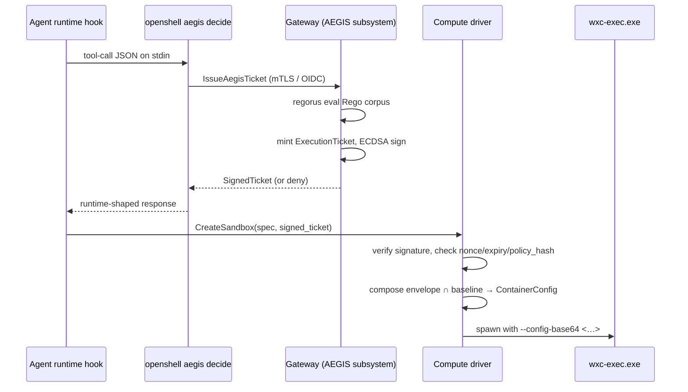

# AEGIS Governance

## Purpose

AEGIS is a per-tool-call decision gate built into the OpenShell gateway. Before
an agent runtime invokes a tool, it asks the gateway whether that specific
action is allowed in this context. The gateway evaluates a Rego policy corpus,
returns an `allow`, `deny`, or `ask` decision, and on `allow` mints a
short-lived **execution envelope** (timeout, filesystem deny list, network
on/off) bound to that one call. Compute drivers verify a signed ticket carrying
the envelope and compose it with the sandbox's baseline policy before spawning
the tool process. The gateway is the single trust authority: it owns auth,
policy storage, OCSF audit, and the ECDSA private key that signs tickets.

## Three-layer policy mental model

OpenShell now expresses three policy surfaces. They have different lifetimes,
different formats, and different enforcement points.

```
SandboxPolicy (YAML)        EnvelopePolicy (decision-bound)        ContainerConfig (JSON)
       │                              │                                     │
   per-sandbox                   per-tool-call                       per-spawn (Windows)
   baseline cap                  decision result                     translated MXC payload
       │                              │                                     │
       └────────────► effective = baseline ∩ envelope ────────────► driver → wxc-exec
                       (most-restrictive-wins composition)
```

| Layer | Format | Lifetime | Authority | Enforcement |
|---|---|---|---|---|
| `SandboxPolicy` | YAML, proto-defined | Per-sandbox lifetime | Gateway-stored, supervisor-loaded | Linux: Landlock + supervisor proxy. Windows: input to MXC `ContainerConfig`. |
| `EnvelopePolicy` | Proto, decision-bound | Single tool call | Gateway Rego corpus | Driver verifies, intersects with baseline, applies on spawn. |
| MXC `ContainerConfig` | JSON, transport shape | Single `wxc-exec` invocation | Translated by `openshell-mxc-bridge` | `wxc-exec.exe` reads from `--config-base64`. |

Composition is **envelope ∩ baseline (most-restrictive-wins)**. The envelope
cannot widen what baseline forbids. The translator is one-way: Rego decides,
the bridge serializes, MXC enforces. There is no path back from
`ContainerConfig` to Rego.

## Trust boundaries

AEGIS introduces three trust tiers. The gateway holds authority; everything
downstream verifies.

| Boundary | Holds | Trusts |
|---|---|---|
| Gateway | ECDSA P-256 private key, Rego corpus, auth tables, OCSF sink | Itself; OIDC/mTLS-authenticated callers |
| Driver (`appcontainer`, `isolation-session`) | Cached gateway public key, `policy_hash` | Tickets it can verify offline against the cached pubkey |
| Sandboxed process | Nothing | Untrusted; bounded by `ContainerConfig` |

The v1 anti-replay floor is the ticket nonce plus `expires_at`. The driver
maintains a bounded nonce-seen set and rejects reuse. Binding tickets to a
caller PID is deferred to v1.5 — operators who need it today should keep
`expires_at` short.

## Decision flow

A single tool call traverses three processes. The agent runtime's pre-tool
hook pipes a JSON payload to a hidden CLI subprocess; the subprocess relays it
to the gateway over loopback gRPC; the gateway returns a signed ticket; the
runtime hands the ticket to the driver on `CreateSandbox`.



If verification fails — bad signature, expired ticket, replayed nonce, or a
`policy_hash` the driver does not have a cached pubkey for — the driver
refuses to spawn and dual-emits a `DetectionFinding`. If the gateway returns
`deny` or `ask`, the runtime never reaches the driver.

Decisions are stateless on the gateway side except for the bounded
nonce-seen set used to detect replay. Each driver maintains its own nonce
cache keyed by gateway identity, so a ticket minted for one driver instance
cannot be redeemed against another.

## Wire shape

`ExecutionTicket` is a canonical-JSON document; `SignedTicket` carries it with
an ECDSA P-256 signature and an optional inline SPKI public key.

```rust
struct ExecutionTicket {
    tool_name, tool_call_id, args_hash, cwd, envelope,
    policy_hash, issued_at, expires_at, nonce,
}
struct SignedTicket { ticket, signature, public_key }
```

The full field list, RPC surface (`IssueAegisTicket`, `VerifyAegisTicket`), and
`CreateSandboxRequest.signed_ticket` extension live in `proto/sandbox.proto`,
`proto/openshell.proto`, and `proto/compute_driver.proto`. The signed-ticket
contract is documented end-to-end in
[RFC 0004](../rfc/0004-aegis-governance/README.md). Driver-side details
(verify path, nonce cache, bridge invocation) belong in the driver crate
READMEs.

The gateway publishes its public key to three locations so drivers can verify
offline:

- `%TEMP%\aegis-pubkey.pem` (per-user staging path)
- `%ProgramData%\aegis\aegis-public.pem` (machine-wide)
- `GET /.well-known/aegis-public.pem` over mTLS (multi-host deployments)

Probe order matches the upstream `mxc-aegis` SDK so AEGIS-aware tools that
already exist on the host work without rewiring.

## Linux/Windows feature matrix

The Linux stack predates AEGIS and continues to work unchanged. The Windows
drivers ship with a narrower enforcement surface; per-tool-call envelopes
partially compensate for the missing supervisor and L7 proxy.

| Feature | Linux (existing) | Windows (v1) |
|---|---|---|
| Filesystem isolation | Landlock | `wxc-exec` `ContainerConfig` |
| Network egress filtering | netfilter + L7 policy proxy | `ContainerConfig.allowedHosts` |
| Inference routing | `inference.local` supervisor proxy | Not in v1 |
| Provider credential injection | Sandbox supervisor | Not in v1 |
| Per-tool-call governance | New (via AEGIS) | New (via AEGIS) |
| Audit | OCSF JSONL | OCSF JSONL |

Windows v1 has no in-sandbox supervisor, so anything the Linux supervisor does
between the gateway and the agent process — credential injection, inference
interception, L7 inspection — is unavailable. Operators who need those
controls on Windows in v1 should rely on tighter envelopes (short
`expires_at`, restrictive `allowedHosts`) and accept that the only egress
filter is L4.

## OCSF events

AEGIS reuses existing OCSF builders rather than introducing a new event class.
Drivers and the gateway emit through the same JSONL sink operators already
ingest.

| Event | Builder | Severity |
|---|---|---|
| Decision: allow | `ConfigStateChangeBuilder` | Informational |
| Decision: deny | `ConfigStateChangeBuilder` + `DetectionFindingBuilder` | Medium |
| Ticket signature verify failure | `DetectionFindingBuilder` | High |
| Ticket replay (nonce reused) | `DetectionFindingBuilder` | High |
| Sandbox process start / stop | `ProcessActivityBuilder` | Informational / Low on non-zero exit |
| Rego corpus reload | `ConfigStateChangeBuilder` | Informational |
| Gateway keypair generated / rotated | `ConfigStateChangeBuilder` | Informational |

Security findings (verify failure, replay, deny) dual-emit: one domain event
plus one `DetectionFindingBuilder` for the same incident. Both the gateway's
AEGIS subsystem and the new Windows drivers initialize their own
`OnceLock<SandboxContext>` so the OCSF context is populated before the first
event fires.

## Operational notes

- **Pubkey rotation.** Default cadence is per-gateway-restart: each cold start
  generates a fresh ECDSA P-256 keypair, publishes it to the well-known paths,
  and emits a `ConfigStateChange` event. Operators can force rotation through
  the CLI without restarting. Drivers cache the pubkey alongside `policy_hash`
  so a stale pubkey + fresh policy combination fails closed.
- **Rego corpus distribution.** v1 ships only the **gateway tier** of the
  three-tier composition (gateway / machine / user-or-repo). Operators load
  one corpus into the gateway; drivers receive only the resulting envelope.
  Machine-tier and user-tier corpora are forward-looking; the wire shape and
  storage namespace are left open in `architecture/security-policy.md`.
- **Capability handshake.** On startup, each Windows driver invokes
  `wxc-exec.exe --capabilities` and validates the schema version against the
  range its bundled `openshell-mxc-bridge` understands (currently `0.5.0-alpha`
  and `0.6.0-dev`). Mismatch fails loudly with an actionable error before any
  sandbox is created. The pinned `wxc-exec` version and SHA live in
  `mise.toml`; staging is owned by `openshell-bootstrap`.
- **Decision latency.** Rego eval runs in-process via regorus, with a target
  budget of ~50–100 ms warm. The decision path is synchronous; a slow corpus
  slows every tool call routed through AEGIS.

## Cross-references

- [Gateway](gateway.md) — auth, multiplex, persistence. Gateway also issues
  AEGIS execution tickets.
- [Compute Runtimes](compute-runtimes.md) — driver pattern, supervisor
  delivery. The new AppContainer and IsolationSession drivers verify signed
  tickets before spawning.
- [Security Policy](security-policy.md) — baseline policy model, OCSF logging.
  AEGIS adds a per-tool-call envelope that composes with baseline and
  introduces a new privilege-escalation surface (the Rego corpus).
- [RFC 0004](../rfc/0004-aegis-governance/README.md) — full design rationale,
  alternatives considered, and open questions.

## Out of scope

- Stateful `IsolationSession` reuse across tool calls (matches MXC's deferred
  stateful API).
- L7 inference proxy and provider-credential injection on Windows in v1; both
  remain Linux-only.
- Replacing `SandboxPolicy` YAML with Rego. Baseline policy keeps its job;
  Rego only answers per-tool-call decisions.
- macOS, WSLC, and NanVix MXC backends.
- PID-binding of tickets. The v1 anti-replay floor is nonce + `expires_at`.
- Re-implementing the historical AEGIS named-pipe contract. Third-party
  AEGIS consumers cannot drop in unmodified; the trade-off is a single
  trust authority in the gateway.
