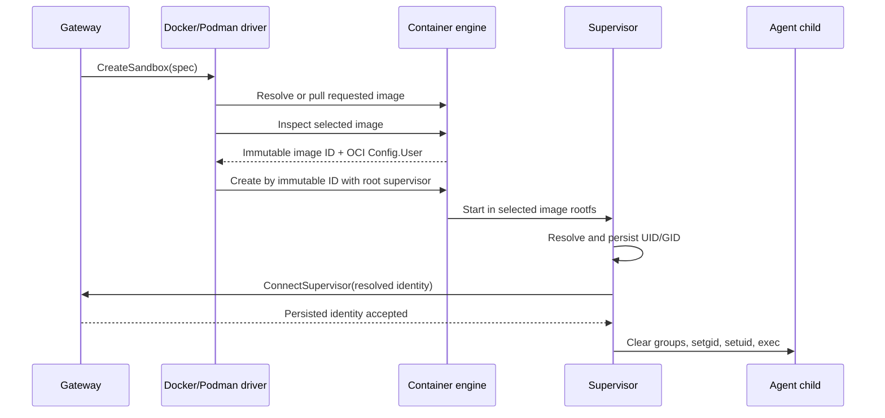

# Compute Runtimes

Compute runtimes create, stop, delete, and watch sandbox workloads for the
gateway. They do not replace sandbox policy enforcement. Every runtime starts a
workload that runs the `openshell-sandbox` supervisor, and the supervisor
enforces the sandbox contract locally.

## Driver Contract

Each runtime receives a sandbox spec from the gateway and is responsible for:

- Selecting the sandbox image.
- Injecting sandbox identity and gateway callback configuration.
- Supplying TLS or secret material for supervisor callbacks.
- Providing the supervisor binary or image in the workload.
- Reporting lifecycle and platform events back to the gateway.
- Cleaning up runtime-owned resources.

Drivers own runtime-specific platform event interpretation. When an event should
drive client provisioning UI, the driver attaches the shared
`openshell.progress.*` metadata defined in `openshell-core` instead of requiring
clients to parse Kubernetes reasons, VM cache states, or other driver-local
reason strings.

The capability RPC reports driver identity, version, and the default sandbox
image used by the gateway. GPU availability stays driver-local and is validated
when a sandbox create request asks for GPU resources.

The gateway records driver identity and version from the startup capability
response. Elevated gateway info reports that initialized driver snapshot instead
of re-querying drivers on each request.

## Deletion Lifecycle

Delete requests use per-sandbox gates to serialize delete attempts. A request
resolves the name once and remains bound to that stable ID. The only
combined lock order is delete gate, then the gateway-wide state guard; external
driver calls run without the global guard.

Delete gates are process-local and do not coordinate gateway replicas. They
serialize attempts rather than share results: if one attempt fails and recovery
restores a deletable state, a request waiting on the gate may retry the driver.
Persisted resource-version checks remain the cross-replica safety boundary.

Watcher events do not acquire delete gates. Exact resource-version checks allow
them to interleave safely: status snapshots are no-ops for `Deleting` rows,
deleted events are idempotent, and snapshots for absent rows are ignored.

An accepted delete (`deleted = true`) is finalized by the watcher. If the
backend is already absent (`deleted = false`), the request removes gateway state
synchronously. Sandbox row removal remains bound to the stable ID and resource
version. Settings retain their existing best-effort name-based cleanup; SSH
sessions, indexes, and watch/log buses are cleaned after confirmed removal.

The request acquires both locks before starting owned work, so cancellation
while queued does not leave a delete armed. After that commitment point, the
owned task prevents cancellation from stranding a mutation. A gateway restart
does not resume a persisted `Deleting` operation. If the backend completed the
delete, reconciliation removes the row; otherwise it can remain `Deleting`.

## Runtime Summary

| Runtime | Best fit | Sandbox boundary | Notes |
|---|---|---|---|
| Docker | Local development with Docker available. | Container plus nested sandbox namespace. | Uses host networking so loopback gateway endpoints work from the supervisor. |
| Podman | Rootless or single-machine deployments. | Container plus nested sandbox namespace. | Uses the Podman REST API, OCI image volumes, and CDI GPU devices when available. |
| Kubernetes | Cluster deployment through Helm. | Pod plus nested sandbox namespace. | Uses Kubernetes API objects, service accounts, secrets, PVC-backed workspace storage, and GPU resources. |
| VM | Experimental microVM isolation. | Per-sandbox libkrun VM. | Managed endpoint-backed driver. The gateway spawns `openshell-driver-vm`, waits for its Unix socket, and then consumes it through the same remote `compute_driver.proto` path used by unmanaged endpoint drivers. The VM driver boots a cached bootstrap `rootfs.ext4`, prepares requested OCI images inside a bootstrap VM with `umoci`, attaches the prepared image disk read-only, and gives each sandbox a writable `overlay.ext4` for merged-root changes and runtime material. The driver persists each accepted launch request beside the overlay and restarts those VMs on driver startup without recreating the overlay. |
| Extension | Out-of-tree drivers operated alongside the gateway. | Whatever boundary the driver implements. | Selected by a non-reserved custom `compute_drivers = ["<name>"]` entry with `[openshell.drivers.<name>].socket_path`, or at launch time by pairing `--drivers <name>` with `--compute-driver-socket=<path>`. Reserved built-in names such as `vm`, `docker`, `podman`, and `kubernetes` cannot be used as unmanaged socket endpoints. The gateway connects to a UDS the operator already provisioned, runs `GetCapabilities`, logs the advertised `driver_name`, and dispatches all sandbox lifecycle calls through `compute_driver.proto`. The driver process and socket lifecycle are operator-owned; the gateway does not spawn, supervise, or remove unmanaged extension drivers. The trust boundary is the socket's filesystem permissions: the operator must ensure only the gateway uid can read/write it. |

Per-sandbox CPU and memory values currently enter the driver layer through
template resource limits. Docker and Podman apply them as runtime limits.
Kubernetes mirrors each limit into the matching request. VM accepts the fields
but currently ignores them.

## Docker and Podman Agent Identity

By default, Docker and Podman preserve the selected sandbox image's non-root OCI
`USER` for agent processes. This local-container contract does not run the
supervisor as that user: the supervisor starts as root, prepares the isolation
boundary, and then drops privileges for direct and SSH-launched agent children.

### Image Selection and Startup

The local drivers bind identity inspection to the root filesystem that the
container engine starts. Docker implements this flow in
`crates/openshell-driver-docker/src/lib.rs`; Podman implements it in
`crates/openshell-driver-podman/src/driver.rs` and
`crates/openshell-driver-podman/src/container.rs`. Supervisor resolution and
persistence live in `crates/openshell-supervisor-process/src/identity.rs`.

Docker inspects a local hit or the result of a pull and passes the returned image
ID, rather than the mutable reference, to container creation. Podman pulls
according to policy, inspects the selected result, and creates with
`image_pull_policy = "never"` and the inspected ID. Podman applies the same
inspection and pinning to its supervisor image and requested image mounts. A tag
can therefore move after inspection without changing the rootfs selected for
that sandbox.

Both drivers insert the identity source, immutable image ID, and required
identity inputs after image and request environment, so the sandbox image cannot
override them. Docker sets the container user to `0`; Podman sets it to `0:0`.
Those values apply only to the supervisor, which needs root for namespace,
mount, network, filesystem, and privilege-drop setup.

### Identity Modes

The active Docker or Podman driver configuration selects one identity mode.

| Mode | Agent identity | Storage boundary |
|---|---|---|
| `image` (default) | Resolve the inspected image's raw OCI `Config.User` to one non-root UID/GID. | Reject creator-selected bind and named-volume mounts. The driver-owned workspace and tmpfs mounts remain available; Podman also permits read-only image mounts pinned to inspected image IDs. |
| `fixed` | Use the operator-configured `fixed_uid` and `fixed_gid`; both must be present and within the process-policy numeric range. | Permit external or shared storage subject to the normal mount and bind-enable checks. |

Image mode accepts named users and groups from the image's `/etc/passwd` and
`/etc/group`, or an explicit numeric `USER <uid>:<gid>` without account entries.
A numeric UID without a group requires a matching passwd entry from which to
obtain the primary GID. Missing users or groups and any identity resolving to
UID or GID 0 fail sandbox startup. The supervisor uses bounded, file-only
account parsing rather than NSS and does not create or rewrite image account
files.

Before the first agent starts, the supervisor stores the resolved identity in
`/var/lib/openshell/agent-identity.json`, bound to the immutable image ID and,
for image mode, the raw OCI user declaration. It reports the same versioned
record to the gateway. The gateway persists the source, image ID, UID, GID, and
empty supplementary-group set and rejects a missing or changed record on later
connections. Restarts reuse the persisted identity rather than resolving a
mutable tag again.

The gateway marks new Docker and Podman sandboxes as requiring this managed
identity and rejects creator-supplied `process.run_as_user` or
`process.run_as_group`; those policy fields cannot override the runtime's
selection. Existing containers without the creation marker retain their legacy
policy-derived identity and are not reinterpreted during upgrade.

### External Mount Boundary

Docker and Podman accept per-sandbox driver-config mounts for existing named
volumes and tmpfs mounts; Podman also accepts OCI image mounts. User-supplied
bind and volume mounts default to read-only, but read-only access does not make
external storage safe for an image-selected principal. Image mode therefore
rejects every creator-selected host bind and named volume even when the global
bind-mount switch is enabled. Operators must select fixed mode to bind external
or shared storage to an operator-controlled UID/GID.

Fixed mode is necessary but not sufficient for direct host access. Host binds,
including local-driver bind-backed named volumes, still require
`enable_bind_mounts` in the active local driver table of `gateway.toml`.
Requested named volumes must already exist, and the driver inspects them to
detect bind-backed storage. User mounts cannot replace the driver-owned
workspace root, supervisor, token, or TLS paths, and cannot overlap
identity-sensitive account, identity-state, or UID/GID-map paths.

Host bind mounts remain an unsafe operator override because they place gateway
host filesystem state inside the sandbox and can negate workspace isolation and
filesystem-policy controls.

### Kubernetes, OpenShift, and VM

The managed image-identity flow applies only to Docker and Podman. Kubernetes
continues to use an explicitly configured sandbox UID/GID, an OpenShift SCC
namespace-assigned range when available, or its existing numeric defaults. The
VM driver continues to use its configured numeric guest UID/GID, defaulting to
`10001` and using the UID as the GID when no GID is configured. These runtimes
do not derive agent identity from OCI `Config.User` and do not participate in
the Docker/Podman resolved-identity handshake.

Kubernetes deployments may set an AppArmor profile on sandbox agent containers
through the driver configuration. The Helm chart defaults sandbox agents to
`Unconfined` so runtime/default AppArmor profiles do not block supervisor
network namespace setup on AppArmor-enabled nodes.

Resource requirements enter the driver layer through `SandboxSpec.resource_requirements`. This includes a set of GPU requirements, where a user
can request a specific number of GPUs or the driver-specific default behaviour.
For all in-tree drivers, this is equivalent to selecting a single GPU.

VM runtime state paths are derived only from driver-validated sandbox IDs
matching `[A-Za-z0-9._-]{1,128}`. The gateway-owned VM driver socket uses a
private `run/` directory plus Unix peer UID/PID checks. Standalone
unauthenticated TCP mode is disabled unless explicitly enabled for local
development.

Runtime-specific implementation notes belong in the driver crate README:

- `crates/openshell-driver-docker/README.md`
- `crates/openshell-driver-podman/README.md`
- `crates/openshell-driver-kubernetes/README.md`
- `crates/openshell-driver-vm/README.md`

The combined VM topology runs `openshell-sandbox` as guest PID 1. libkrun
executes the driver-owned guest bootstrap as PID 1, and the bootstrap preserves
that identity when it execs the supervisor after mounting and network setup.

## Supervisor Delivery

The supervisor must be available inside each sandbox workload:

| Runtime | Delivery model |
|---|---|
| Docker | Bind-mounted local supervisor binary, or a binary extracted from the configured supervisor image. |
| Podman | Read-only OCI image volume containing the supervisor binary. |
| Kubernetes | Supervisor image side-loaded into the sandbox pod by image volume or init container. |
| VM | Embedded in the guest rootfs bundle. |
| Extension | Defined by the out-of-tree driver. |

Driver-controlled environment variables must override sandbox image or template
values for sandbox ID, sandbox name, gateway endpoint, relay socket path, TLS
paths, and command metadata.

Kubernetes can run the supervisor in the default combined topology or in a
sidecar topology. Combined mode keeps network and process supervision in the
agent container. Sidecar mode runs network enforcement, the proxy, and gateway
session in a dedicated sidecar, while the agent container runs only the
process-supervision leaf and launches the user workload after the sidecar
serves bootstrap state over a local control socket. The network sidecar owns
gateway credentials and sends policy plus workload-facing provider environment
state to the process leaf over that socket. It also streams provider
environment updates after settings polls so future process sessions see
updated provider env without giving the process leaf gateway access. The
pre-workload process supervisor is the only accepted control client: the
network sidecar verifies its UID, GID, and PID with peer credentials, removes
the listener after accepting it, and ignores workload-supplied relay targets.
SSH relays use a Linux abstract socket and verify its peer PID against that
authenticated process-supervisor connection, so workload filesystem access
cannot replace the relay endpoint. Either supervisor exits when this control
connection closes. This couples their restart lifecycle and prevents a workload
that survives an isolated network-sidecar restart from becoming the next
authoritative control client. In sidecar mode, an init container performs the
privileged pod-network nftables setup with
`NET_ADMIN`. The default binary-aware network sidecar runs as UID 0 without
`NET_ADMIN` and adds `SYS_PTRACE` plus `DAC_READ_SEARCH` so it can resolve
cross-UID workload process/binary identity through shared `/proc`. Operators
can set the sidecar `process_binary_aware_network_policy` flag false to run the
sidecar as the configured non-root proxy UID, omit both inspection capabilities,
and downgrade network policy to endpoint/L7 matching without `policy.binaries`.
The init path applies nftables as individual commands so optional conntrack and
log expressions can fail without rolling back the required table, chain, and
reject rules.
The agent container runs as the resolved sandbox UID/GID with no added Linux
capabilities. Sidecar mode preserves gateway session and SSH behavior, but
treats the process leaf as network-only: Landlock filesystem policy and child
seccomp still apply where supported, while process privilege dropping and
supervisor identity mount isolation do not run because the agent container is
already unprivileged. Sidecar pods use a shared process namespace so the
network sidecar can resolve workload process and binary identity through
`/proc/<entrypoint-pid>`.

## Images

The gateway image and Helm chart are built from this repository. Sandbox images
are maintained separately in the OpenShell Community repository or supplied by
users.

Custom sandbox images must include the agent runtime and any system
dependencies, but they should not need to include the gateway. GPU-capable
images must include the user-space libraries required by the workload. The
runtime still owns GPU device injection. GPU requests are explicit, and can be
refined with a driver-native device identifier or requested count; the gateway
validates the request shape and each runtime enforces the GPU allocation modes it
supports.

## Deployment Shape

Kubernetes deployments use the Helm chart under `deploy/helm/openshell`. The
chart deploys the gateway and sandbox runtime integration. The default gateway
workload is a StatefulSet for SQLite-backed single-replica installs. External
database-backed installs can render a Deployment with `workload.kind=deployment`;
HA deployments must point `server.externalDbSecret` at an operator-managed
PostgreSQL database.
Standalone local deployments start the gateway with a selected runtime such as
Docker, Podman, or VM. The CLI can register multiple gateways and switch between
them without changing the sandbox architecture.

When runtime infrastructure changes, validate the relevant sandbox e2e path and
update the matching driver README if a maintainer-facing constraint changes.
