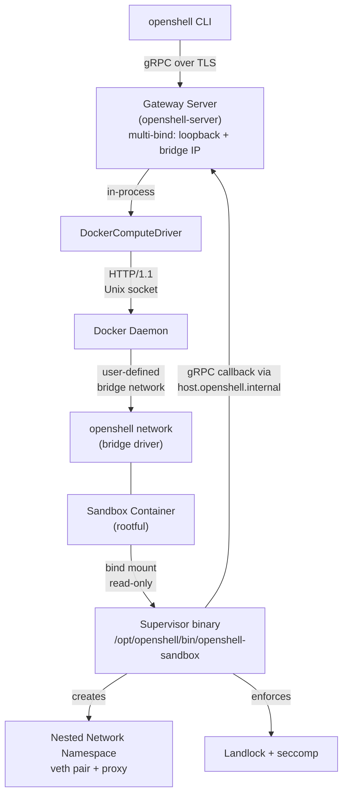
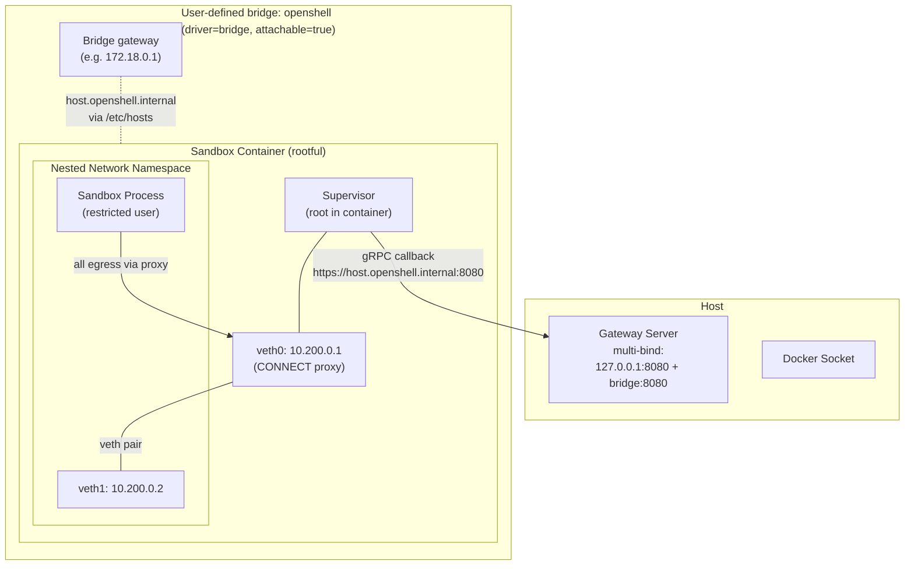
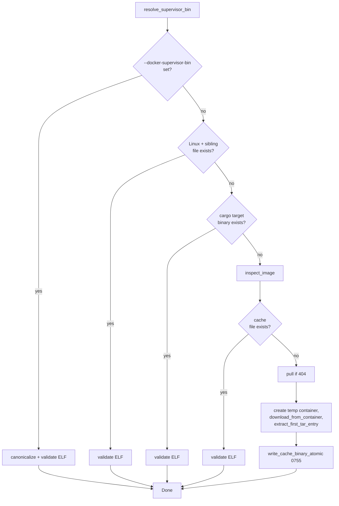

# Docker Compute Driver

The Docker compute driver manages sandbox containers via the local Docker daemon using the `bollard` HTTP client. It targets single-machine and developer environments where a full Kubernetes cluster is undesirable but the operator already runs a Docker daemon. The driver runs in-process within the gateway server and delegates all sandbox isolation enforcement to the `openshell-sandbox` supervisor binary, which is bind-mounted into each container from a host-side path resolved at startup.

Compared to the Podman driver, this driver assumes a rootful daemon, requires HTTPS for the gateway endpoint by default, and mounts a TLS bundle into each sandbox instead of injecting a handshake secret via the daemon's secrets API. See [Comparison with Podman driver](#comparison-with-podman-driver) below.

## Source File Index

All paths are relative to `crates/openshell-driver-docker/src/`. Unlike the Podman driver, the Docker driver is currently a single-file crate.

| File | Purpose |
|------|---------|
| `lib.rs` | Entire driver implementation: `DockerComputeDriver`, `DockerComputeConfig`, network setup, supervisor binary resolution, container spec construction, gRPC `ComputeDriver` trait impl, watch poll loop, capabilities, TLS path validation, container name sanitisation, and tar-based supervisor extraction. |
| `tests.rs` | Unit tests covering loopback URL rewriting, resource-limit parsing, environment construction, network/`extra_hosts` configuration, namespace labelling, ready-condition mapping, ELF validation, supervisor cache pathing, atomic cache writes, and tar-extraction helpers. |

`Cargo.toml` declares the crate as a `lib` only; there is no standalone binary. The driver is constructed in-process by `openshell-server` (see `crates/openshell-server/src/compute/mod.rs`).

## Architecture

The Docker driver is one of four `ComputeDriver` implementations (`kubernetes`, `vm`, `podman`, `docker`). It runs inside the gateway, talks to the local Docker daemon over its default Unix socket via `bollard::Docker::connect_with_local_defaults()`, and delegates per-sandbox isolation to the supervisor running inside each container.



### Driver Comparison

| Aspect | Kubernetes | VM (libkrun) | Podman | Docker |
|--------|-----------|--------------|--------|--------|
| Execution model | In-process | Standalone subprocess (gRPC over UDS) | In-process | In-process |
| Backend | K8s API (CRD + controller) | libkrun hypervisor (KVM/HVF) | Podman REST API (Unix socket) | Docker daemon (Unix socket via `bollard`) |
| Daemon privilege | N/A | N/A | Rootless (default) | Rootful (default) |
| Isolation boundary | Container (supervisor inside pod) | Hardware VM | Container (supervisor inside container) | Container (supervisor inside container) |
| Supervisor delivery | hostPath volume (read-only) | Embedded in rootfs tarball | OCI image volume (read-only) | Host bind mount (read-only) of an extracted/locally-built ELF |
| Network model | Supervisor creates netns inside pod | gvproxy virtio-net (192.168.127.0/24) | Pasta NAT, supervisor creates netns | User-defined Docker bridge, supervisor creates nested netns |
| Gateway reachability | Pod IP / cluster DNS | 127.0.0.1 + allocated port | `host.containers.internal` (`host-gateway`) | `host.openshell.internal` (explicit bridge gateway IP) |
| Gateway transport | gRPC | gRPC | HTTP or HTTPS (auto-built if absent) | HTTPS required; mTLS bundle mounted |
| Credential injection | Plaintext env var + K8s Secret volume (0400) | Rootfs file copy (0600) + env vars | Podman `secret_env` API + env vars | Plaintext env vars + bind-mounted TLS bundle |
| GPU support | Yes (`nvidia.com/gpu`) | No | Yes (CDI device) | No (`supports_gpu: false`) |
| `stop_sandbox` | Unimplemented | Unimplemented | Implemented (graceful stop) | Implemented (graceful stop with timeout) |
| Watch model | K8s watch | Driver subprocess events | Live Podman events | Periodic poll with exponential backoff (2s → 30s) |
| State storage | Kubernetes API (CRD) | In-memory HashMap + filesystem | Podman daemon (container state) | Docker daemon (container state, queried via labels) |

## Isolation Model

The Docker driver provides the same four protection layers as the other container-based drivers. It does not implement isolation primitives directly — it configures the container so that the `openshell-sandbox` supervisor can install Landlock, seccomp, and the nested network namespace at runtime.

### Container Security Configuration

The `host_config` in `build_container_create_body()` (`lib.rs`) sets:

| Setting | Value | Rationale |
|---------|-------|-----------|
| `user` | `"0"` | Supervisor needs root in the container's user namespace for namespace creation, proxy setup, Landlock/seccomp, and bind-mounting `/run/netns`. |
| `cap_add` | `SYS_ADMIN, NET_ADMIN, SYS_PTRACE, SYSLOG` | Added on top of Docker's default capability set. See [capability breakdown](#capability-breakdown) below. |
| `cap_drop` | (not set) | Unlike the Podman driver, the Docker driver does **not** drop all capabilities first. It relies on Docker's default rootful drop set (which already excludes `SYS_ADMIN`, etc.) and re-adds only what the supervisor needs. |
| `security_opt` | `["apparmor=unconfined"]` | Required: Docker's default `docker-default` AppArmor profile denies the mount syscalls the supervisor uses to bind-mount `/run/netns` and mark it shared, even with `CAP_SYS_ADMIN`. The sandbox's own Landlock + seccomp + OPA + dedicated netns combination supersedes container-layer AppArmor. |
| `network_mode` | `config.network_name` (default `openshell`) | Attaches the container to the user-defined bridge instead of Docker's default `bridge` (`docker0`), isolating sandboxes at L2 from unrelated workloads. |
| `extra_hosts` | `["host.openshell.internal:<bridge-gateway-ip>"]` | Maps the canonical OpenShell hostname to the IPv4 gateway of the user-defined bridge. The driver does **not** use Docker's `host-gateway` magic value here — see [Networking](#networking). |
| `restart_policy` | `unless-stopped` | Survives Docker daemon restarts; gateway-initiated stops persist. |
| `entrypoint` | `[/opt/openshell/bin/openshell-sandbox]` | The bind-mounted supervisor binary. |
| `cmd` | `[]` | Cleared so the image's `CMD` does not get appended as supervisor arguments. |
| `nano_cpus`, `memory` | from `template.resources.limits` | Translated from Kubernetes-style quantities (`250m`, `512Mi`, etc.) by `parse_cpu_limit` / `parse_memory_limit`. `resources.requests.*` are explicitly rejected with `FailedPrecondition`. |

`no_new_privileges` is not set explicitly by the driver. (It is enabled by the supervisor itself once it has finished setup.)

### Capability Breakdown

The driver adds four capabilities on top of Docker's default capability set (which is rootful but already drops dangerous capabilities like `SYS_MODULE`, `SYS_BOOT`, `MAC_OVERRIDE`, etc.):

| Capability | Purpose |
|------------|---------|
| `SYS_ADMIN` | Bind-mount `/run/netns`, mark it shared, mount tmpfs, install seccomp filters, create network namespaces, install Landlock rulesets. |
| `NET_ADMIN` | Configure the veth pair, set IPs and routes inside the nested netns, install iptables rules used by the proxy. |
| `SYS_PTRACE` | Read `/proc/<pid>/exe` and walk process ancestry for binary identity in the proxy's binary-fingerprinting logic. |
| `SYSLOG` | Read `/dev/kmsg` for the bypass-detection telemetry the supervisor emits when it observes traffic that escaped the proxy. |

Docker's default rootful capability set already provides `SETUID`, `SETGID`, and `DAC_READ_SEARCH`, so the Docker driver does **not** add them explicitly — they are simply inherited. (The Podman driver re-adds them because it starts from `cap_drop: ALL`.)

All capabilities are only available to the supervisor process. Sandbox child processes lose them after `setuid()` to the sandbox user in the supervisor's `pre_exec` hook.

## Networking

The Docker driver uses a two-layer network model: a dedicated user-defined Docker bridge for container-to-host communication, and a nested network namespace inside each container (created by the supervisor) for sandbox process isolation. The dedicated bridge replaces the default `docker0`, isolating sandboxes from any unrelated containers the operator runs.



### Dedicated user-defined bridge

At startup, `DockerComputeDriver::new()` calls `ensure_network()` (`lib.rs`) to create a Docker network named by `DockerComputeConfig::network_name`. The default value is [`openshell_core::config::DEFAULT_NETWORK_NAME`](../crates/openshell-core/src/config.rs) (`"openshell"`); operators override it via `--network-name` / `OPENSHELL_NETWORK_NAME` (the same env var the Podman driver honours).

`ensure_network()` behaviour:

1. Inspect the network. If it exists and `driver == "bridge"`, log `info` and reuse.
2. If it exists with a non-bridge driver (`overlay`, `macvlan`, …), log `warn` and reuse anyway. The rationale captured in the source: an operator may have pre-provisioned a network deliberately, and refusing to start would break that workflow. Sandboxes "may behave unexpectedly" — the driver does not attempt to validate compatibility further.
3. If the inspect returns 404, create a new bridge network with `attachable: true`.
4. Any other inspect error (daemon down, permission denied, …) is surfaced as `Error::execution` so misconfigured daemons fail fast.

Sandboxes attach to this network via `host_config.network_mode = config.network_name`, which is set unconditionally in `build_container_create_body()`. They do not appear on `docker0`.

### Multi-bind connectivity

When the docker driver is configured **and** the gateway's primary bind address is loopback, the gateway adds the bridge's IPv4 gateway as an extra listener address. This is required because sandboxes on the user-defined bridge cannot reach loopback on the host.

The flow lives in `crates/openshell-server/src/cli.rs`:

1. `bind_only_reaches_loopback(args.bind_address)` returns `true` for `127.0.0.0/8` and `::1`. `0.0.0.0`, `::`, and specific public IPs are assumed to already cover the bridge interface.
2. If both conditions hold, `openshell_driver_docker::ensure_network_and_get_gateway(&args.network_name)` is called. This is a convenience wrapper that connects to the daemon, calls `ensure_network()`, then `host_bridge_gateway_address()` to read the IPv4 gateway from the network's IPAM config.
3. The returned IP is added via `Config::with_extra_bind_address(SocketAddr::from((bridge_ip, port)))`. The resulting listener set is preserved on `Config::extra_bind_addresses` (`crates/openshell-core/src/config.rs`), which the gRPC server uses to bind multiple sockets.
4. Failure here is a hard error: the sandbox-create flow would otherwise be silently broken.

### `host.openshell.internal`

Sandboxes reach the gateway by hostname `host.openshell.internal`. The driver injects this into each container via:

```
extra_hosts: ["host.openshell.internal:<network_gateway_ip>"]
```

Where `network_gateway_ip` is the value resolved by `host_bridge_gateway_address()` at driver startup and stored on `DockerDriverRuntimeConfig::network_gateway_ip`.

The driver deliberately does **not** use Docker's `host-gateway` alias. Comments in `build_container_create_body()` and `host_bridge_gateway_address()` document the reason: `host-gateway` resolves to whatever the daemon was configured with — typically the default `docker0` IP — which is the wrong host-side address when the sandbox sits on a user-defined network. The gateway listener for sandboxes is bound to the user-defined bridge's IP, so the driver injects it explicitly.

The driver also deliberately does **not** inject `host.docker.internal`: that alias is a Docker Desktop convention, not part of the OpenShell sandbox contract. The test `build_container_create_body_attaches_to_dedicated_network` (`tests.rs`) asserts both the explicit IP mapping and the absence of `host.docker.internal`.

### Loopback URL rewrite

`container_visible_openshell_endpoint()` in `lib.rs` rewrites the gateway URL the sandbox sees in its environment so that operators can configure a single loopback endpoint and have it transparently work inside containers. The rewrite logic:

1. Parse `OPENSHELL_GRPC_ENDPOINT` as a URL. If it does not parse, pass through unchanged.
2. Inspect the host:
   - IPv4 loopback or unspecified (`127.0.0.1`, `0.0.0.0`) → rewrite.
   - IPv6 loopback or unspecified (`::1`, `::`) → rewrite.
   - Domain `localhost` (case-insensitive) → rewrite.
   - Anything else → pass through unchanged.
3. If rewriting, replace the host with `host.openshell.internal` and emit the URL into `OPENSHELL_ENDPOINT` for the container.

Tests in `tests.rs::container_visible_endpoint_rewrites_loopback_hosts` cover `https://localhost:8443`, `http://127.0.0.1:8080`, and the pass-through case `https://gateway.internal:8443`.

This means an operator can run the gateway with `--bind-address 127.0.0.1` and `OPENSHELL_GRPC_ENDPOINT=http://127.0.0.1:8080` — the multi-bind logic adds the bridge listener, the env-var rewrite points sandboxes at `host.openshell.internal`, and `extra_hosts` resolves the name to the bridge gateway IP.

### Environment

`build_environment()` constructs the container env. Driver-controlled keys overwrite anything the template provides, in this order: template env, then spec env, then driver-controlled (`OPENSHELL_ENDPOINT`, `OPENSHELL_SANDBOX_ID`, `OPENSHELL_SANDBOX`, `OPENSHELL_SSH_SOCKET_PATH`, `OPENSHELL_SANDBOX_COMMAND`, optional `OPENSHELL_TLS_*` paths). `HOME`, `PATH`, `TERM`, and `OPENSHELL_LOG_LEVEL` are also set as defaults.

Notably absent: `OPENSHELL_SSH_HANDSHAKE_SECRET` and `OPENSHELL_SSH_HANDSHAKE_SKEW_SECS`. The Docker driver does not inject the handshake secret — the test `build_environment_sets_docker_tls_paths` asserts that no env entry starts with `OPENSHELL_SSH_HANDSHAKE_SECRET=`. (This is a difference from the Podman driver. The Docker driver relies on mTLS for the gateway↔supervisor handshake; whether a separate handshake secret should still be injected is not addressed by the current source — flagged here as a question for the reader rather than guessed at.)

## Sandbox security: TLS bundle

The Docker driver enforces HTTPS for the gateway endpoint and mounts a TLS bundle into each sandbox. `docker_guest_tls_paths()` validates the configuration:

| `OPENSHELL_GRPC_ENDPOINT` scheme | TLS flags provided | Result |
|---|---|---|
| `https://…` | All three (`--docker-tls-ca`, `--docker-tls-cert`, `--docker-tls-key`) | Returns canonicalised bundle paths. |
| `https://…` | None | Hard error: "docker compute driver requires …" |
| `https://…` | Some but not all | Hard error naming the missing flag. |
| `http://…` | Any | Hard error: "TLS materials require an https:// endpoint". |
| `http://…` | None | Returns `None` — no bundle mounted. (Matches `tests.rs::docker_guest_tls_paths_allows_plain_http_without_tls_flags`, but in practice the gateway-side validation usually mandates HTTPS.) |

When a bundle is configured, `build_mounts()` adds three read-only bind mounts:

| Container path | Source | Env var |
|---|---|---|
| `/etc/openshell/tls/client/ca.crt` | `--docker-tls-ca` | `OPENSHELL_TLS_CA` |
| `/etc/openshell/tls/client/tls.crt` | `--docker-tls-cert` | `OPENSHELL_TLS_CERT` |
| `/etc/openshell/tls/client/tls.key` | `--docker-tls-key` | `OPENSHELL_TLS_KEY` |

The supervisor reads these env vars at startup to load its mTLS client identity for the gateway gRPC channel.

## Supervisor binary delivery

Unlike Podman (OCI image volume) or VM (embedded rootfs), the Docker driver bind-mounts a **host-side** Linux ELF as `/opt/openshell/bin/openshell-sandbox` and uses it as the entrypoint. `resolve_supervisor_bin()` (`lib.rs`) walks four tiers in order; the first hit wins:

1. **Explicit override** — `--docker-supervisor-bin` / `OPENSHELL_DOCKER_SUPERVISOR_BIN`. Canonicalised, then validated as a Linux ELF (`validate_linux_elf_binary` checks the `\x7fELF` magic bytes).
2. **Sibling binary** — On Linux only, look for `openshell-sandbox` next to the running gateway executable (the release artifact layout). Validated as ELF.
3. **Local cargo build** — `target/x86_64-unknown-linux-gnu/release/openshell-sandbox` or `target/aarch64-unknown-linux-gnu/release/openshell-sandbox`, depending on the Docker daemon's reported architecture (`normalize_docker_arch` maps `x86_64` → `amd64`, `aarch64` → `arm64`). Preferred over a registry pull because it matches whatever the developer just built. (`linux_supervisor_candidates_follow_daemon_arch` test.)
4. **Image extraction** — Pull `--docker-supervisor-image` (default `ghcr.io/nvidia/openshell/supervisor:<tag>`, where `<tag>` is resolved by `default_docker_supervisor_image_tag` from `OPENSHELL_IMAGE_TAG` → `IMAGE_TAG` → `CARGO_PKG_VERSION` → `"dev"`), create a throwaway container, stream `/usr/local/bin/openshell-sandbox` out of `/containers/<id>/archive`, untar the single entry, and write it atomically to `<XDG_DATA_DIR>/openshell/docker-supervisor/<digest>/openshell-sandbox`. The cache is keyed by the image's content digest so rollouts are isolated. The temp file is `chmod 0755`, fsynced, and renamed into place.



The extracted binary lives outside the container; it is bind-mounted read-only into each sandbox.

## Sandbox Lifecycle

### Creation

`create_sandbox_inner()` flow:

1. `validate_sandbox()` — require `spec.template.image`, reject `spec.gpu`, reject `template.agent_socket_path`, reject non-empty `template.platform_config`, validate resource limits (`docker_resource_limits` rejects `resources.requests.cpu` and `resources.requests.memory`).
2. `find_managed_container_summary()` — return `AlreadyExists` if a container with the same id/name labels exists.
3. `ensure_image_available()` — honour `image_pull_policy` (`always`, `ifnotpresent`/`""`, `never`).
4. Build container spec (`build_container_create_body`) with sanitised name (`container_name_for_sandbox`), labels (`managed-by`, `sandbox-id`, `sandbox-name`, `sandbox-namespace`), env, mounts, `host_config`.
5. `docker.create_container()` with the chosen name. A 409 conflict is mapped to `AlreadyExists`.
6. `docker.start_container()`. On start failure, force-remove the container; if cleanup fails, log a warning but propagate the original error.

There is no separate volume or secret rollback (in contrast to the Podman driver) because the Docker driver does not create volumes or secrets.

### Readiness

`container_ready_condition()` maps Docker container states to the `Ready` condition:

| Docker state | + supervisor connected? | `Ready` | Reason |
|---|---|---|---|
| `RUNNING` | yes | `True` | `SupervisorConnected` |
| `RUNNING` | no | `False` | `DependenciesNotReady` |
| `CREATED`, `EMPTY` | — | `False` | `Starting` |
| `RESTARTING` | — | `False` | `ContainerRestarting` |
| `PAUSED` | — | `False` | `ContainerPaused` |
| `EXITED` | — | `False` | `ContainerExited` |
| `REMOVING` | — | `False` (deleting) | `Deleting` |
| `DEAD` | — | `False` | `ContainerDead` |

"Supervisor connected" is queried via the `SupervisorReadiness` trait — implemented by the gateway's `SupervisorSessionRegistry` — because the driver cannot observe the supervisor's in-container Unix socket directly. The `driver_status_keeps_running_sandboxes_provisioning_with_stable_message` test asserts that `RUNNING` without a connected supervisor stays `Ready=False/DependenciesNotReady` and that supervisor readiness is ignored for non-`RUNNING` states.

### Stop, delete, resume, shutdown

| Operation | Method | Behaviour |
|---|---|---|
| `stop_sandbox` | `stop_sandbox_inner` | Graceful stop with `t = stop_timeout_secs` (default `DEFAULT_STOP_TIMEOUT_SECS = 10`). 304 (already stopped) → `Ok`. 404 → `NotFound`. |
| `delete_sandbox` | `delete_sandbox_inner` | Force-remove (`force=true`). 404 → `Ok(false)`. Returns `false` when no managed container is found. |
| `resume_sandbox` | `resume_sandbox` | Used by the gateway after a restart to reconcile state. Starts containers in `EXITED` or `CREATED` state; treats `RUNNING` and 304 as success; 404 → `Ok(false)`. (`container_state_needs_resume` test enumerates the matrix.) |
| Shutdown sweep | `stop_managed_containers_on_shutdown` | Lists managed containers, filters to `RUNNING`/`RESTARTING`/`PAUSED` (`container_state_needs_shutdown_stop`), stops them concurrently with `buffer_unordered(16)`, treats 404/304 as success, and returns the count. Failures are aggregated and reported as a single `Status::internal`. |

### Watch loop

The driver does not subscribe to Docker events. Instead, `poll_loop()` polls `current_snapshot_map()` every `WATCH_POLL_INTERVAL` (2 s) and emits `WatchSandboxesEvent` deltas via a `tokio::sync::broadcast` channel. On Docker errors the interval doubles up to `WATCH_POLL_MAX_BACKOFF` (30 s) to avoid log floods when the daemon is unreachable, and resets to 2 s on the next success. `emit_snapshot_diff()` emits a sandbox event when the snapshot changes and a `WatchSandboxesDeletedEvent` when a sandbox disappears.

`watch_sandboxes()` subscribes to the broadcast first, then takes an initial snapshot, so any event between the snapshot and subscription is still delivered (downstream consumers treat events as idempotent by sandbox id).

### Container naming

`container_name_for_sandbox()` produces `openshell-<sanitised-name>-<sanitised-id>`, with the id suffix always preserved (it is what makes names unique between sandboxes sharing a prefix). Names are clamped to `MAX_CONTAINER_NAME_LEN = 200` bytes; truncation happens in the human-readable name segment, and trailing `-`/`_`/`.` are stripped (`trim_container_name_tail`) to satisfy Docker's name regex.

### Labels

Every container is labelled with:

| Key | Value |
|---|---|
| `openshell.ai/managed-by` | `openshell` |
| `openshell.ai/sandbox-id` | `sandbox.id` |
| `openshell.ai/sandbox-name` | `sandbox.name` |
| `openshell.ai/sandbox-namespace` | `config.sandbox_namespace` (the driver's runtime config, **not** `DriverSandbox.namespace`) |

The namespace label sourcing is deliberate: the gateway elides `DriverSandbox.namespace` on the request path. Using it would label containers with an empty value that the driver could not subsequently find via its own filters. The regression test `build_container_create_body_uses_runtime_namespace_label` pins this behaviour.

`require_sandbox_identifier()` rejects `delete_sandbox`/`stop_sandbox`/`get_sandbox` requests where both id and name are empty. Without that guard the label filters degenerate to "match every managed container in the namespace", which would let an arbitrary sandbox be deleted.

## Configuration

| Environment Variable | CLI Flag | Default | Description |
|---|---|---|---|
| (none) | (auto) | `unix:///var/run/docker.sock` (via `Docker::connect_with_local_defaults()`) | Docker daemon socket. |
| `OPENSHELL_NETWORK_NAME` | `--network-name` | `openshell` (`DEFAULT_NETWORK_NAME`) | User-defined bridge network name. |
| `OPENSHELL_DOCKER_SUPERVISOR_BIN` | `--docker-supervisor-bin` | (auto-resolved) | Explicit host path to the Linux `openshell-sandbox` ELF. |
| `OPENSHELL_DOCKER_SUPERVISOR_IMAGE` | `--docker-supervisor-image` | `ghcr.io/nvidia/openshell/supervisor:<tag>` | Image used to extract the supervisor binary in tier 4. |
| `OPENSHELL_DOCKER_TLS_CA` | `--docker-tls-ca` | (required if HTTPS) | Host path to the gateway CA certificate. |
| `OPENSHELL_DOCKER_TLS_CERT` | `--docker-tls-cert` | (required if HTTPS) | Host path to the sandbox client certificate. |
| `OPENSHELL_DOCKER_TLS_KEY` | `--docker-tls-key` | (required if HTTPS) | Host path to the sandbox client private key. |
| `OPENSHELL_GRPC_ENDPOINT` | `--grpc-endpoint` | (required) | Gateway gRPC endpoint. Loopback hosts are rewritten to `host.openshell.internal` before injection into containers. |
| `OPENSHELL_SANDBOX_IMAGE` | `--sandbox-image` | (gateway config) | Default sandbox OCI image. |
| `OPENSHELL_SANDBOX_IMAGE_PULL_POLICY` | `--sandbox-image-pull-policy` | `IfNotPresent` | One of `Always`, `IfNotPresent`, `Never`. |

Stop timeout is fixed at `DEFAULT_STOP_TIMEOUT_SECS` (10 s) by `DockerComputeDriver::new`; there is no Docker-driver-specific override flag.

## Comparison with Podman driver

Both drivers serve the same role — a single-node, container-based compute backend — but make different choices that follow from rootful vs rootless daemons.

| Concern | Podman | Docker |
|---|---|---|
| Daemon privilege | Rootless by default | Rootful by default |
| Capability handling | `cap_drop: ALL` then add 7 caps including `SETUID`, `SETGID`, `DAC_READ_SEARCH` | No `cap_drop`; add 4 caps on top of Docker's default rootful set |
| Network primitive | Pasta NAT + Podman bridge network | User-defined Docker bridge (driver=`bridge`, `attachable: true`) |
| Network name source | `OPENSHELL_NETWORK_NAME` (default `openshell`) | `OPENSHELL_NETWORK_NAME` (default `openshell`) — same env var |
| Host-gateway alias | Uses Podman's `host-gateway` value via `hostadd` (libpod term) → maps `host.containers.internal` | Does **not** use Docker's `host-gateway` (it resolves to `docker0`, wrong for user-defined networks). Injects `host.openshell.internal:<bridge-gateway-ip>` literally via `extra_hosts` (Docker term). |
| In-container hostname | `host.containers.internal` | `host.openshell.internal` |
| Gateway transport | Plaintext HTTP supported (auto-built if no endpoint provided); HTTPS optional | HTTPS required when TLS bundle is provided; plaintext HTTP only when no TLS flags are set |
| Handshake credential | SSH handshake secret injected via Podman `secret_env` API (not visible in `docker inspect`-equivalent) | TLS bundle bind-mounted (CA, cert, key) into `/etc/openshell/tls/client/`. No SSH handshake secret env var (`OPENSHELL_SSH_HANDSHAKE_SECRET` is intentionally absent). |
| AppArmor | Not relevant (rootless containers run unconfined) | Explicit `security_opt: ["apparmor=unconfined"]` to allow `/run/netns` bind-mount |
| Supervisor delivery | OCI image volume (`image_volumes` field at libpod layer) | Host bind mount of an extracted/locally-built ELF |
| `tmpfs` at `/run/netns` | Mounted by the driver | Not mounted by the driver — the supervisor handles `/run/netns` setup itself once `apparmor=unconfined` lets it bind-mount there |
| Stop timeout config | Configurable via `OPENSHELL_STOP_TIMEOUT` | Fixed at `DEFAULT_STOP_TIMEOUT_SECS` (no flag) |
| Watch model | Live Podman event stream | 2s → 30s exponential-backoff polling |
| Multi-bind helper | N/A (Podman networking + `host-gateway` works without it) | `ensure_network_and_get_gateway()` + `Config::with_extra_bind_address()` when primary bind is loopback |

## Implementation References

- Driver crate: `crates/openshell-driver-docker/src/lib.rs`
- Driver tests: `crates/openshell-driver-docker/src/tests.rs`
- Gateway integration: `crates/openshell-server/src/compute/mod.rs` (constructs `DockerComputeDriver`, implements `ShutdownCleanup` and `StartupResume`)
- Multi-bind setup: `crates/openshell-server/src/cli.rs` (`bind_only_reaches_loopback`, `ensure_network_and_get_gateway` call, `with_extra_bind_address`)
- Default network name: `crates/openshell-core/src/config.rs` (`DEFAULT_NETWORK_NAME`)
- Extra bind addresses: `crates/openshell-core/src/config.rs` (`Config::extra_bind_addresses`, `Config::with_extra_bind_address`)
- Supervisor binary: `crates/openshell-sandbox/src/` (Landlock, seccomp, netns, proxy — shared by all drivers)
- Supervisor image build: `deploy/docker/Dockerfile.images` (`supervisor-output` target produces the `ghcr.io/nvidia/openshell/supervisor` image)
- Companion driver: [Podman Driver](podman-driver.md)
