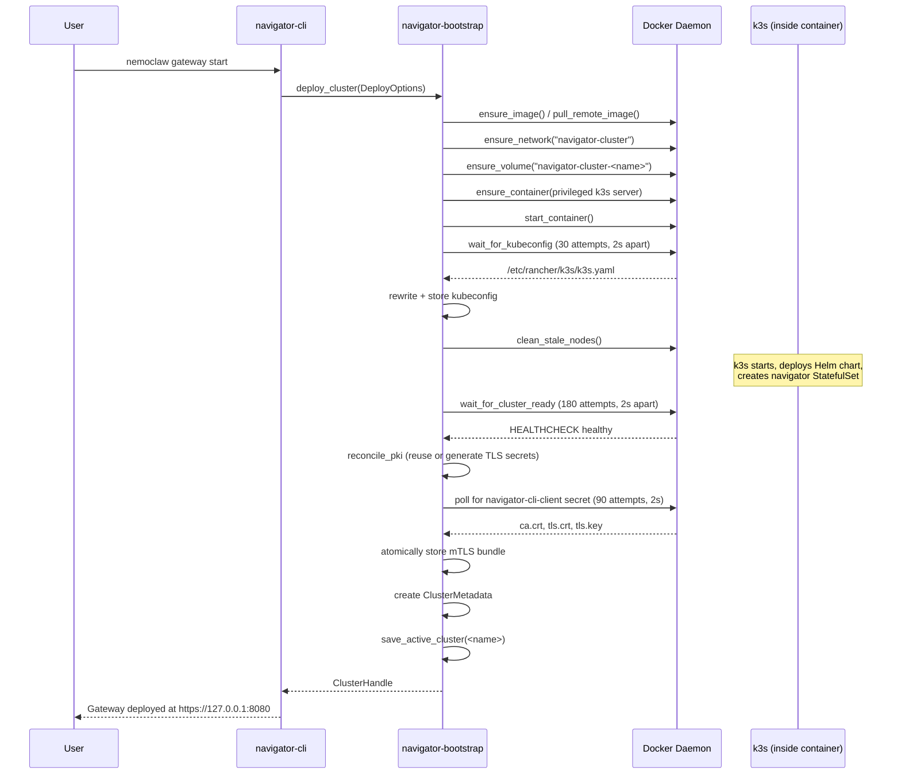
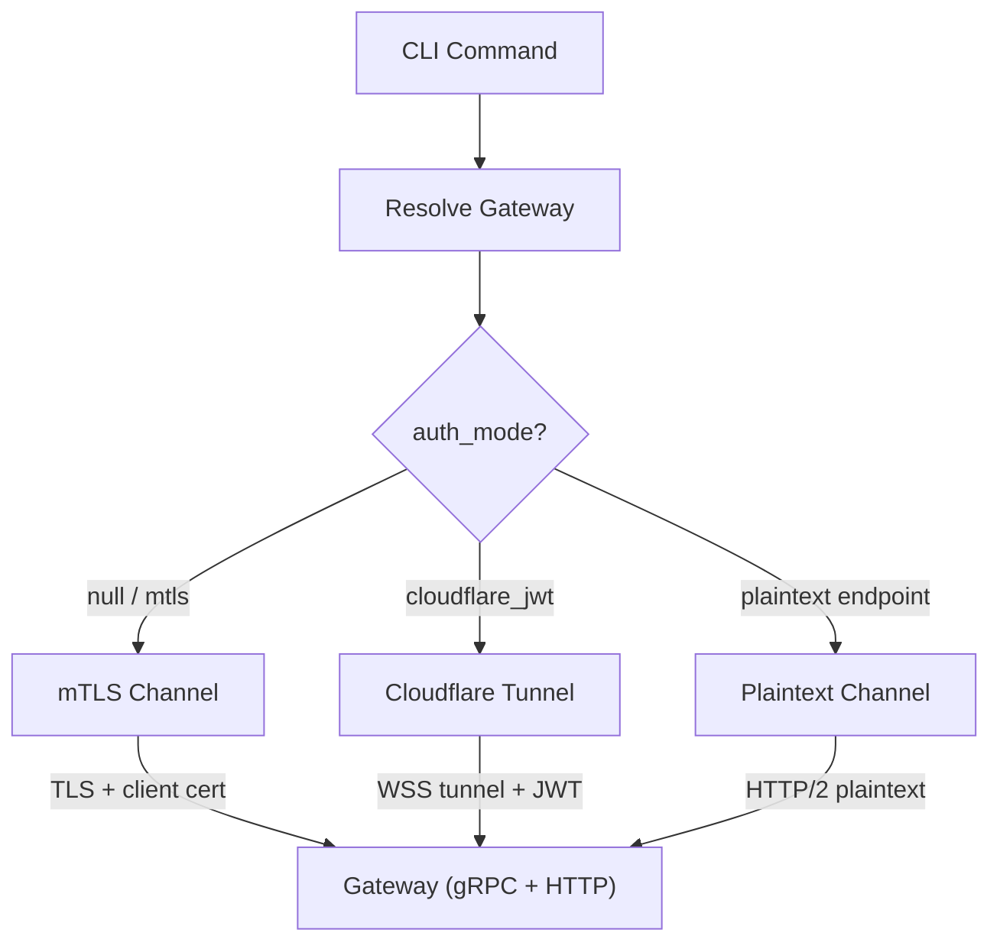
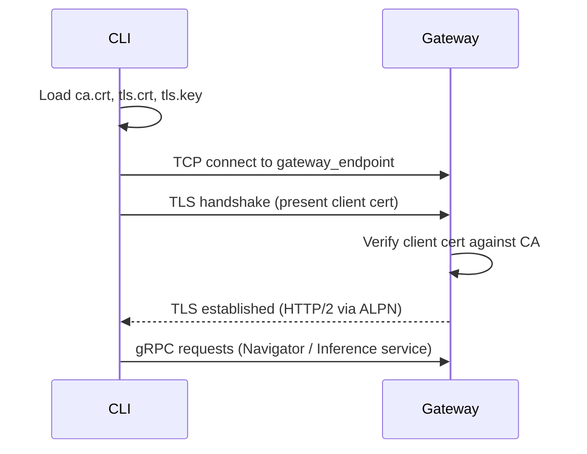
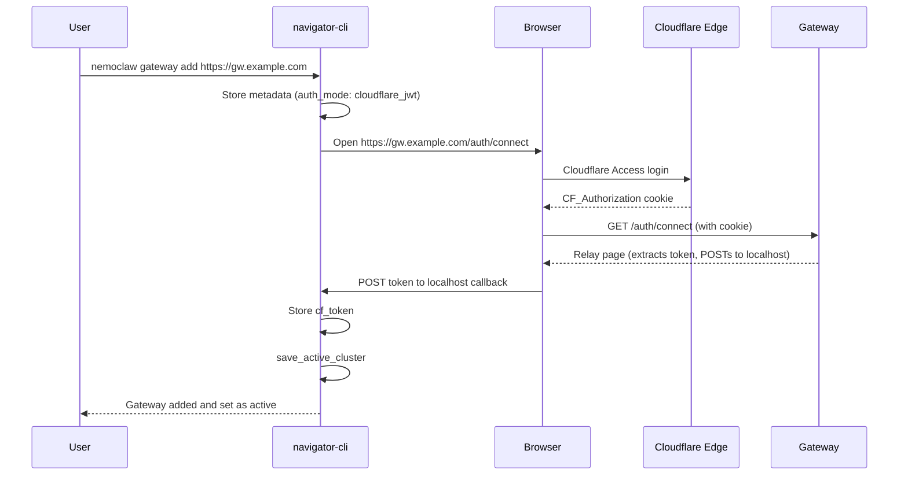

# Deploying and Connecting to a Gateway

## Overview

This document describes the end-to-end flow of deploying a NemoClaw gateway and connecting to it from the CLI. The gateway is the central control plane for a NemoClaw cluster -- it exposes gRPC and HTTP services on a single multiplexed port, manages sandbox lifecycle, persists state, and provides SSH tunneling into sandbox pods. Before any sandboxes can be created, a gateway must be deployed and reachable.

Deployment provisions a single-node k3s Kubernetes cluster inside a Docker container, bootstraps PKI, deploys the gateway workload via Helm, and stores connection artifacts (kubeconfig, mTLS certificates, endpoint metadata) on the user's machine. Connecting resolves the target gateway from local metadata, establishes a TLS-secured gRPC channel, and uses that channel for all subsequent operations.

There are three deployment modes:

1. **Local** -- Docker on the user's machine, gateway reachable at `127.0.0.1:<port>`.
2. **Remote** -- Docker on a remote host accessed via SSH, gateway reachable at `<remote-host>:<port>`.
3. **Cloudflare-fronted** -- a gateway already running behind Cloudflare Access, added via `gateway add` (no deployment, only registration and browser-based auth).

## Components

| Component | File | Purpose |
|-----------|------|---------|
| CLI entry point | `crates/navigator-cli/src/main.rs` | Gateway subcommand definitions (`start`, `stop`, `destroy`, `info`, `tunnel`, `select`, `add`, `login`) |
| CLI implementations | `crates/navigator-cli/src/run.rs` | `cluster_admin_deploy()`, `gateway_add()`, `gateway_login()`, lifecycle operations |
| Bootstrap orchestrator | `crates/navigator-bootstrap/src/lib.rs` | `deploy_cluster_with_logs()` -- full deploy sequence |
| Docker operations | `crates/navigator-bootstrap/src/docker.rs` | Network, volume, container creation (`ensure_container()`) |
| Image management | `crates/navigator-bootstrap/src/image.rs` | Registry pull with distribution credentials |
| Runtime operations | `crates/navigator-bootstrap/src/runtime.rs` | Kubeconfig polling, health checks, stale node cleanup |
| PKI generation | `crates/navigator-bootstrap/src/pki.rs` | `generate_pki()` -- CA, server cert, client cert |
| PKI reconciliation | `crates/navigator-bootstrap/src/lib.rs` | `reconcile_pki()` -- reuse or regenerate cluster TLS secrets |
| mTLS extraction | `crates/navigator-bootstrap/src/mtls.rs` | `fetch_and_store_cli_mtls()` -- extract certs from K8s secrets |
| Metadata storage | `crates/navigator-bootstrap/src/metadata.rs` | `ClusterMetadata` struct, `store_cluster_metadata()`, `save_active_cluster()` |
| TLS / channel | `crates/navigator-cli/src/tls.rs` | `TlsOptions`, `build_channel()`, `grpc_client()` |
| CF tunnel proxy | `crates/navigator-cli/src/cf_tunnel.rs` | `start_tunnel_proxy()` -- WebSocket tunnel for Cloudflare |
| Browser auth | `crates/navigator-cli/src/auth.rs` | `browser_auth_flow()` -- CF Access login |
| Auto-bootstrap | `crates/navigator-cli/src/bootstrap.rs` | `should_attempt_bootstrap()`, `run_bootstrap()` |
| Container image | `deploy/docker/Dockerfile.cluster` | k3s base + Helm charts + manifests + entrypoint |
| Entrypoint script | `deploy/docker/cluster-entrypoint.sh` | DNS proxy, registry config, manifest injection |
| Healthcheck script | `deploy/docker/cluster-healthcheck.sh` | K8s API + StatefulSet + gateway readiness checks |
| Helm chart | `deploy/helm/navigator/` | StatefulSet, Service (NodePort), NetworkPolicy, values |

## CLI Commands

### Deploy and lifecycle

| Command | Description |
|---------|-------------|
| `nemoclaw gateway start [OPTIONS]` | Deploy or update a gateway cluster |
| `nemoclaw gateway stop [--name NAME]` | Stop the container (preserves state) |
| `nemoclaw gateway destroy [--name NAME]` | Destroy container, volume, metadata, and network |
| `nemoclaw gateway info [--name NAME]` | Show deployment details (endpoint, kubeconfig, SSH host) |
| `nemoclaw gateway tunnel [--name NAME]` | SSH tunnel for kubectl access to remote clusters |
| `nemoclaw gateway select [NAME]` | Set or list active gateway(s) |
| `nemoclaw status` | Check gateway health via gRPC Health RPC |

### Registration (Cloudflare-fronted)

| Command | Description |
|---------|-------------|
| `nemoclaw gateway add <endpoint>` | Register a Cloudflare-fronted gateway and authenticate via browser |
| `nemoclaw gateway login [NAME]` | Re-authenticate with a CF gateway |

### `gateway start` flags

| Flag | Default | Description |
|------|---------|-------------|
| `--name <NAME>` | `nemoclaw` | Cluster name |
| `--remote <USER@HOST>` | none | SSH destination for remote deployment |
| `--ssh-key <PATH>` | none | SSH private key for remote |
| `--port <PORT>` | `8080` | Host port mapped to the gateway |
| `--gateway-host <HOST>` | none | Override the gateway host in metadata |
| `--kube-port [PORT]` | none | Expose K8s control plane on a host port |
| `--recreate` | `false` | Destroy and recreate if the cluster exists |
| `--plaintext` | `false` | Disable TLS (for use behind a reverse proxy) |
| `--disable-gateway-auth` | `false` | Allow connections without client certificates |

## Deployment Flow

### Sequence Diagram



### Step-by-step

**1. Entry and client selection** (`crates/navigator-cli/src/run.rs` -- `cluster_admin_deploy()`):

The CLI builds `DeployOptions` from command flags and dispatches to `deploy_cluster_with_logs()`. For remote deployments, an SSH-based Docker client is created via `Docker::connect_with_ssh()` (600-second timeout for large image transfers). For local deployments, the local Docker daemon is used.

**2. Image readiness** (`crates/navigator-bootstrap/src/image.rs`):

The cluster image ref is resolved from `NEMOCLAW_CLUSTER_IMAGE` (if set) or the default distribution registry. Local deploys inspect the local daemon and pull if missing. Remote deploys query the remote daemon's architecture, pull the platform-specific variant, and tag it locally.

**3. Infrastructure provisioning** (`crates/navigator-bootstrap/src/docker.rs`):

Three Docker resources are created (or reused if they already exist):

- **Bridge network** `navigator-cluster` (attachable).
- **Volume** `navigator-cluster-<name>` for persistent k3s state.
- **Container** `navigator-cluster-<name>` running a privileged k3s server.

The container port mapping connects the host port (default 8080) to the k3s NodePort 30051, which routes to the gateway pod's port 8080.

```
Host :8080  -->  Container :30051 (NodePort)  -->  Pod :8080 (gateway)
```

Extra TLS SANs are computed based on the deployment mode:
- **Local**: checks `DOCKER_HOST` for non-loopback TCP endpoints.
- **Remote**: resolves the SSH destination hostname via `ssh -G`.

**4. k3s readiness and artifact extraction** (`crates/navigator-bootstrap/src/runtime.rs`):

After the container starts:

1. Poll for kubeconfig availability (up to 60 seconds).
2. Rewrite the kubeconfig to use `127.0.0.1:6443` and rename entries to the cluster name.
3. Store kubeconfig at `~/.config/nemoclaw/clusters/<name>/kubeconfig`.
4. Clean stale k3s nodes from previous container instances.
5. Push local development images if `NEMOCLAW_PUSH_IMAGES` is set.
6. Wait for Docker HEALTHCHECK to report healthy (up to 6 minutes).

**5. PKI and mTLS** (`crates/navigator-bootstrap/src/lib.rs` -- `reconcile_pki()`):

The bootstrap reconciles TLS secrets in Kubernetes:

- If existing secrets are complete and valid PEM, they are reused.
- If secrets are missing or malformed, fresh PKI is generated via `rcgen`: a self-signed CA, a server certificate (with computed SANs), and a shared client certificate.
- Three K8s secrets are created: `navigator-server-tls`, `navigator-server-client-ca`, and `navigator-client-tls`.
- If PKI was rotated and the gateway workload was already running, a rollout restart is performed.

The CLI's mTLS bundle is extracted from the `navigator-cli-client` K8s secret and stored atomically at `~/.config/nemoclaw/clusters/<name>/mtls/` (write to `.tmp`, validate, rename).

**6. Metadata persistence** (`crates/navigator-bootstrap/src/metadata.rs`):

A `ClusterMetadata` JSON file is written to `~/.config/nemoclaw/clusters/<name>_metadata.json`:

```json
{
  "name": "nemoclaw",
  "gateway_endpoint": "https://127.0.0.1:8080",
  "is_remote": false,
  "gateway_port": 8080,
  "remote_host": null,
  "resolved_host": null,
  "auth_mode": null,
  "cf_team_domain": null,
  "cf_auth_url": null
}
```

The cluster is set as the active cluster by writing its name to `~/.config/nemoclaw/active_cluster`.

## Infrastructure Stack

The deployed gateway runs in a layered infrastructure:

```
Host Machine
  └── Docker Container (k3s server, privileged)
        └── k3s Kubernetes
              └── Namespace: navigator
                    ├── StatefulSet: navigator (1 replica)
                    │     ├── Container: navigator-server
                    │     ├── Volume: navigator-data (1Gi PVC at /var/navigator)
                    │     ├── Volume: tls-cert (from Secret navigator-server-tls)
                    │     └── Volume: tls-client-ca (from Secret navigator-server-client-ca)
                    ├── Service: navigator (NodePort 30051 -> port 8080)
                    └── NetworkPolicy: navigator (restrict sandbox SSH ingress)
```

### Port chain

| Layer | Port | Notes |
|-------|------|-------|
| Host (Docker) | configurable (default 8080) | `--port` flag on `gateway start` |
| Container | 30051 | Hardcoded NodePort in `docker.rs` |
| k3s NodePort | 30051 | `values.yaml` (`service.nodePort`) |
| k3s Service | 8080 | `values.yaml` (`service.port`) |
| Gateway pod | 8080 | `NEMOCLAW_SERVER_PORT` (Helm default) |

## Connection Flow

### Gateway resolution

When any CLI command needs to talk to the gateway, it resolves the target through a priority chain (`crates/navigator-cli/src/main.rs` -- `resolve_gateway()`):

1. `--gateway-endpoint <URL>` flag (direct URL, bypasses metadata).
2. `--cluster <NAME>` / `-g <NAME>` flag.
3. `NEMOCLAW_CLUSTER` environment variable.
4. Active cluster from `~/.config/nemoclaw/active_cluster`.

Resolution loads `ClusterMetadata` from disk to get the `gateway_endpoint` URL and `auth_mode`.

### Connection modes



### mTLS connection (default)

**File**: `crates/navigator-cli/src/tls.rs` -- `build_channel()`

The default mode for self-deployed gateways. The CLI loads three PEM files from `~/.config/nemoclaw/clusters/<name>/mtls/`:

| File | Purpose |
|------|---------|
| `ca.crt` | Cluster CA certificate -- verifies the gateway's server cert |
| `tls.crt` | Client certificate -- proves the CLI's identity to the gateway |
| `tls.key` | Client private key |

These are used to build a `tonic::transport::ClientTlsConfig`, which configures a `tonic::transport::Channel` for gRPC communication over HTTP/2 with mTLS.



### Cloudflare connection

**Files**: `crates/navigator-cli/src/cf_tunnel.rs`, `crates/navigator-cli/src/auth.rs`

For gateways behind Cloudflare Access, the CLI routes traffic through a local WebSocket tunnel proxy:

1. `start_tunnel_proxy()` binds an ephemeral local TCP port.
2. Opens a WebSocket connection (`wss://<gateway>/_ws_tunnel`) to the Cloudflare edge with the stored JWT in headers.
3. The gateway's `ws_tunnel.rs` handler upgrades the WebSocket and bridges it to an in-memory `MultiplexService` instance.
4. The gRPC channel connects to `http://127.0.0.1:<local_port>` (plaintext HTTP/2 over the tunnel).

Authentication uses a browser-based flow: `gateway add` opens the user's browser to the gateway's `/auth/connect` endpoint, which reads the `CF_Authorization` cookie and relays it back to a localhost callback server. The token is stored at `~/.config/nemoclaw/clusters/<name>/cf_token`.

### Plaintext connection

When the gateway is deployed with `--plaintext`, TLS is disabled entirely. The CLI connects over plain HTTP/2. This mode is intended for gateways behind a trusted reverse proxy or tunnel that handles TLS termination.

## File System Layout

All connection artifacts are stored under `$XDG_CONFIG_HOME/nemoclaw/` (default `~/.config/nemoclaw/`):

```
nemoclaw/
  active_cluster                          # plain text: active cluster name
  clusters/
    <name>_metadata.json                  # ClusterMetadata JSON
    <name>/
      kubeconfig                          # rewritten kubeconfig for kubectl
      mtls/                               # mTLS bundle (when TLS enabled)
        ca.crt                            # cluster CA certificate
        tls.crt                           # client certificate
        tls.key                           # client private key
      cf_token                            # Cloudflare JWT (when auth_mode=cloudflare_jwt)
```

## Auto-Bootstrap from `sandbox create`

When `nemoclaw sandbox create` cannot connect to a gateway (connection refused, DNS error, or missing default TLS certificates), the CLI offers to deploy one automatically.

**File**: `crates/navigator-cli/src/bootstrap.rs`

1. `should_attempt_bootstrap()` inspects the error. Returns `true` for connectivity errors and missing default TLS materials; returns `false` for TLS handshake or authentication errors (which indicate a gateway exists but the client has bad credentials).
2. If the terminal is interactive, the user is prompted to confirm.
3. `run_bootstrap()` deploys a cluster named `"nemoclaw"` with default options, sets it as active, and returns fresh `TlsOptions` pointing to the newly written mTLS certificates.
4. The original `sandbox create` command retries with the new connection.

## Registering a Cloudflare-Fronted Gateway

For gateways that are already deployed behind Cloudflare Access, deployment is not needed -- only registration.

**File**: `crates/navigator-cli/src/run.rs` -- `gateway_add()`



## Verifying Connectivity

After deployment or registration, verify the gateway is reachable:

```bash
nemoclaw status
```

This calls the `Health` gRPC RPC and reports the service status and version. If the connection fails, the error message indicates whether the issue is at the network, TLS, or application layer.

## Failure Modes

| Scenario | Behavior | Resolution |
|----------|----------|------------|
| Docker not running | Deploy fails with Docker connection error | Start the Docker daemon |
| Port already in use | Container creation fails | Use `--port` to choose a different host port |
| Image pull failure | Deploy fails during image readiness | Check network connectivity and registry credentials |
| Kubeconfig timeout (60s) | Deploy fails with recent container logs | Check Docker logs; the k3s container may have crashed |
| Health check timeout (6 min) | Deploy fails with diagnostic logs | Inspect container logs for workload failures |
| mTLS secret timeout (3 min) | Deploy fails waiting for PKI | Check navigator pod logs for startup errors |
| Container exited during polling | Deploy fails with exit code, OOM status, and logs | Increase Docker memory limits; check for resource constraints |
| Wrong TLS certs (e.g., after redeploy) | CLI connection rejected | Re-run `nemoclaw gateway start` to reconcile PKI |
| CF token expired | gRPC calls fail with auth errors | Run `nemoclaw gateway login` to re-authenticate |
| Gateway unreachable from `sandbox create` | CLI offers auto-bootstrap | Confirm to deploy, or check network/firewall |

## Cross-References

- [Gateway Architecture](gateway.md) -- gateway internals: multiplexing, gRPC services, persistence, shared state
- [Gateway Security](gateway-security.md) -- mTLS enforcement, PKI hierarchy, certificate lifecycle, Cloudflare auth modes
- [Cluster Bootstrap Architecture](cluster-single-node.md) -- detailed bootstrap sequence, container image, entrypoint, environment variables
- [Sandbox Connect](sandbox-connect.md) -- SSH tunneling through the gateway into sandbox pods
