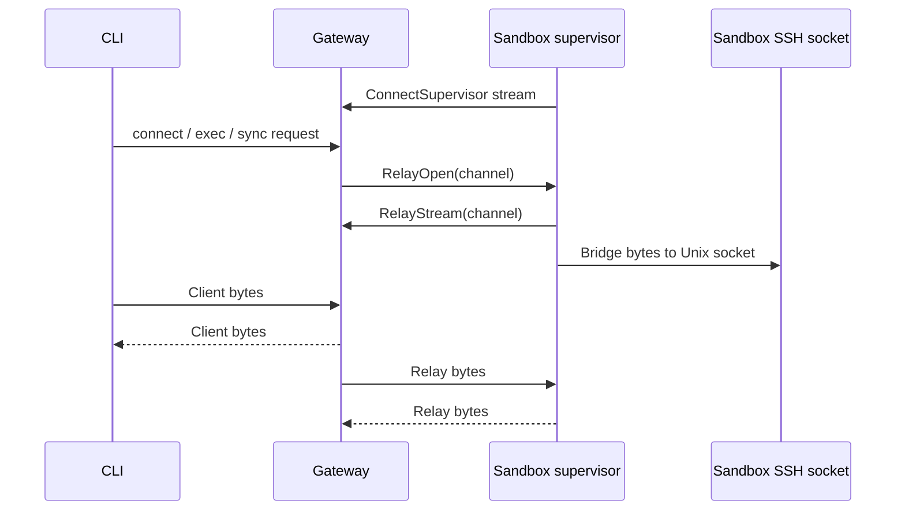

# Gateway

The gateway is the OpenShell control plane. It exposes the API used by the CLI,
SDK, and TUI; persists platform state; manages provider credentials and
inference configuration; and asks compute runtimes to create or delete sandbox
workloads.

## Responsibilities

- Authenticate clients and sandbox callbacks.
- Serve gRPC APIs for sandbox lifecycle, provider management, policy updates,
  settings, inference configuration, logs, and watch streams.
- Serve HTTP endpoints for health, SSH tunnel upgrades, and edge-auth flows.
- Persist domain objects in SQLite or Postgres.
- Resolve provider credentials and inference bundles for sandbox supervisors.
- Coordinate supervisor relay sessions for connect, exec, and file sync.

The gateway does not enforce agent network policy at request time. That happens
inside each sandbox, where the supervisor and proxy can observe local process
identity.

## Protocol and Auth

The gateway listens on one service port and multiplexes gRPC and HTTP traffic.
The default deployment mode is mTLS: clients and sandbox workloads present a
certificate signed by the deployment CA before reaching application handlers.

Supported auth modes:

| Mode | Use |
|---|---|
| mTLS | Default direct gateway access for CLI, SDK, TUI, and sandbox callbacks. |
| Plaintext | Local development or a trusted reverse proxy boundary. |
| Cloudflare JWT | Edge-authenticated deployments where Cloudflare Access supplies identity. |
| OIDC | Bearer-token auth for users, with browser PKCE or client credentials login. |

Sandbox supervisor RPCs authenticate with either mTLS material or a sandbox
secret depending on the runtime and deployment mode. User-facing mutations are
authorized by role policy when OIDC or edge identity is enabled.

## API Surface

The gateway API is organized around platform objects and operational streams:

| Area | Examples |
|---|---|
| Sandbox lifecycle | Create, list, delete, watch, exec, SSH session bootstrap. |
| Providers | Store provider records, discover credentials, resolve runtime environment. |
| Policy and settings | Get effective sandbox config, update sandbox policy, manage global settings. |
| Inference | Set gateway-level model/provider config and resolve sandbox route bundles. |
| Observability | Push sandbox logs, stream sandbox status and logs to clients. |

Domain objects use shared metadata: stable server-generated IDs, human-readable
names, creation timestamps, and labels. Crate-level details live in
`crates/openshell-core/README.md`.

## Persistence

The gateway stores protobuf payloads with indexed object metadata. SQLite is the
default local store; Postgres is supported for deployments that need an external
database. Persisted state includes sandboxes, providers, SSH sessions, policy
revisions, settings, inference configuration, and deployment records.

Policy and runtime settings are delivered together through the effective sandbox
config path. A gateway-global policy can override sandbox-scoped policy. The
sandbox supervisor polls for config revisions and hot-reloads dynamic policy
when the policy engine accepts the update.

## Supervisor Relay

Sandbox workloads maintain an outbound supervisor session to the gateway. This
lets the gateway open per-request byte relays without requiring inbound network
access to the sandbox workload.

The same relay pattern backs interactive SSH, command execution, and file sync.
The gateway tracks live sessions in memory and persists session records so
tokens can expire or be revoked.

## Operational Constraints

- Gateway TLS and client certificate distribution are deployment concerns owned
  by the operator or packaging layer.
- Compute runtimes own the mechanics of starting workloads and injecting
  callback configuration.
- Gateway restarts recover persisted objects from storage, but live relay
  streams must be re-established by supervisors.
- User-facing behavior changes must update published docs in `docs/`; this file
  should only record stable architecture.
