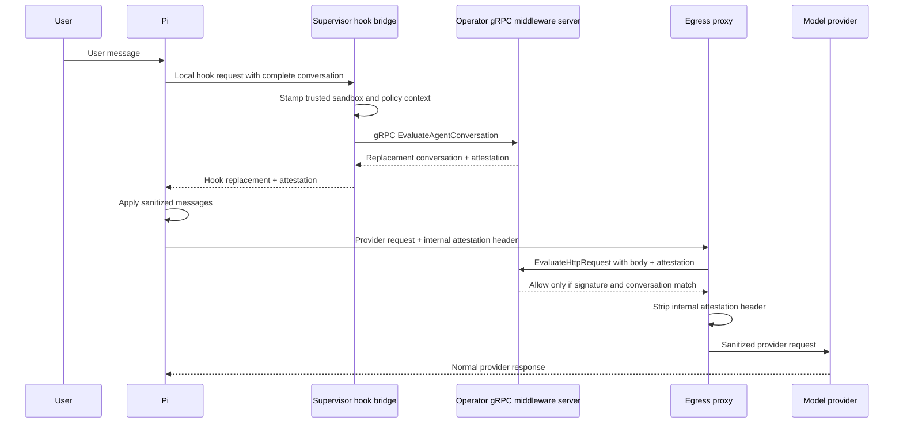

# Pi Conversation Middleware and Signed Egress Attestation

Status: Draft plan

## TL;DR

We want to man-in-the-middle inference requests made by Pi so an operator-owned
middleware can inspect, audit, and mutate the conversation before it reaches a
model provider.

Mutating only the HTTP request at the network proxy is insufficient. Pi keeps a
local, stateful chat record, so a proxy-only mutation can make the conversation
seen by the model diverge from the conversation Pi records and uses on later
turns. Instead, a Pi extension will send hook data to a narrow supervisor-owned
local bridge. The bridge acts as an application-level proxy to an operator gRPC
middleware server. The server will inspect the complete model-visible
conversation, return a replacement conversation, and sign that replacement.

Pi must not be able to send an inference request that bypasses this inspection.
The extension will attach the attestation to the outbound request, and mandatory
fail-closed egress middleware will verify that the actual model-visible request
matches the signed sanitized conversation before forwarding it. Missing,
invalid, expired, or mismatched attestations will be denied.

The MVP evaluates and signs each complete request independently. It does not
maintain a transcript hash chain or server-side conversation state.

## Goal

Provide an end-to-end inspection and mutation path for Pi conversations with the
following property:

> Every inference request allowed to leave the sandbox contains exactly the
> model-visible conversation that trusted middleware inspected and approved
> after applying any required mutations.

The prototype policy is intentionally trivial: replace every exact,
case-sensitive occurrence of `sandbox` in supported message text with
`REDACTED`. Pi continues the turn using the replacement conversation, and the
model receives that same conversation. This silly mutation proves the transport
and state-alignment mechanism without turning the prototype into a content
classification project.

## Why both hooks and egress middleware are required

Pi maintains a local conversation and serializes that state into provider
requests. The two interception points serve different purposes:

- **Pi hooks preserve harness state.** They let middleware inspect Pi's semantic
  message representation before inference and return replacements through Pi's
  supported mutation API. This keeps normal Pi execution aligned with the
  sanitized conversation.
- **Egress middleware enforces mediation.** It observes the actual HTTP request
  Pi is attempting to send. It prevents a disabled, bypassed, or ignored hook
  result from reaching the provider.

Neither point is sufficient alone. Hooks without an egress check are bypassable
by workload code. Egress mutation without hooks can leave Pi's local chat record
inconsistent with the provider-visible conversation.

## Security property and threat model

The MVP does not attempt to prove which JavaScript code executed inside Pi. It
enforces a behavior at the OpenShell boundary: an inference request must carry a
valid attestation whose signed conversation matches the actual request.

If workload code manually invokes the inspection protocol instead of using the
bundled extension, the security property still holds: the middleware sees and
may mutate the exact conversation that the workload can subsequently send.

The design assumes:

- The network supervisor controls all provider egress.
- Provider endpoints requiring conversation inspection use inspectable HTTP/TLS
  paths and mandatory fail-closed middleware.
- Opaque TCP, `tls: skip`, HTTP/2 prior knowledge, QUIC, and other uninspectable
  routes cannot reach protected provider endpoints.
- The operator trusts the selected middleware service with raw conversation
  content.
- The supervisor, not the Pi extension, stamps trusted sandbox and policy
  context on agent-conversation evaluations.
- OpenShell-managed credentials are injected only after successful verification.

## Non-goals for the MVP

- A cross-turn transcript hash chain or authoritative conversation database.
- Single-use attestation enforcement or replay prevention.
- Proving the private contents of Pi's JavaScript memory.
- Provider-response mutation or pre-display output filtering.
- Supporting every Pi lifecycle event.
- Automatic extension injection into arbitrary sandbox images.
- A universal abstraction for every agent harness.
- Every provider protocol or OpenAI-compatible request variant.

Replay of an identical, unexpired, already-inspected request does not bypass
inspection or mutation. A token identifier and replay cache can be added later
if duplicate inference calls become a security, billing, or audit concern.

## Proposed architecture



### Components

#### Pi extension

The Pi community image will include a pinned OpenShell extension. The extension
will:

1. Register the selected Pi hooks.
2. Send bounded hook inputs to a supervisor-owned local bridge.
3. Apply middleware-returned message replacements through Pi's hook API.
4. Retain the returned attestation for the current inference attempt.
5. Attach the attestation to a reserved internal header before provider egress.

The prototype hook set should be deliberately small:

- `input` for early user-input inspection and persistent transformation.
- `before_agent_start` for replacing the effective system prompt on each turn.
- `message_end` for persisting finalized plain-text assistant replacements.
- `context` for evaluating and replacing the complete effective message list
  immediately before an LLM call.
- `before_provider_request` for confirming that Pi's exact serialized Chat
  Completions message array matches the replacement signed by `context`.
- `before_provider_headers` for attaching the current attestation.

Pi documents `context` replacement as non-destructive and `message_end`
replacement as applying to the finalized message. The prototype therefore uses
the persistent hooks for stored user/assistant text and re-sanitizes the system
prompt each turn. Pi currently assembles provider headers before invoking the
provider-payload hook, so the `context` result supplies the attestation and the
later payload hook can only verify that serialization preserved the signed
roles and text. Compaction, retries, steering, and session forks still require
explicit integration testing before this can be considered production-safe.

#### Supervisor hook bridge

The extension calls a stable, supervisor-owned local endpoint. It does not call
the operator server as ordinary sandbox egress. The bridge accepts the Pi hook
request and forwards it through the supervisor's registered gRPC middleware
client. In this sense the supervisor is a proxy, but it is an application-level
hook proxy rather than a transparent TCP or HTTP egress proxy.

The bridge will:

- Stamp trusted sandbox and policy context.
- Enforce request, response, and timeout bounds.
- Select only policy-authorized agent middleware.
- Normalize failures and apply fail-open or fail-closed policy.
- Return only hook-specific mutations and the opaque attestation.

A loopback HTTP/JSON bridge is the likely MVP transport because the supervisor
already has a loopback service pattern and agent processes bypass the egress
proxy for localhost. A Unix socket remains an alternative, but it requires a
shared mount in the Kubernetes sidecar topology.

The bridge should be thin. For the prototype it needs only one bounded request
shape, one fail-closed middleware selection, and one response containing the
replacement conversation and opaque attestation. It must not implement content
mutation or signing itself.

#### Agent-hook middleware operation

Extend the supervisor middleware protocol with a distinct typed operation rather
than overloading `HttpRequestEvaluation`.

The operation should include:

- Harness and harness version, initially Pi.
- Hook identity and hook schema version.
- Supervisor-stamped request context.
- Session and turn correlation identifiers when Pi exposes them.
- A bounded, typed conversation payload.
- Validated middleware configuration.

The result should include:

- Continue, deny, or replace semantics appropriate for the hook.
- The complete sanitized conversation when replaced.
- An opaque, size-bounded attestation.
- Audit-safe findings and metadata.

The middleware manifest must advertise the exact harnesses, hook identifiers,
and schema versions it supports.

#### Reference operator middleware server

The prototype will include a small standalone gRPC server implementing both
middleware operations:

- `EvaluateAgentConversation` receives the supervisor-stamped conversation,
  replaces every exact, case-sensitive `sandbox` occurrence in supported message
  text with `REDACTED`, signs the complete replacement conversation, and returns
  both.
- `EvaluateHttpRequest` receives the buffered OpenAI Chat Completions request
  through the existing egress middleware path. It verifies the attestation and
  exact replacement conversation, then allows or denies. It never repairs or
  mutates a mismatched provider body.

Mutation and signing belong only in this operator server. The Pi extension and
supervisor bridge transport typed data and apply returned mutations; they do not
share the signing key.

#### Signed attestation

The attestation is self-contained and does not require a server-side pending
request record. Its signed claims should include at least:

```text
attestation_version
canonicalization_version
middleware_binding
sandbox_id
session_id, when available
turn_id, when available
conversation_hash
provider or destination scope
policy_revision
issued_at
expires_at
key_id
```

The middleware server owns signing and verification. OpenShell transports the
attestation as opaque bytes and does not need access to the signing key. The
prototype uses the same standalone server for both the agent-conversation and
HTTP egress bindings.

The initial implementation should use an asymmetric signature with explicit key
identifiers and rotation behavior. If the service is always the verifier, the
format can remain service-owned; the OpenShell contract needs only size limits
and opaque bytes.

#### Conversation canonicalization

Signature correctness depends on the hook and egress verifier producing the
same semantic representation. Define a versioned `ConversationRequestV1`
projection rather than hashing arbitrary Pi objects or raw JSON bytes.

The prototype supports one explicit OpenAI Chat Completions-style shape:

- An ordered `messages` array.
- `system`, `developer`, `user`, and `assistant` roles.
- String `content` only.
- The model identifier and any other explicitly admitted request-scoping fields.

Multipart content, images, tool definitions, tool calls, tool results, prompt
fields outside the message array, and unknown message variants are unsupported
and fail closed.

The Pi adapter converts Pi messages into this projection. The egress verifier
parses the provider request into the same projection. Both sides hash the same
versioned canonical encoding.

The prototype does not claim generic OpenAI compatibility. Responses API
requests, legacy completions, compressed bodies, unknown content variants, and
unsupported endpoints must fail closed when an attestation is required.

#### Egress verification

The extension attaches the opaque attestation using a reserved internal header,
for example:

```text
X-OpenShell-Agent-Attestation: <encoded attestation>
```

The exact header name and encoding are contract decisions. The network
supervisor must treat it as internal metadata:

- Reject duplicate or oversized values.
- Make it available to the selected verification middleware.
- Strip it unconditionally before upstream forwarding.
- Prevent middleware failure policy from accidentally forwarding it.

The egress verification binding parses the actual request body, reconstructs
`ConversationRequestV1`, and verifies:

- The signature is valid for `key_id`.
- The attestation is within its validity window.
- The recomputed conversation hash matches the signed hash.
- Sandbox, destination, binding, and policy claims match the current request.
- The endpoint and body shape are supported and completely inspectable.

The verification binding returns deny on any mismatch. The network middleware
policy for protected inference endpoints must use `on_error: fail_closed`.

## Policy model

The feature requires separate policy selection for agent hooks and network
egress verification.

An illustrative policy shape is:

```yaml
agent_middlewares:
  pi-conversation-guard:
    middleware: operator/pi-conversation-prototype
    harness: pi
    hooks:
      - input
      - before_agent_start
      - message_end
      - context
    on_error: fail_closed
    config:
      replacement: sandbox-to-redacted

network_middlewares:
  verify-pi-conversation:
    middleware: operator/pi-conversation-prototype
    order: 10
    on_error: fail_closed
    endpoints:
      include:
        - api.openai.com
```

The gateway must validate that both referenced bindings exist and distribute the
registration to the supervisor when either policy section requires it.

## Example behavior

Given Pi's current conversation:

```json
[
  {"role": "system", "content": "You are a sandbox assistant."},
  {"role": "user", "content": "Create a sandbox inside another sandbox."}
]
```

the agent-hook middleware returns:

```json
[
  {"role": "system", "content": "You are a REDACTED assistant."},
  {"role": "user", "content": "Create a REDACTED inside another REDACTED."}
]
```

and signs the canonical hash of that complete sanitized conversation. Pi applies
the replacement. At egress:

- A request containing the complete replacement conversation and matching
  attestation is allowed.
- A request containing any original `sandbox` occurrence is denied because its
  conversation hash does not match.
- A request with no attestation is denied.
- A request with additional or reordered model-visible messages is denied.

The provider response flows normally, so Pi can continue the conversation.

## Audit behavior

The operator middleware may retain an audit record containing:

- Trusted sandbox identity and available session/turn identifiers.
- Original and sanitized conversation digests.
- Policy decision, safe reason code, and policy revision.
- Attestation identifier, signing key identifier, and timestamps.
- Original or sanitized content only when explicitly enabled in a protected
  audit store with appropriate encryption, access control, and retention.

OpenShell OCSF events must not include raw prompts, matched unsafe text, provider
credentials, or query parameters. They should contain aggregate findings and
safe reason codes only.

The MVP does not chain audit records. A future version may add a tamper-evident
hash chain without changing the per-request attestation or egress verification
contract.

## Failure behavior

- **Inspection middleware unavailable:** fail closed; Pi must not start the
  provider request and should surface a bounded diagnostic.
- **No attestation at egress:** deny.
- **Invalid, expired, or mismatched attestation:** deny.
- **Unsupported request schema:** deny when attestation is required.
- **Payload exceeds hook or HTTP middleware limits:** deny.
- **Pi applies an invalid replacement:** deny before egress.
- **Verification service unavailable:** fail closed.
- **Provider retry with an identical unexpired request:** allowed in the MVP.

## Implementation phases

### Phase 1: Smallest gRPC proof

- Define the narrow string-content `ConversationRequestV1` projection and its
  canonical encoding.
- Add `EvaluateAgentConversation` and its typed request/result messages to
  `proto/supervisor_middleware.proto` without changing existing HTTP behavior.
- Extend middleware manifests just enough to advertise the selected Pi hooks and
  schema version.
- Implement a standalone reference gRPC middleware server that exposes both
  `EvaluateAgentConversation` and the existing `EvaluateHttpRequest`.
- Keep all `sandbox` to `REDACTED` mutation, deterministic prototype signing,
  and verification logic inside that server.
- First prove directly over gRPC that inspection returns the replacement and an
  attestation, the matching HTTP request is allowed, and original, tampered, or
  unattested requests are denied.

Do not add general agent policy, sidecar topology, or provider variants until
this direct gRPC proof passes.

### Phase 2: Supervisor local bridge

- Add one bounded loopback HTTP/JSON endpoint owned by the supervisor.
- Have it stamp trusted sandbox and policy context and call the registered gRPC
  server's `EvaluateAgentConversation` operation.
- Apply the registered timeout and fail-closed behavior.
- Return only the complete replacement conversation and opaque attestation.
- Prove the extension-facing caller does not need the operator endpoint, gRPC
  transport credentials, or signing key.

The first bridge proof may target the combined supervisor topology. Kubernetes
network-sidecar routing must remain an explicit documented limitation until a
safe route from the sandbox-side bridge to the network-side middleware client is
designed and tested.

### Phase 3: Minimal Pi extension and egress enforcement

- Build a small Pi extension that registers `input`, `before_agent_start`,
  `message_end`, `context`, `before_provider_request`, and
  `before_provider_headers`.
- Persist supported user/assistant replacements, apply and sign the complete
  semantic context replacement, attach that attestation during header assembly,
  then fail if the provider-serialized message array differs from the signed
  replacement.
- Confirm experimentally that Pi persists the transformed input and finalized
  assistant replacement across normal turns, compaction, retries, steering, and
  session lifecycle operations. Stop and revise the adapter if any path restores
  unsanitized content without reapplying the persistent hooks.
- Reserve, bound, and unconditionally strip the attestation header at protected
  egress.
- Select the same standalone server's `EvaluateHttpRequest` binding as mandatory
  `fail_closed` middleware for the fake provider destination.
- Exercise Pi against a local OpenAI Chat Completions-style upstream and verify
  the upstream never receives the word `sandbox` from the test conversation.

### Phase 4: Production integration and documentation

- Add full agent middleware policy parsing, validation, and distribution.
- Support and test combined and sidecar topologies plus relevant Docker, Podman,
  Kubernetes, and VM paths.
- Replace deterministic prototype keys with operator-controlled key management
  and rotation.
- Add cross-language canonicalization fixtures for the Pi extension and server.
- Update `architecture/sandbox.md` and `architecture/gateway.md` with the new
  trust boundary and request flow.
- Extend `docs/extensibility/supervisor-middleware.mdx` with agent-hook bindings
  and signed egress verification.
- Update `docs/reference/gateway-config.mdx` for registration/config changes.
- Add Helm values and rendering if operator middleware registration must work in
  Kubernetes deployments.
- Update the relevant agent skills when commands or workflows change.

## Test plan

### Canonicalization and signature tests

- Stable hashes across Rust and TypeScript fixtures.
- Ordered messages, repeated roles, Unicode, and empty string content.
- Unsupported multipart content, tools, and unknown request fields fail closed.
- Mutation of any covered field invalidates the attestation.
- Unknown schema versions and key identifiers fail closed.

### Hook tests

- A message without `sandbox` passes unchanged and receives an attestation.
- Every exact `sandbox` occurrence becomes `REDACTED` in Pi and in the provider
  request, including multiple occurrences and earlier messages.
- Hook timeout, malformed result, oversized result, and service outage fail
  closed.
- Pi started without the extension cannot reach a protected inference endpoint.

### Egress tests

- Valid matching request is forwarded after the internal header is stripped.
- Missing, invalid, expired, wrong-sandbox, wrong-destination, and wrong-policy
  attestations are denied.
- Changing, adding, deleting, or reordering a model-visible message is denied.
- Unsupported or uninspectable provider traffic is denied.
- OpenShell-managed credentials remain unavailable to agent-hook and verifier
  middleware.
- Identical retries behave according to the documented MVP replay policy.

### Deployment tests

- The first vertical slice covers combined supervisor topology.
- Kubernetes network-sidecar and Docker, Podman, and VM paths are required before
  production use, not before the smallest prototype proof.
- Sandbox e2e test proves the original `sandbox` text never reaches upstream.

## Acceptance criteria

- Pi normally records and uses the replacement messages returned through its
  hooks.
- Every protected inference request carries an attestation for its complete
  model-visible conversation.
- The egress verifier rejects any request whose conversation differs from the
  signed sanitized conversation.
- The internal attestation never reaches the provider.
- Disabling or omitting the Pi extension prevents protected inference egress.
- The provider can stream a response and Pi can continue subsequent turns.
- Audit outputs contain decisions and safe metadata without leaking raw content
  into OpenShell logs.
- No transcript hash chain or conversation-state service is required for the
  MVP.
- Mutation and signing occur in the standalone operator gRPC server, not in the
  Pi extension or supervisor bridge.

## Open questions

- Does Pi persist an `input` transformation exactly as required, including RPC,
  steering, and follow-up inputs?
- Do `input` and `message_end` replacements cover every Pi persistence path, and
  how should resumed sessions created before extension installation be migrated?
- Which additional model-visible fields should be admitted after the narrow
  string-content Chat Completions prototype?
- For production, should the same operator service continue to verify its own
  attestations, or should OpenShell distribute verifier public keys?
- What attestation encoding and maximum header size should the contract use?
- Do identical retries need replay protection in the first production release?
- How should the loopback bridge route to the network sidecar without exposing
  existing privileged control sockets?

## Likely code and repository impact

OpenShell core changes will likely touch:

- `proto/supervisor_middleware.proto`
- `proto/sandbox.proto`
- `crates/openshell-supervisor-middleware/`
- `crates/openshell-policy/src/middleware.rs`
- `crates/openshell-server/src/middleware.rs`
- `crates/openshell-server/src/grpc/policy.rs`
- `crates/openshell-sandbox/`
- `crates/openshell-supervisor-network/`

The bundled Pi extension belongs in the separate OpenShell Community repository's
Pi sandbox image. Initial packaging should use a pinned, read-only artifact;
portable automatic injection remains future work.

## Follow-up work

- Tamper-evident audit hash chaining.
- Single-use token identifiers and replay caches.
- Provider-response inspection and mutation.
- OpenAI Responses API and additional provider canonicalizers.
- Generic harness adapters and automatic read-only extension injection.
- Authenticated middleware transport and signing-key rotation tooling.
