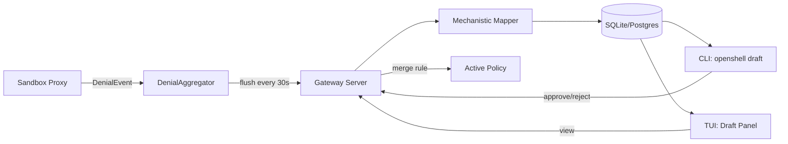
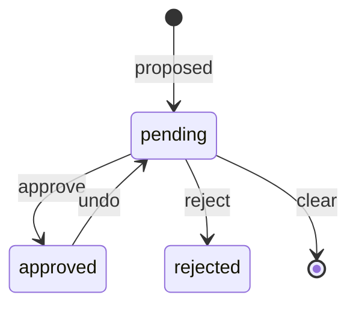

# Policy Advisor

The Policy Advisor is a recommendation system that observes denied connections in a sandbox and proposes policy updates to allow legitimate traffic. It operates as a feedback loop: denials are detected, aggregated, analyzed, and presented to the user as draft policy chunks for review and approval.

This document covers the plumbing layer (issue #204). The LLM-powered agent harness that enriches recommendations with context-aware rationale is covered separately (issue #205).

## Overview



## Components

### Denial Aggregator (Sandbox Side)

The `DenialAggregator` (`crates/navigator-sandbox/src/denial_aggregator.rs`) runs as a background tokio task inside the sandbox supervisor. It:

1. Receives `DenialEvent` structs from the proxy via an unbounded MPSC channel
2. Deduplicates events by `(host, port, binary)` key with running counters
3. Periodically flushes accumulated summaries to the gateway via `SubmitPolicyAnalysis` gRPC

The flush interval defaults to 10 seconds (configurable via `OPENSHELL_DENIAL_FLUSH_INTERVAL_SECS`).

### Denial Event Sources

Events are emitted at four denial points in the proxy:

| Source | Stage | File | Description |
|--------|-------|------|-------------|
| CONNECT OPA deny | `connect` | `proxy.rs` | No matching network policy rule |
| CONNECT SSRF deny | `ssrf` | `proxy.rs` | Resolved IP is internal/private |
| FORWARD OPA deny | `forward` | `proxy.rs` | Forward proxy policy deny |
| FORWARD SSRF deny | `ssrf` | `proxy.rs` | Forward proxy SSRF check failed |

L7 (per-request) denials from `l7/relay.rs` are captured via tracing in the current implementation, with structured channel support planned for issue #205.

### Mechanistic Mapper (Server Side)

The `mechanistic_mapper` module (`crates/navigator-server/src/mechanistic_mapper.rs`) generates draft policy recommendations deterministically, without requiring an LLM:

1. Groups denial summaries by `(host, port)`
2. For each group, generates a `NetworkPolicyRule` allowing that endpoint for the observed binaries
3. Computes confidence scores based on:
   - Denial count (higher count = higher confidence)
   - Port recognition (well-known ports like 443, 5432 get a boost)
   - SSRF origin (SSRF denials get lower confidence)
4. Generates security notes for private IPs, database ports, and ephemeral port ranges
5. Avoids rule name collisions with existing policies

The mapper is invoked automatically when `SubmitPolicyAnalysis` receives denial summaries without pre-computed proposed chunks.

### Persistence

Draft chunks and denial summaries are stored in the gateway database:

```sql
-- draft_policy_chunks: individual rule proposals
CREATE TABLE draft_policy_chunks (
    id TEXT PRIMARY KEY,
    sandbox_id TEXT NOT NULL,
    draft_version INTEGER NOT NULL,
    status TEXT NOT NULL DEFAULT 'pending',  -- pending | approved | rejected
    stage TEXT NOT NULL DEFAULT '',
    rule_name TEXT NOT NULL,
    proposed_rule BLOB NOT NULL,             -- protobuf-encoded NetworkPolicyRule
    rationale TEXT NOT NULL DEFAULT '',
    security_notes TEXT NOT NULL DEFAULT '',
    confidence REAL NOT NULL DEFAULT 0.0,
    denial_refs TEXT NOT NULL DEFAULT '',
    supersedes_chunk_id TEXT NOT NULL DEFAULT '',
    analysis_mode TEXT NOT NULL DEFAULT 'mechanistic',
    created_at_ms INTEGER NOT NULL,
    decided_at_ms INTEGER,
    decided_by TEXT NOT NULL DEFAULT ''
);

-- denial_summaries: aggregated denial patterns
CREATE TABLE denial_summaries (
    id TEXT PRIMARY KEY,
    sandbox_id TEXT NOT NULL,
    host TEXT NOT NULL,
    port INTEGER NOT NULL,
    ...
);
```

Both tables use migrations in `crates/navigator-server/migrations/{sqlite,postgres}/003_create_policy_recommendations.sql`.

## Approval Workflow

Draft chunks follow a simple state machine:



### Approval Actions

| Action | CLI Command | gRPC RPC | Effect |
|--------|-------------|----------|--------|
| View drafts | `openshell draft get` | `GetDraftPolicy` | List pending/approved/rejected chunks |
| Approve one | `openshell draft approve --chunk-id X` | `ApproveDraftChunk` | Merge rule into active policy, mark approved |
| Reject one | `openshell draft reject --chunk-id X` | `RejectDraftChunk` | Mark rejected (no policy change) |
| Approve all | `openshell draft approve-all` | `ApproveAllDraftChunks` | Bulk approve (skips security-flagged unless `--include-security-flagged`) |
| Undo | `openshell draft undo --chunk-id X` | `UndoDraftChunk` | Remove rule from policy, revert to pending |
| Clear | `openshell draft clear` | `ClearDraftChunks` | Delete all pending chunks |
| History | `openshell draft history` | `GetDraftHistory` | Show timeline of proposals and decisions |

### Policy Merge

When a chunk is approved, the server:

1. Decodes the chunk's `proposed_rule` (protobuf `NetworkPolicyRule`)
2. Fetches the current active `SandboxPolicy`
3. Inserts the rule into `network_policies` by name
4. Persists a new policy revision with deterministic hash
5. Supersedes older policy versions
6. Notifies watchers (triggers sandbox policy poll)

The sandbox picks up the new policy on its next poll cycle (default 10 seconds) and hot-reloads the OPA engine.

## User Interfaces

### CLI

The `openshell draft` command group provides full CRUD:

```bash
# View pending recommendations
openshell draft get my-sandbox

# Approve a specific chunk
openshell draft approve my-sandbox --chunk-id abc123

# Approve all safe recommendations
openshell draft approve-all my-sandbox

# Reject with reason
openshell draft reject my-sandbox --chunk-id xyz789 --reason "not needed"

# Undo a previous approval
openshell draft undo my-sandbox --chunk-id abc123

# Clear all pending
openshell draft clear my-sandbox
```

### TUI

The TUI sandbox screen includes a "Draft" panel accessible via `[r]` from the policy view. It displays:

- List of draft chunks with status indicators (pending/approved/rejected)
- Confidence scores
- Expanded endpoint and binary details for the selected chunk
- Security warnings for flagged proposals

Navigation: `[j/k]` to select chunks, `[p]` to return to policy, `[l]` for logs.

## Configuration

| Environment Variable | Default | Description |
|---------------------|---------|-------------|
| `OPENSHELL_DENIAL_FLUSH_INTERVAL_SECS` | `10` | How often the aggregator flushes to the gateway |
| `OPENSHELL_POLICY_POLL_INTERVAL_SECS` | `10` | How often the sandbox polls for policy updates |

## Future Work (Issue #205)

The LLM PolicyAdvisor agent will:

- Wrap the mechanistic mapper with LLM-powered analysis
- Generate context-aware rationale explaining *why* each rule is recommended
- Group related denials into higher-level recommendations
- Detect patterns (e.g., "this looks like a pip install") and suggest broader rules
- Provide interactive refinement via chat
