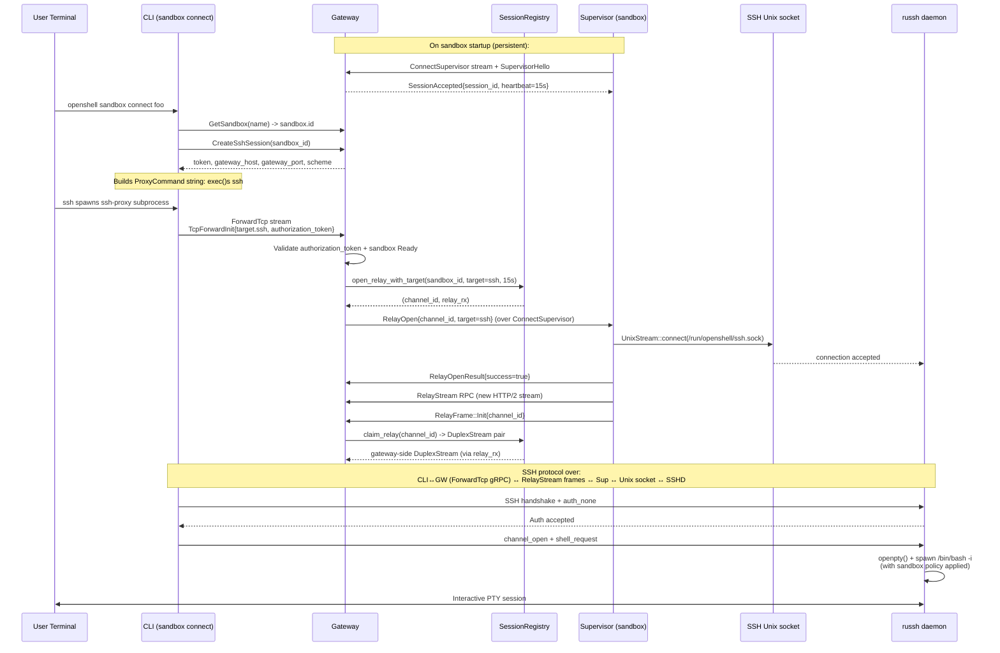
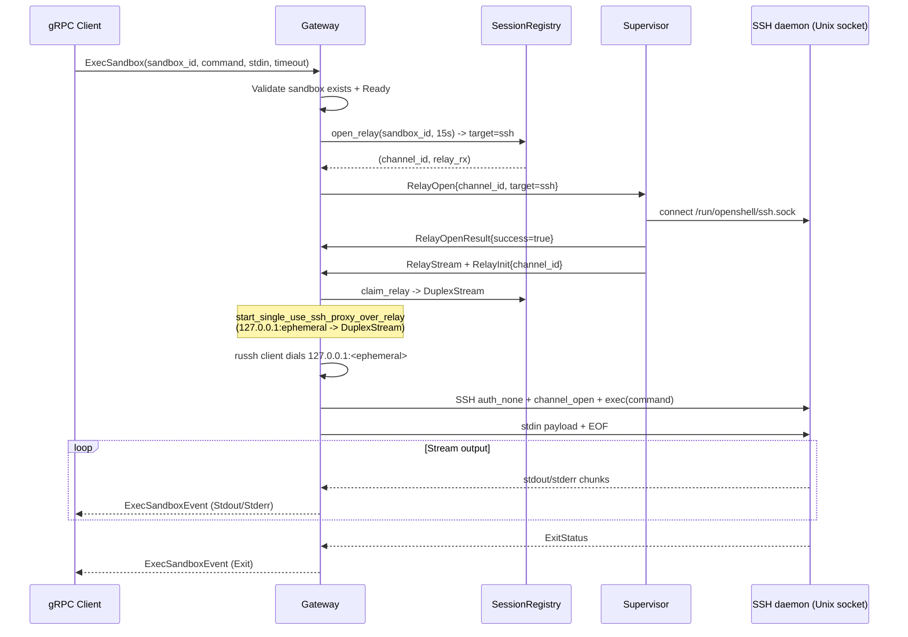
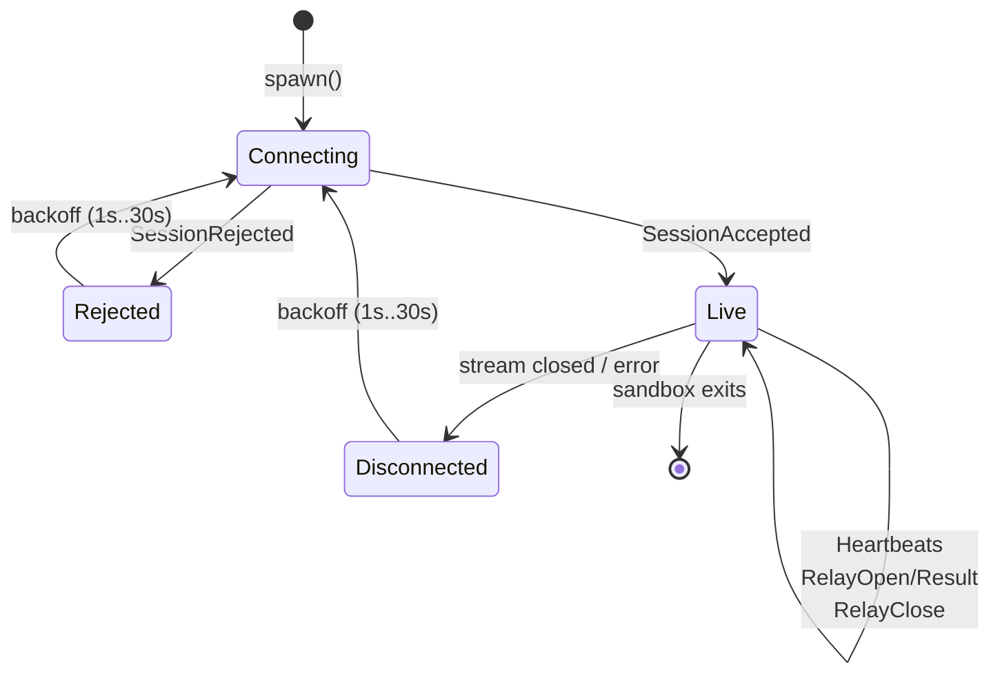

# Sandbox Connect Architecture

## Overview

Sandbox connect provides secure remote access into running sandbox environments. It supports three modes of interaction:

1. **Interactive shell** (`sandbox connect`) -- opens a PTY-backed SSH session for interactive use
2. **Command execution** (`sandbox create -- <cmd>`) -- runs a command over SSH with stdout/stderr piped back
3. **File sync** (`sandbox create --upload`) -- uploads local files into the sandbox before command execution

Gateway connectivity is **supervisor-initiated**: the gateway never dials the sandbox pod. On startup, each sandbox's supervisor opens a long-lived bidirectional gRPC stream (`ConnectSupervisor`) to the gateway and holds it for the sandbox's lifetime. **`CreateSshSession`, `ForwardTcp`, and `ExecSandbox` all depend on that registration**: `open_relay` blocks until a live `ConnectSupervisor` entry exists for the `sandbox_id`; if the supervisor never registers (wrong endpoint, bad env, crash loop), the client hits the supervisor-session wait timeout instead of getting a relay. When a client asks the gateway for SSH, the OpenSSH `ProxyCommand` runs `openshell ssh-proxy`, which opens a bidirectional gRPC `ForwardTcp` stream to the gateway. Its first frame is `TcpForwardInit { target.ssh, authorization_token }`, where the token comes from `CreateSshSession`. The gateway validates the token, then sends a `RelayOpen` message over `ConnectSupervisor` with an explicit `SshRelayTarget`; older targetless messages remain SSH-compatible. The supervisor validates and dials the requested target before reporting a successful `RelayOpenResult`, then initiates a `RelayStream` gRPC call that rides the same TCP+TLS+HTTP/2 connection as a new multiplexed stream. For SSH targets, the supervisor bridges the bytes of that stream into a root-owned Unix socket where the embedded SSH daemon listens. **The in-container sshd is reached only on that local Unix socket** — the supervisor `UnixStream::connect`s to it. Do not assume the relay path terminates at a container-exposed TCP listener for sshd; any optional TCP surface is separate from the gateway relay bridge.

There is also a gateway-side `ExecSandbox` gRPC RPC that executes commands inside sandboxes without requiring an external SSH client. It uses the same relay mechanism.

The OS-88 forwarding path also carries arbitrary TCP services: `openshell forward service <sandbox> --target-port <port>` binds a local TCP listener, opens one `ForwardTcp` bidirectional gRPC stream per accepted local connection, and sends `TcpForwardInit { target.tcp, authorization_token }` with a `TcpRelayTarget` for the requested loopback port inside the sandbox. This avoids the SSH `direct-tcpip` transport and keeps gateway auth, typed routing, session-token authorization, and relay target validation in the OpenShell protocol.

### Podman and relay environment

The **Podman** compute driver (`crates/openshell-driver-podman/src/container.rs`, `build_env` / `build_container_spec`) must inject the same **relay-critical** environment variables into the container as the Kubernetes driver: `OPENSHELL_ENDPOINT` (gateway gRPC), `OPENSHELL_SANDBOX_ID`, and `OPENSHELL_SSH_SOCKET_PATH` (Unix path the embedded sshd binds and the supervisor dials). Without `OPENSHELL_SSH_SOCKET_PATH`, the in-container `openshell-sandbox` process does not know where to create the socket; without `OPENSHELL_ENDPOINT` / `OPENSHELL_SANDBOX_ID`, the supervisor cannot complete `ConnectSupervisor`, so the gateway never has a session to target with `RelayOpen`. Driver-owned keys overwrite user spec/template env so these cannot be overridden. **Podman container readiness** (libpod `HealthConfig` in `build_container_spec`) treats the sandbox as ready when a sentinel file exists, **or** `test -S` passes on the configured `sandbox_ssh_socket_path` (**supervisor / Unix-socket path**), **or** a legacy TCP listen check on the published SSH port — so the `Ready` phase used by `CreateSshSession` and `ForwardTcp` can reflect Unix-socket–based startup, not only a TCP listener.

## Two-Plane Architecture

The supervisor and gateway maintain two logical planes over **one TCP+TLS connection**, multiplexed by HTTP/2 streams:

- **Control plane** -- the `ConnectSupervisor` bidirectional gRPC stream. Carries `SupervisorHello`, heartbeats, targetable `RelayOpen`/`RelayClose` requests from the gateway, and `RelayOpenResult`/`RelayClose` replies from the supervisor. Lives for the lifetime of the sandbox supervisor process.
- **Data plane** -- one `RelayStream` bidirectional gRPC call per accepted relay. Each call is a new HTTP/2 stream on the same connection. Frames are opaque bytes except for the first frame from the supervisor, which is a typed `RelayInit { channel_id }` used to pair the stream with a pending relay slot on the gateway.

Running both planes over one HTTP/2 connection means each relay avoids a fresh TLS handshake and benefits from a single authenticated transport boundary. Hyper/h2 adaptive windows are enabled on the gateway, the sandbox supervisor channel, and CLI gRPC channels so bulk transfers (large file uploads, long exec stdout) aren't pinned to the default 64 KiB stream window.

The supervisor-initiated direction gives the model two properties:

1. The sandbox pod exposes no ingress surface. Network reachability is whatever the supervisor itself can reach outward.
2. Authentication reduces to one place: the existing gateway mTLS channel. There is no second application-layer handshake to design, rotate, or replay-protect.

### Targetable relay base

`RelayOpen` is targetable but remains SSH-compatible by default. In `proto/openshell.proto`, `RelayOpen.target` is an optional `oneof` with:

- `SshRelayTarget` -- the built-in SSH target. This is the explicit target used by the server-side `open_relay()` wrapper, so existing SSH connect and `ExecSandbox` flows continue to request SSH without each caller constructing the target.
- `TcpRelayTarget { host, port }` -- a supervisor-dialed TCP target inside the sandbox. The supervisor accepts only loopback hosts (`127.0.0.1`, `::1`, or `localhost`) and ports `1..=65535`.

If `target` is absent, the supervisor treats the relay as `SshRelayTarget` for compatibility with older gateways or messages. The supervisor opens the target before sending `RelayOpenResult { success: true }`; if validation or dialing fails, it sends `success: false` with the error and does not start a `RelayStream`.

### CLI forward service over gRPC

**Files**: `proto/openshell.proto`, `crates/openshell-cli/src/run.rs`, `crates/openshell-server/src/grpc/sandbox.rs`

`ForwardTcp` is a bidirectional gRPC stream between the CLI and gateway. The CLI sends `TcpForwardFrame::Init { sandbox_id, service_id, target.tcp, authorization_token }` as the first frame, followed by `TcpForwardFrame::Data` chunks from the accepted local TCP connection. The gateway validates that the sandbox exists and is `Ready`, validates the session token, validates that the target is loopback-only, calls `open_relay_with_target(TcpRelayTarget)`, waits for the supervisor's `RelayStream`, and bridges opaque bytes between the CLI stream and the relay stream.

The spike command does not create persistent `SandboxService` records yet. It takes the target directly from CLI flags and uses the same loopback-only target restrictions that the supervisor enforces again at relay-open time.

## Components

### CLI SSH module

**File**: `crates/openshell-cli/src/ssh.rs`

Client-side SSH and editor-launch helpers:

- `sandbox_connect()` -- interactive SSH shell session
- `sandbox_exec()` -- non-interactive command execution via SSH
- `sandbox_rsync()` -- file synchronization via tar-over-SSH
- `sandbox_ssh_proxy()` -- the `ProxyCommand` process that bridges stdin/stdout to the gateway
- OpenShell-managed SSH config helpers -- install a single `Include` entry in `~/.ssh/config` and maintain generated `Host openshell-<name>` blocks in a separate OpenShell-owned config file for editor workflows

Every generated SSH invocation and every entry in the OpenShell-managed `~/.ssh/config` include `ServerAliveInterval=15` and `ServerAliveCountMax=3`. SSH has no other way to observe that the underlying relay (not the end-to-end TCP socket) has silently dropped, so the client falls back to SSH-level keepalives to surface dead connections within ~45 seconds.

These helpers are re-exported from `crates/openshell-cli/src/run.rs` for backward compatibility.

### CLI `ssh-proxy` subcommand

**File**: `crates/openshell-cli/src/main.rs` (`Commands::SshProxy`)

A top-level CLI subcommand (`ssh-proxy`) that the SSH `ProxyCommand` invokes. It receives `--gateway`, `--sandbox-id`, `--token`, and `--gateway-name` flags, then delegates to `sandbox_ssh_proxy()`. This process has no TTY of its own -- it pipes stdin/stdout directly to the gateway `ForwardTcp` stream.

### gRPC session bootstrap

**Files**: `proto/openshell.proto`, `crates/openshell-server/src/grpc/sandbox.rs`

Two RPCs manage SSH session tokens:

- `CreateSshSession(sandbox_id)` -- validates the sandbox exists and is `Ready`, generates a UUID token, persists an `SshSession` record, and returns the token plus gateway connection details (host, port, scheme, optional TTL).
- `RevokeSshSession(token)` -- marks the session's `revoked` flag to `true` in the persistence layer.

### Supervisor session registry

**File**: `crates/openshell-server/src/supervisor_session.rs`

`SupervisorSessionRegistry` holds:

- `sessions: HashMap<sandbox_id, LiveSession>` -- the active `ConnectSupervisor` stream sender for each sandbox, plus a `session_id` that uniquely identifies each registration.
- `pending_relays: HashMap<channel_id, PendingRelay>` -- one entry per `RelayOpen` waiting for the supervisor's `RelayStream` to arrive.

Key operations:

- `register(sandbox_id, session_id, tx)` -- inserts a new session and returns the previous sender if it superseded one. Used by `handle_connect_supervisor` to accept a new stream.
- `remove_if_current(sandbox_id, session_id)` -- removes only if the stored `session_id` matches. Guards against the supersede race where an old session's cleanup runs after a newer session has already registered.
- `open_relay(sandbox_id, timeout)` -- called by exec handlers. Wraps `open_relay_with_target()` with `SshRelayTarget`, waits up to `timeout` for a supervisor session to appear (with exponential backoff 100 ms → 2 s), registers a pending relay slot keyed by a fresh `channel_id`, sends `RelayOpen` to the supervisor, and returns a `oneshot::Receiver<Result<DuplexStream, Status>>` that resolves when the supervisor claims the slot or reports target-open failure.
- `open_relay_with_target(sandbox_id, target, service_id, timeout)` -- lower-level relay opener for explicit `RelayOpen.target` values. It stores the full `RelayOpen` in the pending slot so replay after supervisor supersede preserves the requested target.
- `fail_pending_relay(channel_id, error)` -- removes a pending relay and wakes the caller with `Status::unavailable` when the supervisor sends `RelayOpenResult { success: false }`.
- `claim_relay(channel_id)` -- called by `handle_relay_stream` when the supervisor's first `RelayFrame::Init` arrives. Removes the pending entry, enforces a 10-second staleness bound (`RELAY_PENDING_TIMEOUT`), creates a 64 KiB `tokio::io::duplex` pair, hands the gateway-side half to the waiter, and returns the supervisor-side half to be bridged against the inbound/outbound `RelayFrame` streams.
- `reap_expired_relays()` -- bounds leaks from pending slots the supervisor never claimed (e.g., supervisor crashed between `RelayOpen` and `RelayStream`). Scheduled every 30 s by `spawn_relay_reaper()` during server startup.

The `ConnectSupervisor` handler (`handle_connect_supervisor`) validates `SupervisorHello`, assigns a fresh `session_id`, sends `SessionAccepted { heartbeat_interval_secs: 15 }`, spawns a loop that processes inbound messages (`Heartbeat`, `RelayOpenResult`, `RelayClose`), and emits a `GatewayHeartbeat` every 15 seconds. Successful `RelayOpenResult` values are informational; failed results wake the pending relay waiter via `fail_pending_relay()` instead of only being logged.

### RelayStream handler

**File**: `crates/openshell-server/src/supervisor_session.rs` (`handle_relay_stream`)

Accepts one inbound `RelayFrame` to extract `channel_id` from `RelayInit`, claims the pending relay, then runs two concurrent forwarding tasks:

- **Supervisor → gateway**: drains `RelayFrame::Data` frames and writes the bytes to the supervisor-side end of the duplex pair.
- **Gateway → supervisor**: reads the duplex in `RELAY_STREAM_CHUNK_SIZE` (16 KiB) chunks and emits `RelayFrame::Data` messages back.

The first frame that isn't `RelayInit` is rejected (`invalid_argument`). Any non-data frame after init closes the relay.

### Gateway `ForwardTcp` handler

**File**: `crates/openshell-server/src/grpc/sandbox.rs` (`handle_forward_tcp`)

Handles one CLI-to-gateway bidirectional `ForwardTcp` stream by:

1. Reading the first `TcpForwardFrame` and requiring `TcpForwardInit`.
2. Confirming the sandbox is in `Ready` phase.
3. Validating `authorization_token` against the `SshSession` row and enforcing per-token (max 3) and per-sandbox (max 20) concurrent connection limits.
4. For `target.tcp`, validating that the target host is loopback-only and the port is `1..=65535`.
5. Calling `supervisor_sessions.open_relay_with_target(...)` with the validated `SshRelayTarget` or `TcpRelayTarget`.
6. Waiting up to 10 seconds for the supervisor to open its `RelayStream` and deliver the gateway-side `DuplexStream`, or to report target-open failure.
7. Bridging opaque `TcpForwardFrame::Data` chunks between the CLI stream and the relay stream.

There is no gateway-to-sandbox TCP dial, handshake preface, or pod-IP resolution in this path.

### Gateway multiplexing

**File**: `crates/openshell-server/src/multiplex.rs`

The gateway runs a single listener that multiplexes gRPC and HTTP on the same port. `MultiplexedService` routes based on the `content-type` header: requests with `application/grpc` go to the gRPC router; all others go to the HTTP router for health endpoints. Hyper is configured with `http2().adaptive_window(true)` so the HTTP/2 stream windows grow under load rather than throttling `ForwardTcp` or `RelayStream` to the default 64 KiB window.

### Sandbox supervisor session

**File**: `crates/openshell-sandbox/src/supervisor_session.rs`

`spawn(endpoint, sandbox_id, ssh_socket_path, netns_fd)` starts a background task that:

1. Opens a gRPC `Channel` to the gateway (`http2_adaptive_window(true)`). The same channel multiplexes the control stream and every relay.
2. Sends `SupervisorHello { sandbox_id, instance_id }` as the first outbound message.
3. Waits for `SessionAccepted` (or fails fast on `SessionRejected`).
4. Runs a loop that reads inbound `GatewayMessage` values and emits `SupervisorHeartbeat` at the accepted interval (min 5 s, usually 15 s).
5. On `RelayOpen`, spawns `handle_relay_open()` which resolves the target (`SshRelayTarget`, `TcpRelayTarget`, or targetless-as-SSH), validates loopback-only TCP targets, dials SSH through the Unix socket or TCP from the sandbox network namespace, sends `RelayOpenResult`, opens a new `RelayStream` RPC on the existing channel, sends `RelayInit { channel_id }` as the first frame, and bridges bytes in both directions in 16 KiB chunks.

Reconnect policy: the session loop wraps `run_single_session()` with exponential backoff (1 s → 30 s) on any error. A `session_established` / `session_failed` OCSF event is emitted on each attempt.

After target selection, the supervisor is a dumb byte bridge with no awareness of the SSH protocol flowing through it.

### Sandbox SSH daemon

**File**: `crates/openshell-sandbox/src/ssh.rs`

An embedded SSH server built on `russh` that runs inside each sandbox pod. It:

- Generates an ephemeral Ed25519 host key on startup (no persistent key material).
- Listens on a Unix socket (default `/run/openshell/ssh.sock`, see [Unix socket access control](#unix-socket-access-control)).
- Accepts any SSH authentication (none or public key) because authorization is handled upstream by the gateway session token and by filesystem permissions on the socket.
- Spawns shell processes on a PTY with full sandbox policy enforcement (Landlock, seccomp, network namespace, privilege dropping).
- Supports interactive shells, exec commands, PTY resize, window-change events, and loopback-only `direct-tcpip` channels for port forwarding.

### Gateway-side exec (gRPC)

**File**: `crates/openshell-server/src/grpc/sandbox.rs` (`handle_exec_sandbox`, `stream_exec_over_relay`, `start_single_use_ssh_proxy_over_relay`, `run_exec_with_russh`)

The `ExecSandbox` gRPC RPC provides programmatic command execution without requiring an external SSH client. It:

1. Validates `sandbox_id`, `command`, env keys, and field sizes; confirms the sandbox is `Ready`.
2. Calls `supervisor_sessions.open_relay(sandbox_id, 15s)` -- a shorter wait than connect because exec runs in steady state, not on cold start.
3. Waits up to 10 seconds for the relay `DuplexStream` to arrive.
4. Starts a single-use localhost TCP listener on `127.0.0.1:0` and spawns a task that bridges a single accept to the `DuplexStream` with `copy_bidirectional`. This adapts the SSH-targeted `DuplexStream` to something `russh::client::connect_stream` can dial.
5. Connects `russh` to the local proxy, authenticates `none` as user `sandbox`, opens a channel, optionally requests a PTY, and executes the shell-escaped command.
6. Streams `stdout`/`stderr`/`exit` events back to the gRPC caller.

If `timeout_seconds > 0`, the exec is wrapped in `tokio::time::timeout`. On timeout, exit code 124 is sent (matching the `timeout` command convention).

## Connection Flows

### Interactive Connect (CLI)

The `sandbox connect` command opens an interactive SSH session.



**Code trace for `sandbox connect`:**

1. `crates/openshell-cli/src/main.rs` -- `SandboxCommands::Connect { name }` dispatches to `run::sandbox_connect()`.
2. `crates/openshell-cli/src/ssh.rs` -- `sandbox_connect()` calls `ssh_session_config()`:
   - Resolves sandbox name to ID via `GetSandbox` gRPC.
   - Creates an SSH session via `CreateSshSession` gRPC.
   - Builds a `ProxyCommand` string: `<openshell-exe> ssh-proxy --gateway <url> --sandbox-id <id> --token <token> --gateway-name <sni>`.
   - If the gateway host is loopback but the cluster endpoint is not, `resolve_ssh_gateway()` overrides the host with the cluster endpoint's host.
3. `sandbox_connect()` builds an `ssh` command with:
   - `-o ProxyCommand=...`
   - `-o StrictHostKeyChecking=no -o UserKnownHostsFile=/dev/null -o GlobalKnownHostsFile=/dev/null` (ephemeral host keys)
   - `-o ServerAliveInterval=15 -o ServerAliveCountMax=3` (surface silently-dropped relays in ~45 s)
   - `-tt -o RequestTTY=force` (force PTY allocation)
   - `-o SetEnv=TERM=xterm-256color`
   - `sandbox` as the SSH user
4. If stdin is a terminal (interactive), the CLI calls `exec()` (Unix) to replace itself with the `ssh` process. Otherwise it spawns and waits.
5. `sandbox_ssh_proxy()` opens a gRPC `ForwardTcp` stream, sends `TcpForwardInit { sandbox_id, service_id: "ssh-proxy:<sandbox_id>", target.ssh, authorization_token: token }`, and spawns two tasks to copy bytes between stdin/stdout and `TcpForwardFrame::Data` messages.
6. Gateway-side: `handle_forward_tcp()` authorizes the SSH target with `authorization_token`, opens an SSH-targeted relay through `SupervisorSessionRegistry::open_relay_with_target()`, waits for the supervisor's `RelayStream`, and bridges `TcpForwardFrame::Data` to the relay stream.
7. Supervisor-side: on `RelayOpen`, `handle_relay_open()` in `crates/openshell-sandbox/src/supervisor_session.rs` dials `/run/openshell/ssh.sock`, reports `RelayOpenResult { success: true }`, opens a `RelayStream` RPC, sends `RelayInit`, and bridges the frames to the Unix socket.

### Command Execution (CLI)

The `sandbox exec` path is identical to interactive connect except:

- The SSH command uses `-T -o RequestTTY=no` (no PTY) when `tty=false`.
- The command string is passed as the final SSH argument.
- The sandbox daemon routes it through `exec_request()` instead of `shell_request()`, spawning `/bin/bash -lc <command>`.

When `openshell sandbox create` launches a `--no-keep` command or shell, it keeps the CLI process alive instead of `exec()`-ing into SSH so it can delete the sandbox after SSH exits. The default create flow, along with `--forward`, keeps the sandbox running.

### Port Forwarding (`forward start`)

`openshell forward start <port> <name>` opens a local SSH tunnel so connections to `127.0.0.1:<port>` on the host are forwarded to `127.0.0.1:<port>` inside the sandbox. Because SSH runs over the same relay as interactive connect, no additional proxying machinery is needed.

#### CLI

- Reuses the same `ProxyCommand` path as `sandbox connect`.
- Invokes OpenSSH with `-N -o ExitOnForwardFailure=yes -L <port>:127.0.0.1:<port> sandbox`.
- By default stays attached in foreground until interrupted (Ctrl+C), and prints an early startup confirmation after SSH stays up through its initial forward-setup checks.
- With `-d`/`--background`, SSH forks after auth and the CLI exits. The PID is tracked in `~/.config/openshell/forwards/<name>-<port>.pid` along with sandbox id metadata.
- `openshell forward stop <port> <name>` validates PID ownership and then kills a background forward.
- `openshell forward list` shows all tracked forwards.
- `openshell forward stop` and `openshell forward list` are local operations and do not require resolving an active cluster.
- `openshell sandbox create --forward <port>` starts a background forward before connect/exec, including when no trailing command is provided.
- `openshell sandbox delete` auto-stops any active forwards for the deleted sandbox.

#### TUI

The TUI (`crates/openshell-tui/`) supports port forwarding through the create sandbox modal. Users specify comma-separated ports in the **Ports** field. After sandbox creation:

1. The TUI polls for `Ready` state (up to 30 attempts at 2-second intervals).
2. Creates an SSH session via `CreateSshSession` gRPC.
3. Spawns background SSH tunnels (`ssh -N -f -L <port>:127.0.0.1:<port>`) for each port.
4. Sends a `ForwardResult` event back to the main loop with the outcome.

Active forwards are displayed in the sandbox table's NOTES column (e.g., `fwd:8080,3000`) and in the sandbox detail view's Forwards row.

When deleting a sandbox, the TUI calls `stop_forwards_for_sandbox()` before sending the delete request. PID tracking uses the same `~/.config/openshell/forwards/` directory as the CLI.

#### Shared forward module

**File**: `crates/openshell-core/src/forward.rs`

Port forwarding PID management and SSH utility functions are shared between the CLI and TUI:

- `forward_dir()` -- returns `~/.config/openshell/forwards/`, creating it if needed
- `save_forward_pid()` / `read_forward_pid()` / `remove_forward_pid()` -- PID file I/O
- `list_forwards()` -- lists all active forwards from PID files
- `stop_forward()` / `stop_forwards_for_sandbox()` -- kills forwarding processes by PID
- `resolve_ssh_gateway()` -- loopback gateway resolution (see [Gateway Loopback Resolution](#gateway-loopback-resolution))
- `shell_escape()` -- safe shell argument escaping for SSH commands
- `build_sandbox_notes()` -- builds notes strings (e.g., `fwd:8080,3000`) from active forwards

#### Supervisor `direct-tcpip` handling

The sandbox SSH server (`crates/openshell-sandbox/src/ssh.rs`) implements `channel_open_direct_tcpip` from the russh `Handler` trait.

- **Loopback-only**: only `127.0.0.1`, `localhost`, and `::1` destinations are accepted. Non-loopback destinations are rejected (`Ok(false)`) to prevent the sandbox from being used as a generic proxy.
- **Bridge**: accepted channels spawn a tokio task that connects a `TcpStream` to the target address and uses `copy_bidirectional` between the SSH channel stream and the TCP stream.

### Gateway-side Exec (gRPC)

The `ExecSandbox` gRPC RPC bypasses the external SSH client entirely while using the same relay plumbing.



`start_single_use_ssh_proxy_over_relay()` exists only as an adapter so `russh::client::connect_stream` can consume the relay `DuplexStream` through an ephemeral TCP listener on `127.0.0.1:0`. It never reaches the network.

### File Sync

File sync uses **tar-over-SSH**: the CLI streams a tar archive through the existing SSH proxy tunnel. No external dependencies (like `rsync`) are required on the client side. The sandbox image provides GNU `tar` for extraction.

**Files**: `crates/openshell-cli/src/ssh.rs`, `crates/openshell-cli/src/run.rs`

#### `sandbox create --upload`

When `--upload` is passed to `sandbox create`, the CLI pushes local files into `/sandbox` (or a specified destination) after the sandbox reaches `Ready` and before any command runs.

1. `git_repo_root()` determines the repository root via `git rev-parse --show-toplevel`.
2. `git_sync_files()` lists files with `git ls-files -co --exclude-standard -z` (tracked + untracked, respecting gitignore, null-delimited).
3. `sandbox_sync_up_files()` creates an SSH session config, spawns `ssh <proxy> sandbox "tar xf - -C /sandbox"`, and streams a tar archive of the file list to the SSH child's stdin using the `tar` crate.
4. Files land in `/sandbox` inside the container.

#### `openshell sandbox upload` / `openshell sandbox download`

Standalone commands support bidirectional file transfer:

```bash
# Push local files up to sandbox
openshell sandbox upload <name> <local-path> [<sandbox-path>]

# Pull sandbox files down to local
openshell sandbox download <name> <sandbox-path> [<local-path>]
```

- **Upload**: `sandbox_upload()` streams a tar archive of the local path to `ssh ... tar xf - -C <dest>` on the sandbox side. Default destination: `/sandbox`.
- **Download**: `sandbox_download()` runs `ssh ... tar cf - -C <dir> <path>` on the sandbox side and extracts the output locally via `tar::Archive`. Default destination: `.` (current directory).
- No compression for v1 -- the SSH tunnel rides the already-TLS-encrypted gateway connection; compression adds CPU cost with marginal bandwidth savings.

## Supervisor Session Lifecycle

Each sandbox has at most one live `ConnectSupervisor` stream at a time. The registry enforces this via `register()`, which overwrites any previous entry.

### States



### Hello and accept

The supervisor sends `SupervisorHello { sandbox_id, instance_id }` (where `instance_id` is a fresh UUID per process start) as the first message. The gateway:

1. Assigns `session_id = Uuid::new_v4()`.
2. Registers the session; any existing entry is evicted and its sender is dropped.
3. Replies with `SessionAccepted { session_id, heartbeat_interval_secs: 15 }`.
4. Spawns `run_session_loop` to process inbound messages and emit gateway heartbeats.

On any registration failure (e.g., the supervisor's mpsc receiver was already dropped), `remove_if_current` is called with the assigned `session_id` so the cleanup does not evict a newer successful registration.

### Heartbeats

Both directions emit heartbeats at the negotiated interval (15 s). Heartbeats are strictly informational -- their purpose is to keep the HTTP/2 connection warm and let each side detect a half-open transport quickly. There is no explicit application-level timeout that kills the session if heartbeats stop; failures are detected when a send fails or when the stream reports EOF / error.

### Supersede semantics

If a supervisor restarts (or a network blip forces a new `ConnectSupervisor` call), the gateway sees a second `SupervisorHello` for the same `sandbox_id`. `register()` inserts the new session and returns the old `tx`. The old session's `run_session_loop` continues to poll its inbound stream until it errors out, at which point its cleanup calls `remove_if_current(sandbox_id, old_session_id)` -- which does nothing because the stored entry now has the new `session_id`. The newer session stays live.

Tests in `supervisor_session.rs` pin this behavior:

- `registry_supersedes_previous_session` -- confirms that `register()` returns the prior sender.
- `remove_if_current_ignores_stale_session_id` -- confirms a late cleanup does not evict a newer registration.
- `open_relay_uses_newest_session_after_supersede` -- confirms `RelayOpen` is delivered to the newest session only.

### Pending-relay reaper

`spawn_relay_reaper(state, 30s)` sweeps `pending_relays` every 30 seconds and removes entries older than `RELAY_PENDING_TIMEOUT` (10 s). This bounds the leak if a supervisor acknowledges `RelayOpen` but crashes before initiating `RelayStream`.

## Authentication and Security Model

### Transport authentication

All gRPC traffic (control plane + data plane + other RPCs) rides one mTLS-authenticated TCP+TLS+HTTP/2 connection from the supervisor to the gateway. Client certificates prove the supervisor's identity; the server certificate proves the gateway's. Nothing sits between the supervisor and the SSH daemon except the Unix socket's filesystem permissions.

The CLI continues to authenticate to the gateway with its own mTLS credentials (or Cloudflare bearer token in reverse-proxy deployments) and a per-session token returned by `CreateSshSession`. The session token is enforced at the gateway: token scope (sandbox id), revocation state, and optional expiry are all checked in `handle_forward_tcp()` before `open_relay_with_target()` is called for `target.ssh`.

### Unix socket access control

The supervisor creates `/run/openshell/ssh.sock` (path is configurable via the gateway's `sandbox_ssh_socket_path` / supervisor's `--ssh-socket-path` / `OPENSHELL_SSH_SOCKET_PATH`) and:

1. Creates the parent directory if missing and sets it to mode `0700` (root-owned).
2. Removes any stale socket from a previous run.
3. Binds a `UnixListener` on the path.
4. Sets the socket to mode `0600`.

The supervisor runs as root; the sandbox workload runs as an unprivileged user. Only the supervisor can connect to the socket. The workload inside the sandbox has no filesystem path by which it can reach the SSH daemon directly. All ingress goes through the relay bridge, which only the supervisor can open (because only the supervisor holds the gateway session).

`handle_connection()` in `crates/openshell-sandbox/src/ssh.rs` hands the Unix stream directly to `russh::server::run_stream` with no preface or handshake layer in between.

### Kubernetes NetworkPolicy

The sandbox pod needs no gateway-to-sandbox ingress rule; the SSH daemon has no TCP listener. Helm ships an egress policy that constrains what the pod can reach outward -- see [Gateway Security](gateway-security.md).

### What SSH auth does NOT enforce

The embedded SSH daemon accepts all authentication attempts. This is intentional:

- The gateway already validated the session token and sandbox readiness.
- Unix socket permissions already restrict who can connect to the daemon to the supervisor, and the supervisor only opens the socket in response to a gateway `RelayOpen`.
- SSH key management would add complexity without additional security value in this architecture.

### Ephemeral host keys

The sandbox generates a fresh Ed25519 host key on every startup. The CLI disables `StrictHostKeyChecking` and sets `UserKnownHostsFile=/dev/null` and `GlobalKnownHostsFile=/dev/null` to avoid known-hosts conflicts.

## Sandbox Target Resolution

The gateway does not resolve a sandbox pod network address or port. The `sandbox_id` keys into the supervisor session registry, and the optional `RelayOpen.target` tells the already-connected supervisor what local target to dial inside the sandbox. SSH callers use `SshRelayTarget`; targetless messages also resolve to SSH. TCP relay targets are valid only for loopback destinations and are rejected by the supervisor before any `RelayStream` starts.

## API and Persistence

### CreateSshSession

**Proto**: `proto/openshell.proto` -- `CreateSshSessionRequest` / `CreateSshSessionResponse`

Request:

- `sandbox_id` (string) -- the sandbox to connect to

Response:

- `sandbox_id` (string)
- `token` (string) -- UUID session token
- `gateway_host` (string) -- resolved from `Config::ssh_gateway_host` (defaults to bind address if empty)
- `gateway_port` (uint32) -- resolved from `Config::ssh_gateway_port` (defaults to bind port if 0)
- `gateway_scheme` (string) -- `"https"` if TLS is configured, otherwise `"http"`
- `host_key_fingerprint` (string) -- currently unused (empty)
- `expires_at_ms` (int64) -- session expiry; 0 disables expiry

### RevokeSshSession

Request:

- `token` (string) -- session token to revoke

Response:

- `revoked` (bool) -- true if a session was found and revoked

### ForwardTcp

**Proto**: `proto/openshell.proto` -- `TcpForwardFrame` / `TcpForwardInit`

`ForwardTcp(stream TcpForwardFrame) returns (stream TcpForwardFrame)` carries opaque bytes between the CLI and gateway. The first frame must be `TcpForwardInit`:

- `sandbox_id` (string) -- sandbox to connect to
- `service_id` (string) -- optional audit/correlation identifier
- `target.ssh` -- SSH target used by `ssh-proxy`
- `target.tcp` -- loopback TCP target used by service forwarding
- `authorization_token` (string) -- short-lived session token from `CreateSshSession`, required for all targets

### SshSession persistence

**Proto**: `proto/openshell.proto` -- `SshSession` message

Stored in the gateway's persistence layer (SQLite or Postgres) as object type `"ssh_session"`:

| Field           | Type   | Description |
|-----------------|--------|-------------|
| `id`            | string | Same as token (the token is the primary key) |
| `sandbox_id`    | string | Sandbox this session is scoped to |
| `token`         | string | UUID session token |
| `created_at_ms` | int64  | Creation time (ms since epoch) |
| `revoked`       | bool   | Whether the session has been revoked |
| `name`          | string | Auto-generated human-friendly name |
| `expires_at_ms` | int64  | Expiry timestamp; 0 means no expiry |

A background reaper (`spawn_session_reaper`) deletes revoked and expired rows every hour.

### ConnectSupervisor / RelayStream

**Proto**: `proto/openshell.proto`

- `ConnectSupervisor(stream SupervisorMessage) returns (stream GatewayMessage)`
- `RelayStream(stream RelayFrame) returns (stream RelayFrame)`

Key messages:

| Message | Direction | Fields |
|---|---|---|
| `SupervisorHello` | sup → gw | `sandbox_id`, `instance_id` |
| `SessionAccepted` | gw → sup | `session_id`, `heartbeat_interval_secs` |
| `SessionRejected` | gw → sup | `reason` |
| `SupervisorHeartbeat` | sup → gw | (empty) |
| `GatewayHeartbeat` | gw → sup | (empty) |
| `RelayOpen` | gw → sup | `channel_id` (UUID), optional `target` (`SshRelayTarget` or loopback-only `TcpRelayTarget`), `service_id` |
| `SshRelayTarget` | gw → sup | Empty built-in SSH target; absence of `target` is treated the same way |
| `TcpRelayTarget` | gw → sup | `host`, `port`; supervisor accepts only `127.0.0.1`, `::1`, or `localhost` and ports `1..=65535` |
| `RelayOpenResult` | sup → gw | `channel_id`, `success`, `error`; failure wakes the pending gateway waiter |
| `RelayClose` | either | `channel_id`, `reason` |
| `RelayInit` | sup → gw (first `RelayFrame`) | `channel_id` |
| `RelayFrame` | either | `oneof { RelayInit init, bytes data }` |

### ExecSandbox

**Proto**: `proto/openshell.proto` -- `ExecSandboxRequest` / `ExecSandboxEvent`

Request:

- `sandbox_id` (string)
- `command` (repeated string) -- command and arguments
- `workdir` (string) -- optional working directory
- `environment` (map<string, string>) -- optional env var overrides (keys validated against `^[A-Za-z_][A-Za-z0-9_]*$`)
- `timeout_seconds` (uint32) -- 0 means no timeout
- `stdin` (bytes) -- optional stdin payload
- `tty` (bool) -- request a PTY

Response stream (`ExecSandboxEvent`):

- `Stdout(data)` -- stdout chunk
- `Stderr(data)` -- stderr chunk
- `Exit(exit_code)` -- final exit status (124 on timeout)

The gateway builds the remote command by shell-escaping arguments, prepending sorted env var assignments, and optionally wrapping in `cd <workdir> && ...`. The assembled command is capped at 256 KiB.

## Gateway Loopback Resolution

**File**: `crates/openshell-core/src/forward.rs` -- `resolve_ssh_gateway()`

When the gateway returns a loopback address (`127.0.0.1`, `0.0.0.0`, `localhost`, or `::1`), the client overrides it with the host from the cluster endpoint URL. This handles the common case where the gateway defaults to `127.0.0.1` but the cluster is running on a remote machine.

The override only applies if the cluster endpoint itself is not also a loopback address. If both are loopback, the original address is kept.

This function is shared between the CLI and TUI via the `openshell-core::forward` module.

## Timeouts

| Stage | Duration | Where |
|---|---|---|
| Supervisor session wait (`ForwardTcp`) | 15 s | `handle_forward_tcp` -> `open_relay_with_target` |
| Supervisor session wait (ExecSandbox) | 15 s | `handle_exec_sandbox` -> `open_relay` |
| Wait for supervisor to claim relay | 10 s | `relay_rx` wrapped in `tokio::time::timeout` |
| Pending-relay TTL (reaper) | 10 s | `RELAY_PENDING_TIMEOUT` in registry |
| Session-wait backoff | 100 ms → 2 s | `wait_for_session` |
| Supervisor reconnect backoff | 1 s → 30 s | `run_session_loop` in sandbox supervisor |
| SSH-level keepalive | 15 s × 3 | CLI / managed ssh-config |
| Supervisor heartbeat | 15 s | `HEARTBEAT_INTERVAL_SECS` |
| SSH session reaper sweep | 1 h | `spawn_session_reaper` |
| Pending-relay reaper sweep | 30 s | `spawn_relay_reaper` |

## Failure Modes

| Scenario | Status / Behavior | Source |
|---|---|---|
| Empty `ForwardTcp` stream or first frame is not `TcpForwardInit` | `invalid_argument` | `handle_forward_tcp` |
| Missing `authorization_token` for `ForwardTcp` | `unauthenticated` | `acquire_forward_connection_guard` |
| Token not found in persistence | `unauthenticated` | `validate_ssh_forward_token` |
| Token revoked or sandbox ID mismatch | `unauthenticated` | `validate_ssh_forward_token` |
| Token expired | `unauthenticated` | `validate_ssh_forward_token` |
| Sandbox not found | `not_found` | `handle_forward_tcp` |
| Sandbox not in `Ready` phase | `failed_precondition` | `handle_forward_tcp` |
| Per-token or per-sandbox concurrency limit hit | `resource_exhausted` | `acquire_ssh_connection_slots` |
| Supervisor session not connected after 15 s | `unavailable` | `handle_forward_tcp` |
| Supervisor rejects relay target or cannot dial it | `ForwardTcp` stream returns the supervisor error, or `ExecSandbox` returns `unavailable`; pending relay waiter is woken with the supervisor error | `handle_relay_open`, `fail_pending_relay` |
| Supervisor failed to claim relay within 10 s | `deadline_exceeded`; `"ForwardTcp: relay open timed out"` logged | `handle_forward_tcp` spawned task |
| Relay channel oneshot dropped | `unavailable`; `"ForwardTcp: relay channel dropped"` logged | `handle_forward_tcp` spawned task |
| First `RelayFrame` not `RelayInit` or empty `channel_id` | `invalid_argument` on `RelayStream` | `supervisor_session.rs` -- `handle_relay_stream` |
| `RelayStream` arrives after pending entry expired (>10 s) | `deadline_exceeded` | `supervisor_session.rs` -- `claim_relay` |
| Gateway restart during live relay | CLI SSH detects via keepalive within ~45 s; relays are torn down with the TCP connection | CLI `ServerAliveInterval=15`, `ServerAliveCountMax=3` |
| Supervisor restart | Gateway sends on stale mpsc fails; client sees same behavior as gateway restart; supervisor's reconnect loop re-registers | `run_session_loop`, `open_relay` |
| Silently-dropped relay (half-open TCP) | CLI-side SSH keepalives probe every 15 s; session exits with `Broken pipe` after 3 missed probes | SSH client keepalives |
| ExecSandbox timeout | Exit code 124 returned to caller | `stream_exec_over_relay` |
| Command exceeds 256 KiB assembled length | `invalid_argument` | `build_remote_exec_command` |

## Graceful Shutdown

### Gateway forward teardown

When the CLI-to-gateway stream ends, `bridge_forward_tcp_stream()` shuts down the relay write half so SSH sees a clean EOF and can read any remaining protocol data (e.g., exit-status) before exiting.

### RelayStream teardown

The `handle_relay_stream` task half-closes the supervisor-side duplex on inbound EOF so the gateway-side reader sees EOF and terminates its own forwarding task. On the supervisor side, `handle_relay_open` does the symmetric shutdown on the Unix socket after inbound EOF, then drops the outbound mpsc so the gateway observes EOF on the response stream too.

### Supervisor session teardown

When the sandbox exits, the supervisor process ends, the HTTP/2 connection closes, and all multiplexed streams fail with `stream error`. The gateway's `run_session_loop` observes the error, logs `supervisor session: ended`, and calls `remove_if_current` to deregister. Pending relay slots that never got claimed are swept by `reap_expired_relays` within 30 s.

### PTY reader-exit ordering

The sandbox SSH daemon's exit thread waits for the reader thread to finish forwarding all PTY output before sending `exit_status_request` and `close`. This prevents a race where the channel closes before all output has been delivered.

## Configuration Reference

### Gateway configuration

**File**: `crates/openshell-core/src/config.rs` -- `Config` struct

| Field | Default | Description |
|---|---|---|
| `ssh_gateway_host` | `127.0.0.1` | Public hostname/IP advertised in `CreateSshSessionResponse` |
| `ssh_gateway_port` | `8080` | Public port for gateway connections (0 = use bind port) |
| `sandbox_ssh_socket_path` | `/run/openshell/ssh.sock` | Path the supervisor binds its Unix socket on; passed to the sandbox as `OPENSHELL_SSH_SOCKET_PATH` |
| `ssh_session_ttl_secs` | (default in code) | Default TTL applied to new `SshSession` rows; 0 disables expiry |

### Sandbox environment variables

These are injected into compute-backed sandboxes by the **Kubernetes** driver (`crates/openshell-driver-kubernetes/src/driver.rs`), the **Podman** driver (`crates/openshell-driver-podman/src/container.rs`), and the **Docker** driver (`crates/openshell-driver-docker/src/lib.rs`). Together they are required for **persistent `ConnectSupervisor` registration and relay** (see [Podman and relay environment](#podman-and-relay-environment) for the Podman-specific fix):

| Variable | Description |
|---|---|
| `OPENSHELL_SSH_SOCKET_PATH` | Filesystem path for the embedded SSH server's Unix socket (default `/run/openshell/ssh.sock`); must align with gateway `sandbox_ssh_socket_path` |
| `OPENSHELL_ENDPOINT` | Gateway gRPC endpoint; the supervisor uses this to open `ConnectSupervisor` |
| `OPENSHELL_SANDBOX_ID` | Identifier reported in `SupervisorHello` |

### CLI TLS options

| Flag / Env Var | Description |
|---|---|
| `--tls-ca` / `OPENSHELL_TLS_CA` | CA certificate for gateway verification |
| `--tls-cert` / `OPENSHELL_TLS_CERT` | Client certificate for mTLS |
| `--tls-key` / `OPENSHELL_TLS_KEY` | Client private key for mTLS |

## Cross-References

- [Gateway Architecture](gateway.md) -- gateway multiplexing, persistence layer, gRPC service details
- [Gateway Security](gateway-security.md) -- mTLS, session tokens, network policy
- [Sandbox Architecture](sandbox.md) -- sandbox lifecycle, policy enforcement, network isolation, proxy
- [Providers](sandbox-providers.md) -- provider credential injection into SSH shell processes
