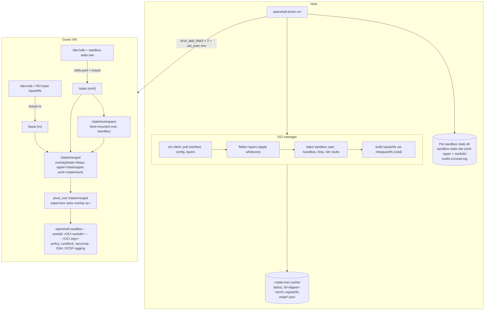
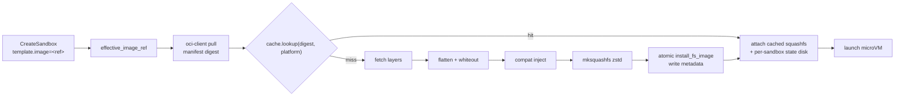
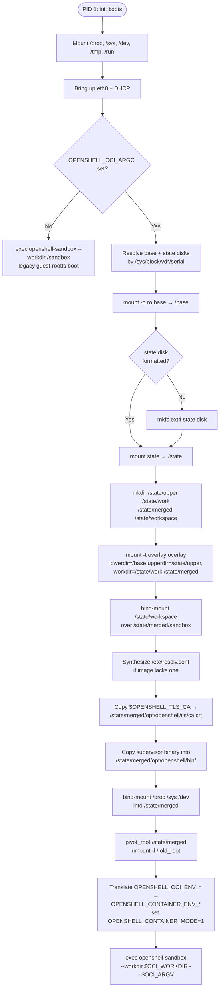
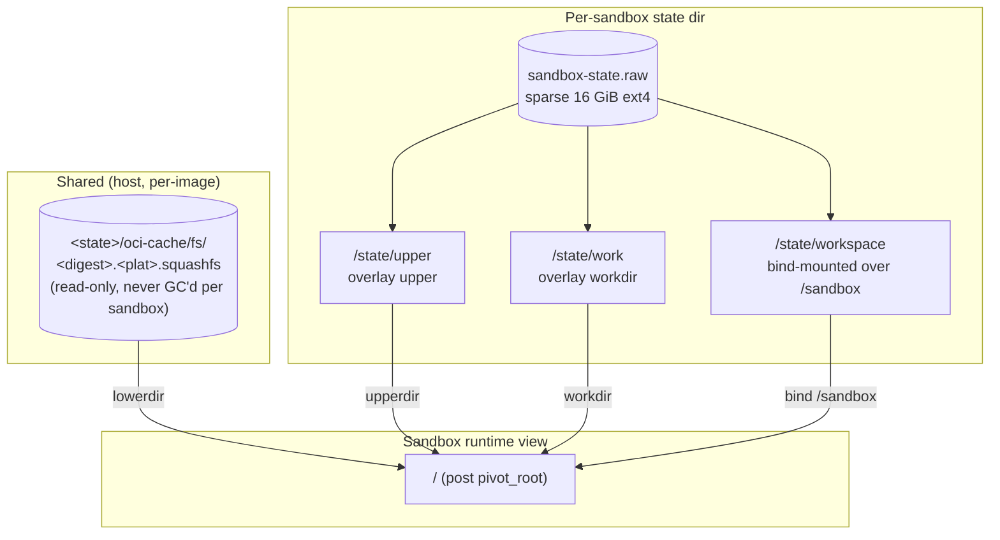

# VM Compute Driver

> Status: Experimental. The VM compute driver is a second-generation
> compute backend for OpenShell sandboxes. Kubernetes remains the default.

## Overview

`openshell-driver-vm` is an in-process compute driver that runs each
sandbox as a libkrun microVM on the host. Unlike the Kubernetes driver,
it has no orchestrator dependency — the driver is a single binary that
exposes the `ComputeDriver` gRPC service and manages VMs directly.

A sandbox spec can optionally include `template.image`, an OCI image
reference. When set, the driver treats the image as the **sandbox
payload** (the user's container filesystem), not the guest OS. The fixed
libkrun guest rootfs still boots the control plane (init script,
supervisor, SSH); the OCI image is mounted as an overlay and the
supervisor `pivot_root`s into it before launching the image entrypoint.

## OCI container execution model



### Host pipeline

`crates/openshell-driver-vm/src/oci/` owns the host pipeline. The
top-level entrypoint is `oci::prepare(puller, cache, build_opts,
image_ref, env_overrides)`:

| Module | Responsibility |
|---|---|
| `client.rs` | Anonymous pull via `oci-client` with a platform resolver pinned to `linux/amd64` or `linux/arm64`. Normalizes the OCI image config into `ImageConfig`. |
| `flatten.rs` | Applies OCI layer tars in order with whiteout handling (`.wh.*`, `.wh..wh..opq`). Rejects absolute/parent-traversal paths. Dispatches on media type (`tar`, `tar+gzip`). |
| `compat.rs` | Injects `sandbox:10001:10001` into `/etc/passwd` + `/etc/group`, ensures `/sandbox` (0755) and `/tmp` (1777) exist, writes placeholder `/etc/hosts` and `/etc/resolv.conf`. Idempotent. Picks best shell (`/bin/sh` → `/sbin/nologin` → `/bin/false`). |
| `fs_image.rs` | Shells out to `mksquashfs` with explicit binary path (no `$PATH` reliance), zstd by default. |
| `cache.rs` | Content-addressed layout `blobs/ + fs/<hex>.<plat>.squashfs + meta/<hex>.<plat>.json + tmp/`. Atomic writes; idempotent `lookup()` + `install_fs_image()`. |
| `metadata.rs` | `LaunchMetadata::build` — argv = `Entrypoint + Cmd` (precedence), workdir fallback `/sandbox`, env merge `OCI < template < spec`. `to_guest_env_vars()` packs into `OPENSHELL_OCI_ARGC/ARGV_<i>/ENV_COUNT/ENV_<i>/WORKDIR`. |
| `pipeline.rs` | End-to-end orchestrator. On cache hit, zero network I/O. On miss: pull → flatten → inject → build → install. |

Cache is keyed by `(manifest digest, platform)`. Repeated launches of
the same image skip pull and rebuild entirely — the driver just attaches
the cached squashfs to the VM.



### Guest init and pivot

`crates/openshell-driver-vm/scripts/openshell-vm-sandbox-init.sh` is the
guest's PID 1. OCI mode is gated on `OPENSHELL_OCI_ARGC` being set in
the guest environ (delivered via libkrun `set_exec`).



`oci_launch_supervisor` steps:

1. Resolves the RO base device (`block_id=oci-base`) and state device
   (`block_id=sandbox-state`) by walking `/sys/block/vd*/serial`. Falls
   back to `/dev/vda` / `/dev/vdb` when serial lookup is unavailable;
   `OPENSHELL_VM_OCI_BASE_DEVICE` / `OPENSHELL_VM_STATE_DEVICE` short-
   circuit the lookup for tests and operator debugging.
2. Mounts the RO base at `/base`.
3. Formats the state device with ext4 on first boot, mounts at `/state`.
4. Creates `/state/upper`, `/state/work`, `/state/merged`, and
   `/state/workspace`.
5. Mounts overlay
   `lowerdir=/base,upperdir=/state/upper,workdir=/state/work` at
   `/state/merged`.
6. Bind-mounts `/state/workspace` over the image's `/sandbox` so the
   workdir is writable on the state disk.
7. Synthesizes `/etc/resolv.conf` if the image didn't ship one.
8. Copies the gateway-issued TLS CA (if `$OPENSHELL_TLS_CA` is set)
   into `/opt/openshell/tls/ca.crt` inside the overlay so post-pivot
   SSL trust paths stay valid.
9. Copies the supervisor binary into the upper layer (reaches the state
   disk, not the RO base).
10. Bind-mounts `/proc`, `/sys`, `/dev` into the overlay.
11. Bind-mounts `/state/merged` onto itself, `pivot_root`s into it, and
    lazy-unmounts the old root.
12. Translates `OPENSHELL_OCI_ENV_<i>` → `OPENSHELL_CONTAINER_ENV_<i>`,
    sets `OPENSHELL_CONTAINER_MODE=1`, and unsets the OCI source vars.
13. Reconstructs argv from `OPENSHELL_OCI_ARGV_<i>` and execs
    `openshell-sandbox --workdir "$OCI_WORKDIR" -- <argv>`.

### Supervisor clean-env mode

`crates/openshell-sandbox/src/container_env.rs` gates on
`OPENSHELL_CONTAINER_MODE=1`. When active, the supervisor calls
`Command::env_clear()` on the child and applies only the documented
allowlist:

- `HOME=/sandbox`, `PATH=<default>`, `TERM=xterm`
- Container env from `OPENSHELL_CONTAINER_ENV_<i>` (OCI + template/spec
  merge)
- `OPENSHELL_SANDBOX=1` (applied last — images cannot override the
  marker)
- Provider env, proxy env, TLS env from policy (layered on top by the
  existing spawn path)

Control-plane vars (`OPENSHELL_SSH_HANDSHAKE_SECRET`, driver internals,
etc.) never reach the child process. When `OPENSHELL_CONTAINER_MODE` is
unset, the supervisor keeps its historical env-inheritance behavior.

## Storage: shared RO base + per-sandbox CoW

The overlay design replaces an earlier "unpack fresh tar per sandbox"
model that's still described in the initial plan:



- **Base**: one squashfs per `(manifest digest, platform)`, shared
  across every sandbox that uses the image. Never deleted by the
  per-sandbox delete path.
- **Upper + workdir**: per-sandbox ext4 on `sandbox-state.raw`. Sparse
  16 GiB default, grows on first write. Deleted with the sandbox state
  dir on `DeleteSandbox`.
- **Workspace**: `/state/workspace` bind-mounted over the image's
  `/sandbox`. Persists alongside the state disk.

Cold start for a repeat launch of the same image is near-instant: a
block attach and two mounts; no registry round-trip, no layer
flattening, no squashfs build.

GC of the RO base cache is out of scope for v1. Operators must manage
`<state>/oci-cache/fs/*` and `<state>/oci-cache/blobs/**` manually if
they need to reclaim space.

## Driver configuration

| Flag / env var | Meaning |
|---|---|
| `--default-image` / `OPENSHELL_VM_DRIVER_DEFAULT_IMAGE` | Image used when a sandbox spec omits `template.image`. Advertised via `GetCapabilities.default_image`. Empty string disables defaulting — sandboxes without an image fall through to the legacy (non-OCI) guest-rootfs supervisor. |
| `--mksquashfs-bin` / `OPENSHELL_VM_MKSQUASHFS` | Path to the `mksquashfs` binary. Required for OCI sandboxes. Unset → OCI requests are rejected with `FailedPrecondition`. |
| `OPENSHELL_VM_DRIVER_STATE_DIR` | Root for per-sandbox state and `oci-cache/`. |

`GetCapabilities` now reports:

```json
{
  "driver_name": "openshell-driver-vm",
  "driver_version": "<ver>",
  "default_image": "<configured default or ''>",
  "supports_gpu": false
}
```

## v1 scope and assumptions

- Public OCI registries only. No authentication.
- Linux images only. `linux/amd64` or `linux/arm64` matching the host.
- One image per sandbox. No init containers or sidecars.
- The entrypoint always runs as `sandbox:sandbox` (UID/GID 10001). The
  OCI `User` field is ignored in v1.
- `template.agent_socket_path`, `template.platform_config`, and
  `template.resources` are still rejected by the VM driver.
- Sandbox lifetime is the entrypoint lifetime: when the OCI entrypoint
  exits, the sandbox transitions to exited/error.
- GPU is unsupported.
- Squashfs is the fs-image format. erofs is a candidate for later.
- No automatic cache GC.

## Related files

- `crates/openshell-driver-vm/src/driver.rs` — gRPC surface +
  sandbox lifecycle.
- `crates/openshell-driver-vm/src/runtime.rs` — libkrun launch, disk
  + vsock wiring.
- `crates/openshell-driver-vm/src/ffi.rs` — `libkrun` symbol loader.
- `crates/openshell-driver-vm/src/state_disk.rs` — sparse state disk
  create/grow + secure import socket dir.
- `crates/openshell-driver-vm/src/oci/` — OCI pipeline.
- `crates/openshell-driver-vm/scripts/openshell-vm-sandbox-init.sh` —
  guest init + `oci_launch_supervisor`.
- `crates/openshell-sandbox/src/container_env.rs` — supervisor
  clean-env baseline for container mode.
