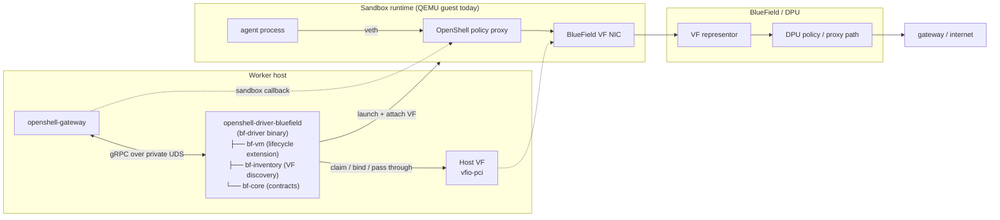

# openshell-driver-bluefield

> Status: Experimental. The current BlueField compute driver variant is
> `bf-vm`, which extends the VM compute driver with BlueField VF passthrough
> and VF-backed guest egress.

Host-side BlueField compute driver for OpenShell. This crate is a package
marker — a workspace anchor for the private `bf-*` implementation crates that
intentionally re-exports nothing. The driver runs sandbox workloads on a worker
host while offloading egress to a BlueField DPU: each sandbox claims one host
VF, which is bound to `vfio-pci` and passed through to the runtime as the
sandbox's egress NIC. The agent workload still runs behind the normal OpenShell
veth-to-policy-proxy path and never sees the VF directly.

## How it fits together



The gateway runs as a host process and spawns the BlueField driver as a
subprocess over a private Unix socket. For each sandbox the driver selects a
free host VF, binds it to `vfio-pci`, launches the sandbox runtime with the VF
attached, wires the VF as the guest egress NIC, and restores the VF to its
original binding on teardown. The resulting datapath is:

```text
agent -> veth -> OpenShell policy proxy -> VF -> DPU representor -> gateway/internet
```

## Crate Layout

The implementation is split into private `bf-*` crates so the build and review
boundaries match responsibilities:

| Crate | Role |
|---|---|
| `bf-core` | Shared contracts: VF handles (`VfRef`, `VfSlot`), DPU claims and network/storage modes, the `BluefieldLifecycleExtension` and `RuntimeAdapter` traits, sandbox state records, and error types. Holds no host I/O. |
| `bf-inventory` | VF discovery and allocation: sysfs-backed VF and representor inventories, a static inventory for tests, and the `VfPool` allocator that hands out slots. |
| `bf-vm` | The current driver implementation. A BlueField lifecycle extension over the VM compute driver that handles preflight, VF binding, guest egress wiring, host PF resolution, and guest kernel selection. |
| `bf-driver` | The external driver binary (`openshell-driver-bluefield`) that the gateway spawns. Wires the chosen implementation to the gRPC driver transport. |

## Implementations

A BlueField implementation pairs a sandbox runtime with the VF passthrough and
egress contract above. Each implementation documents its own requirements,
configuration, and validation steps.

| Implementation | Description | README |
|---|---|---|
| `bf-vm` | VM runtime adapter: BlueField VF passthrough and VF-backed guest egress on a QEMU-backed guest. The current driver variant. | [bf-vm/README.md](bf-vm/README.md) |

## Driver Contract

Regardless of implementation, the BlueField driver owns these
security-relevant behaviors:

| Behavior | Purpose |
|---|---|
| VF selection | Allocates VFs only from the configured PF, skipping reserved indexes and VFs owned by DRA, Kubernetes, or other services. |
| `vfio-pci` binding | Rebinds the selected VF to `vfio-pci` for passthrough and restores the original binding on sandbox teardown. |
| Egress placement | Configures the VF as the guest root-namespace egress NIC; the agent keeps using the veth-to-policy-proxy path and never receives the VF directly. |
| Preflight gating | Refuses to start unless host prerequisites (IOMMU, `/dev/kvm`, `vfio-pci`, required tools, a BlueField-capable guest kernel) are satisfied. |
| Lifecycle ownership | The gateway owns the driver subprocess; the driver owns VF claim, runtime launch, and cleanup so leaked VFs are returned to the host. |

## Build and Deploy

The driver binary is built from `bf-driver` and installed where the gateway's
VM driver path expects it. Build commands, install layout, gateway and driver
configuration, sandbox lifecycle, network verification, and troubleshooting
live with the implementation in [`bf-vm/README.md`](bf-vm/README.md).
