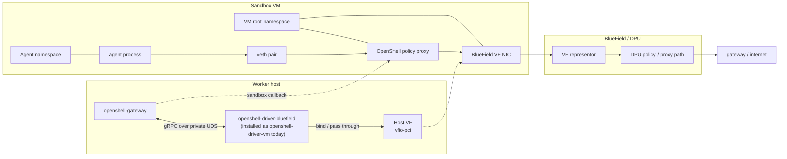

# bf-vm

> Status: Experimental. `bf-vm` is the current BlueField compute driver
> variant. It extends the VM compute driver with BlueField VF passthrough and
> VF-backed guest egress.

`bf-vm` is the bare-metal VM runtime adapter for the OpenShell BlueField
driver. It wraps the VM compute driver with a BlueField lifecycle extension
that claims one host VF per sandbox, binds it to `vfio-pci`, passes it into the
QEMU guest, and configures the guest root namespace to use that VF as the
egress NIC.

The agent workload still runs behind the normal OpenShell sandbox
veth-to-policy-proxy path. The agent does not see the VF directly.

## Runtime Model



The current path is:

```text
agent -> veth -> OpenShell policy proxy -> VF -> DPU representor -> gateway/internet
```

## bf-vm Contract

The `bf-vm` variant is QEMU-backed. It has VM-specific requirements:

- `/dev/kvm` exists.
- IOMMU is enabled, for example `intel_iommu=on iommu=pt`.
- IOMMU groups are populated.
- `vfio-pci` is loaded.
- `qemu-system-x86_64`, `ip`, `nft`, `debugfs`, and `mkfs.ext4` or `mke2fs`
  are on `PATH`.
- The BlueField or ConnectX PF has SR-IOV VFs.
- At least one VF is not owned by DRA, Kubernetes, or another service.
- A BlueField-capable `vmlinux` is staged with the VM runtime assets.

The `vmlinux` is the VM guest kernel, not the host kernel. It must boot the
OpenShell root disk without an initrd, so the root block device and filesystem
support needed by the VM image must be built in.

## Build

From the OpenShell repo root:

```shell
cargo build --release \
  -p openshell-cli \
  -p openshell-server \
  -p bf-driver
```

If package builds need bundled Z3 for the CLI and gateway, enable the
package-qualified features:

```shell
cargo build --release \
  -p openshell-cli \
  -p openshell-server \
  -p bf-driver \
  --features openshell-cli/bundled-z3,openshell-server/bundled-z3
```

The BlueField driver binary is:

```text
target/release/openshell-driver-bluefield
```

## Install Layout

Stage the gateway, CLI, BlueField driver, and VM runtime assets on the worker:

```text
/opt/openshell/bin/openshell
/opt/openshell/bin/openshell-gateway
/opt/openshell/libexec/openshell/openshell-driver-vm
/opt/openshell/vm-runtime/vmlinux
/opt/openshell/vm-runtime/gvproxy
/opt/openshell/vm-runtime/libkrun.so
/opt/openshell/vm-runtime/umoci
```

Current integration note: the gateway VM driver path resolves a binary named
`openshell-driver-vm` from `[openshell.drivers.vm].driver_dir`. Until the
gateway has a first-class BlueField driver selector, install or symlink the
BlueField binary at that name:

```shell
sudo install -d -m 0755 /opt/openshell/bin /opt/openshell/libexec/openshell
sudo install -m 0755 target/release/openshell /opt/openshell/bin/openshell
sudo install -m 0755 target/release/openshell-gateway /opt/openshell/bin/openshell-gateway
sudo install -m 0755 target/release/openshell-driver-bluefield \
  /opt/openshell/libexec/openshell/openshell-driver-vm
```

## Gateway Configuration

Configure the gateway to use the VM driver path and point `driver_dir` at the
staged BlueField binary:

```toml
[openshell]
version = 1

[openshell.gateway]
bind_address = "0.0.0.0:18083"
disable_tls = true
compute_drivers = ["vm"]
default_image = "ghcr.io/nvidia/openshell-community/sandboxes/base:latest"

[openshell.drivers.vm]
grpc_endpoint = "http://10.0.110.4:18083"
driver_dir = "/opt/openshell/libexec/openshell"
state_dir = "/var/lib/openshell/bluefield-vm-driver"
default_image = "ghcr.io/nvidia/openshell-community/sandboxes/base:latest"
bootstrap_image = "ghcr.io/nvidia/openshell-community/sandboxes/base:latest"
```

`grpc_endpoint` must be reachable from inside the VM guest. For a split host
deployment, use the gateway's real host address, not `127.0.0.1`.

## Driver Configuration

Set these in the gateway service environment so the gateway-spawned driver
inherits them:

```shell
export OPENSHELL_BLUEFIELD=1
export OPENSHELL_BLUEFIELD_HOST_PF=enp177s0f0np0
export OPENSHELL_BLUEFIELD_EGRESS_CIDR=100.64.3.30/24
export OPENSHELL_BLUEFIELD_EGRESS_GATEWAY=100.64.3.1
export OPENSHELL_BLUEFIELD_KERNEL_IMAGE=/opt/openshell/vm-runtime/vmlinux
```

Reserve VF indexes that should not be allocated:

```shell
export OPENSHELL_BLUEFIELD_RESERVED_VF_INDEXES=0,1,2,3,4
```

Use one static address for a single-sandbox validation:

```shell
export OPENSHELL_BLUEFIELD_EGRESS_CIDR=100.64.3.30/24
```

Use a pool when more than one VF can run sandboxes:

```shell
export OPENSHELL_BLUEFIELD_EGRESS_CIDR_POOL=100.64.3.30/24,100.64.3.31/24
```

| Variable | Purpose |
|---|---|
| `OPENSHELL_BLUEFIELD_HOST_PF` | Host PF netdev or BDF used for VF discovery. |
| `OPENSHELL_BLUEFIELD_RESERVED_VF_INDEXES` | Comma-separated VF indexes excluded from allocation. |
| `OPENSHELL_BLUEFIELD_EGRESS_CIDR` | Static guest VF address for single-sandbox validation. |
| `OPENSHELL_BLUEFIELD_EGRESS_CIDR_POOL` | Per-VF guest address pool for multiple usable VFs. |
| `OPENSHELL_BLUEFIELD_EGRESS_GATEWAY` | Gateway reachable through the passed-through VF. |
| `OPENSHELL_BLUEFIELD_KERNEL_IMAGE` | BlueField-capable guest kernel image. |

## Starting The Gateway

Run the gateway with the config and environment above:

```shell
sudo -E /opt/openshell/bin/openshell-gateway \
  --config /opt/openshell/etc/gateway.toml \
  --db-url 'sqlite:/var/lib/openshell/gateway/openshell.db?mode=rwc'
```

For a persistent deployment, put the same command and environment into a
systemd unit. The gateway owns the driver subprocess and passes the expected
gateway PID to the driver's Unix socket listener.

## Sandbox Lifecycle

Register the gateway:

```shell
/opt/openshell/bin/openshell gateway add \
  http://10.0.110.4:18083 \
  --local \
  --name worker3-bf

/opt/openshell/bin/openshell --gateway worker3-bf status
```

Create a sandbox:

```shell
/opt/openshell/bin/openshell --gateway worker3-bf sandbox create \
  --name bf-vf-egress \
  --from ghcr.io/nvidia/openshell-community/sandboxes/base:latest \
  -- sleep infinity
```

Inspect or connect:

```shell
/opt/openshell/bin/openshell --gateway worker3-bf sandbox list
/opt/openshell/bin/openshell --gateway worker3-bf sandbox connect bf-vf-egress
```

Delete the sandbox when finished:

```shell
/opt/openshell/bin/openshell --gateway worker3-bf sandbox delete bf-vf-egress
```

## Network Verification

The sandbox process should see the normal OpenShell sandbox network path, not
the BlueField VF:

```shell
/opt/openshell/bin/openshell --gateway worker3-bf sandbox exec \
  --name bf-vf-egress -- ip link
```

Verify internet egress through the policy path:

```shell
/opt/openshell/bin/openshell --gateway worker3-bf sandbox exec \
  --name bf-vf-egress -- curl -I https://example.com
```

On the host, the selected VF should be bound to `vfio-pci` while the sandbox is
running and restored when the sandbox is deleted.

## Worker3 Validation Values

The worker3 validation used:

```text
gateway: 10.0.110.4:18083
host: worker3 / 10.0.110.23
PF: enp177s0f0np0 / 0000:b1:00.0
VF: enp177s0f0v29 / 0000:b1:04.1
DPU representor: pf0vf29
guest VF address: 100.64.3.30/24
guest VF gateway: 100.64.3.1
```

## Troubleshooting

If the driver fails at startup, fix every preflight item it reports. Common
causes are missing `qemu-system-x86_64`, missing `/dev/kvm`, missing
`vfio-pci`, no isolated IOMMU group for the VF, or a missing BlueField guest
kernel.

If the gateway cannot find the driver, confirm:

```shell
ls -l /opt/openshell/libexec/openshell/openshell-driver-vm
```

If sandbox creation starts but the VM does not boot, inspect the VM driver
state directory and console logs:

```shell
sudo find /var/lib/openshell/bluefield-vm-driver -maxdepth 3 -type f | sort
```

If egress fails, check:

- the selected VF is not allocated elsewhere,
- the guest egress CIDR is free,
- the guest egress gateway is reachable through the VF,
- the DPU-side representor and policy path are already provisioned, and
- the gateway endpoint is allowlisted by policy when it is on a private IP.
