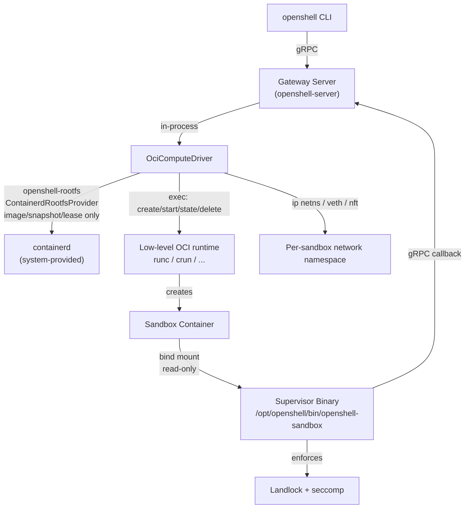

# openshell-driver-oci

The OCI compute driver builds sandbox containers directly from Linux kernel
primitives (namespaces, cgroups v2) by driving a **system-provided
`containerd`** for image management and directly invoking a **configurable
low-level OCI runtime** (`runc` by default, `crun`, or any other
OCI-runtime-spec-compatible binary already installed on the host) itself. It
runs in-process within the gateway server, the same way the Docker, Podman,
and Kubernetes drivers do.

**This driver — not containerd — spawns the sandbox's process.** containerd
is used only for image pull/unpack and snapshot management, and only behind
the `openshell-rootfs` provider boundary (`ContainerdRootfsProvider`); it
never creates a containerd `Container` or `Task` object, and its shim
(`io.containerd.runc.v2`) is never involved. This driver consumes only the
provider's prepared mounts: it builds a standard OCI bundle (`config.json` +
a mounted `rootfs/`) from them and drives the configured runtime directly
through its own `create`/`start`/`state`/`kill`/`delete` CLI contract. It
never bundles, installs, or manages `containerd` itself, and it never
bundles the low-level runtime either — both must already be present on the
host. Keeping containerd behind the rootfs-provider boundary (rather than in
this driver's own contract) leaves room to swap in a daemonless provider
without redesigning the driver. See
[`docs/reference/sandbox-compute-drivers.mdx`](../../docs/reference/sandbox-compute-drivers.mdx#oci-driver)
for the user-facing reference and known gaps.

## Architecture

## What this crate owns vs. what containerd owns

| Concern | Owner |
|---|---|
| Registry pull, layer download, unpack | containerd's `Transfer` + `Images` + `Content` services, driven by `openshell-rootfs`'s `ContainerdRootfsProvider` |
| Writable per-sandbox rootfs layer | containerd's `Snapshots` service (`Prepare`), behind the same provider |
| Protecting that snapshot from containerd's background GC | containerd's `Leases` service, managed internally by the provider — necessary precisely because this driver never registers a `Container`/`Task` that would otherwise reference it |
| OCI runtime spec (namespaces, cgroups v2, capabilities, seccomp defaults) | This crate (`spec.rs`), generated from OpenShell policy |
| Bundle assembly (mounting the snapshot, writing `config.json`) | This crate (`runtime.rs`) |
| Namespace/cgroup/seccomp *enforcement*, and the actual `create`/`start`/`state`/`kill`/`delete` process invocations | This crate (`runtime.rs`), execing the configured low-level runtime directly — containerd is never involved |
| Network namespace, veth pair, nftables ruleset | This crate (`network.rs`), reusing `openshell-nft-ruleset` |
| GPU device nodes | This crate (`gpu.rs`), kernel device-node passthrough only (see below) |
| Tracking which sandboxes exist | This crate's own state directory (`state_dir/bundles/<sandbox>/`), scanned directly — containerd has no record of these containers at all |

## Isolation Model

Matches the Podman driver's resolved capability set (see
`openshell-driver-podman/README.md`'s Isolation Model table for the full
rationale behind each capability): `CHOWN`, `FOWNER`, `SETGID`, `SETUID`,
`SETPCAP`, `SYS_ADMIN`, `NET_ADMIN`, `SYS_PTRACE`, `SYSLOG`,
`DAC_READ_SEARCH`, `no_new_privileges=true`, and an unconfined
container-level seccomp profile (the supervisor installs its own
policy-aware BPF filter at runtime).

Namespaces: `pid`, `ipc`, `uts`, `mnt`, `cgroup`, `net` (joined to a
driver-managed, pre-created namespace — see Networking below), plus an
optional `user` namespace when `rootless` is enabled (see Known Gaps).

## Networking

Each sandbox gets a dedicated network namespace (`ip netns add`) joined to
the host through a veth pair, addressed from a deterministic `/30` slot
derived from the sandbox ID (no shared allocator state needed across driver
restarts — see `network.rs::SandboxNetwork::plan`). The nftables ruleset is
generated by the shared `openshell-nft-ruleset` crate (also used by
`openshell-driver-vm`), with a distinct table-name prefix
(`openshell_oci`) so the two drivers can never collide on a table name
on a shared host.

## GPU Support

Kernel device-node passthrough only: `/dev/nvidia<N>` plus the shared
control devices (`/dev/nvidiactl`, `/dev/nvidia-uvm`,
`/dev/nvidia-uvm-tools`), added as OCI `LinuxDevice` entries with matching
device-cgroup allow-list entries (`gpu.rs`). This does **not** perform full
CDI spec injection the way `nvidia-container-toolkit` does for Docker,
Podman, and Kubernetes' CRI plugin (userspace driver library mounts,
`nvidia-ctk`-style hooks). GPU device inventory discovery and selection
reuse the shared `openshell_core::gpu` CDI selector so device IDs are
resolved the same way as the Docker/Podman drivers.

## Known Gaps

- **Rootless mode (`rootless = true`) is not yet functional.** The OCI spec
  generation for a Linux user namespace + UID/GID mapping is correct and
  unit-tested (`spec.rs`), but containerd's prepared writable snapshot is
  not remapped to match, so container start currently fails while mounting
  `/proc` (`error mounting "proc" to rootfs ...: permission denied`).
  Verified against a real containerd + runc install. Fixing this needs one
  of: chowning the snapshot's upperdir to the mapped range before start,
  ID-mapped mounts (Linux 5.12+), or containerd 1.7+'s remapped-snapshot
  support. `rootless` therefore defaults to `false`.
- **No image-based supervisor injection yet.** `supervisor_binary_path`
  bind-mounts a binary from the gateway host's filesystem rather than
  pulling a dedicated supervisor OCI image the way the other drivers do.
- **`WatchSandboxes` polls** `list_sandboxes` every two seconds rather than
  subscribing to containerd's own event stream. Functionally correct,
  higher-latency than a push subscription would be.
- **CDI GPU injection is device-node-only** (see above).
- **Sandbox discovery is a state-directory scan**, not a containerd query
  (there is nothing for containerd to query — see the table above). A
  `state_dir` shared or manually edited by something other than this
  driver process could produce inconsistent `list_sandboxes` results;
  this matches the trust model the VM driver already uses for its own
  state directory.

## containerd Leases (why they exist here)

Every other in-tree driver that talks to a container engine registers a
persistent object (a Docker/Podman container, a containerd `Container`) that
the engine itself uses to know a resource is still wanted. This driver
deliberately never creates that containerd-side object — see "What this
crate owns vs. what containerd owns" above — which means the writable
snapshot it prepares has **nothing** protecting it from containerd's
background garbage collector by default. This was not a theoretical
concern: during development, an otherwise-identical flow without a lease
failed at teardown with `snapshot ... does not exist` because GC had
already reaped it. `openshell-rootfs`'s `ContainerdRootfsProvider` closes
that gap internally by attaching the snapshot to a lease in `prepare()` and
deleting the lease in `release()` at sandbox teardown.

## Testing

Unit tests (`cargo test -p openshell-driver-oci --lib`) cover OCI spec
generation, nftables ruleset generation, GPU device resolution,
bundle/state-directory bookkeeping, and config validation — all
pure/deterministic, no containerd required. Chain-ID computation and the
rest of the containerd image handling are covered by
`cargo test -p openshell-rootfs`.

`tests/containerd_integration.rs` is a real end-to-end test against a live
containerd (pull → chain-ID resolve → lease-protected snapshot prepare →
bundle mount → `create`/`start`/`state`/`delete` directly against the
low-level runtime → stop → delete, plus network namespace isolation). It
runs the full round trip against both `runc` and `crun` to prove the
configurable-runtime design point end to end. It is `#[ignore]`d by default
(requires a reachable containerd socket, the configured runtime, `CAP_NET_ADMIN`,
and network access) — see the module doc comment in that file for how to run it.
