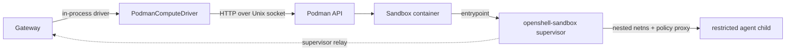

# openshell-driver-podman

Podman-backed compute driver for rootless and single-machine OpenShell
deployments.

The driver talks to the Podman libpod REST API over a Unix socket. The gateway
usually constructs it in-process, while the crate also ships an
`openshell-driver-podman` binary that exposes the shared compute-driver gRPC
surface for standalone use and tests. Each sandbox is one Podman container, and
the `openshell-sandbox` supervisor inside that container owns the actual agent
isolation.

## Source Map

All paths are relative to `crates/openshell-driver-podman/src/`.

| File | Purpose |
|---|---|
| `lib.rs` | Crate root and public re-exports. |
| `main.rs` | Standalone driver binary, CLI/env parsing, and gRPC server startup. |
| `driver.rs` | Sandbox lifecycle, image pulls, network setup, endpoint detection, GPU checks, and rootless preflight checks. |
| `client.rs` | Async HTTP/1.1 client for Podman libpod APIs over a Unix socket. |
| `container.rs` | Podman container spec construction, environment ownership, labels, resources, capabilities, mounts, health checks, port mappings, secrets, and CDI devices. |
| `config.rs` | `PodmanComputeConfig`, image pull policy parsing, default socket paths, TLS validation, and redacted debug output. |
| `grpc.rs` | Tonic service adapter from the compute-driver protobuf API to the Rust driver methods. |
| `watcher.rs` | Initial state sync and live Podman event stream mapping into gateway watch events. |

## Runtime Model



The container is the outer runtime boundary. Inside it, the supervisor creates a
nested network namespace, starts the CONNECT policy proxy, applies
Landlock/seccomp controls, opens the supervisor relay back to the gateway, and
launches agent commands as the unprivileged sandbox user.

The driver configures container runtime details only. It does not enforce
OpenShell filesystem, process, network, inference, or credential policy itself.
Those controls stay in `openshell-sandbox` so Podman, Docker, Kubernetes, and VM
runtimes share the same sandbox contract.

## Driver Comparison

| Aspect | Kubernetes | Docker | VM | Podman |
|---|---|---|---|---|
| Driver shape | In-process | In-process | Gateway-spawned subprocess | In-process, with standalone binary support |
| Backend | Kubernetes API | Docker daemon | libkrun and gvproxy | Podman libpod REST API over UDS |
| Outer boundary | Pod | Container | MicroVM | Container |
| Supervisor delivery | Supervisor image or init copy into pod volume | Extracted or mounted supervisor binary | Embedded guest bundle | Read-only OCI image volume |
| Callback path | Pod to gateway service or endpoint | Host networking | gvproxy host-loopback NAT | `host.containers.internal` or explicit endpoint |
| SSH transport | Supervisor relay | Supervisor relay | Supervisor relay | Supervisor relay |
| GPU support | `nvidia.com/gpu` resource | CDI when daemon supports it | Experimental VFIO path | CDI device request when NVIDIA devices exist |
| State owner | Kubernetes API | Docker daemon | Driver state dir | Podman daemon |

## Startup Checks

`PodmanComputeDriver::new` validates the host before accepting sandbox work:

- Verifies the configured Podman socket path exists, then pings `/_ping`.
- Fetches `/libpod/info` and rejects cgroups v1 because rootless Podman needs
  cgroups v2.
- Logs the Podman network backend and whether Podman reports rootless mode.
- Warns when the current user appears to lack `/etc/subuid` or `/etc/subgid`
  ranges. This is not a hard failure because some systems provide subordinate
  IDs through directory services.
- Creates or reuses the configured bridge network with DNS enabled.
- Auto-detects the sandbox callback endpoint when `OPENSHELL_GRPC_ENDPOINT` is
  unset.

The default socket path is `$XDG_RUNTIME_DIR/podman/podman.sock` on Linux, with
`/run/user/<uid>/podman/podman.sock` as the fallback. On macOS it is
`$HOME/.local/share/containers/podman/machine/podman.sock`.

## Supervisor Delivery

Podman uses an OCI image volume to mount the supervisor image read-only at
`/opt/openshell/bin`. The supervisor image target in
`deploy/docker/Dockerfile.images` copies the `openshell-sandbox` binary to
`/openshell-sandbox`; mounting that image at `/opt/openshell/bin` makes the
binary available as `/opt/openshell/bin/openshell-sandbox`.

The container spec sets that binary as the entrypoint. This avoids relying on
the sandbox image entrypoint or command, which might otherwise append the
supervisor path as an argument to an image-provided shell.

This model keeps the supervisor outside the mutable sandbox image without using
a hostPath-style bind mount.

## Container Contract

The generated libpod create spec sets security-critical fields directly and
lets driver-owned values override template values.

| Setting | Value | Purpose |
|---|---|---|
| `user` | `0:0` | The supervisor starts as root inside the container so it can create namespaces, configure mounts, and install sandbox controls. |
| `entrypoint` | `/opt/openshell/bin/openshell-sandbox` | Runs the supervisor directly regardless of the sandbox image entrypoint. |
| `volumes` | Named volume mounted at `/sandbox` | Provides the sandbox workspace. |
| `image_volumes` | Supervisor image mounted read-only at `/opt/openshell/bin` | Sideloads the supervisor binary. |
| `netns` | `bridge` | Attaches the container to the configured Podman bridge network. |
| `portmappings` | Container SSH port to host port `0` | Requests an ephemeral host port for compatibility and health/debug paths. |
| `hostadd` | `host.containers.internal` and `host.openshell.internal` to `host-gateway` | Gives containers stable names for services on the gateway host. |
| `mounts` | Private tmpfs at `/run/netns` | Lets the supervisor create named network namespaces under rootless Podman. |
| `no_new_privileges` | `true` | Prevents privilege escalation through exec. |
| `seccomp_profile_path` | `unconfined` | Avoids Podman's container-level profile blocking Landlock/seccomp setup before the supervisor installs its own policy-aware filter. |

The agent child loses the supervisor's privileges before user code runs.

## Capabilities

Podman's default container capability set is restricted. The driver drops
capabilities the supervisor does not need and adds the extra ones required for
OpenShell isolation.

| Capability | Purpose |
|---|---|
| `SYS_ADMIN` | Namespace creation, Landlock setup, and seccomp filter installation. |
| `NET_ADMIN` | Veth, route, and iptables setup for the inner sandbox namespace. |
| `SYS_PTRACE` | `/proc/<pid>/exe` inspection and ancestor walking for binary identity. |
| `SYSLOG` | `/dev/kmsg` access for bypass diagnostics. |
| `DAC_READ_SEARCH` | Cross-UID `/proc/<pid>/fd` reads needed by proxy process identity checks in rootless Podman. |

The driver intentionally keeps Podman's default `SETUID`, `SETGID`, `CHOWN`,
and `FOWNER` capabilities because the supervisor needs them to drop privileges
and prepare writable sandbox directories. It drops unneeded defaults such as
`DAC_OVERRIDE`, `FSETID`, `KILL`, `NET_BIND_SERVICE`, `NET_RAW`, `SETFCAP`,
`SETPCAP`, and `SYS_CHROOT`.

## Rootless Networking

Podman networking is a stack of cooperating projects:

| Component | Role |
|---|---|
| Podman | Container runtime and lifecycle orchestration. |
| Netavark | Network setup, bridge creation, IPAM, and firewall rules. |
| aardvark-dns | DNS for Podman bridge networks when DNS is enabled. |
| pasta | User-mode host connectivity for common rootless networking paths. |

Rootful bridge networking can create host bridges, veth pairs, and firewall
rules directly. Rootless Podman cannot create those host-level interfaces as an
unprivileged user, so common rootless deployments use pasta to translate traffic
between the rootless network namespace and host sockets. The driver does not
configure pasta directly. It asks Podman for bridge mode on the configured
network and logs the backend reported by Podman.

The important operational constraint is that the Podman bridge address range is
not a reliable host-routable address in rootless mode. Sandbox callbacks to the
gateway should use `host.containers.internal`, `host.openshell.internal`, or an
explicit `OPENSHELL_GRPC_ENDPOINT`, not the container's bridge IP.

## Network Layers

Podman-backed sandboxes have three network layers:

```text
Host
  |
  |  Gateway listens on the configured bind address and port.
  |  Rootless Podman may use pasta for host/container translation.
  |
Podman bridge network, default "openshell"
  |
  |  Sandbox container default namespace.
  |  Supervisor, policy proxy, and relay client run here.
  |
Inner sandbox network namespace
  |
  |  Created by the supervisor with a veth pair.
  |  Agent processes run here as the sandbox user.
```

The driver creates or reuses the Podman bridge with DNS enabled. The supervisor
then creates the inner namespace, configures a veth pair, and routes ordinary
agent egress through the local CONNECT proxy. The proxy evaluates destination,
binary identity, SSRF protections, TLS/L7 rules, and inference interception.

The supervisor uses `nsenter --net=` for namespace operations instead of
`ip netns exec` so rootless containers avoid the sysfs remount path that needs
real host `CAP_SYS_ADMIN`.

## Data Paths

Sandbox-to-gateway callbacks use the endpoint in `OPENSHELL_ENDPOINT`. When the
gateway did not configure one, the Podman driver builds it from the gateway
port and TLS state:

- `http://host.containers.internal:<port>` when sandbox mTLS is not configured.
- `https://host.containers.internal:<port>` when all three sandbox TLS paths are
  configured.

Interactive sessions use the supervisor relay. The CLI opens a session with the
gateway, the gateway sends `RelayOpen` over the existing supervisor session, and
the supervisor opens a relay stream back to the gateway. The supervisor then
bridges that stream to the Unix socket at `OPENSHELL_SSH_SOCKET_PATH`, usually
`/run/openshell/ssh.sock`. Sandbox SSH does not require direct ingress to the
container.

Agent outbound traffic stays separate. The agent process connects to the local
proxy in the inner namespace. If policy allows the request, the proxy opens the
upstream connection from the container namespace and Podman carries it out
through the configured rootless or rootful network backend.

## Secrets and Environment

The SSH handshake secret is created as a Podman secret and injected with the
libpod `secret_env` map. That keeps it out of `podman inspect`, although it is
still an environment variable visible to the supervisor process before the
supervisor scrubs it from child environments.

The container environment is built in priority order:

1. Sandbox spec and template environment.
2. Driver-controlled values that always overwrite user-supplied values.
3. TLS client paths when sandbox mTLS is enabled.

Driver-controlled values include:

- `OPENSHELL_SANDBOX`
- `OPENSHELL_SANDBOX_ID`
- `OPENSHELL_ENDPOINT`
- `OPENSHELL_SSH_SOCKET_PATH`
- `OPENSHELL_SSH_HANDSHAKE_SKEW_SECS`
- `OPENSHELL_CONTAINER_IMAGE`
- `OPENSHELL_SANDBOX_COMMAND`

Sandbox images and templates must not be allowed to spoof identity, callback,
relay, command metadata, or TLS path values.

## TLS

When all three Podman TLS paths are set, the driver treats sandbox callbacks as
mTLS callbacks:

- `OPENSHELL_PODMAN_TLS_CA`
- `OPENSHELL_PODMAN_TLS_CERT`
- `OPENSHELL_PODMAN_TLS_KEY`

The driver validates that these paths are provided as a complete set. Partial
configuration fails early instead of silently falling back to plaintext.

When enabled, the files are mounted read-only into the container at:

- `/etc/openshell/tls/client/ca.crt`
- `/etc/openshell/tls/client/tls.crt`
- `/etc/openshell/tls/client/tls.key`

The driver also sets `OPENSHELL_TLS_CA`, `OPENSHELL_TLS_CERT`, and
`OPENSHELL_TLS_KEY` to those container-side paths. On SELinux systems, the bind
mounts include Podman's shared relabel option so the container process can read
the files.

RPM installations generate a local PKI on first start and configure these paths
for the Podman driver. See `deploy/rpm/CONFIGURATION.md` for package-level
details.

## Sandbox Lifecycle

Create follows this order:

1. Validate the sandbox name and ID, then validate the derived Podman resource
   names before creating anything.
2. Pull or verify the supervisor image with the `missing` policy.
3. Pull or verify the sandbox image with `OPENSHELL_SANDBOX_IMAGE_PULL_POLICY`.
4. Create the Podman secret for the SSH handshake secret.
5. Create the workspace volume.
6. Create the container from the generated spec.
7. Start the container.

Failures roll back resources created earlier in the flow. A container name
conflict removes the new sandbox's workspace volume and handshake secret because
those resources are keyed by sandbox ID, not by the conflicting container.

Delete is idempotent:

1. Validate the sandbox ID and derived container name.
2. Best-effort inspect the container and warn if its sandbox ID label differs.
3. Stop the container using the configured timeout.
4. Force-remove the container and attached anonymous volumes.
5. Remove the workspace volume derived from the request sandbox ID.
6. Remove the handshake secret derived from the request sandbox ID.

If the container is already gone, the driver still attempts volume and secret
cleanup and returns that no container existed.

## Readiness

The container health check accepts any of these readiness signals:

- The legacy marker file `/var/run/openshell-ssh-ready` exists.
- The configured supervisor Unix socket path exists and is a socket.
- Something listens on the configured in-container SSH TCP port.

The Unix socket check is the preferred relay-only path. The TCP port mapping is
kept for compatibility with older readiness and debug flows.

## GPU Support

The Podman driver reports GPU support when `/dev/nvidia0` exists on the gateway
host. If a sandbox requests GPU support and that device is missing, validation
fails before container creation.

When GPU support is requested, the container spec includes the CDI device
request `nvidia.com/gpu=all`. The host must have NVIDIA CDI specs available to
Podman, and the sandbox image must include user-space libraries required by the
workload.

## Configuration

The gateway configures the in-process driver from gateway settings and selected
environment variables. The standalone `openshell-driver-podman` binary exposes
the same fields as CLI flags and env vars.

| Env var | Standalone flag | Default | Purpose |
|---|---|---|---|
| `OPENSHELL_PODMAN_SOCKET` | `--podman-socket` | Platform default socket path | Podman API Unix socket. |
| `OPENSHELL_SANDBOX_IMAGE` | `--sandbox-image` | Gateway default sandbox image | Fallback OCI image for sandboxes that do not specify one. |
| `OPENSHELL_SANDBOX_IMAGE_PULL_POLICY` | `--sandbox-image-pull-policy` | `missing` | Pull policy for sandbox images: `always`, `missing`, `never`, or `newer`. |
| `OPENSHELL_GRPC_ENDPOINT` | `--grpc-endpoint` | Auto-detected `host.containers.internal` URL | Callback endpoint injected into sandboxes. |
| `OPENSHELL_GATEWAY_PORT` | `--gateway-port` | `8080` | Gateway port used for endpoint auto-detection by the standalone binary. |
| `OPENSHELL_NETWORK_NAME` | `--network-name` | `openshell` | Podman bridge network name. |
| `OPENSHELL_SANDBOX_SSH_PORT` | `--sandbox-ssh-port` | `2222` | In-container SSH compatibility port. |
| `OPENSHELL_SANDBOX_SSH_SOCKET_PATH` | `--sandbox-ssh-socket-path` | `/run/openshell/ssh.sock` | Supervisor Unix socket path for relay traffic. |
| `OPENSHELL_SSH_HANDSHAKE_SECRET` | `--ssh-handshake-secret` | Gateway-generated or required standalone | Shared secret for the NSSH1 handshake. |
| `OPENSHELL_SSH_HANDSHAKE_SKEW_SECS` | `--ssh-handshake-skew-secs` | `300` | Allowed timestamp skew for SSH handshake validation. |
| `OPENSHELL_STOP_TIMEOUT` | `--stop-timeout` | `10` | Container stop timeout in seconds. |
| `OPENSHELL_SUPERVISOR_IMAGE` | `--supervisor-image` | `openshell/supervisor:latest` through the gateway, required standalone | OCI image that supplies `openshell-sandbox`. |
| `OPENSHELL_PODMAN_TLS_CA` | `--podman-tls-ca` | unset | Host path to the CA certificate mounted for sandbox mTLS. |
| `OPENSHELL_PODMAN_TLS_CERT` | `--podman-tls-cert` | unset | Host path to the client certificate mounted for sandbox mTLS. |
| `OPENSHELL_PODMAN_TLS_KEY` | `--podman-tls-key` | unset | Host path to the client private key mounted for sandbox mTLS. |

## Operational Notes

- Prefer explicit `OPENSHELL_GRPC_ENDPOINT` only when the auto-detected
  `host.containers.internal` endpoint is not appropriate for the deployment.
- Keep the gateway bound to an address that sandbox containers can reach. RPM
  deployments bind on `0.0.0.0` and rely on mTLS for access control.
- Avoid relying on Podman bridge IPs from the host in rootless deployments.
  Use `host.containers.internal`, `host.openshell.internal`, published ports, or
  the supervisor relay.
- Rootless networking behavior depends on the backend reported by Podman. The
  driver logs that backend at startup for troubleshooting.
- For sandbox infrastructure changes, run the Podman e2e path and update this
  README when the operator-facing contract changes.
