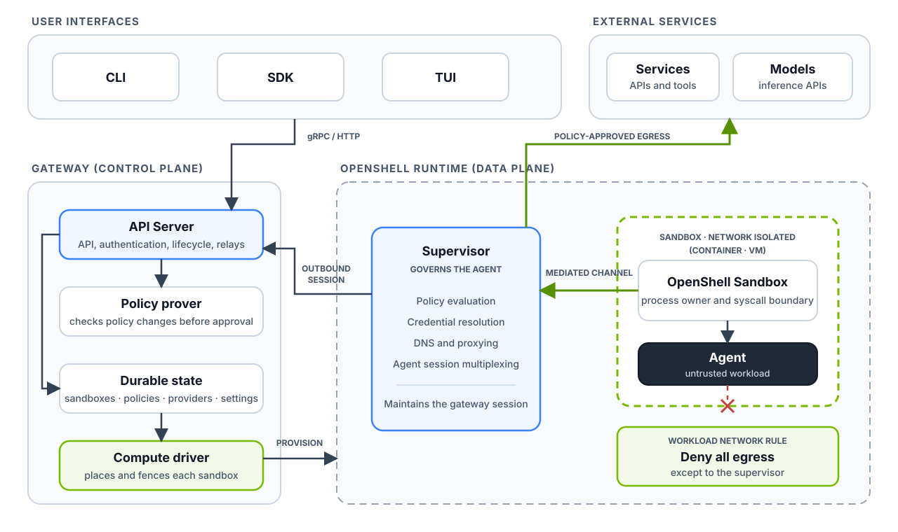
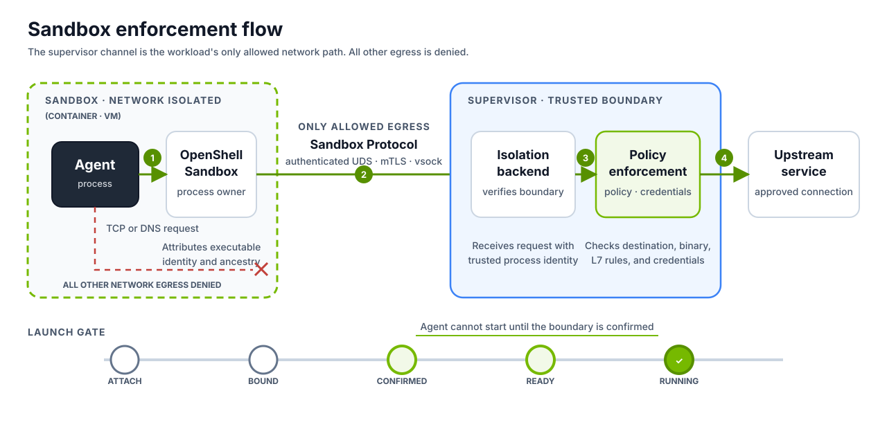

OpenShell separates control-plane state from sandbox enforcement. The gateway
owns sandbox state, policy, providers, and access. A compute driver provisions
the workload and its isolation boundary.

The trusted supervisor runs outside the workload. `openshell-sandbox` runs
inside it, owns the agent process, and mediates its network requests. All other
workload egress is denied. The supervisor initiates one connection to the
gateway for configuration, credentials, logs, and interactive sessions.

## What Each Piece Does

| Component | What it does |
|---|---|
| [Gateway](/sandboxes/manage-gateways) | Checks who you are and remembers everything about your sandboxes. It delivers policy and settings, attaches providers, decides who can do what, and coordinates connections into sandboxes. |
| [Compute runtime](/reference/sandbox-compute-drivers) | Creates the sandbox, starts the supervisor and the workload, sets up the private channel between them, and builds the network fence. It reports status back and cleans up when the sandbox goes away. |
| [Supervisor](#inside-the-sandbox-boundary) | Lives on the trusted side of the boundary. It checks requests against policy, supplies credentials, resolves DNS, opens approved connections, and keeps the link to the gateway alive. |
| [Isolation backend](/extensibility/isolation-backends) | Gives the supervisor one consistent way to work with any runtime: confirm the boundary, start the agent, run commands, forward connections, and see network requests. |
| [`openshell-sandbox`](/extensibility/isolation-backends) | Lives inside the boundary with the agent. It owns the agent's processes, knows which program made each request, applies process controls, and forwards TCP and DNS traffic to the supervisor. |
| [Outer network fence](/security/best-practices#deny-by-default-egress) | Denies all network egress from the workload except its protected connection to the supervisor. Each runtime builds this with its own native tools. |
| [Policies](/sandboxes/policies) | Describe what the agent can touch: files, processes, network destinations, API calls, and where provider credentials can go. |
| [Providers](/sandboxes/manage-providers) | Connect a service name to a stored credential. The supervisor hands that credential out only where policy allows it. |

## Inside the Sandbox Boundary

The supervisor and `openshell-sandbox` sit on opposite sides of the boundary.
The supervisor is trusted and makes the decisions. `openshell-sandbox` shares
the boundary with the untrusted agent, so it never makes policy decisions. It
reports what the agent is trying to do and lets the supervisor decide.



### Starting an agent safely

Before the agent runs, the isolation backend walks through a fixed series of
steps:

```text
Attach → Bound → Confirmed → Ready → Running
```

Each step must succeed before the next one begins. The backend checks that the
workload identity, the private channel, the launch controls, and the network
fence all belong to this exact sandbox, not a stale or impostor copy. If any
check fails, or the boundary is lost later, the agent doesn't run. OpenShell
fails closed.

### How a network request travels

Say the agent tries to call an API. Here's what happens, and it works the same
way on every runtime:

1. The agent opens a TCP connection or makes a DNS lookup.
2. `openshell-sandbox` notes which program made the request.
3. The request travels over the Sandbox Protocol to the supervisor.
4. The supervisor checks the request against policy and adds any credentials the
   policy allows.
5. If the request is allowed, the supervisor opens the real connection and
   relays the traffic.

The protected channel to the supervisor is the only network path allowed out of
the workload boundary. The outer fence denies all other network egress. The
agent cannot reach an external service, the gateway, DNS, or another private
address directly.

## How Each Runtime Builds the Boundary

Every runtime follows the same contract, but each one uses the tools it already
has to place the supervisor, connect it to the sandbox, and fence off the
network.

| Runtime | Where the supervisor runs | How it talks to the sandbox | How direct egress is blocked |
|---|---|---|---|
| Docker | Its own container | Authenticated Unix socket on a driver-owned volume | Workload container has networking turned off |
| Podman | Its own container | Authenticated Unix socket on a driver-owned volume | Workload container has networking turned off |
| Kubernetes | Its own pod | Private service with mutual TLS | NetworkPolicy allows only the supervisor service |
| VM | A process on the host | Authenticated vsock | Guest has no network device |

The runtime's job is to build the boundary and prove it's in place. It never
decides whether a request is allowed. That decision always belongs to the shared
supervisor and policy engine, which is why the same policy behaves the same way
everywhere.

Runtimes can differ in how they report readiness and which features they
support. Each one advertises its capabilities so the gateway knows what it can
do.

## Who Trusts Whom

The gateway issues two separate, short-lived credentials:

- A gateway credential lets the supervisor connect to any gateway replica.
- A sandbox credential lets the supervisor connect to `openshell-sandbox`.

Each credential works only for its own channel. Both are tied to a specific
sandbox and a specific run of that sandbox. When a sandbox restarts or you
revoke access, OpenShell moves on to a new generation, and credentials from the
old one stop working.

The agent's side of the boundary gets only what it needs to confirm it's
talking to the right supervisor. It never sees gateway signing keys or
supervisor credentials.

## Working With Your Existing Infrastructure

OpenShell plugs into the tools you already use, including container runtimes,
schedulers, secret stores, identity providers, image pipelines, storage, and
device plugins. The gateway and supervisor define how OpenShell behaves.
Drivers translate that behavior into whatever your platform understands and
report back what happened. This keeps platform-specific details out of the core
control plane and the policy model.
