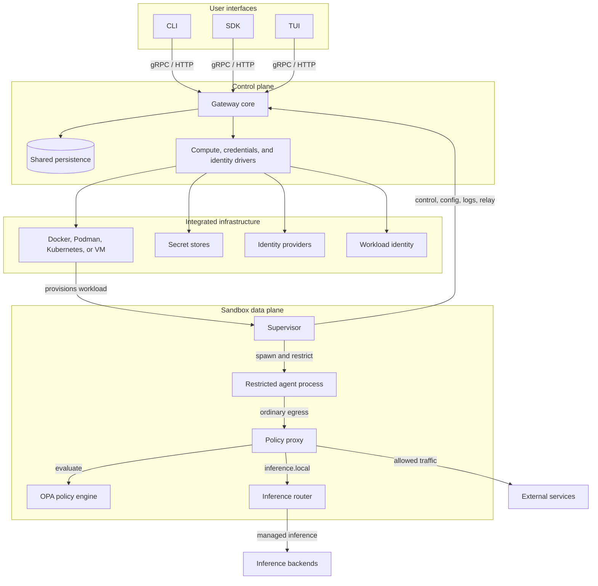

OpenShell runs autonomous AI agents in sandboxed environments with explicit
policy, credential, identity, and network boundaries. The target architecture is
built around three stable runtime components: the **CLI**, the **Gateway**, and
the **Supervisor**.

The CLI, SDK, and TUI provide user-facing access. The gateway is the
authenticated control plane: it owns API access, durable state, policy and
settings delivery, provider and inference configuration, and relay
coordination. The supervisor runs inside every sandbox workload and is the local
security boundary. It launches the agent as a restricted child process and
enforces policy where process identity, filesystem access, network egress, and
runtime credentials are visible.

Infrastructure-specific work sits behind integration boundaries. Compute,
credentials, control-plane identity, and sandbox identity each have a driver or
adapter boundary so OpenShell can integrate with native runtimes, secret stores,
identity providers, and workload identity systems without moving those concerns
into the core gateway or sandbox model.

## Core Components

| Component | Boundary |
|---|---|
| [Sandboxes](/sandboxes/manage-sandboxes) | Data-plane workloads that run the supervisor, launch restricted agent processes, apply local isolation, push logs, and maintain the gateway session. |
| [Gateways](/sandboxes/manage-gateways) | Authenticated control plane that owns API access, durable state, sandbox lifecycle, settings delivery, authorization, and relay coordination. |
| [Providers](/sandboxes/manage-providers) | Credential and provider records that map logical agent needs to platform or user-managed secrets without exposing raw credentials to the agent process. |
| [Policies](/sandboxes/policies) | Declarative controls for filesystem access, process identity, network egress, L7 rules, credential injection, and runtime policy updates. |
| [Inference Routing](/sandboxes/inference-routing) | Managed `https://inference.local` path that routes model traffic to configured backends while keeping provider credentials outside the sandbox. |

## Gateways and Sandboxes

The gateway and sandbox split control-plane authority from runtime enforcement. The gateway owns durable platform state: sandboxes, policy revisions, runtime settings, provider records, inference configuration, session records, and authorization decisions. A sandbox owns the local execution boundary: process identity, filesystem access, network egress, credential injection, local logs, and the agent child process.

The relationship is supervisor initiated. Each sandbox supervisor connects outbound to a known gateway endpoint, authenticates as a sandbox workload, and keeps a live session open for control traffic and relays. This avoids requiring every compute driver to solve gateway-to-sandbox reachability through pod IPs, bridge networks, port mappings, NAT traversal, or custom tunnels.

The gateway delivers desired state. The supervisor applies it locally, keeps last-known-good config when refresh fails, and leaves static isolation controls in place until the sandbox is recreated. Live operations such as config refresh, policy updates, credential delivery, log push, connect, exec, file sync, and relay setup use the same authenticated gateway-supervisor relationship.

## Ecosystem Integration

OpenShell integrates with infrastructure ecosystems instead of replacing them. Runtimes, schedulers, secret stores, identity providers, workload identity systems, image pipelines, storage, and GPU or device exposure remain owned by the platforms that provide them.

The gateway owns OpenShell control-plane semantics: sandbox state, lifecycle ordering, policy and settings resolution, credential mapping, authorization, inference configuration, and relay coordination. Drivers translate those semantics into platform-native operations.

The supervisor owns OpenShell sandbox semantics. Filesystem policy, process privilege reduction, network proxying, inference interception, credential injection, security logging, and gateway relay behavior stay consistent across Docker, Podman, Kubernetes, VM-backed sandboxes, and future integrations.
