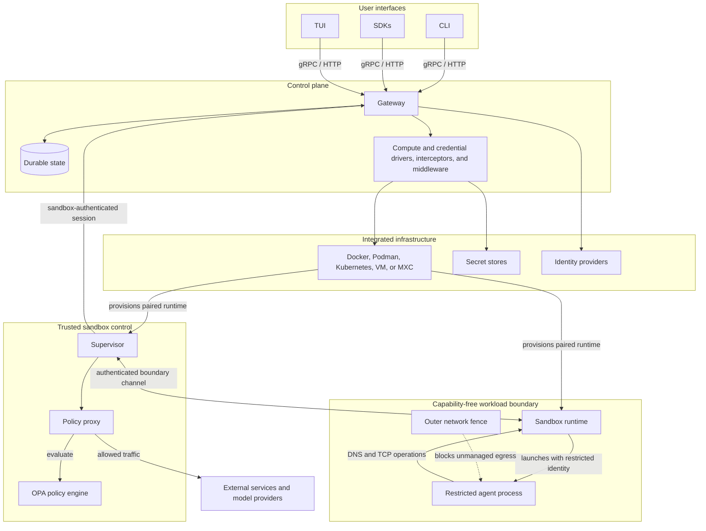

OpenShell separates control-plane management from sandbox execution. Clients
talk to a gateway, a compute driver provisions the runtime, and two dedicated
components protect each standard Linux sandbox. `openshell-sandbox` runs inside
the workload boundary with the agent, while `openshell-supervisor` runs outside
that boundary and owns policy decisions, credentials, upstream connections, and
the gateway session.

This split keeps gateway and provider credentials out of the agent workload. It
also gives the workload two independent network controls: in-process mediation
for supported DNS and TCP operations, plus an outer fence that blocks direct
egress if traffic avoids the mediation path.

```mermaid
flowchart TB
    subgraph UI["User interfaces"]
        CLI["CLI"]
        SDK["SDKs"]
        TUI["TUI"]
    end

    subgraph CP["Control plane"]
        GW["Gateway"]
        DB[("Durable state")]
        EXT["Compute and credential drivers, interceptors, and middleware"]
    end

    subgraph INFRA["Integrated infrastructure"]
        RUNTIME["Docker, Podman, Kubernetes, VM, or MXC"]
        SECRETSTORE["Secret stores"]
        IDP["Identity providers"]
    end

    subgraph TRUSTED["Trusted sandbox control"]
        SUP["Supervisor"]
        PROXY["Policy proxy"]
        POLICY["OPA policy engine"]
    end

    subgraph WORKLOAD["Capability-free workload boundary"]
        SBX["Sandbox runtime"]
        AGENT["Restricted agent process"]
        FENCE["Outer network fence"]
    end

    CLI -->|"gRPC / HTTP"| GW
    SDK -->|"gRPC / HTTP"| GW
    TUI -->|"gRPC / HTTP"| GW
    GW --> DB
    GW --> EXT
    GW --> IDP
    EXT --> RUNTIME
    EXT --> SECRETSTORE
    RUNTIME -->|"provisions paired runtime"| SUP
    RUNTIME -->|"provisions paired runtime"| SBX
    SUP -->|"sandbox-authenticated session"| GW
    SUP <-->|"authenticated boundary channel"| SBX
    SBX -->|"launches with restricted identity"| AGENT
    AGENT -->|"DNS and TCP operations"| SBX
    FENCE -.->|"blocks unmanaged egress"| AGENT
    SUP --> PROXY
    PROXY -->|"evaluate"| POLICY
    PROXY -->|"allowed traffic"| SERVICES["External services and model providers"]
```

## Core Components

Each component owns a distinct part of the security and lifecycle model.

| Component | Responsibility |
|---|---|
| CLI, SDKs, and TUI | Authenticate to the gateway and expose the same management API without depending on the active compute runtime. |
| [Gateway](/sandboxes/manage-gateways) | Stores desired state, authenticates and authorizes users, resolves policy and provider attachments, coordinates lifecycle operations, and routes live sandbox operations. |
| [Compute driver](/reference/sandbox-compute-drivers) | Translates the gateway's sandbox specification into runtime-native resources, establishes the outer network fence, and reports platform lifecycle state. |
| Supervisor | Runs outside the agent workload. It holds gateway credentials, evaluates policy, performs TLS and L7 inspection, resolves provider credential placeholders, opens allowed upstream connections, and owns the live gateway session. |
| Sandbox runtime | Runs `openshell-sandbox` as the workload entrypoint. It validates the admitted boundary, applies local isolation, launches agent processes, identifies the process behind mediated network operations, and relays approved streams to the supervisor. |
| Agent process | Runs as an immutable non-root identity with no Linux capabilities, `no_new_privs`, Landlock filesystem restrictions, and the final seccomp filter. |

The Windows MXC driver uses a driver-owned readiness and host-proxy model rather
than the standard supervisor session. The gateway accepts this difference
through the compute-driver capability contract instead of embedding
runtime-specific behavior in its core lifecycle logic.

## Sandbox Trust Boundary

The standard sandbox runtime uses three trust levels. The supervisor is trusted
with policy and credentials but runs outside the workload. The sandbox runtime
shares the agent's non-root identity inside the workload and owns the isolation
mechanisms. The agent inherits the final restrictions as a child process.

The supervisor and sandbox runtime communicate over a driver-provisioned,
mutually authenticated channel. Docker and Podman use a private Unix socket,
Kubernetes uses TLS between separate Pods, and the VM driver uses vsock between
the host supervisor and the guest. Runtime-specific evidence stays with the
driver and isolation backend, while the shared contract verifies common
properties such as default-deny egress, generation binding, revocation, and
fail-closed behavior.

The sandbox becomes ready only after the driver reports a healthy resource, the
supervisor confirms the workload boundary, and the supervisor registers its
gateway session. If the boundary channel disconnects, the sandbox freezes the
workload while the same supervisor process attempts to reconnect. It terminates
the workload when recovery expires.

## Isolation and Network Flow

OpenShell combines overlapping controls so no single mechanism carries the
entire security boundary.

| Layer | Enforcement |
|---|---|
| Process identity | The driver resolves one non-root UID, GID, and supplementary-group set before launch. The sandbox and its children use that identity without an in-workload privilege transition. |
| Filesystem | The sandbox runtime applies the mandatory Landlock baseline and the authored filesystem policy before it starts the agent. |
| System calls | A seccomp filter restricts the child process. On standard Linux runtimes, seccomp user notification also mediates supported network socket operations. |
| Outer network fence | Docker and Podman use a network-less workload container, Kubernetes uses an enforced default-deny NetworkPolicy, and the VM guest has no virtual NIC. |
| Network policy | The supervisor evaluates destination, port, protocol, binary identity, SSRF, TLS, L7, and middleware rules before opening an upstream connection. |
| Provider credentials | The supervisor keeps secret values outside the workload and substitutes placeholders only for requests to profile-authorized endpoints. |

For an outbound connection, the sandbox runtime identifies the requesting
binary and sends the DNS or TCP operation across the authenticated boundary.
The supervisor evaluates the effective policy, opens an allowed upstream
connection, and relays the stream. The agent never receives a general-purpose
network path around this flow. For the complete rule model, refer to [Customize
Sandbox Policies](/sandboxes/policies).

## Runtime Placement

The same gateway and sandbox contracts apply across the built-in compute
drivers, while each driver maps them to its platform's native resources.

| Runtime | Workload placement | Trusted supervisor placement | Boundary and outer fence |
|---|---|---|---|
| Docker | Capability-free workload container. | Separate supervisor container with host networking. | Private Unix socket and `network_mode=none` on the workload. |
| Podman | Capability-free rootless workload container. | Separate supervisor container with host networking. | Private Unix socket and `network=none` on the workload. |
| Kubernetes | Sandbox workload Pod. | Separately scheduled supervisor Pod. | Mutually authenticated TLS and an enforced workload NetworkPolicy with no egress rules. |
| VM | NIC-less guest running `openshell-sandbox` as PID 1. | Host supervisor process. | Vsock and no guest virtual NIC. |
| Windows MXC | AppContainer or isolation-session workload. | Driver-owned host proxy when governed egress is enabled. | MXC isolation and Windows Filtering Platform controls. |

This separation lets Kubernetes use cluster scheduling, storage, identity, and
GPU resources while local deployments use existing container or VM runtimes.
The client workflow remains the same because the gateway and compute-driver
contracts hide those placement details.

## Gateway Sessions and High Availability

Each standard supervisor opens an outbound, sandbox-authenticated session to
one gateway replica. Config refresh, policy delivery, logs, exec, file sync,
port forwarding, and exposed sandbox services use that session. The gateway
does not need direct inbound access to the workload.

A single-replica deployment can store state in SQLite. A multi-replica
Kubernetes deployment uses shared PostgreSQL and records which gateway replica
owns each live supervisor session. When a client request reaches another
replica, that replica forwards the session-bound operation to the owner through
an authenticated peer relay. A supervisor reconnect can move ownership to a
new replica, but OpenShell does not migrate an established byte stream between
replicas.

For deployment requirements, refer to [Deploy OpenShell on
Kubernetes](/kubernetes/setup).

## Desired State and Runtime Updates

The gateway stores desired state for sandboxes, policies, settings, provider
profiles, provider attachments, and lifecycle intent. The compute driver owns
platform provisioning, while the supervisor applies sandbox-local state and
reports the observed result.

Dynamic controls such as network policy and credential delivery can refresh
over the live supervisor session. Static controls such as process identity and
filesystem isolation are fixed when the workload starts and require sandbox
recreation to change. If a refresh fails, the supervisor retains the
last-known-good configuration instead of partially applying a new boundary.

## Extension Boundaries

OpenShell keeps infrastructure-specific behavior behind typed extension
contracts. Compute and credential drivers can run out of process over
operator-protected Unix sockets. Gateway interceptors and supervisor middleware
can use authenticated network services, while interceptors also support local
Unix sockets. At startup, both peers negotiate a shared protocol envelope and
reject incompatible major versions or missing required capabilities before
accepting work.

The gateway owns OpenShell lifecycle and authorization semantics. Extensions
translate those semantics into platform-native operations and do not gain
ownership of unrelated gateway state. This keeps the sandbox security model
consistent while allowing deployments to integrate their own runtimes, secret
stores, request governance, and network services.

## Next Steps

- To inspect runtime-specific behavior, refer to [Sandbox Compute Drivers](/reference/sandbox-compute-drivers).
- To understand Kubernetes workload and supervisor placement, refer to [Kubernetes Sandbox Runtime](/kubernetes/sandbox-runtime).
- To configure enforcement, refer to [Customize Sandbox Policies](/sandboxes/policies).
- To integrate an external component, start with [Extension Protocol Negotiation](/extensibility/extension-negotiation).
