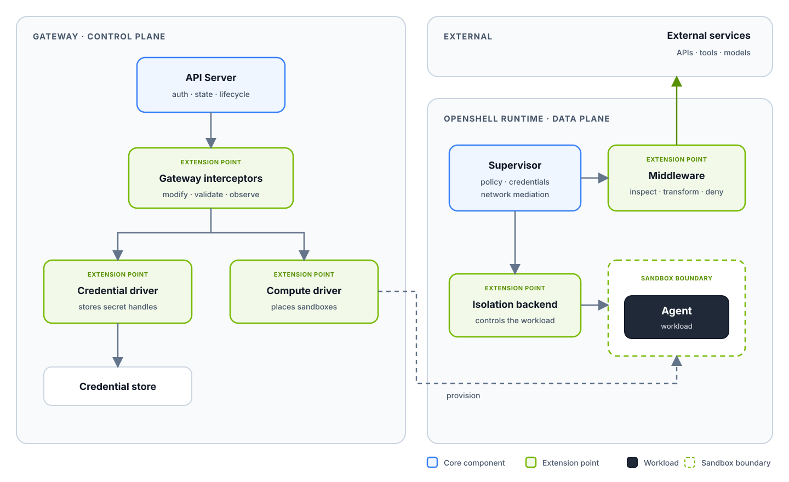

Extensibility sits at the core of OpenShell. OpenShell is designed to run
everywhere and adapt to the infrastructure, governance, and workload
requirements of each deployment. Its extension points add deployment-specific
behavior while preserving the same API, policy model, and security boundaries.

## Extension Points

### [Middleware](/extensibility/supervisor-middleware)

Supervisor middleware inspects, transforms, or denies allowed HTTP and
WebSocket traffic. It runs after policy evaluation and before OpenShell injects
provider credentials, so deployments can add content controls and auditing
without exposing managed secrets.

### [Gateway Interceptors](/extensibility/gateway-interceptors)

Gateway interceptors add governance to selected control-plane operations. They
can modify or validate proposed API writes and observe successful changes while
the gateway retains authentication, persistence, and final validation.

### [Drivers](/extensibility/drivers)

Compute drivers place and manage sandboxes on deployment-specific runtimes.
Credential drivers connect provider records to the deployment's secret store.
Together, they adapt OpenShell to the infrastructure it runs on.

### [Isolation Backends](/extensibility/isolation-backends)

Isolation backends connect the supervisor to the sandbox runtime. They provide
a consistent contract for process launch, terminal streams, signals, status,
and runtime-specific isolation inside the provisioned workload.

## Authentication

When the gateway has JWT signing configured, OpenShell attaches a short-lived bearer token to every call it makes to a [gateway interceptor](/extensibility/gateway-interceptors) or [supervisor middleware](/extensibility/supervisor-middleware) service. Your service validates this token to confirm that the call comes from your gateway or one of its sandboxes.

### Tokens OpenShell Sends

Each token is an EdDSA-signed JWT scoped to one service registration:

<ParamField path="iss" type="string">
  `openshell-gateway:<gateway_id>`.
</ParamField>

<ParamField path="aud" type="string">
  The registration's `audience`. Defaults to `urn:openshell:extension:interceptor:<name>` or `urn:openshell:extension:middleware:<name>`.
</ParamField>

<ParamField path="caller_kind" type="'gateway' | 'supervisor'">
  `gateway` for calls from the gateway, or `supervisor` for middleware calls from a sandbox supervisor.
</ParamField>

<ParamField path="sandbox_id" type="string">
  The calling sandbox. Present only when `caller_kind` is `supervisor`.
</ParamField>

Authenticated network services use `https://` endpoints. OpenShell verifies the service certificate against platform trust roots, or against the private CA in the registration's `tls_ca_cert_path`, and always checks the hostname.

### Establish Trust in the Gateway

Before your service can validate tokens, configure it with three values from the gateway operator:

- The gateway URL.
- The gateway ID. Tokens use `openshell-gateway:<gateway_id>` as their issuer.
- The gateway's public signing key or JWKS.

Configure these values directly instead of discovering them from the gateway. A key fetched from an unverified source does not prove which gateway it belongs to.

To pick up new keys later, fetch `/.well-known/openid-configuration` from the configured gateway URL over TLS, then fetch the keys from its `jwks_uri`. This document looks like OIDC discovery, but its `issuer` is `openshell-gateway:<gateway_id>` rather than the gateway URL. Compare the token's `iss` with that value, not with the URL.

### Validate Each Token

Cache keys by `kid` and check that:

- `typ` is exactly `openshell-ext+jwt`.
- `alg` is `EdDSA`. Pin the algorithm instead of reading it from the token.
- The signature, issuer, exact audience, and expiry are valid.
- `caller_kind` is one your service accepts, and `sandbox_id` matches your expectations when your service scopes behavior per sandbox.

OpenShell reuses a token until it rotates, so do not reject a repeated `jti` as a replay.

### Confirm the Audience at Startup

Return the audience your service expects in the `expected_audience` field of its `Describe` manifest. After authentication succeeds, the gateway compares this value with the operator-configured `audience` and refuses to start when they differ. A strict service may reject a token with the wrong audience before returning its manifest, in which case gateway startup reports an authentication failure. Leave the field empty to skip this check.

### Run Without Authentication

Set `allow_insecure_transport = true` on a registration to use a plaintext `http://` endpoint. OpenShell then sends no token, and your service cannot distinguish OpenShell from any other client that can reach it. The gateway logs a warning for the registration at every startup.

Use this setting for local development, or on a network that already authenticates callers.

### Current Limitations

- Tokens are bearer credentials. A captured token remains valid until it expires unless your service adds proof of possession or request binding.
- Extension tokens share a signing key with other tokens the gateway issues, so you cannot rotate or revoke extension credentials independently.
- mTLS client authentication and overlapping signing-key rotation are not available.

## Building Extensions

Start with the narrowest extension point that owns the behavior you need. Keep
control-plane governance in an interceptor, infrastructure integration in a
driver, application traffic processing in middleware, and workload control in
an isolation backend. Each extension uses a typed contract so OpenShell keeps
ownership of authentication, policy enforcement, secrets, and public API
behavior.

Built-in and external implementations follow the same contracts and validation
rules. The extension-specific pages describe their APIs, configuration, and
security boundaries.

### gRPC and Transports

External extensions implement protobuf-defined gRPC services. The transport
depends on where the extension runs and which OpenShell components must reach
it:

| Extension | Integration | Supported transport |
| --- | --- | --- |
| Gateway interceptor | The gateway calls the interceptor service. | TCP with `http://` or `https://`, or a local Unix domain socket with `unix://`. |
| Supervisor middleware | The gateway discovers the service, and sandbox supervisors evaluate traffic through it. | TCP with `http://` or `https://`. The endpoint must be reachable from both the gateway and supervisors, so Unix sockets are not supported. |
| Compute or credential driver | The gateway calls an external driver service. | A local Unix domain socket. |
| OpenShell isolation backend | The supervisor connects to the sandbox boundary through the OpenShell Sandbox Protocol. | A private Unix socket, TLS over TCP, or virtio-vsock selected and provisioned by the compute driver. |

Use Unix domain sockets when the gateway and extension share a host. Use
`https://` when a service crosses a host or pod boundary. Plaintext `http://`
is intended for explicitly enabled development deployments; authenticated
network extensions use TLS and short-lived gateway-issued credentials. Refer
to [Authentication](#authentication) for how services validate those credentials.

The [governance interceptor example](https://github.com/NVIDIA/OpenShell/tree/main/examples/governance-interceptor)
and [content guard middleware example](https://github.com/NVIDIA/OpenShell/tree/main/examples/supervisor-middleware-content-guard)
include complete gRPC services, gateway configuration, and smoke tests. For
runtime integrations, refer to the first-party
[Docker compute driver](https://github.com/NVIDIA/OpenShell/tree/main/crates/openshell-driver-docker)
and [VM compute driver](https://github.com/NVIDIA/OpenShell/tree/main/crates/openshell-driver-vm).

### Protocol Negotiation

Before OpenShell uses a compute driver, credential driver, gateway interceptor,
or supervisor middleware service, both peers exchange
`openshell.extension.v1.PeerMetadata`. The metadata identifies the protocol and
implementation versions, supported capabilities, and capabilities required
from the other peer. Family-specific features remain in their typed protocols.

OpenShell accepts compatible minor versions when both capability requirements
are satisfied. It rejects different major versions, missing metadata, or an
unmet required capability during startup. Built-in and external service
extensions follow the same compatibility checks.

Use `openshell gateway info` to inspect the negotiated extension families,
implementation versions, protocol versions, and capabilities active on a
gateway.
