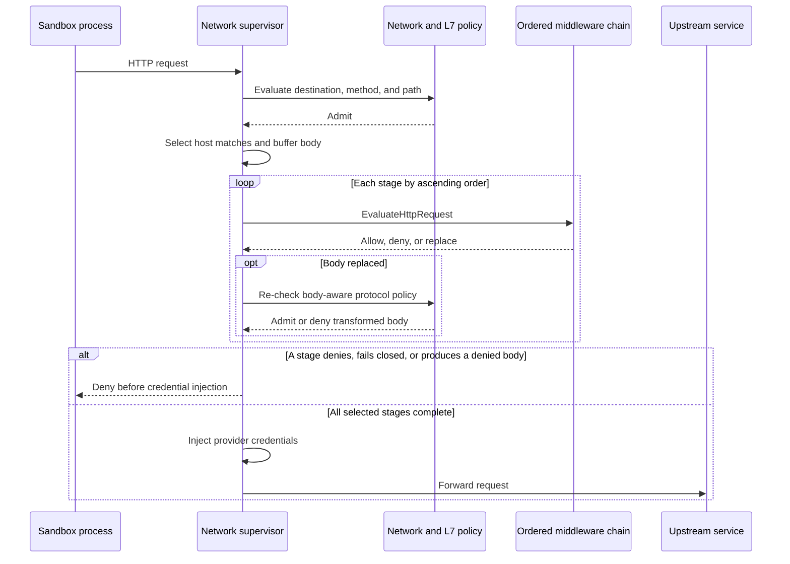
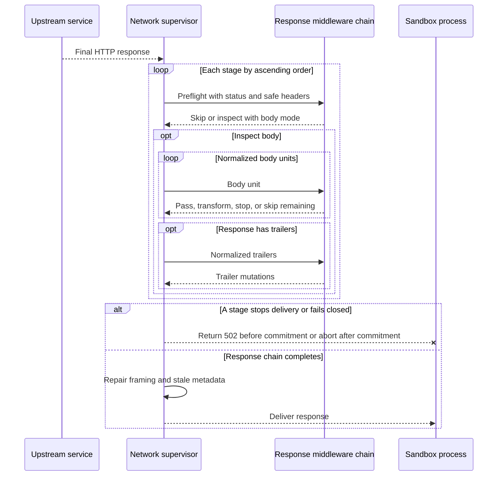

HTTP middleware evaluates admitted requests through `HTTP_REQUEST/PRE_CREDENTIALS` and final upstream responses through `HTTP_RESPONSE/PRE_RETURN`. Request stages run before credential injection. Response stages run before OpenShell delivers the result to the sandbox.

## Request flow



The supervisor follows this sequence:

1. It evaluates network and L7 policy.
2. It selects middleware whose host patterns match the admitted destination.
3. It buffers the body using the largest payload limit in the selected chain.
4. It runs stages by ascending `order`.
5. It re-checks GraphQL, JSON-RPC, or MCP policy after each body replacement.
6. It applies allowed changes, injects provider credentials, and forwards the request.

Each stage receives a request that the current policy admits. A replacement cannot carry a denied or unparseable operation to a later stage or the upstream. If policy rejects a transformed body, the chain stops. With `enforcement: audit`, OpenShell logs the policy rejection and continues the request.

If the post-transformation policy evaluation itself fails, OpenShell denies the request and emits a high-severity detection finding. This is not a middleware failure because the stage completed successfully.

## Response flow



The supervisor relays interim `1xx` responses unchanged and retains the final non-`1xx` response. A `101` protocol upgrade bypasses generic response processing.

For the final response, OpenShell runs `HttpResponsePreReturn.Evaluate` preflight once per matching stage in policy order. Each stage sees earlier response-header mutations and returns `SKIP` or `INSPECT`. An inspecting stage selects one body mode:

| Mode | Behavior |
| --- | --- |
| `HEADERS_ONLY` | Inspects the status and safe response headers without receiving body or trailer events. |
| `WHOLE_BODY_BYTES` | Buffers the normalized body and sends one bounded body unit before committing the response head. |
| `STREAM_BYTES` | Sends ordered normalized units of at most 64 KiB. Each result accounts for its complete input unit before OpenShell reads more data. |

Bodyless responses, partial responses, non-identity content encodings, and responses with `Cache-Control: no-transform` allow headers-only inspection but reject body inspection according to the stage's `on_error` policy.

Body-inspecting stages receive a final body marker followed by normalized trailers. A stage may add only trailer names it declared during preflight. After transformation, OpenShell removes stale range and integrity metadata and repairs downstream framing. Buffered output uses a recalculated `Content-Length` unless trailers require chunked framing. Streaming output uses middleware-owned chunked framing.

OpenShell keeps one request ID across the request and response hooks for an exchange. Response streams have no whole-response deadline. Preflight and each unit result use the effective binding timeout, and each unit's complete middleware chain is capped at 30 seconds.

## Middleware input

Middleware receives the request body, target, filtered headers, and request context. The context always includes `sandbox_id`. It also includes best-effort `sandbox_name` and `workspace` values.

Use `sandbox_id` for authorization, persistence, durable correlation, and identity. Names are workspace-scoped and may be reused. Use `sandbox_name` and `workspace` only for display or logging, and fall back to the ID when either value is empty.

OpenShell delivers visible request headers in wire order and preserves repeated names as separate entries. It removes credential, routing, framing, and hop-by-hop headers before evaluation. It also removes headers named by `Connection`, except for a validated WebSocket upgrade pair. Malformed headers and unsupported transfer-coding sequences fail before middleware or policy dispatch.

Response middleware receives the final status and safe end-to-end headers. OpenShell removes framing, hop-by-hop, and `Connection`-nominated fields. It does not expose upstream transfer coding, transfer chunks, or socket-read boundaries.

## Request results and body replacement

A stage may allow or deny the request, return a replacement body, mutate approved headers, and report findings or metadata. The same per-stage limit applies to the input and replacement body.

An explicit denial returns a structured response such as:

```json
{
  "error": "middleware_denied",
  "detail": "Request rejected by configured middleware",
  "policy": "api-policy",
  "middleware": "prototype-content-guard",
  "reason_code": "content_match"
}
```

OpenShell does not copy a service-provided free-form `reason` into the response or security logs. A result may provide a stable `reason_code` of 1 through 64 bytes. It must start with a lowercase ASCII letter and contain only lowercase ASCII letters, digits, and underscores. An invalid code makes the result a middleware failure governed by `on_error`.

A failed `fail_closed` stage returns `error: middleware_failed` with a platform-owned `detail`. Middleware errors omit policy-advisor remediation because changing network policy cannot repair the stage.

## Response delivery failures

OpenShell retains each response input until the corresponding stage returns a valid result. A failed `fail_open` stage can therefore be disabled without losing bytes, and the retained input continues through later stages.

Before response commitment, a failed `fail_closed` stage returns `502 Bad Gateway` with `error: response_delivery_failed`. A `HEAD` response carries the same headers and no body. After commitment, OpenShell aborts delivery without appending an error body, terminating chunk, or error trailer. It also does not reuse the upstream connection. Retrying the request may repeat upstream side effects.

## Header mutations

A request result or response preflight may return ordered header mutations. OpenShell applies successful mutations before the next stage, so later middleware sees the accumulated header state.

A `write` mutation selects one behavior when a case-insensitive header name already exists:

- `append` adds another value.
- `overwrite` removes all existing values before writing the new one.
- `skip` leaves the existing values unchanged.

A `remove` mutation removes all values for a case-insensitive name. Writes and removals may target middleware-visible end-to-end fields without a required prefix. OpenShell rejects request credential and routing fields. For responses it also protects status, framing, connection control, authentication challenges, content coding, range metadata, and security policy fields. Hop-by-hop and `Connection`-nominated fields remain protected in every profile.

Header values cannot contain control characters. Request middleware also cannot write OpenShell credential placeholder syntax. Response trailer mutations use the same validation rules. Middleware may change an existing safe trailer, but it may add a new trailer only when the response preflight declared that name.

OpenShell validates and applies each stage's mutations atomically. If one operation is invalid, it discards every mutation from that stage and applies `on_error`.

## Payload and capacity limits

Each binding declares `max_payload_bytes`. An operator-run registration sets a ceiling no higher than the advertised capability or the 4 MiB platform maximum. A selected request chain buffers with its largest stage limit so that every stage that can process the body receives it.

Exceeding one stage's limit fails that stage and follows its `on_error`; other stages keep their own limits. OpenShell can skip an oversized `Content-Length` request under `fail_open` before it consumes body bytes. If a chunked body crosses the limit after consumption begins, OpenShell denies the request because it cannot safely resume the original stream.

HTTP bodies share process-wide middleware evaluation capacity with active WebSocket message evaluations. At most 32 evaluations run while 64 additional callers wait without buffering payload bytes. When both bounds are full, OpenShell returns `503 Service Unavailable` before reading the request body.

For `HTTP_RESPONSE`, `max_payload_bytes` limits a complete body under `WHOLE_BODY_BYTES`, each replacement, and the largest unit a streaming stage accepts. The platform caps stream input units at 64 KiB. Whole-body inspection delays commitment. Headers-only and streaming inspection commit streaming-compatible framing after preflight.

Response body work shares the same 32 active and 64 waiting evaluation budget. Response streams also share the separate process-wide budget of 32 persistent middleware sessions with WebSocket stages. Response stream admission does not wait when that budget is full. OpenShell applies each selected configuration's `on_error` before opening its stream.

See [Configure middleware](/extensibility/supervisor-middleware/configure) for registration limits and `on_error`, and [Operate middleware](/extensibility/supervisor-middleware/operate) for logging and service lifecycle.
