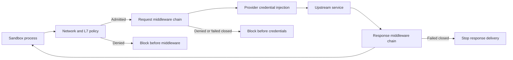

Supervisor middleware adds ordered processing stages to allowed sandbox egress. Request middleware runs after network and application-layer policy admit traffic and before OpenShell injects provider credentials. Response middleware runs after the upstream returns a final response and before OpenShell delivers it to the sandbox.

Use middleware when an admitted request or message needs another decision or transformation. A stage can allow or deny traffic, replace an inspected payload, add approved HTTP headers, and report audit-safe findings.

Middleware selection is independent of the network policy rule that admitted the traffic. OpenShell matches middleware by destination host, then runs matching configurations by ascending `order`. This keeps the same middleware attached when the admitting rule comes from a user policy, a provider profile, or a broader endpoint definition.

## Choose a guide

<Cards>

<Card title="Configure middleware" href="/extensibility/supervisor-middleware/configure">

Choose a built-in or operator-run implementation, register remote services, attach middleware to hosts, and set failure behavior.
</Card>

<Card title="HTTP requests" href="/extensibility/supervisor-middleware/http">

Understand request and response evaluation, body transformation, policy re-checks, header mutation, payload limits, and delivery failures.
</Card>

<Card title="WebSocket sessions" href="/extensibility/supervisor-middleware/websocket">

Understand upgrade preflight, session streams, text-message inspection, pass-through traffic, capacity limits, and close codes.
</Card>

<Card title="Operate middleware" href="/extensibility/supervisor-middleware/operate">

Plan service startup and reloads, read OCSF events, and account for authentication and platform limits.
</Card>

</Cards>

## Supported operations

| Protocol path | Binding | Inspected unit | Supported changes |
| --- | --- | --- | --- |
| HTTP | `HTTP_REQUEST/PRE_CREDENTIALS` | One admitted request before credential injection. | Allow, deny, replace the body, mutate approved headers, and report findings. |
| HTTP | `HTTP_RESPONSE/PRE_RETURN` | One final upstream response before delivery to the sandbox. | Skip or inspect the response, transform selected body units, mutate approved headers and trailers, stop delivery, and report findings. |
| WebSocket | `WEBSOCKET_MESSAGE/PRE_CREDENTIALS` | Upgrade preflight and complete client-to-upstream text messages. | Inspect or skip the session, deny the upgrade, allow or deny text messages, replace text, and report findings. |

An implementation may advertise either binding or both. A destination-host match does not imply protocol coverage. For example, HTTP-only middleware can inspect a WebSocket upgrade request but does not inspect messages after the upgrade.

## Boundaries

- Middleware sees traffic only after network and L7 policy allow it.
- Request middleware runs before OpenShell injects provider credentials. Operator-run services cannot inspect those credentials. Response middleware runs after the upstream call and before delivery to the sandbox.
- An explicit middleware denial always blocks traffic. Endpoint `enforcement: audit` does not bypass middleware decisions.
- V1 WebSocket middleware inspects complete client text messages only. Binary messages, control frames, and upstream-to-client messages are outside the binding.
- Protocols without a supported middleware operation use the existing uninspectable-traffic behavior. A matching `fail_closed` configuration blocks that traffic; an all-`fail_open` match bypasses middleware and emits a detection finding.

See [Policy Schema](/reference/policy-schema#network-middleware) for the complete policy fields and [Gateway Configuration](/reference/gateway-config#supervisor-middleware-services) for the gateway TOML reference.
