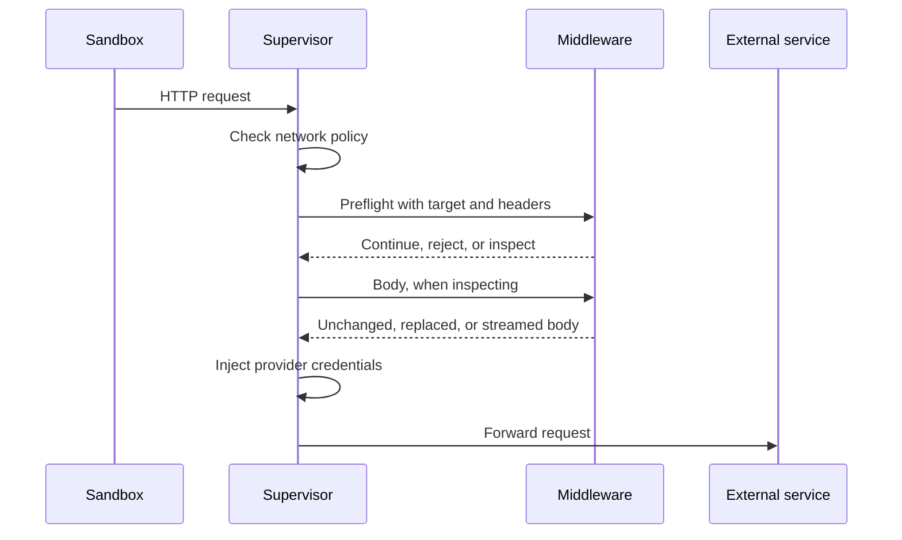
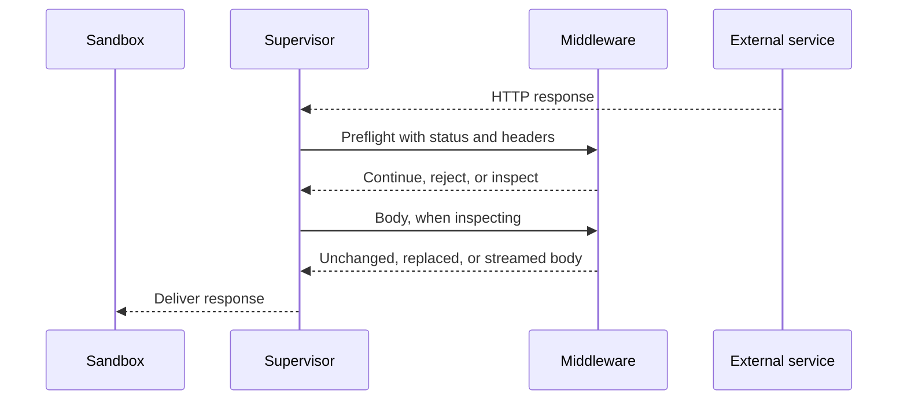
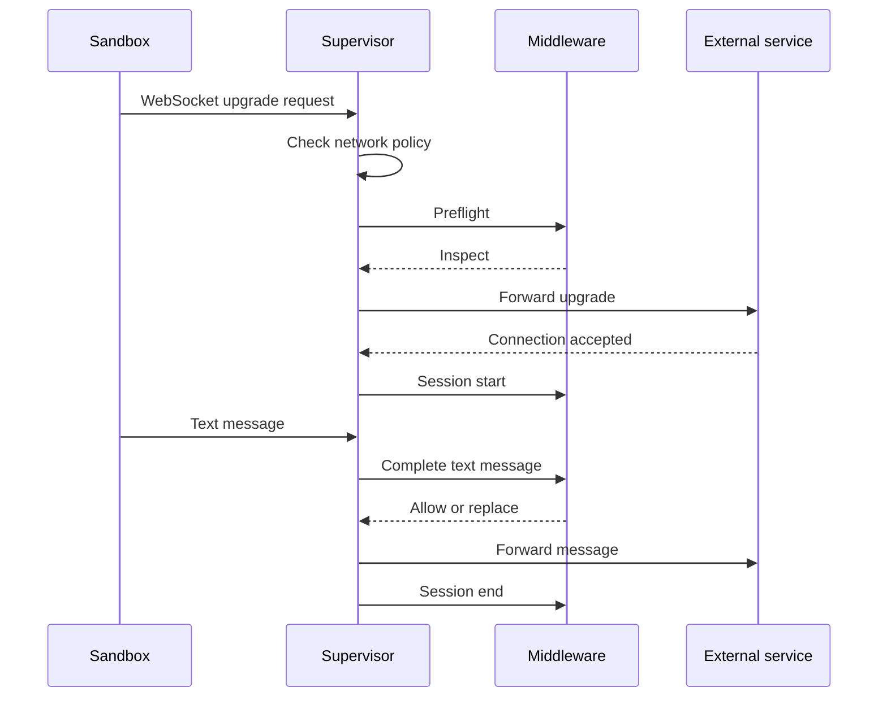

A middleware service handles one or more operations, such as HTTP requests or WebSocket messages. This page describes when OpenShell calls your service for each operation, what your service receives, and what it can return. The RPCs that every middleware service implements are described in [Build Your Middleware Service](/extensibility/supervisor-middleware#build-your-middleware-service).

## Operations and Phases

| Operation | Phase | When OpenShell calls your service | RPC |
| --- | --- | --- | --- |
| `HTTP_REQUEST` | `PRE_CREDENTIALS` | After network policy allows a request, before OpenShell injects provider credentials. | `HttpRequestPreCredentials.EvaluateHttp`, or the deprecated `SupervisorMiddleware.EvaluateHttpRequest` |
| `HTTP_RESPONSE` | `PRE_RETURN` | After the external service responds, before the sandbox receives the response. | `HttpResponsePreReturn.EvaluateHttp`, or the deprecated `HttpResponsePreReturn.Evaluate` |
| `WEBSOCKET_MESSAGE` | `PRE_CREDENTIALS` | When the sandbox opens a WebSocket connection, and for each text message it sends. | `SupervisorMiddleware.EvaluateWebSocketSession` |

Your service declares each operation it supports as a binding, an operation and its phase, in its `Describe` manifest. OpenShell calls your service only for the operations it declares. An HTTP binding also declares which [HTTP protocol](#http-protocols) it uses.

When several middleware match the same traffic, OpenShell calls them in ascending `order`, and each middleware sees the changes that earlier middleware made.

## Common Inputs and Results

Every operation includes a request context. The context always includes `sandbox_id`. Use it for authorization, persistence, and correlation. The context also includes `sandbox` and `workspace` names when available. Names can be reused, so use them only for display and logging.

Operations that include headers deliver them in wire order, and repeated headers stay separate. OpenShell removes credential, routing, and hop-by-hop headers before sending them to your service. It also removes framing headers from request input. Response preflight retains upstream `Content-Length`, `Content-Encoding`, and `Content-Range` as read-only metadata, unless `Connection` names them as hop-by-hop headers. Your service cannot change or remove these fields; OpenShell handles downstream framing.

Every result can include an optional reason code, findings, and metadata:

- A reason code identifies why your service denied traffic. OpenShell includes it in logs and in HTTP error responses. It must be 1-64 bytes long, start with a lowercase ASCII letter, and contain only lowercase ASCII letters, digits, and underscores. OpenShell treats an invalid code as a middleware failure.
- Findings report what your service detected, even when it allows the traffic. OpenShell logs how many findings your service reported, not their text.
- Metadata carries non-secret diagnostic details. OpenShell does not log it.

OpenShell never forwards free-form text from your service to the sandbox or to logs.

## HTTP

HTTP middleware can check a request before it leaves the sandbox, and the response before the sandbox receives it. A service can support either operation or both.

### HTTP Protocols

Each HTTP binding selects its protocol with `http_protocol_version`:

| Value | Protocol | RPCs | Failure handling |
| --- | --- | --- | --- |
| Unset or `0` | HTTP protocol 1 (0.1). Deprecated, and removed in OpenShell 0.2.0. | `SupervisorMiddleware.EvaluateHttpRequest` and `HttpResponsePreReturn.Evaluate` | Follows the policy entry's `on_error`. |
| `2` | HTTP protocol 2. | `HttpRequestPreCredentials.EvaluateHttp` and `HttpResponsePreReturn.EvaluateHttp` | Always fails closed. |

The gateway refuses a binding with any other value, including `1`. An HTTP protocol 2 binding lists the body modes it can select in `supported_http_body_modes`. An HTTP protocol 1 binding and a WebSocket binding leave both fields unset.

Gateways and sandbox supervisors that run HTTP protocol 2 advertise the `openshell.supervisor-middleware.http-v2` capability in `MiddlewareDescribeRequest.gateway.supported_capabilities`. Supervisors from OpenShell 0.1.2 and earlier do not. A service can serve both protocols by returning HTTP protocol 2 bindings to callers that advertise the capability and HTTP protocol 1 bindings to others. A service that serves only HTTP protocol 2 must require the capability in its manifest metadata and must not advertise HTTP protocol 1 bindings. [Migrate to HTTP Version 2](/extensibility/supervisor-middleware/migrate-http-v2) shows both patterns.

One chain can mix HTTP protocol 1 and HTTP protocol 2 stages in either direction. OpenShell runs HTTP protocol 1 stages through supervisor-side adapters on the same pipeline, so they keep their 0.1.x behavior. The rest of this section describes HTTP protocol 2. [HTTP Protocol 1](#http-protocol-1) summarizes the legacy one.

### Stage Lifecycle

For each request or response, OpenShell opens one `EvaluateHttp` stream to each selected middleware, sends `HttpEvent` messages, and reads `HttpResult` messages. Requests and responses use the same messages.

The first event is a preflight. It carries the request or response head, the request context, your `config` and `middleware_name` from the policy entry, the body modes OpenShell offers for this message in `permitted_body_modes`, the effective `limits`, and the declared length of the original body in `declared_input_bytes`, when known. There is no phase field, because each RPC serves one phase. Your service answers with one decision:

- `continue_without_body`: the body bypasses your middleware unchanged and stays available to later middleware.
- `reject`: OpenShell denies the request or response.
- `inspect`: your middleware receives the body in one of the offered modes.

A preflight result can also carry header changes and diagnostics. After an `inspect` decision, OpenShell sends an `HttpBegin` event with the stage's current head, then the body in the selected mode:

| Mode | Behavior |
| --- | --- |
| `BUFFERED` | OpenShell sends the complete body in one `HttpBufferedBody` event, even when the body is empty, with any trailers. Your service returns one `HttpBufferedResult` that marks the body `unchanged` or sets a `replacement`, or an `HttpReject`. Empty replacement bytes delete the body. The body and the replacement must each fit within the `max_body_bytes` that your service selects. OpenShell holds the body in memory and never writes it to disk. |
| `STREAM` | OpenShell sends `HttpInputChunk` events followed by one `HttpInputEnd` with any trailers. Your service independently returns one `HttpOutputStart`, any number of `HttpOutputChunk` results, and one `HttpFinish`, or an `HttpReject` at any point. Every chunk must be nonempty and no larger than `limits.max_chunk_bytes`. Output can start before input ends, chunk boundaries carry no meaning, and `HttpFinish` is valid only after `HttpInputEnd`. OpenShell keeps no copy of the input, so your service produces every output byte and owns any storage it needs. `STREAM` has no total size limit or total deadline. |

A binding that supports no body modes is preflight-only. It can continue, with optional header changes, or reject, and it never receives the body. It can advertise a payload limit of zero.

#### Body Mode Offers

OpenShell offers a mode only when your binding supports it and the message is eligible. `unavailable_body_modes` lists each mode your binding supports that the preflight does not offer, with the reason:

| Reason | Applies to | Meaning |
| --- | --- | --- |
| `BODYLESS` | Responses | The response has no body, because the request method is `HEAD` or the status is 1xx, 204, or 304. |
| `PARTIAL` | Responses | The response carries part of a representation, with status 206, a `Content-Range` header, or `multipart/byteranges` content. |
| `NO_TRANSFORM` | Responses | `Cache-Control: no-transform` forbids changing the body. |
| `ENCODED` | Responses | The body has a content coding other than `identity`. |
| `OVER_LIMIT` | Requests and responses | The declared body length exceeds the stage's payload limit. Applies to `BUFFERED` only. |
| `OPEN_ENDED` | Responses | The response is open-ended, such as `text/event-stream` or `multipart/x-mixed-replace`, and has no complete body to buffer. Applies to `BUFFERED` only. |
| `TRUNCATION_UNDETECTABLE` | Responses | The client request or the response status line uses HTTP/1.0, so the response cannot be chunked and the client could not detect a truncated body. Applies to `STREAM` only. |

The enum values carry the `HTTP_BODY_UNAVAILABLE_REASON_` prefix. A service that needs the body can let a `BODYLESS` message continue and fail the rest.

To select `BUFFERED`, set `max_body_bytes` to a positive value no larger than `limits.max_buffered_body_bytes`. Selecting a mode that is not in `permitted_body_modes`, or a `max_body_bytes` outside that range, fails the stage with `body_mode_not_permitted`. `declared_input_bytes` describes the original message, and an earlier stage may replace the body, so enforce your limit against the body events you receive.

#### Ending the Stream

When the exchange ends, OpenShell sends a best-effort `session_end` event with the reason and closes its side of the stream. Your service may close its result stream right after the result that ends its part in the exchange: `continue_without_body`, `HttpBufferedResult`, `HttpFinish`, or `HttpReject`. It may also keep the stream open until `session_end` or the end of the event stream.

To report that your service cannot inspect a message, for example because the body is not in a format it understands, end the stream with gRPC status `FAILED_PRECONDITION`. OpenShell fails the exchange closed with the platform-owned reason `middleware_cannot_inspect` and does not record your status message. Use `HttpReject` only to deny the content itself.

### Header and Trailer Changes

A result can include an ordered list of header changes. A `write` change sets how it treats an existing header with the same name:

- `append` adds another value.
- `overwrite` replaces all existing values.
- `skip` keeps the existing values.

A `remove` change removes all values for the name. OpenShell protects credential, routing, framing, and connection headers, and for responses also status, authentication challenge, content coding, range, and security policy headers. Header values cannot contain control characters, and request header values cannot contain OpenShell credential placeholders.

OpenShell applies each middleware's changes as a unit. If one change is invalid, it discards all of them and treats the result as a middleware failure.

A version 2 stage can change headers in its preflight result and, after it inspects the body, in its `HttpBufferedResult` or `HttpOutputStart`. These late changes have the same rules as preflight changes. `late_header_modes` lists the modes that accept them. `HttpBegin.headers` gives each inspecting stage its current head: its preflight head, its own preflight changes, and the late changes of earlier stages. OpenShell commits the outgoing head when the last inspecting stage starts its output. The outgoing head applies every preflight change in chain order, then every late change in chain order, so a later stage's preflight change can land before an earlier stage's late change to the same header. Legacy request stages return their changes as late changes, so in a chain that mixes legacy and version 2 stages, a later version 2 stage's preflight change lands before an earlier legacy stage's change.

Trailer changes in `HttpBufferedResult` and `HttpFinish` use the same operations, but a trailer `write` must name a trailer that is already present. Your service cannot add new trailer names.

### Requests

OpenShell calls your service after network policy allows a request and before it injects provider credentials. Your service can continue, reject, or inspect the body in `BUFFERED` or `STREAM` mode.



<AccordionGroup>
<Accordion title="What Your Service Receives">

The preflight includes the request target, headers, request context, your `config`, limits, and the offered body modes. OpenShell offers `BUFFERED` unless the declared body length exceeds your payload limit, and offers `STREAM` whenever your binding supports it. A chunked request has no declared length, so it is offered `BUFFERED`, and the middleware fails if the body then grows past the limit it selected. When your service inspects the body, it also receives the request trailers. OpenShell decodes chunked bodies before sending them, and in `STREAM` mode each input chunk is at most 64 KiB.

</Accordion>
<Accordion title="What Your Service Can Return">

- Continue without the body, optionally with header changes.
- Reject the request with an optional reason code.
- In `BUFFERED` mode, leave the body unchanged or replace it.
- In `STREAM` mode, return the output body.
- After inspecting the body, change headers and existing trailers.

When your service replaces the body, OpenShell checks the new body against body-aware policy, such as GraphQL, JSON-RPC, or MCP rules, before the next middleware or the external service sees it. A replacement cannot introduce an operation that policy denies.

</Accordion>
<Accordion title="Streaming and Early Forwarding">

When every middleware that inspects an HTTP/1.1 request with a body uses `STREAM`, OpenShell forwards their output to the external service as it arrives, before the sandbox finishes sending the request. It sends the request head when the last middleware starts its output. If a later middleware rejects the request or fails, OpenShell stops the upload but cannot retract bytes it already sent, and it never retries or replays the request. If the external service responds before the upload finishes, OpenShell delivers the response, stops the upload, cancels the middleware streams, and closes the sandbox connection afterward.

OpenShell holds the complete output in memory, up to 4 MiB, before it forwards the request when the chain includes a `BUFFERED` or legacy middleware, when body-aware policy must check each replacement, and for HTTP/1.0 requests, upgrade requests, the forward proxy, AWS SigV4 signing, and request-body credential rewriting. Output over 4 MiB fails the request with `middleware_failed`. SigV4 signing then signs the body the middleware produced. OpenShell never writes middleware bodies to disk. If your service needs to process a large body as a whole, for example to hash it or match patterns across chunks, select `STREAM`, hold what you need, and clean up your own storage however the stream ends.

A request whose middleware inspects its body must keep sending the body. If OpenShell waits 30 seconds without receiving request body bytes from the sandbox, it answers `408 Request Timeout` with `error: request_timeout`, closes the connection, closes any upstream connection that received part of the body, and ends the middleware streams with `CANCELLATION`. Time the request waits on middleware does not count. This applies to legacy middleware too, which had no such limit in 0.1.x. If the sandbox closes its connection, or the connection fails, before the request body ends, OpenShell ends the middleware streams with `DOWNSTREAM_DISCONNECT`, and with `PROTOCOL_ERROR` when the request body framing is malformed.

</Accordion>
<Accordion title="Denials and Failures">

When your service rejects a request before OpenShell forwards it, the sandbox receives a structured error and OpenShell does not contact the external service:

```json
{
  "error": "middleware_denied",
  "detail": "Request rejected by configured middleware",
  "policy": "api-policy",
  "middleware": "content-guard",
  "reason_code": "content_match"
}
```

When middleware fails, the sandbox receives `403 Forbidden` with `error: middleware_failed` instead. Version 2 middleware always fails closed. OpenShell does not skip it, retry it, or recover the original body. If the rejection or failure happens after OpenShell has started forwarding a streamed request, OpenShell stops the upload, and the external service receives a truncated body. The sandbox still receives the error response if no response byte has reached it, and OpenShell then closes the connection.

</Accordion>
</AccordionGroup>

### Responses

OpenShell calls your service after the external service responds and before the sandbox receives the response. Responses use the same lifecycle as requests, so your service can continue, reject, or inspect the body in `BUFFERED` or `STREAM` mode.



<AccordionGroup>
<Accordion title="Body Modes">

The preflight includes the status, headers, request target, and request context. OpenShell decides which body modes to offer from the original response head, as listed in [Body Mode Offers](#body-mode-offers):

- No body mode for responses without a body, partial responses, compressed responses, and responses with `Cache-Control: no-transform`. Your service can continue, optionally with header changes, or reject.
- No `STREAM` unless both the client request and the response status line use HTTP/1.1, because only chunked framing lets the client detect a truncated body.
- No `BUFFERED` for open-ended responses such as server-sent events, or when the declared length exceeds your payload limit.

A server-sent events response to an HTTP/1.0 client therefore offers no body mode. Interim 1xx responses pass through unchanged, and a `101` protocol upgrade skips response middleware.

When a middleware selects `BUFFERED`, OpenShell collects the complete body before it sends any of the response to the sandbox. If a body without a declared length grows past the limit your service selected, the middleware fails. `STREAM` lets delivery start before the body ends, so it suits large downloads and event streams.

</Accordion>
<Accordion title="What Your Service Can Return">

- Continue without the body, optionally with header changes.
- Reject the response with an optional reason code.
- In `BUFFERED` mode, leave the body unchanged or replace it.
- In `STREAM` mode, return the output body.
- After inspecting the body, change headers and existing trailers.

</Accordion>
<Accordion title="Delivery and Framing">

OpenShell commits the response head, and starts sending the response to the sandbox, when the last middleware that inspects the body starts its output. It applies every header change at that point.

OpenShell handles framing, so your service never handles transfer encoding. In `STREAM` mode, you can declare the output length with `output_body_bytes` in `HttpOutputStart`. OpenShell then frames the body with `Content-Length` and checks the actual output against it. Otherwise it uses chunked framing. A `BUFFERED` result is framed with `Content-Length`, unless trailers need chunked framing. Trailers reach the sandbox only with chunked framing. OpenShell flushes server-sent events to the sandbox as each output chunk arrives.

When a middleware streams or replaces the body, OpenShell removes headers and trailers that describe the original body, such as `ETag`, `Digest`, `Content-Digest`, and `Accept-Ranges`.

</Accordion>
<Accordion title="Blocking and Failures">

If your service rejects the response before OpenShell starts sending it, the sandbox receives `403 Forbidden` with the same `middleware_denied` error as a denied request. If middleware fails before then, the sandbox receives `502 Bad Gateway` with `error: response_delivery_failed`.

If delivery has already started, OpenShell aborts the response in both cases. It sends no terminating chunk, trailers, or error body, closes the connection to the sandbox, does not reuse the upstream connection, and emits a high-severity `openshell.middleware.http_response_failure` finding. When every middleware on the response uses version 2, OpenShell never streams it without chunked or `Content-Length` framing, so the sandbox can detect the truncated body.

The external service has already handled the request, so blocking its response does not undo it, and retrying the request may repeat side effects.

</Accordion>
<Accordion title="Client Disconnects">

When the sandbox closes its connection after the response head reached it, the connection fails, or a write to the sandbox fails, OpenShell ends the response at once. It ends the middleware streams with `DOWNSTREAM_DISCONNECT`, releases the middleware session, and closes the upstream connection.

If the sandbox closes its side of the connection before the response head reaches it, OpenShell treats it as a half-close. The response continues and the connection is not reused, but OpenShell ends the response if neither the external service sends data nor OpenShell writes to the sandbox for 30 seconds.

OpenShell watches the connection only between the end of the request body and the end of the response, and only until the sandbox sends its next request. A close behind a pipelined request is noticed when a write to the sandbox fails. When request middleware streams the request body and the response head reaches the sandbox before the upload ends, a close right after the body counts as a close after the head, so the response ends at once.

Silence from the external service never ends a framed response or a server-sent events stream, so event streams and long polling keep working.

</Accordion>
</AccordionGroup>

### Contract Failures

OpenShell treats some service errors as a broken contract rather than a middleware failure:

- The service answers an HTTP middleware RPC from its manifest with gRPC status `UNIMPLEMENTED`, for example because it does not serve the `HttpRequestPreCredentials` gRPC service.
- The service sends a message OpenShell cannot decode.
- An HTTP protocol 2 result is unset or of a kind OpenShell does not recognize.

A contract failure fails the exchange closed for every HTTP binding, whatever its protocol and the policy entry's `on_error` say. OpenShell emits a high-severity `openshell.middleware.contract_failure` finding and has the sandbox supervisor describe its middleware services again at its next policy poll. The supervisor reports the first contract failure of a service, binding, and kind at once. It counts later ones until its next policy poll and then reports them in one finding with a `suppressed_count`, so a failure that persists produces one finding per poll. If the service changed protocols behind the same endpoint, the supervisor picks up its new bindings.

### HTTP Protocol 1

HTTP protocol 1, the legacy protocol from 0.1, is deprecated, and OpenShell 0.2.0 removes it. A binding that leaves `http_protocol_version` unset or `0` uses it:

- Requests use the unary `SupervisorMiddleware.EvaluateHttpRequest` RPC. OpenShell buffers the request body, up to the largest legacy payload limit in the chain, and sends it whole. A body over one middleware's own limit follows that middleware's `on_error`. Your service returns `DECISION_ALLOW`, with an optional replacement body and header changes, or `DECISION_DENY`.
- Responses use the `HttpResponsePreReturn.Evaluate` stream. The preflight result skips inspection, blocks delivery, or selects `HEADERS_ONLY`, `WHOLE_BODY_BYTES`, or `STREAM_BYTES`. Body units are exchanged in lockstep, and each result passes, transforms, or blocks its unit.

Legacy stages keep their 0.1.x behavior, including `on_error`. Under `fail_open`, OpenShell skips a failed legacy stage and passes the original body on. Legacy response stages are offered `STREAM_BYTES` on HTTP/1.0 too, where OpenShell delivers the body without framing and closes the connection, so the client cannot detect a truncated body. The [v0.1.2 Supported Operations page](https://github.com/NVIDIA/OpenShell/blob/v0.1.2/docs/extensibility/supervisor-middleware/operations.mdx) describes the legacy protocol in full.

## WebSocket

WebSocket middleware checks the text messages the sandbox sends over a WebSocket connection.

### Messages

OpenShell calls your service when the sandbox opens a WebSocket connection, then for each text message the sandbox sends. Your service can allow, deny, or replace each message.



<AccordionGroup>
<Accordion title="Session Events">

OpenShell opens one bidirectional stream to your service for each connection and sends these events:

1. A preflight before contacting the external service. Your service returns `INSPECT`, `SKIP`, or `DENY`. `SKIP` closes the middleware stream and passes all messages without inspection by that middleware. `DENY` rejects the upgrade.
2. A session start after the external service accepts the connection. It includes the negotiated subprotocol.
3. Each complete text message from the sandbox, in order.
4. A session end when the connection closes, sent on a best-effort basis.

Your service returns a result for each preflight and message. Session start and end are notifications that need no result. When OpenShell closes its side of the stream, finish your side of the stream too.

</Accordion>
<Accordion title="Message Handling">

OpenShell reassembles fragmented messages and decompresses `permessage-deflate` messages before sending them, so your service always receives a complete UTF-8 text message. A replacement can be any text, including an empty string. OpenShell re-frames and, when needed, re-compresses the replacement before forwarding it.

OpenShell does not send binary messages, control frames, or messages from the external service to middleware. Binary messages pass through unchanged, and OpenShell records an `unsupported_message_type` coverage event. Message sequence numbers count binary messages too, so your service can see gaps between text messages.

Only middleware that declares `WEBSOCKET_MESSAGE` receives messages. Middleware that declares only `HTTP_REQUEST` still inspects the upgrade request, and OpenShell records a `binding_not_selected` coverage event for it.

</Accordion>
<Accordion title="Denials and Failures">

A denied message closes the connection with code `1008`. When middleware fails, OpenShell rejects the upgrade or closes the connection. With `fail_open`, OpenShell instead stops using that middleware for the rest of the connection. WebSocket bindings honor `on_error` with either HTTP protocol.

</Accordion>
<Accordion title="Close Codes">

| Code | Meaning |
| --- | --- |
| `1002` | WebSocket protocol error. |
| `1007` | Invalid UTF-8 text. |
| `1008` | Middleware or policy denial. |
| `1009` | Text message exceeds the 4 MiB platform limit. |
| `1012` | A policy change requires the connection to restart. |
| `1013` | Message assembly capacity is full. |

</Accordion>
</AccordionGroup>

## Limits

| Limit | Applies to | Value |
| --- | --- | --- |
| Payload per middleware | All operations | The registration's `max_payload_bytes`, up to 4 MiB. In `BUFFERED` mode and for legacy whole-body inspection, it applies separately to the complete body and to the replacement. In `STREAM` mode and for legacy streaming, it applies to each chunk. For WebSocket, it applies to each text message and its replacement. |
| Stream chunk | HTTP | 64 KiB, and no more than the payload limit. |
| Time per exchange | All operations | The smaller of the registration `timeout` and the binding timeout in the service manifest. Applies to opening an HTTP stream and its preflight, each `BUFFERED` body exchange, each legacy exchange, WebSocket preflight, which is also capped at 1 second, and each WebSocket message. |
| Time for all preflights | HTTP | 30 seconds for the preflights of every version 2 middleware on one request or response. |
| Time for legacy request middleware | HTTP requests | 30 seconds for every legacy middleware on one request, counted from the first legacy body exchange. |
| `BUFFERED` body | HTTP | 2 minutes per middleware, counted from when it starts receiving the body, to receive the body, process it, and deliver the output. The time the sandbox or the external service takes to send the body counts. Legacy whole-body response middleware gets 2 minutes to receive the body. |
| `STREAM` middleware stall | HTTP | 30 seconds without accepting the next input chunk while its output can flow, or without a result after the end of its input. `STREAM` has no total deadline or size limit. |
| Request body progress | HTTP requests | 30 seconds without request body bytes from the sandbox while a middleware session is open. OpenShell answers `408 Request Timeout`. |
| Upstream silence | HTTP responses | None for responses with `Content-Length` or chunked framing, or with `text/event-stream` content. A response without framing that is not server-sent events ends after 5 seconds of silence, as it does without middleware. |
| Response after the sandbox half-closes | HTTP responses | 30 seconds without data from the external service or writes to the sandbox. |
| Fragments per message | WebSocket messages | 4,096. |
| Time to assemble a message | WebSocket messages | 30 seconds without progress, or 2 minutes in total. |
| Time to forward a message | WebSocket messages | 2 minutes. |

When an HTTP body or replacement exceeds the selected `BUFFERED` limit, a chunk exceeds its limit, a deadline passes, or the stream lifecycle is invalid, a version 2 middleware fails closed. A legacy middleware or a WebSocket middleware that exceeds its own limit fails and follows its `on_error` setting. Other middleware keep their own limits.

Middleware capacity in each sandbox supervisor is shared by all operations. At most 32 middleware sessions are open at once. Every HTTP request or response with selected middleware needs a free session to start. One whose middleware inspects the body, and every WebSocket connection with selected middleware, holds its session for its lifetime, whatever its number of middleware. Long `STREAM` exchanges, such as event streams, hold their session until they end, so middleware services should enforce their own maximum stream duration and per-caller concurrency. Legacy middleware and WebSocket messages also share a work queue of 32 running and 64 waiting evaluations. When capacity is full:

- An HTTP request receives `503 Service Unavailable` with `error: middleware_failed` before OpenShell reads its body. `on_error` does not apply.
- An HTTP response that finds every middleware session in use receives `502 Bad Gateway` with `error: response_delivery_failed`, unless every selected middleware is legacy with `on_error: fail_open`, in which case OpenShell delivers the response uninspected. A full work queue fails the response whatever `on_error` says.
- A new WebSocket connection applies each selected middleware's `on_error` setting.
- When WebSocket message assembly capacity is full, OpenShell closes the connection with code `1013`.

Requests, responses, and WebSocket connections refused for lack of sessions emit a medium-severity `openshell.middleware.session_capacity_exhausted` finding, and requests and responses refused by a full work queue emit `openshell.middleware.admission_exhausted`. The `operation` evidence names the HTTP direction or `websocket_message`.

When a policy change replaces the middleware chain, OpenShell ends the middleware streams of HTTP requests and responses in progress with `POLICY_RELOAD` at once. A request in progress, and a response that OpenShell has not started sending, end with the connection closed and no response. A response it has started sending is aborted, unless the sandbox has already received its whole body.
