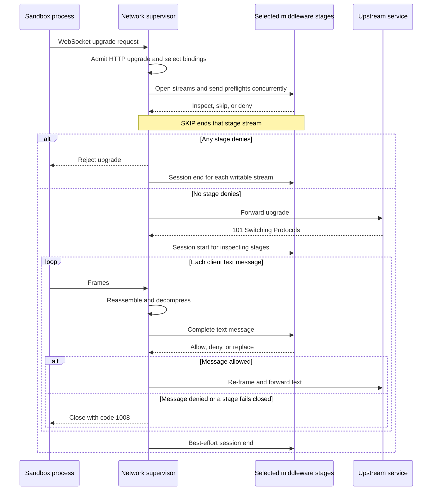

WebSocket middleware uses the `WEBSOCKET_MESSAGE/PRE_CREDENTIALS` binding to evaluate an upgrade preflight and complete client-to-upstream text messages. OpenShell opens one ordered `EvaluateWebSocketSession` stream for each selected stage.

## Session flow

The supervisor first finds host-matched middleware configurations, then keeps only implementations that advertise the WebSocket binding. An HTTP-only attachment may still inspect the upgrade request through its HTTP binding, but it does not join the post-upgrade message chain. OpenShell emits `binding_not_selected` coverage for that attachment.

## Session events

OpenShell sends these events over each selected stage stream:

1. A preflight before contacting the upstream. The stage returns `INSPECT`, voluntary `SKIP`, or authoritative `DENY`, plus optional bounded findings and metadata. Selected preflights run concurrently. Any `DENY` rejects the upgrade regardless of `on_error`.
2. A session-start notification after the upstream accepts the upgrade. It includes the negotiated subprotocol.
3. Complete client-to-upstream text messages in sequence order. OpenShell reassembles fragmented messages and decompresses negotiated `permessage-deflate` messages before evaluation.
4. A best-effort session-end notification while the stream remains writable.

Preflight and message events require `WebSocketSessionEventResult` responses. Session start and end are notifications. OpenShell attempts one terminal event for every opened stream, including a stream opened for a preflight that later rejects the upgrade. It half-closes the request stream and briefly drains the response stream. Middleware services should finish their response stream after request EOF.

The protobuf also reserves `PRE_RETURN` for future upstream-to-client inspection. A service that eventually advertises both phases receives two independent streams for one WebSocket session.

## Message handling

The protobuf represents each logical message with a `text` or `binary` variant. Text uses the protobuf `string` type, so invalid UTF-8 cannot enter the middleware contract.

A result may omit its replacement to preserve the input or return a text replacement, including an empty string. OpenShell rejects a replacement that changes the message type. It re-frames an allowed replacement, re-compresses it when required, and forwards it.

V1 does not deliver binary messages to middleware. Binary messages pass through under both `on_error` modes. OpenShell emits `unsupported_message_type` coverage for each active stage and advances the session-wide sequence number, so the next text event can contain a valid sequence gap. Control frames and upstream-to-client messages also remain uninspected.

<Warning>

If your deployment requires inspection of every WebSocket message class or both directions, V1 cannot enforce that requirement.

</Warning>

## Failure behavior

A preflight `DENY` is a successful policy decision, not a middleware failure. OpenShell rejects the upgrade before contacting the upstream and sends `MIDDLEWARE_DENIAL` session-end notifications to streams opened by successful preflights.

If a selected stage fails under `fail_open`, OpenShell disables it for the rest of the connection and continues the remaining chain. It emits both a bypass finding and a state-change finding. Under `fail_closed`, OpenShell rejects the upgrade or closes the connection.

A message result may include the same validated `reason_code` used by HTTP results. It must be 1 through 64 bytes, start with a lowercase ASCII letter, and contain only lowercase ASCII letters, digits, and underscores. An invalid code is a middleware failure governed by `on_error`.

## Payload, assembly, and capacity limits

For a WebSocket binding, `max_payload_bytes` covers one complete client text message and its replacement. It does not cover the whole session or binary relay traffic. Exceeding a selected stage's effective limit follows that stage's `on_error`.

The parsed-text platform maximum is 4 MiB. A text message may contain at most 4,096 fragments, must make input progress within 30 seconds, and must finish assembly within 2 minutes. Forwarding the completed message must finish within another 2 minutes.

The supervisor allows at most 32 concurrent text assemblies and 64 additional callers waiting without buffered payload bytes. If both bounds are full, it closes the connection with code `1013` before reading the new payload. This process-wide assembly budget applies even when no middleware is selected and persists across policy reloads.

Active message evaluations share the middleware budget with HTTP bodies. At most 32 evaluations run and 64 additional callers wait. Persistent middleware streams have a separate process-wide limit of 32 sessions. Session admission does not wait when that limit is full. OpenShell applies each selected configuration's `on_error` before it opens a stream.

## Close codes

| Code | Meaning in the parsed relay |
| --- | --- |
| `1002` | WebSocket protocol error. |
| `1007` | Invalid UTF-8 text. |
| `1008` | Middleware or policy denial. |
| `1009` | Parsed text exceeds the platform limit. |
| `1012` | Policy reload makes the pinned generation stale. |
| `1013` | Assembly capacity is full. |

Raw binary frames retain the 16 MiB relay-safety bound. The middleware payload limit does not change that bound because middleware never receives binary messages.

See [Configure middleware](/extensibility/supervisor-middleware/configure) for attachment and failure settings, and [Operate middleware](/extensibility/supervisor-middleware/operate) for coverage events and reload behavior.
