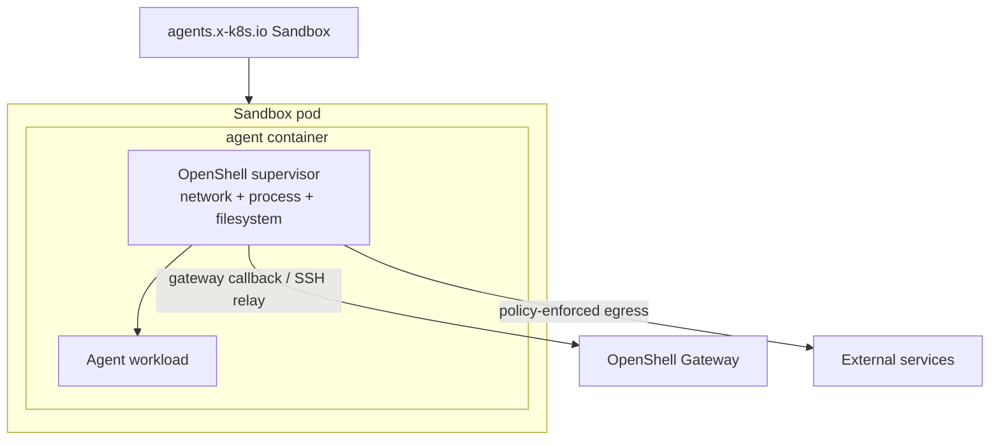
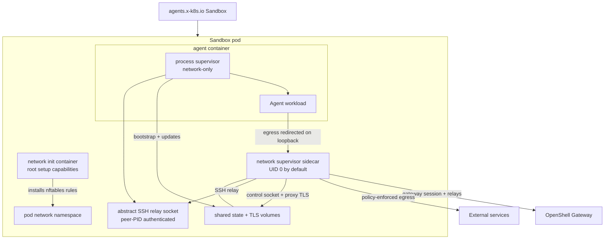
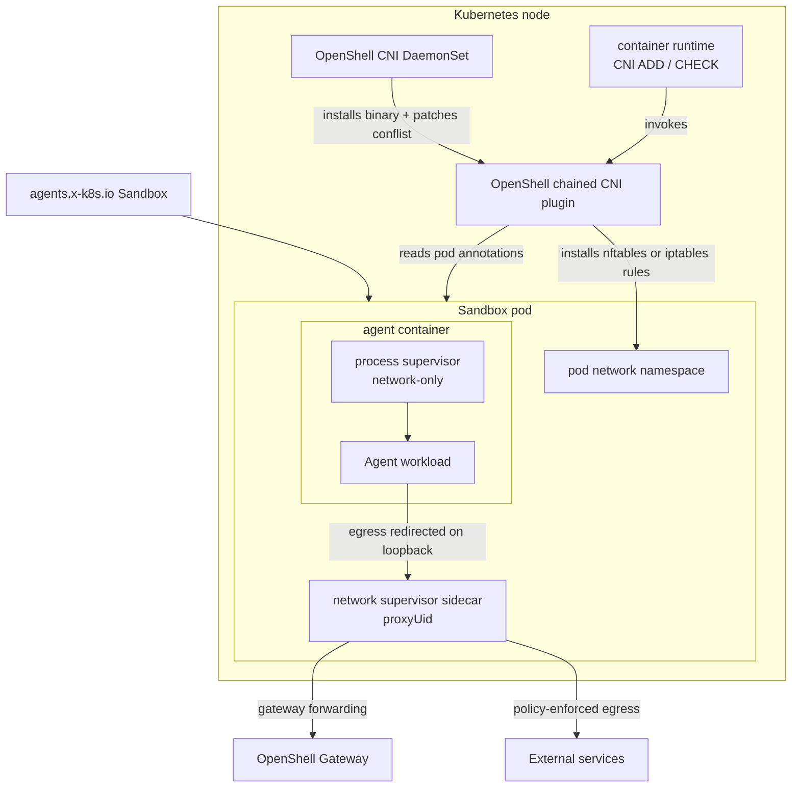

Kubernetes sandbox pods can run the OpenShell supervisor in `combined`,
`sidecar`, or `cni-sidecar` topology. Choose the topology based on which
controls you need inside the pod, how much privilege your cluster allows on the
agent container, and whether the cluster can install node-level CNI enforcement.

## Choose a Topology

The default `combined` topology preserves the full OpenShell enforcement model.
Use `sidecar` only when you accept network-focused enforcement in exchange for a
lower-privilege agent container.

| Topology | Use when | Main tradeoff |
|---|---|---|
| `combined` | You need OpenShell network, filesystem, and process controls in the sandbox workload. | The agent container carries the Linux capabilities the supervisor needs. |
| `sidecar` | You need the agent container to run as non-root without added Linux capabilities, and network policy is the primary control. | Privilege-dropping and supervisor mount isolation do not run in the agent container. |
| `cni-sidecar` | You need sidecar-mode behavior without a privileged sandbox-pod init container, and a cluster admin can install the OpenShell CNI plugin on every node. | Requires privileged node-level CNI installation; the agent process supervisor is network-only. |

## Privilege Model

The long-running container permissions differ by topology:

| Topology | Pod or container | UID/GID | Privilege escalation | Capabilities | Result |
|---|---|---|---|---|---|
| `combined` | Agent container, which also runs the supervisor | Not forced by topology | Not explicitly disabled by the driver | Adds `SYS_ADMIN`, `NET_ADMIN`, `SYS_PTRACE`, and `SYSLOG`; adds `SETUID`, `SETGID`, and `DAC_READ_SEARCH` when user namespaces are enabled | Full supervisor controls run in the agent container. |
| `sidecar` | Agent container, process-only supervisor (`network-only`) | `sandbox_uid:sandbox_gid` | `false` | Drops `ALL` | Agent and workload run without added Linux capabilities. |
| `sidecar` | Network supervisor sidecar, binary-aware mode (default) | `0:sandbox_gid` | `false` | Drops `ALL`; adds `SYS_PTRACE` and `DAC_READ_SEARCH` | Root sidecar inspects cross-UID workload `/proc` entries. The nftables fence exempts UID 0, so do not inject other root containers into these pods. |
| `sidecar` | Network supervisor sidecar, endpoint/L7-only mode | `proxyUid:sandbox_gid` | `false` | Drops `ALL` | Non-root sidecar enforces endpoint and L7 policy without matching `policy.binaries`. |
| `cni-sidecar` | Agent container, process-only supervisor (`network-only`) | `sandbox_uid:sandbox_gid` | `false` | Drops `ALL` | Agent and workload run without added Linux capabilities. |
| `cni-sidecar` | Network supervisor sidecar | Same as `sidecar` mode | `false` | Same as `sidecar` mode | Node-level CNI installs the pod network rules instead of a pod-local init container. |

Short-lived setup containers still have the permissions needed to prepare the
pod:

| Topology | Setup container | UID/GID | Privilege escalation | Capabilities | Purpose |
|---|---|---|---|---|---|
| `combined` | Supervisor install init container | `0` | Not set | Not set | Copies the supervisor binary into the agent container volume. |
| `sidecar` | Network init container | `0` | `false` | Drops `ALL`; adds `NET_ADMIN`, `NET_RAW`, `CHOWN`, and `FOWNER` | Installs pod-local nftables rules and prepares shared sidecar state. |
| `cni-sidecar` | None for network rules | N/A | N/A | N/A | The OpenShell CNI DaemonSet installs rules during pod network setup. |

## Combined Topology

Combined topology is the original Kubernetes mode and remains the default. The
agent container starts the OpenShell supervisor, and the supervisor launches the
workload after applying sandbox setup.



Combined topology keeps these controls in one supervisor path:

- Network endpoint and L7 policy enforcement.
- Filesystem policy enforcement.
- Process and binary identity checks.
- Privilege drop into the sandbox user.
- Gateway relay, SSH sessions, exec, and file sync.

Because the supervisor performs network namespace setup and process/filesystem
controls from the agent container, Kubernetes grants that container elevated
Linux capabilities. Use this mode when you need the complete OpenShell sandbox
contract and your cluster policy permits those capabilities.

## Sidecar Topology

Sidecar topology splits the supervisor into a network sidecar and a
low-privilege process supervisor in the agent container.



The pod contains these OpenShell-managed pieces:

| Component | Runs as | Purpose |
|---|---|---|
| Network init container | Root with setup capabilities | Installs pod-level nftables rules and prepares shared sidecar state. |
| Network sidecar | UID 0 by default; `supervisor.sidecar.proxyUid` when binary-aware policy is disabled | Runs the proxy, enforces network policy, owns gateway authentication and the gateway session, and serves local policy/provider state over the sidecar control socket. |
| Agent container | Resolved sandbox UID/GID | Runs the process supervisor and launches the user workload. |

In this topology, the agent container defaults to `runAsNonRoot: true`,
`allowPrivilegeEscalation: false`, and `capabilities.drop: ["ALL"]`. The
default binary-aware network sidecar runs as UID 0, drops default Linux
capabilities, and adds `SYS_PTRACE` plus `DAC_READ_SEARCH` for cross-UID workload
process identity resolution. Setting
`supervisor.sidecar.processBinaryAwareNetworkPolicy=false` runs the sidecar as
the configured non-root `proxyUid`, omits both capabilities, and downgrades
network policy to endpoint/L7 enforcement without binary matching. The root
init container keeps the setup capabilities needed to configure pod networking.

Sidecar mode preserves gateway session behavior, including SSH connectivity,
because the network sidecar owns the gateway session and bridges relay requests
to a Linux abstract SSH socket owned by the process supervisor. The relay
verifies the socket peer PID against the authenticated control connection, so
the workload cannot replace the relay endpoint. The agent container does not get a
gateway endpoint, gateway TLS material, or the sandbox bootstrap token in the
default sidecar path.

<Warning>
Sidecar mode runs the process supervisor in `network-only` mode. OpenShell still
enforces network endpoint and L7 policy through the sidecar, and the process
supervisor applies Landlock filesystem policy and child seccomp filters where
the kernel/runtime supports them. The process supervisor does not perform
root-to-sandbox privilege dropping because Kubernetes starts the container as
the sandbox UID/GID, and it does not perform supervisor identity mount
isolation because gateway credentials are not mounted into the agent container.
Sidecar pods use `shareProcessNamespace: true` so the network sidecar can
resolve workload process and binary identity through `/proc/<entrypoint-pid>`.
</Warning>

## CNI Sidecar Topology

CNI sidecar topology keeps the sidecar runtime model but moves network rule
installation out of the sandbox pod. A privileged OpenShell DaemonSet installs a
chained CNI plugin on each node. During CNI `ADD`, the plugin reads OpenShell
pod annotations and installs the sidecar bypass-prevention rules in the pod
network namespace before the workload starts.



Use this topology when a cluster admin can install node-level CNI components and
you want sandbox pods to avoid the sidecar topology's privileged network init
container.

Each node must provide a firewall backend usable from the host-executed plugin.
The plugin prefers `nft` and falls back to `iptables` when `nft` is unavailable.
The installer DaemonSet writes plugin failures to `cni.logFile` and tails that
file, so `kubectl logs daemonset/openshell-cni -c install-cni` includes CNI
`ADD` and `CHECK` errors that would otherwise only appear in pod events or node
logs.

A per-node scheduling gate ensures enforcement is in place before a sandbox
runs. Once the chained plugin is installed, the installer labels its node
`openshell.ai/cni-ready=true`, and clears the label on shutdown or when a
reconcile tick cannot restore the plugin. The gateway sets a required
`nodeAffinity` on that label for every cni-sidecar sandbox pod, so a pod cannot
schedule onto a node whose egress enforcement is not active. An ungraceful CNI
DaemonSet pod deletion can briefly leave a stale `cni-ready=true` until the pod
is rescheduled and the next reconcile tick re-evaluates it.

<Warning>
`cni-sidecar` is experimental. It currently targets normal Kubernetes runtimes
first. Kata Containers and gVisor remain validation targets, because each
runtime must honor the CNI-installed pod-network rules for this topology to
provide the expected network enforcement.
</Warning>

<Note>
The CNI installer is a **cluster singleton**. Its chained plugin enforces pods
that carry the OpenShell annotations (set only by a gateway on its own sandbox
pods) **and** whose namespace is in the plugin's enforcement allowlist. Pods in
other namespaces are passed through without an API lookup, so the allowlist
bounds the blast radius. The allowlist is built automatically: each `cni-sidecar`
release labels its sandbox namespace `openshell.ai/sandbox=true` (via a helm
hook) and the singleton aggregates every labeled namespace each reconcile — so
enable the installer (`cni.enabled=true`) in exactly one release per cluster,
and additional releases (`cni.enabled=false`, `cni.external=true`) are discovered
and enforced automatically. `cni.sandboxNamespaces` is an optional static
addition. The installer treats any `openshell-cni` chained entry as its own and
upgrades it in place.
</Note>

## Credential Exposure

Sidecar and cni-sidecar topologies keep gateway credentials in the network
sidecar. The agent container does not mount the projected ServiceAccount token
used for sandbox token bootstrap, does not mount the sandbox client TLS secret,
and does not get gateway callback environment variables.

The network sidecar serves the policy and workload-facing provider environment
over a Unix control socket in the shared sidecar state volume. Before launching
the workload, the process supervisor establishes the only accepted connection.
The sidecar validates its UID, GID, and PID with peer credentials, unlinks the
listener, derives the SSH target from trusted configuration, and rejects later
clients. The connection receives bootstrap state and provider-environment
updates after settings polls. If it closes, the network sidecar exits so
Kubernetes recreates the one-client bootstrap listener, and the process
supervisor exits so Kubernetes terminates the workload and restarts the agent
container. This symmetric failure behavior prevents a surviving workload from
claiming the new control listener after an isolated sidecar restart. Future
child processes can see refreshed provider env without giving the agent
container gateway authentication material. This does not mutate the environment
of the already-running workload entrypoint. Use `combined` topology when you
need the full single-supervisor enforcement path; use additional runtime
isolation when you need a stronger container boundary around sidecar workloads.

## RuntimeClass Isolation

Sidecar topology has been validated with Kata Containers. It does not currently
support gVisor because sidecar mode requires pod-local nftables setup, which
gVisor does not provide to the init container. A supported sandboxed runtime
strengthens the container boundary while OpenShell focuses on network policy
enforcement from the sidecar.

`cni-sidecar` is intended to test whether CNI-installed pod-network rules can
make sidecar-style enforcement work on stricter runtime classes.

Runtime classes do not re-enable the OpenShell privilege-drop or supervisor
mount-isolation controls that sidecar and cni-sidecar modes relax. Use them as
an additional workload boundary, not as a replacement for the combined
topology's full supervisor controls.

You can set a default runtime class in the Kubernetes driver configuration or
override it per sandbox with driver config:

```shell
openshell sandbox create \
  --driver-config-json '{"kubernetes":{"pod":{"runtime_class_name":"kata-containers"}}}' \
  -- claude
```

## Enable Sidecar Mode

For direct gateway TOML configuration, set the Kubernetes driver fields for
the topology you want to test.

For sidecar mode:

```toml
[openshell.drivers.kubernetes]
topology = "sidecar"

[openshell.drivers.kubernetes.sidecar]
proxy_uid = 1337
```

`proxy_uid` configures only the relaxed endpoint/L7-only sidecar. It must be a
non-root UID and must not match the sandbox UID. The default binary-aware mode
runs the sidecar as UID 0 instead. The network init container exempts the
effective sidecar UID from proxy redirection so the sidecar can reach the
gateway.

For CNI-sidecar mode:

```toml
[openshell.drivers.kubernetes]
topology = "cni-sidecar"

[openshell.drivers.kubernetes.sidecar]
proxy_uid = 1337
```

In CNI-sidecar mode, the OpenShell CNI plugin installs the pod-network rules
that the network init container installs in `sidecar` mode.

When the Helm chart renders `gateway.toml`, set the equivalent chart values:

```yaml
supervisor:
  topology: sidecar
  sidecar:
    proxyUid: 1337
    processBinaryAwareNetworkPolicy: true
```

Set `supervisor.topology=cni-sidecar` and enable the CNI installer to use CNI
sidecar mode:

```yaml
cni:
  enabled: true
supervisor:
  topology: cni-sidecar
  sidecar:
    proxyUid: 1337
```

The OpenShell CNI installer requires privileged node access so it can copy the
plugin into the host CNI binary directory and patch the node CNI conflist.

### OpenShift (Multus / OVN-Kubernetes)

On OpenShift the default network is managed by the Cluster Network Operator and
there is no CNI `.conflist` to append to. Use `cni.mode: multus-chain`, which
injects the OpenShell plugin through the Multus `vendor-cni-chain` auxiliary chain
without modifying any operator-managed file. The installer also needs the
`privileged` SecurityContextConstraints.

Install with the example values (a step-by-step OpenShift walkthrough with
verification is in [OpenShift](/kubernetes/openshift#enable-the-cni-sidecar-topology)):

```shell
helm install openshell deploy/helm/openshell \
  -f deploy/helm/openshell/examples/cni-sidecar-openshift.yaml
```

This sets `cni.binDir: /var/lib/cni/bin`, `cni.chainDir:
/run/multus/cni/net.d/vendor-cni-chain`, a persistent `cni.stateDir`,
`cni.openshift.privilegedSCC: true`, and
`sandboxServiceAccount.openshift.binaryAwareSCC: true`. It requires a Multus
thick daemon with `auxiliaryCNIChainName` configured (default on OpenShift 4.x).

#### Sandbox pod SecurityContextConstraints

With `supervisor.sidecar.processBinaryAwareNetworkPolicy` enabled (the default),
the network sidecar runs as UID 0 with the `SYS_PTRACE` and `DAC_READ_SEARCH`
capabilities so it can inspect the agent process's `/proc` entries across UID
boundaries. OpenShift's `restricted-v2` SCC forbids UID 0 and those
capabilities, so the sandbox ServiceAccount needs a purpose-built SCC.

Setting `sandboxServiceAccount.openshift.binaryAwareSCC: true` creates a minimal
SCC — the `restricted-v2` baseline plus only UID 0, `SYS_PTRACE`,
`DAC_READ_SEARCH`, and the `image` volume type used to sideload the supervisor
binary — and a ClusterRole/ClusterRoleBinding granting it to the sandbox
ServiceAccount. Everything else stays locked down: no privileged container, no
host namespaces, `allowPrivilegeEscalation: false`, drop `ALL`, and the
`runtime/default` seccomp profile.

To run with lower privileges at the cost of binary matching, set
`supervisor.sidecar.processBinaryAwareNetworkPolicy: false`; the sidecar then
runs as `proxyUid` without the extra capabilities, and the built-in
`restricted-v2` SCC suffices (leave `binaryAwareSCC` unset).

Leave `topology` unset, or set it to `combined`, to keep the original
single-container supervisor path. For Helm installs, leave
`supervisor.topology` unset or set it to `combined`.

Set `supervisor.sidecar.processBinaryAwareNetworkPolicy=false` only when you
accept downgrading sidecar network policy to endpoint/L7 enforcement without
matching `policy.binaries`. This changes the sidecar from UID 0 to `proxyUid`
and removes its `SYS_PTRACE` and `DAC_READ_SEARCH` capabilities, which are used
for cross-UID `/proc` inspection.

## Next Steps

- To install OpenShell on Kubernetes, refer to [Setup](/kubernetes/setup).
- To configure gateway authentication, refer to [Access Control](/kubernetes/access-control).
- To review the driver fields, refer to [Gateway Configuration File](/reference/gateway-config).
