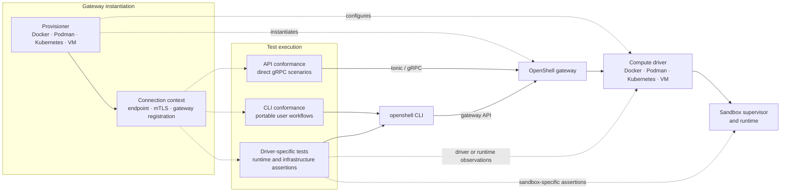

# OpenShell conformance

`openshell-conformance` is an internal CLI for validating the driver-agnostic
behavior of an existing OpenShell gateway installation. Its scenario engine
lives in the standalone `e2e/rust` package and is shared with the Rust
`e2e-api-conformance` test profile.

The binary is not published or included in release packaging. Build and run it
through the e2e manifest:

```shell
cargo run --manifest-path e2e/rust/Cargo.toml --bin openshell-conformance -- list
cargo run --manifest-path e2e/rust/Cargo.toml --bin openshell-conformance -- \
  run --gateway-endpoint http://127.0.0.1:50051
cargo run --manifest-path e2e/rust/Cargo.toml --bin openshell-conformance -- \
  run --gateway-endpoint http://127.0.0.1:50051 --filter lifecycle --timeout 120
```

The runner requires an explicit gateway endpoint, either through
`--gateway-endpoint` or `OPENSHELL_GATEWAY_ENDPOINT`. HTTPS gateways require
explicit `--tls-ca`, `--tls-cert`, and `--tls-key` paths. Each created sandbox
uses a compact `osct-<scenario-code>-<run-id>` name that fits the gateway's
19-character routable-name limit. The runner performs best-effort cleanup, and
the prefix makes any sandbox left after an interruption easy to identify.

The capabilities scenario remains deferred until the gateway exposes driver
capabilities through its public API. It is not included as a known-failing CI
scenario.

The test profiles separate the surface being validated:

- `e2e-api-conformance` invokes the scenario engine directly against every
  gateway driver. This includes stop/start lifecycle behavior, command
  execution through the streaming `ExecSandbox` API, and process-hardening
  checks.
- `e2e-cli-conformance` validates portable CLI behavior against the canonical
  Docker-backed gateway, including the gateway smoke test.

## Test architecture



Solid arrows show normal request paths. Dashed arrows show provisioning,
connection metadata, lifecycle control, or implementation-specific
observations. Update this diagram whenever a test moves between profiles, a
new test surface is added, or the boundary between provisioning and test
execution changes.

## Driver coverage

| Driver | API conformance | CLI conformance | Driver-specific intent | Possible evolution |
| --- | --- | --- | --- | --- |
| Docker | Full baseline | Canonical full CLI profile; the focused task runs smoke only | Custom images, Docker preflight, volumes, restart/resume, and host gateway | Keep as the canonical CLI lane; external-image checks could become optional CLI conformance |
| Podman | Full baseline | Not currently enabled | Podman re-adoption, volumes, token restart, and host gateway | Enable selected CLI conformance to prove portability; keep restart behavior operational |
| Kubernetes | Full baseline | Not currently enabled | Readiness, user namespaces, Kubernetes topology, and host gateway | Enable selected CLI conformance where cluster fixtures permit; keep pod and deployment assertions driver-specific |
| VM | Full baseline | Smoke workflow | Overlay persistence, TLS permissions, host gateway, and restart/resume | Expand selected CLI conformance; keep overlay assertions driver-specific and restart behavior operational |

Potential cross-driver follow-ups include:

- API security and network conformance for bypass detection and `NO_PROXY`
- CLI conformance for settings management, live policy updates, and provider
  auto-creation
- optional CLI conformance for external community-image resolution
- operational conformance for provisioner-controlled gateway restart/resume

VM filesystem behavior is not driver-independent. The `vm_overlay` test remains
under the `e2e-vm` profile and runs alongside API conformance in the VM lane.

Gateway provisioners export the endpoint and any mTLS paths through
`OPENSHELL_GATEWAY_ENDPOINT` and the `OPENSHELL_CONFORMANCE_TLS_*` variables.
Set `OPENSHELL_CONFORMANCE_TIMEOUT` to change the per-scenario timeout.
