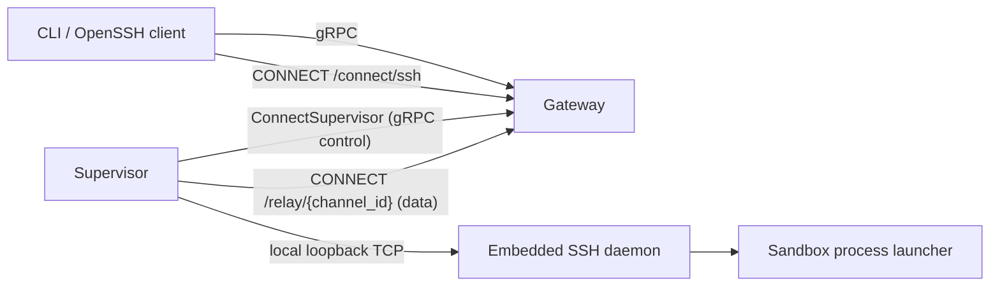
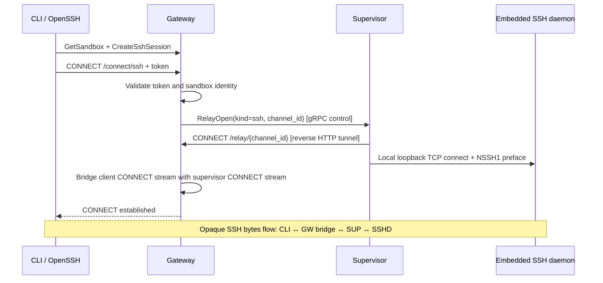
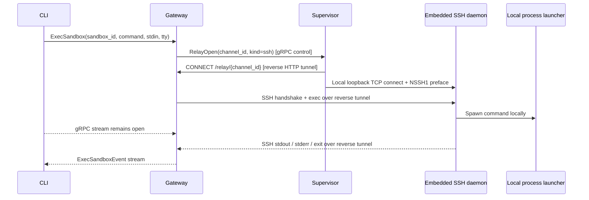

---
authors:
  - "@pimlock"
state: draft
links:
  - https://linear.app/nvidia/document/rfc-0001-core-architecture-c3a58267fd9c
  - https://linear.app/nvidia/issue/OS-31/openshell-long-running-agentservice-primitives
  - https://linear.app/nvidia/issue/OS-83/implement-initial-supervisor-gateway-session-stream
  - https://linear.app/nvidia/issue/OS-86/implement-reverse-connect-sshconnect-relay-over-supervisor-sessions
  - https://linear.app/nvidia/document/plan-sshexec-over-supervisor-sessions-960d5719e61c
---

# RFC 0002 - Supervisor-Initiated Connectivity for Connect and Exec

## Summary

This RFC proposes making the supervisor-initiated gateway session the only control and interactive connectivity path between sandboxes and the gateway. Instead of the gateway resolving and dialing a sandbox SSH endpoint, each supervisor maintains a long-lived authenticated session to the gateway, and the gateway uses that session for configuration delivery, SSH-compatible connect flows, and `ExecSandbox`. The public client contract remains stable: `CreateSshSession` plus `CONNECT /connect/ssh` stays the entrypoint for OpenSSH-compatible access, while `ExecSandbox` remains the typed gRPC API for remote command execution. In the initial implementation, `ExecSandbox` continues to use SSH internally, but that SSH transport runs through the supervisor session instead of requiring direct gateway-to-sandbox reachability.

## Motivation

RFC-0001 established the architectural direction that supervisors should connect outbound to the gateway and that the gateway should not depend on direct reachability into sandbox runtime addresses. The current implementation still relies on the opposite assumption for interactive access:

- `/connect/ssh` validates a token and then dials the sandbox's SSH port directly
- `ExecSandbox` resolves the sandbox endpoint and establishes an SSH transport from the gateway to the sandbox
- the compute layer and driver are responsible for returning a dialable sandbox address

That model creates several problems:

- it ties the gateway to infrastructure-specific address resolution and reachability rules
- it makes NATed, private, or otherwise non-addressable sandbox environments harder to support
- it forces every compute backend to solve "how can the gateway reach the sandbox?" instead of only "how can the supervisor reach the gateway?"
- it splits sandbox-facing traffic between a supervisor->gateway control path and a gateway->sandbox interactive path

We want to invert that relationship. The supervisor should be the only component that needs network reachability to the gateway. Once that session exists, all higher-level operations can be layered on top of it.

This RFC also captures the next step after the initial supervisor session work tracked in `OS-83`. That issue establishes the session primitive and preserves today's config and log behavior. This RFC extends that model to interactive access and exec, while keeping the direct typed-exec redesign as a follow-on after the initial transport inversion lands.

## Non-goals

- Exposing long-running services from a sandbox to external clients. That is a separate RFC under the broader `OS-31` effort.
- Designing the full multi-replica gateway session ownership and cross-replica forwarding protocol. This RFC calls out the requirement but defers the details.
- Preserving the current gateway->sandbox direct-connect implementation as a long-lived fallback path.
- Replacing SSH as the public transport for `sandbox connect`, editor integrations, file transfer, or port forwarding.
- Redesigning the public `CreateSshSession`, `/connect/ssh`, or `ExecSandbox` APIs.
- Finalizing every supervisor/gateway session message in wire-level detail.

## Proposal

### Overview

Introduce a persistent supervisor-to-gateway session primitive and make it the transport foundation for both control-plane synchronization and interactive access. The gateway no longer dials a sandbox network endpoint. Instead:

- the supervisor establishes and maintains a long-lived authenticated session to the gateway
- the gateway records which live session owns each sandbox
- SSH-compatible connect flows and `ExecSandbox` are relayed through supervisor-initiated reverse tunnels coordinated by that session

The resulting architecture is:



### Persistent supervisor session

The gateway exposes a long-lived bidirectional RPC, referred to in this RFC as `ConnectSupervisor`.

At a high level:

```proto
rpc ConnectSupervisor(stream SupervisorToGatewayMessage)
    returns (stream GatewayToSupervisorMessage);
```

The supervisor opens this session outbound to the gateway after sandbox startup and keeps it alive for the lifetime of the sandbox. The session is the authoritative live connectivity channel between the gateway and that sandbox.

The session carries control-plane traffic:

- supervisor registration and sandbox identity
- heartbeat and liveness traffic
- desired-state delivery for config, policy, provider environment, and inference routes
- desired-state application acknowledgements and failure reporting
- log batches
- policy analysis submissions
- relay channel lifecycle coordination (open, accept/reject, close) for SSH-compatible connect flows and `ExecSandbox`

The actual SSH byte traffic for connect and exec flows over separate supervisor-initiated reverse HTTP CONNECT tunnels, not over the gRPC stream. The gRPC session coordinates when to open and close those tunnels. See the [OS-86 plan](https://linear.app/nvidia/document/plan-sshexec-over-supervisor-sessions-960d5719e61c) for the detailed data-plane design and alternatives considered.

Although this is a single bidirectional RPC, the two stream directions should use different envelope types.

At a high level:

```proto
message SupervisorToGatewayMessage {
  oneof payload {
    SupervisorHello hello = 1;
    Heartbeat heartbeat = 2;
    ConfigApplied config_applied = 3;
    LogBatch log_batch = 4;
    PolicyAnalysisReport policy_analysis = 5;
    PolicySyncRequest policy_sync = 6;
    RelayOpenResult relay_open_result = 10;
    RelayClose relay_close = 11;
  }
}

message GatewayToSupervisorMessage {
  oneof payload {
    SessionAccepted session_accepted = 1;
    SessionRejected session_rejected = 2;
    Heartbeat heartbeat = 3;
    ConfigSnapshot config_snapshot = 4;
    ConfigUpdated config_updated = 5;
    InferenceRoutesSnapshot inference_snapshot = 6;
    InferenceRoutesUpdated inference_updated = 7;
    RelayOpen relay_open = 10;
    RelayClose relay_close = 11;
  }
}
```

The envelopes differ because the allowed actions differ by direction:

- only the supervisor should send logs, desired-state application results, and policy analysis
- only the gateway should send desired-state snapshots or updates
- both sides may carry heartbeat traffic and relay lifecycle messages, but those can reuse shared payload message types inside direction-specific envelopes

This gives us better schema clarity, simpler validation, and fewer impossible states. With a single shared envelope type, it becomes easy to accidentally model nonsensical cases such as the gateway receiving `ConfigUpdated` or the supervisor receiving `LogBatch`.

This RFC still does not lock down every wire-level field. The important design choice is that the stream is bidirectional but directionally typed. If direct typed exec traffic is introduced later, those messages or RPCs should preserve this same directional separation.

We should also prefer semantically specific message names over a generic `...Event` suffix. In practice:

- use `...Snapshot` for full current desired state sent on attach
- use `...Updated` for pushed changes to that state
- use `...Applied` or `...Result` for acknowledgements and outcomes
- use `...Open`, `...Result`, and `...Close` for relay channel lifecycle on the control stream

That naming makes it much easier to reason about message direction and whether a given payload is declarative state, a command, or an outcome.

### Example session messages

The following examples are intentionally partial. They are here to make the target message vocabulary concrete, not to lock down every field.

```proto
message SupervisorHello {
  string sandbox_id = 1;
  string supervisor_instance_id = 2;
  string supervisor_version = 3;
  repeated string capabilities = 4;
}

message SessionAccepted {
  string session_id = 1;
  string gateway_replica_id = 2;
  uint32 heartbeat_interval_secs = 3;
}

message ConfigSnapshot {
  uint64 config_revision = 1;
  openshell.sandbox.v1.SandboxPolicy policy = 2;
  map<string, EffectiveSetting> settings = 3;
  map<string, string> provider_environment = 4;
  PolicySource policy_source = 5;
  uint32 policy_version = 6;
  string policy_hash = 7;
}

message ConfigUpdated {
  ConfigSnapshot snapshot = 1;
}

message ConfigApplied {
  uint64 config_revision = 1;
  bool success = 2;
  string error = 3;
  uint32 policy_version = 4;
}

message InferenceRoutesSnapshot {
  string revision = 1;
  repeated ResolvedRoute routes = 2;
}

message InferenceRoutesUpdated {
  InferenceRoutesSnapshot snapshot = 1;
}

message PolicyAnalysisReport {
  repeated DenialSummary summaries = 1;
  repeated PolicyChunk proposed_chunks = 2;
  string analysis_mode = 3;
}

message PolicySyncRequest {
  openshell.sandbox.v1.SandboxPolicy policy = 1;
  string reason = 2;
}

message RelayOpen {
  string channel_id = 1;
  string kind = 2;
}

message RelayOpenResult {
  string channel_id = 1;
  bool accepted = 2;
  string error = 3;
}

message RelayClose {
  string channel_id = 1;
  string reason = 2;
}

```

These examples also show one of the intended simplifications of the target design:

- provider environment is folded into config delivery instead of needing a separate startup fetch
- inference bundle delivery is pushed from the gateway instead of polled
- policy load reporting is generalized into desired-state application acknowledgement
- relay channel lifecycle messages on the control stream coordinate both `sandbox connect` and the initial `ExecSandbox` transport, with actual SSH bytes flowing over separate reverse HTTP CONNECT tunnels

### Multiplexing and request correlation

Once multiple operations share a single long-lived supervisor session, the protocol needs explicit application-level correlation for relay channel lifecycle.

The gRPC control stream carries only relay lifecycle messages (`RelayOpen`, `RelayOpenResult`, `RelayClose`). The actual SSH byte traffic for each relay flows over a separate supervisor-initiated reverse HTTP CONNECT tunnel, one TCP connection per relay channel. This means the gRPC stream is not a data-plane multiplexer — it coordinates the lifecycle of independent data-plane connections.

Each concurrent relay channel has its own `channel_id`, unique within a live `session_id`. The gateway allocates `channel_id` values for gateway-initiated relay operations. That keeps collision handling simple and makes ownership of cleanup clear.

At a high level, the gateway keeps:

- `channel_id -> active relay state` (the bridged HTTP CONNECT streams, cancellation handles, timeout state, metrics)
- a pending-channel map for relay channels that have been opened via gRPC but whose reverse HTTP CONNECT has not yet arrived

At a high level, the supervisor keeps:

- `channel_id -> local bridge state` (the reverse HTTP CONNECT stream paired with a loopback TCP connection to the embedded SSH daemon)

This state is intentionally in-memory and tied to the live session. It should not be persisted as durable control-plane data.

Each relay channel should have a simple local state machine: `opening -> open -> closing -> closed`. Out-of-order or invalid transitions should be treated as protocol errors for that channel and cleaned up eagerly.

If the parent session is lost:

- all active relay channels close (both the gRPC-coordinated lifecycle and the underlying HTTP CONNECT tunnels)
- all in-flight exec requests fail
- the corresponding in-memory maps are dropped

The design should not attempt to migrate relay channels across session reconnects.

See the [OS-86 plan](https://linear.app/nvidia/document/plan-sshexec-over-supervisor-sessions-960d5719e61c) for the detailed data-plane transport design and alternatives considered.

`ConnectSupervisor` is the preferred working name because it accurately describes both the initial attach and every later reconnect. This is not a one-time registration ceremony. A supervisor may reconnect many times across gateway restarts, network interruptions, and supervisor restarts, and the same RPC should cover all of those cases. Names such as `RegisterSupervisor` imply a first-time, mostly one-shot side effect and fit a unary API better than a long-lived session stream.

If we later decide we want the name to emphasize the session resource more explicitly, the strongest alternatives are:

- `StartSupervisorSession`, which is straightforward and lighter-weight
- `OpenSupervisorSession`, which is shorter but slightly more generic

At the moment, `ConnectSupervisor` strikes the best balance between clarity, brevity, and reconnect semantics.

### Session lifecycle and failure handling

The persistent supervisor session is reconnectable and must be treated as live state rather than permanent registration state.

At a minimum, the protocol should distinguish:

- the stable sandbox identity
- the stable supervisor identity for the current sandbox process instance, such as a boot id or process epoch
- the current live session id or session epoch assigned to this particular connection

This allows the gateway to reason about duplicate sessions, stale sessions, reconnects, and ownership changes without conflating them.

The gateway needs to track the following state:

- sandbox id -> owning gateway replica
- current live session id or epoch for that sandbox
- connected / stale / disconnected live session state
- `connected_at` and `last_heartbeat_at`
- `last_disconnect_at` and `last_disconnect_reason`
- optionally, the last config or policy revision acknowledged by the supervisor

Ephemeral interactive state, such as active SSH relay channels or running exec requests, should remain replica-local to the owning gateway and should not be treated as durable shared state.

The supervisor also needs a small amount of reconnect state for correctness and observability:

- the gateway endpoint or gateway replica it is currently attempting to reach
- current reconnect attempt and backoff state
- last successful connection time
- last connection failure reason, if known

#### Gateway restart

If the gateway process or replica restarts:

- the supervisor's stream terminates or transport keepalives fail
- the supervisor reconnects using exponential backoff
- the new connection is treated as a fresh live session for an existing sandbox, not a new sandbox registration
- the gateway replays authoritative state on reconnect, including the latest policy, settings, and any other required runtime configuration

Outstanding interactive operations fail closed:

- active SSH-compatible sessions disconnect
- in-flight `ExecSandbox` requests fail and the client may retry if appropriate

The system should not attempt to transparently preserve interactive byte streams across a gateway restart.

#### Supervisor restart or crash

If the supervisor process restarts while the sandbox is otherwise still provisioned:

- the old live session disappears
- any active SSH relay channels terminate
- any in-flight exec requests fail
- the restarted supervisor reconnects using the same sandbox identity and a new supervisor or session epoch

This should be handled the same way as any other reconnect, with the newer session superseding the older one.

#### Heartbeats and keepalives

The session should use both transport-level keepalives and application-level heartbeats:

- gRPC keepalives detect half-open transport failures
- explicit heartbeat messages give the gateway and supervisor an application-visible liveness signal

If heartbeats are missed:

- the session first becomes stale
- after a timeout window it becomes disconnected
- connect and exec requests must fail rather than being silently queued behind a dead session

If the transport remains open but application heartbeats stop making forward progress, the gateway should still treat that session as unhealthy. This protects against half-broken cases where the TCP or HTTP/2 connection exists but the supervisor event loop is wedged.

#### Timeouts

The session model needs explicit timeout behavior for at least:

- supervisor session establishment
- heartbeat expiry
- SSH relay channel open
- exec startup
- exec inactivity or total runtime, when requested by the caller

Timeout handling should be fail-fast and explicit. The gateway should not wait indefinitely for a disconnected or non-responsive supervisor.

#### Network partitions and reconnect behavior

Transient network failures between supervisor and gateway should be treated as normal operating conditions rather than exceptional cases. The reconnect loop should therefore:

- use bounded exponential backoff with jitter
- continue retrying for the lifetime of the sandbox unless the sandbox is shutting down
- reset backoff after a successful connection
- record the reason for prolonged disconnects so operators can distinguish "sandbox stopped" from "sandbox exists but cannot reach gateway"

The design should not assume that disconnects are rare.

#### Duplicate and stale sessions

Reconnects and race conditions can produce overlapping connection attempts from what claims to be the same sandbox. The protocol therefore needs a clear winner rule:

- the gateway accepts one live session as authoritative for a sandbox at a time
- newer sessions supersede older ones
- superseded sessions are closed and their relay or exec traffic is terminated

This is especially important once multi-replica ownership exists.

#### Relay and exec cleanup

Interactive sub-operations should be tied to the lifetime of the owning supervisor session:

- relay channels close when either side closes them or when the parent session is lost
- exec requests are cancelled when the parent session is lost unless a future design explicitly introduces detached execution
- the gateway and supervisor should both treat orphaned relay or exec state as a bug and clean it up eagerly

This prevents session churn from leaking local resources or leaving misleading in-memory state behind.

#### Surfacing live session state to users and operators

Sandbox provisioning readiness and supervisor live session state are related but not identical. A sandbox can still exist at the compute layer while its live session is down.

The system should therefore surface supervisor connectivity separately from raw provisioning state. At a high level, operators and clients need to know:

- whether the sandbox exists
- whether the sandbox is expected to have a live supervisor session
- whether that session is currently connected, stale, or disconnected

This may be represented as a dedicated condition or status field rather than overloading the existing sandbox phase model.

### Data model

The data model should separate the stable sandbox resource from the live connectivity state used to reach it.

`Sandbox` should remain the canonical long-lived, user-facing resource:

- desired spec stays on `Sandbox.spec`
- provisioning and user-facing readiness stay on `Sandbox.status` and `Sandbox.phase`
- sandbox identity and lifecycle continue to exist even when no live supervisor session is connected

The live reverse-connect attachment should be represented as a separate gateway-owned entity, referred to here as `SupervisorSession`.

For the initial implementation, this should be modeled as one current session record per sandbox, updated in place, rather than an append-only list of every historical reconnect. In practice that means:

- `SupervisorSession` has a `sandbox_id`
- there is at most one authoritative current `SupervisorSession` record per sandbox
- reconnects replace or update that record rather than creating an unbounded number of durable rows
- the record carries the current `session_id` or session epoch for the live connection

This avoids growth concerns while still giving the gateway a first-class place to store session-specific state.

At a high level, `SupervisorSession` should contain:

- `sandbox_id`
- current live `session_id` or session epoch
- supervisor instance identity, such as boot id or process epoch
- owning gateway replica id
- live session state such as connected, stale, or disconnected
- `connected_at`, `last_heartbeat_at`, and `last_disconnect_at`
- `last_disconnect_reason`
- optionally, last acknowledged config or policy revision

By contrast, sub-operations under a live session should remain ephemeral and in-memory on the owning gateway replica:

- active SSH relay channels
- active exec requests
- per-channel byte counters, flow-control state, and cancellation handles

Those objects are tied to a live transport and do not benefit from durable storage in the initial design. If the gateway restarts, they are lost and fail closed.

This leads to a deliberate hybrid model:

- durable store: stable sandbox resources plus the latest per-sandbox supervisor-session summary
- in-memory registry: the actual live stream handle and all active relay or exec sub-state

Routing decisions for connect and exec should use the in-memory registry on the owning gateway replica. The persisted `SupervisorSession` record is for coordination, recovery, and observability, not as a substitute for a live stream handle.

To keep the public API simple, the gateway should also project a small derived view of supervisor connectivity onto the sandbox itself, likely as a dedicated condition or status summary such as `SupervisorConnected`. That gives clients a straightforward way to answer "is this sandbox currently reachable?" without forcing them to query a separate session object for common cases.

The system should not initially create durable child records for every relay channel, every reconnect attempt, or every exec request. If historical analysis is needed, it should come from logs and telemetry rather than from making the primary control-plane data model append-only.

### Authentication and trust model

This RFC preserves the current client-facing auth model:

- CLI->gateway auth remains whatever the gateway already supports, such as mTLS or edge-authenticated access
- `CreateSshSession` remains the authorization/bootstrap step for SSH-compatible connect flows
- `/connect/ssh` continues to require the sandbox id and session token

The supervisor session introduces a second trust boundary:

- the supervisor establishes its identity when establishing `ConnectSupervisor`
- the gateway binds the live session to a specific sandbox identity
- connect and exec requests are routed to that already-authenticated live session

Under this model, the gateway no longer needs a remote network handshake like today's gateway->sandbox NSSH1 exchange in order to prove that it reached the intended sandbox over the network. NSSH1 therefore stops being a gateway-to-sandbox network trust boundary. However, the supervisor continues to send the NSSH1 preface on local loopback connections to the embedded SSH daemon. This preserves compatibility with the existing SSH daemon implementation and the `ExecSandbox` path, which relies on the same SSH handshake flow. Whether NSSH1 is eventually removed from the loopback path is a future cleanup decision, not a blocker for this RFC.

### `sandbox connect` and SSH-compatible relay

The public connect contract remains unchanged:

1. CLI resolves the sandbox and calls `CreateSshSession`
2. CLI launches OpenSSH with `ssh-proxy` as `ProxyCommand`
3. `ssh-proxy` opens `CONNECT /connect/ssh` and presents the sandbox id and token

What changes is the backend implementation of `/connect/ssh`.

Instead of resolving a dialable sandbox endpoint and opening a TCP connection from the gateway to port 2222, the gateway:

1. validates the SSH session token
2. resolves the owning live supervisor session for the target sandbox
3. sends `RelayOpen` over the gRPC control stream
4. waits for the supervisor to open a reverse HTTP CONNECT tunnel back to the gateway
5. bridges the client's upgraded CONNECT stream with the supervisor's reverse CONNECT stream

The supervisor handles that relay-open request by:

1. opening a reverse HTTP CONNECT to the gateway's `/relay/{channel_id}` endpoint
2. connecting locally to the embedded SSH daemon on loopback (with NSSH1 preface)
3. bridging bytes between the reverse HTTP CONNECT stream and the local SSH connection

Sequence:



Because the relay is intentionally opaque after setup, this preserves compatibility with:

- interactive shell sessions
- editor integrations that rely on `ProxyCommand`
- SFTP and modern `scp`
- SSH `direct-tcpip` port forwarding

This is an important design constraint. We are not introducing a new public interactive protocol here; we are relocating where the bytes are bridged.

### `ExecSandbox`

`ExecSandbox` remains the public typed gRPC API exposed by the gateway. In the initial implementation, its transport changes from "gateway runs an SSH client against a sandbox-resolved endpoint" to "gateway runs the same SSH client over a relay channel on the supervisor session."

The proposed flow is:

1. CLI calls `ExecSandbox` on the gateway exactly as it does today
2. gateway validates the sandbox id and finds the owning live supervisor session
3. gateway sends `RelayOpen` over the gRPC control stream
4. supervisor opens a reverse HTTP CONNECT tunnel back to the gateway and bridges it to the local SSH daemon
5. gateway runs the existing per-request SSH exec flow over that reverse tunnel
6. gateway forwards stdout, stderr, and exit status to the existing `ExecSandbox` response stream

Sequence:



Today, `ExecSandbox` is implemented as a fresh SSH transport per request. The gateway resolves the sandbox endpoint, starts a single-use local SSH proxy, opens a new SSH connection, authenticates, opens one session channel, optionally requests a PTY, sends one exec request, sends the full stdin payload, waits for output and exit, and then tears the SSH connection down. It is not a shared long-lived SSH control connection with many exec channels underneath it.

For the initial implementation, this RFC intentionally keeps SSH as the internal exec transport to minimize behavior changes and reduce the amount of new protocol surface required in `OS-86`. The gateway-side `russh` client path can remain largely intact, as long as it is pointed at the reverse HTTP CONNECT tunnel instead of a sandbox-resolved network endpoint.

With SSH bytes flowing over dedicated reverse HTTP CONNECT tunnels rather than the gRPC stream, the practical motivation for replacing the internal SSH transport with typed exec messages is weaker than originally anticipated. See the alternatives section and implementation step 4 for further discussion.

To preserve behavior and avoid divergence, the supervisor should reuse the same local process-launch logic and policy enforcement path currently used by the embedded SSH daemon for shell and exec requests:

- same run-as-user behavior
- same PTY allocation semantics when `tty=true`
- same environment and provider injection behavior
- same workdir handling
- same network namespace, privilege dropping, and sandbox enforcement

Where current PTY semantics inherently merge stdout and stderr, the session-based exec path should preserve that behavior rather than inventing new stream semantics.

It is also important to be clear about the current interaction model. `ExecSandbox` is not a general-purpose interactive terminal protocol today:

- stdin is sent as a single upfront payload, not as a live stream
- there is no resize channel in the public API
- there is no user-visible signal forwarding model beyond timeout-driven termination

In this API, `tty=true` should therefore be read as "allocate PTY semantics for the child process" rather than "provide a full interactive terminal session." PTY still matters because many programs change behavior based on whether they are attached to a terminal, and because PTY mode changes output and stream semantics. For example:

- the child sees a terminal-like environment instead of plain pipe mode
- stdout and stderr may no longer remain meaningfully separate
- terminal-oriented formatting, prompts, and buffering behavior can change

That means truly interactive workloads such as full-screen terminal applications are already better served by `sandbox connect`. As long as the typed session-based exec path preserves the current `ExecSandbox` semantics, moving off SSH should not create a large new compatibility break for those workloads because they are not fully supported by the current API either.

### Impact on compute drivers

This RFC removes "return a gateway-dialable interactive endpoint" from the critical path for connect and exec.

Compute still needs to provision sandboxes and identify them, but it no longer needs to satisfy "the gateway must be able to open a TCP connection to this sandbox for interactive access." That simplifies the transport assumptions for future compute backends.

This does not mean endpoint resolution disappears everywhere immediately. Existing code may still need sandbox addresses for other operational purposes, and the compute API may continue to expose them. The key change is that connect and exec stop depending on that capability.

In particular, the current compute-driver RPC:

```proto
rpc ResolveSandboxEndpoint(ResolveSandboxEndpointRequest)
    returns (ResolveSandboxEndpointResponse);
```

exists specifically to support gateway-initiated exec and SSH reachability. Once the reverse-connect design in this RFC is fully implemented and the remaining call sites are removed, this RPC should be removable from the compute-driver contract rather than preserved indefinitely as dead compatibility surface.

### Multi-replica note

As described in RFC-0001, multi-replica gateways introduce a session ownership problem. This RFC adopts the same constraint without fully designing the solution:

- each live supervisor session is owned by exactly one gateway replica at a time
- connect and exec requests may land on a different replica
- the system therefore needs a way to route or forward those requests to the owning replica

This RFC requires that capability but defers its detailed design. The reverse-connect transport must not assume a single gateway replica forever, but it also does not need to solve that problem in this document.

## Implementation plan

### 1. Introduce the persistent supervisor session

Implement `ConnectSupervisor` as a long-lived bidirectional RPC between supervisor and gateway.

The first implementation (`OS-86`) introduces the session primitive with:

- supervisor identity binding and session establishment (hello/accept/reject)
- heartbeat and live session state tracking
- relay channel lifecycle coordination (open/result/close)
- gateway-side in-memory session registry

SSH connect and `ExecSandbox` are the first consumers. The remaining control-traffic migrations (config delivery, log push, policy status, inference routes) are handled separately under `OS-83`.

### 2. Move SSH-compatible connect onto the session

Replace the backend implementation of `/connect/ssh` so it:

- validates tokens exactly as today
- finds the owning live supervisor session
- sends `RelayOpen` over the gRPC control stream
- waits for the supervisor's reverse HTTP CONNECT on `/relay/{channel_id}`
- bridges the client's upgraded CONNECT stream with the supervisor's reverse CONNECT stream

On the supervisor side, on receiving `RelayOpen`, open a reverse HTTP CONNECT to the gateway and bridge it to the local embedded SSH daemon via loopback TCP with NSSH1 preface.

We intentionally keep the external contract unchanged:

- `CreateSshSession` stays
- `/connect/ssh` stays
- `ssh-proxy` stays
- OpenSSH compatibility stays

### 3. Move `ExecSandbox` onto the session while keeping SSH internally

Replace the gateway-side direct sandbox dial path with a reverse HTTP CONNECT tunnel through the supervisor session, but keep the existing gateway-side SSH exec transport for the first implementation.

The supervisor implementation reuses the same relay bridge as `sandbox connect`—both open a reverse HTTP CONNECT tunnel and bridge it to the local embedded SSH daemon.

### 4. Possible future optimization: direct typed exec over the session

It is theoretically possible to replace the gateway-side SSH client with direct typed exec messages over the supervisor session, removing the per-exec SSH handshake overhead. However, with SSH bytes flowing over dedicated reverse HTTP CONNECT tunnels rather than the gRPC stream, the practical motivation for this is weaker than originally anticipated:

- the reverse HTTP CONNECT tunnel already provides a clean, zero-framing-overhead byte path—there is no gRPC data-plane bottleneck to eliminate
- the embedded SSH daemon already handles PTY allocation, environment injection, user switching, workdir, and process lifecycle—replacing it with typed gRPC messages would mean reimplementing that surface
- the per-exec SSH handshake cost (NSSH1 + key exchange + auth) is real but small relative to typical command execution time

This optimization should only be pursued if profiling shows the SSH handshake overhead is a meaningful bottleneck. It is not a planned next step.

### 5. Consolidate the remaining supervisor-gateway control traffic

Replace the remaining ad hoc sandbox-side gRPC traffic with session messages:

- replace `GetSandboxConfig` polling with pushed `ConfigSnapshot` and `ConfigUpdated`
- fold `GetSandboxProviderEnvironment` into config delivery
- replace `ReportPolicyStatus` with `ConfigApplied`
- replace `PushSandboxLogs` with `LogBatch`
- replace `SubmitPolicyAnalysis` with `PolicyAnalysisReport`
- replace `Inference.GetInferenceBundle` polling with `InferenceRoutesSnapshot` and `InferenceRoutesUpdated`

The only intentionally conditional piece is bootstrap policy sync from the sandbox back to the gateway. If that behavior remains, it should become a typed session message such as `PolicySyncRequest`.

### 6. Remove the direct gateway->sandbox interactive path

This RFC proposes a hard switch rather than maintaining both paths in parallel.

Rationale:

- OpenShell is still alpha
- consumers pin versions
- maintaining two interactive transports would increase code complexity and testing burden
- the old path actively works against the architecture we want to converge on

This means that once the new session-based path lands, `/connect/ssh` and `ExecSandbox` should stop relying on direct sandbox dialing entirely.

As part of that cutover, the now-obsolete `ResolveSandboxEndpoint` path should also be deleted from the gateway and compute-driver APIs.

### 6. Update observability and docs

The implementation should emit clear telemetry for:

- supervisor session connect and disconnect
- relay channel open and close
- exec request lifecycle
- config and inference snapshot delivery
- routing failures when the owning supervisor session is unavailable

Once implemented, the living architecture docs should be updated so they describe the supervisor-initiated model rather than the current gateway-initiated one.

## Risks

- The supervisor session becomes the single coordination point for both control-plane synchronization and interactive relay lifecycle. Although SSH bytes flow over separate HTTP CONNECT tunnels (not the gRPC stream), the gRPC control stream is still on the critical path for relay setup latency.
- Removing the direct-connect path immediately means there is no transport fallback if the new session-based path regresses.
- Each relay channel requires a new TCP/HTTP connection from supervisor to gateway, and the gateway must bridge two upgraded streams per active tunnel. Under high concurrency this increases connection count and file descriptor usage.
- A race window exists between the gRPC `RelayOpen` message and the supervisor's reverse HTTP CONNECT arriving. Network delays or supervisor slowness could cause correlation failures or timeouts.
- Multi-replica ownership and forwarding are intentionally deferred, which creates integration risk for future HA work.

## Alternatives

### Keep gateway-initiated connectivity

Rejected. This keeps the current infrastructure coupling and directly conflicts with the supervisor-initiated architecture from RFC-0001.

### Run both direct-connect and reverse-connect paths in parallel

Rejected for the initial implementation. While a dual-path rollout would reduce migration risk, it would also increase maintenance cost and prolong the life of the architecture we are trying to remove. Given the project's current alpha stage, a clean cutover is preferred.

### Preserve SSH internally for `ExecSandbox`

This is the chosen approach. The gateway continues to run a `russh` client per exec request, but the SSH connection runs over a reverse HTTP CONNECT tunnel through the supervisor instead of a direct TCP connection to sandbox:2222.

This preserves behavior: the existing SSH exec semantics (PTY handling, stdout/stderr, exit codes, NSSH1 handshake) remain identical. The supervisor bridges each relay tunnel to the same embedded SSH daemon that serves `sandbox connect`. Both paths share the same relay mechanism, which keeps the implementation simple.

With SSH bytes flowing over dedicated HTTP CONNECT tunnels rather than the gRPC stream, there is no data-plane framing overhead to justify replacing SSH with typed gRPC exec messages. The embedded SSH daemon already handles process lifecycle, PTY allocation, environment injection, and sandbox enforcement. Replacing it would mean reimplementing that protocol surface for a marginal reduction in per-exec handshake cost. See implementation step 4 for further discussion.

### Replace `/connect/ssh` with a new public protocol

Rejected for now. SSH compatibility is valuable for OpenSSH itself, editor tooling, SFTP/scp, and port forwarding. The gateway can preserve that public contract indefinitely if it continues to act as an SSH-byte relay.

That contract would only need to change if a future product decision prefers a different public session abstraction than "opaque SSH over a tokenized CONNECT tunnel."

## Prior art

- **RFC-0001 Core Architecture**: establishes the supervisor-initiated connectivity direction, active-active gateway model, and the principle that the gateway should not need to dial sandboxes directly.
- **Kubernetes exec/attach/port-forward**: the API server relays typed or byte-stream traffic into workloads without exposing pods directly as public interactive endpoints.
- **Cloudflare Tunnel and similar reverse tunnels**: a private agent maintains an outbound session to a public control plane, which then relays user traffic over that session.
- **OpenSSH `ProxyCommand`**: demonstrates the practical value of preserving the SSH client contract while changing the transport under it.

## Open questions

- Should relay lifecycle coordination remain on the main supervisor session RPC, or should it move onto a dedicated RPC once the initial design is proven?
- What exact authentication handshake should the supervisor use when establishing `ConnectSupervisor`, and how should that tie into the long-term identity driver model from RFC-0001?
- How should non-owning gateway replicas forward connect and exec requests to the owning replica in a multi-replica deployment?

## Appendix: Current and Target Gateway-Sandbox Connections

Today there is no single persistent gateway-sandbox session. Instead, the supervisor opens several independent outbound gRPC connections to the gateway, while interactive connect and exec cause the gateway to open separate direct connections back into the sandbox.

In the target design, those flows collapse onto a single long-lived `ConnectSupervisor` gRPC stream for control-plane traffic, plus per-relay reverse HTTP CONNECT tunnels for SSH byte traffic, plus local supervisor-owned loopback connections to the embedded SSH daemon.

| Flow | Current behavior | Target behavior |
| --- | --- | --- |
| Session establishment and liveness | No single session exists today. Each sandbox-side client creates its own outbound gRPC connection to the gateway using tonic over HTTP/2, with transport keepalives enabled. | A single long-lived `ConnectSupervisor` bidirectional gRPC stream. Typical messages: `SupervisorHello`, `SessionAccepted`, `Heartbeat`, `SessionRejected`. |
| Effective config and policy delivery | Supervisor does an initial `GetSandboxConfig` unary gRPC call at startup, then polls `GetSandboxConfig` every `OPENSHELL_POLICY_POLL_INTERVAL_SECS` with a default of 10 seconds. This carries effective policy, settings, `config_revision`, `policy_hash`, and source metadata. | Gateway pushes `ConfigSnapshot` when the session is established and `ConfigUpdated` whenever the effective config changes. Supervisor replies with `ConfigApplied` after applying or rejecting the new desired state. |
| Provider environment delivery | Supervisor does a one-time `GetSandboxProviderEnvironment` unary gRPC call at startup after loading policy. | Fold provider environment into `ConfigSnapshot` and `ConfigUpdated`, eliminating the separate startup fetch. |
| Bootstrap policy sync from sandbox to gateway | Conditional. If the gateway returns no sandbox policy, the supervisor discovers a local policy and sends `UpdateConfig`, then re-fetches via `GetSandboxConfig`. If the fetched policy is locally enriched with baseline paths, the supervisor may also send `UpdateConfig` again. | If this behavior is retained, represent it as a typed sandbox->gateway message such as `PolicySyncRequest` over the supervisor session. Longer-term, this path could be eliminated if the gateway becomes the sole author of effective policy. |
| Policy load status reporting | After a policy change is applied or fails to apply, the supervisor sends unary `ReportPolicyStatus` gRPC requests back to the gateway. This is only reported for sandbox-scoped policy revisions. | Fold this into `ConfigApplied`, keyed by `config_revision` and carrying success or failure plus error details. |
| Sandbox log ingestion | Supervisor opens a long-lived client-streaming `PushSandboxLogs` gRPC call. Logs are batched roughly every 500 ms, with reconnect and backoff when the stream breaks. | Send `LogBatch` messages over the existing `ConnectSupervisor` session instead of maintaining a separate streaming RPC. |
| Denial summary and draft-policy analysis submission | Conditional. When the denial aggregator is active, the supervisor sends unary `SubmitPolicyAnalysis` gRPC requests every `OPENSHELL_DENIAL_FLUSH_INTERVAL_SECS` with a default of 10 seconds, carrying summaries and proposed chunks. | Send `PolicyAnalysisReport` messages over the supervisor session. |
| Inference route bundle delivery | Conditional. In cluster inference mode, the supervisor calls `Inference.GetInferenceBundle` once at startup and then refreshes it every `OPENSHELL_ROUTE_REFRESH_INTERVAL_SECS` with a default of 5 seconds using a separate gRPC service. | Gateway pushes `InferenceRoutesSnapshot` when the session attaches and `InferenceRoutesUpdated` whenever the bundle revision changes. No polling loop is needed. |
| SSH-compatible `sandbox connect` transport | User-triggered. The client gets a token via `CreateSshSession`, then the gateway handles `CONNECT /connect/ssh` by resolving the sandbox endpoint, opening a direct TCP connection to sandbox port 2222, sending the NSSH1 preface, and then relaying opaque SSH bytes. | Client contract stays the same externally, but the gateway no longer dials the sandbox. Instead it sends `RelayOpen(kind=ssh)` over the gRPC control stream. The supervisor opens a reverse HTTP CONNECT tunnel to the gateway's `/relay/{channel_id}` endpoint, and the gateway bridges the client's CONNECT stream with the supervisor's reverse CONNECT stream. The supervisor bridges its end to a local loopback connection to the embedded SSH daemon with NSSH1 preface. SSH bytes flow over the HTTP tunnels, not the gRPC stream. |
| `ExecSandbox` transport | User-triggered. The client calls `ExecSandbox` on the gateway, and the gateway resolves the sandbox endpoint, opens a direct TCP connection to port 2222, performs NSSH1 plus SSH, runs the command, and maps SSH output back into the typed gRPC response stream. | The public `ExecSandbox` API remains, but the gateway no longer dials the sandbox directly. Instead it sends `RelayOpen` over the gRPC control stream, the supervisor opens a reverse HTTP CONNECT tunnel, and the gateway runs the existing per-request SSH exec flow over that tunnel. No gateway->sandbox direct network path is required. A later follow-on may replace this internal SSH transport with direct typed exec messages. |

Notes:

- The policy example that motivated this appendix is slightly broader than "policy updates." The current supervisor uses `GetSandboxConfig` both for the initial fetch and for periodic polling, and that RPC returns the effective config, not just policy changes.
- `GetGatewayConfig` exists today but is not currently used by the sandbox supervisor, so it is not included in this inventory.
- All current sandbox->gateway RPCs listed above use gRPC over HTTP/2 on a tonic channel. Depending on deployment, that channel is either plaintext `http://` or mTLS `https://`.
- The two rows that currently rely on gateway->sandbox reachability are SSH-compatible connect and `ExecSandbox`. Those are the flows this RFC most directly inverts.
- The compute-driver RPC `ResolveSandboxEndpoint` exists to serve those gateway->sandbox transport rows. Once those rows are migrated, that RPC becomes removable.
