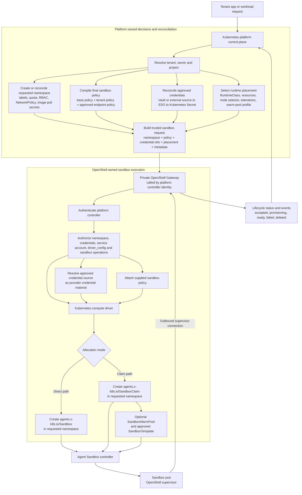

---
authors:
  - "@rohancmr"
state: draft
links:
  - https://github.com/NVIDIA/OpenShell/issues/1678
  - https://github.com/NVIDIA/OpenShell/pull/1680
---

# RFC 0005 - Platform-Managed Kubernetes Sandboxes

## Summary

This RFC describes a platform-managed Kubernetes usage pattern for OpenShell.
An existing Kubernetes platform can own tenant onboarding, namespace creation,
quotas, network policy, secret synchronization, policy compilation, scheduling
and audit while delegating sandbox execution to OpenShell.

The central requirement is not simply that OpenShell accepts more Kubernetes
configuration. The central requirement is that OpenShell first has a
control-plane authentication and authorization model that can safely support a
trusted platform controller. Only after that controller is authenticated and
authorized should OpenShell provision a sandbox with platform-selected
Kubernetes properties, supplied sandbox policy, approved credential sources,
ownership metadata and lifecycle reporting.

The main requirements are:

- a clear OpenShell control-plane authentication and authorization model for
  trusted platform controllers, including sandbox ownership and operation
  permissions;
- support for platform-selected Kubernetes sandbox namespaces, separate from the
  OpenShell control-plane namespace;
- Kubernetes-specific sandbox configuration hooks aligned with the
  `driver_config` proposal in #1589;
- a credential-source model that can support Kubernetes Secrets as one backend
  for approved provider credential material;
- optional integration with Agent Sandbox resources such as `SandboxClaim` and
  `SandboxWarmPool`; and
- lifecycle/status events that platform schedulers, audit systems and cleanup
  controllers can consume.

## Motivation

Kubernetes platforms that host multiple customers and workloads often need to
run AI-agent tool execution, generated code, MCP clients, model clients and
workflow-specific automation in secure, isolated sandbox environments. The
platform can own the enterprise control-plane responsibilities:

- tenant and project onboarding;
- namespace creation and lifecycle;
- namespace labels, quotas, `LimitRange` and `NetworkPolicy` objects;
- policy-pack selection and policy compilation;
- Vault/External Secrets Operator-backed Kubernetes Secret creation;
- scheduling, quota and audit; and
- cleanup of short-lived execution environments.

OpenShell is a good fit as the sandbox execution plane behind that platform.
The platform should decide tenant authorization, target namespace, final policy,
approved secrets and runtime placement profile. OpenShell should then
authenticate and authorize the platform controller, verify that the requested
namespace, credential sources, service account, driver configuration and
sandbox operations are allowed for that controller, and provision the sandbox
with the supplied final policy and approved credential-source references.

This is different from a direct sandbox-as-a-service model where end users call
OpenShell and do not know which control plane runs their sandboxes. In the
platform-managed model, the direct OpenShell caller is a trusted platform
controller. End-user authorization can remain mediated by the platform, while
OpenShell still needs to authenticate and authorize the platform controller and
protect OpenShell sandbox operations.

Today, the required integration and authorization hooks are not all available:

- The Kubernetes driver is configured with one sandbox namespace and creates
  Agent Sandbox `Sandbox` resources in that configured namespace. A single
  sandbox namespace is not a sufficient multi-tenant boundary because all
  customer sandboxes share the same namespace-level quota, RBAC/service account
  surface, NetworkPolicy scope, image pull secret surface, labels, cleanup
  lifecycle and blast-radius domain. Platform-managed tenants need separate
  namespaces so each customer or workload class can have its own quota,
  default-deny policy, approved ingress/egress, service accounts, labels,
  audit metadata and cleanup lifecycle.
- The sandbox create path does not expose a trusted platform-selected target
  namespace.
- OpenShell provider credentials are stored in OpenShell provider records;
  provider/provider-v2 attachment does not accept Kubernetes `Secret`
  references as the credential source.
- The Kubernetes driver does not expose `SandboxClaim` and `SandboxWarmPool` as
  the platform allocation path for warm pools or template-backed placement.
- OpenShell control-plane authorization does not yet describe how a platform
  controller would be authenticated and scoped to specific namespaces, Secret
  references, service accounts, Kubernetes driver configuration, sandbox
  ownership and sandbox operations.

Without these hooks, a Kubernetes platform would need workarounds such as one
OpenShell Gateway per tenant, storing customer credentials in OpenShell provider
records instead of Kubernetes Secrets, or using a shared sandbox namespace.
Those options are harder to operate and weaker as a multi-tenant isolation
model.

## Non-goals

- Making OpenShell the full multi-tenant Kubernetes platform. The platform owns
  tenant onboarding, namespace creation, quota, RBAC, NetworkPolicy, external
  secret synchronization, policy compilation, audit and cleanup.
- Defining the direct sandbox-as-a-service user experience. This draft focuses
  on an existing Kubernetes platform delegating sandbox execution to OpenShell.
- Letting untrusted callers choose arbitrary namespaces or Kubernetes Secrets.
  This draft assumes an authenticated and authorized platform-controller
  identity calls OpenShell.
- Changing OpenShell policy semantics. The platform composes the final sandbox
  policy and passes it to OpenShell; policy compilation is outside this RFC.
- Finalizing Kubernetes Secret credential APIs, `SandboxWarmPool` ownership, or
  a higher-level OpenShell domain object above `Sandbox`. This draft captures
  the requirements and open questions so they can align with the broader
  OpenShell authorization, credential and driver configuration work.
- Requiring one OpenShell Gateway per tenant. Gateways may still be sharded by
  cluster, capacity, compliance domain or risk profile, but that should not be
  required solely to place sandboxes in different namespaces.

## Proposal

### Usage pattern

This RFC targets the platform-delegated usage pattern:

```text
tenant user or tenant service
  -> Kubernetes platform control plane
  -> OpenShell Gateway
  -> Kubernetes driver
  -> Agent Sandbox resources
  -> sandbox pod with OpenShell supervisor
```

In this model, OpenShell is not directly exposed as the tenant-facing
sandbox-as-a-service API. The Kubernetes platform remains the tenant-facing
control plane and mediates end-user authorization. OpenShell receives requests
from one or more trusted platform-controller identities and authorizes those
identities to create and operate sandboxes within configured scopes.

The direct sandbox-as-a-service model is related but separate. In that model,
OpenShell would need to authenticate and authorize end users directly. This RFC
does not attempt to define that full user-facing model.

### Authorization and trust model

The trust boundary must be explicit. A requested namespace, Secret reference,
service account or driver configuration value is not trusted by itself. It is
trusted only when requested by an authenticated and authorized OpenShell caller.

For the platform-managed Kubernetes model, the caller is a platform controller.
That controller should authenticate to OpenShell Gateway with a control-plane
identity, such as:

- a Kubernetes ServiceAccount/OIDC token with a gateway-specific audience;
- an mTLS client identity; or
- another configured gateway identity suitable for platform automation.

OpenShell then maps that authenticated caller to an authorization subject and
checks the requested operation against configured scopes. This authorization
step is what makes platform-selected Kubernetes fields safe. The gateway must
not trust a namespace, Secret reference, service account, warm-pool reference
or driver configuration value only because it is present in a request.

At minimum, the authorization model needs to decide whether the caller can:

- create a sandbox;
- request a specific Kubernetes namespace or namespace pattern;
- reference a specific credential source or Kubernetes Secret namespace;
- request a specific Kubernetes service account;
- provide specific Kubernetes `driver_config` fields;
- request direct `Sandbox` creation, `SandboxClaim` allocation or warm-pool
  selection;
- attach the supplied sandbox policy;
- connect to, stream logs from, execute against or delete the sandbox; and
- observe lifecycle/status events for the sandbox.

The Kubernetes platform authorization model and the OpenShell authorization
model are different but connected:

- Kubernetes authorization protects Kubernetes resources, namespaces, service
  accounts, quotas, NetworkPolicies and Secrets.
- OpenShell authorization protects OpenShell API operations, sandbox ownership,
  credential use, driver configuration, sandbox connection rights and sandbox
  lifecycle operations.

If OpenShell Gateway runs on Kubernetes, it may be possible to reuse some
Kubernetes authorization primitives, such as ServiceAccount identity, token
audiences, RBAC, SubjectAccessReview or namespace-scoped permissions. That
should be explored, but the OpenShell authorization decision still needs to be
explicit because OpenShell also runs outside Kubernetes and because OpenShell
API permissions are not the same as Kubernetes API permissions. For example,
Kubernetes RBAC may allow the gateway's own ServiceAccount to create a
`Sandbox` resource, while OpenShell still needs to decide whether the calling
platform-controller identity is allowed to request that namespace, attach that
credential source, connect to that sandbox, stream its logs or delete it.

In the platform-delegated model, the platform may be the only direct OpenShell
caller. End-user access can remain mediated by the platform. OpenShell should
still preserve tenant, owner, project, request and policy metadata so that
sandbox ownership and audit remain visible to OpenShell, Kubernetes and the
platform.

This means the identity models are mapped rather than identical:

- the platform authenticates and authorizes tenant users or tenant services;
- the platform controller authenticates to OpenShell as a control-plane caller;
- OpenShell authorizes that control-plane caller against OpenShell resource
  scopes and sandbox operations; and
- Kubernetes authorizes the gateway or driver identity to create the resulting
  Kubernetes resources.

The model should support both future usage patterns:

- direct sandbox-as-a-service, where OpenShell authorizes end users directly;
  and
- platform-delegated sandbox execution, where OpenShell authorizes trusted
  platform controllers and the platform mediates tenant users.

This RFC focuses on the second usage pattern, but it should not require a
separate or incompatible authorization model.

### Authorization requirements

Before platform-selected Kubernetes configuration is accepted, OpenShell needs
an authorization surface that can express the allowed scope of a
platform-controller identity.

The required authorization checks include:

- **create scope:** whether the caller can create a sandbox at all, and for
  which tenant, project, profile or environment metadata;
- **namespace scope:** which namespaces or namespace patterns the caller can
  target, and whether the OpenShell control-plane namespace is excluded from
  sandbox placement;
- **credential scope:** which credential sources, Kubernetes Secret namespaces,
  Secret names and Secret keys the caller can reference;
- **service account scope:** which Kubernetes service accounts can be requested
  for sandbox pods;
- **driver configuration scope:** which Kubernetes `driver_config` fields can
  be supplied by this caller, including `RuntimeClass`, resources, node
  selectors, tolerations, direct `Sandbox` creation, `SandboxClaim` allocation,
  template references and warm-pool references;
- **policy attachment scope:** whether the caller can attach a supplied final
  policy and how OpenShell records the policy identity or hash;
- **sandbox ownership scope:** which tenant, owner, project and request metadata
  must be attached to the sandbox; and
- **operation scope:** who can connect to the sandbox, stream logs, execute
  commands, read files, observe events, release the sandbox or delete it.

The concrete authorization implementation is left open. It may be an
OpenShell-native authorization policy, a Kubernetes-integrated authorization
adapter, or a combination of both. The important requirement is that these
checks happen in OpenShell before the Kubernetes driver acts on the requested
namespace, credential references, service account or driver configuration.

### Control-plane model

The Kubernetes platform performs onboarding and request validation before
calling OpenShell:

1. Create or reconcile the tenant namespace.
2. Apply namespace labels, `ResourceQuota`, `LimitRange`, RBAC, image pull
   secrets, runtime constraints and default-deny `NetworkPolicy`.
3. Compile the sandbox policy from platform base policy, tenant policy pack and
   approved endpoint policy.
4. Configure External Secrets Operator or an equivalent controller so Vault
   material syncs into approved Kubernetes Secrets in the OpenShell gateway
   namespace.
5. Select approved credential-source references for the requested access
   profile.
6. Select runtime placement: `RuntimeClass`, node selector, tolerations,
   resource requests/limits, device profile and optional warm pool.
7. Call OpenShell Gateway with an authenticated platform-controller identity,
   namespace, final policy, credential-source refs, metadata and placement.

OpenShell Gateway then:

1. Authenticates the platform-controller identity.
2. Authorizes the requested namespace, credential sources, service account,
   Kubernetes `driver_config`, allocation mode, sandbox policy attachment,
   ownership metadata and sandbox operations.
3. Resolves approved credential sources as provider credential material.
4. Provisions the sandbox in the requested namespace.
5. Uses `SandboxClaim` when requested, optionally targeting a `SandboxWarmPool`.
6. Propagates tenant, project, owner, policy hash, namespace, profile and
   request metadata to OpenShell and Kubernetes resources.
7. Emits lifecycle events for scheduling, readiness, policy load, credential
   load, failure and cleanup.



### Request shape

The exact API is intentionally left open while this RFC is in `draft`. The
review feedback points toward a split:

- Kubernetes-specific implementation fields should align with the
  `driver_config` proposal in #1589.
- Credential resolution should align with a broader credential-source or
  Credential proto/plugin model, with Kubernetes Secrets as one backend.
- Authorization, sandbox ownership and lifecycle events should remain
  OpenShell control-plane concerns, not Kubernetes driver-only settings.

The example below is illustrative. It shows the shape of information the
platform needs to pass, not a final protobuf or CLI contract.

The authorization decision for this request would be separate from the request
body. For example, before acting on the request, OpenShell would need to verify
that the authenticated platform-controller identity is allowed to create a
sandbox for `tenant: team-a`, use the requested namespace, reference the
credential source, request the Kubernetes service account and placement profile,
attach the supplied policy, and later connect to or delete the resulting
sandbox.

Example shape:

```yaml
tenant: team-a
owner: service:agent-backend
metadata:
  project: code-review
  request_id: req-abc123
  policy_hash: sha256:abc123
policy:
  compiledPolicyRef: platform-policy-team-a-git-read-sha256-abc123
credentialsFrom:
  - provider: git-readonly
    sourceRef:
      kind: KubernetesSecret
      namespace: openshell-system
      name: team-a-runtime-credentials
      key: git_token
driver_config:
  kubernetes:
    namespace: openshell-rce-team-a-job-abc123
    serviceAccountName: sandbox-runner
    runtimeClassName: gvisor
    nodeSelector:
      platform.example.com/node-pool: secure-rce
    tolerations:
      - key: platform.example.com/secure-rce
        operator: Exists
    resources:
      requests:
        cpu: "1"
        memory: 2Gi
      limits:
        cpu: "2"
        memory: 4Gi
    agentSandbox:
      allocation: SandboxClaim
      template: python-rce-base
      warmPool: rce-python-base
ttlSeconds: 1800
```

### Target namespace

The Kubernetes driver should support a platform-selected target namespace in
addition to its configured default namespace. This namespace should be treated
as Kubernetes driver configuration, likely through the `driver_config` mechanism
proposed in #1589.

When the requested namespace is omitted, the driver should keep existing
behavior and provision into the configured namespace. When the requested
namespace is present, OpenShell must first authorize the caller to use that
namespace. The driver can then use the authorized namespace for the Agent
Sandbox resource it creates.

OpenShell does not need to create the namespace in this RFC. The platform is
responsible for creating and reconciling the namespace before the sandbox
request.

This namespace override is a trusted control-plane field, not an end-user
field. In the platform-delegated model, tenant users do not call OpenShell and
choose namespaces directly. The platform resolves the tenant and namespace,
then OpenShell authorizes the platform-controller identity to use that
namespace before provisioning.

### Kubernetes Secret-backed provider credentials

Kubernetes Secrets are the expected Kubernetes-native source for approved
credential material in platform-managed deployments, especially when populated
by Vault, External Secrets Operator or another secret controller.

The open design question is where Secret-backed credentials attach in
OpenShell's data model. Kubernetes Secrets should be treated as one credential
source backend, not as a Kubernetes driver-only field. This should align with a
broader credential-source or Credential proto/plugin design.

This is not intended to pass raw secret values to the child process as plain
environment variables. The desired model is:

1. The platform creates or reconciles Kubernetes Secrets through ESO or another
   approved secret controller.
2. The platform passes approved credential-source references to OpenShell.
3. The gateway authorizes and resolves those references as provider credential
   material.
4. Existing OpenShell provider and supervisor credential handling injects or
   rewrites credentials at the controlled boundary.

Provider records remain useful for provider shape, endpoint metadata and policy
bundles. This RFC does not finalize whether Kubernetes Secret references attach
to provider records, provider v2 attachments, sandbox requests or a separate
credential-source abstraction.

### Agent Sandbox allocation

OpenShell already integrates with the Kubernetes SIG Apps Agent Sandbox project.
The current Kubernetes driver creates the same project's `Sandbox` CRD directly.
`SandboxClaim` and `SandboxWarmPool` are part of that Agent Sandbox CRD family
and are useful when the platform wants allocation semantics rather than direct
pod-style creation. The Kubernetes-specific selection of direct `Sandbox`,
`SandboxClaim`, template and warm-pool settings should align with the
Kubernetes `driver_config` surface rather than becoming generic OpenShell fields
unless later design work promotes some of these concepts into the portable
OpenShell data model.

`SandboxClaim` is useful because the platform request is an allocation request:

- select an approved `SandboxTemplate`;
- allocate an execution sandbox in the platform-selected namespace;
- attach metadata, TTL, runtime placement and policy hash;
- allow the Agent Sandbox controller to bind the claim to a matching sandbox.

`SandboxWarmPool` is useful because some profiles need lower start latency or
controlled placement:

- pre-warm images and base runtime for common profiles;
- keep capacity ready for interactive or high-throughput customers;
- scope warm capacity to a namespace, template, `RuntimeClass`, node selector
  and tolerations; and
- support tainted/secure nodes or device-capable nodes without creating one
  gateway per placement profile.

This RFC does not decide whether OpenShell creates and reconciles
`SandboxWarmPool` resources itself or references warm pools that the Kubernetes
platform pre-creates. It also does not treat warm pools as the only lifecycle
optimization. Checkpoint/restore and scale-to-zero semantics are related
lifecycle capabilities that should be considered with the broader
proxy-to-sandbox and sandbox lifecycle design.

### Metadata and lifecycle events

OpenShell should preserve platform-provided metadata on OpenShell sandbox state
and Kubernetes resources. At minimum, the metadata should support:

- tenant or customer identifier;
- project or application identifier;
- owner identity;
- request id;
- namespace;
- policy hash;
- access profile;
- runtime profile; and
- TTL or cleanup deadline.

The gateway should also expose lifecycle events or status transitions that make
it possible for a platform scheduler and cleanup controller to understand:

- request accepted;
- allocation started;
- Kubernetes resource created;
- supervisor connected;
- policy loaded;
- credentials resolved;
- sandbox ready;
- sandbox failed; and
- sandbox deleted.

## Implementation plan

Because this RFC is in `draft`, the implementation plan is intentionally
sequenced around design dependencies rather than final API changes.

1. Define the OpenShell control-plane authorization model needed for this
   pattern:
   - platform-controller caller identity;
   - how Kubernetes ServiceAccount/OIDC, mTLS or other identities map to
     OpenShell authorization subjects;
   - whether Kubernetes RBAC or SubjectAccessReview can be reused when the
     gateway runs on Kubernetes;
   - allowed namespace scopes;
   - allowed credential-source scopes;
   - allowed service accounts;
   - allowed Kubernetes `driver_config` fields;
   - allowed policy attachment behavior;
   - sandbox ownership and access rules; and
   - sandbox operation permissions for connect, logs, exec and delete.
2. Align Kubernetes-specific request fields with #1589 so namespace,
   `RuntimeClass`, service account, node placement, resources, direct
   `Sandbox` creation, `SandboxClaim`, template and warm-pool settings use the
   driver-owned configuration surface.
3. Define or reuse a credential-source / Credential proto plugin model so
   Kubernetes Secrets can be one backend for provider credential material.
4. Decide whether this RFC should include lifecycle/status events or whether
   event streaming should be tracked separately.
5. Decide whether OpenShell owns `SandboxWarmPool` creation/reconciliation or
   only references platform-created warm pools.
6. Update the Kubernetes driver once the authorization, driver configuration
   and credential-source contracts are agreed.
7. Add tests for authorization enforcement, backward-compatible default
   namespace behavior, requested namespace behavior, credential-source
   authorization, direct `Sandbox` creation and `SandboxClaim` creation.
8. Update documentation for platform-managed Kubernetes deployments.

Existing users that rely on a single configured namespace should not need to
change their configuration. The configured namespace should remain the default
when no authorized requested namespace is supplied.

## Risks

- The request surface can become too broad if platform-only Kubernetes controls
  are added before the OpenShell authorization model is ready. This can be
  mitigated by keeping the RFC in draft until authz requirements are explicit
  and by routing Kubernetes-specific fields through `driver_config`.
- Reusing Kubernetes RBAC alone may not be sufficient because Kubernetes API
  authorization and OpenShell API authorization protect different operations.
  This can be mitigated by treating Kubernetes RBAC as a possible input or
  adapter for OpenShell authorization rather than as a complete replacement for
  OpenShell sandbox ownership and operation checks.
- Namespace selection creates a larger security boundary. OpenShell must not
  trust namespace values only because they are present in a request. It must
  authenticate the caller and authorize the requested namespace scope.
- Secret reference handling can accidentally expand credential access if it is
  too broad. Secret-backed credentials need a credential-source authorization
  model and should preserve the existing supervisor-controlled credential
  injection model.
- Supporting both direct `Sandbox` and `SandboxClaim` creation adds driver
  complexity. The default path should remain direct `Sandbox` creation unless
  allocation mode requests a claim.

## Alternatives

### Make OpenShell the full multi-tenant platform

Rejected for this use case. Kubernetes platforms already own tenant onboarding,
identity, quota, namespace creation, external secret synchronization, audit and
cleanup. OpenShell should provide the sandbox execution API that the platform
drives.

### Deploy one OpenShell Gateway per tenant

Rejected as the default model. It can work for capacity or compliance sharding,
but it is operationally heavy and makes gateway lifecycle management harder.
The preferred model is one private gateway per environment or cluster, with
optional risk/capacity shards.

### Use one shared sandbox namespace

Rejected for high-risk and multi-customer use. Namespace boundaries are
important for quotas, NetworkPolicies, cleanup, service accounts, labels and
blast-radius control.

### Store tenant credentials as OpenShell provider records

Rejected as the primary production model. Kubernetes platforms commonly use
Vault, External Secrets Operator and Kubernetes Secrets as the credential source
of truth. OpenShell provider profiles remain useful for endpoint and credential
shape metadata, but credential material should be able to come from approved
Kubernetes Secret references.

### Continue direct `Sandbox` creation only

Rejected for pooled and template-backed allocation. `SandboxClaim` and
`SandboxWarmPool` are a better fit when the platform wants warm capacity, node
placement and customer-approved runtime profiles.

## Prior art

- Kubernetes namespaces, `ResourceQuota`, `LimitRange`, RBAC and
  `NetworkPolicy` are the standard primitives for tenant and workload
  boundaries in Kubernetes platforms.
- External Secrets Operator is commonly used to sync Vault or external secret
  material into Kubernetes Secrets that workloads and controllers can consume.
- Kubernetes SIG Apps Agent Sandbox provides the `Sandbox`, `SandboxClaim` and
  `SandboxWarmPool` resource model used by the OpenShell Kubernetes driver.
- OpenShell provider v2 already separates provider profile metadata from
  provider attachment. This draft explores how Kubernetes Secrets could become
  one backend for provider credential material in platform-managed deployments.
- OpenShell PR #1589 proposes a `driver_config` passthrough for driver-owned
  sandbox creation settings. Kubernetes-specific namespace, placement and Agent
  Sandbox allocation settings in this RFC should align with that model.

## Open questions

### OpenShell authorization model

What OpenShell authorization model is required before platform-managed
Kubernetes sandboxing can be safely enabled?

This matters because namespace selection, Secret references, service account
selection, driver configuration and sandbox operations are privileged actions.
The RFC needs to define how OpenShell authenticates a platform controller and
how it authorizes that identity to create, connect to, observe, execute against
or delete specific sandboxes.

The answer should cover both direct sandbox-as-a-service and platform-delegated
usage. In the platform-delegated case, the tenant user is authorized by the
platform, while OpenShell authorizes the platform-controller identity and the
operations that identity can perform.

### Kubernetes RBAC and OpenShell authorization

When OpenShell Gateway runs on Kubernetes, should OpenShell reuse Kubernetes
RBAC, SubjectAccessReview, ServiceAccount identities or token audiences for
some authorization decisions, or should it use a separate OpenShell-native
authorization policy?

This matters because Kubernetes already has mature resource authorization, but
OpenShell also needs to authorize OpenShell-specific operations such as sandbox
ownership, connect, logs, exec, credential use, policy attachment and lifecycle
events. The RFC should define which decisions can be delegated to Kubernetes
and which must remain OpenShell control-plane decisions.

### OpenShell domain object above `Sandbox`

Should OpenShell introduce a higher-level domain object above `Sandbox` to
represent tenant/session/workload intent before mapping to a concrete sandbox
allocation?

This matters because platform-managed deployments need tenant, owner, project,
policy, namespace and lifecycle metadata. Some of that metadata may belong on a
future OpenShell domain object instead of directly on `SandboxSpec`.

### Requested namespace and allocation API surface

Should the requested Kubernetes namespace and Agent Sandbox allocation settings
be portable `SandboxSpec` fields, Kubernetes driver-specific configuration, or
a split between the two?

This matters because tenant and owner metadata can apply across compute
drivers, while Kubernetes namespaces, `SandboxClaim` and `SandboxWarmPool` are
specific to the Kubernetes driver and the Agent Sandbox resource model. The
current direction is to align Kubernetes-specific fields with #1589
`driver_config`, but the exact split remains open.

### Kubernetes Secret reference attachment point

Where should Kubernetes Secret references be attached: provider records,
provider v2 attachments, sandbox requests, or a new credential-source
abstraction?

This matters because each attachment point has a different lifecycle. Provider
records are stable configuration, provider v2 attachments are provider/profile
bindings, sandbox requests are per-allocation inputs, and a separate
credential-source abstraction would make secret sourcing explicit. Kubernetes
Secrets are the expected Kubernetes-native backend in this deployment model; the
open question is how Secret-backed credentials should be represented in the
OpenShell credential data model.

### Gateway Secret namespace rules

What rules should the gateway enforce when resolving Kubernetes Secret
references for provider credentials?

This matters because the gateway needs a clear boundary for which Secret
namespaces, Secret names and keys can be read. The RFC needs to define whether
Secret references are limited to the gateway namespace, an allowlist of
namespaces, or another trust model.

### `SandboxClaim` default behavior

Should `SandboxClaim` become the default Kubernetes allocation path once
support exists, or should direct `Sandbox` creation remain the default with
`SandboxClaim` enabled only when requested?

This matters because direct `Sandbox` creation is the current Kubernetes driver
behavior. Changing the default allocation path could affect existing users,
while keeping it opt-in may require platform callers to choose the allocation
mode explicitly.

### `SandboxWarmPool` ownership

Should OpenShell create and reconcile `SandboxWarmPool` resources, or should it
reference warm pools that the Kubernetes platform creates and manages?

This matters because warm-pool ownership affects template lifecycle, capacity
management, placement policy and user experience. It also needs to be considered
alongside related lifecycle features such as checkpoint/restore and
scale-to-zero.

### Lifecycle event API boundary

Which lifecycle events should be part of the stable OpenShell API, and which
events should remain driver diagnostics?

This matters because platform schedulers, audit systems and cleanup controllers
need dependable lifecycle signals. At the same time, exposing too many
low-level driver events as public API can create compatibility commitments that
are hard to change later.

### Tenant and policy metadata representation

How should OpenShell represent policy hash, tenant, owner, namespace, request id
and runtime profile metadata across sandbox status, logs, audit records and
Kubernetes resources?

This matters because the platform needs to trace which tenant created a
sandbox, which policy was applied, which namespace was used and which request
created the workload. The RFC needs to decide which metadata belongs in
OpenShell state, Kubernetes labels, Kubernetes annotations, logs and audit
records.
