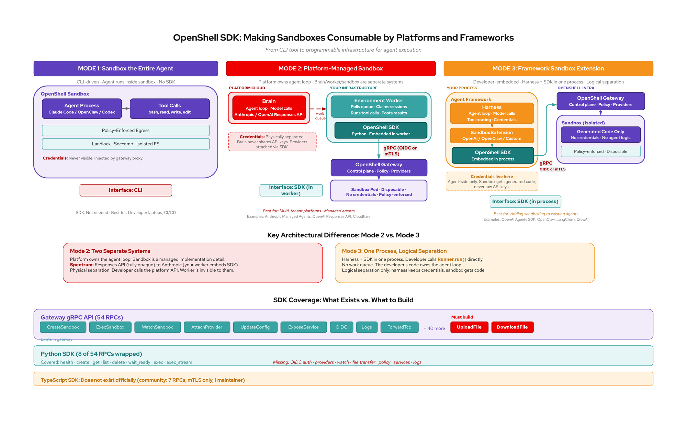
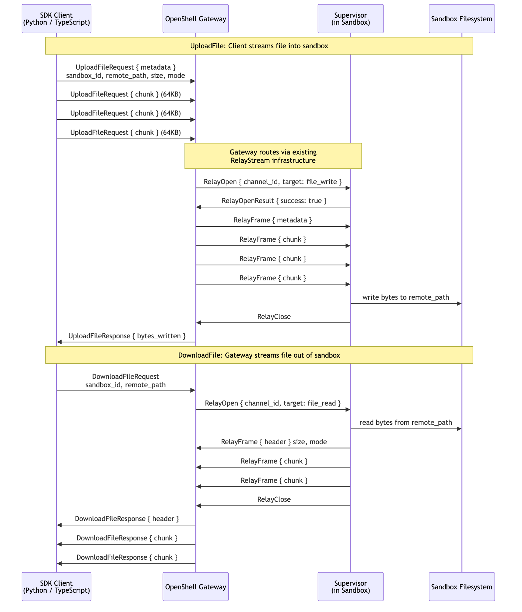
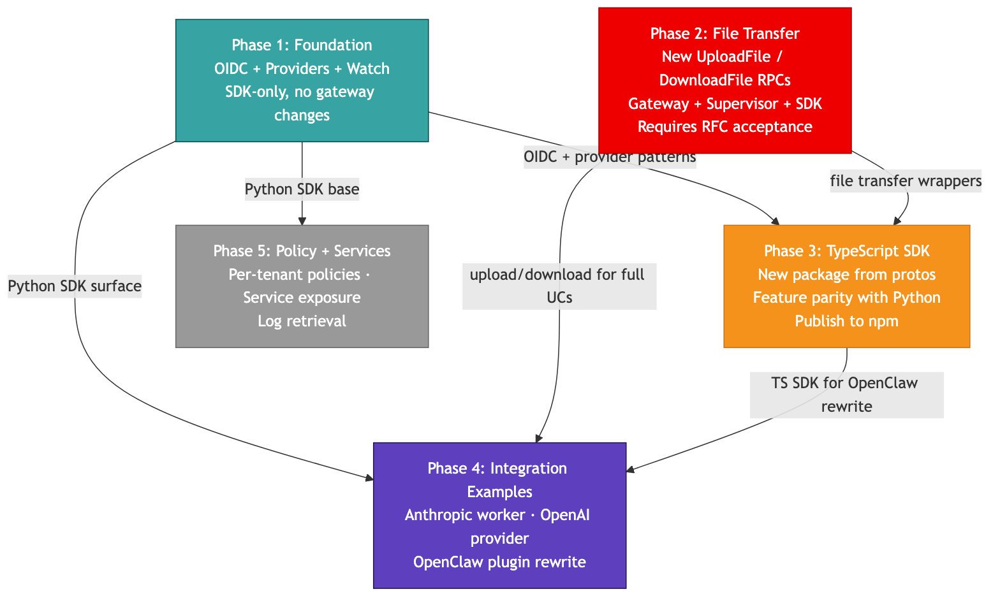
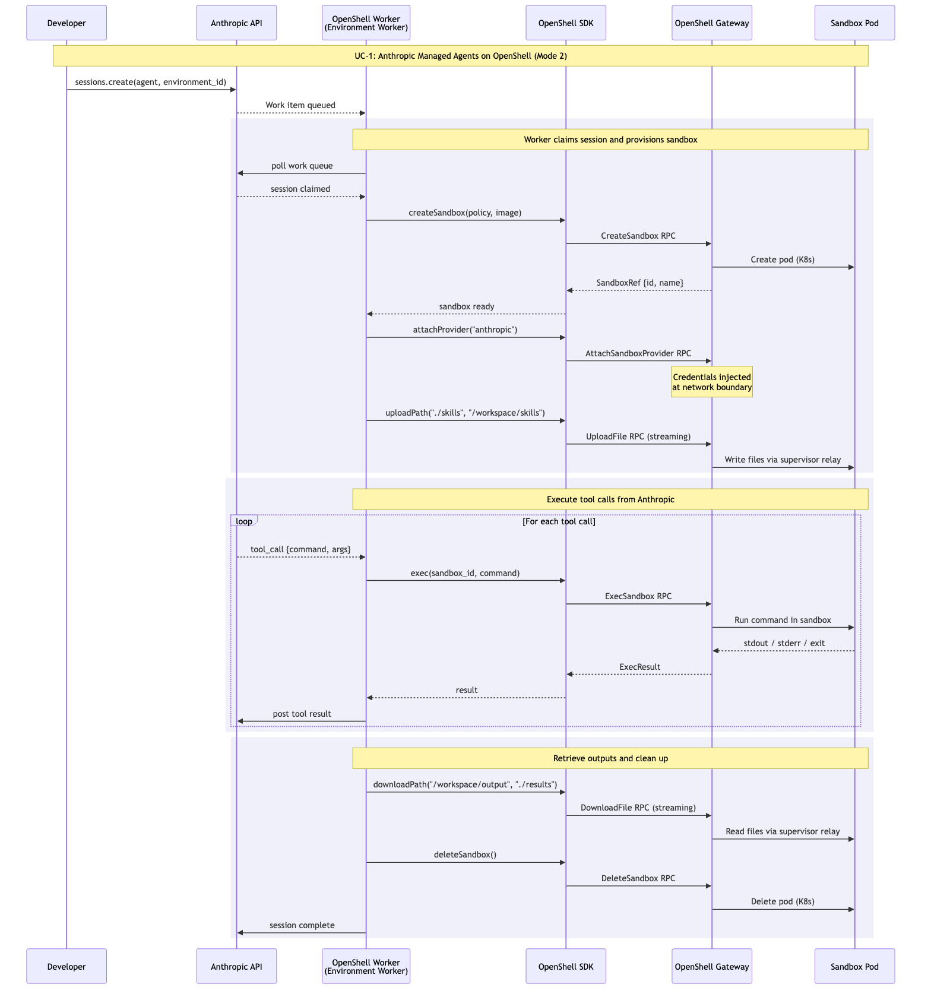

---
authors:
  - "@zanetworker"
state: draft
links:
  - "PR #1404 (per-sandbox auth, merged)"
  - "PR #1547 (Python SDK fixes, open)"
  - "PR #1117 (Python wheels, open)"
  - "PR #1511 (proxy egress RFC, open)"
---

# RFC 0006 - SDK Consumption Entrypoints and File Transfer

## Summary

Ship official Python and TypeScript SDKs that make OpenShell
consumable as programmable infrastructure for agent platforms and
frameworks. Add streaming UploadFile/DownloadFile gRPC RPCs to the
gateway so SDK consumers can move files in and out of sandboxes
without shelling out to the CLI. Support OIDC authentication in both
SDKs so cross-namespace K8s deployments work without copying mTLS
secrets.

## Motivation

Agent platforms are converging on a pattern: separate the agent's
brain (reasoning, orchestration) from its hands (code execution, tool
calls). Anthropic Managed Agents, OpenAI's Responses API and Agents
SDK, Cloudflare Sandbox, and OpenClaw all need a secure execution
layer where agent-generated code runs in isolation, credentials never
touch the execution environment, and network egress is
policy-enforced.

OpenShell is that execution layer. The gateway enforces
hardware-backed isolation (Landlock, seccomp, user namespaces), L4/L7
network policy with process identity, credential injection via proxy,
and OCSF audit logging. The gRPC API exposes 54 RPCs.

**The problem is that none of this is consumable programmatically.**

The only production client is the Rust CLI. The Python SDK wraps 8 of
54 RPCs and only supports mTLS authentication. No official TypeScript
SDK exists. No file transfer RPC exists. Every platform integration
must either shell out to the CLI binary or build a custom gRPC client
from scratch.

### Why programmatic consumption matters

Platforms and frameworks don't type commands; they make API calls. An
Anthropic worker polling a queue needs to create a sandbox, run a tool
call, and post results back, hundreds of times per hour, with no human
in the loop. An OpenAI Agents SDK adapter needs to implement
`session.write()` and `session.exec()` behind a SandboxClient
interface. A CI pipeline needs to spin up a sandbox, seed files, run
tests, and tear down, all from a script.

None of these can shell out to a CLI binary. They need a typed client
library that handles connection, auth, streaming, and error handling.

### What is blocked today

| Consumer | What they want | What blocks them |
|----------|---------------|-----------------|
| Anthropic worker | Create sandboxes, download skills, run tool calls, retrieve artifacts | No OIDC auth, no file transfer RPC |
| OpenAI Agents SDK adapter | Implement SandboxClient: materialize Manifest, exec, snapshot | No file transfer RPC (session.write() for LocalDir has no clean implementation) |
| OpenClaw plugin | Create sandboxes, sync workspace, exec commands | No TypeScript SDK (plugins are TS-only), currently shells out to CLI 5+ times per command |
| Multi-tenant platform | Per-tenant sandboxes with policies and credentials | No OIDC auth, no provider attach/detach in SDK |
| CI/CD pipeline | Sandboxed test runs with repo seeding and artifact retrieval | No file transfer RPC |

### Three sandbox modes

The SDK serves Mode 2 and Mode 3. Mode 1 stays CLI-driven.



**Mode 1: Sandbox the entire agent.** The agent process runs inside
the sandbox. Interface: CLI. No SDK needed.

**Mode 2: Platform-managed sandbox.** The platform (Anthropic, OpenAI)
owns the agent loop. A separate worker on your infrastructure embeds
the SDK and creates sandboxes. Brain and worker are physically
separate systems. Mode 2 is a spectrum:

| Variant | Who executes | OpenShell fits? |
|---------|-------------|-----------------|
| Responses API `container: auto` | OpenAI | No (closed) |
| Responses API local shell | You | Yes: execute via `client.exec()` |
| Anthropic Managed Agents | You (worker) | Yes: full SDK integration |

**Mode 3: Framework sandbox extension.** The developer's process owns
the agent loop. Harness + SDK live in one process. Logical separation.
Examples: OpenAI Agents SDK, OpenClaw, LangChain.

## Non-goals

- **SSH session management in the SDK.** CLI convenience for humans.
  SDKs use ExecSandbox.
- **Supervisor protocol exposure.** ConnectSupervisor/RelayStream are
  internal. SDK consumers never talk to the supervisor directly.
- **Provider CRUD in the SDK.** Providers are created by the platform
  engineer via CLI. SDK consumers attach existing providers, not
  create new ones.
- **Draft policy workflow in the SDK.** Operator approval UI concern,
  not a programmatic SDK concern.
- **Replacing the CLI.** The CLI remains the interface for Mode 1 and
  for platform engineers. The SDK serves programmatic consumers.

## Proposal

### 1. Extend the Python SDK

Add wrappers for existing gateway RPCs. No gateway changes needed.

| Method | RPC | Why |
|--------|-----|-----|
| OIDC auth | gRPC metadata interceptor | mTLS-only locks SDK to single namespace. Every K8s production deployment needs cross-namespace auth. |
| `attach_provider()` / `detach_provider()` / `list_providers()` | AttachSandboxProvider, DetachSandboxProvider, ListSandboxProviders | Credential separation is Mode 2's core security property. Without it, SDK consumers must bake credentials into sandbox images or pass them as env vars visible to agent code. |
| `watch()` | WatchSandbox | Polling at scale is untenable. Platforms need real-time status, logs, and error detection. |
| `upload_path()` / `download_path()` | UploadFile, DownloadFile (new RPCs, see below) | Every use case involving local files is blocked without this. |

Should-have (wrapping existing RPCs):

| Method | RPC | Why |
|--------|-----|-----|
| `update_policy()` / `get_policy()` | UpdateConfig, GetSandboxConfig | Multi-tenant per-sandbox policies |
| `expose_service()` / service CRUD | ExposeService, GetService, ListServices, DeleteService | Sandbox-hosted HTTP services |
| `get_logs()` | GetSandboxLogs | One-shot log retrieval for debugging |

### 2. Add streaming file transfer RPCs to the gateway

New proto definitions:

```protobuf
// Client streams file content into a sandbox.
rpc UploadFile(stream UploadFileRequest) returns (UploadFileResponse);

// Gateway streams file content out of a sandbox.
rpc DownloadFile(DownloadFileRequest) returns (stream DownloadFileResponse);

message UploadFileMetadata {
  string sandbox_id = 1;
  string remote_path = 2;
  uint64 size_bytes = 3;
  uint32 mode = 4;
  bool is_archive = 5;
}

message UploadFileRequest {
  oneof payload {
    UploadFileMetadata metadata = 1;
    bytes chunk = 2;
  }
}

message UploadFileResponse {
  uint64 bytes_written = 1;
}

message DownloadFileRequest {
  string sandbox_id = 1;
  string remote_path = 2;
  bool as_archive = 3;
}

message DownloadFileHeader {
  uint64 size_bytes = 1;
  uint32 mode = 2;
  bool is_archive = 3;
}

message DownloadFileResponse {
  oneof payload {
    DownloadFileHeader header = 1;
    bytes chunk = 2;
  }
}
```

**Why streaming, not tar-over-exec-stdin:**

- Streaming: 64KB chunks, constant memory regardless of file size
- No gRPC message size limits (4MB default)
- Progress reporting possible (count chunks)
- Permissions preserved via metadata header
- No dependency on `tar` being installed in the sandbox image



**Routing:** The gateway routes file streams to the supervisor via the
existing ConnectSupervisor/RelayStream infrastructure. The supervisor
adds a file read/write handler alongside its existing SSH and exec
relay handlers. No new transport layer needed.

**Why file transfer is required:**

The OpenAI Agents SDK illustrates this concretely. A developer writes:

```python
manifest = Manifest(entries={"repo": LocalDir(src="./myproject")})
```

This means "copy my local directory into the sandbox." The SDK calls
`session.write()` per file during materialization. Without an
UploadFile RPC, `session.write()` has no clean implementation. The
adapter either raises NotImplementedError or falls back to piping
each file through `exec(["cat", ">", path], stdin=bytes)`, which
breaks on binary content, has size limits, and loses permissions.

Every platform integration has the same pattern:

| Platform | Upload needed for | Download needed for |
|----------|------------------|---------------------|
| Anthropic | Skills to `/workspace/skills/` | Agent output artifacts |
| OpenAI Agents SDK | Manifest LocalDir entries | Sandbox outputs |
| OpenClaw (mirror mode) | Workspace before every command | Changes after every command |
| CI/CD | Repo checkout, test fixtures | Coverage reports, build artifacts |

### 3. Ship a TypeScript SDK

New package at `typescript/openshell/` (or standalone repo, see Open
Questions). Same surface as the Python SDK. Generated from the same
proto files using `buf`. Published to npm. Built with OIDC auth from
day one.

Primary consumer: OpenClaw. The current plugin shells out to the CLI
binary 5+ times per command cycle. The TypeScript SDK replaces those
subprocess calls with direct gRPC calls.

### 4. OIDC authentication in both SDKs

The gateway already validates JWTs (PR #935 merged). The CLI already
supports OIDC auth flows (PR #1535 merged). The SDK just needs to
send the token.

Implementation: a gRPC call credentials interceptor that attaches
`authorization: Bearer <token>` as metadata on every call. Roughly
20 lines per SDK.

```python
# mTLS (today): certs manually copied from another namespace
client = SandboxClient(endpoint=..., tls=TlsConfig(ca_path=..., cert_path=..., key_path=...))

# OIDC (proposed): one token from your existing IdP
client = SandboxClient(endpoint=..., auth=OidcAuth(token=os.environ["OIDC_TOKEN"]))
```

**Why this is required, not nice-to-have:** mTLS secrets live in the
gateway's namespace. Every SDK consumer in a different namespace must
manually copy the Secret and re-copy on every cert rotation. In a
multi-tenant platform, that's N tenant namespaces each needing a
copy. OIDC eliminates this entirely: the SDK sends a JWT, the gateway
validates against the IdP's public keys, no secrets to copy.

## Implementation plan

### Phase dependencies



Phase 1 and Phase 2 run in parallel. Phase 3 waits for both. Phase 4
proves everything works. Phase 5 is independent.

### Phase 1: Foundation (SDK-only, no gateway changes)

- OIDC gRPC interceptor in Python SDK
- `attach_provider()` / `detach_provider()` / `list_providers()`
- `watch()` wrapping WatchSandbox
- Tests

**Enables:** Remote-mode workloads (git clone inside sandbox, no file
transfer needed). OIDC auth for cross-namespace K8s. Credential
separation via provider attach.

**Related PRs:** #1404 (auth foundation, merged), #1547 (Python SDK
work, open), #1117 (Python wheels, open).

### Phase 2: File Transfer (gateway + supervisor + SDK, requires this RFC)

- UploadFile/DownloadFile proto definitions
- Gateway implementation (route to supervisor via relay)
- Supervisor file read/write handler
- `upload_path()` / `download_path()` in Python SDK
- Unit + integration tests



**Enables:** All file-dependent use cases. Anthropic skill downloads,
OpenAI Manifest materialization, OpenClaw mirror mode, CI/CD repo
seeding.

**Related PRs:** #1475 (relay infra, merged).

### Phase 3: TypeScript SDK

- Set up package with buf proto generation
- Core client (CRUD, exec, wait, health) with OIDC from day one
- Provider attach/detach, watch, file transfer
- Publish to npm
- Tests

**Enables:** OpenClaw plugin rewrite. Node.js framework integrations.

### Phase 4: Integration examples

- Anthropic self-hosted worker using Python SDK (Mode 2)
- OpenAI Agents SDK sandbox provider using Python SDK (Mode 3)
- OpenClaw plugin rewrite using TypeScript SDK (Mode 3)

**Enables:** Proof that it works end-to-end. Reference implementations
for other integrations.

### Phase 5: Policy + Services (independent, SDK-only)

- `update_policy()` / `get_policy()` in both SDKs
- `expose_service()` / service CRUD in both SDKs
- `get_logs()` in both SDKs

**Enables:** Multi-tenant per-sandbox policies. Sandbox-hosted HTTP
services. Log retrieval.

## Risks

**Proto stability.** Adding UploadFile/DownloadFile to the proto is a
permanent API commitment. If the design is wrong, we carry the cost.
Mitigation: the proto is deliberately minimal (metadata + chunks).
The `is_archive` flag provides the extensibility needed for directory
transfers without adding a complex directory protocol.

**Supervisor complexity.** Adding a file transfer handler to the
supervisor increases the attack surface inside the sandbox.
Mitigation: the handler writes to the sandbox filesystem using the
same privilege model as the exec relay. It does not grant new
capabilities; it provides a typed interface for an operation the CLI
already performs over SSH.

**TypeScript SDK maintenance.** A second SDK doubles the maintenance
surface. Mitigation: both SDKs are thin wrappers around generated
proto stubs. The Python SDK is ~600 lines. The TypeScript SDK would
be similar. The proto files are the source of truth; SDK updates are
mechanical when protos change.

**Community SDK fragmentation.** `moonshot-partners/openshell-node`
exists (1 contributor, MIT, 7 RPCs). Shipping an official TS SDK may
fragment the community. Mitigation: build in-repo for proto sync and
release alignment. Consider reaching out to the community author.

## Alternatives

### Do nothing

SDK consumers continue shelling out to the CLI binary. This works but
creates packaging dependencies (init containers, curl downloads),
performance overhead (5+ subprocess calls per command cycle), and
prevents clean integration with platform SDKs (Anthropic, OpenAI)
that expect typed client interfaces.

### Tar-over-exec-stdin for file transfer

Instead of new RPCs, use `exec(["tar", "xz", "-C", "/path"],
stdin=tarball)` for uploads and `exec(["tar", "cz", "/path"])` for
downloads. This works for small files but breaks on large transfers
(4MB default gRPC message size), provides no progress reporting, has
no resume on failure, loses permissions inconsistently, and requires
`tar` in the sandbox image.

### REST API alongside gRPC

Add an HTTP/REST API for file transfer instead of gRPC streaming.
This would be simpler for curl-based consumers but inconsistent with
the rest of the API (all gRPC). The existing gRPC gateway
infrastructure (relay, supervisor) would need a parallel HTTP path.

### Adopt community TypeScript SDK

Fork or bless `moonshot-partners/openshell-node` instead of building
in-repo. This avoids the new-package cost but introduces a dependency
on a single external maintainer with no release alignment to
OpenShell releases. Proto sync becomes manual.

## Prior art

**OpenAI Agents SDK:** SandboxClient interface with `session.write()`,
`session.exec()`, `session.read()`. Supports Docker, E2B, Modal,
Runloop, Vercel, Cloudflare, Blaxel, Daytona as providers. Each
implements the same interface backed by their own API. This is the
pattern our SDK adapter would follow.

**Anthropic Managed Agents:** EnvironmentWorker pattern. Worker polls
a queue, claims sessions, executes tool calls in a sandbox. The
self-hosted variant runs the worker on your infrastructure. This is
the pattern our Anthropic integration example would follow.

**E2B SDK:** Python and TypeScript SDKs for sandboxed code execution.
`Sandbox.upload_file()`, `Sandbox.download_file()`, `Sandbox.run()`.
The file transfer methods use streaming HTTP. Similar scope to what
we're proposing, different transport (HTTP vs gRPC).

**Modal SDK:** Python SDK for cloud-based sandboxed execution.
`modal.Sandbox.create()`, `.exec()`, `.terminate()`. File transfer
uses Modal's volume system rather than per-file upload RPCs.

## Open questions

1. **TypeScript SDK location.** Build in-repo at
   `typescript/openshell/` (proto sync, release alignment) or as a
   standalone repo (more flexibility, separate release cycle)?
   Recommendation: in-repo.

2. **File transfer archive format.** The proto uses `is_archive` with
   tar. Should this be tar, tar.gz, tar.zstd, or configurable?
   Recommendation: tar (uncompressed). gRPC already compresses at the
   transport layer when enabled.

3. **OIDC audience naming.** The gateway default is
   `server.oidc.audience = "openshell-cli"`. Now that the SDK is a
   first-class client, should this be renamed to `openshell-api` or
   `openshell-gateway`?

4. **Provider CRUD in SDK.** This RFC scopes the SDK to attach/detach
   (bind existing providers). Should full provider CRUD
   (create/update/delete) be in scope for platforms that want fully
   programmatic provider lifecycle?

5. **npm package name.** `@openshell/sdk`, `openshell`, or
   `openshell-sdk`? Should align with the Python package name
   (`openshell` on PyPI).
