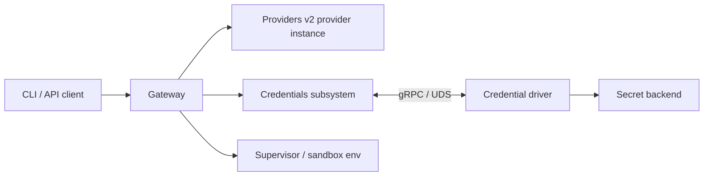

---
authors:
  - "@TaylorMutch"
state: draft
links:
  - rfc/0001-core-architecture/README.md
  - rfc/0003-gateway-configuration/README.md
---

# RFC 0007 - Credential Drivers

## Summary

This RFC proposes a credential driver interface for OpenShell Gateway. The
interface lets the gateway resolve Providers v2 provider-instance credentials
from gateway-owner controlled secret backends, such as macOS Keychain,
Kubernetes Secrets, and Vault/OpenBao, without requiring provider instances to
store plaintext secret values.

Credential drivers are modeled after the existing compute driver boundary:
the gateway owns OpenShell semantics, validation, provider mapping, and
delivery to sandboxes, while each credential driver owns backend-specific
lookup, authentication, and reference validation. This RFC scopes new behavior
to Providers v2; it does not extend the legacy provider v1 workflow.

## Motivation

RFC 0001 defines credentials as a gateway subsystem that delegates
platform-specific secret access to a pluggable driver. OpenShell already
implements a compute-driver boundary, but provider credentials today still live
directly in stored provider instances as string values.

Plaintext provider credentials are workable for local development and simple
installations, but they do not match production secret-management workflows.
Single-player OpenShell users on macOS already have a platform-native secret
store in Keychain, and a local gateway should be able to use it without copying
API keys into OpenShell persistence. Kubernetes operators commonly source
application credentials from Kubernetes Secrets, often populated by
external-secrets or another controller. Platform teams may instead require Vault
or OpenBao so policy, audit, rotation, and backend access are managed outside
OpenShell. In all of these deployments, the gateway owner decides how the
gateway may access secrets.

OpenShell needs a stable contract for this without coupling provider records to
one backend. A Providers v2 provider instance should be able to say "the API key
for this provider is at this backend reference" while the gateway asks the
referenced credential driver to resolve that reference at the point where a
sandbox or gateway workflow needs it. This preserves Providers v2 profile and
provider-instance semantics while allowing operators to keep credentials in
their existing secret systems.

Leaving the current design unchanged forces operators to copy secrets into
OpenShell persistence, bypassing their normal secret-management controls and
making rotation harder to reason about.

## Non-goals

- Removing inline provider credentials. They remain supported for local use and
  backwards compatibility in Providers v2 provider instances.
- Extending the legacy provider v1 workflow. New credential-reference UX,
  validation, and documentation should target Providers v2 only.
- Defining a general binary secret delivery system for certificates, database
  URLs, or arbitrary files. This RFC focuses on string provider credentials.
- Replacing provider token grants or gateway-minted credential refresh flows.
  Credential drivers provide another source for static or externally managed
  secret values.
- Hot-reloading credential driver configuration without restarting the gateway.
- Standardizing Linux Secret Service or Windows Credential Manager drivers in
  the first credential-driver API version. The macOS Keychain driver is
  included to cover single-player local environments.
- Allowing sandbox workloads to call secret backends directly. The gateway
  resolves credentials and delivers them through existing provider paths.

## Proposal

### Architecture

Add a gateway-owned credentials subsystem that resolves provider credential
references through one of the gateway's configured credential drivers.



The gateway remains responsible for:

- Providers v2 provider create/update validation;
- mapping provider credential keys to environment variables;
- duplicate credential key detection across attached providers;
- expiration filtering and provider environment snapshots;
- redaction in public API responses;
- ensuring resolved values are not persisted or logged.

The credential driver is responsible for:

- validating backend-specific reference fields;
- authenticating to the secret backend with gateway-owner configured identity;
- resolving a batch of references into secret values;
- returning backend errors with useful gRPC status codes.

### Provider credential references

Add a credential reference type to the stored provider-instance model and expose
it through Providers v2 provider create/update APIs. The protobuf type is still
named `Provider` today, but this RFC treats `credential_refs` as a Providers v2
provider-instance field. Provider profiles continue to declare expected
credentials, endpoints, policy, and refresh metadata; provider instances store
the concrete inline values or credential references for one gateway.

```proto
message CredentialReference {
  // Optional driver name. Empty means the gateway's default credential driver.
  // When set, it must match one of the gateway's enabled credential drivers.
  string driver = 1;

  // Backend object path or name, such as a Kubernetes Secret name or
  // Vault/OpenBao secret path. For macOS Keychain this is the Keychain
  // service name.
  string target = 2;

  // Key within the backend object. For macOS Keychain this is the Keychain
  // account name.
  string key = 3;

  // Driver-owned parameters, such as namespace, mount, engine version, or
  // secret version.
  map<string, string> parameters = 4;
}

message Provider {
  openshell.datamodel.v1.ObjectMeta metadata = 1;
  string type = 2;
  map<string, string> credentials = 3;
  map<string, string> config = 4;
  map<string, int64> credential_expires_at_ms = 5;
  map<string, CredentialReference> credential_refs = 6;
}
```

The provider credential key remains the environment variable key used by the
existing provider environment resolver. A provider instance may contain both
inline credentials and credential references, but the same credential key must
not appear in both maps.

Public provider responses continue to redact inline credential values. Reference
metadata may be returned because it is not a secret by itself, but the gateway
must document that target names and paths can still be sensitive operational
metadata.

### Providers v2 provider-instance examples

The exact CLI and file-import syntax can evolve with implementation, but the
Providers v2 provider-instance shape should make the distinction between inline
values and referenced credentials clear. These examples are not ProviderProfile
YAML. A Providers v2 profile would still separately declare `OPENAI_API_KEY` as
an expected credential.

An inline Providers v2 provider instance can continue to store current
credential values:

```yaml
type: openai
credentials:
  OPENAI_API_KEY: sk-example
config: {}
```

With a credential driver, the provider instance keeps the same credential key
but stores a backend reference instead of the secret value. A Kubernetes
Secrets-backed provider instance could look like this:

```yaml
type: openai
credential_refs:
  OPENAI_API_KEY:
    driver: kubernetes-secrets
    target: openai-provider
    key: api-key
    parameters:
      namespace: openshell
config: {}
```

An OpenBao or Vault-compatible provider instance could reference a KV path and
key:

```yaml
type: openai
credential_refs:
  OPENAI_API_KEY:
    driver: openbao
    target: providers/openai
    key: api_key
    parameters:
      mount: secret
config: {}
```

A local single-player macOS gateway could resolve the same provider-instance
credential from Keychain:

```yaml
type: openai
credential_refs:
  OPENAI_API_KEY:
    driver: macos-keychain
    target: openshell-openai
    key: OPENAI_API_KEY
config: {}
```

In each example, `OPENAI_API_KEY` remains the provider credential key that
OpenShell injects into the sandbox environment after resolution. The secret
source changes; the environment variable exposed to the sandbox does not.

Environment variables are not a credential driver in this proposal. They remain
two existing concepts:

- a local discovery/input source the CLI can use when creating inline Providers
  v2 provider-instance credentials; and
- the output shape OpenShell uses when delivering provider credentials to the
  sandbox process environment.

A future development-only `env` credential driver could be added if there is a
clear need to resolve credentials from the gateway process environment at
runtime. It is not included in the first credential-driver API because it does
not provide the same secret-management boundary as macOS Keychain, Kubernetes
Secrets, or OpenBao.

### Credential driver contract

Add `proto/credential_driver.proto` with package `openshell.credentials.v1`.
The service is intentionally small for the first credential-driver API:

```proto
service CredentialDriver {
  rpc GetCapabilities(GetCredentialDriverCapabilitiesRequest)
      returns (GetCredentialDriverCapabilitiesResponse);

  rpc ValidateCredentialReference(ValidateCredentialReferenceRequest)
      returns (ValidateCredentialReferenceResponse);

  rpc ResolveCredentials(ResolveCredentialsRequest)
      returns (ResolveCredentialsResponse);

  rpc ListCredentials(ListCredentialsRequest)
      returns (ListCredentialsResponse);
}
```

`GetCapabilities` reports driver name, driver version, backend kind, and
optional feature flags such as list support and returned expiry support.

`ValidateCredentialReference` checks that the reference is syntactically valid
for the driver and contains required backend-specific fields. It must not read
or return the secret value. The gateway calls this during Providers v2 provider
create/update so bad references fail before sandbox startup.

`ResolveCredentials` accepts a batch of references and returns string values,
correlated by request id, plus optional `expires_at_ms` metadata. A missing,
unauthorized, or invalid reference fails the request using normal gRPC status
codes:

| Code | Meaning |
|---|---|
| `INVALID_ARGUMENT` | The reference shape is invalid for the driver. |
| `NOT_FOUND` | The referenced secret, path, or key does not exist. |
| `PERMISSION_DENIED` | The gateway-owned driver identity is not allowed to read it. |
| `UNAVAILABLE` | The backend cannot be reached or is temporarily unavailable. |

`ListCredentials` is optional discovery support for future UX. Drivers that do
not support discovery return `UNIMPLEMENTED`.

### Driver loading

Credential drivers may be loaded in two forms:

- **In-tree drivers** are compiled into the gateway and initialized directly
  from their `[openshell.credential_drivers.<name>]` table. The first-party
  `test-static`, `macos-keychain`, `kubernetes-secrets`, and `openbao` drivers
  use this mode unless a deployment explicitly configures a remote replacement.
- **UDS drivers** are external processes that implement the same
  `openshell.credentials.v1.CredentialDriver` gRPC service over a Unix domain
  socket. The gateway wraps the socket connection in the same internal runtime
  interface it uses for in-tree drivers.

This mirrors the compute driver split: some first-party drivers can be linked
in-process for operational simplicity, while third-party or deployment-specific
drivers can be isolated behind a local gRPC/UDS boundary. A UDS driver may be
prestarted by the deployment, or the gateway may launch a configured command and
wait for its socket before calling `GetCapabilities`.

### Gateway resolution behavior

Providers v2 provider environment resolution changes from "read inline provider
instance credentials" to "read inline credentials and resolve referenced
credentials." The result is the same `ProviderEnvironment` shape used today, so
supervisor delivery and provider credential snapshots remain the integration
point.

The gateway may enable multiple credential drivers. For each
`CredentialReference`, the gateway selects the named `driver`, or uses
`default_credential_driver` when the field is empty. Validation and resolution
must fail if a reference names a driver that is not enabled. During resolution,
the gateway should group references by driver and call each driver's
`ResolveCredentials` RPC with only the references it owns.

Resolution is on demand. The gateway does not persist resolved values and does
not maintain a credential cache in the first credential-driver API. Drivers may
cache backend reads internally when safe for their backend and configuration.

If a Providers v2 provider instance attached to a sandbox contains an unresolved
credential reference, provider environment generation fails. The sandbox should
not receive a partial provider environment that silently omits a required
referenced credential.

### Configuration

Extend the gateway config file from RFC 0003 with credentials-driver selection
and driver-owned configuration.

```toml
[openshell.gateway]
credential_drivers = ["kubernetes-secrets", "openbao", "enterprise-secrets"]
default_credential_driver = "kubernetes-secrets"

[openshell.credential_drivers.kubernetes-secrets]
transport = "in_tree"
namespace = "openshell"

[openshell.credential_drivers.macos-keychain]
transport = "in_tree"
service_prefix = "openshell"

[openshell.credential_drivers.openbao]
transport = "in_tree"
address = "http://openbao.openbao.svc:8200"
mount = "secret"
auth_method = "kubernetes"
role = "openshell-gateway"
service_account_token_path = "/var/run/secrets/kubernetes.io/serviceaccount/token"

[openshell.credential_drivers.enterprise-secrets]
transport = "uds"
socket_path = "/run/openshell/credential-drivers/enterprise-secrets.sock"
command = "/usr/local/libexec/openshell-credential-driver-enterprise-secrets"
args = []
startup_timeout_secs = 10
```

`credential_drivers` lists the drivers the gateway starts and accepts in
provider references. `default_credential_driver` is used only when a
`CredentialReference.driver` field is empty, and it must name one enabled driver
when any enabled credential driver exists. `[openshell.credential_drivers.<name>]`
tables are driver-owned, similar to compute driver tables.

`transport = "in_tree"` selects a compiled-in driver implementation.
`transport = "uds"` selects a remote gRPC driver over `socket_path`; `command`,
`args`, and `startup_timeout_secs` are optional launch settings. When `command`
is omitted, the gateway connects to an already-running driver socket. Secrets
such as Vault/OpenBao tokens are not accepted as literal TOML fields; when token
auth is used for development, the config should point at a mounted token file.

### First-party drivers

Implement four first-party credential drivers:

| Driver | Purpose |
|---|---|
| `test-static` | Test-only driver backed by configured fixture values. Used for gateway integration tests without an external backend. |
| `macos-keychain` | Reads generic password items from the current macOS user's Keychain. Supports single-player local gateways without copying API keys into OpenShell persistence. |
| `kubernetes-secrets` | Reads keys from Kubernetes Secret objects using gateway-owner RBAC. Supports namespace defaults and optional per-reference namespace parameters when allowed by config. |
| `openbao` | Reads Vault/OpenBao-compatible KV secrets using gateway-owner auth. Supports OpenBao and Vault endpoints through the same contract. |

The macOS Keychain driver demonstrates that credential drivers are useful for
single-player environments, not only clustered deployments. The Kubernetes
driver is the simplest production path for Helm deployments and for clusters
that already use external-secrets. The OpenBao driver validates the
Vault/OpenBao contract and gives operators a backend with policy, audit, and
rotation outside Kubernetes Secret objects.

## Implementation plan

1. Add the protobuf and stored model changes. Generate Rust types, add
   validation for Providers v2 `credential_refs`, preserve inline provider
   instance compatibility, and keep public provider redaction behavior explicit.
2. Add the gateway credentials runtime. Load all configured credential drivers
   as either in-tree implementations or remote UDS clients, record the default
   driver, call `ValidateCredentialReference` during Providers v2 provider
   create/update by dispatching to the selected driver, and resolve references
   inside the existing provider environment path by grouping references by
   driver.
3. Add the `test-static` driver and focused gateway tests. Cover inline-only,
   ref-only, mixed providers, duplicate inline/reference keys, missing refs,
   expired driver-returned values, duplicate env keys across providers, and
   redaction.
4. Add the macOS Keychain driver. Cover reference validation, missing item
   behavior, access-denied behavior, and a macOS-only integration test using a
   temporary test Keychain or isolated test items.
5. Add the Kubernetes Secrets driver. Cover reference validation, namespace
   handling, missing secret/key behavior, RBAC denial mapping, and a focused
   Kubernetes e2e test that creates a real Secret and verifies sandbox provider
   injection.
6. Add the OpenBao driver. Support Kubernetes auth for in-cluster use and
   token-file auth for local/dev validation. Cover KV path/key resolution,
   permission failures, missing keys, and backend unavailability.
7. Add local Kubernetes validation through the existing helm dev environment:
   create the k3d cluster with `mise run helm:k3s:create`, deploy OpenShell
   with Skaffold/Helm, deploy OpenBao as a test add-on, seed a policy and
   secret, configure the gateway to use the OpenBao credential driver, and
   verify a sandbox receives a referenced provider credential.
8. Add follow-up e2e automation for the OpenBao-on-Kubernetes path after the
   interface and first driver implementation stabilize.
9. Update user-facing docs and references when implementation lands:
   `docs/reference/gateway-config.mdx`, provider management docs, Helm values,
   and relevant architecture docs.

## Risks

- **Secret exposure through logs or persistence.** Introducing a secret
  resolution path increases the number of code paths that touch credentials.
  Mitigation: resolved values must stay in memory only, public provider
  responses must remain redacted, and tests should assert that references are
  stored while resolved values are not.

- **Backend availability affects sandbox startup.** On-demand resolution means a
  Vault/OpenBao or Kubernetes API outage can block provider environment
  generation. Mitigation: surface clear errors, use driver-specific retry or
  caching only where safe, and avoid silent partial environments.

- **Reference metadata may be sensitive.** Secret names, paths, and namespaces
  can reveal operational details. Mitigation: do not treat references as secret
  values, but document that provider read access exposes this metadata.

- **Multiple secret systems add operational complexity.** Drivers introduce
  configuration, RBAC, policy, and support obligations. Mitigation: keep the
  first credential-driver API small, provide a test driver, and make macOS
  Keychain, Kubernetes Secrets, and OpenBao the initial concrete backends.

- **External UDS drivers add process-management failure modes.** A driver socket
  may be missing, a launched driver may exit before readiness, or a remote
  driver may implement an incompatible API. Mitigation: require a
  `GetCapabilities` startup handshake, fail gateway startup for enabled drivers
  that cannot become ready, and keep in-tree drivers available for first-party
  deployments that do not need process isolation.

- **macOS Keychain can prompt or deny access.** A local gateway may run in a
  terminal, launchd service, or other context where Keychain access prompts are
  surprising or unavailable. Mitigation: document expected Keychain item
  permissions, fail closed with `PERMISSION_DENIED`, and keep Keychain tests
  isolated from a user's normal login items.

- **Rotation semantics are easy to overpromise.** External secret systems may
  rotate values independently of OpenShell. Mitigation: the first
  credential-driver API resolves on demand and does not claim watch-based or
  push-based rotation. More advanced cache invalidation can be added later.

## Alternatives

### Keep plaintext Providers v2 provider-instance credentials only

This is the current design and is simplest for OpenShell itself. It does not
work well for deployments where secret storage, audit, and rotation are owned by
Kubernetes, Vault/OpenBao, or another platform service. It also forces operators
to copy values into OpenShell persistence.

### Store only opaque secret names by convention

The gateway could infer backend locations from provider names and credential
keys, such as `provider-name/OPENAI_API_KEY`. This minimizes provider API
changes but makes validation weak, hides backend-specific requirements, and
does not compose well with Vault/OpenBao mounts, namespaces, or versioned
secrets.

### Resolve secrets in the supervisor

The supervisor could receive references and call secret backends directly. This
would spread backend credentials into sandbox environments and move
gateway-owner access control into workloads. It also conflicts with the desired
boundary: the gateway owns provider credential resolution and delivery.

### Use Kubernetes Secrets as the only backend

Kubernetes Secrets are a strong first implementation because they match Helm
deployments and external-secrets workflows. Making them the only contract would
unnecessarily tie OpenShell credentials to Kubernetes and leave Vault/OpenBao
operators without a clean integration path.

### Treat local OS credential stores as follow-up only

This was the original narrower scope. It keeps the first implementation
cluster-focused, but it misses an important single-player story: a local macOS
gateway should be able to use the user's existing Keychain secrets. Including
macOS Keychain in the first credential-driver API proves the driver model works
for both local and clustered environments while leaving Linux Secret Service and
Windows Credential Manager for later drivers.

## Prior art

RFC 0001 already defines credentials as a gateway subsystem backed by a driver.
This RFC narrows that architectural direction into the concrete provider
credential use case.

OpenShell compute drivers provide the closest local model: the gateway owns
OpenShell lifecycle semantics and delegates platform-specific work to a driver
contract. Credential drivers follow the same split.

RFC 0003 defines driver-owned TOML tables. Credential drivers use the same
configuration pattern, but keep their tables separate from compute driver
configuration.

macOS Keychain is the platform-native secret store for local macOS users. It
provides a concrete single-player backend where the gateway resolves secrets
using the current user's OS-managed credential store.

Kubernetes Secrets plus external-secrets show a common production pattern:
applications read Kubernetes-native Secret objects while another controller
synchronizes those objects from a stronger external system.

Vault and OpenBao provide policy-controlled secret paths, audit logs, and
multiple authentication methods. The OpenBao-compatible driver uses that prior
art without making OpenShell implement a full secret-management system.

## Open questions

- What CLI and file-import UX should be added for creating Providers v2 provider
  instances with `credential_refs`? The protobuf and server behavior can land
  before the polished CLI workflow.
- Should drivers eventually support watch or lease-renewal APIs for rotation?
  The first credential-driver API intentionally resolves on demand and leaves
  cache invalidation to later work.
