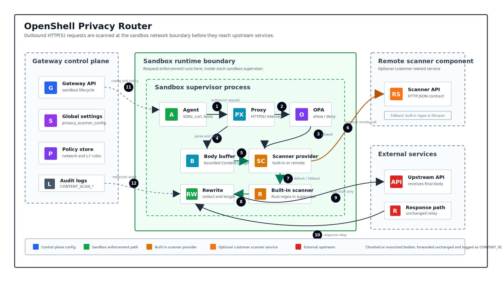
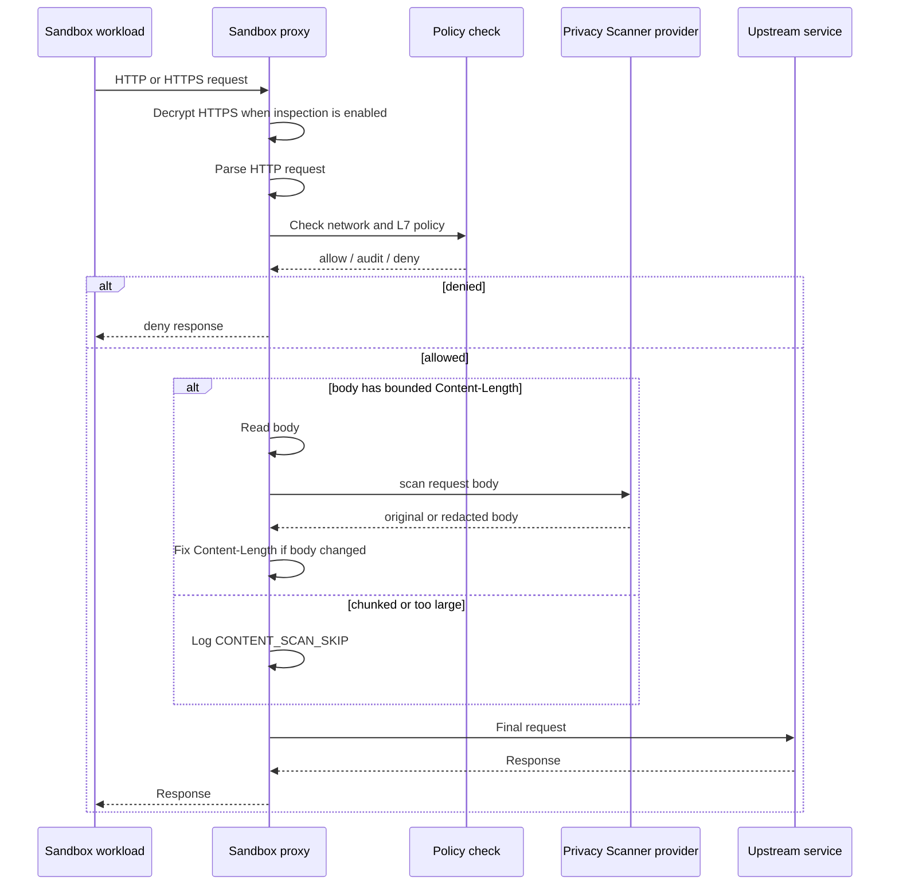

---
authors:
  - "@kirit93"
state: implemented
links: []
---

# RFC 0009 - Privacy Router

## Summary

Privacy Router redacts common secrets and personal data from outbound HTTP
request bodies before those requests leave an OpenShell sandbox.

When the sandbox proxy can read an outbound HTTP or HTTPS request, it sends the
request body through the configured Privacy Scanner provider. By default that is
the built-in Rust regex scanner. A deployment can also point OpenShell at a
customer-owned HTTP scanner service.

The built-in scanner checks the body for known patterns like API keys, tokens,
emails, phone numbers, SSNs, private keys, and credit cards. If it finds a
match, it replaces the value with a label such as `[OPENAI_API_KEY]` or
`[EMAIL]`, fixes the request length, and sends the request on to the upstream
service.

If the proxy cannot safely read the body, it logs that the scan was skipped and
lets the request continue unchanged.

## Motivation

Agents and developer tools often send prompts, logs, files, tool output, and API
payloads to external services. Those payloads can accidentally include sensitive
values.

OpenShell already controls how sandboxed processes reach the network. Privacy
Router uses that point of control to reduce accidental leaks without requiring
each app or tool to add its own redaction logic.

This is best-effort protection. It is not meant to catch every possible secret
or block every unsafe request. It is meant to catch common, well-known patterns
before they leave the sandbox.

## Non-goals

- Detect every possible kind of sensitive data.
- Use an AI model to detect personal data.
- Replace secrets with realistic fake values.
- Block requests just because a match was found.
- Decode chunked request bodies.
- Scan encrypted traffic that the proxy cannot inspect.
- Scan non-HTTP protocols.
- Parse every body format.

## Proposal

### Architecture



Privacy Router runs inside the sandbox supervisor.

| Component | Role |
| --- | --- |
| Gateway | Sends policy, credentials, routes, and session information to the sandbox. |
| Sandbox supervisor | Runs the sandbox proxy and controls outbound network traffic. |
| Sandbox proxy | Reads HTTP requests, checks policy, scans bounded request bodies, fixes headers, and forwards requests. |
| Privacy Scanner provider | Either the built-in Rust regex scanner or a configured remote HTTP scanner service. |
| Upstream service | Receives either the original body or the redacted body. |

### Request Flow



### Scanner Interface

The proxy calls one Rust provider entrypoint:

```rust
scan_body_for_request(context, content_type, raw).await -> ScanResult
```

The default provider calls the built-in scanner function:

```rust
scan_body(content_type: &str, raw: &[u8]) -> ScanResult
```

It returns:

- the body to send upstream
- whether anything was redacted
- the labels that matched
- the number of matches
- how long the scan took
- which scanner backend produced the result

If nothing matches, the proxy sends the original body.

If a remote scanner provider is configured, the supervisor sends a JSON request
to that service and uses the body returned by the service. If the remote scanner
times out, returns an error, or trips the circuit breaker, the supervisor uses
the configured fallback. The default fallback is the built-in regex scanner.

### Body Handling

Privacy Router only scans request bodies that have a known size.

| Body type | Behavior |
| --- | --- |
| `Content-Length` within the scan limit | Read, scan, redact if needed, fix headers, forward. |
| `Content-Length` above the scan limit | Log `CONTENT_SCAN_SKIP`, forward unchanged. |
| `Transfer-Encoding: chunked` | Log `CONTENT_SCAN_SKIP`, forward unchanged. |
| Empty body | Forward normally. |
| HTTP the proxy cannot parse | Use the existing passthrough path. |

For inspected HTTPS traffic, the proxy reads and scans the request before it
opens the upstream connection.

### Scan Limits

The default scan limit is 1 MiB per request body.

An endpoint can set `content_policy.max_scan_bytes` to use a different limit.
Privacy Router always redacts matches; there is no separate action mode.

### What Gets Redacted

The scanner checks for common secret and personal-data patterns, including:

- AWS access keys, secret keys, and session tokens
- OpenAI keys, including `sk-` and `sk-proj-`
- Anthropic keys
- GitHub tokens
- Slack tokens
- Hugging Face tokens
- GCP API keys and OAuth tokens
- Azure storage keys, SAS tokens, client secrets, and search keys
- private keys
- generic `api_key`, `secret`, `token`, and `password` assignments
- SSNs
- phone numbers
- email addresses
- credit cards that pass Luhn validation
- IPv4 addresses
- dates of birth
- basic street addresses

Operators can also add customer-specific regex patterns to the built-in scanner
with the `privacy_scan_custom_patterns` setting. These custom patterns are
compiled by the sandbox supervisor and run together with the built-in patterns.

If a customer needs scanner logic that is more complex than regexes, they can
run their own scanner service and configure OpenShell to use it as the active
provider.

Examples:

```text
sk-proj-...      -> [OPENAI_API_KEY]
user@example.com -> [EMAIL]
123-45-6789     -> [SSN]
```

### JSON Handling

If the body is JSON, Privacy Router parses it and only redacts string values.
It keeps the JSON structure, numbers, booleans, arrays, objects, and nulls.
It does not remove fields, rename keys, reorder arrays, or change value types.

If the JSON has no matches, the original bytes are kept. If JSON parsing fails,
the scanner treats the body as text.

Non-JSON bodies are scanned as text.

The payload shape is preserved for JSON requests. The upstream receives the
same API object shape, with matched string contents replaced by labels.

### Logging

When Privacy Router redacts a body, the supervisor logs `CONTENT_SCAN_REDACTED`
and emits an OCSF detection event with:

- host
- port
- match count
- scan time
- matched labels
- scanner backend

When Privacy Router skips a body because it is chunked or too large, the
supervisor logs `CONTENT_SCAN_SKIP`.

Matched secret values are not logged.

## Implementation Details

The implementation lives mainly in `openshell-sandbox`.

### Scanner module

The scanner provider code is implemented in
`crates/openshell-sandbox/src/l7/privacy_scan.rs`.

The proxy calls this provider entrypoint in the sandbox supervisor process:

```rust
scan_body_for_request(context, content_type, body).await
```

The provider then chooses one of two backends:

- `builtin_regex`: runs the local Rust regex scanner in the supervisor.
- `remote_http`: sends the body to a configured scanner service and uses the
  service response.

The built-in scanner has no service process and no network call:

```rust
scan_body(content_type, body)
```

It builds a list of regex matches, merges overlapping spans, replaces matches
with `[LABEL]` strings, and returns the replacement body plus scan metadata.

Credit card matches are checked with Luhn validation before redaction. This
reduces false positives for ordinary long numbers.

### Remote scanner provider

Deployments can configure a remote scanner service when the built-in regex
scanner is not enough.

Set the gateway startup config with `OPENSHELL_PRIVACY_SCANNER_CONFIG`:

```bash
export OPENSHELL_PRIVACY_SCANNER_CONFIG='{"backend":"remote_http","remote_http":{"url":"http://privacy-scanner.privacy.svc.cluster.local:8080/scan","timeout_ms":2000},"fallback":"builtin_regex"}'
```

With the Helm chart, use:

```bash
helm upgrade --install openshell deploy/helm/openshell \
  --set privacyScanner.enabled=true \
  --set privacyScanner.url=http://privacy-scanner.privacy.svc.cluster.local:8080/scan
```

The scanner URL must be reachable from sandbox supervisor pods. It does not
need to be reachable from the user laptop.

At startup, the gateway stores this config as the gateway-global
`privacy_scanner_config` setting. Sandbox supervisors receive it through the
normal settings path and apply it without needing a policy change.

The remote scanner receives JSON:

```json
{
  "version": 1,
  "content_type": "application/json",
  "method": "POST",
  "scheme": "https",
  "host": "api.example.com",
  "port": 443,
  "path": "/v1/chat/completions",
  "body_base64": "..."
}
```

The remote scanner returns JSON:

```json
{
  "redacted": true,
  "body_base64": "...",
  "matches": [
    { "label": "email", "count": 1 }
  ],
  "match_count": 1
}
```

`body_base64` is the exact body OpenShell should send upstream. If
`redacted` is false and `body_base64` is omitted, OpenShell sends the original
body.

The remote scanner owns its own scaling, logic, model calls, allowlists, and
data handling. OpenShell only handles when to call it, how long to wait, and
what to do if it fails.

Remote scanner calls use the configured timeout. The default is 2 seconds and
the maximum accepted config value is 30 seconds. After 5 failures in 30 seconds,
the supervisor opens a 30-second circuit breaker and skips remote calls during
that window. The default fallback is the built-in scanner. Operators can set
`"fallback":"fail_open"` if they want remote failures to forward the original
body instead.

### Custom regex patterns

Built-in regexes live in the scanner source code. They are part of the
`openshell-sandbox` binary.

Customer-specific regexes are supplied through the
`privacy_scan_custom_patterns` setting. The setting value is JSON:

```json
{
  "patterns": [
    {
      "label": "employee_id",
      "regex": "\\bEMP-[0-9]{6}\\b"
    },
    {
      "label": "internal_account",
      "json_path_regex": "customer\\.account_id$",
      "regex": "^ACCT-[0-9]{4}$",
      "content_types": ["application/json"]
    }
  ]
}
```

Each pattern has:

- `label`: the replacement label. `employee_id` becomes `[EMPLOYEE_ID]`.
- `regex`: the Rust regex to match.
- `case_insensitive`: optional boolean. Defaults to `false`.
- `content_types`: optional list such as `application/json` or `text/plain`.
  If omitted, the pattern applies to all scanned bodies.
- `json_path_regex`: optional regex for the JSON string path. If this is set,
  the pattern only applies to matching JSON string fields.

The supervisor validates and compiles custom regexes before using them. If the
config is invalid, the supervisor logs the error and keeps the last working
custom pattern set. Requests still continue to use the built-in scanner.

The gateway setting is a string setting so it can be loaded at deploy time from
a file, Helm value, or automation that writes the gateway-global setting before
customer sandboxes start.

### JSON bodies

For JSON bodies, the scanner parses the body with `serde_json`.

It walks the parsed JSON recursively:

- object keys are kept
- object values are scanned when they are strings
- array items are scanned when they are strings
- numbers, booleans, and nulls are kept unchanged

If at least one JSON string value changes, the JSON is serialized again and the
new bytes are sent upstream. If there are no matches, the original bytes are
kept exactly as they were.

The scanner only changes JSON string contents. It does not change the shape of
the request payload. This means an inference request still has the same fields,
arrays, booleans, numbers, and nulls after scanning. For example, a
`messages[0].content` string may change from `email alice@example.com` to
`email [EMAIL]`, but the `messages` array and `content` field remain in place.

### Proxy path

The proxy calls the scanner after a request is allowed by policy and before the
request is sent upstream.

The key code path is in `crates/openshell-sandbox/src/l7/relay.rs`:

1. Parse the HTTP request.
2. Check the network and L7 policy.
3. If the request has a bounded `Content-Length`, read the body into memory up
   to the scan limit.
4. Call `privacy_scan::scan_body_for_request`.
5. If the body changed, replace the body and patch `Content-Length`.
6. Send the final request upstream.

The same body-buffering helper is used for normal L7 REST traffic and the
passthrough HTTP(S) path that still has parseable request bodies.

### Limits and fail-open behavior

The default scan limit is 1 MiB. Endpoints can override it with
`content_policy.max_scan_bytes`.

The scanner only runs on request bodies with a known `Content-Length`. Chunked
bodies and bodies over the scan limit are forwarded unchanged and logged as
skipped.

If the scanner cannot parse JSON, it treats the body as text. If anything else
goes wrong in the scan path, the request should continue rather than being
blocked.

### Lightweight design

Privacy Router is part of the sandbox supervisor process.

The default scanner is local Rust code, so there is no extra service to deploy
and no network hop between the proxy and the scanner.

If a deployment configures a remote scanner provider, that service is outside
OpenShell. The customer owns that service, including scaling, dependencies, and
scanner logic.

### Validation

Run:

```bash
~/.cargo/bin/cargo test -p openshell-sandbox
~/.cargo/bin/cargo test -p openshell-core
~/.cargo/bin/cargo test -p openshell-server
~/.cargo/bin/cargo test -p openshell-cli
git diff --check
xmllint --noout rfc/0009-privacy-router/privacy-router-embedded-supervisor.svg
```

For scanner latency testing, run the release-mode load harness:

```bash
~/.cargo/bin/cargo run -p openshell-sandbox --example privacy_scan_load --release
```

## How to Test It

The easiest manual test is to send a JSON request to `https://httpbin.org/post`
from inside a sandbox. `httpbin` echoes the request body back, so it is easy to
see whether the upstream service received the original values or the redacted
values.

### 1. Deploy the branch

From the repo root:

```bash
cd /Users/kthadaka/Playground/openshell-dev/openshell
git branch --show-current
mise run cluster -- all
```

The branch should be `kirit93/privacy-router-alpha`.

Use the matching local CLI from the same checkout when testing a branch build:

```bash
./target/debug/openshell --version
```

If `./target/debug/openshell` is missing, build it first:

```bash
~/.cargo/bin/cargo build -p openshell-cli --features openshell-core/dev-settings
```

If `openshell --version` points to an older Homebrew or released CLI, it may not
match the gateway and supervisor built from this branch.

### 2. Create a policy for httpbin

Save this as `/tmp/privacy-router-httpbin.yaml`:

```yaml
version: 1

filesystem_policy:
  include_workdir: true
  read_only: [/usr, /lib, /proc, /dev/urandom, /app, /etc, /var/log]
  read_write: [/sandbox, /tmp, /dev/null]

landlock:
  compatibility: best_effort

process:
  run_as_user: sandbox
  run_as_group: sandbox

network_policies:
  httpbin:
    name: httpbin
    endpoints:
      - host: httpbin.org
        port: 443
        protocol: rest
        enforcement: enforce
        access: full
    binaries:
      - { path: /usr/bin/curl }
```

The important part is `protocol: rest`. That tells the sandbox proxy to inspect
HTTP requests instead of treating the connection as an opaque TCP stream.

`content_policy` is not required for this test. Bounded REST request bodies are
scanned by default.

### 3. Start the sandbox

```bash
./target/debug/openshell sandbox create \
  --name privacy-test \
  --keep \
  --no-auto-providers \
  --policy /tmp/privacy-router-httpbin.yaml \
  -- /bin/bash
```

### 4. Optional: add a custom enterprise pattern

Save this as `/tmp/privacy-custom-patterns.json`:

```json
{
  "patterns": [
    {
      "label": "employee_id",
      "regex": "\\bEMP-[0-9]{6}\\b",
      "content_types": ["application/json"]
    }
  ]
}
```

Set it as a gateway-global setting:

```bash
./target/debug/openshell settings set --global \
  --key privacy_scan_custom_patterns \
  --value "$(tr -d '\n' < /tmp/privacy-custom-patterns.json)"
```

For deterministic tests, set this before creating the sandbox. A running
sandbox can also pick up the setting through the normal settings poll loop.
Built-in patterns still run.

### 5. Send a request with secrets

Run this inside the sandbox:

```bash
curl --http1.1 -sS https://httpbin.org/post \
  -H 'Content-Type: application/json' \
  -d '{"email":"alice@example.com","openai_key":"sk-proj-abcdefghijklmnopqrstuvwxyz123456","ssn":"123-45-6789","phone":"555-123-4567","aws":"AKIA1234567890ABCDEF","employee":"EMP-123456"}'
```

Expected result: the `json` field in the `httpbin` response contains redacted
values. The `employee` field is only redacted if the custom pattern from step 4
was configured.

```json
{
  "email": "[EMAIL]",
  "openai_key": "[OPENAI_API_KEY]",
  "ssn": "[SSN]",
  "phone": "[PHONE_NUMBER]",
  "aws": "[AWS_ACCESS_KEY_ID]",
  "employee": "[EMPLOYEE_ID]"
}
```

The exact response has other `httpbin` fields too. The important part is that
the echoed request body contains labels, not the original sensitive values.

### 6. Check the logs

From another terminal:

```bash
./target/debug/openshell logs privacy-test --source sandbox --since 5m | grep CONTENT_SCAN
```

Expected redaction log:

```text
CONTENT_SCAN_REDACTED 5 matches in 1.2ms [httpbin.org:443 backend:builtin_regex labels:EMAIL, OPENAI_API_KEY, SSN, PHONE_NUMBER, AWS_ACCESS_KEY_ID]
```

The exact time and match count can vary. If the custom employee pattern is
configured, the log should also include `EMPLOYEE_ID`. The log should include
labels and counts, but it should not include the original secret values.

If no line appears, run the request again and tail the logs at the same time:

```bash
./target/debug/openshell logs privacy-test --source sandbox --tail | grep CONTENT_SCAN
```

The gateway keeps a bounded recent log buffer, so old scan lines may roll out of
the buffer.

### 6a. Optional: test a remote scanner provider

To test the provider/plugin path, run a tiny scanner service inside the cluster
or somewhere reachable from sandbox pods. The service should accept the remote
scanner JSON contract and return a redacted `body_base64`.

Then deploy the gateway with:

```bash
helm upgrade --install openshell deploy/helm/openshell \
  --set privacyScanner.enabled=true \
  --set privacyScanner.url=http://privacy-scanner.privacy.svc.cluster.local:8080/scan
```

Create a new sandbox after the gateway restarts. Send the same `httpbin`
request. The upstream echo should show whatever body the remote scanner
returned. The sandbox log should include:

```text
CONTENT_SCAN_REDACTED ... backend:remote_http ...
```

If the remote scanner is down, the log should contain a warning from the
supervisor and redaction should fall back to the built-in scanner by default.

### 7. Test a clean body

Run this inside the sandbox:

```bash
curl --http1.1 -sS https://httpbin.org/post \
  -H 'Content-Type: application/json' \
  -d '{"message":"hello"}'
```

Expected result: `httpbin` echoes the body unchanged.

No `CONTENT_SCAN_REDACTED` log is expected for a no-match request.

### 8. Test skip behavior

If a body is larger than the scan limit, the proxy forwards it unchanged and
logs a skip event:

```text
CONTENT_SCAN_SKIP body size ... exceeds max_scan_bytes ...
```

If the request uses chunked transfer encoding, the proxy forwards it unchanged
and logs:

```text
CONTENT_SCAN_SKIP chunked transfer encoding not buffered
```

## Latency Analysis

Privacy Router adds latency in two places:

1. The proxy buffers bounded request bodies before it sends them upstream.
2. The scanner parses and redacts the buffered body.

This section measures the scanner itself. It does not include TLS, network
latency, upstream model latency, log export latency, or time spent waiting for a
slow client to finish uploading the request body.

These numbers are for the built-in regex scanner. A remote scanner provider
adds one HTTP call from the supervisor to the scanner service, plus whatever
work that service does.

The benchmark harness lives at
`crates/openshell-sandbox/examples/privacy_scan_load.rs`. It calls the same
`privacy_scan::scan_body` function used by the default built-in provider.

### Load test results

The following results came from a release build on a local macOS development
machine.

| Payload | Size | Mean | p95 | p99 |
| --- | ---: | ---: | ---: | ---: |
| Small text, no secrets | 47 B | 0.0024 ms | 0.0026 ms | 0.0028 ms |
| Small text, secrets | 84 B | 0.0033 ms | 0.0038 ms | 0.0042 ms |
| Small JSON, no secrets | 41 B | 0.0007 ms | 0.0008 ms | 0.0009 ms |
| Small JSON, secrets | 157 B | 0.0070 ms | 0.0077 ms | 0.0085 ms |
| Nested JSON, secrets | 201 B | 0.0110 ms | 0.0116 ms | 0.0143 ms |
| JSON, no secrets | 64 KiB | 1.61 ms | 1.70 ms | 1.88 ms |
| JSON, secrets | 64 KiB | 1.63 ms | 1.71 ms | 1.95 ms |
| JSON, no secrets | 256 KiB | 6.46 ms | 6.70 ms | 7.46 ms |
| JSON, secrets | 256 KiB | 6.60 ms | 6.92 ms | 7.55 ms |
| JSON, no secrets | 1 MiB | 25.52 ms | 26.67 ms | 29.62 ms |
| JSON, secrets | 1 MiB | 26.01 ms | 27.34 ms | 36.39 ms |
| Text, secrets | 1 MiB | 25.72 ms | 26.96 ms | 36.07 ms |

The first scan in a fresh process took about 51 ms because it initializes the
regex set. After that, steady-state throughput was about 38-39 MiB/s.

### What this means

For normal inference request bodies, scanner overhead is expected to be small.
Small JSON requests are well under 0.1 ms of scanner time. Larger prompt bodies
scale roughly linearly with body size:

- 64 KiB: about 1.6 ms
- 256 KiB: about 6.5 ms
- 1 MiB: about 26 ms

This is usually much smaller than network latency or model inference latency.
It can matter for high-QPS workloads, very large request bodies, or workloads
where one supervisor is scanning many large requests at once.

The scan limit bounds the worst case. Bodies above the configured limit are not
scanned and are logged with `CONTENT_SCAN_SKIP`.

## Compatibility

Most applications do not need to change. They still send requests through the
sandbox proxy and receive upstream responses as usual.

Things to know:

- Request bodies with matches are changed before they reach the upstream
  service.
- For JSON bodies, the payload shape is preserved. Only matched string contents
  are replaced.
- JSON bodies with matches may be written back with different whitespace or
  object order.
- Chunked and oversized bodies are not changed.
- `content_policy.max_scan_bytes` can change the scan limit for an endpoint.
- Customer regexes are additive. They do not replace the built-in scanner rules.
- A remote scanner provider controls its returned body. It should preserve the
  request shape expected by the upstream API.

## Risks

### False positives

The scanner may redact text that looks like a secret but is not actually
sensitive.

### False negatives

The scanner may miss sensitive data that does not match one of its patterns.

### More work in the supervisor

Scanning uses CPU in the supervisor process. The scan limit keeps the worst case
bounded, but a high request rate can still add overhead.

### JSON formatting changes

When JSON contains matches, Privacy Router parses and writes the JSON again. The
meaning stays the same, but formatting can change.

### Streaming uploads are not scanned

Chunked request bodies are forwarded unchanged in this version.

### Remote scanner service health

If a deployment uses a remote scanner, that service becomes part of the request
path. OpenShell limits the wait with a timeout and circuit breaker, then uses
the configured fallback.

## Alternatives

### Do nothing

OpenShell could leave redaction to each app or tool. That does not work well for
agent workflows because sensitive values can appear in logs, prompts, copied
text, and generated payloads without the app knowing.

### Make scanning opt-in per endpoint

This would reduce scanning work, but it would miss ordinary outbound requests
that accidentally contain sensitive data.

### Block requests on matches

Blocking may be useful later, but it needs policy controls, user feedback, and
exception handling. This RFC only redacts and forwards.

### Use an AI model for detection

An AI model could find things regex misses, but it would be heavier, slower,
harder to audit, and more expensive to run on every request body.

### Decode chunked bodies

This would scan more traffic, but it adds complexity around buffering, trailers,
and re-framing. This version keeps scanning limited to bodies with known sizes.

## Prior art

Many enterprise proxies inspect outbound traffic, redact sensitive values, and
write audit logs without logging the sensitive values themselves.

Privacy Router applies that idea at the OpenShell sandbox boundary, where the
supervisor already controls outbound network access.

## Open questions

- Should a future version scan chunked request bodies?
- Should form and multipart bodies get special parsing?
- Should a future policy mode block requests for some labels instead of only
  redacting them?
