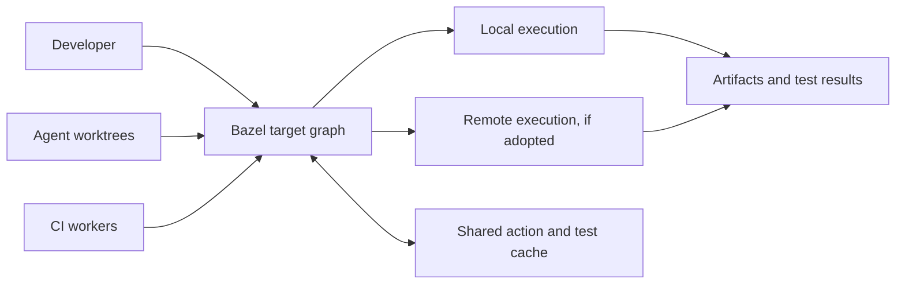

---
authors:
  - "@SDAChess"
state: draft
links:
  - https://github.com/NVIDIA/OpenShell/issues/2491
  - https://github.com/NVIDIA/OpenShell/issues/2204
  - https://github.com/NVIDIA/OpenShell/pull/2414
---

# RFC 0012 - Bazel as OpenShell's unified build system

## Summary

This RFC proposes that OpenShell evaluate and, if the RFC is accepted,
incrementally adopt Bazel as the common execution graph for builds, generated
code, tests, end-to-end tests, Python wheels, release artifacts, and the
corresponding CI jobs. Bazel is being considered because it combines
fine-grained local and remote caching, dependency-aware test execution,
cross-platform toolchains, support for heterogeneous repositories, and
practical hermeticity through declared inputs, pinned toolchains, and isolated
actions.

Bazel's complexity is the strongest argument against adoption, and the purpose
of this RFC is to decide whether its benefits justify that cost for OpenShell.
If accepted, the migration would keep the existing Cargo and Mise workflows
available only during a bounded transition while Bazel targets are added and
validated. The intended end state is Bazel as the sole supported OpenShell
interface for builds, generated code, tests, end-to-end tests, wheel assembly,
and release artifact construction.

Practical hermeticity here means making cached results trustworthy and builds
portable. It does not mean the complete environment modeling or bit-for-bit
reproducibility associated with Nix. External end-to-end tests that depend on
mutable infrastructure would remain explicitly non-cacheable.

## Motivation

OpenShell's development workflow has grown organically with the project.
Cargo builds and tests the Rust workspace, Maturin currently packages the Rust
CLI in the Python distribution, uv manages Python environments, Mise connects
project tasks, and GitHub Actions contains platform-specific build and release
logic. Bash scripts provision end-to-end test environments, build VM assets,
prepare release artifacts, and bridge gaps between those tools. Each part is
useful, but together they do not form one dependency-aware graph.

As a result, related work is often described more than once: in a Mise task, a
shell script, and a CI job. Artifacts are passed through paths and environment
variables rather than declared as inputs. A developer cannot consistently ask
one system to build a release binary, place it in a wheel, run the relevant
tests, and reuse the same actions in CI. Issue
[#2204](https://github.com/NVIDIA/OpenShell/issues/2204) describes the resulting
differences between local and CI coverage.

Cargo remains the right package manager and native developer interface for
individual Rust crates. Its scope is not heterogeneous repository orchestration.
Arbitrary repository tasks must be expressed through `build.rs`, an `xtask`
crate, external tools, or another task runner. Cargo's local fingerprints also
do not provide a shared action and test-result cache across independent
worktrees, machines, and CI workers. The
[Cargo build cache](https://doc.rust-lang.org/stable/cargo/reference/build-cache.html)
is effective within its intended scope, but OpenShell now needs a graph that
also includes protobuf generation, Python packaging, native libraries, release
artifacts, and infrastructure-aware tests.

Cross-compilation exposes the same boundary. `cargo-zigbuild` is valuable for
using Zig as Cargo's linker and for selecting older glibc versions, but the
complete workflow still has to coordinate Rust target installation, Zig target
names, C and C++ dependencies, sysroots, build scripts, linker flags, generated
artifacts, and artifact verification. Its own
[documentation](https://github.com/rust-cross/cargo-zigbuild) describes target
and environment-specific requirements. OpenShell currently encodes part of
that coordination in CI and shell scripts, making it difficult to reproduce
and extend across platforms.

Compiler caching alone does not close this gap. `sccache` can reuse selected
Rust compiler outputs, but it is a compiler wrapper rather than a repository
build graph. It does not decide which tests, code-generation actions, link
steps, wheels, or release packages are reusable. Its
[Rust documentation](https://github.com/mozilla/sccache/blob/main/docs/Rust.md)
also describes important limitations around incremental compilation, crates
that invoke the linker, and procedural macros that access undeclared files.
This makes `sccache` useful as an optimization for the current Cargo workflow,
but insufficient as the shared caching model proposed here.

Upcoming native Windows support increases the cost of leaving orchestration as
it is. Many current tasks assume Bash, POSIX utilities, and Unix path and
process behavior. Maintaining equivalent PowerShell scripts would duplicate
logic without making the underlying inputs and outputs more explicit. A common
cross-platform graph should let Linux, macOS, and Windows select different
toolchains and execution platforms while retaining the same target names and
dependency relationships.

The feedback rate is also becoming too slow for agentic development. Several
coding agents may work in separate worktrees and repeatedly build and test the
same unchanged dependencies. A shared content-addressed action and test cache
would allow one agent or CI worker to reuse verified work produced by another.
This changes cache sharing from a CI optimization into a requirement for
sustaining parallel agent development.

The build system should therefore meet the following requirements:

- Provide fast incremental builds and tests.
- Cache build actions and successful test results locally and across trusted
  developers, agents, and CI.
- Determine reuse from declared inputs, tools, configuration, and dependencies
  rather than from manually maintained cache keys.
- Model Rust, protobuf, Python wheel, release, and eligible end-to-end test
  workflows in one graph.
- Separate target platforms from execution platforms so cross-compilation does
  not depend on ad hoc host setup.
- Support native Windows as a first-class development and CI platform.
- Be hermetic enough for correct cache reuse without requiring every workflow
  to satisfy Nix-level reproducibility.
- Let local development and CI invoke the same targets.
- Permit an incremental migration with measurable parity before existing
  workflows are removed.

## Non-goals

- Achieving bit-for-bit reproducibility or modeling the complete operating
  system environment as Nix derivations.
- Replacing Cargo as the Rust package manifest, dependency ecosystem, or
  familiar crate-level development interface.
- Removing Mise, Cargo commands, or all shell scripts as part of the first
  implementation change.
- Treating mutable infrastructure tests as hermetic or reusing cached results
  from tests that access containers, clusters, GPUs, VMs, or external services.
- Selecting a remote cache or remote execution vendor in this RFC.
- Requiring every operational action, such as publishing a release or changing
  a live cluster, to run as a Bazel action.
- Delivering Windows product support by itself. This RFC covers the build and
  test foundation needed for that work.

## Proposal

### Decision and evaluation criteria

If accepted, this RFC selects Bazel as OpenShell's intended unified build
system and authorizes an incremental migration. Acceptance should be based on
the requirements, validation gates, and migration costs described here rather
than on the existence of a prototype alone.

The following criteria define what Bazel must demonstrate before it can replace
an existing workflow:

| Requirement | Expected behavior | Evidence required |
| --- | --- | --- |
| Fast feedback | Unchanged actions and tests are not re-executed | Timings and cache-hit data from representative local, agent, and CI runs |
| Shared caching | Trusted machines can reuse action and test outputs | A remote-cache trial across independent worktrees and CI workers |
| Test selection | A test reruns when its transitive inputs or relevant configuration change | Parity tests covering source, data, toolchain, environment, and prior-failure changes |
| Cross-platform support | The same target graph supports Linux, macOS, and Windows | Required build and unit-test targets pass on native workers for each platform |
| Cross-compilation | Target and execution platforms are explicit | Release artifacts build with the expected architecture, libc floor, and linkage |
| Unified orchestration | Generated code, binaries, wheels, and tests exchange declared artifacts | No migrated target discovers another tool's output directory or invokes a legacy wrapper |
| Practical hermeticity | Cache keys capture inputs that affect outputs | Clean-build and cross-machine comparisons plus deliberate invalidation tests |
| CI parity | CI invokes repository targets rather than reimplementing them | Documented local commands correspond directly to required CI jobs |

A failure to meet these criteria should lead to revising or rejecting the
proposal, not to preserving Bazel solely because migration work has begun.

### One target graph

Bazel would own deterministic actions whose results can be described as files,
executables, or test outcomes. This includes:

- Rust libraries, binaries, unit tests, and lint or compile checks;
- protobuf compilation and generated Rust and Python sources;
- native dependencies required by Rust crates;
- Python source validation and wheel assembly;
- release binaries and platform-specific packages;
- container images and VM inputs where practical;
- end-to-end test executables, fixtures, and lane orchestration; and
- aggregate test suites used by developers, agents, and CI.

Developers, agents, and CI would request labels from the same graph. Bazel
would compute actions from their declared sources, tools, target platform,
execution platform, configuration, and transitive dependencies. Its
[remote caching model](https://bazel.build/remote/caching) stores action results
and content-addressed outputs, allowing compatible invocations to share work
without sharing a mutable `target/` directory.

Bazel is not a general-purpose replacement for every operational tool.
Deterministic build, validation, and packaging work belongs in the graph.
Side-effecting operations such as authenticating to a cluster, publishing a
release, or manually operating a development environment may remain in
purpose-built tools or CI. This boundary does not retain Mise as a parallel
build system. During the bounded migration, a Mise task may delegate to a Bazel
target, but a Bazel target must not call Mise or search for outputs produced by
an undeclared Cargo command.

New orchestration should prefer typed Rust or Python executables over embedding
large Bash programs in `genrule` actions. Small platform-independent Starlark
rules are appropriate when they declare a reusable build operation. Repository
abstractions should remain narrow so BUILD files show the actual dependency
graph rather than hiding it behind a project-specific framework.

### Rust toolchains, dependencies, and cross-compilation

OpenShell would use [`rules_rs`](https://registry.bazel.build/modules/rules_rs)
for Rust targets. `rules_rs` provides hermetic Rust toolchains, Cargo dependency
import, and first-class Windows support. The prototype in
[#2414](https://github.com/NVIDIA/OpenShell/pull/2414) pins the Rust toolchain,
derives third-party crates from `Cargo.toml` and `Cargo.lock`, compiles the
workspace crates and protobuf definitions, and registers Bazel-managed LLVM
toolchains.

Cargo manifests and lockfiles would remain the dependency metadata used by
Cargo and the input to the Bazel crate universe during coexistence. First-party
BUILD targets would declare the narrower dependencies needed for Bazel's
analysis and caching. The project must add an automated drift check before
either graph becomes release-critical. The longer-term source-of-truth policy
is an open question because silently maintaining divergent Cargo and Bazel
graphs would be worse than the current system.

Bazel's [platform model](https://bazel.build/concepts/platforms) distinguishes
the platform that runs an action from the platform for which an artifact is
built. OpenShell would model operating system, CPU architecture, libc and
minimum glibc version, and relevant execution capabilities as constraints.
Toolchain resolution would select Rust, LLVM, protobuf, and native toolchains
from those constraints rather than from host-installed commands and shell
environment variables.

The current prototype demonstrates Linux x86-64 and AArch64 release targets,
macOS AArch64 targets, musl-linked CLI and sandbox binaries, a glibc floor for
the gateway, and Bazel definitions for native dependencies including Z3. It
does not yet demonstrate Windows. The next platform milestone would add Windows
triples and native Windows CI using `rules_rs`; OpenShell-specific native
dependencies and product behavior would still require validation even though
the Rust rule and toolchain layer supports Windows.

### Test execution and end-to-end lanes

Unit and component tests would be Bazel test targets with all binaries, data
files, generated sources, environment settings, and tools declared as inputs.
Under Bazel's
[test-result caching semantics](https://bazel.build/reference/command-line-reference#flag--cache_test_results),
a successful test result can be reused when its action key is unchanged. Tests
rerun when relevant transitive inputs or configuration change, when caching is
disabled, or when the previous result was a failure. Aggregate suites can give
developers and CI stable commands without requiring every test process to run
after every change.

End-to-end tests need a different caching policy but still benefit from the
same graph. OpenShell would expose lane-level targets for environments such as
Docker, Podman, Kubernetes, VM, and NVIDIA GPU. A lane would receive
Bazel-built binaries, test executables, manifests, and configuration through
runfiles. It would start one isolated environment, execute its scenarios,
collect diagnostics as test outputs, and clean up resources.

Infrastructure capabilities would be expressed as execution-platform
constraints, for example container runtime, rootful or rootless mode, cluster
availability, virtualization backend, and GPU availability. Strict CI lanes
would fail when a declared capability is unavailable. A separate local
convenience target could probe optional capabilities and report unsupported
lanes as skipped, but CI would never use that target.

Container engines, clusters, GPUs, VMs, and external services are mutable
resources. Tests that access them would be tagged external and configured not
to reuse a cached passing result. Their binaries and setup artifacts would
still be cacheable. This boundary provides practical hermeticity without
misrepresenting infrastructure tests as deterministic.

The existing behavioral assertions should be retained. Migration would replace
shell orchestration with a Bazel-built runner one lane at a time, beginning
with a Docker smoke lane. A script would be removed only after its replacement
passes equivalent local and CI coverage and produces sufficient diagnostics on
failure.

### Python wheels and release artifacts

The Python distribution currently uses Maturin because the wheel includes the
Rust `openshell` executable. The planned distribution will stop bundling the
CLI and become a Python-only wheel. Maturin is therefore transitional tooling,
not part of the proposed Bazel end state.

The Bazel graph would expose a wheel target that consumes Python sources,
generated protobuf stubs, and package metadata as declared inputs. It would
not consume a Rust binary, invoke Cargo, or discover files under `target/`.
Possible implementations include an upstream `rules_python` wheel rule or a
small OpenShell packaging rule.

The wheel would be platform-independent unless a future Python feature adds a
native extension. Tests would inspect its contents, validate its metadata,
install it in an isolated Python environment, import the package, and run the
Python test suite. Release workflows would consume the exact tested output
rather than rebuild it with separate CI-only commands.

Release binaries and packages would follow the same pattern. Target labels
would identify the product, operating system, architecture, and linkage
constraints. Verification actions would check architecture, static or dynamic
linkage, glibc symbol floors, required embedded assets, and package contents.
Publishing would remain a side-effecting CI operation that consumes these
declared artifacts; it would not be cached as a build action.

### Practical hermeticity and cache trust

Bazel actions should declare source files, generated files, tools, toolchains,
configuration, and environment values that influence their outputs. Build
actions should not read arbitrary workspace paths or access the network. The
project would pin Bazel and rule-set versions through Bzlmod and use
Bazel-managed toolchains where support is adequate.

This is intentionally less expansive than the
[Bazel ideal of hermeticity](https://bazel.build/concepts/hermeticity) and less
comprehensive than a Nix-modeled system. Some actions will need host services
or platform SDKs. Those exceptions must be visible through tags, execution
requirements, or platform constraints and must not publish reusable results
when undeclared mutable state can affect them.

A shared cache also creates a trust boundary. Write access should be limited to
trusted CI and authenticated developers or agents. Pull-request jobs from
untrusted forks should not be able to populate entries later consumed by
trusted release jobs. Secrets must not be action inputs or cached outputs.
Cache namespaces, retention, authentication, auditability, and poisoning
resistance must be part of the remote-cache selection.

### Developer and agent experience

The main argument against Bazel is its inherent complexity. BUILD files,
Starlark, labels, configurations, platforms, toolchain resolution, and cache
diagnostics introduce concepts that contributors do not need for a Cargo-only
project. Bazel failures can be difficult to understand, and a poorly designed
macro layer can make the repository less approachable.

OpenShell's agent-first development model changes, but does not remove, that
tradeoff. Coding agents can handle repetitive BUILD declarations, query the
target graph, compare Cargo and Bazel dependencies, and interpret many
toolchain errors. The explicit dependency graph also gives agents structured
information that shell scripts and implicit output paths do not provide. We
therefore expect agents to reduce the routine maintenance cost enough to make
Bazel more accessible.

AI assistance is not a substitute for a comprehensible human workflow. The
repository must document common commands, keep project-specific rules small,
provide actionable errors, and require human review of generated build
changes. Contributors should be able to build and test common changes without
understanding the complete toolchain implementation.

The agent-specific benefit depends on a shared cache. Every worktree would use
its own Bazel output base while addressing the same authenticated remote cache.
Agents could build concurrently without sharing mutable local outputs, while
still reusing identical action results. CI would use the same cache protocol
with trust-aware read and write policies.

## Implementation plan

The migration is deliberately phased. Cargo, Mise, and the current CI jobs
remain available until the corresponding Bazel targets meet their validation
gate.

### Phase 1: Validate the Rust reference graph

- Land the minimum Bazel and Bzlmod configuration, `rules_rs` toolchains,
  protobuf targets, Rust workspace targets, and native dependency annotations.
- Run Bazel build and unit-test jobs alongside the existing Cargo and Mise jobs
  on Linux x86-64, Linux AArch64, and macOS.
- Add dependency-drift checks between Cargo metadata and first-party BUILD
  declarations.
- Compare binaries, test coverage, diagnostics, and clean-build behavior.
- Keep Bazel jobs non-authoritative until parity is demonstrated.

The reference implementation in
[#2414](https://github.com/NVIDIA/OpenShell/pull/2414) is evidence for this
phase, not approval of the full migration.

### Phase 2: Prove native Windows and cross-compilation

- Add Windows Rust target triples, execution platforms, and native Windows CI
  workers through `rules_rs`.
- Build and run the supported Rust unit-test subset on Windows.
- Complete Linux and macOS release target validation for architecture, libc,
  glibc floor, and linkage.
- Record OpenShell-specific dependencies that are not yet portable instead of
  hiding them behind host scripts.

Windows is a gate for adoption as the unified system. Passing Linux and macOS
alone is not sufficient.

### Phase 3: Trial a shared remote cache

- Establish authenticated cache read and write policies for developers,
  agents, trusted CI, and untrusted pull requests.
- Measure clean, incremental, cross-worktree, and cross-machine cache hit rates
  and wall-clock times on representative changes.
- Verify invalidation for sources, generated files, toolchains, build settings,
  test data, and environment changes.
- Exclude secrets, publishing actions, and external tests from reusable cache
  results.
- Decide separately whether remote execution is justified; remote caching does
  not require it.

This phase must demonstrate a material improvement to agent and CI throughput.

### Phase 4: Migrate generated code, wheels, and release artifacts

- Make Rust and Python protobuf outputs Bazel-addressable inputs.
- Build the Python-only wheel from declared Python sources, generated stubs,
  and package metadata.
- Validate wheel metadata, contents, installation, imports, and the Python test
  suite, then remove Maturin after the CLI-bearing wheel is retired.
- Move release binary and package verification into Bazel actions.
- Change CI publishing jobs to consume previously built and tested artifacts.
- Retain Mise entry points as temporary compatibility wrappers during the
  bounded transition.

### Phase 5: Migrate end-to-end tests lane by lane

- Build the existing end-to-end test executables through Bazel.
- Introduce a Bazel-built environment runner, beginning with Docker smoke and
  then the Docker CPU lane.
- Add explicit execution capabilities and external/no-cache semantics.
- Migrate Python and MCP tests onto the same environment runner where useful.
- Add Podman, GPU, Kubernetes, OpenShift, and VM lanes independently.
- Delete each orchestration script only after its replacement has equivalent
  assertions, cleanup, isolation, and failure diagnostics.

### Phase 6: Simplify CI and complete the migration from Mise

- Replace duplicated CI implementation with calls to documented Bazel targets
  and suites.
- Confirm that required local and CI coverage is represented by the same graph,
  with differences limited to platform or hardware availability.
- Measure contributor experience and ongoing BUILD maintenance after the
  migration has operated in parallel for an agreed period.
- Deprecate Mise as a supported build and test workflow once the validation
  gates for migrated workflows pass.
- Remove compatibility tasks and remaining orchestration scripts in small,
  coverage-preserving changes.

## Risks

### Bazel complexity

Bazel has a substantial learning curve and becomes a long-term project
dependency. Toolchain transitions, configuration errors, and analysis failures
can be harder to debug than direct Cargo commands. AI coding agents reduce
repetitive work, but relying on them can also produce opaque BUILD abstractions
or fixes that few humans understand.

Mitigation requires documented common paths, small BUILD files, limited custom
Starlark, graph and lint tooling, actionable CI failures, and clear ownership.
If ordinary contributors cannot diagnose common failures after those measures,
the project should reconsider adoption.

### Dual-system drift

Incremental adoption means Cargo/Mise and Bazel will temporarily describe
overlapping workflows. Dependencies, features, generated files, and test
coverage can diverge, creating false confidence in one path.

Both paths should run during each migration phase, with automated metadata and
coverage comparisons where possible. The overlap should have explicit exit
criteria rather than becoming a permanent unowned compatibility layer.

### Rule and toolchain maintenance

OpenShell would depend on Bazel, `rules_rs`, other language and packaging rule
sets, Bzlmod metadata, and project-specific annotations for native crates.
Upgrades can expose incompatibilities, and less common native dependencies may
require custom work.

Versions should be pinned and upgraded deliberately. Project-specific patches
should be minimized, documented, and contributed upstream when practical. The
prototype's native dependency annotations should be reviewed as ongoing
maintenance commitments, not one-time scaffolding.

### Cache correctness and security

An undeclared input can cause a stale or incorrect cache hit. A compromised
writer can attempt to populate malicious outputs. Cached outputs could also
leak sensitive material if actions capture secrets.

The remote cache must enforce authentication and trust separation. Release
jobs should consume only entries produced under an acceptable trust policy.
Deliberate invalidation tests and periodic clean builds should detect missing
inputs. Secret-bearing and externally mutable actions must not be cacheable.

### End-to-end tests may fit imperfectly

Bazel is strongest for deterministic actions. OpenShell's end-to-end tests
manage mutable containers, networks, clusters, GPUs, and VMs. Modeling all of
that as conventional independent test targets could increase runtime, obscure
cleanup, or produce misleading cached results.

The proposal mitigates this by preserving environment sharing at the lane
level, using a purpose-built runner, declaring execution capabilities, and
disabling test-result caching. If this structure proves less reliable or less
diagnosable than the current harness, those lanes should remain outside Bazel
while still consuming Bazel-built artifacts.

### Performance gains require operational investment

Bazel does not make every build fast merely by being introduced. Initial graph
analysis, toolchain downloads, poorly shaped targets, low cache hit rates, or a
distant cache service can make builds slower. Remote execution adds further
cost and operational complexity.

Each phase therefore includes measurement. The project should not remove a
faster working path until Bazel meets representative latency and reliability
targets.

### Ecosystem and contributor lock-in

BUILD and Starlark definitions are Bazel-specific. Contributors familiar with
Cargo, Python, or shell tooling may be less comfortable changing the build.
Switching to another graph-based system later would require meaningful work.

Keeping Cargo metadata valid, avoiding unnecessary custom rules, and retaining
standard source layouts limits this cost, but does not eliminate it.

## Alternatives

### Continue with Cargo, Mise, Bash, and sccache

The lowest-disruption option is to keep extending the current system. Mise can
express task dependencies and gives the repository a convenient command
catalog. Cargo and sccache already provide useful incremental behavior for
Rust. Additional scripts could cover new platforms and CI workflows.

This avoids Bazel's learning curve but does not produce a content-addressed
graph across languages and artifact types. Cache keys, artifact paths, and
local-versus-CI parity would remain manually coordinated. Native Windows would
also require replacing or duplicating Bash behavior with PowerShell or
cross-platform executables. The maintenance pressure motivating this RFC would
continue to grow.

### Expand Cargo orchestration and `cargo-zigbuild`

OpenShell could add an `xtask` crate or more Rust helper binaries, use Cargo
metadata to select affected crates, and standardize cross-compilation around
`cargo-zigbuild`. This would keep the core workflow familiar and could replace
many Bash scripts with typed Rust.

It would still require OpenShell to build its own heterogeneous task graph,
remote action cache, test-result cache, platform model, and artifact protocol
for Python, protobuf, containers, and packaging. `cargo-zigbuild` improves
linking but does not model the full execution and target toolchain relationship.
This approach is credible if Bazel's complexity is rejected, but it commits the
project to maintaining orchestration infrastructure itself.

### Use Nix as the primary build system

Nix is strong at hermetic environments, pinned dependencies, reproducible
packages, and binary substitution. OpenShell has already explored it and may
continue using it where those properties are valuable.

It is a poor fit for the native cross-platform frontend required here.
Officially supported Nix platforms are
[Linux and macOS](https://releases.nixos.org/nix/nix-2.32.4/manual/installation/supported-platforms.html);
the documented Windows route is
[WSL](https://nixos.org/download/), not a native Windows toolchain and test
experience. Nix derivations can represent builds and tests, but achieving
fine-grained affected-test execution across OpenShell would require decomposing
the repository into a comparable custom graph. Nix solves a broader
reproducibility problem than OpenShell currently prioritizes while leaving the
native Windows requirement unresolved.

This RFC does not require removing Nix. It can remain a development-environment
or packaging tool where it provides independent value.

### Adopt Buck2

[Buck2](https://buck2.build/docs/) offers a similar dependency graph, local and
remote caching, and remote execution model. It is a serious alternative and
may have attractive performance and developer-experience characteristics. It
is open source and battle-tested on a very large amount of code inside Meta.
The public `buck2-prelude` is the same foundation used for those internal
builds, although Meta maintains substantial additional Starlark code on top.

Buck2's own
[external-consumer warning](https://github.com/facebook/buck2#warning--rough-terrain-lies-ahead)
states that it does not yet have a stable release tag, that Meta tracks the
latest committed `HEAD`, and that outside users should expect missing or
in-progress features, missing Buck1 toolchains, and rough edges. Its external
rule, tooling, documentation, and adopter ecosystem is also materially smaller
than Bazel's.

Bazel currently has the stronger fit because OpenShell has a working
`rules_rs` prototype, first-class Windows support at the selected Rust rule
layer, stable releases, a broad public rule ecosystem, and more directly
relevant examples. Choosing Buck2 would require accepting its current
external-consumer risks and revalidating Rust, Python packaging, native
dependencies, and platform support from the beginning. Reviewers should still
prefer Buck2 if it can demonstrate materially lower complexity while meeting
the same acceptance criteria.

### Adopt Pants

[Pants](https://www.pantsbuild.org/) provides ergonomic dependency inference,
caching, and monorepo workflows for several languages. Its
[Rust support](https://www.pantsbuild.org/stable/docs/rust) is experimental,
which makes it a higher-risk foundation for a Rust-heavy, native,
cross-platform repository. It also does not have the existing OpenShell
reference implementation available to Bazel.

### Keep CI as the integration layer

GitHub Actions could remain the place where language-specific tools are joined
together, with more reusable workflows and carefully managed caches. This is
appropriate for side effects and platform allocation.

It does not give developers and agents the same local graph, and workflow cache
keys still have to approximate the dependencies that a build system analyzes
directly. CI should schedule and publish work, not be the only executable
description of how artifacts are built and tested.

## Prior art

Public adoption is evidence that Bazel can support repositories with similar
properties, not proof that it is the correct choice for OpenShell:

- [OpenAI Codex](https://github.com/openai/codex) is a large Rust application
  that uses Bazel and runs Bazel jobs on Windows. It is particularly relevant
  to the combination of Rust, cross-platform distribution, and agent-driven
  development.
- [Datadog Agent](https://datadoghq.dev/datadog-agent/guidelines/languages/RUST/)
  is a polyglot agent repository whose Rust guidance uses Bazel and `rules_rs`
  to integrate Cargo crates.
- [Aspect CLI](https://github.com/aspect-build/aspect-cli) demonstrates
  developer tooling around Bazel. It also highlights that Bazel alone is not
  an ergonomic general task runner, reinforcing the boundary between graph
  actions and operational tasks in this proposal.
- [Selenium](https://github.com/SeleniumHQ/selenium) uses Bazel across a
  polyglot repository and a broad browser and operating-system test matrix.
- [FormatJS](https://github.com/formatjs/formatjs) applies Bazel in a large
  JavaScript and TypeScript monorepo, demonstrating that the graph need not be
  limited to compiled native code.
- [ZML](https://github.com/zml/zml) uses Bazel for native, accelerator, and
  cross-platform toolchains.
- [NativeLink](https://github.com/TraceMachina/nativelink) is a Rust
  implementation of remote cache and execution services that is itself built
  with Bazel. It demonstrates both the Rust use case and the availability of
  interoperable remote-cache infrastructure.

The most applicable lesson is not the number of adopters. It is that explicit
graphs and platform toolchains can unify polyglot builds and large test
matrices, while repository-specific complexity and developer ergonomics still
require active ownership.

## Open questions

- Do the expected cache and CI benefits justify Bazel's complexity for
  contributors who primarily know Cargo or Python tooling?
- Which remote cache service and trust model meet OpenShell's security,
  availability, cost, and geographic latency requirements?
- Is remote execution a desired later phase, or is shared remote caching with
  local execution sufficient?
- Should Cargo manifests generate or validate first-party Bazel dependencies,
  and which representation becomes authoritative after coexistence?
- Which end-to-end lane should establish the runner and execution-capability
  model, and which lanes should remain outside Bazel?
- What exact native Windows build and test targets form the adoption gate?
- What measured thresholds for latency, cache hits, reliability, and coverage
  must be met before an existing workflow is removed?
- What maximum coexistence window and final validation criteria should govern
  removal of the temporary Mise compatibility tasks?
