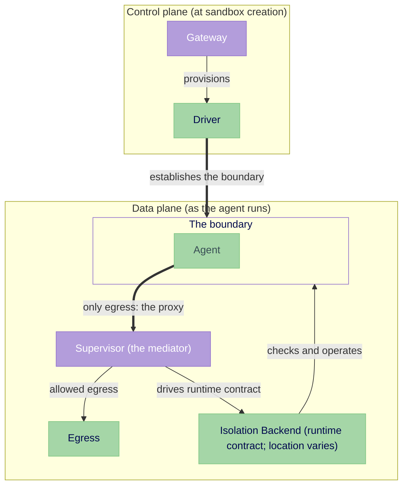

---
authors:
  - "@jganoff"
state: draft
links:
  - https://github.com/NVIDIA/OpenShell/issues/1737
  - https://github.com/NVIDIA/OpenShell/issues/899
  - https://github.com/NVIDIA/OpenShell/issues/981
  - https://github.com/NVIDIA/OpenShell/issues/1511
  - https://github.com/NVIDIA/OpenShell/issues/1650
  - https://github.com/NVIDIA/OpenShell/issues/1680
---

# RFC 0012 - Isolation Backend interface

## Summary

OpenShell runs untrusted agent code inside an isolation boundary: the network, filesystem, syscall, and identity constraints that decide what the agent can reach and what can reach it. Building that boundary takes privilege, and today that privilege lives inside the agent's own container, beside the code it is meant to confine. This RFC makes the boundary a pluggable component, the **Isolation Backend**, separating the privileged work that builds it from the supervisor that operates it.

The backend is neither a compute driver nor the supervisor. The driver still provisions the sandbox; the supervisor stays the policy authority (proxy, policy, audit) and the agent's only egress. The backend is the new piece between them: it establishes and enforces the boundary across all four dimensions and resolves who is behind each connection. The supervisor drives it through one runtime contract that is the same no matter where the boundary sits or which implementation provides it.

Isolation Backends allow the privileged setup to move out of the agent's container: a sidecar, a separate pod, a microVM, a node component, and eventually outside the agent's kernel. Each placement is a new backend, not a new supervisor.

## Motivation

An agent runs untrusted code, so OpenShell confines it behind an isolation boundary: the constraints that control what the agent can reach and what can reach it. Building that boundary takes privilege, and today the supervisor builds it from inside the agent's own container. So the privilege that builds the boundary sits inside the container the boundary is meant to confine.

That privilege is stuck there because building the boundary is written into the supervisor, so moving the boundary anywhere else means changing the supervisor. One inline choice creates three problems:

- A compromise reaches the privilege beside it. The boundary-building capabilities sit in the agent's own container, inside the blast radius of the untrusted code, so the machinery meant to contain the agent is reachable from the code it confines.
- Restricted and multi-tenant clusters reject the deployment. Building the boundary inline needs added Linux capabilities in the agent container (seven today, including `NET_ADMIN` and `SYS_ADMIN`); the `restricted` Pod Security Standards profile those clusters require permits no added capability beyond `NET_BIND_SERVICE`, and five of the seven (`NET_ADMIN`, `SYS_ADMIN`, `SYS_PTRACE`, `SYSLOG`, `DAC_READ_SEARCH`) are off the `baseline` allowlist too, so the deployment fails `baseline` as well. (Tracked in #899.)
- Each new placement forks the supervisor. The microVM driver and the outer gVisor sandbox each wire their own privileged setup into the supervisor, and it accretes a branch per placement.

All three trace to the same coupling: building the boundary and operating it are the same code. Separating them lets the privileged build move out of the agent's container, and lets a new placement be a new backend, not another branch in the supervisor. That calls for an interface, not a fixed set of placement modes. New placements keep arriving (sidecar, node component, VM, separate pod), and adding one should not require changing core OpenShell.

## Non-goals

- **Implementing any particular delegated backend.** This RFC defines the common contract. The sidecar, node, split-pod, gVisor, microVM, and other placements are separate implementation work, each settled in its own design.
- **The mechanism for confirming a boundary the supervisor cannot observe.** When a backend builds the boundary where the supervisor cannot read it, how it attests the boundary is that backend's design, not this RFC's. The contract still requires that confirmation to be bound to the admitted backend and sandbox (see The boundary descriptor).
- **The global authorization model.** The supervisor authenticates to the control plane today, but nothing scopes what an authenticated supervisor may do to its own sandbox. A separate proposal owns that scoping. This RFC defines the boundary and identity it would operate on, so it does not block on it; a delegated backend must still authenticate its caller and scope its operations to its own boundary.
- **One-to-N supervisors.** This RFC keeps one supervisor per agent; sharing a supervisor across sandboxes is deferred (see Implementation plan).

## Proposal

Make the boundary a pluggable component the supervisor drives. We call it the **Isolation Backend**. The backend establishes and enforces the boundary and resolves who is behind each connection; the supervisor operates it as the policy authority (proxy, policy, audit). Moving the privileged establish-and-enforce work into the backend lets the agent container shed its isolation privilege.

This RFC standardizes backend selection, lifecycle ordering, the runtime-operated interfaces, failure behavior, and the backend invariants. The mechanisms behind those behaviors, and the full design of any particular delegated backend, are implementation-specific and settled in the RFC that introduces each one.

The work splits across two planes. At the control plane, the gateway and driver provision the sandbox when it is created. At the data plane, the supervisor operates the boundary while the agent runs, driving the backend through one runtime contract: the only interface between the supervisor and the backend, identical wherever the boundary sits.



The supervisor straddles the boundary: the agent is contained inside, and the supervisor's proxy is its only egress.

This RFC defines the contract: its calls, their order, the failure categories a caller must handle (boundary unavailable, confirmation failed, attachment denied), and the agent lifecycle the warm-pool path depends on.

### Provisioning the boundary

Provisioning runs at sandbox creation, on the control plane, in a fixed order:

1. **Admission resolves the backend** from deployment config, not `SandboxPolicy`, so a workload cannot pick weaker isolation for itself. It fails closed if the backend cannot be realized and forbids silent downgrade. Different workload classes may resolve to different backends, an admission choice, not an interface change.
2. **The driver provisions the compute resource:** whatever must exist before the supervisor runs, such as the agent container and the supervisor, a sidecar, a separate supervisor pod, a microVM, or a claim on a node daemon.
3. **The named backend establishes the boundary before the agent runs.** Backends vary on one axis: where. The in-pod backend establishes in the supervisor's process, lazily, when the supervisor attaches to it. A backend that moves privilege out of the agent's container establishes at the control plane, before the supervisor boots: a node daemon installs the netns routing and rules, a VM driver brings up the guest. Either way the supervisor only drives the contract; it never establishes the boundary itself.

The driver and supervisor meet at two points: the driver provisions the resource and sets the descriptor; the supervisor reads the descriptor and drives the contract. Any driver and any backend plug in there without the supervisor changing.

How a backend establishes its boundary is the part the contract does not cover, because that is where placements differ; each backend settles its own establishment in the RFC that introduces it. For a backend that establishes off-supervisor, that RFC also carries the security-critical work outside this interface: for a node daemon serving many sandboxes, admitting requests, isolating one sandbox's boundary from another, and reclaiming a boundary whose supervisor died.

### The boundary descriptor

The supervisor learns which backend to instantiate, and how to attach, from a **boundary descriptor** the driver always sets in the `OPENSHELL_BOUNDARY_DESCRIPTOR` environment variable. It names the backend explicitly, in-pod included, and for a backend established off-supervisor it also carries how to attach. It is integrity-protected and bound to what provisioning admitted, so the supervisor cannot be pointed at a forged boundary. A missing, unreadable, or unverifiable descriptor fails the sandbox closed: there is no default, because defaulting would silently select a backend the deployment did not choose. The supervisor never passes it to the workload. The envelope is common and small; only the payload is the backend's:

```rust
struct BoundaryDescriptor {
    version: u32,
    backend_id: String,
    payload: Vec<u8>, // backend-specific attachment data
}
```

The supervisor matches `backend_id` to admission and the registered factory and verifies the descriptor before readiness. Payload integrity, sandbox binding, authentication, freshness, and replay protection belong to the design that introduces each delegated backend.

The supervisor does not re-check the boundary's contents; a backend may build it where the supervisor cannot read. Where a backend can expose it, the supervisor SHOULD confirm before the agent runs and fail closed if confirmation fails, a SHOULD rather than a MUST because some backends cannot expose their internal state across a kernel boundary, and structural enforcement carries those cases. A deployment that needs more for a sensitive workload class requires a confirming backend through admission, which fails closed the same way selection does. A backend whose boundary can change after startup SHOULD monitor for drift and fail the sandbox on it.

The descriptor settles **boundary attachment** (how the supervisor attaches to the boundary) but not **identity binding**, which sandbox this is (the `sandbox_id`). They are different exchanges, and warm pooling pulls them apart. A warm-pooled pod is created before any sandbox exists (#1892): its boundary is established at boot against the image's baseline policy, identity-free, before any claim. The supervisor learns its `sandbox_id` later, when a claim binds, through a separate control-plane handoff: in the Kubernetes flow it presents its projected ServiceAccount token to the gateway, which re-anchors it through the pod's owning records and mints the sandbox JWT. That handoff is local while the supervisor shares the pod, and it is the exchange that must cross the boundary when the supervisor is delegated. Because the baseline policy is fixed at boot, a workload needing a custom policy cannot be served from the pool; it takes the cold path.

A pooled pod runs an OpenShell-controlled placeholder in this gap, not the workload, so it can hold a ready boundary before it holds a sandbox. The placeholder is trusted because its executable is OpenShell-controlled content, not because of its lifecycle position: a binary named `sleep` from the agent's own image would not qualify. The attribution property that keeps that safe is stated with the invariants below.

### The runtime contract

The boundary spans four dimensions: network, filesystem, syscall, and identity. The in-pod backend realizes them as a network namespace and routing, Landlock, seccomp, and procfs; other backends realize them differently. The contract adds no enforcement of its own; it standardizes how the supervisor drives whichever backend a deployment admits.

A backend registers a factory under a `backend_id`. The supervisor resolves the factory, attaches to the admitted boundary, and drives it through a fixed sequence of states. Each transition consumes the prior state, and the state types have no public constructor, so no stage can be skipped or replayed. The Rust names below are illustrative; the states and their semantics are normative.

```rust
#[async_trait]
trait IsolationBackendFactory {
    fn backend_id(&self) -> &str;
    fn capabilities(&self) -> BackendCapabilities;
    async fn attach(&self, descriptor: VerifiedBoundaryDescriptor, intent: BoundaryIntent)
        -> Result<Box<dyn AttachedBoundary>, BackendError>;
}

#[async_trait]
trait AttachedBoundary {              // the exact admitted boundary; no workload
    async fn claim(self: Box<Self>, claim: ClaimContext) -> Result<Box<dyn ClaimedBoundary>, BackendError>;
}
#[async_trait]
trait ClaimedBoundary {               // bound to sandbox identity, policy, agent, resources
    async fn bind(self: Box<Self>) -> Result<Box<dyn BoundBoundary>, BackendError>;
}
#[async_trait]
trait BoundBoundary: Send {           // mediation interfaces connected
    fn identity_source(&self) -> Arc<dyn IdentitySource>;
    fn events(&self) -> Arc<dyn EventSource>;
    async fn confirm(self: Box<Self>) -> Result<Box<dyn ReadyBoundary>, BackendError>;
}
#[async_trait]
trait ReadyBoundary {                 // enforcement and mediation confirmed
    async fn start_agent(self: Box<Self>) -> Result<Box<dyn RunningBoundary>, BackendError>;
}
trait RunningBoundary: Send + Sync {  // the agent is running behind the boundary
    fn agent(&self) -> Arc<dyn BoundaryProcess>;
    fn identity_source(&self) -> Arc<dyn IdentitySource>;
    fn exec(&self) -> Arc<dyn BoundaryExec>;
    fn port_forward(&self) -> Arc<dyn BoundaryPortForward>;
    fn events(&self) -> Arc<dyn EventSource>;
}

#[async_trait]
trait BoundaryProcess: Send + Sync {  // the agent, or a process started via exec
    async fn wait(&self) -> Result<ExitStatus, BackendError>;
    async fn signal(&self, signal: Signal) -> Result<(), BackendError>;
    async fn terminate(&self) -> Result<(), BackendError>;
}
```

| State | Meaning | Permitted workload operations |
|---|---|---|
| **Attached** | the exact admitted boundary is attached | none |
| **Claimed** | bound to sandbox identity, policy, agent spec, and resources | none |
| **Bound** | mediation interfaces are connected | identity and events only |
| **Ready** | enforcement and mediation are confirmed | agent start only |
| **Running** | the agent is started behind the boundary | `exec`, `connect`, `wait`, `signal` |

The ordering is the contract's security property, held by construction. The cold path claims immediately; a warm-pooled boundary may sit `Attached` until a claim binds (the attachment-versus-identity split above). `start_agent` always returns a running process handle once the agent has started, and `wait` returns its exit status, identically for every backend; `exec` and `connect` do not exist before `Running`. A delegated backend answers these calls over its own transport, but the transport cannot change their meaning.

The accessors return owned `Arc` handles on purpose: the supervisor keeps a runtime interface while the state object is consumed by the next transition. Those interfaces keep their roles: `IdentitySource` resolves who is behind a connection for the proxy (see Identity); `BoundaryExec` and `BoundaryPortForward` run `exec` and `connect` (loopback-scoped, since a non-loopback target opens an egress the proxy would otherwise mediate) for the SSH server and supervisor sessions; `EventSource` is one stream the orchestrator drains for denials, activity, bypass, and termination, and security events must not be dropped silently under backpressure. A denial event carries the connection's attribution at `Evidence` fidelity (the binary, its ancestor chain, and the cmdline and L7 paths), not just host and port, because the orchestrator's policy-proposal path consumes it. The event payload and the identity model share one attribution shape, so a delegated backend forwarding events preserves that fidelity rather than collapsing a denial to an endpoint.

The claim carries only the common content every backend needs:

```rust
struct ClaimContext {
    sandbox_id: SandboxId,
    policy: SandboxPolicy,        // all four dimensions
    agent: AgentSpec,
    resource_binding: ResourceBinding,
}
```

`ResourceBinding` is opaque common data naming the compute driver's execution and device domain: the cgroup, runtime security context, and device allocation. The agent and every `exec` process run within it; allocating those resources stays the compute driver's job. A backend's placement feeds admission and audit, never per-connection policy, so a policy decision is identical across placements.

A backend swap replaces the factory and the state implementations; the consumer code above them (the proxy, the SSH server, and the orchestrator) does not change, because each depends on a runtime interface, not on the backend.

### Supervisor integration

The supervisor keeps a registry from `backend_id` to factory. Adding a backend adds an implementation and a registration; it does not add backend-specific branches to the supervisor's lifecycle, proxy, SSH, or session code. This is an in-tree registry, not dynamic out-of-tree loading, and the contract is not a universal delegated wire protocol: a delegated backend ships its own authenticated transport behind the same factory, consistent with RFC 0001, which makes pluggable drivers gRPC services rather than in-process traits.

The supervisor runs the same sequence for every backend:

1. Read and validate the descriptor envelope.
2. Match its `backend_id` to admission.
3. Resolve the registered factory and check its capabilities.
4. Attach to the boundary.
5. Claim the sandbox identity, policy, agent spec, and resources.
6. Bind identity and events into the proxy and orchestrator.
7. Start mediation services.
8. Confirm readiness.
9. Start the agent.
10. Enable `exec` and port forwarding.
11. Wait for the agent or the boundary to terminate.
12. Surface the result for platform-specific cleanup.

A backend reports what it can do, so admission can reject a workload it cannot place:

```rust
struct BackendCapabilities {
    backend_id: String,
    contract_version: u32,
    placement: BackendPlacement,
    confirmation: ConfirmationCapability,
    identity: Vec<IdentityEvidenceKind>,
}
```

The backend identity must agree across admission, the descriptor, and the factory; an unsupported contract version, or a capability a policy requires but the backend cannot meet, fails closed.

### Failure semantics

A failure is any case where the supervisor cannot obtain or apply a valid result. The contract fixes the behavior; backend-specific retry limits and transport recovery are implementation details.

| Failure | Required behavior |
|---|---|
| Missing, malformed, unsupported, or mismatched descriptor | Fail closed; never select another backend |
| Attachment denied or verification failed | Terminal for this sandbox instance |
| Boundary unavailable | Retry the same backend only; never downgrade |
| Confirmation failed | Do not start workload code; surface the failure for cleanup |
| Boundary terminates after start | Stop new `exec` and `connect`, and fail the sandbox |

### Backend invariants

These define what it means to be a backend; a backend that cannot hold all four is not valid.

1. **No unguarded workload egress before Ready.** Before the boundary is `Ready`, the workload reaches no egress but the proxy. A backend enforces this with an effective default-deny across every protocol the platform supports (IPv4 and IPv6, all L4, raw and packet sockets, and ingress), not a default-accept ruleset that names a few protocols, and it confirms the effective behavior rather than the mere presence of rules. It must not assume the platform provides the deny: a NetworkPolicy is inert without an enforcing CNI, and the in-pod case holds only while the host does not forward the sandbox subnet. The in-pod backend does not satisfy this today (a known gap, see Risks) and does not ship until it does.
2. **No untrusted workload execution before Ready.** No workload process runs inside the boundary until it is `Ready`. Workload code is defined by provenance, not lifecycle position: it includes the agent image, the workspace, mounted volumes, and anything an init step runs from them. Only digest-pinned, OpenShell-controlled content may run before the claim binds and the boundary is `Ready`. `start_agent` is gated structurally by the `Ready` state; the supervisor opens `exec` and `connect` only in `Running`, a path-level guarantee rather than a type-state one.
3. **No unattributed workload execution.** Every agent, `exec`, and `connect` requires a bound claim and the corresponding lifecycle state, so no untrusted process runs without a sandbox identity. This keeps warm pooling safe: a pooled boundary holds an OpenShell-controlled placeholder, never untrusted code, until a claim binds. Like the ordering above, this rests on the supervisor refusing the operation before a claim, not on the type-state; threading the claim into `exec` to make it structural is a candidate refinement, not built now.
4. **Preserve the compute driver's execution domain.** The agent and every `exec` process run within the admitted cgroup, runtime security context, and device allocation; a backend's privileged helpers do not inherit the workload's devices without backend-specific justification. The contract carries this as `ResourceBinding`; allocating the domain stays the compute driver's responsibility.

These invariants hold against application-level escapes, not kernel-level ones: in a shared-kernel placement a kernel exploit reaches the enforcement itself (see Representative topologies on how far enforcement sits from the agent). They describe what a contained agent cannot do; they do not promise survival of a kernel compromise.

### Identity

`IdentitySource::resolve(flow)` answers who is behind a connection, so policy can scope rules to a binary. It is an interface injected into the proxy at `bind`, not a method the orchestrator calls: the proxy is the only consumer, and it calls `resolve` on every connection. It is capability-gated: a backend that cannot provide identity returns `Unsupported`, and admission rejects any policy that needs a level the backend cannot meet.

```rust
trait IdentitySource {                       // the proxy's per-connection resolver
    async fn resolve(&self, flow: Flow) -> Result<Identity, ResolveError>;
}

enum Identity { Evidence(Evidence), Unsupported }

struct Evidence {
    assurance: Assurance,           // ordered for policy; see below
    binary_path: PathBuf,
    binary_sha256: Option<Hash>,    // None when unavailable
    ancestors: Vec<PathBuf>,        // ancestor binaries, nearest first
    cmdline_paths: Vec<PathBuf>,    // script/interpreter paths from the cmdline
}

// Ordered for policy: binary-scoped rules require `Observed` or higher, and
// `Claimed` counts as `None` for them. `Attested` is defined narrowly (see
// below); evidence that does not meet that bar is not `Attested`.
enum Assurance { None, Claimed, Observed, Attested }
```

`Observed` is the backend reading and hashing the binary itself, which it can do via procfs while it shares the agent's kernel. `Attested` is narrower than a signature alone: it is fresh evidence, bound to this boundary and flow, cryptographically verified against an observer and trust root outside the agent's adversary domain. A signed statement produced inside a compromised guest does not meet that bar and is not `Attested`. The `Evidence` schema is stable, so the source can change (procfs today, attestation later) without touching the policy layer; the first cross-kernel backend defines the concrete attestation producer and its verification.

The backend provides the resolver, injected at `bind`; the proxy is its only consumer. When the backend shares the agent's kernel (in-pod, sidecar, node enforcer) the resolver reads procfs; when it does not, the resolver answers from across the guest boundary. The proxy calls `resolve` the same way in both, so where identity comes from never reaches the proxy. The call is on the per-connection hot path, so a slow or failed lookup fails closed (deny the binary-scoped rule), and a remote resolver bounds it with a timeout. Today the proxy reads procfs inline; routing it through the backend's injected `IdentitySource` is a behavior-preserving step (impl-plan step 1). The contract is fixed now so that step, and later backends, do not reshape it.

The `flow` argument is an opaque, versioned token the backend issues per connection and resolves to the owning process; the supervisor never interprets it. The in-pod backend keys it on the workload-side TCP peer port; a backend that carries identity across a kernel boundary defines its own token, bound to the attachment, namespace, and connection, including who may forge a reference. New token shapes arrive under the contract version, not by widening a shared type.

### Representative topologies

No single placement is universal. Infrastructure and workload determine the choice, and a deployment selects the one that matches its threat model. The interface covers all of them. They fall into three classes by where the supervisor's kernel sits relative to the agent's, and containment strength follows from that distance: the further the supervisor sits from the agent's kernel, the more a compromised agent must break to reach the enforcement that confines it.

| Class | A compromise reaches enforcement only by | Examples |
|---|---|---|
| **Shared host kernel**: supervisor and agent on the host kernel | a host-kernel exploit | in-pod, sidecar, node enforcer, `runc` split-pod |
| **Shared guest kernel**: supervisor and agent share one isolated kernel, a VM guest kernel or a userspace application kernel such as gVisor's; the host is isolated, the supervisor is not | a guest-kernel exploit | single-pod microVM, outer gVisor sandbox |
| **Kernel-separated**: supervisor outside the agent's guest kernel | escaping the agent's guest kernel | split-pod with the agent under a VM or gVisor `runtimeClassName`, future node runtime |

The first two classes share a kernel with the agent, so they are the floor: privilege separation, not isolation from a kernel-level adversary. Within the shared-host class, placements differ by where the boundary-building privilege sits, in the agent's container (in-pod) or out of it (sidecar, node enforcer, split-pod), not by containment strength. Kernel separation is the only class that contains a kernel-level adversary; it is the class that raises the floor.

Kernel separation depends on where the supervisor runs relative to the agent, not on the RuntimeClass alone: a single-pod VM or gVisor RuntimeClass isolates the pod from the host but runs the supervisor inside the agent's isolated kernel (a VM guest kernel, or gVisor's application kernel), so they share it, while the same RuntimeClass with the supervisor in a separate pod puts it outside (kernel-separated).

The trusted computing base is the supervisor, the backend that enforces the boundary, and the control channel between them: the supervisor is the proxy, decides policy on identity, and emits audit. The boundary therefore falls to a compromise of any of the three, not only to a kernel exploit. In a shared-kernel placement the supervisor sits in the agent's blast radius, and moving it to its own kernel removes it from that radius.

A [selection matrix](./topology-matrix.md) maps a deployment's starting point to a recommendation and works through the design logic, including the one supervisor/agent kernel split that stock Kubernetes cannot express.

## Implementation plan

Backends arrive incrementally behind one contract, behavior-preserving first. The supervisor's runtime calls do not change between steps; only the backend behind them does.

1. **Land the contract and the supervisor refactor.** Define the contract, the `backend_id` registry, and route the supervisor through it, with no change in behavior or privilege, validated by the existing test suite.
2. **Put the in-pod reference backend behind it.** Register today's in-pod path as a backend and repair the readiness gaps invariant 1 names (see Risks); it ships only once it confirms its own boundary.
3. **Move the privilege off the agent container (separate design).** Design and implement the sidecar backend against the unchanged contract, dropping `NET_ADMIN` from the agent container. This is the first real privilege reduction.
4. **Validate a different placement (separate design).** Design and implement a node or split-pod backend, exercising the same contract from a placement that establishes off-supervisor.
5. **Add kernel-separated backends (separate designs).** microVM, outer gVisor, and a future node runtime that runs the supervisor outside the agent's kernel, each with its own attestation and cross-kernel identity, prioritized by demand.

The supervisor stays 1:1 with the agent (a node-level backend may still serve many sandboxes on its node; that is expected), and a backend is admission-validated config, so each step lands without a breaking change. RFC acceptance approves the contract and this sequence; it does not assert that every backend exists. The RFC becomes `implemented` once the supervisor uses the contract and the reference in-pod backend has landed; the other backends may remain follow-on work.

Every backend passes one shared conformance check: backend and contract-version agreement, lifecycle ordering, no agent, `exec`, or `connect` before `Running`, uniform start and `wait` semantics, fail-closed on a missing or unconfirmed boundary, identity-resolution failure handling, execution-domain preservation, and boundary-termination propagation.

## Risks

- **The in-pod boundary is not self-confirming today.** Its egress confinement holds only while the host does not forward the sandbox subnet, and its nftables backstop is accept-by-default and covers only TCP and UDP, so reading the rules back proves nothing about other protocols or raw sockets; the backstop also disappears silently when `nft` is absent (`install_bypass_rules` returns `Ok`). Closing this, with a default-deny ceiling across all protocols (invariant 1) confirmed by effective behavior, is step 2 of the implementation plan; invariant 1 blocks shipping the in-pod backend until it does.
- **Runtime control endpoints are a container escape independent of the boundary.** For any container-based backend, admission must apply a positive policy to what the agent container may reach: rejecting a couple of named sockets is not enough, because a container runtime socket (Docker, Podman, containerd, CRI-O, or the kubelet), a remote daemon endpoint, a host namespace, or a sensitive host path or device is a full escape regardless of how tight the network boundary is. A correct network boundary around a container that can still reach the runtime is not a contained sandbox.
- **Init-path exposure.** A `workspace-init` step runs the agent's image as root after the pod netns exists but before egress confinement is installed, so it has an unmediated egress window, and its executable bytes come from the agent image (untrusted, by invariant 2). This is a deployment choice of the Kubernetes driver, not an interface requirement. Same-pod topologies cannot close the window; backends that establish the boundary before the pod's containers run can. For the same-pod case, the in-pod backend does not ship until the init path runs only OpenShell-controlled content (a trusted seed image, not the agent's) or the boundary already exists before any container starts. This is a release gate, not a recommendation.
- **Delegated backends must earn their containment, not just satisfy the contract.** The interface provides the call sites and the structural-containment requirement, but a delegated backend's containment comes from where it places enforcement: cross-pod gate release, handle proxying, the runtime endpoint, and drift monitoring are all new construction it must deliver and prove. A backend that satisfies the contract but places enforcement where the agent can reach it is not contained. This RFC states those requirements; it does not meet them.
- **Cross-kernel identity may not be cheap enough for binary-scoped policy.** When `resolve` is a remote call into a guest, an inbound proxy connection must resolve its flow on the hot path, and a slow or failed lookup fails closed to deny-all egress. Whether a cheap correlation path exists decides whether a kernel-separated backend can do binary-scoped policy at all. This is unproven; a future kernel-separated backend must establish it, and the in-pod and shared-kernel backends (where identity is a local procfs read) do not depend on it.
- **The refactor spans several entry paths.** Moving namespace plumbing out of the supervisor's call sites (agent launch, SSH, supervisor sessions) and behind the runtime contract is real work, and the in-pod backend must come out behaviorally identical with the existing tests intact.

## Alternatives

### Implement a specific topology directly, without the interface

OpenShell could wire one delegated topology (the split-pod proposal in #981, for example) straight into the supervisor and the driver.

This solves one placement but hardwires it. The next topology (a node runtime, a VM) forks the supervisor again, and the supervisor accretes placement-specific branches. The interface lets each topology land behind the same runtime contract, so the supervisor does not change as placements are added.

Defining the interface before a second backend exists is a deliberate trade. Its cost now is the factory, the state types, and the registry, paid by extracting today's in-pod path behind them with no change in behavior or privilege (impl-plan steps 1-2). The alternative is the status quo: a supervisor fork per placement. The pieces shaped for delegated use that the in-pod backend does not exercise (the `Flow` token format, the authenticated transport, attestation) are called out at their definitions as what the first delegated backend settles; new shapes arrive under the contract version rather than by widening a shared type.

### Fold boundary operation into the compute driver

Establishing the boundary is already a driver concern, so the runtime side could live there too.

Establishing and operating the boundary are different jobs. The driver provisions platform resources and stands up the boundary; operating it (proxying, policy, identity, the lifecycle the supervisor drives) is the supervisor's runtime concern, not the driver's. Keeping the runtime contract separate lets one supervisor-facing interface be satisfied across every driver and backend, rather than each driver reimplementing it.

### Select the backend through `SandboxPolicy`

The backend could be chosen by the workload's `SandboxPolicy` alongside its other isolation settings.

`SandboxPolicy` is workload policy; which backend realizes it is deployment topology. Coupling them would let an untrusted workload influence its own isolation strength and make policy non-portable across deployments, which is why selection sits in admission config instead (see Provisioning the boundary).

### Relax pod semantics to give containers different isolation classes

A single pod could place its containers in different kernels, so the supervisor and agent share a pod but not a kernel.

The kernel boundary is selected per pod (`runtimeClassName`), not per container, so this needs a CRI change and a runtime that acts on it, not a backend behind this interface. The supported ways to separate the supervisor's kernel from the agent's are two pods or a future node runtime.

### Fold this into the proxy egress work (#1511)

This boundary could be part of #1511, which scopes the proxy pipeline.

The proxy egress work (#1511) owns the proxy above the boundary. This RFC defines the boundary beneath it, the thing that forces traffic into the proxy. The two are adjacent but distinct concerns.

## Prior art

- **Driver-backed subsystems (CRI/CNI/CSI).** Kubernetes factors runtime, networking, and storage into pluggable driver contracts so the orchestrator drives one interface while implementations vary. RFC 0001 describes OpenShell's other subsystems the same way; this fills in the one it left as a box.
- **istio's privilege placement.** istio reduces transparent-proxy deployment to a placement choice: `istio-init` holds `NET_ADMIN`/`NET_RAW` then exits, leaving an unprivileged Envoy sidecar (the analog of our sidecar placement); ambient mode runs a per-node `ztunnel` daemon with no per-pod sidecar (the analog of our node-enforcer placement). We borrow the placement options rather than the enforcement data path: OpenShell mediates through its own identity-aware proxy, not an iptables redirect. The proxy is OpenShell's own because it scopes egress rules to the connecting binary, resolved per connection from procfs or attestation (`IdentitySource`), which a mesh proxy's workload-level mTLS identity does not model.
- **CRI exec/attach/port-forward.** `exec` and `connect` mirror CRI's `Exec` and `PortForward`; a future stdio attach would mirror CRI `Attach`. The gateway already speaks this shape (`ExecSandbox`, `CreateSshSession`, `ForwardTcp`). The contract borrows CRI's names where they fit and departs where they do not: CRI is pod/container-shaped and models neither the two-plane split nor the mediation attachment, so the lifecycle calls are its own.

## Appendix: in-pod migration sketch

Behavior is identical to today; only the placement of boundary setup and process entry changes, now expressed as the contract's states. `ProcessHandle::spawn` already separates the spec from the boundary handle (it takes `netns: Option<&NetworkNamespace>`), so the in-pod `exec` is `BoundaryExec::exec` in embryo. The refactor: the in-pod factory's `attach` builds the netns in the agent's container (still privileged there; no capabilities removed) and `claim` binds the sandbox; `bind` returns the proxy address, identity source, and event stream; `confirm` reads the boundary back (failing closed if `nft` is absent or the ceiling is not default-deny); `start_agent` forks the entrypoint into the netns and returns a `RunningBoundary` whose `wait` is the supervisor's existing join; `exec` and `connect` move from direct namespace plumbing to the runtime interfaces. Teardown stays automatic.

## Appendix: designing a backend

A backend author starts from the containment property they want, decides where enforcement sits to get it, and the contract calls follow:

1. **Pick the property.** What must the agent be unable to do, and what must stay protected from it. "Egress only through the proxy" is the network property; "the agent cannot reach the supervisor's kernel" is a stronger one.
2. **Place the enforcement below the agent's reach.** That placement provides the containment. In-pod puts it in the agent's netns; a node enforcer puts it on the node; a VM puts it in the hypervisor. The further out, the stronger the property and the more the supervisor's reach-ins must travel through the contract.
3. **Establish it, then operate it.** Establish that enforcement before the supervisor runs (inline for in-pod, via the driver for delegated); answer the runtime contract's lifecycle and in-boundary calls.

Worked example, a node enforcer that drops `NET_ADMIN` from the agent pod:

- **Property:** egress only through the proxy, with no isolation privilege in the agent pod.
- **Placement:** a privileged per-node daemon installs the netns routing and rules from the node, so the pod needs no capability. The supervisor stays in the pod (it still shares the host kernel; this placement does not separate kernels).
- **Establishment:** the supervisor's `attach` call reaches the daemon (the in-pod supervisor registering with the node daemon, expressed as the factory's `attach`, not a side protocol). The daemon enters the agent pod's netns, installs the routing and rules, confirms them (it can read back what it installed), and returns the attached boundary. The supervisor holds no privilege in this exchange; the daemon does the privileged work and answers the call.
- **Runtime:** `claim`, `bind`, `confirm`, and `start_agent` proceed as in-pod. Because the supervisor still shares the agent's kernel, `exec`, `connect`, and `resolve` use it directly, unchanged from in-pod.

A kernel-separated backend (a split-pod with the agent under a VM or gVisor RuntimeClass, or a node runtime that puts the supervisor outside the agent's kernel) follows the same loop with a stronger placement: the runtime interfaces now route over the backend's guest channel and the backend supplies identity evidence the supervisor cannot gather itself. The lifecycle states and the supervisor's mediation are unchanged.

A backend's separate design covers, at minimum: its backend ID and registered factory; its capabilities; its descriptor payload and verification; every lifecycle transition; the runtime interfaces and the process handle; how it confirms the common invariants; policy and resource-domain preservation; provisioning and cleanup integration; termination behavior; and the shared conformance tests.

## Appendix: codebase grounding

The claims this RFC makes about the current system are verified, with file:line
references, in the supporting file [codebase-grounding.md](./codebase-grounding.md)
(against `origin/main` at commit `4ee27d99`).
