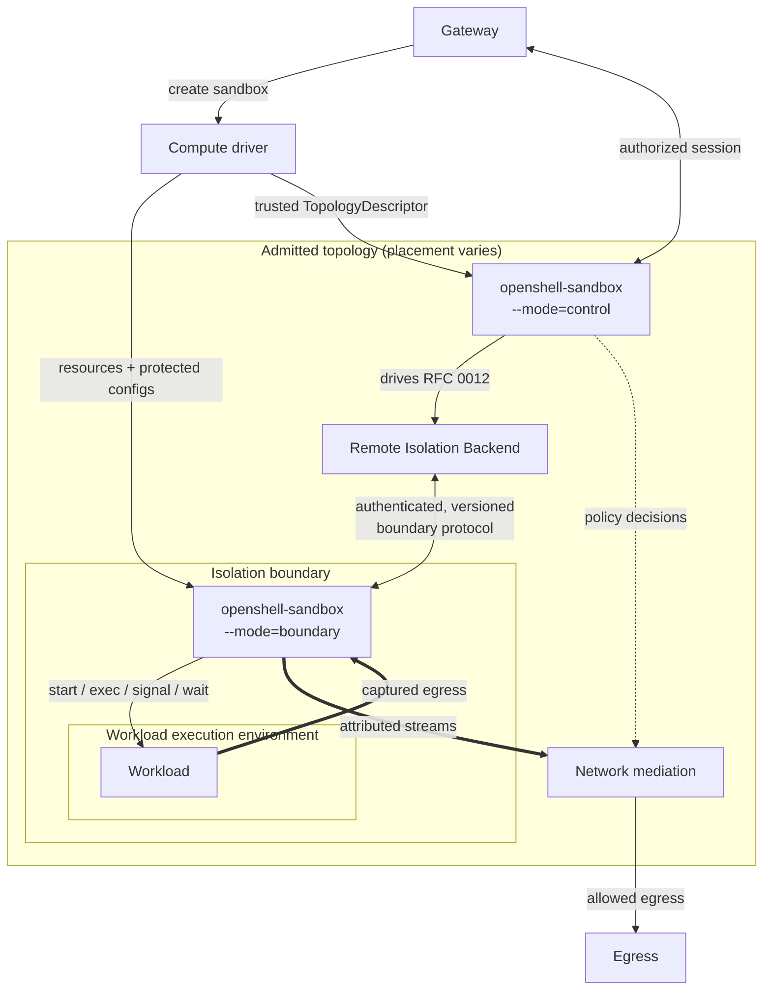

---
authors:
  - "@jganoff"
state: review
links:
  - https://github.com/NVIDIA/OpenShell/issues/1737
  - https://github.com/NVIDIA/OpenShell/pull/2048
  - https://github.com/NVIDIA/OpenShell/issues/899
  - https://github.com/NVIDIA/OpenShell/issues/981
  - https://github.com/NVIDIA/OpenShell/issues/1511
  - https://github.com/NVIDIA/OpenShell/issues/1650
  - https://github.com/NVIDIA/OpenShell/issues/1680
  - https://github.com/NVIDIA/OpenShell/pull/2606
---

# RFC 0012 - Isolation Backend Interface

## Summary

Today the supervisor both builds the workload's isolation boundary and applies its network policy. Because the supervisor runs inside the agent container, the privilege needed to build that boundary sits beside the code it confines. This RFC moves boundary construction and process operations behind a pluggable **Isolation Backend**. The supervisor continues to apply approved network policy through network mediation.

The compute driver prepares the workload topology and trusted inputs. The logical supervisor is the trusted bridge between the gateway and the workload: it maintains the gateway connection, handles authorized requests, and drives the backend. OpenShell packages that role as `openshell-sandbox --mode=control`. When the workload is separated by a container, pod, userspace kernel, or VM boundary, the same binary runs a small trusted counterpart as `openshell-sandbox --mode=boundary`. The boundary mode owns process observation and operations that cannot be implemented portably from outside the boundary; it has no gateway credentials and no policy authority.

## Motivation

Boundary construction is embedded in the supervisor, so moving it anywhere else means changing the supervisor. That placement creates three problems:

- A compromise reaches the boundary-building privilege in the same container.
- Building the boundary inside the agent container requires capabilities that conflict with restricted deployments. Delegating construction removes that requirement but does not guarantee Pod Security Standards compliance. See [codebase-grounding.md](./codebase-grounding.md) and #899 for background.
- Each new placement adds another branch to the supervisor.

All three come from coupling boundary construction to boundary operation. A common interface lets deployments move privilege without changing the supervisor.

## Non-goals

- **Standardizing a topology's resource API.** Docker, Kubernetes, VM, and other resource mechanisms remain backend-specific.
- **Changing authorization.** [RFC 0001](../0001-core-architecture/README.md) owns control-plane and sandbox identity. A delegated backend must still authenticate callers and scope them to one boundary.
- **Standardizing resource-specific provisioning or transport setup.** A driver still decides how to place the binary, create a private Unix socket, authenticated TCP endpoint, or vsock endpoint, and establish kernel-specific egress capture. This RFC standardizes the authenticated control-to-boundary messages carried over that endpoint.
- **Changing gateway lifecycle or public status.** This RFC adds no gateway activation operation, public phase, or status API, and it does not define how a boundary's effective isolation model is surfaced to operators.

## Proposal

The mental model has three roles:

- The **compute driver** prepares placement and trusted topology inputs and owns durable resource provisioning, deletion, and reconciliation. That placement is the **topology**.
- The **Isolation Backend** establishes and operates the topology-specific controls around the workload. It also routes workload egress to network mediation and provides process operations.
- The **logical supervisor** is the trusted control-plane bridge between the gateway and the workload. It drives the backend, handles authorized gateway requests, and applies approved network policy through network mediation.

Together, network policy, filesystem isolation, syscall filtering, and sandbox identity form the workload's isolation boundary. The roles above enforce that boundary and may run in one process or across several trusted components. Their placement does not change the contract.

Each active boundary has exactly one control role and at most one boundary role. Together they implement one logical supervisor; boundary mode is not an independently authorized supervisor. The control role owns the gateway session, admitted policy, network-policy decisions, and RFC 0012 lifecycle. Boundary mode owns boundary-local process groups, `exec`, signal, wait, PTY, loopback forwarding, binary observation, and egress capture. The transport and physical placement remain driver-owned.

[RFC 0001](../0001-core-architecture/README.md) continues to own sandbox authentication and authorization. In this contract, sandbox identity means binding the authenticated sandbox context to the isolation boundary.

Admission selects the sandbox's topology and trusted context. The compute driver gives the logical supervisor a `TopologyDescriptor` for the matching backend. Its opaque payload can identify an existing resource or carry trusted prepared inputs from which `attach` establishes the boundary. The backend prepares the required controls before the agent starts.


```mermaid
flowchart TB
    Gateway["Gateway"] -->|"create sandbox"| Driver["Compute driver"]

    subgraph Topology["Admitted topology (placement varies)"]
        Control["openshell-sandbox<br/>--mode=control"]
        Backend["Remote Isolation Backend"]
        subgraph Boundary["Isolation boundary"]
            BoundaryAgent["openshell-sandbox<br/>--mode=boundary"]
            subgraph Execution["Workload execution environment"]
                Workload["Workload"]
            end
        end
        Mediator["Network mediation"]

        Control -->|"drives RFC 0012"| Backend
        Backend <-->|"authenticated, versioned<br/>boundary protocol"| BoundaryAgent
        BoundaryAgent -->|"start / exec / signal / wait"| Workload
        Workload ==>|"captured egress"| BoundaryAgent
        BoundaryAgent ==>|"attributed streams"| Mediator
        Control -.->|"policy decisions"| Mediator
    end

    Driver -->|"resources + protected configs"| BoundaryAgent
    Driver -->|"trusted TopologyDescriptor"| Control
    Gateway <-->|"authorized session"| Control
    Mediator -->|"allowed egress"| Egress["Egress"]
```

Co-located deployments may keep the existing in-process backend and omit boundary mode. Separated deployments use the shared remote backend and boundary protocol, so adding a driver changes provisioning and transport selection without adding a topology branch to the control role.

### Supervisor modes and boundary protocol

`openshell-sandbox --mode=control` runs outside the untrusted execution environment. It receives the admitted backend name and a protected `TopologyDescriptor`, resolves the backend without fallback, and owns the gateway-facing access plane. It is the only mode that possesses gateway credentials or applies approved network policy.

Orchestrators may run control mode with `--health-check --health-port <port>`.
The listener defaults to `0.0.0.0`; `--health-bind-ip <ip>` (or
`OPENSHELL_HEALTH_BIND_IP`) selects an explicit IPv4 or IPv6 address. Kubernetes
drivers should populate the environment variable from the Downward API
`status.podIP`, which keeps the probe address family aligned with the pod.
The TCP listener becomes reachable only after `start_agent` has returned a
`RunningBoundary` and the gateway-facing access plane is established. Control
mode drops the listener when that boundary/access-plane lifetime ends, so a
Kubernetes `tcpSocket` readiness probe observes semantic control readiness
rather than mere process liveness. The listener carries no application data.

`openshell-sandbox --mode=boundary --boundary-config <path>` runs inside, or immediately adjacent to, the execution environment. The driver supplies the config over a protected filesystem channel. It names one boundary, one private listener, one per-boundary bootstrap credential, and the workload identity. The identity is either a platform-resolved numeric UID/GID pair or an OCI `Config.User` declaration that boundary mode resolves against the workload filesystem. Boundary mode authenticates and scopes every request to that boundary. It never accepts policy or identity claims from workload code and it cannot authorize an operation independently of control mode.

The shared protocol is versioned independently of a driver's resource descriptor. It carries `attach`, `confirm`, `start_agent`, agent and exec `wait`/`signal`/`terminate`, PTY resize, loopback-only forwarding, and attributed egress streams. Drivers may use a private Unix socket, TLS-authenticated TCP, a Unix endpoint mapped to guest vsock, or host `AF_VSOCK`; adding a transport does not change lifecycle or operation semantics. A TCP transport that crosses a shared or operator-managed network must authenticate the server name against a driver-provisioned trust root and encrypt every control and stream request. Network isolation alone is not a confidentiality boundary. Secrets are delivered in protected files, redacted from debug output, and never placed in workload-visible environment or process arguments. When a bind-mounted file's host owner may match the workload UID, the driver requires boundary mode to re-own it as root-only before the first workload instruction. Unix socket inodes permit cross-UID control within their private driver-owned directory; the per-boundary bootstrap credential authenticates every request.

A boundary is active from successful `attach` until normal backend cleanup releases the binding or the topology's trusted cleanup path invalidates it. A backend may coordinate multiple trusted helper or interception processes for that boundary. The backend owns the active-boundary binding; the compute driver or external orchestrator owns the durable resource lifecycle even when the backend establishes a resource as part of `attach`.

### Contract invariants

Six invariants hold for every boundary:

1. Workload egress is denied except through network mediation for the boundary's lifetime.
2. No untrusted instruction executes until every admitted control applicable to that process is in force.
3. An operation is authorized only when the complete effective policy permits it; network operations are decided through network mediation. There is no silent weakening.
4. Agent startup, `exec`, and forwarding occur only through the active backend, and every workload process remains in the admitted execution environment.
5. Shared infrastructure preserves strict per-boundary lifecycle, policy, identity, enforcement, and cleanup isolation.
6. If the logical supervisor is lost, the boundary remains under its last confirmed enforcement state while supervisor-dependent operations fail closed. Loss of required enforcement ends `Running` and terminates all workload processes within a documented bound; detection and termination may be performed by a trusted node or control-plane actor. Network-mediation unavailability denies outbound connections and never enables direct egress.

Each backend states its termination bound in its implementation documentation. Loss of the logical supervisor means loss of the components holding the backend lifecycle, not loss of the gateway connection; gateway disconnection follows RFC 0001's reconnection semantics.

### Provisioning

Provisioning is selected by trusted control-plane configuration, and four rules hold in every topology:

1. **Admission selects the topology** from trusted deployment configuration, not `SandboxPolicy`, and records its required backend. The `TopologyDescriptor` must name that backend, and resolution never falls back to another backend.
2. **The descriptor supports prepared and existing resources.** A compute driver or orchestrator may identify an existing resource, or it may supply trusted prepared inputs that the backend uses to establish the resource during `attach`.
3. **The compute driver owns the durable resource lifecycle.** It provisions or prepares, deletes, and reconciles the topology independently of logical-supervisor availability.
4. **The backend establishes standing enforcement before untrusted code runs**, during `attach` or `confirm`, depending on the backend.

If a topology depends on cluster-scoped coverage or registration, admission verifies that the prerequisite covers the boundary's placement before untrusted code runs.

Every topology provides a trusted cleanup path that does not depend on logical-supervisor availability.

A compute driver may provision a resource and `TopologyDescriptor` before the control plane assigns it to a sandbox. No untrusted workload runs while the resource is unassigned. It may instead prepare immutable image or disk identities, normalized runtime settings, placement results, or protected references to artifacts and encode those inputs in the descriptor. After assignment produces a trusted `SandboxContext`, the supervisor calls `attach`; the backend atomically establishes or locates the resource, binds that context, and returns `Bound`, or rejects it as incompatible. Attach-time establishment is idempotent on trusted sandbox identity and launch generation. Partial resources are removed or remain labeled for compute-driver reconciliation. Pool creation, claim, reset, release, and recycling remain outside this contract.

### The topology descriptor

The compute driver supplies a descriptor for every topology admitted to this contract. The common envelope names the backend and carries an opaque payload.

```rust
struct TopologyDescriptor {
    backend_name: String,
    version: u32,
    payload: Vec<u8>,
}
```

`version` is the Isolation Backend interface version. Backend name and version match exactly; this contract does not negotiate compatibility ranges. The descriptor is transport-neutral. Provisioning supplies it to the supervisor before `attach`; how it is transported is topology-specific and outside this contract, and every transport preserves one property: workload-controlled input cannot select or modify the descriptor.

The opaque payload identifies an existing resource or gives the backend trusted prepared inputs with which to establish the exact resource during `attach`. It may also carry topology-specific endpoint or helper-role information; there are no common topology or role fields.

Common verification requires:

- the descriptor's `backend_name` matches the backend required by the admitted topology;
- the descriptor's version is one the supervisor supports, and the resolved backend reports that same version; and
- `SandboxContext` is constructed after the control plane assigns the resource to the admitted sandbox, using authenticated control-plane and trusted supervisor state.

The supervisor validates the descriptor's common fields and produces a `VerifiedTopologyDescriptor`, then resolves its `backend_name` and version without fallback. Verification does not imply that the opaque payload is valid; the selected backend validates it and atomically establishes or locates the resource and binds it to the trusted `SandboxContext` during `attach`. Separated topologies also carry an opaque map of driver-owned immutable resource claims, such as a container ID, pod UID, or VM generation. Control mode presents those claims during authenticated attachment, and boundary mode compares them with its protected configuration before accepting the policy. Any failure rejects the sandbox.

### The lifecycle

The contract does not prescribe enforcement mechanisms; it standardizes how the supervisor drives whichever backend a deployment admits.

A backend registers under a `backend_name` and version. The supervisor attaches to the admitted topology and drives the boundary through one fixed sequence of states. Each transition consumes the prior state, so the supervisor cannot skip a stage or invoke a later transition through an earlier handle. The Rust names are illustrative; the states and their semantics are normative.

```text
attach topology + sandbox context -> Bound -> confirm -> Ready -> start_agent -> Running
```

```rust
#[async_trait]
trait IsolationBackend: Send + Sync {
    fn backend_name(&self) -> &str;
    fn version(&self) -> u32;

    async fn attach(
        &self,
        descriptor: VerifiedTopologyDescriptor,
        sandbox: SandboxContext,
    ) -> Result<Box<dyn BoundBoundary>, BackendError>;
}

struct SandboxContext {
    sandbox_id: SandboxId,
    policy: SandboxPolicy,
    agent: AgentSpec,
}

#[async_trait]
trait BoundBoundary: Send {
    fn network_mediation_source(&self) -> Arc<dyn NetworkMediationSource>;
    fn dns_mediation_source(&self) -> Option<Arc<dyn DnsMediationSource>>;
    fn host_gateway_ip(&self) -> Option<IpAddr>;

    async fn confirm(
        self: Box<Self>,
    ) -> Result<Box<dyn ReadyBoundary>, BackendError>;
}
```

`host_gateway_ip` is the backend's trusted host-side dial target for the
well-known host-gateway aliases. A backend returns it when the mediation
service runs outside the workload boundary and therefore cannot use the
boundary's resolver view; the supervisor preserves the original hostname for
policy, HTTP, and TLS while dialing the backend-provided address. `None`
leaves host-gateway discovery to the supervisor's local environment.

```rust
#[async_trait]
trait ReadyBoundary: Send {
    async fn start_agent(
        self: Box<Self>,
    ) -> Result<Box<dyn RunningBoundary>, BackendError>;
}

#[async_trait]
trait RunningBoundary: Send + Sync {
    fn agent(&self) -> Arc<dyn BoundaryProcess>;
    fn exec(&self) -> Arc<dyn BoundaryExec>;
    fn port_forward(&self) -> Arc<dyn BoundaryPortForward>;
}
```

`AgentSpec` carries the complete admitted agent launch specification, including command, arguments, working directory, timeout, and interactive mode.

`SandboxContext` carries the admitted launch-time policy. [RFC 0002](../0002-agent-driven-policy-management/README.md) defines how network-policy revisions are proposed and approved. Approved revisions reach the supervisor through the existing [`GetSandboxConfig`](../../proto/sandbox.proto) gateway-supervisor contract, described in the [gateway](../../architecture/gateway.md) and [sandbox](../../architecture/sandbox.md#policy-revision-acknowledgement) architecture. The supervisor makes approved network-policy revisions effective through network mediation. If an approved network-policy revision cannot be loaded, it never becomes effective; the configured rejection posture retains the last valid generation or denies network access until a valid generation is loaded.

The states have normative meanings:

- **Bound:** the topology descriptor and trusted sandbox context are bound to the same resource, and the network-mediation source is available. No untrusted workload code is running.
- **Ready:** the backend has confirmed standing enforcement for this concrete boundary and is prepared to apply the admitted launch-time controls before untrusted execution.
- **Running:** `start_agent` has made the admitted agent runnable and returned `RunningBoundary`. Every applicable launch-time control was in force before the first untrusted instruction. Whether the backend creates the agent process or releases a held, driver-provisioned execution object is backend-specific; the contract fixes the ordering, not the mechanism.

`confirm` is the pre-launch commit point. The supervisor calls it only after connecting the boundary's network-mediation source to network mediation. The backend confirms standing enforcement for the concrete boundary and may rely on a trusted provisioning-time or out-of-pod signal tied to that boundary's placement, but not on general placement health alone.

`attach` rejects a resource already bound to an active boundary or a conflicting launch generation. An idempotent retry resolves the same compatible inactive resource. A boundary that cannot enforce the complete admitted policy does not reach `Ready`: the backend fails `attach` or `confirm`, or the supervisor fails network-mediation initialization.

**Standing enforcement** is established independently of a workload process. **Launch-time controls** must be in force before a process executes its first untrusted instruction. Both `start_agent` and `BoundaryExec::exec` enforce this ordering and preserve the provisioned execution environment.

`start_agent` is the sole operation that may make the admitted agent runnable. The backend may create or release the process, but workload-controlled code cannot run before `start_agent` applies the required controls.

A separated boundary retains the complete accepted `attach` and `start_agent` inputs for the lifetime of `Running`. If its control process restarts, the replacement replays `attach`, `confirm`, and `start_agent` with the same authenticated boundary identity, resource claims, policy, and launch inputs. The boundary returns the existing process handle without starting a second workload. Any changed input is denied. A main-process stream has one active control owner; transport closure releases that attachment so the replacement control can attach. Compute drivers fence control replacement so old and new control processes do not overlap (for example, a Kubernetes control Deployment uses `Recreate`).

`RunningBoundary::agent()` returns a handle for the admitted agent process. Processes started through `BoundaryExec` run in the same boundary and have their own process handles. Every workload process remains within the provisioned execution environment. Exit of the admitted agent produces a stable `wait` result and ends that process generation, but it does not implicitly tear down the boundary. The control role may continue serving terminal output, `exec`, and loopback forwarding within the same confirmed boundary until the compute driver or control role explicitly tears the boundary down. Explicit teardown terminates every remaining workload process and rejects new runtime operations.

### Runtime operations

```rust
#[async_trait]
trait BoundaryProcess: Send + Sync {  // the agent, or a process started via exec
    async fn wait(&self) -> Result<BoundaryExitStatus, BackendError>; // one stable result where process-exit observation is retained
    async fn signal(&self, signal: BoundarySignal) -> Result<(), BackendError>;
    async fn terminate(&self) -> Result<(), BackendError>;            // this process and its owned process group
}

#[async_trait]
trait BoundaryExec: Send + Sync {
    async fn exec(&self, spec: ExecSpec) -> Result<ExecSession, BackendError>;
}

struct ExecSession {                              // owned; outlives the exec call
    process: Arc<dyn BoundaryProcess>,
    stdin: Option<BoundaryInput>,
    stdout: BoundaryOutput,                       // distinct from stderr for non-PTY exec
    stderr: Option<BoundaryOutput>,
    terminal: Option<Arc<dyn BoundaryTerminal>>,  // present when a PTY was requested
}

#[async_trait]
trait BoundaryPortForward: Send + Sync {
    async fn connect(&self, target: LoopbackTarget) -> Result<BoundaryDuplexStream, BackendError>;
}

#[async_trait]
trait BoundaryTerminal: Send + Sync {
    async fn resize(&self, cols: u16, rows: u16) -> Result<(), BackendError>;
}
```

`ExecSpec` carries command, arguments, environment, working directory, and PTY settings. Streams are owned, non-PTY stdout and stderr remain separate, and PTYs support resize. Port forwarding accepts only validated loopback targets. Exit status and signals are explicit and placement-neutral; a local PID is never the process handle. These operations carry the existing agent, SSH, exec, and forwarding paths behind the contract, and all of them are mandatory conformance.

`BoundaryProcess::wait` returns one stable exit status or `Terminated` error while the backend retains process-exit observation.

### Network mediation

```rust
#[async_trait]
trait NetworkMediationSource: Send + Sync {
    async fn accept(&self) -> Result<MediatedConnection, BackendError>;
}

struct MediatedConnection {
    stream: BoundaryDuplexStream,
    binary_identity: Result<BinaryIdentity, ResolveError>,
    destination: Option<SocketAddr>,
}

#[async_trait]
trait DnsMediationSource: Send + Sync {
    async fn accept(&self) -> Result<MediatedDnsQuery, BackendError>;
}

struct MediatedDnsQuery {
    request: Vec<u8>,
    transport: DnsTransport,
    binary_identity: Result<BinaryIdentity, ResolveError>,
    response: oneshot::Sender<Result<Vec<u8>, BackendError>>,
}
```

`NetworkMediationSource` supplies outbound connections from one boundary to supervisor-owned network mediation. The backend routes all workload egress through that source and authoritatively associates each connection with the boundary without relying solely on workload-provided data. Capture, transport, placement, and coordination are backend-private.

Explicit-proxy transports leave `destination` absent. Transparent transports
capture the original socket destination and supply it before the supervisor
consumes workload bytes. `DnsMediationSource` carries portless DNS exchanges to
the supervisor-owned policy DNS service. It is optional because explicit-proxy
topologies resolve destinations in the supervisor and do not expose workload
DNS. A backend that advertises transparent networking supplies both sources;
DNS or connection-source failure closes that boundary's egress.

Every topology may use the same supervisor-owned mediation libraries or services; the source does not require a backend-specific policy engine.

Shared implementations isolate each boundary's state and enforcement. Failure or teardown of one boundary cannot weaken another. Network-mediation unavailability never enables direct egress.

### Binary identity

The backend resolves executable identity for every accepted connection and delivers the result on `MediatedConnection` before network mediation evaluates policy.

```rust
struct BinaryIdentity {
    binary_path: PathBuf,                 // absolute executable path
    binary_digest: Option<Sha256Digest>,  // bytes of the resolved executable object
    ancestors: Vec<PathBuf>,              // nearest first
    cmdline_paths: Vec<PathBuf>,          // diagnostic context; never authorizes
}
```

Identity describes the executable identity resolved for the accepted connection before policy evaluation. Paths are expressed in the workload's filesystem namespace.

If binary identity cannot be resolved, the connection is denied. `ResolveError` reports that failure. A missing digest is represented as `None`. How a backend resolves identity is implementation-specific.

Every identity field used for authorization is obtained by a trusted component from boundary or kernel state, rather than accepted as a workload claim. The result is bound to the active boundary and accepted connection; a transport tuple or workload-supplied identifier alone is not authoritative. Workload-supplied identity may be retained only as non-authorizing diagnostic context. If attribution is ambiguous or any required identity field cannot be established, the connection is denied.

Binary identity is mandatory conformance: RFC 0002 makes it part of the outbound-policy baseline. There is no capability flag and no mode that exempts a backend from resolving identity.

### The supervisor sequence

The logical supervisor resolves `backend_name` and version through a trusted implementation registry. A separated topology selects the reusable remote backend and supplies its standardized endpoint in the opaque descriptor. Adding a driver adds provisioning and endpoint construction in that driver's crate, not branches in lifecycle, proxy, SSH, session, or control-mode code.

The supervisor runs the same sequence for every backend:

1. Obtain the trusted `TopologyDescriptor` and `SandboxContext` selected by admission.
2. Verify the descriptor and resolve its `backend_name` and version without fallback.
3. Call `attach` to establish or locate the resource, bind it, and obtain `Bound`.
4. Connect the boundary's `NetworkMediationSource` to network mediation.
5. Call `confirm` to obtain `Ready`, then `start_agent` to obtain `Running`.
6. Use the returned runtime handles for agent wait, `exec`, and port forwarding while network mediation consumes outbound connections.

This RFC supersedes RFC 0001's fixed in-sandbox supervisor placement and its assignment of topology-specific isolation controls to that process, generalizing the supervisor into a logical role. RFC 0001's authentication, sandbox-identity, outbound-connection, session, and reconnection requirements continue to apply. The component hosting the logical supervisor holds the required outbound gateway connection. A driver-hosted or shared supervisor routes gateway `exec`, SSH, and forwarding requests through the backend; the gateway does not initiate a connection to the boundary.

### Failure semantics

Every failure carries a machine-readable kind for supervisor status mapping:

```rust
enum BackendErrorKind { Invalid, Denied, Unavailable, Unsupported, Failed, Terminated }
```

`Invalid` covers descriptor, version, and backend mismatches; `Denied` covers authenticated attachment rejection; `Unavailable` covers transient inability to serve an operation; `Unsupported` identifies an optional operation the selected backend does not implement; `Failed` covers other backend faults; and `Terminated` reports boundary or workload termination, or an operation against an inactive boundary. An error never advances the lifecycle or authorizes an operation, and backend selection never falls back.

An `Unsupported` error variant reports that the selected backend does not implement an optional contract operation; it maps to the `Unavailable` kind for status purposes and never weakens a mandatory conformance requirement.

A backend may retry backend-private work within one `attach` call. The supervisor calls `attach` at most once per orchestration attempt. Attach-time establishment uses sandbox identity and launch generation as an idempotency key. If the operation does not return `Bound`, the compute driver reclaims the topology rather than reusing an ambiguous resource.

Failures resolve as follows:

- an `attach` or `confirm` failure, or network-mediation initialization failure while `Bound`, prevents untrusted workload execution and causes the compute driver to reclaim the topology;
- if `start_agent` does not return `Running`, no untrusted process from that attempt remains, and the compute driver reclaims the topology;
- if `exec` or port-forward `connect` fails, the backend terminates any process or closes any connection created by that attempt while the boundary otherwise remains active;
- after `Running`, supervisor or enforcement loss follows invariant 6; when enforcement loss ends the agent, `BoundaryProcess::wait` fails with `BackendErrorKind::Terminated` where process-exit observation survives;
- network-mediation errors yield no authorized connection and do not by themselves end `Running`; and
- retained runtime handles and the network-mediation source reject new operations whenever the boundary ends, except `BoundaryProcess::wait` where the backend can still return its stable result.

Whenever a boundary ends, the backend terminates remaining workload processes and releases the active-boundary binding before the compute driver reclaims or deprovisions the topology. If normal backend cleanup is unavailable, the compute driver uses the topology's trusted cleanup path to terminate the execution environment and invalidate the binding before reclaim or reuse. Normal agent exit alone does not end the boundary: `BoundaryProcess::wait` returns the stable exit status while the confirmed access plane remains available until explicit teardown. A retained `wait` result may outlive teardown.

### Topologies

The contract fixes the roles; a topology fixes their placement. Components may be co-located with the workload or hosted in trusted services, and one component may implement multiple roles. Every arrangement admitted to this contract preserves the same lifecycle, interfaces, and invariants. Actual containment depends on the workload's kernel relationship to the trusted components. The non-normative [topology matrix](./topology-matrix.md) catalogs representative placements.

## Implementation plan

This RFC defines the contract; implementation lands in four phases:

1. **Contract.** Add the common types, descriptor handling, registry, and explicit backend selection from deployment configuration.
2. **Shared supervisor modes.** Add the versioned boundary protocol, reusable remote backend, and the `control` and `boundary` entrypoints to `openshell-sandbox`.
3. **Driver adoption.** Have VM, Docker, and Kubernetes provision protected boundary configs and topology descriptors in their existing driver crates. No adoption may require a shared-supervisor change; that constraint is the abstraction test.
4. **Conformance and enablement.** Require every topology admitted to the RFC 0012 lifecycle to pass tests for the six contract invariants plus descriptor verification, lifecycle ordering, runtime operations, compute-driver-owned cleanup, and failure semantics.

Existing placements remain outside this contract until their backend is implemented and admitted; they do not claim conformance. Delegated backends remain separate design and implementation work.

## Risks

| Risk | Mitigation |
|---|---|
| The Isolation Backend could duplicate compute-driver responsibilities or allow topology-specific behavior to leak back into the supervisor. | Keep placement, preparation, durable deletion, reconciliation, and endpoint selection in the compute driver; keep enforcement sequencing in control mode and boundary-local observation in boundary mode. Generic supervisor code never imports a concrete driver. |
| Attach-time establishment could leave a partial resource after supervisor failure. | Make establishment idempotent by sandbox launch generation, label resources for compute-driver reconciliation, and do not start untrusted code before `attach` and `confirm` complete. |
| Contract conformance could be mistaken for equivalent isolation across topologies. | Treat conformance as behavioral, not as a security-strength rating. Document and validate each topology's actual containment and reject policy it cannot enforce. |
| Shared backend or network-mediation components concentrate privilege and failure impact. | Isolate state, connection attribution, enforcement, and control authority per boundary. Failure of one boundary must not weaken another or enable direct egress. |
| The mandatory contract may exclude otherwise useful but incomplete backends. | Keep the network-mediation source, binary identity, process control, `exec`, and port forwarding mandatory. An incomplete backend does not claim conformance or silently degrade. |
| A future topology may not fit the lifecycle or interfaces. | Keep placement and coordination backend-private. Add versioned contract surface only when a concrete implementation requires new common semantics. |
| A component restart may interrupt boundary operation. | Keep the last confirmed enforcement state in force and deny supervisor-dependent operations. |

## Alternatives

### Keep isolation embedded in the supervisor

OpenShell could keep the current in-pod design and add topology-specific supervisor and compute-driver paths as new requirements arise.

Doing nothing avoids a new interface, but retains privileged boundary construction beside the workload. Implementing each delegated topology as a one-off supervisor change moves that privilege for one placement but accretes topology-specific supervisor behavior. The proposed contract instead keeps one supervisor lifecycle while allowing the topology to change.

### Require every resource to exist before attach

The compute driver could always create the concrete resource before the supervisor calls `attach`.

This remains natural for controller-driven systems such as Kubernetes. Requiring it everywhere prevents a local backend from establishing host listeners and enforcement state before a runtime creates the workload. Allowing a trusted topology descriptor to carry prepared inputs preserves the single `attach` contract while allowing security-sensitive establishment to remain atomic with binding. The compute driver still owns deletion and reconciliation.

### Give each driver its own remote control service

Each separated driver could define a private gRPC service, guest agent, or runtime-specific plugin ABI behind its `IsolationBackend` implementation.

That would hide transport differences from the Rust trait, but it would duplicate lifecycle, authentication, process streaming, signaling, forwarding, and binary-identity semantics across Docker, Kubernetes, and VM implementations. The proposed versioned boundary protocol standardizes those semantics once. Drivers still choose and provision Unix socket, authenticated TCP, vsock, or adapter transport and bind their own immutable resource claims.

### Standardize topology and capabilities

The contract could expose common topology roles, placement fields, capability flags, and recovery behavior so the supervisor can compose backend components.

That would make known deployments explicit, but it would also encode current topology assumptions and introduce capability-dependent supervisor paths. The proposal keeps placement and coordination in the opaque descriptor, requires one baseline contract, and uses the non-normative topology matrix to document representative arrangements.

## Prior art

- **Driver-backed subsystems (CRI/CNI/CSI).** Kubernetes factors runtime, networking, and storage into pluggable driver contracts so the orchestrator drives one interface while implementations vary. RFC 0001 describes OpenShell's other subsystems the same way; this RFC specifies the one it left open: isolation.
- **Istio privilege placement.** Init-sidecar and node-agent modes demonstrate that network setup can move without changing the policy data path. OpenShell keeps its identity-aware proxy.
- **CRI exec/attach/port-forward.** `exec` and `connect` follow CRI's `Exec` and `PortForward` shape; lifecycle and network mediation remain OpenShell-specific.
- **[OCI seccomp listener handoff](https://github.com/opencontainers/runtime-spec/blob/main/config-linux.md#seccomp).** The runtime specification lets a runtime send a seccomp notification FD and process state to a host Unix listener. It demonstrates why some local enforcement must exist before workload creation and informs attach-time boundary establishment.

## Open questions

None for this revision. New common fields require evidence from a concrete backend and a protocol-version change when compatibility cannot be preserved.

## Appendix: codebase grounding

The claims this RFC makes about the current system, and the current-system
context behind its design, are verified with file:line references in the
supporting file [codebase-grounding.md](./codebase-grounding.md)
(against upstream commit `905b554c`, after proxy egress pipeline consolidation).
