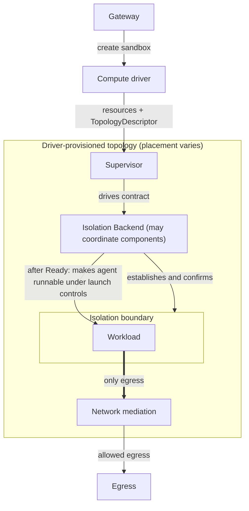

---
authors:
  - "@jganoff"
state: review
links:
  - https://github.com/NVIDIA/OpenShell/issues/1737
  - https://github.com/NVIDIA/OpenShell/pull/2048
  - https://github.com/NVIDIA/OpenShell/issues/899
  - https://github.com/NVIDIA/OpenShell/issues/981
  - https://github.com/NVIDIA/OpenShell/issues/1511
  - https://github.com/NVIDIA/OpenShell/issues/1650
  - https://github.com/NVIDIA/OpenShell/issues/1680
---

# RFC 0012 - Isolation Backend Interface

## Summary

OpenShell confines untrusted agent code with network, filesystem, syscall, and binary-identity controls. Today the supervisor process builds that boundary from inside the agent's container, placing isolation privilege beside the code it confines. This RFC moves boundary construction and operation behind one pluggable contract: the **Isolation Backend**.

The compute driver provisions the topology. The supervisor operates each active boundary through the Isolation Backend contract. Network mediation receives all workload egress, applies network policy, and records decisions. The topology may place these functions together or in separate trusted components.

The contract supports today's in-pod implementation path and delegated topologies behind the same interface. Each delegated backend is separate design and implementation work, not a supervisor fork.

## Motivation

Boundary construction is embedded in the supervisor, so moving it anywhere else means changing the supervisor. That placement creates three problems:

- A compromise reaches the boundary-building privilege in the same container.
- Restricted and multi-tenant clusters reject the deployment: building the boundary inline needs added Linux capabilities in the agent container that the `restricted` and `baseline` Pod Security Standards profiles refuse. The current capability set is pinned in [codebase-grounding.md](./codebase-grounding.md). (Tracked in #899.)
- Each new placement adds another branch to the supervisor.

All three come from coupling boundary construction to boundary operation. A common interface lets deployments move privilege without changing the supervisor.

## Non-goals

- **Implementing a delegated backend.** Each topology requires its own design and implementation.
- **Defining global authorization.** A separate proposal owns supervisor authorization. A delegated backend must still authenticate callers and scope them to one boundary.
- **Standardizing backend-internal component coordination.** A backend may coordinate helper, sidecar, or network-mediation processes behind one lifecycle; how those components cooperate is backend-specific, not contract surface.

## Proposal

Trusted deployment configuration and admission select a topology. The gateway asks a compute driver to create a sandbox environment; the driver provisions the selected topology and supplies the `TopologyDescriptor` to the supervisor. The supervisor resolves the descriptor's backend and calls it instead of platform-specific kernel primitives. The backend binds the trusted sandbox context, exposes network-mediation and process operations, confirms standing enforcement (the controls established independently of any workload process), and ensures the per-process launch-time controls are in force before agent code starts.

In the in-pod topology, the supervisor drives a backend implemented in the same process. Other topologies may delegate backend operations to helpers or shared services without changing the supervisor lifecycle.

This RFC uses five terms:

- **Topology:** the placement and arrangement provisioned by the compute driver.
- **Isolation boundary:** the effective network, filesystem, syscall, and binary-identity enforcement around the workload.
- **Supervisor:** the trusted role that operates an active boundary through the Isolation Backend contract, from `attach` until termination. Each active boundary has exactly one logical supervisor. The in-sandbox supervisor process hosts this role today; another topology may host it in another trusted component.
- **Isolation Backend:** the implementation selected by the topology descriptor and driven by the supervisor.
- **Network mediation:** the trusted function that receives outbound connections from processes inside the boundary, evaluates network policy using backend-supplied binary identity, forwards allowed traffic, and records network policy decisions. It may run with the supervisor or in another trusted component.


```mermaid
flowchart TB
    Gateway["Gateway"] -->|"create sandbox"| Driver["Compute driver"]

    subgraph Topology["Driver-provisioned topology (placement varies)"]
        Supervisor["Supervisor"]
        Backend["Isolation Backend (may coordinate components)"]
        Mediator["Network mediation"]
        subgraph Boundary["Isolation boundary"]
            Workload["Workload"]
        end

        Supervisor -->|"drives contract"| Backend
        Backend -->|"establishes and confirms"| Boundary
        Backend -->|"after Ready: makes agent runnable under launch controls"| Workload
        Workload ==>|"only egress"| Mediator
    end

    Driver -->|"resources + TopologyDescriptor"| Supervisor
    Mediator -->|"allowed egress"| Egress["Egress"]
```

A boundary is active from successful `attach` until its workload terminates and the backend releases the binding. A backend may coordinate multiple trusted helper or network-mediation processes for that boundary. `Ready` means every required component has reached its pre-launch condition. What the driver does with the resource afterward is outside this contract.

### Contract invariants

Six invariants hold for every boundary:

1. Workload egress is denied except through network mediation for the boundary's lifetime.
2. No untrusted instruction executes until every admitted control applicable to that process is in force.
3. The backend and network mediation authorize an operation only when the complete effective policy permits it; there is no silent weakening.
4. Agent activation, `exec`, and forwarding occur only through the active backend, and every workload process remains in the compute driver's provisioned execution environment.
5. Shared infrastructure preserves strict per-boundary lifecycle, policy, identity, enforcement, and cleanup isolation.
6. Loss of required enforcement ends `Running` and terminates all workload processes. Network-mediation unavailability denies outbound connections and never enables direct egress.

### Provisioning

Provisioning runs on the control plane, and three rules hold in every topology:

1. **Admission selects the topology** from trusted deployment configuration, not `SandboxPolicy`. The resulting `TopologyDescriptor` names the required backend, and resolution never falls back to another backend.
2. **The compute driver provisions the topology** and anything the selected backend needs.
3. **The backend establishes standing enforcement before untrusted code runs**, during provisioning or `attach`, depending on the backend.

A compute driver may provision a resource and `TopologyDescriptor` before the control plane assigns it to a sandbox. No untrusted workload runs while the resource is unassigned. After claim or assignment produces a trusted `SandboxContext`, the supervisor calls `attach`; the backend either binds that context to the prepared resource and returns `Bound`, or rejects it as incompatible. Pool creation, claim, reset, release, and recycling remain outside this contract.

### The topology descriptor

The driver supplies a descriptor for every provisioned topology, including in-pod and resources prepared before assignment. The common envelope names the backend and carries an opaque payload.

```rust
struct TopologyDescriptor {
    contract_version: u32,
    backend_name: String,
    payload: Vec<u8>,
}
```

`contract_version` is the Isolation Backend contract version. The descriptor is transport-neutral. Provisioning supplies it to the supervisor before `attach`; how it is transported is topology-specific and outside this contract, and every transport preserves one property: workload-controlled input cannot select or modify the descriptor.

The opaque payload identifies, or gives the backend enough information to resolve, the exact driver-provisioned resource. It may also carry topology-specific endpoint or helper-role information; there are no common topology or role fields.

Common verification requires:

- the descriptor's `backend_name` matches the backend required by the admitted topology;
- the descriptor and resolved factory versions equal the supervisor-supported contract version; and
- `SandboxContext` is constructed after the control plane assigns the resource to the admitted sandbox, using authenticated control-plane and trusted supervisor state.

The supervisor validates the descriptor's common fields and resolves its `backend_name` without fallback. `VerifiedTopologyDescriptor` does not imply that the opaque payload is valid; the selected backend validates it and atomically binds the provisioned resource to the trusted `SandboxContext` during `attach`. Any failure rejects the sandbox.

### The lifecycle

The contract adds no enforcement of its own; it standardizes how the supervisor drives whichever backend a deployment admits.

A backend registers a factory under a `backend_name`. The supervisor attaches to the admitted topology and drives the boundary through a fixed sequence of states. Each transition consumes the prior state, so the supervisor cannot skip a stage or invoke a later transition through an earlier handle. The Rust names are illustrative; the states and their semantics are normative.

```text
attach topology + sandbox context -> Bound -> confirm -> Ready -> start_agent -> Running
```

```rust
#[async_trait]
trait IsolationBackendFactory: Send + Sync {
    fn backend_name(&self) -> &str;
    fn contract_version(&self) -> u32;

    async fn attach(
        &self,
        descriptor: VerifiedTopologyDescriptor,
        sandbox: SandboxContext,
    ) -> Result<Box<dyn BoundBoundary>, BackendError>;
}

struct SandboxContext {
    sandbox_id: SandboxId,
    policy: SandboxPolicy,
    agent: AgentSpec,
}

#[async_trait]
trait BoundBoundary: Send {
    fn network_mediation_ingress(&self) -> Arc<dyn NetworkMediationIngress>;

    async fn confirm(
        self: Box<Self>,
    ) -> Result<Box<dyn ReadyBoundary>, BackendError>;
}

#[async_trait]
trait ReadyBoundary: Send {
    async fn start_agent(
        self: Box<Self>,
    ) -> Result<Box<dyn RunningBoundary>, BackendError>;
}

#[async_trait]
trait RunningBoundary: Send + Sync {
    fn agent(&self) -> Arc<dyn BoundaryProcess>;
    fn exec(&self) -> Arc<dyn BoundaryExec>;
    fn port_forward(&self) -> Arc<dyn BoundaryPortForward>;
}
```

`AgentSpec` carries the complete admitted agent launch specification, including command, arguments, working directory, timeout, and interactive mode.

`SandboxContext` carries the create-time policy baseline. After `Running`, network mediation continues to receive authorized policy revisions through its update path and applies them atomically to subsequent decisions. A revision that would change standing enforcement or launch-time controls is rejected.

The states have normative meanings:

- **Bound:** the topology descriptor and trusted sandbox context are bound to the same resource, and the network-mediation ingress is available. No untrusted workload code is running.
- **Ready:** the supervisor has initialized network mediation, the backend has confirmed standing enforcement, and the backend is prepared to ensure the admitted launch-time controls are in force before untrusted execution.
- **Running:** `start_agent` has made the admitted agent runnable and returned `RunningBoundary`. Every applicable launch-time control was in force before the first untrusted instruction. Whether the backend creates the agent process or releases a held, driver-provisioned execution object is backend-specific; the contract fixes the ordering, not the mechanism.

`attach` rejects a resource already bound to an active boundary. A backend that cannot enforce the complete admitted policy fails `attach` or `confirm`. How a backend confirms its `Ready` conditions is implementation-specific.

**Standing enforcement** is the set of controls established independently of a workload process. **Launch-time controls** are the per-process controls that must be in force before that process executes its first untrusted instruction. Both `start_agent` and every `BoundaryExec::exec` ensure this ordering for the process they start, and both preserve the provisioned execution environment. Which component applies a launch-time control is backend-specific; only the ordering is normative. If either operation does not return its success handle — including an unknown outcome — no untrusted process from that attempt may remain running.

`start_agent` is the sole operation that may make the admitted agent runnable. A driver-provisioned execution object is conformant only if it is bound to the active `SandboxContext` and admitted `AgentSpec`, cannot execute workload-controlled code before release, and carries no pre-launch authority that can bypass admitted controls. A cooperative wait inside workload-controlled agent code is not conformant.

`RunningBoundary::agent()` returns a handle for the admitted agent process. Processes started through `BoundaryExec` run in the same boundary and have their own process handles. Every workload process remains within the provisioned execution environment. Any exit of the admitted agent ends `Running`; the backend then terminates every remaining workload process within that environment and rejects further runtime operations, except `wait`, which returns each process's stable result.

### Runtime operations

```rust
#[async_trait]
trait BoundaryProcess: Send + Sync {  // the agent, or a process started via exec
    async fn wait(&self) -> Result<BoundaryExitStatus, BackendError>; // one stable result across repeated calls
    async fn signal(&self, signal: BoundarySignal) -> Result<(), BackendError>;
    async fn terminate(&self) -> Result<(), BackendError>;            // this process and its descendants
}

#[async_trait]
trait BoundaryExec: Send + Sync {
    async fn exec(&self, spec: ExecSpec) -> Result<ExecSession, BackendError>;
}

struct ExecSession {                              // owned; outlives the exec call
    process: Arc<dyn BoundaryProcess>,
    stdin: Option<BoundaryInput>,
    stdout: BoundaryOutput,                       // distinct from stderr for non-PTY exec
    stderr: Option<BoundaryOutput>,
    terminal: Option<Arc<dyn BoundaryTerminal>>,  // present when a PTY was requested
}

#[async_trait]
trait BoundaryPortForward: Send + Sync {
    async fn connect(&self, target: LoopbackTarget) -> Result<BoundaryDuplexStream, BackendError>;
}

#[async_trait]
trait BoundaryTerminal: Send + Sync {
    async fn resize(&self, cols: u16, rows: u16) -> Result<(), BackendError>;
}
```

`ExecSpec` carries command, arguments, environment, working directory, and PTY settings. Streams are owned, non-PTY stdout and stderr remain separate, and PTYs support resize. Port forwarding accepts only validated loopback targets. Exit status and signals are explicit and placement-neutral; a local PID is never the process handle. These operations carry the existing agent, SSH, exec, and forwarding paths behind the contract, and all of them are mandatory conformance.

### Network mediation

```rust
#[async_trait]
trait NetworkMediationIngress: Send + Sync {
    async fn accept(&self) -> Result<MediatedConnection, BackendError>;
}

struct MediatedConnection {
    stream: BoundaryDuplexStream,
    binary_identity: Result<BinaryIdentity, ResolveError>,
}
```

`NetworkMediationIngress` is the per-boundary source of outbound connections consumed by network mediation. Its transport and placement are backend-specific. The backend authoritatively associates each returned connection with the active boundary without relying solely on workload-provided data.

A `MediatedConnection` is an outbound connection from any process inside the boundary, delivered to network mediation before policy evaluation. Each carries the connection's byte stream and binary-identity resolution result. A failed `accept` yields no connection; the caller may retry.

Shared implementations isolate each boundary's state and enforcement. Failure or teardown of one boundary cannot weaken another. Network-mediation unavailability never enables direct egress.

### Binary identity

The backend resolves executable identity for every accepted connection and delivers the result on `MediatedConnection`, before network mediation evaluates policy.

```rust
struct BinaryIdentity {
    binary_path: PathBuf,               // absolute executable path
    binary_sha256: Option<Sha256Digest>,
    ancestors: Vec<PathBuf>,            // nearest first
    cmdline_paths: Vec<PathBuf>,        // diagnostic context; never authorizes
}
```

If binary identity cannot be resolved, the connection is denied. A missing digest is represented as `None`. How the backend resolves identity is implementation-specific.

Binary identity is mandatory conformance: RFC 0002 makes it part of the outbound-policy baseline. There is no capability flag and no mode that exempts a backend from resolving identity.

### The supervisor sequence

The supervisor keeps an in-tree registry from `backend_name` to factory. Adding a backend adds an implementation and a registration, not branches in the lifecycle, proxy, SSH, or session code. Delegated transports remain private to their factories.

The supervisor runs the same sequence for every backend:

1. Obtain the `TopologyDescriptor` and trusted `SandboxContext`.
2. Verify the descriptor and resolve its `backend_name` without fallback.
3. Call `attach` to obtain `Bound`.
4. Initialize network mediation with the boundary's `NetworkMediationIngress`.
5. Call `confirm` to obtain `Ready`, then `start_agent` to obtain `Running`.
6. Use the returned runtime handles for agent wait, `exec`, and port forwarding while network mediation consumes outbound connections.

### Failure semantics

Every failure carries a machine-readable kind for supervisor status mapping:

```rust
enum BackendErrorKind { Invalid, Denied, Unavailable, Failed, Terminated }
```

`Invalid` covers descriptor, version, and backend mismatches; `Denied` covers authenticated attachment rejection; `Unavailable` covers transient inability to serve an operation; `Failed` covers other backend faults; and `Terminated` reports abnormal boundary or workload loss, or an operation against an inactive boundary. An error never advances the lifecycle or authorizes an operation, and backend selection never falls back.

A backend may retry backend-private work within one `attach` call. The supervisor calls `attach` at most once per provisioned topology. If it does not return `Bound`—including an `Unavailable` or unknown outcome—the supervisor deprovisions that topology rather than reusing it or returning it to a pool. A later attempt starts with a newly provisioned descriptor.

Failure observation needs no separate watcher:

- an `attach` or `confirm` failure, or network-mediation initialization failure while `Bound`, prevents untrusted workload execution and causes the driver to reclaim the topology;
- if `start_agent` does not return `Running`, no untrusted process from that attempt remains, and the driver reclaims the topology;
- after `Running`, backend-detected loss of required enforcement ends `Running`, terminates all workload processes, and makes the agent process's `wait` operation return `Terminated`;
- network-mediation errors yield no authorized connection and do not by themselves end `Running`; and
- retained runtime handles reject new operations after `Running` ends, except `wait`, which returns its stable result.

On normal agent exit, `wait` returns the stable exit status; after `Running` ends, the compute driver may deprovision the topology.

Component restart handling is backend-specific. An active boundary must retain one logical supervisor and continue to satisfy the contract's binding and enforcement guarantees.

### Topologies

The contract fixes the roles; a topology fixes their placement. The supervisor, network mediation, and backend components may be co-located with the workload, split across components the backend coordinates, or hosted in shared trusted services — the lifecycle, interfaces, and invariants are identical in every arrangement. What containment a placement achieves depends on the kernel relationship between the workload and the trusted components relied on for containment. The non-normative [topology matrix](./topology-matrix.md) catalogs representative placements.

## Implementation plan

This RFC defines the contract; implementation lands in three phases:

1. **Contract.** Add the common types, descriptor handling, registry, and explicit backend selection from deployment configuration.
2. **Co-located backend.** Implement the co-located backend and route agent launch, network mediation, SSH, `exec`, and forwarding through it without changing behavior.
3. **Conformance and enablement.** Add the shared conformance tests — version agreement, lifecycle ordering, process semantics, confirmation, identity failure, execution-environment preservation, and boundary termination — and enable the co-located backend after parity validation. Parity covers the agent, SSH, `exec`, and forwarding paths; enablement also closes the in-pod egress gaps pinned in [codebase-grounding.md](./codebase-grounding.md), which parity alone would preserve.

Delegated backends remain separate design and implementation work.

## Risks

| Risk | Mitigation |
|---|---|
| The Isolation Backend could duplicate compute-driver responsibilities or allow topology-specific behavior to leak back into the supervisor. | Keep the responsibility boundary explicit: the compute driver provisions and deprovisions the topology; the backend binds and operates the active boundary. The same component may implement both roles. |
| Contract conformance could be mistaken for equivalent isolation across topologies. | Treat conformance as behavioral, not as a security-strength rating. Document and validate each topology's actual containment and reject policy it cannot enforce. |
| Shared backend or network-mediation components concentrate privilege and failure impact. | Isolate state, connection attribution, enforcement, and control authority per boundary. Failure of one boundary must not weaken another or enable direct egress. |
| The mandatory contract may exclude otherwise useful but incomplete backends. | Keep network mediation, binary identity, process control, `exec`, and port forwarding mandatory. An incomplete backend does not claim conformance or silently degrade. |
| A future topology may not fit the lifecycle or interfaces. | Keep placement and coordination backend-private. Add versioned contract surface only when a concrete implementation requires new common semantics. |
| A component restart may interrupt boundary operation. | A backend may preserve an active boundary only while it retains one logical supervisor and valid enforcement and runtime-handle semantics; otherwise it terminates the boundary. |

## Alternatives

### Keep isolation embedded in the supervisor

OpenShell could keep the current in-pod design and add topology-specific supervisor and compute-driver paths as new requirements arise.

Doing nothing avoids a new interface, but retains privileged boundary construction beside the workload. Implementing each delegated topology as a one-off supervisor change moves that privilege for one placement but accretes topology-specific supervisor behavior. The proposed contract instead keeps one supervisor lifecycle while allowing the topology to change.

### Extend the compute-driver contract

The compute driver could own both provisioning and active-boundary operation.

This is natural for topologies such as MXC, and the same component may implement both responsibilities. The interfaces remain distinct because they serve different callers and lifecycles: the gateway uses the compute driver to provision and deprovision resources, while the supervisor uses the Isolation Backend to operate an active boundary. Combining them would couple runtime policy, identity, network mediation, and process operations to the gateway-facing driver API.

### Define a remote backend service

OpenShell could define a gRPC service or plugin ABI for Isolation Backends instead of an in-process Rust contract.

That would make process separation and out-of-tree implementations explicit, but it would also standardize transport, authentication, state recovery, and protocol versioning even though those requirements vary by topology. The proposed factory contract supports co-located implementations directly and allows delegated implementations to hide their transport behind the same interface.

### Standardize topology and capabilities

The contract could expose common topology roles, placement fields, capability flags, and recovery behavior so the supervisor can compose backend components.

That would make known deployments explicit, but it would also encode current topology assumptions and introduce capability-dependent supervisor paths. The proposal keeps placement and coordination in the opaque descriptor, requires one baseline contract, and uses the non-normative topology matrix to document representative arrangements.

## Prior art

- **Driver-backed subsystems (CRI/CNI/CSI).** Kubernetes factors runtime, networking, and storage into pluggable driver contracts so the orchestrator drives one interface while implementations vary. RFC 0001 describes OpenShell's other subsystems the same way; this RFC specifies the one it left open: isolation.
- **Istio privilege placement.** Init-sidecar and node-agent modes demonstrate that network setup can move without changing the policy data path. OpenShell keeps its identity-aware proxy.
- **CRI exec/attach/port-forward.** `exec` and `connect` follow CRI's `Exec` and `PortForward` shape; lifecycle and network mediation remain OpenShell-specific.

## Open questions

None.

## Appendix: codebase grounding

The claims this RFC makes about the current system, and the current-system
context behind its design, are verified with file:line references in the
supporting file [codebase-grounding.md](./codebase-grounding.md)
(against `origin/main` at commit `8eacb477`, post sidecar topology landing).
