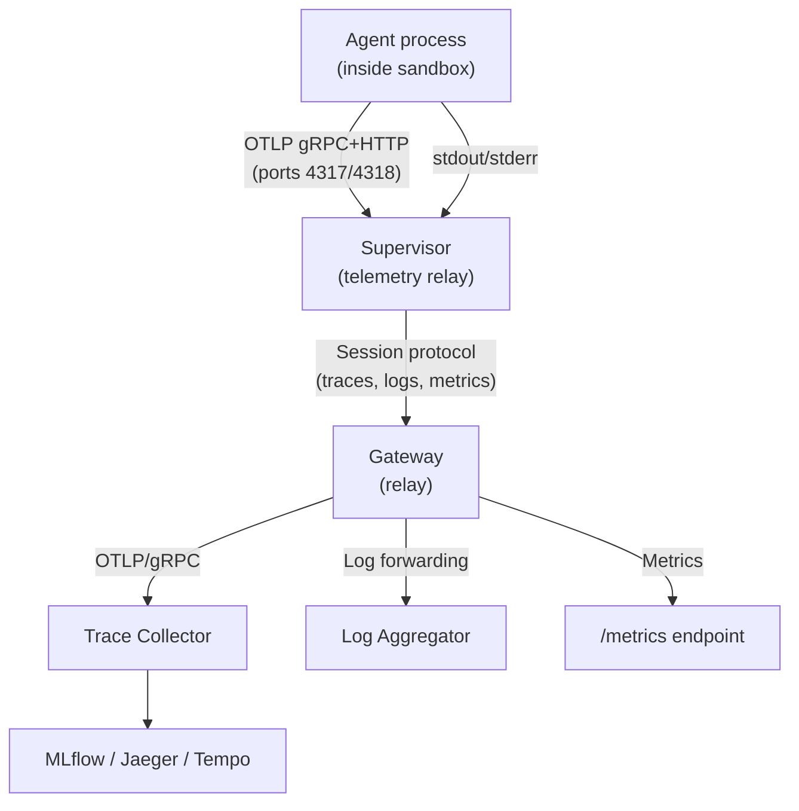
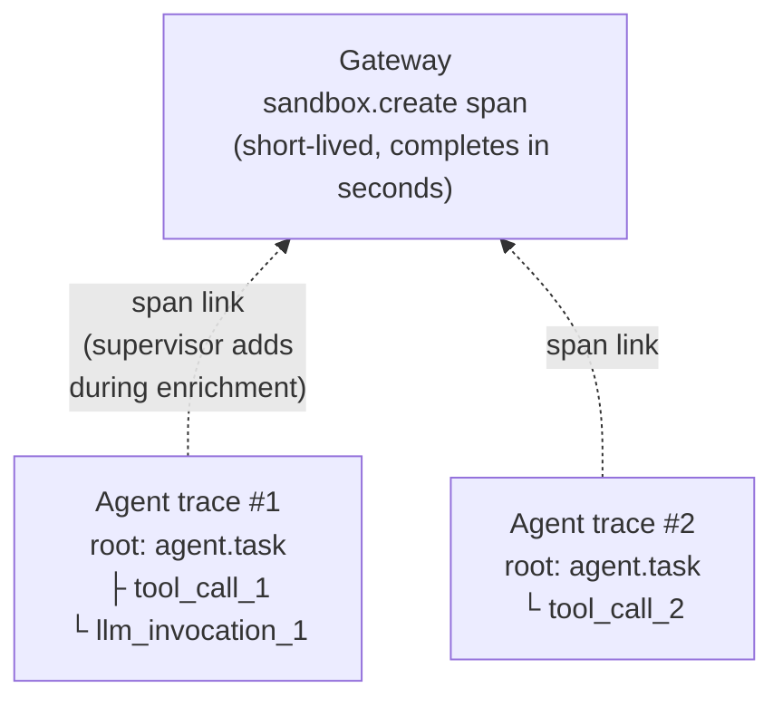

---
authors:
  - "@rhuss"
state: draft
links:
  - https://github.com/NVIDIA/OpenShell/issues/1055
  - https://github.com/NVIDIA/OpenShell/issues/2507
  - https://github.com/NVIDIA/OpenShell/issues/2508
  - https://github.com/NVIDIA/OpenShell/issues/909
---

# RFC 0012 - OpenShell observability architecture

## Summary

This RFC proposes a unified observability architecture for OpenShell covering tracing, logging, and monitoring. OpenShell observability splits into two distinct layers: infrastructure-level and agent-level. Infrastructure-level observability covers the platform itself (gateway request traces, compute driver lifecycle, supervisor network decisions, Open Cybersecurity Schema Framework (OCSF) security events, Prometheus metrics). Agent-level observability covers what happens inside sandboxes (tool calls, LLM invocations, reasoning steps from frameworks like LangChain or CrewAI).

On the infrastructure side, contributions have started building coverage. OpenTelemetry Protocol (OTLP) trace export merged for the gateway and VM driver, OCSF structured logging covers security events, and Prometheus metrics provide basic request counting. This RFC extends that to the remaining components (in-process compute drivers, CLI, sandbox supervisor) and adds deployment configuration (Helm values, ServiceMonitor), OCSF-to-OTel correlation, and a metrics maturity path.

On the agent side, the problem is harder: sandboxes are network-isolated, so an agent's OpenTelemetry (OTel) SDK cannot reach an external collector, OCSF security events stay local with no centralized collection path ([#1922](https://github.com/NVIDIA/OpenShell/issues/1922)), and Prometheus cannot scrape metrics from inside isolated sandboxes. This RFC proposes a supervisor-local telemetry relay as the solution. The supervisor acts as a sidecar that mediates all observability data between the isolated sandbox and the platform. For traces, it listens on standard OTLP ports, collects agent-emitted spans, enriches them with sandbox context, and forwards them through the gateway to an external collector. The same relay channel carries OCSF log batches for centralized collection and can push sandbox-level metrics to the gateway.

Tracing receives the most architectural attention in this RFC because it requires the most novel design (the relay, span links, enrichment pipeline). Logging and metrics build on existing foundations (OCSF is already designed, Prometheus is already wired) and extend through the same relay channel without needing separate architecture.

## Motivation

Operating OpenShell at scale requires answering questions that span multiple layers. A platform operator needs to know why sandbox creation is slow. A security reviewer needs to correlate a network deny event with the request that triggered it. An agent developer needs to see their agent's tool calls and LLM invocations in MLflow without writing OpenShell-specific instrumentation. A platform integrator needs a clean contract for wiring OpenShell into their monitoring stack.

OpenShell's observability story is still early. That is expected for a project at this stage, and contributions have made real progress. OTLP trace export merged for the gateway ([#2534](https://github.com/NVIDIA/OpenShell/pull/2534)) and VM driver ([#2564](https://github.com/NVIDIA/OpenShell/pull/2564)), with a shared `openshell-otel` crate ([#2567](https://github.com/NVIDIA/OpenShell/pull/2567)). OCSF structured logging covers security events in the sandbox. Prometheus metrics provide basic gateway request counting ([#920](https://github.com/NVIDIA/OpenShell/pull/920)). These are reasonable starting points, but the gaps are significant enough that the next contributions need a coherent target rather than growing ad hoc:

- Tracing coverage beyond the gateway and VM driver. The sandbox supervisor, in-process compute drivers (K8s, Docker, Podman), CLI, and Helm chart have no OTel integration yet.
- No connection between OCSF security events and traces. An operator cannot pivot from a network deny event to the trace that caused it.
- The metrics catalog proposed in [#909](https://github.com/NVIDIA/OpenShell/issues/909) (16 families, 3 priority tiers, Service Level Indicator/Service Level Objective (SLI/SLO) definitions) is mostly unimplemented beyond the initial wiring. No ServiceMonitor, dashboards, or alerting rules exist.
- No centralized collection for sandbox logs. OCSF security events are generated inside the sandbox but stay local. Agent stdout/stderr is captured by the process supervisor but has no path to a log aggregator. [#1922](https://github.com/NVIDIA/OpenShell/issues/1922) tracks this and is currently stale.
- No collection mechanism for agent-level traces (tool calls, LLM invocations, reasoning steps from frameworks like LangChain or CrewAI running inside sandboxes). The sandbox is network-isolated, so an agent's OTel SDK cannot reach an external collector.

[#1055](https://github.com/NVIDIA/OpenShell/issues/1055) tracks the overall enterprise observability effort. If the current design is left unchanged, platform operators cannot debug latency or failures across the gateway/driver/sandbox stack, agent developers cannot get their traces into MLflow without workarounds, and the three observability pillars remain disconnected.

### Personas

The personas below are proposed, not settled. OpenShell's persona model is evolving (see PR [#2615](https://github.com/NVIDIA/OpenShell/pull/2615) for ongoing work on centering issue reports around user stories). This RFC uses five personas as a lens for reasoning about observability needs, but the final definitions should be driven by the broader project discussion.

| Persona | Role | Observability needs |
|---|---|---|
| **Platform operator** | Deploys and operates the gateway cluster, manages compute drivers, monitors platform health | Distributed traces, SLI/SLO dashboards, alerting rules, Prometheus Rate/Errors/Duration (RED) metrics. Tools: Grafana, Jaeger/Tempo, Prometheus/Alertmanager |
| **Security/compliance reviewer** | Reviews audit logs, investigates security events, ensures policy compliance | OCSF JSONL events, trace-to-OCSF correlation. Tools: log aggregation (Loki, Elasticsearch, Splunk) |
| **Agent developer** | Runs agents in sandboxes, debugs agent behavior, optimizes performance | Agent-level traces in MLflow or similar, with infrastructure context (sandbox, policy). Note: agent traces are a separate visibility domain from operator-only infrastructure traces per [#2508](https://github.com/NVIDIA/OpenShell/issues/2508) |
| **Workspace administrator** | Manages a workspace (namespace, tenant) in a multi-tenant deployment | Per-workspace metrics: sandbox counts, policy violation rates, resource utilization |
| **Platform integrator** | Integrates OpenShell into a larger platform (managed K8s, cloud AI platform, on-prem) | Documented OTLP endpoint contracts, resource attribute schemas, Helm values, integration guides. Tools: OTel Collector config, Helm values |

## Non-goals

This RFC does not propose OTel log export. Logs continue to go to stdout and OCSF JSONL, since container-level log collection already handles operational logs and adding a parallel OTLP path would not add clear value. The architecture does not preclude it later if a need emerges.

OpenShell does not deploy an OTel Collector. The platform integrator owns the collector; OpenShell only emits OTLP to a configured endpoint.

OTLP metrics push is planned as an opt-in complement to Prometheus but is not part of the initial scope. Similarly, TUI and router tracing are future items (the TUI consumes monitoring data, it does not produce it), and Python SDK OTel hooks are tracked separately in [#1818](https://github.com/NVIDIA/OpenShell/issues/1818).

The personas proposed in this RFC are a reasoning tool for the observability discussion, not settled project-wide definitions. That broader conversation is happening separately.

## Proposal

The proposal is organized around the current state, the two visibility domains (infrastructure vs. agent), the supervisor telemetry relay (which carries traces, logs, and metrics out of isolated sandboxes), the supporting mechanisms (span links, enrichment, OCSF correlation), the log and metrics relay extensions, infrastructure instrumentation for the remaining components, deployment configuration, and multi-tenant considerations.

### Current state

Tracing coverage today is limited to the gateway and VM driver. Both gained OTLP trace export through three merged PRs, with a shared `openshell-otel` crate providing the common infrastructure. Everything else has no OTel integration. Tracing is configured through `[openshell.gateway.otlp]` in `gateway.toml`, where the table's presence acts as the on-switch.

| Component | OTLP Traces | W3C Propagation | Status |
|---|---|---|---|
| Gateway server | Per-request spans, gRPC conventions | Inbound + outbound to drivers | Merged ([#2534](https://github.com/NVIDIA/OpenShell/pull/2534)) |
| VM driver | Per-RPC spans, lifecycle ops | Receives from gateway | Merged ([#2564](https://github.com/NVIDIA/OpenShell/pull/2564)) |
| `openshell-otel` crate | Shared provider, layer, error helpers | `TraceContextInterceptor` | Merged ([#2567](https://github.com/NVIDIA/OpenShell/pull/2567)) |
| In-process drivers (K8s embedded/sidecar, Docker, Podman) | None | N/A (in-process) | Gap |
| Sandbox supervisor | None | None | Gap |
| CLI | None | None | Gap |
| Agent traces from inside sandbox | None | N/A | Gap (new) |

On the logging side, OpenShell has two systems serving distinct purposes. Human-readable operational logs go to stdout via `tracing_subscriber::fmt`. Security-relevant events are captured by the OCSF structured logging system (`openshell-ocsf`), which emits both a shorthand format (always on) and full JSONL records (opt-in). OCSF covers network decisions, HTTP/L7 enforcement, SSH authentication, process lifecycle, security findings, configuration changes, and application lifecycle. OCSF runs on both the sandbox side (network decisions, process lifecycle, security findings) and the gateway side (TLS events, service routing, policy operations). Centralized sandbox log collection remains an unsolved problem (see Log relay section below).

For monitoring, the Prometheus wiring is in place: a `metrics` crate facade, a dedicated `/metrics` endpoint, and Helm chart port 9090 exposed. Basic gRPC/HTTP RED metrics and gateway interceptor metrics are implemented and working. The broader catalog proposed in [#909](https://github.com/NVIDIA/OpenShell/issues/909), which defines 16 metric families across three priority tiers along with SLI/SLO definitions, is mostly unimplemented. The sandbox supervisor has no metrics at all, and there are no ServiceMonitor CRDs, dashboards, or alerting rules.

### Visibility domains

Two distinct visibility domains flow through the same OTLP relay pipeline:

1. **Infrastructure traces** (operator-only): gateway request spans, driver lifecycle, supervisor network/process/middleware spans. Locked as operator-only per [#2508](https://github.com/NVIDIA/OpenShell/issues/2508).
2. **Agent traces** (agent developer): tool calls, LLM invocations, reasoning steps from agent frameworks inside sandboxes. Routable to a separate backend (e.g., MLflow) from infrastructure traces (e.g., Tempo).

The platform integrator configures this routing at the collector level (e.g., route spans with `openshell.sandbox.*` attributes to MLflow, route spans with `openshell-gateway` service name to Tempo). OpenShell emits both to the same OTLP endpoint; the collector separates them.

### Supervisor as telemetry relay

The sandbox supervisor (hereafter "supervisor") acts as a telemetry sidecar for the isolated sandbox, mediating traces, logs, and metrics between the sandbox and the platform. The session protocol between supervisor and gateway provides the transport for all three pillars.

For traces, the supervisor listens on standard OTLP ports inside the sandbox, accepting both gRPC (port 4317) and HTTP (port 4318). Agent frameworks export traces to this address. The supervisor buffers, optionally enriches, and forwards spans to the gateway over the existing session protocol. The gateway relays them to the configured external OTLP endpoint.



The supervisor:

1. Accepts OTLP spans from the agent process (both gRPC and HTTP protocols, matching standard OTel Collector receiver behavior)
2. Buffers in memory (bounded, with explicit drop semantics matching [#2508](https://github.com/NVIDIA/OpenShell/issues/2508)'s transport design)
3. Optionally enriches spans with sandbox resource attributes (see span enrichment below)
4. Forwards to the gateway over the existing session protocol
5. Flushes buffered spans before shutdown, surviving agent process termination

The gateway:

1. Receives spans from supervisors via the session protocol
2. Relays to the configured external OTLP endpoint alongside its own spans
3. Applies sampling if configured

For agents, the experience is: `OTEL_EXPORTER_OTLP_ENDPOINT` is set automatically in the sandbox environment, pointing at the supervisor's OTLP receiver. Any OTel-instrumented framework works without OpenShell-specific code.

The relay also creates a clean separation of concerns between three roles. The agent developer exports to a fixed, auto-injected endpoint and never thinks about collector topology, authentication, or routing. The same agent code works in every sandbox, every deployment, every workspace. The workspace administrator decides where their workspace's telemetry goes (which collector, which MLflow instance, what sampling rates) without touching agent configuration. The global administrator configures the default OTLP endpoint and platform-wide policies like rate limits and enrichment. With direct collector access, the agent developer would need to know the collector address, and that address varies by deployment and workspace. The relay makes observability routing an operational concern rather than a development one.

### OTLP receiver reachability per driver

All container-based drivers share a networking subtlety that affects how the OTLP receiver is reached. The supervisor creates an internal workload network namespace for the agent process, connected to the supervisor's namespace via a veth pair. The proxy already binds to the host-side veth IP (available from `netns.host_ip()`) to intercept agent traffic. This means `localhost` inside the agent's network namespace is not the same `localhost` the supervisor sees.

The OTLP receiver cannot simply bind to `127.0.0.1:4318` and expect the agent to reach it. It needs to follow the same pattern as the proxy: bind to the veth host IP that is routable from inside the workload netns. The supervisor then sets `OTEL_EXPORTER_OTLP_ENDPOINT=http://<veth-host-ip>:4318` in the agent's environment rather than `http://localhost:4318`.

How this plays out per driver:

| Driver | Supervisor-agent network relationship | OTLP receiver binding |
|---|---|---|
| Docker | Same container, but agent enters a separate workload netns via `setns()` | Bind to `netns.host_ip():4318` (same IP the proxy uses). Reachable from agent in the workload netns. |
| Podman | Identical to Docker | Same as Docker |
| K8s (embedded) | Supervisor side-loaded into agent container, same single-container model | Same as Docker |
| K8s (sidecar) | Network sidecar + agent container share the pod network namespace. Sidecar uses nftables for interception, no separate workload netns. | Bind to `localhost:4318` directly. This is the simplest case because the agent process stays in the pod's shared network namespace. |
| VM | Supervisor is PID 1 inside a libkrun microVM, agent is a child process | Same as Docker (within the VM). The VM itself is isolated from the host; traces leave the VM through the supervisor-to-gateway session protocol, not through host networking. |

In practice, the OTLP receiver reuses the same networking plumbing the proxy already uses. The proxy binds to the veth host IP; the OTLP receiver binds to the same IP on a different port. The infrastructure for making a supervisor-hosted service reachable from the agent process already exists, and the OTLP receiver is just another listener on that address.

The K8s sidecar topology is the exception. Because it uses nftables-based traffic interception in the pod's shared network namespace rather than creating a separate workload netns, `localhost` is truly shared between the supervisor and agent. Binding to `localhost:4318` works directly.

This pattern follows [Dapr](https://dapr.io)'s [sidecar](https://docs.dapr.io/concepts/dapr-services/sidecar/) approach, where a co-located proxy intercepts application communication and generates distributed traces through an [OTLP collector](https://docs.dapr.io/operations/observability/tracing/otel-collector/open-telemetry-collector/) without requiring application-level instrumentation. The agent exports to a local address; the supervisor handles buffering, enrichment, and forwarding.

### Span links for sandbox-to-trace correlation

Agent traces from inside the sandbox are correlated with gateway infrastructure traces via [span links](https://opentelemetry.io/docs/concepts/signals/traces/#span-links), not parent-child relationships.



Sandbox lifetimes are unpredictable. A CI sandbox runs for 30 seconds, an interactive sandbox might live for hours, a persistent dev environment could run for days. A gateway-owned parent span that lives for the entire sandbox lifecycle is an antipattern: the batch exporter won't export it until the sandbox terminates, trace backends assume traces complete within a time window, and the gateway holds the open span in memory for every concurrent sandbox.

Span links create a "related to" relationship without parent-child hierarchy. The gateway creates a short-lived `sandbox.create` span (completes in seconds, exported immediately), and the supervisor adds a span link from each agent root span to that gateway span during enrichment. Backends like Jaeger and Grafana Tempo navigate links bidirectionally.

For batch/CI sandboxes where a single task maps to the entire sandbox lifetime, the supervisor can optionally create a short task-scoped parent span and pass it via `TRACEPARENT`. This keeps the parent-child relationship for the simple case without the long-lived trace antipattern.

[#2508](https://github.com/NVIDIA/OpenShell/issues/2508)'s "Not settled" section discusses injecting `traceparent` into agent outbound HTTP requests (propagation outward). The span link pattern here is correlation inward, connecting agent traces to sandbox context. These are complementary decisions.

### Configurable span enrichment at the supervisor

When forwarding agent-emitted spans, the supervisor attaches sandbox context as resource attributes:

| Attribute | Source | Example |
|---|---|---|
| `openshell.sandbox.id` | Sandbox metadata | `sb-abc123` |
| `openshell.sandbox.policy` | Active policy name | `default-policy` |
| `openshell.sandbox.user` | Authenticated user | `user@example.com` |
| `openshell.sandbox.image` | Container image | `ubuntu:22.04` |
| `openshell.sandbox.driver` | Compute driver type | `kubernetes` |
| `openshell.workspace.id` | Workspace/tenant identifier | `ws-prod-team-a` |

Enrichment is configurable and can be disabled for pass-through forwarding. Without enrichment, an operator sees "LangChain called tool X" but cannot tell which sandbox, user, or policy was active. With enrichment, the trace carries full context without the agent needing any OpenShell-specific instrumentation.

### OCSF-to-OTel correlation

When a trace context is active, OCSF events include `trace_id` and `span_id` fields. This lets operators pivot between "I see a network deny in the security log" and "show me the trace that triggered it."

The OCSF builders already accept arbitrary fields. Add optional `trace_id`/`span_id` fields to the builder pattern, populated from the current `tracing::Span` when available. [#2508](https://github.com/NVIDIA/OpenShell/issues/2508) sub-issue 5 ("OCSF correlation") tracks this but has not defined the mechanism.

### Log relay for centralized sandbox collection

The same session protocol transport that carries trace batches can carry log data from the sandbox to the gateway, solving the centralized log collection problem ([#1922](https://github.com/NVIDIA/OpenShell/issues/1922)).

The supervisor has access to two log sources inside the sandbox: OCSF JSONL events (security-relevant structured events, already generated by the OCSF subsystem) and agent process stdout/stderr (operational output captured by the process supervisor). Today both stay local. The log relay forwards them to the gateway, which exposes them to the platform's log aggregation infrastructure.

Unlike the trace relay, the log relay does not need an OTLP receiver. OCSF events are generated internally by the supervisor, and agent stdout/stderr is already captured as part of process management. The relay adds a new session protocol message type for log batches, alongside the trace batch message from Phase 2. The gateway forwards received log batches to a configured log endpoint or makes them available for scraping.

Log enrichment follows the same pattern as span enrichment: the supervisor attaches sandbox resource attributes (`openshell.sandbox.id`, `openshell.workspace.id`, etc.) to log records before forwarding. This gives operators the context they need to filter and correlate logs across sandboxes and workspaces.

The OCSF-to-OTel correlation described above complements this: when OCSF events carry `trace_id`/`span_id` fields, an operator can follow a log record into the trace that produced it, even after the logs have been forwarded to a separate aggregation backend.

### Metrics relay for sandbox monitoring

The sandbox is network-isolated, so Prometheus cannot scrape supervisor metrics directly. The supervisor can push sandbox-level metrics to the gateway via the session protocol, and the gateway can aggregate them into its own `/metrics` endpoint or forward them via OTLP metrics push.

Candidate sandbox metrics include: agent process CPU and memory usage, OTLP relay buffer depth and drop counts, active network connections, policy evaluation latency, and middleware call duration. These would appear with sandbox resource labels so operators can break down by sandbox, workspace, or driver.

This is lower priority than the trace and log relays. The gateway-level metrics from [#909](https://github.com/NVIDIA/OpenShell/issues/909) provide platform-wide visibility, and per-sandbox metrics add value mainly for capacity planning and debugging individual sandbox performance issues. The metrics relay can be deferred to a later phase without blocking the overall observability architecture.

### Infrastructure trace instrumentation

The K8s, Docker, and Podman compute drivers run in-process within the gateway by default and inherit its tracing subscriber. K8s and Podman also have standalone gRPC binary entry points for external deployment, but the in-process path is the current default. What these drivers lack are explicit `#[tracing::instrument]` annotations that would create spans for driver operations like provisioning, teardown, status checks, and exec. The VM driver is the reference here, with 15 instrumented operations (9 via `#[tracing::instrument]`, 6 via `.instrument()`) and `ErrorStatusGuard` for error marking. [#2507](https://github.com/NVIDIA/OpenShell/issues/2507) notes these drivers are expected to migrate to external gRPC services eventually, at which point they will need their own `SdkTracerProvider` and W3C propagation, but the in-process annotations are still the right starting point.

The CLI currently does not inject `traceparent` into its gRPC calls to the gateway, which means CLI-initiated operations start new traces at the gateway rather than continuing a trace from the user's command. Adding optional OTLP export (via `--otlp-endpoint` or `OTEL_EXPORTER_OTLP_ENDPOINT`), wiring `TraceContextInterceptor` onto the gRPC channel, and creating a root span per CLI command would close this gap. The gateway already knows how to extract incoming `traceparent`, so the connection happens automatically.

The sandbox supervisor has zero OTel integration today, the largest gap in the stack. [#2508](https://github.com/NVIDIA/OpenShell/issues/2508) scopes this into network spans (L4 connect, Open Policy Agent (OPA) evaluation, L7 enforcement, credential injection, middleware calls), middleware spans (operator-run gRPC services with real cross-service tracing value), and process spans (entrypoint lifecycle, exec, SSH sessions). All of these route supervisor -> gateway -> collector per [#2508](https://github.com/NVIDIA/OpenShell/issues/2508)'s settled design decision.

### Deployment configuration

Today, none of the deployment surfaces (Helm, Docker Compose, RPM) include OTLP configuration.

The gateway's `gateway.toml` needs an OTLP section:

```toml
[openshell.gateway.otlp]
endpoint = "http://otel-collector.monitoring:4317"
service_name = "openshell-gateway"
```

The Helm chart needs corresponding values that template into the ConfigMap:

```yaml
otlp:
  enabled: false
  endpoint: ""
  serviceName: "openshell-gateway"
```

When these values are set, the chart should also pass `OTEL_EXPORTER_OTLP_ENDPOINT` and `OTEL_RESOURCE_ATTRIBUTES` as environment variables to the gateway container. Docker Compose's example `gateway.toml` should include a commented-out OTLP section so operators can see the option and enable it. The published configuration reference at `docs/reference/gateway-config.mdx` needs to document the OTLP settings.

OpenShell is collector-agnostic. The Helm chart does not deploy an OTel Collector. Every deployment context (managed Kubernetes, standalone cluster, Docker Compose, bare metal) has its own collector topology, and bundling one would couple OpenShell to a particular backend while creating operational overlap with platform-level monitoring infrastructure.

### Multi-tenant observability

Multi-tenant deployments need per-workspace observability isolation. Different workspaces may route agent traces to different collectors or MLflow instances, and one tenant's trace data must not leak to another's endpoint.

The OTLP relay supports this through per-workspace OTLP endpoint configuration at the gateway. When a supervisor forwards spans, the gateway looks up the workspace's configured endpoint and routes accordingly. If no per-workspace endpoint is configured, spans go to the global default. The `openshell.workspace.id` resource attribute (added during span enrichment) enables collector-side routing for deployments that use a shared collector with attribute-based routing rather than per-workspace endpoints.

Per-workspace sampling and rate limits follow the same pattern as per-sandbox limits described in the Risks section, but scoped to the workspace level. A noisy workspace should not exhaust the gateway's relay capacity for other tenants.

The configuration model for per-workspace OTLP endpoints is not yet designed. Options include extending `gateway.toml` with per-workspace sections, using workspace-level CRDs, or deriving the endpoint from the workspace settings API. This decision depends on how workspace configuration is structured more broadly, which is outside the scope of this RFC but must be resolved before Phase 2 implementation.

### Metrics direction

Metrics remain Prometheus-first. The tracing architecture above is the primary focus of this RFC; the metrics path is included here because it is part of the observability scope, but the work is largely independent.

Priority order:

1. Complete P0 metrics from [#909](https://github.com/NVIDIA/OpenShell/issues/909) (supervisor sessions, sandbox phase, relay)
2. Add Helm ServiceMonitor (gated, off by default)
3. P1 metrics (SSH, compute driver, DB, policy)
4. Dashboards and alerting rules
5. OTLP metrics push (opt-in complement)

## Implementation plan

The implementation is phased to manage dependencies. Phase 1 extends existing tracing to the remaining infrastructure components and requires no new transport mechanisms. Phase 2 introduces the OTLP relay (the architecturally new piece) and depends on the session protocol restructuring in [#1731](https://github.com/NVIDIA/OpenShell/issues/1731). Phase 3 deepens supervisor instrumentation using the relay transport from Phase 2. Phase 4 covers monitoring maturity and can run in parallel with the other phases.

### Phase 1: Core instrumentation

This phase extends gateway and VM driver tracing to the remaining infrastructure components. None of it requires new transport mechanisms or the OTLP relay. It builds on what exists and unblocks end-to-end tracing from the CLI through the gateway to any compute driver.

The K8s, Docker, and Podman drivers are the easiest starting point because they run in-process within the gateway by default and already inherit its tracing subscriber. The work is adding `#[tracing::instrument]` annotations to operations like provisioning, teardown, status checks, and exec, following the VM driver as a reference. Because these drivers are in-process, they share the gateway's OTLP exporter and need no separate provider setup or W3C propagation. Instrument the `ComputeDriver` trait implementations in `crates/openshell-driver-kubernetes/`, `crates/openshell-driver-docker/`, and `crates/openshell-driver-podman/`, and the resulting spans appear as children of the gateway's request span automatically.

The CLI is a different problem. The gap and building blocks are described in the Infrastructure trace instrumentation section. Wiring them together means adding a `--otlp-endpoint` flag (or respecting `OTEL_EXPORTER_OTLP_ENDPOINT`), building a `SdkTracerProvider` using the shared `openshell-otel` crate, creating a root span per CLI command, and attaching the interceptor to the CLI's gRPC channel. Once connected, a trace initiated by `openshell sandbox create` flows from the CLI through the gateway into whatever driver handles the request.

On the deployment side, the Helm and TOML configuration described in the Deployment configuration section needs to land. The integration surface is `deploy/helm/openshell/templates/` where the ConfigMap is generated and the StatefulSet picks up environment variables. Docker Compose's example `gateway.toml` should include a commented-out OTLP section, and the published docs at `docs/reference/gateway-config.mdx` need to cover the OTLP configuration.

### Phase 2: Sandbox OTLP relay

This is the architecturally new work. It introduces a trace collection path from inside network-isolated sandboxes to the external collector. The relay design is described in the Proposal section; this section focuses on where the code changes land and what depends on what.

The supervisor needs an OTLP listener on ports 4317 (gRPC) and 4318 (HTTP), bound to the address reachable from the agent process (the veth host IP for container-based drivers, localhost for K8s sidecar; see OTLP receiver reachability). The implementation choice is between using the `opentelemetry-proto` crate to implement the receiver from scratch (smaller binary, more control) or embedding a lightweight collector library (more features, larger dependency). Either way, the receiver accepts `ExportTraceServiceRequest` messages, validates them, and places them in a bounded in-memory buffer. The supervisor sets `OTEL_EXPORTER_OTLP_ENDPOINT` in the agent process environment automatically, pointing at the correct address.

Getting those buffered spans to the gateway is the harder part. [#2508](https://github.com/NVIDIA/OpenShell/issues/2508) sub-issue 1 tracks this and it depends on [#1731](https://github.com/NVIDIA/OpenShell/issues/1731), which restructures the supervisor-to-gateway session protocol. A new message type would carry serialized OTLP span batches from the supervisor to the gateway over the session event stream between `crates/openshell-sandbox/` and `crates/openshell-server/`. Drop semantics need explicit design: what happens when the session is down, when the buffer fills up, and whether partial traces are emitted or discarded. This is the hardest integration point in the entire proposal because it touches the session protocol, which is shared infrastructure.

On the gateway side, the relay receives span batches from supervisors and forwards them to the configured external OTLP endpoint. Today the gateway only exports its own spans via the `SdkTracerProvider` built in `otel_tracing.rs`. The relay adds a second export path: spans received from supervisors go through the same OTLP/gRPC exporter but are not generated locally. The relevant code is in `crates/openshell-server/`, where the session handler receives span batches and the OTLP exporter sends them alongside the gateway's own spans. Sampling configuration (global or per-sandbox) applies at this stage.

Correlation between agent traces and gateway traces happens through span links, as described in the Proposal. When the gateway creates a sandbox, it emits a short-lived `sandbox.create` span with sandbox metadata (ID, user, policy, driver). The span's `{trace_id, span_id}` is passed to the supervisor as part of the sandbox configuration. When the supervisor's OTLP receiver encounters an agent root span (one with no parent), it adds a span link pointing back to the gateway's `sandbox.create` span. The integration points are the sandbox creation flow in the gateway (where the span is created and context is passed) and the supervisor's span processing pipeline (where the link is added).

Before forwarding agent spans, the supervisor also attaches sandbox resource attributes (`openshell.sandbox.id`, `openshell.sandbox.policy`, `openshell.sandbox.user`, `openshell.sandbox.image`, `openshell.sandbox.driver`, `openshell.workspace.id`). This runs in the same pipeline as span link injection: spans are read from the buffer, enriched with attributes and links, then serialized for transport. Enrichment is configurable via an extension of the existing `[openshell.gateway.otlp]` config pattern.

### Phase 3: Supervisor instrumentation depth

This phase instruments the supervisor's own operations, producing infrastructure spans for platform operators. The instrumentation work is independent of the OTLP relay: Phase 2 provides the transport, Phase 3 fills it with the supervisor's own spans.

The network path is where most of the value lies. The candidate span sources in `crates/openshell-supervisor-network/` include `proxy.rs` (L4 connect and tunnel establishment), `opa.rs` (OPA policy evaluation latency), the `l7/` tree (HTTP/REST/GraphQL/WebSocket parsing and enforcement), `token_grant.rs` and `sigv4.rs` (credential injection), and `upstream_proxy.rs` (upstream dispatch). Not every function deserves a span; the decision per operation is span, event on a parent span, or nothing. This is a hot path (every outbound agent connection), so span construction cost needs measuring. The supervisor uses the shared `openshell-otel` crate for provider setup and the transport from Phase 2 for span delivery.

Operator-run middleware has the strongest cross-service tracing case in the product. A middleware call is an external gRPC service invocation, inline in the egress path, with a 500ms default timeout and fail-open/fail-closed semantics. The `HttpRequestEvaluation` type already carries a `request_id` field, so some correlation plumbing exists. The relevant code is in `crates/openshell-supervisor-middleware/`.

Process lifecycle spans (entrypoint start/stop, exec invocations, SSH session and channel operations) are a smaller surface than the network side. The relevant code is in `crates/openshell-supervisor-process/`.

Connecting OCSF events to traces requires adding `trace_id` and `span_id` fields to OCSF events when a trace context is active. The OCSF builder pattern in `crates/openshell-ocsf/` needs optional trace context fields populated from the current `tracing::Span`.

Enablement and sampling follow the existing `ocsf_json_enabled` settings pattern, with per-sandbox and global toggles. Head sampling at the supervisor versus tail sampling at the gateway have different tradeoffs on the hot egress path. The configuration flows from gateway to supervisor through the sandbox settings.

### Phase 4: Monitoring maturity

This phase fills out the metrics catalog and adds the Kubernetes monitoring surface. It is largely independent of the tracing work and can proceed in parallel.

The first priority is completing the P0 metrics that tell you whether the platform is fundamentally working: supervisor sessions active (gauge), connect/disconnect counters, sandboxes-by-phase gauge, relay opens/claims/pending. These are emitted from `crates/openshell-server/` using the existing `metrics` crate facade, following the same pattern as the existing gRPC/HTTP RED metrics but covering new subsystems.

Next is a Helm `ServiceMonitor` CRD template, gated behind a Helm value and off by default. When enabled, it wires Prometheus scraping to the gateway's metrics port. The template lives in `deploy/helm/openshell/templates/` alongside the existing Service and StatefulSet templates. Per [#2507](https://github.com/NVIDIA/OpenShell/issues/2507), the question of whether `--metrics-port` should auto-enable when the chart wires scraping needs a decision.

After that comes P1 metrics (SSH tunnel saturation, compute driver RPC duration, DB operation latency, policy merge retries), then dashboards (Grafana JSON models in the Helm chart or as separate artifacts), alerting rules (PrometheusRule CRDs), and eventually OTLP metrics push as an opt-in complement to Prometheus scrape for environments that cannot use pull-based collection.

## Risks

### Supervisor complexity and the hot path

The OTLP relay adds an OTLP receiver, buffering, enrichment, and forwarding to the supervisor, which is already a complex component sitting on every outbound agent connection. Span construction on the egress path has a cost, and that cost needs measuring rather than assuming it is negligible.

Related to this is the question of what happens when spans cannot be delivered. A dropped span is worse than a dropped log because it corrupts the parent-child structure of a trace, not just loses a record. The relay needs explicit, documented drop behavior when the gateway is unreachable or the buffer fills up. Inheriting the best-effort semantics from the existing log push path is not sufficient.

### Span attribute cardinality

Trace backends index span attributes for querying. Bounded attribute values (like `rpc.method = "CreateSandbox"`) are cheap to index; unbounded values cause the index to grow without limit.

This matters because the supervisor traces agent network activity, and the agent controls values like destination hostname and URL path. A misbehaving or compromised agent could connect to thousands of unique hostnames, each becoming a distinct attribute value in the backend's index. At 10,000 unique hostnames from one sandbox, storage costs climb, query performance degrades, and some backends enforce cardinality limits that silently drop data.

The mitigation is to normalize high-cardinality attributes before they reach the backend. Record known, bounded values like `dst.hostname = "api.openai.com"` as-is, but replace arbitrary agent-chosen hostnames with a hashed or bucketed value, or move them to span events (which are not indexed) instead of span attributes (which are).

### Relay scale and gateway bottleneck

The supervisor-to-gateway session protocol was designed for control plane traffic: sandbox lifecycle events, configuration updates, log pushes. Adding trace relay changes the traffic profile substantially. An active agent with OTel instrumentation can produce 10-100 spans/second. With 100 concurrent sandboxes on one gateway, that adds up to 1,000-10,000 spans/second, roughly 1-10 MB/second sustained through the gateway.

The network bandwidth alone is manageable. The deeper concern is that the gateway now serves two roles (control plane and data plane relay), and these roles compete for resources. If the external collector is slow or unreachable, the gateway accumulates buffered spans from all sandboxes. Memory pressure from the relay can degrade sandbox lifecycle operations.

Several mitigations should be part of the implementation:

- Trace relay should use a separate transport channel (or multiplexed stream) from the control plane session, so trace backpressure does not block sandbox create or delete operations.
- Head sampling at the supervisor reduces volume before it reaches the gateway. This should be configurable per-sandbox or globally (e.g., sample 10% of traces, but always forward traces containing errors).
- Per-sandbox span rate limits prevent one noisy agent from overwhelming the gateway. Excess spans are dropped at the supervisor with a counter metric, not silently.
- The gateway forwards received spans to the external collector asynchronously in batches, not synchronously per-span.
- When the gateway's relay buffer is full, it should signal the supervisor to slow down or drop rather than silently accepting until it runs out of memory.
- For high-volume scenarios, users can bypass the relay entirely by setting `OTEL_EXPORTER_OTLP_ENDPOINT` to `host.openshell.internal:<port>` or a direct collector address. The relay is the zero-config default, not a mandatory path.

### Other considerations

The OpenTelemetry Rust SDK is a non-trivial dependency. Feature-gating it at compile time is worth evaluating (alongside [#1943](https://github.com/NVIDIA/OpenShell/issues/1943)) so that builds without OTel support do not pay the binary size and compile time cost.

Not all trace backends handle span links equally well. Jaeger and Grafana Tempo support bidirectional link navigation, but MLflow's OTLP ingestion may not surface links in its UI. If that turns out to be the case, the correlation story for agent developers using MLflow would be limited to resource attributes rather than navigable links.

## Alternatives

### Use `host.openshell.internal` for agent trace collection

Sandboxes can already reach host-side services via `host.openshell.internal` ([#2478](https://github.com/NVIDIA/OpenShell/issues/2478)). An agent could export OTLP directly to a collector on the gateway host. This works today (when the Server-Side Request Forgery (SSRF) engine does not block it) and requires no new supervisor code.

The supervisor relay is preferred as the default for four reasons:

- Security: `host.openshell.internal` routes through the egress proxy with no per-sandbox authentication, so any sandbox can send data to the collector port.
- Multi-tenancy: one collector per gateway host does not scale to multi-tenant deployments where workspaces need separate OTLP endpoints.
- Reliability: the SSRF engine blocks `host.openshell.internal` on newer gateway versions ([#2478](https://github.com/NVIDIA/OpenShell/issues/2478)), TCP connections hang on the K8s driver, and it requires per-sandbox policy configuration.
- Enrichment: the relay enables the supervisor to attach sandbox context as resource attributes, which is unavailable on the direct path.
- Separation of concerns: the relay decouples agent development from observability operations. With direct access, agents need deployment-specific collector addresses. The relay gives every agent a fixed local endpoint regardless of where traces end up.

These approaches are not mutually exclusive. The design follows the same pattern as `inference.local`: the relay is the zero-config default, and users can override `OTEL_EXPORTER_OTLP_ENDPOINT` to `host.openshell.internal:<port>` or any other endpoint.

### Gateway-owned root span with TRACEPARENT

An earlier version of this design proposed a long-lived gateway root span for the sandbox lifecycle, with agent spans as children via `TRACEPARENT`. This was rejected because sandbox lifetimes are unpredictable (seconds to days) and long-lived parent spans are an OTel antipattern: they delay export, strain backends, hold gateway memory, and misrepresent the semantic structure. Span links provide correlation without duration coupling.

### Direct OTLP export from the sandbox

[#2508](https://github.com/NVIDIA/OpenShell/issues/2508) considered and rejected direct OTLP export from the sandbox. It would require an egress allowlist hole for the collector endpoint in every sandbox, which is a policy exception with real blast radius. Routing through the gateway keeps the sandbox egress policy closed and gives a single place for sampling and redaction.

### Do nothing

Leaving the current state unchanged preserves all the gaps described in the Motivation section. This is not acceptable for production deployments.

## Prior art

**[Dapr](https://dapr.io) sidecar architecture and OTel integration.** Dapr's sidecar model, referenced in the OTLP receiver reachability section above, is the closest prior art for the supervisor relay pattern. Applications opt in with a single Kubernetes annotation (`dapr.io/config`), and the three-tier architecture (application -> sidecar -> collector -> backend) maps directly to OpenShell's design (agent -> supervisor -> gateway -> collector). The lesson is that transparent trace collection through a co-located proxy scales across diverse application frameworks without requiring per-application instrumentation.

The [OpenTelemetry GenAI semantic conventions](https://opentelemetry.io/docs/specs/semconv/gen-ai/) define the emerging standard for agent trace attributes (`gen_ai.operation.name`, `gen_ai.agent.name`, etc.). OpenShell infrastructure spans use standard RPC/HTTP conventions; agent-emitted spans from inside sandboxes should follow GenAI conventions for MLflow compatibility.

Red Hat's CI pipelines for running agents in OpenShell sandboxes independently discovered the root span flushing problem for short-lived sandboxes and worked around it with an orchestrator-owned root span passed via `TRACEPARENT`. The span link approach in this RFC avoids the duration coupling while solving the same correlation problem.

## Open questions

- How should `OTEL_*` environment variables and TOML gateway configuration interact when both are set? [#2507](https://github.com/NVIDIA/OpenShell/issues/2507) and [RFC 0003](../0003-gateway-configuration/README.md) discuss this but no decision has been made on precedence.
- Does MLflow's OTLP ingestion surface span links in its UI? If it does not, the correlation story for agent developers using MLflow would be limited to resource attributes rather than navigable links. This needs validation.
- Should the OTel SDK dependency be gated behind a Cargo feature flag so that builds without tracing support do not pay the binary size and compile time cost?
- Should the supervisor implement the OTLP receiver from scratch using the `opentelemetry-proto` crate (smaller binary, more control), or embed a lightweight collector library (more features, larger dependency)? The tradeoffs need evaluation during implementation.
- [#2508](https://github.com/NVIDIA/OpenShell/issues/2508) deliberately left `traceparent` injection into agent egress unsettled. Whether the supervisor stamps W3C trace context onto the agent's outbound HTTP requests is a separate decision from the span link correlation proposed in this RFC.
