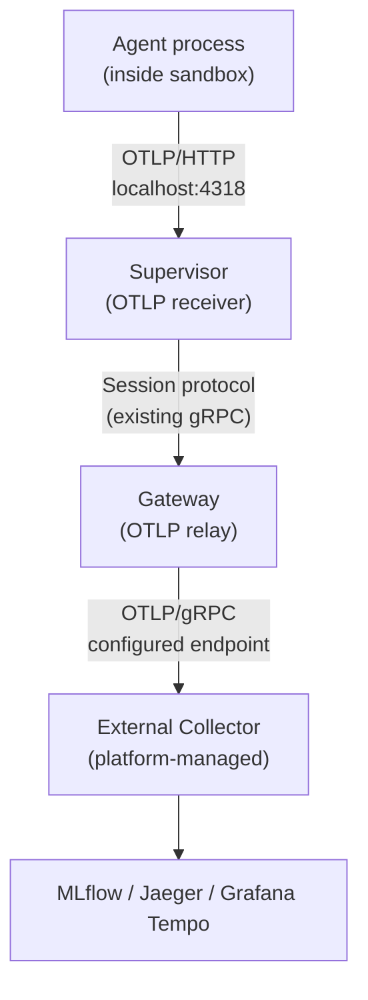
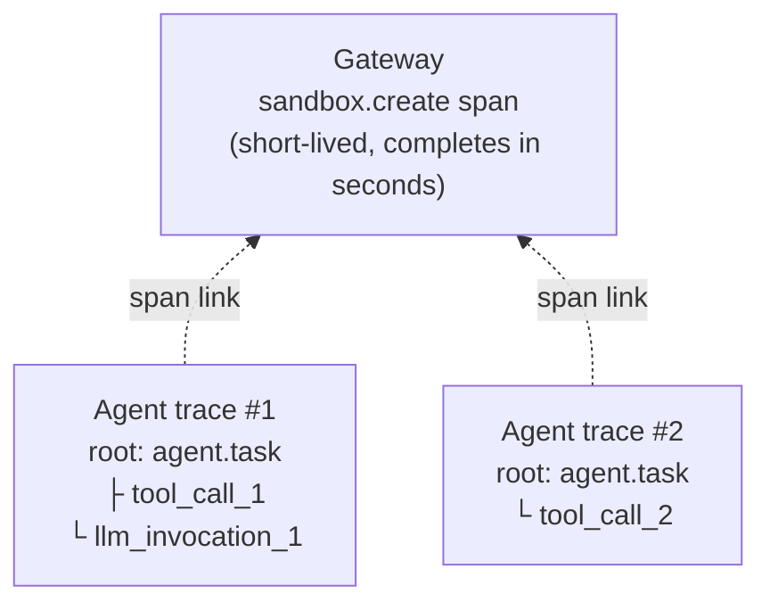

---
authors:
  - "@rhuss"
state: draft
links:
  - https://github.com/NVIDIA/OpenShell/issues/1055
  - https://github.com/NVIDIA/OpenShell/issues/2507
  - https://github.com/NVIDIA/OpenShell/issues/2508
  - https://github.com/NVIDIA/OpenShell/issues/909
---

# RFC 0012 - OpenShell observability architecture

## Summary

This RFC proposes a unified observability architecture for OpenShell covering tracing, logging, and monitoring. The centerpiece is a supervisor-local OTLP relay that collects agent-emitted traces from inside network-isolated sandboxes and forwards them through the gateway to an external collector. The relay complements recently merged infrastructure tracing for the gateway and VM driver, and builds on existing OCSF structured logging and Prometheus metrics foundations.

The proposal also covers infrastructure trace instrumentation for components that have no OTEL coverage today (in-process compute drivers, CLI, sandbox supervisor), deployment configuration (Helm values, ServiceMonitor), OCSF-to-OTEL correlation, and the metrics maturity path.

## Motivation

Operating OpenShell at scale requires answering questions that span multiple layers. A platform operator needs to know why sandbox creation is slow. A security reviewer needs to correlate a network deny event with the request that triggered it. An agent developer needs to see their agent's tool calls and LLM invocations in MLflow without writing OpenShell-specific instrumentation. A platform integrator needs a clean contract for wiring OpenShell into their monitoring stack.

OpenShell's observability story is still early. That is expected for a project at this stage, and recent contributions have laid real foundations. OTLP trace export recently merged for the gateway ([#2534](https://github.com/NVIDIA/OpenShell/pull/2534)) and VM driver ([#2564](https://github.com/NVIDIA/OpenShell/pull/2564)), with a shared `openshell-otel` crate ([#2567](https://github.com/NVIDIA/OpenShell/pull/2567)). OCSF structured logging covers security events in the sandbox. Prometheus metrics provide basic gateway request counting ([#920](https://github.com/NVIDIA/OpenShell/pull/920)). These are solid starting points.

The purpose of this RFC is to define where the story goes from here, so that the next contributions build toward a coherent architecture rather than growing organically. The main gaps today are:

- Tracing coverage beyond the gateway and VM driver. The sandbox supervisor, in-process compute drivers (K8s, Docker, Podman), CLI, and Helm chart have no OTEL integration yet.
- No connection between OCSF security events and traces. An operator cannot pivot from a network deny event to the trace that caused it.
- The metrics catalog proposed in [#909](https://github.com/NVIDIA/OpenShell/issues/909) (16 families, 3 priority tiers, SLI/SLO definitions) is mostly unimplemented beyond the foundation. No ServiceMonitor, dashboards, or alerting rules exist.
- No collection mechanism for agent-level traces (tool calls, LLM invocations, reasoning steps from frameworks like LangChain or Claude Code running inside sandboxes). The sandbox is network-isolated, so an agent's OTEL SDK cannot reach an external collector.

If the current design is left unchanged, platform operators cannot debug latency or failures across the gateway/driver/sandbox stack, agent developers cannot get their traces into MLflow without workarounds, and the three observability pillars remain disconnected.

### Personas

The personas below are proposed, not settled. OpenShell's persona model is evolving (see [#2615](https://github.com/NVIDIA/OpenShell/pull/2615) for ongoing work on centering issue reports around user stories). This RFC uses five personas as a lens for reasoning about observability needs, but the final definitions should be driven by the broader project discussion.

| Persona | Role | Observability needs |
|---|---|---|
| **Platform operator** | Deploys and operates the gateway cluster, manages compute drivers, monitors platform health | Distributed traces, SLI/SLO dashboards, alerting rules, Prometheus RED metrics. Tools: Grafana, Jaeger/Tempo, Prometheus/Alertmanager |
| **Security/compliance reviewer** | Reviews audit logs, investigates security events, ensures policy compliance | OCSF JSONL events, trace-to-OCSF correlation. Tools: log aggregation (Loki, Elasticsearch, Splunk) |
| **Agent developer** | Runs agents in sandboxes, debugs agent behavior, optimizes performance | Agent-level traces in MLflow or similar, with infrastructure context (sandbox, policy). Note: agent traces are a separate visibility domain from operator-only infrastructure traces per [#2508](https://github.com/NVIDIA/OpenShell/issues/2508) |
| **Workspace administrator** | Manages a workspace (namespace, tenant) in a multi-tenant deployment | Per-workspace metrics: sandbox counts, policy violation rates, resource utilization |
| **Platform integrator** | Integrates OpenShell into a larger platform (managed K8s, cloud AI platform, on-prem) | Documented OTLP endpoint contracts, resource attribute schemas, Helm values, integration guides. Tools: OTel Collector config, Helm values |

## Non-goals

This RFC does not propose OTEL log export. Logs continue to go to stdout and OCSF JSONL, since container-level log collection already handles operational logs and adding a parallel OTLP path would not add clear value. The architecture does not preclude it later if a need emerges.

OpenShell does not deploy an OTel Collector. The platform integrator owns the collector; OpenShell only emits OTLP to a configured endpoint.

OTLP metrics push is planned as an opt-in complement to Prometheus but is not part of the initial scope. Similarly, TUI and router tracing are future items (the TUI consumes monitoring data, it does not produce it), and Python SDK OTEL hooks are tracked separately in [#1818](https://github.com/NVIDIA/OpenShell/issues/1818).

The personas proposed in this RFC are a reasoning tool for the observability discussion, not settled project-wide definitions. That broader conversation is happening separately.

## Proposal

### Current state

The table below summarizes where tracing coverage exists today and where the gaps are. The gateway and VM driver recently gained OTLP trace export through three merged PRs, with a shared `openshell-otel` crate providing the common infrastructure. Everything else has no OTEL integration. Tracing is configured through `[openshell.gateway.otlp]` in `gateway.toml`, where the table's presence acts as the on-switch.

| Component | OTLP Traces | W3C Propagation | Status |
|---|---|---|---|
| Gateway server | Per-request spans, gRPC conventions | Inbound + outbound to drivers | Recently merged ([#2534](https://github.com/NVIDIA/OpenShell/pull/2534)) |
| VM driver | Per-RPC spans, lifecycle ops | Receives from gateway | Recently merged ([#2564](https://github.com/NVIDIA/OpenShell/pull/2564)) |
| `openshell-otel` crate | Shared provider, layer, error helpers | `TraceContextInterceptor` | Recently merged ([#2567](https://github.com/NVIDIA/OpenShell/pull/2567)) |
| In-process drivers (K8s/Docker/Podman) | None | N/A (in-process) | Gap |
| Sandbox supervisor | None | None | Gap |
| CLI | None | None | Gap |
| Agent traces from inside sandbox | None | N/A | Gap (new) |

On the logging side, OpenShell has two systems serving distinct purposes. Human-readable operational logs go to stdout via `tracing_subscriber::fmt`. Security-relevant events are captured by the OCSF structured logging system (`openshell-ocsf`), which emits both a shorthand format (always on) and full JSONL records (opt-in). OCSF covers network decisions, HTTP/L7 enforcement, SSH authentication, process lifecycle, security findings, configuration changes, and application lifecycle. It runs only on the sandbox side. Centralized sandbox log collection remains an unsolved problem ([#1922](https://github.com/NVIDIA/OpenShell/issues/1922), currently stale).

For monitoring, the Prometheus foundation is in place: a `metrics` crate facade, a dedicated `/metrics` endpoint, and Helm chart port 9090 exposed. Basic gRPC/HTTP RED metrics and gateway interceptor metrics are implemented and working. The broader catalog proposed in [#909](https://github.com/NVIDIA/OpenShell/issues/909), which defines 16 metric families across three priority tiers along with SLI/SLO definitions, is mostly unimplemented. The sandbox supervisor has no metrics at all, and there are no ServiceMonitor CRDs, dashboards, or alerting rules.

### Supervisor as OTLP relay for sandbox traces

The sandbox supervisor listens on `localhost:4317` (OTLP/gRPC) and `localhost:4318` (OTLP/HTTP) inside the sandbox. Agent frameworks export traces to this well-known address. The supervisor buffers, optionally enriches, and forwards spans to the gateway over the existing session protocol. The gateway relays them to the configured external OTLP endpoint.

The supervisor:

1. Accepts OTLP spans from the agent process (both gRPC and HTTP protocols, matching standard OTel Collector receiver behavior)
2. Buffers in memory (bounded, with explicit drop semantics matching [#2508](https://github.com/NVIDIA/OpenShell/issues/2508)'s transport design)
3. Optionally enriches spans with sandbox resource attributes (see span enrichment below)
4. Forwards to the gateway over the existing session protocol
5. Flushes buffered spans before shutdown, surviving agent process termination

The gateway:

1. Receives spans from supervisors via the session protocol
2. Relays to the configured external OTLP endpoint alongside its own spans
3. Applies sampling if configured

For agents, the experience is: `OTEL_EXPORTER_OTLP_ENDPOINT` is set automatically in the sandbox environment, pointing at the supervisor's OTLP receiver. Any OTEL-instrumented framework works without OpenShell-specific code.

### OTLP receiver reachability per driver

There is a subtlety that matters for all container-based drivers. The supervisor creates an internal workload network namespace for the agent process, connected to the supervisor's namespace via a veth pair. The proxy already binds to the host-side veth IP (available from `netns.host_ip()`) to intercept agent traffic. This means `localhost` inside the agent's network namespace is not the same `localhost` the supervisor sees.

The OTLP receiver cannot simply bind to `127.0.0.1:4318` and expect the agent to reach it. It needs to follow the same pattern as the proxy: bind to the veth host IP that is routable from inside the workload netns. The supervisor then sets `OTEL_EXPORTER_OTLP_ENDPOINT=http://<veth-host-ip>:4318` in the agent's environment rather than `http://localhost:4318`.

How this plays out per driver:

| Driver | Supervisor-agent network relationship | OTLP receiver binding |
|---|---|---|
| Docker | Same container, but agent enters a separate workload netns via `setns()` | Bind to `netns.host_ip():4318` (same IP the proxy uses). Reachable from agent in the workload netns. |
| Podman | Identical to Docker | Same as Docker |
| K8s (embedded) | Supervisor side-loaded into agent container, same single-container model | Same as Docker |
| K8s (sidecar) | Network sidecar + agent container share the pod network namespace. Sidecar uses nftables for interception, no separate workload netns. | Bind to `localhost:4318` directly. This is the simplest case because the agent process stays in the pod's shared network namespace. |
| VM | Supervisor is PID 1 inside a libkrun microVM, agent is a child process | Same as Docker (within the VM). The VM itself is isolated from the host; traces leave the VM through the supervisor-to-gateway session protocol, not through host networking. |

The key point: the OTLP receiver reuses the same networking plumbing the proxy already uses. The proxy binds to the veth host IP; the OTLP receiver binds to the same IP on a different port. The infrastructure for making a supervisor-hosted service reachable from the agent process already exists. The OTLP receiver is another listener on that same address.

The K8s sidecar topology is the exception. Because it uses nftables-based traffic interception in the pod's shared network namespace rather than creating a separate workload netns, `localhost` is truly shared between the supervisor and agent. Binding to `localhost:4318` works directly.

This pattern has prior art in [Dapr](https://dapr.io). Dapr's [sidecar](https://docs.dapr.io/concepts/dapr-services/sidecar/) intercepts all application communication and automatically generates distributed traces without requiring any SDK or instrumentation in the application code. The sidecar writes traces using [OTLP to a configured collector](https://docs.dapr.io/operations/observability/tracing/otel-collector/open-telemetry-collector/), which handles retries, batching, and encryption. Applications just annotate their deployment with `dapr.io/config` and get full distributed tracing transparently. OpenShell's supervisor plays the same role: the agent exports to `localhost:4318`, the supervisor handles buffering, enrichment, and forwarding. The agent never needs to know where traces go or how they get there.

### Span links for sandbox-to-trace correlation

Agent traces from inside the sandbox are correlated with gateway infrastructure traces via [span links](https://opentelemetry.io/docs/concepts/signals/traces/#span-links), not parent-child relationships.

Sandbox lifetimes are unpredictable. A CI sandbox runs for 30 seconds, an interactive sandbox might live for hours, a persistent dev environment could run for days. A gateway-owned parent span that lives for the entire sandbox lifecycle is an antipattern: the batch exporter won't export it until the sandbox terminates, trace backends assume traces complete within a time window, and the gateway holds the open span in memory for every concurrent sandbox.

Span links create a "related to" relationship without parent-child hierarchy. The gateway creates a short-lived `sandbox.create` span (completes in seconds, exported immediately), and the supervisor adds a span link from each agent root span to that gateway span during enrichment. Backends like Jaeger and Grafana Tempo navigate links bidirectionally.

For batch/CI sandboxes where a single task maps to the entire sandbox lifetime, the supervisor can optionally create a short task-scoped parent span and pass it via `TRACEPARENT`. This keeps the parent-child relationship for the simple case without the long-lived trace antipattern.

[#2508](https://github.com/NVIDIA/OpenShell/issues/2508)'s "Not settled" section discusses injecting `traceparent` into agent outbound HTTP requests (propagation outward). The span link pattern here is correlation inward, connecting agent traces to sandbox context. These are complementary decisions.

### Configurable span enrichment at the supervisor

When forwarding agent-emitted spans, the supervisor attaches sandbox context as resource attributes:

| Attribute | Source | Example |
|---|---|---|
| `openshell.sandbox.id` | Sandbox metadata | `sb-abc123` |
| `openshell.sandbox.policy` | Active policy name | `default-policy` |
| `openshell.sandbox.user` | Authenticated user | `user@example.com` |
| `openshell.sandbox.image` | Container image | `ubuntu:22.04` |
| `openshell.sandbox.driver` | Compute driver type | `kubernetes` |

Enrichment is configurable and can be disabled for pass-through forwarding. Without enrichment, an operator sees "LangChain called tool X" but cannot tell which sandbox, user, or policy was active. With enrichment, the trace carries full context without the agent needing any OpenShell-specific instrumentation.

### OCSF-to-OTEL correlation

When a trace context is active, OCSF events include `trace_id` and `span_id` fields. This lets operators pivot between "I see a network deny in the security log" and "show me the trace that triggered it."

The OCSF builders already accept arbitrary fields. Add optional `trace_id`/`span_id` fields to the builder pattern, populated from the current `tracing::Span` when available. [#2508](https://github.com/NVIDIA/OpenShell/issues/2508) sub-issue 5 ("OCSF correlation") tracks this but has not defined the mechanism.

### Infrastructure trace instrumentation

The K8s, Docker, and Podman compute drivers run in-process within the gateway and already inherit its tracing subscriber. What they lack are explicit `#[tracing::instrument]` annotations that would create spans for driver operations like provisioning, teardown, status checks, and exec. The VM driver serves as the reference pattern here, with 10+ instrumented operations using `ErrorStatusGuard` for error marking. [#2507](https://github.com/NVIDIA/OpenShell/issues/2507) notes these drivers are expected to migrate to external gRPC services eventually, at which point they will need their own `SdkTracerProvider` and W3C propagation, but the in-process annotations are still the right foundation.

The CLI currently does not inject `traceparent` into its gRPC calls to the gateway, which means CLI-initiated operations start new traces at the gateway rather than continuing a trace from the user's command. The fix is straightforward: add optional OTLP export (via `--otlp-endpoint` or `OTEL_EXPORTER_OTLP_ENDPOINT`), wire `TraceContextInterceptor` onto the gRPC channel, and create a root span per CLI command. The gateway already knows how to extract incoming `traceparent`, so the connection happens automatically.

The sandbox supervisor has zero OTEL integration today, which is the biggest single gap. [#2508](https://github.com/NVIDIA/OpenShell/issues/2508) scopes this into network spans (L4 connect, OPA evaluation, L7 enforcement, credential injection, middleware calls), middleware spans (operator-run gRPC services with real cross-service tracing value), and process spans (entrypoint lifecycle, exec, SSH sessions). All of these route supervisor -> gateway -> collector per [#2508](https://github.com/NVIDIA/OpenShell/issues/2508)'s settled design decision.

### Deployment configuration

Today, none of the deployment surfaces (Helm, Docker Compose, RPM) include OTLP configuration. The Helm chart needs `otlp.endpoint`, `otlp.serviceName`, and `otlp.enabled` values that template into the gateway's `gateway.toml` ConfigMap as `[openshell.gateway.otlp]`. When these values are set, the chart should also pass `OTEL_EXPORTER_OTLP_ENDPOINT` and `OTEL_RESOURCE_ATTRIBUTES` as environment variables to the gateway container. Docker Compose's example `gateway.toml` should include a commented-out OTLP section so operators can see the option and enable it. The published configuration reference at `docs/reference/gateway-config.mdx` needs to document the OTLP settings.

An important design constraint: OpenShell is collector-agnostic. The Helm chart does not deploy an OTel Collector. Every deployment context (managed Kubernetes, standalone cluster, Docker Compose, bare metal) has its own collector topology, and bundling one would couple OpenShell to a particular backend while creating operational overlap with platform-level monitoring infrastructure.

### Visibility domains

Two distinct visibility domains flow through the same OTLP relay pipeline:

1. **Infrastructure traces** (operator-only): gateway request spans, driver lifecycle, supervisor network/process/middleware spans. Locked as operator-only per [#2508](https://github.com/NVIDIA/OpenShell/issues/2508).
2. **Agent traces** (agent developer): tool calls, LLM invocations, reasoning steps from agent frameworks inside sandboxes. Routable to a separate backend (e.g., MLflow) from infrastructure traces (e.g., Tempo).

The platform integrator configures this routing at the collector level (e.g., route spans with `openshell.sandbox.*` attributes to MLflow, route spans with `openshell-gateway` service name to Tempo). OpenShell emits both to the same OTLP endpoint; the collector separates them.

### Metrics direction

Metrics remain Prometheus-first. Priority order:

1. Complete P0 metrics from [#909](https://github.com/NVIDIA/OpenShell/issues/909) (supervisor sessions, sandbox phase, relay)
2. Add Helm ServiceMonitor (gated, off by default)
3. P1 metrics (SSH, compute driver, DB, policy)
4. Dashboards and alerting rules
5. OTLP metrics push (opt-in complement)

## Implementation plan

### Phase 1: Core instrumentation

This phase extends the recently merged gateway and VM driver tracing to the remaining infrastructure components. None of this work requires new transport mechanisms or the OTLP relay. It builds on what exists and unblocks end-to-end tracing from the CLI through the gateway to any compute driver.

**In-process driver spans.** The K8s, Docker, and Podman drivers run inside the gateway process and already inherit its tracing subscriber. The work is adding `#[tracing::instrument]` annotations to key operations (provisioning, teardown, status checks, exec) following the VM driver as the reference pattern. Since these drivers are in-process, they share the gateway's OTLP exporter and need no separate provider setup or W3C propagation. The integration point is straightforward: instrument the `ComputeDriver` trait implementations in `crates/openshell-driver-kubernetes/`, `crates/openshell-driver-docker/`, and `crates/openshell-driver-podman/`. The spans appear as children of the gateway's request span automatically.

**CLI trace propagation.** The CLI needs to inject `traceparent` headers into its gRPC calls to the gateway. The building blocks already exist: `TraceContextInterceptor` in `openshell-otel` handles W3C trace context injection, and the gateway already extracts incoming `traceparent` in `multiplex.rs`. The work is wiring these together: add a `--otlp-endpoint` flag (or respect `OTEL_EXPORTER_OTLP_ENDPOINT`), build a `SdkTracerProvider` using the shared `openshell-otel` crate, create a root span per CLI command, and attach the interceptor to the CLI's gRPC channel. Once connected, a trace initiated by `openshell sandbox create` flows from the CLI through the gateway into whatever driver handles the request.

**Helm and deploy configuration.** The Helm chart needs `otlp.endpoint`, `otlp.serviceName`, and `otlp.enabled` values that template into the gateway's `gateway.toml` ConfigMap as `[openshell.gateway.otlp]`. The integration point is `deploy/helm/templates/` where the ConfigMap is generated and the StatefulSet picks up env vars. Docker Compose's example `gateway.toml` gets a commented-out OTLP section. The published docs at `docs/reference/gateway-config.mdx` need the OTLP configuration reference.

### Phase 2: Sandbox OTLP relay

This is the architecturally new work. It introduces a trace collection path from inside network-isolated sandboxes to the external collector, something no existing issue covers.

**Supervisor OTLP receiver.** The supervisor needs an OTLP listener on `localhost:4317` (gRPC) and `localhost:4318` (HTTP) inside the sandbox. The implementation choice is between using the `opentelemetry-proto` crate to implement the receiver from scratch (smaller binary, more control) or embedding a lightweight collector library (more features, larger dependency). The receiver accepts `ExportTraceServiceRequest` messages, validates them, and places them in a bounded in-memory buffer. The supervisor sets `OTEL_EXPORTER_OTLP_ENDPOINT=http://localhost:4318` in the agent process environment automatically. This is the integration point with any OTEL-instrumented agent framework: the agent's SDK exports to localhost, and the supervisor receives it.

**Supervisor-to-gateway span transport.** Buffered spans need to reach the gateway. [#2508](https://github.com/NVIDIA/OpenShell/issues/2508) sub-issue 1 tracks this and it depends on [#1731](https://github.com/NVIDIA/OpenShell/issues/1731), which restructures the supervisor-to-gateway session protocol. The integration point is the session event stream between `crates/openshell-sandbox/` and `crates/openshell-server/`. A new message type carries serialized OTLP span batches from the supervisor to the gateway. Drop semantics need explicit design: what happens when the session is down, when the buffer is full, and whether partial traces are emitted or discarded. This is the hardest integration point because it touches the session protocol, which is shared infrastructure.

**Gateway OTLP relay.** The gateway receives span batches from supervisors and forwards them to the configured external OTLP endpoint. Today the gateway only exports its own spans via the `SdkTracerProvider` built in `otel_tracing.rs`. The relay adds a second export path: spans received from supervisors go through the same OTLP/gRPC exporter but are not generated locally. The integration point is `crates/openshell-server/`, where the session handler receives span batches and the OTLP exporter sends them alongside the gateway's own spans. Sampling configuration (global or per-sandbox) applies here.

**Span link correlation.** When the gateway creates a sandbox, it emits a short-lived `sandbox.create` span with sandbox metadata (ID, user, policy, driver). The span's `{trace_id, span_id}` is passed to the supervisor as part of the sandbox configuration. When the supervisor's OTLP receiver encounters an agent root span (no parent), it adds a span link pointing back to the gateway's `sandbox.create` span. The integration points are the sandbox creation flow in the gateway (where the span is created and context is passed) and the supervisor's span enrichment pipeline (where the link is added to forwarded spans).

**Supervisor span enrichment.** Before forwarding agent spans, the supervisor attaches sandbox resource attributes (`openshell.sandbox.id`, `openshell.sandbox.policy`, `openshell.sandbox.user`, `openshell.sandbox.image`, `openshell.sandbox.driver`). This runs in the same pipeline as span link injection. The integration point is between the OTLP receiver buffer and the session transport: spans are read from the buffer, enriched with attributes and links, then serialized for transport. Enrichment is configurable via an extension of the existing `[openshell.gateway.otlp]` config pattern.

### Phase 3: Supervisor instrumentation depth

This phase instruments the supervisor's own operations, producing infrastructure spans that serve the platform operator. The instrumentation work is independent of the OTLP relay (Phase 2 provides the transport, Phase 3 fills it with the supervisor's own spans).

**Network spans.** The primary value. The candidate span sources in `crates/openshell-supervisor-network/` are: `proxy.rs` (L4 connect and tunnel establishment), `opa.rs` (policy evaluation latency), the `l7/` tree (HTTP/REST/GraphQL/WebSocket parsing and enforcement), `token_grant.rs` and `sigv4.rs` (credential injection), and `upstream_proxy.rs` (upstream dispatch). Not every function deserves a span. The decision per operation is span, event on a parent span, or nothing. This is a hot path (every outbound agent connection), so span construction cost needs measuring. The integration point is the shared `openshell-otel` crate for provider setup and the supervisor-to-gateway transport from Phase 2 for span delivery.

**Middleware spans.** Operator-run middleware is the strongest cross-service tracing case in the product. A middleware call is an external gRPC service call, inline in the egress path, with a 500ms default timeout and fail-open/fail-closed semantics. The `HttpRequestEvaluation` type already carries a `request_id` field, so correlation plumbing partly exists. The integration point is `crates/openshell-supervisor-middleware/`, where the middleware chain executes and results are processed.

**Process spans.** Entrypoint and process lifecycle, exec invocations, SSH session and channel operations. Smaller surface than the network side. The integration point is `crates/openshell-supervisor-process/`.

**OCSF-to-OTEL correlation.** Add `trace_id` and `span_id` to OCSF events when a trace context is active. The integration point is the OCSF builder pattern in `crates/openshell-ocsf/`, where optional trace context fields are populated from the current `tracing::Span`.

**Enablement and sampling.** Per-sandbox and global toggles following the existing `ocsf_json_enabled` settings pattern. Head sampling at the supervisor vs. tail sampling at the gateway have different tradeoffs on the hot egress path. The integration point is the sandbox settings flow from gateway to supervisor.

### Phase 4: Monitoring maturity

This phase fills out the metrics catalog and adds the Kubernetes monitoring surface. It is largely independent of the tracing work and can proceed in parallel once the metrics foundation is in place.

**P0 metrics.** The metrics that tell you if the platform is fundamentally working: supervisor sessions active (gauge), connect/disconnect counters, sandboxes-by-phase gauge, relay opens/claims/pending. These are emitted from `crates/openshell-server/` using the existing `metrics` crate facade. The integration point is the same pattern as the existing gRPC/HTTP RED metrics, just covering new subsystems.

**Helm ServiceMonitor.** A `ServiceMonitor` CRD template gated behind a Helm value (off by default). When enabled, it wires Prometheus scraping to the gateway's metrics port. The integration point is `deploy/helm/templates/`, adding a new template alongside the existing Service and StatefulSet templates. Per [#2507](https://github.com/NVIDIA/OpenShell/issues/2507), the question of whether `--metrics-port` should auto-enable when the chart wires scraping needs a decision.

**P1 metrics and beyond.** SSH tunnel saturation, compute driver RPC duration, DB operation latency, policy merge retries. Then dashboards (Grafana JSON models in the Helm chart or as separate artifacts), alerting rules (PrometheusRule CRDs), and eventually OTLP metrics push as an opt-in complement to Prometheus scrape for environments that cannot use pull-based collection.

## Risks

### Supervisor complexity and the hot path

The OTLP relay adds an OTLP receiver, buffering, enrichment, and forwarding to the supervisor, which is already a complex component sitting on every outbound agent connection. Span construction on the egress path has a cost, and that cost needs measuring rather than assuming it is negligible.

Related to this is the question of what happens when spans cannot be delivered. A dropped span is worse than a dropped log because it corrupts the parent-child structure of a trace, not just loses a record. The relay needs explicit, documented drop behavior when the gateway is unreachable or the buffer fills up. Inheriting the best-effort semantics from the existing log push path is not sufficient.

### Span attribute cardinality

Trace backends index span attributes for querying. When an attribute has a bounded set of values (like `rpc.method = "CreateSandbox"` or `openshell.sandbox.driver = "kubernetes"`), indexing is cheap. When the set of values is unbounded, the index grows without limit.

This matters in OpenShell because the supervisor traces agent network activity. The natural attributes to record are the destination hostname and URL path, since those answer "where did the agent connect?" But the agent controls those values. A misbehaving or compromised agent could connect to thousands of unique hostnames, each becoming a distinct attribute value in the backend's index. At 10,000 unique hostnames from one sandbox, storage costs climb, query performance degrades, and some backends enforce cardinality limits that silently drop data.

The mitigation is to normalize high-cardinality attributes before they reach the backend. Record known, bounded values like `dst.hostname = "api.openai.com"` as-is, but replace arbitrary agent-chosen hostnames with a hashed or bucketed value, or move them to span events (which are not indexed) instead of span attributes (which are).

### Relay scale and gateway bottleneck

The supervisor-to-gateway session protocol was designed for control plane traffic: sandbox lifecycle events, configuration updates, log pushes. Adding trace relay changes the traffic profile substantially. An active agent with OTEL instrumentation can produce 10-100 spans/second. With 100 concurrent sandboxes on one gateway, that adds up to 1,000-10,000 spans/second, roughly 1-10 MB/second sustained through the gateway.

The network bandwidth alone is manageable. The deeper concern is that the gateway now serves two roles (control plane and data plane relay), and these roles compete for resources. If the external collector is slow or unreachable, the gateway accumulates buffered spans from all sandboxes. Memory pressure from the relay can degrade sandbox lifecycle operations.

Several mitigations should be part of the implementation:

- Trace relay should use a separate transport channel (or multiplexed stream) from the control plane session, so trace backpressure does not block sandbox create or delete operations.
- Head sampling at the supervisor reduces volume before it reaches the gateway. This should be configurable per-sandbox or globally (e.g., sample 10% of traces, but always forward traces containing errors).
- Per-sandbox span rate limits prevent one noisy agent from overwhelming the gateway. Excess spans are dropped at the supervisor with a counter metric, not silently.
- The gateway forwards received spans to the external collector asynchronously in batches, not synchronously per-span.
- When the gateway's relay buffer is full, it should signal the supervisor to slow down or drop rather than silently accepting until it runs out of memory.
- For high-volume scenarios, users can bypass the relay entirely by setting `OTEL_EXPORTER_OTLP_ENDPOINT` to `host.openshell.internal:<port>` or a direct collector address. The relay is the zero-config default, not a mandatory path.

### Other considerations

The OpenTelemetry Rust SDK is a non-trivial dependency. Feature-gating it at compile time is worth evaluating (alongside [#1943](https://github.com/NVIDIA/OpenShell/issues/1943)) so that builds without OTEL support do not pay the binary size and compile time cost.

Not all trace backends handle span links equally well. Jaeger and Grafana Tempo support bidirectional link navigation, but MLflow's OTLP ingestion may not surface links in its UI. If that turns out to be the case, the correlation story for agent developers using MLflow would be limited to resource attributes rather than navigable links.

## Alternatives

### Use `host.openshell.internal` for agent trace collection

Sandboxes can already reach host-side services via `host.openshell.internal` ([#2478](https://github.com/NVIDIA/OpenShell/issues/2478)). An agent could export OTLP directly to a collector on the gateway host. This works today (when the SSRF engine does not block it) and requires no new supervisor code.

The supervisor relay is preferred as the default for four reasons:

- Security: `host.openshell.internal` routes through the egress proxy with no per-sandbox authentication, so any sandbox can send data to the collector port.
- Multi-tenancy: one collector per gateway host does not scale to multi-tenant deployments where workspaces need separate OTLP endpoints.
- Reliability: the SSRF engine blocks `host.openshell.internal` on newer gateway versions ([#2478](https://github.com/NVIDIA/OpenShell/issues/2478)), TCP connections hang on the K8s driver, and it requires per-sandbox policy configuration.
- Enrichment: the relay enables the supervisor to attach sandbox context as resource attributes, which is unavailable on the direct path.

These approaches are not mutually exclusive. The design follows the same pattern as `inference.local`: the relay is the zero-config default, and users can override `OTEL_EXPORTER_OTLP_ENDPOINT` to `host.openshell.internal:<port>` or any other endpoint.

### Gateway-owned root span with TRACEPARENT

An earlier version of this design proposed a long-lived gateway root span for the sandbox lifecycle, with agent spans as children via `TRACEPARENT`. This was rejected because sandbox lifetimes are unpredictable (seconds to days) and long-lived parent spans are an OTEL antipattern: they delay export, strain backends, hold gateway memory, and misrepresent the semantic structure. Span links provide correlation without duration coupling.

### Direct OTLP export from the sandbox

[#2508](https://github.com/NVIDIA/OpenShell/issues/2508) considered and rejected direct OTLP export from the sandbox. It would require an egress allowlist hole for the collector endpoint in every sandbox, which is a policy exception with real blast radius. Routing through the gateway keeps the sandbox egress policy closed and gives a single place for sampling and redaction.

### Do nothing

Leave the current design unchanged. Platform operators cannot debug latency across the stack. Agent developers cannot get traces into MLflow without building workarounds. The three observability pillars remain disconnected. This is not acceptable for production deployments.

## Prior art

**[Dapr](https://dapr.io) sidecar architecture and OTEL integration.** Dapr's [sidecar](https://docs.dapr.io/concepts/dapr-services/sidecar/) intercepts all application communication and generates distributed traces automatically, without requiring any SDK or code instrumentation in the application. The sidecar writes traces using [OTLP to a configured OTel Collector](https://docs.dapr.io/operations/observability/tracing/otel-collector/open-telemetry-collector/), which handles retries, batching, and encryption. Applications opt in with a single Kubernetes annotation (`dapr.io/config`). The three-tier architecture (application -> sidecar -> collector -> backend) maps directly to OpenShell's design (agent -> supervisor -> gateway -> collector). The key lesson: transparent trace collection through a co-located proxy is a proven pattern that scales across diverse application frameworks.

**OpenTelemetry GenAI semantic conventions.** The emerging standard for agent trace attributes (`gen_ai.operation.name`, `gen_ai.agent.name`, etc.). OpenShell infrastructure spans use standard RPC/HTTP conventions; agent-emitted spans from inside sandboxes should follow GenAI conventions for MLflow compatibility.

**Root span flushing in CI pipelines.** Red Hat's CI pipelines for running agents in OpenShell sandboxes independently discovered the root span flushing problem for short-lived sandboxes and worked around it with an orchestrator-owned root span passed via `TRACEPARENT`. The span link approach in this RFC avoids the duration coupling while solving the same correlation problem.

## Open questions

- How should `OTEL_*` environment variables and TOML gateway configuration interact when both are set? [#2507](https://github.com/NVIDIA/OpenShell/issues/2507) and RFC 0003 discuss this but no decision has been made on precedence.
- Multi-tenant deployments likely need per-workspace OTLP endpoint configuration so that different tenants' agent traces can route to different collectors or MLflow instances. The configuration model for per-workspace endpoints is not designed yet.
- Does MLflow's OTLP ingestion surface span links in its UI? If it does not, the correlation story for agent developers using MLflow would be limited to resource attributes rather than navigable links. This needs validation.
- Should the OTel SDK dependency be gated behind a Cargo feature flag so that builds without tracing support do not pay the binary size and compile time cost?
- Should the supervisor implement the OTLP receiver from scratch using the `opentelemetry-proto` crate (smaller binary, more control), or embed a lightweight collector library (more features, larger dependency)? The tradeoffs need evaluation during implementation.
- [#2508](https://github.com/NVIDIA/OpenShell/issues/2508) deliberately left `traceparent` injection into agent egress unsettled. Whether the supervisor stamps W3C trace context onto the agent's outbound HTTP requests is a separate decision from the span link correlation proposed in this RFC.
