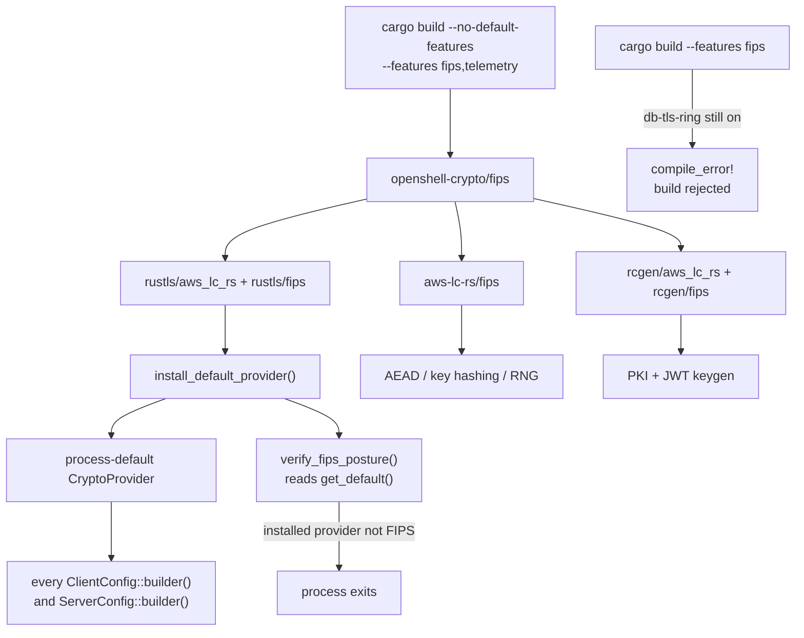

---
authors:
  - "@mrunalp"
state: draft
links:
  - https://github.com/NVIDIA/OpenShell/issues/900
---

# RFC 0013 - FIPS 140-3 Crypto Backend Selection

## Summary

OpenShell performs every cryptographic operation through libraries that have no
FIPS 140-3 validation. This RFC proposes centralizing cryptographic backend
selection in a single crate, `openshell-crypto`, and gating the choice behind one
Cargo feature. A default build keeps `ring` and current behavior; a `fips` build
routes TLS, X.509 and JWT key generation, credential encryption at rest, key and
credential-identifier hashing, and randomness through AWS-LC in FIPS mode, and
narrows every algorithm choice to the approved set.

The proposal also records where the design diverged from the plan accepted in
[issue #900](https://github.com/NVIDIA/OpenShell/issues/900) once it met the
codebase. Several of those divergences change what a FIPS build actually
guarantees, so they need review rather than a changelog entry.

## Motivation

FIPS-enabled RHEL 9 and OpenShift clusters are common in government, defense, and
regulated industries. On those clusters the kernel does not block userspace
cryptography, so OpenShell runs — it simply fails a compliance audit, because
every operation that touches key material runs in an unvalidated module.

Before this work the position was absolute rather than partial. There was no
`fips` feature, no way to build one, and no test that would notice a backend
swap. `ring` backed all TLS through rustls, `rcgen` generated PKI keys through
`ring`, credential encryption at rest used `ring`'s AES-GCM and DRBG, and roughly
twenty call sites named a backend directly. Changing backends meant editing all
of them consistently and having no mechanism to detect a site that was missed.

Two properties make this worth an RFC rather than a pull request. First, the
guarantee is subtle: "FIPS-approved algorithms" and "FIPS-validated module" are
different claims, and a design can satisfy one while appearing to satisfy both.
An auditor will ask which one OpenShell provides, and the answer must be written
down before someone makes it in a sales conversation. Second, a FIPS build
changes behavior visible outside the process — the JWT signing algorithm on the
wire, the SSH host key type, and the database trust store — so it is not a
transparent compile flag.

Leaving the design unchanged means regulated deployments remain unavailable, and
the eventual retrofit gets harder as more crates add crypto call sites. The
`openshell-driver-db-credstore` crate is the existing example: it was introduced
after the original investigation and added a new unvalidated path for encrypting
secrets at rest without anyone noticing it was a compliance-relevant surface.

## Non-goals

- **Making the SSH transport FIPS-validated.** This RFC restricts SSH
  negotiation to approved algorithms but does not replace russh's unvalidated
  implementations. Tracked as Phase 2.
- **Removing `ring` from the dependency graph.** `openshell-crypto` links it
  unconditionally by design, and the AWS SDK links its own copy. This RFC
  measures and documents the residual surface rather than eliminating it.
- **Making AWS SigV4 request signing use a validated module.** `aws-sigv4` offers
  no backend choice, so this needs a reimplementation or an upstream change.
  Tracked as Phase 2b. (STS transport is covered as of Phase 2.)
- **FIPS-capable container images.** The published gateway image is distroless
  Debian and the supervisor is static musl. A UBI-based variant and a glibc
  supervisor build are separate work.
- **SDK coverage.** The Go SDK does not set `GOFIPS140`; the Python SDK uses
  grpcio's bundled BoringSSL. Neither is addressed.
- **Runtime FIPS toggling.** Explicitly rejected — see Alternatives.
- **Host-level FIPS mode.** Building against a validated module does not put the
  kernel or platform in FIPS mode. That remains an operator responsibility.

## Proposal

### One crate owns backend selection

`openshell-crypto` is the only crate permitted to name a cryptographic backend.
Every TLS, PKI, JWT, AEAD, and randomness operation routes through it, along with
hashing that serves a cryptographic purpose — key identifiers and credential
path derivation. Content and revision hashing is deliberately out of scope; see
[Algorithm choices that cross process boundaries](#algorithm-choices-that-cross-process-boundaries)
for where that line falls and why.

The mechanism that makes this enforceable is a manifest convention: the workspace
`rustls`, `tokio-rustls`, and `rcgen` entries declare **no** backend feature.
`openshell-crypto` supplies the backend through its own dependency declarations,
and Cargo feature unification applies that choice to every crate in the graph.

`fips` is a **one-way switch** with no opposing `backend-ring` feature. `ring` is
an unconditional dependency; `fips` additionally compiles in AWS-LC and moves
every selection to it. This shape is deliberate and is the single most important
structural decision in the design. Cargo features are additive, so a pair of
mutually exclusive backend features can always both be enabled at once — and any
dependency that resolves that ambiguity by preferring `ring` produces a build
that reports FIPS while using unvalidated crypto. sqlx does exactly this. A
one-way switch has no ambiguous state to resolve.

Where a dependency insists on choosing for itself, the ambiguity is rejected at
compile time rather than resolved silently. `openshell-server` carries a
`compile_error!` for `fips` + `db-tls-ring`, which is why a FIPS gateway must be
built with `--no-default-features --features fips,telemetry`.

Two consequences are worth naming. Installing the restricted provider as the
*process default* means existing `ClientConfig::builder()` and
`ServerConfig::builder()` call sites inherit the restriction with no change —
provider threading is not required. And because selection happens in one function,
a runtime self-check can prove the whole process is in the intended mode.

### FIPS mode is compile-time only

The validated module is chosen at link time and cannot be otherwise:
`aws-lc-rs/fips` links `aws-lc-fips-sys` while its absence links `aws-lc-sys`, and
those are different C libraries. A single artifact therefore cannot be validated
on demand. This is a constraint rather than a preference, and it matches the
desired security property: a runtime switch would require both modules linked and
reachable, which is the posture the design exists to avoid.

On rustls 0.23 a second mechanism points the same way — `require_ems`, the TLS 1.2
extended-master-secret requirement, is derived from `cfg!(feature = "fips")`. That
one is version-specific and is being removed: rustls is dropping the core `fips`
feature on `main` (targeting 0.24) and keying those behaviors off the provider's
declared FIPS status at runtime instead
([rustls/rustls#3054](https://github.com/rustls/rustls/issues/3054)).

That change does not reopen the question. rustls is retaining the `fips` feature
on a separate provider crate precisely so it can statically determine the
provider's make-up, and rustls maintainers note that running a FIPS provider in
non-FIPS mode is undesirable anyway — FIPS code updates slowly and carries
countermeasures that cost performance without improving security. What 0.24
enables is runtime selection of *algorithm policy* within a binary already built
against the validated module, not runtime selection of the module. The migration
requirements are recorded in `architecture/build.md`.

### Algorithm restriction defers to rustls, with one narrowing

Cipher suite restriction comes from `rustls::crypto::default_fips_provider()`
rather than a list maintained in OpenShell. rustls compiles ChaCha20-Poly1305 out
entirely under its `fips` feature and tracks the approved set against the
module's validated boundary, so a hand-maintained list could only drift.

Key exchange is narrowed further, to NIST P-256 and P-384. This is *stricter* than
rustls, which keeps X25519 and the X25519+ML-KEM768 hybrid on the grounds that
AWS-LC's validated boundary covers them. Two reasons to narrow: an auditor
reading SP 800-56A rev3 expects NIST curves, and every TLS 1.3 stack supports
P-256 so the interoperability cost is nil.

The cost is real and should be weighed in review: FIPS builds lose post-quantum
hybrid key exchange that default builds get. The narrowing is one filter in one
function, so reversing it is a small change if reviewers prefer rustls's position.

### Startup verification

`verify_fips_posture()` runs at gateway and CLI startup and fails the process if
the provider actually installed does not report FIPS-approved cryptography. It
inspects `CryptoProvider::get_default()` rather than a freshly constructed
provider, because checking what we *would* have installed proves nothing about
what is in use: `install_default()` loses to whoever got there first, so a
dependency or an earlier code path can win the race.

This catches two failures — a feature that reached `openshell-crypto` but not
`rustls`, and a process default installed by something else. Both would
otherwise downgrade silently and pass every functional test.

A companion `ensure_default_provider()` exists for library code that constructs
TLS clients without a binary entry point having run first — library crates are
also used from tests and other embedders, and rustls panics when a TLS config is
built with no process default. It only fills in a missing provider and can never
replace one, so it is safe to call from a library.

### Algorithm choices that cross process boundaries

Three build-mode differences are visible outside the process and need operator
documentation rather than only code comments:

**JWT signing — requires key rotation.** Gateway-issued sandbox tokens move from
Ed25519 (`EdDSA`) to ECDSA P-256 (`ES256`). Ed25519 is approved only under FIPS 186-5 and only when
the module certificate covers EdDSA, which is not a property assertable for the
implementations in use. Signing and validation are each pinned to exactly one
algorithm and the sets are deliberately disjoint, so a FIPS gateway cannot
validate a token signed with a non-approved key. There are two consequences. **Mixed-mode replica sets are unsupported** — tokens
fail validation across them, and nothing detects the mismatch until the first
cross-replica validation. And because the signing key is persisted, an existing
gateway holds an Ed25519 key that a FIPS build cannot parse: it **fails to
start** rather than merely invalidating in-flight tokens. Switching an existing
deployment therefore requires rotating the JWT key with `generate-certs`. The
error message names the required algorithm and the remedy, and a regression test
asserts it does.

**SSH host keys.** Host keys move from Ed25519 to ECDSA P-256, changing the
fingerprint. Sandboxes are ephemeral and generate a host key per sandbox, so
there is no persistent `known_hosts` entry to update.

**Hashing scope.** Key identifiers, credential-storage key identifiers, and
Kubernetes Secret and Vault credential path derivation are routed through the
validated module. Content and revision hashing — policy revisions, profile
catalogs, image digests — remains on RustCrypto `sha2`. Those are
content-addressing and change detection rather than security functions: they
protect nothing and gate no decision. An auditor requiring every SHA-256
invocation to come from the validated module regardless of purpose would need a
mechanical follow-up.

**Database trust store.** sqlx offers native-root loading only on its `ring`
backend, so a FIPS build uses webpki bundled roots for PostgreSQL. Deployments
using a private CA must set `sslrootcert` in `DATABASE_URL`, which works
independently of the root store.

### SSH negotiation is restricted, not validated

`openshell_crypto::ssh::preferred()` restricts SSH key exchange, host key,
cipher, and MAC negotiation to approved algorithms, and excludes Curve25519,
ML-KEM, and ChaCha20-Poly1305. Diffie-Hellman group exchange is also excluded:
the group is server-chosen, so an approved implementation cannot be asserted from
the algorithm name. The OpenSSH strict-kex markers are retained, because dropping
them would disable the Terrapin (CVE-2023-48795) mitigation.

This restricts *negotiation only*. russh implements the selected algorithms with
`ed25519-dalek`, `p256`, and RustCrypto AES, none of which are validated modules.
The gap is accepted on two grounds, both of which should be reviewed rather than
assumed: the transport runs inside the gateway's mTLS boundary, and the SSH layer
performs no authentication of its own — `auth_none` and `auth_publickey` both
accept unconditionally, with trust established by unix-socket peer credentials.

### Dependencies that do not honor the process default

Two dependencies select a provider themselves and need separate handling:

- **sqlx** calls `builder_with_provider` with a provider chosen by its own Cargo
  features, so `openshell-server` forwards the backend choice to it. This is the
  source of the trust-store limitation above.
- **aws-smithy-http-client** constructs its own provider, so AWS SDK calls use
  `ring` regardless of this design.

`mise run fips:audit` reports the residual `ring` surface and the number of
distinct rustls versions in a FIPS build, so the gap is a measured number in CI
rather than a discovery during an audit.

## Design changes from the accepted plan

The plan in issue #900 was written from a static investigation. Implementation
changed the following. Items marked **guarantee** alter what a FIPS build
actually promises and are the ones most in need of review.

| Accepted plan | What changed | Why |
|---|---|---|
| Hand-maintain FIPS cipher suite and kx lists | Suites come from rustls's `default_fips_provider()`; only kx is narrowed | rustls compiles ChaCha20 out under its own `fips` feature and tracks the validated boundary; a local list could only drift |
| Excluding X25519 follows from FIPS | **guarantee** — X25519 removal is a deliberate policy choice stricter than rustls | rustls keeps X25519 and X25519+ML-KEM768 because AWS-LC's boundary covers them; removing them costs the PQ hybrid |
| `--no-default-features --features fips` excludes `ring` | **guarantee** — `ring` stays linked; documented and measured instead | Cargo features are additive, and the AWS SDK pulls rustls 0.21 → `ring` regardless |
| Flip rustls features per crate at each of ~20 sites | One facade crate owns backend selection; workspace entries carry no backend feature | Feature unification gives a single point of control and makes a missed site impossible |
| Paired `backend-ring` / `fips` features | **guarantee** — no opposing feature; `ring` unconditional, `fips` a one-way switch | Additive features make both simultaneously enableable, and sqlx resolves that toward `ring`, silently producing a non-FIPS build |
| `--features fips` is the build command | **guarantee** — the gateway needs `--no-default-features --features fips,telemetry`, enforced by `compile_error!` | Same sqlx ambiguity; a build error is the only outcome that cannot be missed |
| Switching build modes only invalidates in-flight tokens | **guarantee** — an existing gateway fails to start until its JWT key is rotated | The signing key is persisted, and a FIPS build cannot parse an Ed25519 key |
| "Hashing and RNG" move to the validated module | **guarantee** — key and credential-identifier hashing move; content and revision hashing stays on RustCrypto | Those are content-addressing rather than security functions; the blanket claim was too broad |
| Startup check validates the provider | **guarantee** — it validates the *installed* provider via `get_default()` | `install_default()` loses to whoever got there first, so checking a freshly built provider proves nothing |
| Replace NSSH1 HMAC with aws-lc-rs HMAC | Dropped — the code no longer exists | `ssh_tunnel.rs` was removed in #1029 and the NSSH1 handshake with it; a dead `hmac` dependency was also removed |
| tokio-tungstenite needs a backend feature change | No change needed | Its `__rustls-tls` feature pins no backend and already uses the process default |
| reqwest: "switch to using the global provider" | Switched to `rustls-tls-native-roots-no-provider` | The plain `rustls-tls-native-roots` feature force-enables `__rustls-ring` |
| sqlx "should respect the global provider" | **guarantee** — it does not; needs per-crate gating and loses native-root loading | sqlx calls `builder_with_provider` with a feature-selected provider |
| Include DH group exchange among approved SSH kex | Excluded | The group is server-chosen, so approval cannot be asserted from the algorithm name |
| JWT signing algorithm not addressed | **guarantee** — EdDSA → ES256 under `fips`, with disjoint validation sets | Ed25519 approval depends on the module certificate covering FIPS 186-5 |
| Credential encryption at rest not in scope | **guarantee** — included in Phase 1 | The `openshell-driver-db-credstore` crate postdates the investigation and encrypts secrets at rest through `ring`; highest audit sensitivity in the codebase |
| `rcgen/fips` selects the FIPS backend | Requires `rcgen/aws_lc_rs` **and** `rcgen/fips` | rcgen 0.13.2's `fips` feature pulls the FIPS sys crate but its backend selection gates on `feature = "aws_lc_rs"`; `fips` alone fails to compile |
| AWS SDK migration is a "massive rewrite" | Done in Phase 2 as a dependency and client-construction change | `aws-smithy-http-client` 1.1.13 exposes a `rustls-aws-lc-fips` feature and a `CryptoMode::AwsLcFips` variant |
| "The AWS SDK" is one item | **guarantee** — it is two: STS transport (closed in Phase 2) and SigV4 signing (not closable by configuration) | `aws-sigv4` depends on RustCrypto `hmac`/`sha2` unconditionally with no backend feature |
| `require_ems` not mentioned | Set automatically by rustls's `fips` feature on 0.23 | Reinforces compile-time-only selection, though the durable reason is that the validated module is a distinct linked library. rustls is moving this to a runtime check in 0.24 |

## Implementation plan

**Phase 1 — TLS, PKI, credential storage, SSH negotiation. Complete.**
Adds `openshell-crypto` with a single one-way `fips` feature; migrates all
provider-install sites, custom certificate verifiers, PKI and JWT key
generation, credential AEAD, cryptographic hashing, and both SSH configs; adds
the `compile_error!` guard for the sqlx conflict in `openshell-server`; adds
`mise run fips:{check,test,build,audit}`; documents the operator-facing view in
`docs/security/fips.mdx` and the workspace feature scheme in
`architecture/build.md`.

Validation: 5087 tests pass in default mode; 473 in FIPS mode via
`mise run fips:test`, which runs the **strict** feature graph
(`--no-default-features --features fips,…`) so the tests exercise the same
backend the shipped build uses. Coverage includes credential-envelope
round-trips, ES256 JWT round-trips, and the key-rotation error. clippy is clean
under `-D warnings` in both modes. The tests assert on the negotiable algorithm
sets rather than on the feature flag, so a regression in a restriction list fails
rather than passing silently.

**Phase 2 — AWS SDK leg. Transport done; signing blocked.**
`openshell-server` now builds the SDK's HTTPS client explicitly
(`provider_refresh::aws_http_client`) with a `CryptoMode` selected by the `fips`
feature, so STS calls use AWS-LC in FIPS mode. `CryptoMode::AwsLcFips` asserts
internally that its provider reports FIPS, so a mis-plumbed feature panics at
client construction rather than downgrading silently.

Supplying the client also made the SDK's own TLS features redundant, and dropping
them removed the legacy `rustls 0.21` stack that `aws-sdk-sts/rustls` pulled in
via `legacy-rustls-ring`. **The graph now contains a single rustls major (0.23),**
which retires the "second TLS stack the installed provider does not govern"
concern from Phase 1.

What Phase 2 does **not** close is SigV4 request signing. `aws-sigv4` depends on
RustCrypto `hmac` and `sha2` unconditionally and exposes no backend feature, so
the HMAC-SHA256 chain keyed with the AWS secret access key runs outside the
validated module in every build mode. This was not visible from the original
investigation, which treated "the AWS SDK" as one item. It is arguably the more
important half: it is HMAC directly over credential material rather than a
transport concern. Closing it needs either a SigV4 implementation against
`openshell-crypto`, validated against AWS's published test vectors, or an
upstream backend feature in `aws-sigv4`. Tracked as Phase 2b.

**Phase 3 — FIPS-capable images.** A UBI-based gateway image and a glibc
supervisor build. The current static musl supervisor cannot link a system
OpenSSL, so this is a packaging change rather than a feature flag.

**Phase 4 — SDKs.** `GOFIPS140=v1.0.0` for the Go SDK, which is close to
free since Go's own module is CMVP-validated. The Python SDK's bundled BoringSSL
has no equivalent path and may stay a documented gap.

**rustls 0.24 upgrade (tracking, not a phase).** rustls is removing the core
`fips` feature and moving the provider to a separate `rustls-aws-lc-rs` crate
([rustls/rustls#3054](https://github.com/rustls/rustls/issues/3054)). Neither is
released — 0.24 exists only as a `0.24.0-dev` prerelease — and maintainers have
said 0.23 will not change, so nothing is affected today. On upgrade,
`openshell-crypto`'s `rustls/aws_lc_rs` and `rustls/fips` features and the
`default_fips_provider()` call all move, and `verify_fips_posture()` becomes more
load-bearing because rustls will derive protocol behavior from `provider.fips()`
rather than a compile-time flag. Requirements are recorded in
`architecture/build.md`.

**Phase 5 (deferred) — SSH transport validation.** Either an aws-lc-rs backend
upstream in russh or replacing the embedded server with OpenSSH. Deferred until
an audit actually requires it, since the transport is defense-in-depth.

Every phase is independently shippable, and Phase 1 is off by default so none of
this affects existing users until they opt in.

## Risks

**The guarantee is easy to overstate.** "Every OpenShell crypto operation uses a
validated module" and "the binary contains no unvalidated crypto" are different
claims, and the second is false. The mitigation is that the difference is written
into the crate docs, the published docs, and a CI-runnable audit task — but the
residual risk is someone quoting the stronger claim. This is the main reason the
design is in an RFC.

**Mixed-mode replica sets fail silently until a token is validated.** A FIPS and a
non-FIPS gateway in one replica set will mint tokens the other rejects. There is
no startup check for this because a gateway cannot see its peers' build mode. The
mitigation is documentation; a stronger option would be advertising the build mode
in gateway registration metadata and failing loudly, which is an open question.

**FIPS builds lose post-quantum key exchange.** The NIST-only narrowing removes
X25519+ML-KEM768. For a threat model that weights harvest-now-decrypt-later
highly, a FIPS build is worse than a default build on that axis.

**The FIPS build command is easy to get wrong.** `--features fips` alone is the
natural thing to type and is exactly the combination that must not ship. This is
mitigated by a `compile_error!` rather than documentation, but it does mean the
FIPS build line is longer and has to re-list the non-crypto defaults
(`telemetry`, `bundled-z3`, `bundled-ca-roots`). A default that is dropped by
mistake is a silent behavior change rather than a build failure.

**Library crates now install a process-global provider.** `ensure_default_provider()`
is called from library code that builds TLS clients. It can only fill in a
missing provider, never replace one, but it does mean an embedder that expects to
install its own provider must do so before calling into OpenShell.

**Build toolchain cost.** `aws-lc-fips-sys` compiles from source and needs CMake
and Go. This is why the FIPS build is not part of the default `ci` task, and it
makes FIPS release artifacts more expensive to produce.

**The database trust-store change can break deployments.** A FIPS build silently
stops reading the system trust store for PostgreSQL TLS. A deployment relying on
a system-installed private CA will fail to connect after switching. Documented
with the `sslrootcert` workaround, but it is a real migration trap.

**New dependency surface.** AWS-LC in FIPS mode is a substantial C library and a
new support obligation, including tracking which CMVP certificate the vendored
version corresponds to.

## Alternatives

### System OpenSSL for everything

Replace rustls with the `openssl` crate and russh with libssh2 or an OpenSSH
subprocess, getting validation for every operation from RHEL 9's OpenSSL 3.x.
This is the only approach that also closes the SSH gap. Rejected because it is a
large rewrite, gives up rustls's memory-safety properties, adds a system library
dependency, and complicates cross-platform builds. It is now further out of reach
because the supervisor is a static musl binary that cannot link a system OpenSSL
at all.

### Runtime FIPS toggle

A configuration switch selecting the backend at startup, so one binary serves
both modes. Rejected because the validated module is a distinct linked library
(`aws-lc-fips-sys` versus `aws-lc-sys`), so the choice cannot be deferred to
runtime, and because having both linked and reachable would undermine the property
that a validated module is the only code touching key material.

rustls 0.24 will make rustls's own behavioral adaptations runtime-selectable
(rustls/rustls#3054), which removes one of the mechanical obstacles but not the
linking one. It would allow a binary built against the validated module to relax
its algorithm policy at runtime — which is not what a FIPS deployment wants, and
which rustls maintainers advise against on performance and update-cadence
grounds.

### Per-crate feature flipping without a facade crate

The originally accepted approach: enable the right rustls feature in each crate
and switch each provider-install site on `#[cfg(feature = "fips")]`. Rejected
because it distributes the invariant across ~20 sites with no mechanism to detect
a missed one, and because it offers no single place to put the startup
verification that catches a mis-plumbed feature.

### Do nothing

Regulated deployments stay unavailable, and the retrofit cost grows as new crates
add crypto paths. `openshell-driver-db-credstore` is the concrete evidence: it
added an unvalidated secrets-at-rest path after the original investigation and
would have been missed again.

## Prior art

**rustls's own FIPS support** is the model this design follows rather than
reinvents. On 0.23 rustls exposes `default_fips_provider()`, propagates
`require_ems` from its `fips` feature, and reports posture through
`CryptoProvider::fips()`. Deferring to it means the approved set tracks upstream's
reading of the validated boundary rather than a list we maintain.

The lesson learned the hard way, twice: upstream's view is more current than a
static investigation. That is how the X25519 question surfaced, and how the
`require_ems` justification turned out to be version-bound — rustls is reworking
this whole area for 0.24, which is worth tracking rather than assuming stable.

**AWS-LC-FIPS** (CMVP certificate lineage referenced in issue #900) is the
validated module, reachable from Rust via `aws-lc-rs`'s `fips` feature. It was
already in OpenShell's dependency graph in non-FIPS mode via `jsonwebtoken` and
`russh`, which meant switching added no new build toolchain requirement beyond
the FIPS variant's CMake and Go.

**Go's cryptographic module** shows the shape worth aiming for: a validated module
selected by a build-time environment variable with no source changes. The Go SDK
can adopt `GOFIPS140` almost for free, and it is a useful contrast to the Rust
ecosystem's per-crate feature plumbing.

**OpenShell's existing feature-propagation conventions** (`telemetry`,
`bundled-ca-roots`, `bundled-z3`, documented in `architecture/build.md`) supplied
the pattern for a default-on feature that a binary crate forwards through its
dependency graph. This design follows those conventions so contributors encounter
one scheme rather than two.

## Open questions

- Should the NIST-only key exchange narrowing stay, or should FIPS builds accept
  rustls's position and keep X25519 plus the post-quantum hybrid? This is the
  most consequential open item: it trades auditor simplicity against
  harvest-now-decrypt-later resistance.
- Should gateways advertise their build mode in registration metadata so a
  mixed-mode replica set fails loudly at startup instead of at first token
  validation?
- Is the SSH validation gap acceptable for the target deployments, or does Phase 5
  need to move ahead of Phases 2–4? The answer depends on whether auditors accept
  "inside the mTLS boundary, performs no authentication of its own" as sufficient.
- Which CMVP certificate does the vendored `aws-lc-fips-sys` correspond to, and
  who owns tracking that across dependency bumps? Issue #900 raised this and it
  is still unanswered.
- Should we track rustls 0.24 actively and plan the migration, or wait until it
  is released and `rustls-aws-lc-rs` is published? The feature rename is
  mechanical, but `verify_fips_posture()` changes from a reporting check to
  something that governs protocol behavior, which deserves review when it lands.
- Is reimplementing SigV4 signing against `openshell-crypto` acceptable risk, or
  should we upstream a backend feature to `aws-sigv4` and wait? A wrong signing
  implementation breaks all AWS provider access, so the test-vector coverage
  matters more than the code.
- Should the remaining RustCrypto SHA-256 call sites (policy revisions, profile
  catalogs, image digests) also be routed through the validated module? They are
  content-addressing rather than security functions, but an auditor may not draw
  that line the same way.
- Is `compile_error!` the right enforcement for the sqlx conflict, or should
  `db-tls-ring` stop being a default so the FIPS build line is shorter at the
  cost of every ordinary build having to name it?
- Should `mise run fips:audit` fail CI when the residual `ring` surface grows,
  rather than only reporting? A ratchet would prevent regression but needs a
  baseline everyone agrees on.
- Does the Python SDK's bundled BoringSSL need addressing at all, or is a
  documented gap acceptable given that the SDK runs on the client side?
