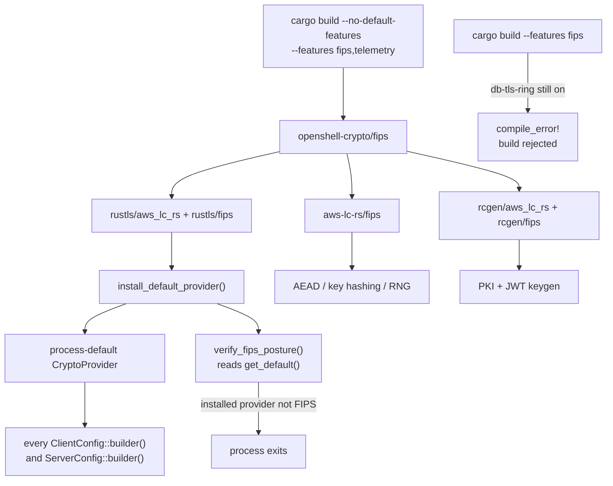

---
authors:
  - "@mrunalp"
state: draft
links:
  - https://github.com/NVIDIA/OpenShell/issues/900
---

# RFC 0013 - FIPS 140-3 Crypto Backend Selection

## Summary

OpenShell performs every cryptographic operation through libraries that have no
FIPS 140-3 validation. This RFC proposes concentrating cryptographic backend
selection in one crate, `openshell-crypto`, wherever a dependency can be made to
honor the process-default provider, and gating the choice behind one Cargo
feature. A default build keeps `ring` and current behavior; a `fips` build routes
TLS, X.509 and JWT key generation, credential encryption at rest, key and
credential-identifier hashing, and randomness through AWS-LC in FIPS mode, and
narrows every algorithm choice to the approved set.

`sqlx` and the AWS SDK cannot honor that provider and select for themselves; they
are handled explicitly in `openshell-server` with their own enforcement. Some
surfaces cannot be moved at any layer, because the crates implementing them offer
no backend choice — AWS SigV4 request signing (`aws-sigv4`) and the SSH
transport's primitives (`russh`). Those need upstream backend support or
replacement, and are out of scope here.

The proposal also records where the design diverged from the plan accepted in
[issue #900](https://github.com/NVIDIA/OpenShell/issues/900) once it met the
codebase. Several of those divergences change what a FIPS build actually
guarantees, so they need review rather than a changelog entry.

[Amendment 1](#amendment-1--openssl-transport-for-rhel-and-openshift) adds a
second FIPS build mode for RHEL and OpenShift that replaces the TLS transport
with the platform's OpenSSL instead of driving rustls from a validated provider.
It is additive — the AWS-LC mode described below is unchanged — and it reverses
one of the Alternatives below on corrected evidence.

## Motivation

FIPS-enabled RHEL 9 and OpenShift clusters are common in government, defense, and
regulated industries. On those clusters the kernel does not block userspace
cryptography, so OpenShell runs — it simply fails a compliance audit, because
every operation that touches key material runs in an unvalidated module.

Before this work the position was absolute rather than partial. There was no
`fips` feature, no way to build one, and no test that would notice a backend
swap. `ring` backed all TLS through rustls, `rcgen` generated PKI keys through
`ring`, credential encryption at rest used `ring`'s AES-GCM and DRBG, and roughly
twenty call sites named a backend directly. Changing backends meant editing all
of them consistently and having no mechanism to detect a site that was missed.

Two properties make this worth an RFC rather than a pull request. First, the
guarantee is subtle: "FIPS-approved algorithms" and "FIPS-validated module" are
different claims, and a design can satisfy one while appearing to satisfy both.
An auditor will ask which one OpenShell provides, and the answer must be written
down before someone makes it in a sales conversation. Second, a FIPS build
changes behavior visible outside the process — the JWT signing algorithm on the
wire, the SSH host key type, and the database trust store — so it is not a
transparent compile flag.

Leaving the design unchanged means regulated deployments remain unavailable, and
the eventual retrofit gets harder as more crates add crypto call sites. The
`openshell-driver-db-credstore` crate is the existing example: it was introduced
after the original investigation and added a new unvalidated path for encrypting
secrets at rest without anyone noticing it was a compliance-relevant surface.

## Non-goals

- **Making the SSH transport FIPS-validated.** This RFC restricts SSH
  negotiation to approved algorithms but does not replace russh's unvalidated
  implementations, which no Cargo feature can redirect. Tracked as Phase 5.
- **Removing `ring` from the dependency graph.** `openshell-crypto` links it
  unconditionally by design, and the AWS SDK links its own copy. This RFC
  measures and documents the residual surface rather than eliminating it.
- **Making AWS SigV4 request signing use a validated module.** `aws-sigv4` offers
  no backend choice, so this needs a reimplementation or an upstream change.
  Tracked as Phase 2b. (STS transport is covered as of Phase 2.)
- **FIPS-capable container images.** The published gateway image is distroless
  Debian and the supervisor is static musl. A UBI-based variant and a glibc
  supervisor build are separate work — but they become a hard prerequisite for the
  supervisor under [Amendment 1](#amendment-1--openssl-transport-for-rhel-and-openshift),
  since a static musl binary cannot link the platform's libcrypto.
- **SDK coverage.** The Go SDK does not set `GOFIPS140`; the Python SDK uses
  grpcio's bundled BoringSSL. Neither is addressed.
- **Runtime FIPS toggling.** Explicitly rejected — see Alternatives.
- **Host-level FIPS mode.** Building against a validated module does not put the
  kernel or platform in FIPS mode. That remains an operator responsibility. Note
  this inverts under [Amendment 1](#amendment-1--openssl-transport-for-rhel-and-openshift):
  in the OpenSSL mode the host's FIPS state is load-bearing rather than
  incidental, because the validated module and the algorithm policy both come
  from the platform.

## Proposal

### One crate owns selection where it can

`openshell-crypto` owns backend selection for everything that can be made to
route through it: OpenShell's own TLS, PKI, JWT, AEAD, randomness, and hashing
that serves a cryptographic purpose — key identifiers and credential path
derivation.

Two dependencies cannot be made to route through it, because they construct a
provider themselves rather than using the process default: `sqlx` and
`aws-smithy-http-client`. For those, `openshell-server` selects the backend
explicitly and separate enforcement covers each — see
[Dependencies that do not honor the process default](#dependencies-that-do-not-honor-the-process-default).
Content and revision hashing is also deliberately out of scope; see
[Algorithm choices that cross process boundaries](#algorithm-choices-that-cross-process-boundaries)
for where that line falls and why.

The mechanism that makes this enforceable is a manifest convention: the workspace
`rustls`, `tokio-rustls`, and `rcgen` entries declare **no** backend feature.
`openshell-crypto` supplies the backend through its own dependency declarations,
and Cargo feature unification applies that choice to every crate in the graph.

`fips` is a **one-way switch** with no opposing `backend-ring` feature. `ring` is
an unconditional dependency; `fips` additionally compiles in AWS-LC and moves
every selection to it. This shape is deliberate and is the single most important
structural decision in the design. Cargo features are additive, so a pair of
mutually exclusive backend features can always both be enabled at once — and any
dependency that resolves that ambiguity by preferring `ring` produces a build
that reports FIPS while using unvalidated crypto. sqlx does exactly this. A
one-way switch has no ambiguous state to resolve.

Where a dependency insists on choosing for itself, the ambiguity is rejected at
compile time rather than resolved silently. `openshell-server` carries a
`compile_error!` for `fips` + `db-tls-ring`, which is why a FIPS gateway must be
built with `--no-default-features --features fips,telemetry`.



Two consequences are worth naming. Installing the restricted provider as the
*process default* means existing `ClientConfig::builder()` and
`ServerConfig::builder()` call sites inherit the restriction with no change —
provider threading is not required. And because that selection happens in one
function, a runtime self-check can confirm the process default is the intended
one. That check reaches only as far as the process default; the two dependencies
that select for themselves need their own enforcement, described under
[Startup verification](#startup-verification).

### FIPS mode is compile-time only

Build-time selection is a deliberate choice rather than a technical necessity.
`ring` is already linked in a FIPS build, so one artifact could dispatch between
backends at runtime. We decline because that would make *which module is in use* a
property of a code path instead of the artifact, and the guarantee would then
depend on every dispatch site being correct.

On rustls 0.23 a second mechanism points the same way — `require_ems`, the TLS 1.2
extended-master-secret requirement, is derived from `cfg!(feature = "fips")`. That
one is version-specific and is being removed: rustls is dropping the core `fips`
feature on `main` (targeting 0.24) and keying those behaviors off the provider's
declared FIPS status at runtime instead
([rustls/rustls#3054](https://github.com/rustls/rustls/issues/3054)).

That change narrows the question without reopening it. Under 0.24 "runtime FIPS"
becomes achievable — a single artifact could select policy at runtime, and `ring`
is already linked for a non-FIPS path. The reason we still would not is the one
above: it moves the guarantee from the artifact to the dispatch sites. Nothing
about it is a rustls limitation.

rustls maintainers also advise against running a FIPS provider in non-FIPS mode —
FIPS code updates slowly and carries countermeasures that cost performance without
improving security — which argues against wanting the single-artifact form anyway.
Migration requirements are recorded in `architecture/build.md`.

### Algorithm restriction defers to rustls, with one narrowing

Cipher suite restriction comes from `rustls::crypto::default_fips_provider()`
rather than a list maintained in OpenShell. rustls compiles ChaCha20-Poly1305 out
entirely under its `fips` feature and tracks the approved set against the
module's validated boundary, so a hand-maintained list could only drift.

Key exchange is narrowed further, to NIST P-256 and P-384. This is *stricter* than
rustls, which keeps X25519 and the X25519+ML-KEM768 hybrid on the grounds that
AWS-LC's validated boundary covers them. Two reasons to narrow: an auditor
reading SP 800-56A rev3 expects NIST curves, and every TLS 1.3 stack supports
P-256 so the interoperability cost is nil.

The cost is real and should be weighed in review: FIPS builds lose post-quantum
hybrid key exchange that default builds get. The narrowing is one filter in one
function, so reversing it is a small change if reviewers prefer rustls's position.

### Startup verification

`verify_fips_posture()` runs at gateway and CLI startup and fails the process if
the provider actually installed does not report FIPS-approved cryptography. It
inspects `CryptoProvider::get_default()` rather than a freshly constructed
provider, because checking what we *would* have installed proves nothing about
what is in use: `install_default()` loses to whoever got there first, so a
dependency or an earlier code path can win the race.

Its scope is the process-default provider and nothing more. Dependencies that
construct their own provider are invisible to it, so the design needs three
enforcement mechanisms rather than one:

| Mechanism | Covers | When it fires |
|---|---|---|
| `verify_fips_posture()` | Everything on the process-default provider: OpenShell's own TLS, `reqwest`, `kube`, `tokio-tungstenite` | Gateway and CLI startup |
| `compile_error!` on `fips` + `db-tls-ring` | Database TLS, which `sqlx` selects from its own features | Compile time |
| Unit test on `aws_crypto_mode()` | The AWS SDK path, which `aws-smithy-http-client` selects for itself | Test time |

A build that wired the AWS path to `ring` would still pass the startup check; only
the mode test catches it. Reviewers should not read the startup check as a
whole-process guarantee.

The startup check itself catches two failures — a feature that reached
`openshell-crypto` but not
`rustls`, and a process default installed by something else. Both would
otherwise downgrade silently and pass every functional test.

A companion `ensure_default_provider()` exists for library code that constructs
TLS clients without a binary entry point having run first — library crates are
also used from tests and other embedders, and rustls panics when a TLS config is
built with no process default. It only fills in a missing provider and can never
replace one, so it is safe to call from a library.

### Algorithm choices that cross process boundaries

Three build-mode differences are visible outside the process and need operator
documentation rather than only code comments:

**JWT signing — requires key rotation.** Gateway-issued sandbox tokens move from
Ed25519 (`EdDSA`) to ECDSA P-256 (`ES256`). Ed25519 is approved only under FIPS 186-5 and only when
the module certificate covers EdDSA, which is not a property assertable for the
implementations in use. Signing and validation are each pinned to exactly one
algorithm and the sets are deliberately disjoint, so a FIPS gateway cannot
validate a token signed with a non-approved key. There are two consequences. **Mixed-mode replica sets are unsupported** — tokens
fail validation across them, and nothing detects the mismatch until the first
cross-replica validation. And because the signing key is persisted, an existing
gateway holds an Ed25519 key that a FIPS build cannot parse: it **fails to
start** rather than merely invalidating in-flight tokens. Switching an existing
deployment therefore requires rotating the JWT key with `generate-certs`. The
error message names the required algorithm and the remedy, and a regression test
asserts it does.

**SSH host keys.** Host keys move from Ed25519 to ECDSA P-256, changing the
fingerprint. Sandboxes are ephemeral and generate a host key per sandbox, so
there is no persistent `known_hosts` entry to update.

**Hashing scope.** Key identifiers, credential-storage key identifiers, and
Kubernetes Secret and Vault credential path derivation are routed through the
validated module. Content and revision hashing — policy revisions, profile
catalogs, image digests — remains on RustCrypto `sha2`. Those are
content-addressing and change detection rather than security functions: they
protect nothing and gate no decision. An auditor requiring every SHA-256
invocation to come from the validated module regardless of purpose would need a
mechanical follow-up.

**Database trust store.** sqlx offers native-root loading only on its `ring`
backend, so a FIPS build uses webpki bundled roots for PostgreSQL. Deployments
using a private CA must set `sslrootcert` in `DATABASE_URL`, which works
independently of the root store.

### SSH negotiation is restricted, not validated

`openshell_crypto::ssh::preferred()` restricts SSH key exchange, host key,
cipher, and MAC negotiation to approved algorithms, and excludes Curve25519,
ML-KEM, and ChaCha20-Poly1305. Diffie-Hellman group exchange is also excluded:
the group is server-chosen, so an approved implementation cannot be asserted from
the algorithm name. The OpenSSH strict-kex markers are retained, because dropping
them would disable the Terrapin (CVE-2023-48795) mitigation.

This restricts *negotiation only*. russh implements the selected algorithms with
`ed25519-dalek`, `p256`, and RustCrypto AES, none of which are validated modules.
The gap is accepted on two grounds, both of which should be reviewed rather than
assumed: the transport runs inside the gateway's mTLS boundary, and the SSH layer
performs no authentication of its own — `auth_none` and `auth_publickey` both
accept unconditionally, with trust established by unix-socket peer credentials.

### Dependencies that do not honor the process default

Two dependencies select a provider themselves and need separate handling:

- **sqlx** calls `builder_with_provider` with a provider chosen by its own Cargo
  features, so `openshell-server` forwards the backend choice to it. This is the
  source of the trust-store limitation above.
- **aws-smithy-http-client** constructs its own provider, so `openshell-server`
  selects the AWS SDK's TLS backend explicitly in code (Phase 2) rather than
  leaving it to feature resolution.
- **aws-sigv4** depends on RustCrypto `hmac` and `sha2` unconditionally with no
  backend feature, so SigV4 request signing — supervisor proxy-side *and* gateway
  STS `AssumeRole` — stays outside the validated module in every build mode.

`mise run fips:audit` reports the residual `ring` surface and the number of
distinct rustls versions in a FIPS build, so the gap is a measured number in CI
rather than a discovery during an audit.

## Design changes from the accepted plan

The plan in issue #900 was written from a static investigation. Implementation
changed the following. Items marked **guarantee** alter what a FIPS build
actually promises and are the ones most in need of review.

| Accepted plan | What changed | Why |
|---|---|---|
| Hand-maintain FIPS cipher suite and kx lists | Suites come from rustls's `default_fips_provider()`; only kx is narrowed | rustls compiles ChaCha20 out under its own `fips` feature and tracks the validated boundary; a local list could only drift |
| Excluding X25519 follows from FIPS | **guarantee** — X25519 removal is a deliberate policy choice stricter than rustls | rustls keeps X25519 and X25519+ML-KEM768 because AWS-LC's boundary covers them; removing them costs the PQ hybrid |
| `--no-default-features --features fips` excludes `ring` | **guarantee** — `ring` stays linked; documented and measured instead | `openshell-crypto` depends on it unconditionally so the backend cannot become ambiguous, and several dependencies enable `rustls/ring` transitively |
| Flip rustls features per crate at each of ~20 sites | One facade crate owns selection for everything on the process-default provider; workspace entries carry no backend feature | Feature unification gives one point of control for those sites. It does not cover dependencies that build their own provider — `sqlx` and the AWS SDK stay explicit exceptions in `openshell-server` |
| Paired `backend-ring` / `fips` features | **guarantee** — no opposing feature; `ring` unconditional, `fips` a one-way switch | Additive features make both simultaneously enableable, and sqlx resolves that toward `ring`, silently producing a non-FIPS build |
| `--features fips` is the build command | **guarantee** — the gateway needs `--no-default-features --features fips,telemetry`, enforced by `compile_error!` | Same sqlx ambiguity; a build error is the only outcome that cannot be missed |
| Switching build modes only invalidates in-flight tokens | **guarantee** — an existing gateway fails to start until its JWT key is rotated | The signing key is persisted, and a FIPS build cannot parse an Ed25519 key |
| "Hashing and RNG" move to the validated module | **guarantee** — key and credential-identifier hashing move; content and revision hashing stays on RustCrypto | Those are content-addressing rather than security functions; the blanket claim was too broad |
| Startup check validates the provider | **guarantee** — it validates the *installed* provider via `get_default()` | `install_default()` loses to whoever got there first, so checking a freshly built provider proves nothing |
| Replace NSSH1 HMAC with aws-lc-rs HMAC | Dropped — the code no longer exists | `ssh_tunnel.rs` was removed in #1029 and the NSSH1 handshake with it; a dead `hmac` dependency was also removed |
| tokio-tungstenite needs a backend feature change | No change needed | Its `__rustls-tls` feature pins no backend and already uses the process default |
| reqwest: "switch to using the global provider" | Switched to `rustls-tls-native-roots-no-provider` | The plain `rustls-tls-native-roots` feature force-enables `__rustls-ring` |
| sqlx "should respect the global provider" | **guarantee** — it does not; needs per-crate gating and loses native-root loading | sqlx calls `builder_with_provider` with a feature-selected provider |
| Include DH group exchange among approved SSH kex | Excluded | The group is server-chosen, so approval cannot be asserted from the algorithm name |
| JWT signing algorithm not addressed | **guarantee** — EdDSA → ES256 under `fips`, with disjoint validation sets | Ed25519 approval depends on the module certificate covering FIPS 186-5 |
| Credential encryption at rest not in scope | **guarantee** — included in Phase 1 | The `openshell-driver-db-credstore` crate postdates the investigation and encrypts secrets at rest through `ring`; highest audit sensitivity in the codebase |
| `rcgen/fips` selects the FIPS backend | Requires `rcgen/aws_lc_rs` **and** `rcgen/fips` | rcgen 0.13.2's `fips` feature pulls the FIPS sys crate but its backend selection gates on `feature = "aws_lc_rs"`; `fips` alone fails to compile |
| AWS SDK migration is a "massive rewrite" | Done in Phase 2 as a dependency and client-construction change | `aws-smithy-http-client` 1.1.13 exposes a `rustls-aws-lc-fips` feature and a `CryptoMode::AwsLcFips` variant |
| "The AWS SDK" is one item | **guarantee** — it is two: STS transport (closed in Phase 2) and SigV4 signing (not closable by configuration) | `aws-sigv4` depends on RustCrypto `hmac`/`sha2` unconditionally with no backend feature |
| `require_ems` not mentioned | Set automatically by rustls's `fips` feature on 0.23 | Reinforces compile-time-only selection, though the durable reason is that the validated module is a distinct linked library. rustls is moving this to a runtime check in 0.24 |

## Implementation plan

**Phase 1 — TLS, PKI, credential storage, SSH negotiation. Complete.**
Adds `openshell-crypto` with a single one-way `fips` feature; migrates all
provider-install sites, custom certificate verifiers, PKI and JWT key
generation, credential AEAD, cryptographic hashing, and both SSH configs; adds
the `compile_error!` guard for the sqlx conflict in `openshell-server`; adds
`mise run fips:{check,test,build,audit}`; documents the operator-facing view in
`docs/security/fips.mdx` and the workspace feature scheme in
`architecture/build.md`.

Validation: 5087 tests pass in default mode; 473 in FIPS mode via
`mise run fips:test`, which runs the **strict** feature graph
(`--no-default-features --features fips,…`) so the tests exercise the same
backend the shipped build uses. Coverage includes credential-envelope
round-trips, ES256 JWT round-trips, and the key-rotation error. clippy is clean
under `-D warnings` in both modes. The tests assert on the negotiable algorithm
sets rather than on the feature flag, so a regression in a restriction list fails
rather than passing silently.

**Phase 2 — AWS SDK leg. Transport done; signing blocked.**
`openshell-server` now builds the SDK's HTTPS client explicitly
(`provider_refresh::aws_http_client`) with a `CryptoMode` selected by the `fips`
feature, so STS calls use AWS-LC in FIPS mode. `CryptoMode::AwsLcFips` asserts
internally that its provider reports FIPS, but that fires when the first connector
is requested rather than at client construction — `build_https` is lazy. The
build-mode guarantee for this path therefore rests on a unit test asserting the
selected `CryptoMode`, not on the client being constructible.

Supplying the client also made the SDK's own TLS features redundant, and dropping
them removed the legacy `rustls 0.21` stack that `aws-sdk-sts/rustls` pulled in
via `legacy-rustls-ring`. **The graph now contains a single rustls major (0.23),**
which retires the "second TLS stack the installed provider does not govern"
concern from Phase 1.

What Phase 2 does **not** close is SigV4 request signing. `aws-sigv4` depends on
RustCrypto `hmac` and `sha2` unconditionally and exposes no backend feature, so
the HMAC-SHA256 chain keyed with the AWS secret access key runs outside the
validated module in every build mode. This applies to the gateway's own STS
`AssumeRole` requests as well as to supervisor proxy-side signing: `aws-sdk-sts`
signs through `aws-runtime` -> `aws-sigv4`. Phase 2 moved STS *transport* into the
validated module and left STS *signing* outside it — a distinction worth stating
plainly, because "STS now uses the validated module" would be a misreading. This was not visible from the original
investigation, which treated "the AWS SDK" as one item. It is arguably the more
important half: it is HMAC directly over credential material rather than a
transport concern. Closing it needs either a SigV4 implementation against
`openshell-crypto`, validated against AWS's published test vectors, or an
upstream backend feature in `aws-sigv4`. Tracked as Phase 2b.

**Phase 3 — FIPS-capable images.** A UBI-based gateway image and a glibc
supervisor build. The current static musl supervisor cannot link a system
OpenSSL, so this is a packaging change rather than a feature flag.

**Phase 4 — SDKs.** `GOFIPS140=v1.0.0` for the Go SDK, which is close to
free since Go's own module is CMVP-validated. The Python SDK's bundled BoringSSL
has no equivalent path and may stay a documented gap.

**rustls 0.24 upgrade (tracking, not a phase).** rustls is removing the core
`fips` feature and moving the provider to a separate `rustls-aws-lc-rs` crate
([rustls/rustls#3054](https://github.com/rustls/rustls/issues/3054)). Neither is
released — 0.24 exists only as a `0.24.0-dev` prerelease — and maintainers have
said 0.23 will not change, so nothing is affected today. On upgrade,
`openshell-crypto`'s `rustls/aws_lc_rs` and `rustls/fips` features and the
`default_fips_provider()` call all move, and `verify_fips_posture()` becomes more
load-bearing because rustls will derive protocol behavior from `provider.fips()`
rather than a compile-time flag. Requirements are recorded in
`architecture/build.md`.

**Phase 5 (deferred) — SSH transport validation.** Either an aws-lc-rs backend
upstream in russh or replacing the embedded server with OpenSSH. Deferred until
an audit actually requires it, since the transport is defense-in-depth.

Phases 6 through 8 are defined in
[Amendment 1](#amendment-1--openssl-transport-for-rhel-and-openshift), which adds
the OpenSSL transport mode for RHEL and OpenShift.

Every phase is independently shippable, and Phase 1 is off by default so none of
this affects existing users until they opt in.

## Risks

**The guarantee is easy to overstate.** "Every OpenShell crypto operation uses a
validated module" and "the binary contains no unvalidated crypto" are different
claims, and the second is false. The mitigation is that the difference is written
into the crate docs, the published docs, and a CI-runnable audit task — but the
residual risk is someone quoting the stronger claim. This is the main reason the
design is in an RFC.

**Mixed-mode replica sets fail silently until a token is validated.** A FIPS and a
non-FIPS gateway in one replica set will mint tokens the other rejects. There is
no startup check for this because a gateway cannot see its peers' build mode. The
mitigation is documentation; a stronger option would be advertising the build mode
in gateway registration metadata and failing loudly, which is an open question.

**FIPS builds lose post-quantum key exchange.** The NIST-only narrowing removes
X25519+ML-KEM768. For a threat model that weights harvest-now-decrypt-later
highly, a FIPS build is worse than a default build on that axis.

**The FIPS build command is easy to get wrong.** `--features fips` alone is the
natural thing to type and is exactly the combination that must not ship. This is
mitigated by a `compile_error!` rather than documentation, but it does mean the
FIPS build line is longer and has to re-list the non-crypto defaults
(`telemetry`, `bundled-z3`, `bundled-ca-roots`). A default that is dropped by
mistake is a silent behavior change rather than a build failure.

**Library crates now install a process-global provider.** `ensure_default_provider()`
is called from library code that builds TLS clients. It can only fill in a
missing provider, never replace one, but it does mean an embedder that expects to
install its own provider must do so before calling into OpenShell.

**Build toolchain cost.** `aws-lc-fips-sys` compiles from source and needs CMake
and Go. This is why the FIPS build is not part of the default `ci` task, and it
makes FIPS release artifacts more expensive to produce.

**The database trust-store change can break deployments.** A FIPS build silently
stops reading the system trust store for PostgreSQL TLS. A deployment relying on
a system-installed private CA will fail to connect after switching. Documented
with the `sslrootcert` workaround, but it is a real migration trap.

**New dependency surface.** AWS-LC in FIPS mode is a substantial C library and a
new support obligation, including tracking which CMVP certificate the vendored
version corresponds to.

## Alternatives

### System OpenSSL for everything

**No longer rejected — adopted for the RHEL/OpenShift target. See
[Amendment 1](#amendment-1--openssl-transport-for-rhel-and-openshift).**

This entry originally read: *"Rejected because it is a large rewrite, gives up
rustls's memory-safety properties, adds a system library dependency, and
complicates cross-platform builds."* Most of that was wrong or overstated. The
correction is recorded in the amendment rather than quietly edited away, because
the original reasoning is why the AWS-LC path was built first.

What held up: it does add a system library dependency, and it does give up
rustls's memory safety for the TLS stack.

What did not: it is not a large rewrite, because our multiplex, routing, and
upgrade logic is generic over the stream type and never names a TLS type. And
cross-platform builds are unaffected — the FIPS build targets Linux only, so
macOS and Windows keep the rustls path.

### Runtime FIPS toggle

A configuration switch selecting the backend at startup, so one binary serves
both modes. Technically possible — `ring` is already linked in a FIPS build —
and rejected on design grounds: it would leave a non-validated path reachable in a
FIPS deployment and make the guarantee contingent on every dispatch site being
correct, rather than a property fixed when the artifact is built.

rustls 0.24 will make rustls's own behavioral adaptations runtime-selectable
(rustls/rustls#3054), so a binary linked only against the FIPS module could relax
its policy at runtime. That is a narrower capability than "runtime FIPS" suggests,
it is not what a FIPS deployment wants, and rustls maintainers advise against it
on performance and update-cadence grounds.

### Per-crate feature flipping without a facade crate

The originally accepted approach: enable the right rustls feature in each crate
and switch each provider-install site on `#[cfg(feature = "fips")]`. Rejected
because it distributes the invariant across ~20 sites with no mechanism to detect
a missed one, and because it offers no single place to put the startup
verification that catches a mis-plumbed feature.

### Do nothing

Regulated deployments stay unavailable, and the retrofit cost grows as new crates
add crypto paths. `openshell-driver-db-credstore` is the concrete evidence: it
added an unvalidated secrets-at-rest path after the original investigation and
would have been missed again.

## Amendment 1 — OpenSSL transport for RHEL and OpenShift

*Status: proposed, contingent, and **not yet implementable** — see
[Implementation gate](#implementation-gate). Supersedes the "System OpenSSL for
everything" rejection in [Alternatives](#system-openssl-for-everything). Additive —
the AWS-LC mode described above is unchanged and remains the default FIPS build for
non-RHEL targets.*

*Contingent because a cheaper option covers most of the same ground: see
[`rustls-ossl` as the smaller alternative](#rustls-ossl-as-the-smaller-alternative).
Adopt this amendment only if honoring `update-crypto-policies` TLS settings is a
requirement.*

### Why the original rejection was wrong

Red Hat's FIPS validation covers the platform's system OpenSSL. A vendored
AWS-LC-FIPS that we compile ourselves is a validated *module* but not *the*
validated module on RHEL, so it does not support a RHEL FIPS claim. That alone
would justify revisiting the decision.

Two further findings make the original rejection untenable rather than merely
debatable:

**`rustls-openssl` is not FIPS-correct.** The obvious cheap path — keep rustls,
back it with system OpenSSL via the existing `rustls-openssl` provider — does not
work. That crate obtains classical algorithms through legacy implicit-fetch APIs
(`Md::sha256()` → `EVP_sha256()`, `Cipher::aes_256_gcm()` → `EVP_aes_256_gcm()`),
which return static algorithm objects from the default provider rather than
fetching from the FIPS provider with an explicit library context. Only its
post-quantum path uses the modern interface
(`EVP_PKEY_CTX_new_from_name(libctx, …)`). FIPS-correct OpenSSL 3 use requires
explicit fetch against an `OSSL_LIB_CTX`, which is precisely what the
[`ossl`](https://crates.io/crates/ossl) crate provides and what
`rustls-openssl` does not do.

**rustls inherits provider-level policy but not libssl-level policy.** This is the
deciding factor for the target, and it needs stating precisely, because an earlier
draft of this amendment overstated it as "rustls cannot inherit the platform crypto
policy" — which is not true.

A correct `ossl`-backed provider *does* inherit a meaningful amount. `rustls-ossl`
builds its library context with `load_default_configuration()`, so it reads the
system `openssl.cnf` — which on a RHEL FIPS host is where the FIPS provider is
activated. It then gates key exchange groups and signature algorithms on runtime
availability (`EvpPkey::available(ctx, …)`, `available(ctx, sig_alg)`), so the
negotiable set shrinks automatically to whatever the FIPS provider offers.

What no rustls provider can inherit is **libssl-level TLS configuration**:
`CipherString`, `MinProtocol`, `Groups` and friends, written by
`update-crypto-policies` into
`/etc/crypto-policies/back-ends/opensslcnf.config`. Those are consumed by libssl
when an `SSL_CTX` is constructed. rustls is not libssl, so it never reads them —
`update-crypto-policies --set LEGACY`, or a policy that removes SHA-1 or raises the
minimum protocol version, has no effect on a rustls listener.

| | `rustls-ossl` | OpenSSL transport |
|---|---|---|
| Validated module boundary | ✅ | ✅ |
| FIPS activation from `openssl.cnf` | ✅ | ✅ |
| Algorithm availability follows the FIPS provider | ✅ | ✅ |
| `update-crypto-policies` TLS settings honored | ❌ | ✅ |

So the choice between the two rests on exactly one question, recorded in
[Open questions](#open-questions-for-this-amendment): does the requirement include
honoring `update-crypto-policies` TLS settings, or is it satisfied by using the
platform's FIPS provider with its algorithm availability? Only the former
justifies replacing the transport.

### Dependency features are load-bearing

`ossl`'s defaults do not use the system OpenSSL, and getting this wrong silently
defeats the entire premise of this amendment.

`ossl` defaults to `ossl-sys`, whose build script `.expect()`s
`KRYOPTIC_OPENSSL_SOURCES` and runs `./Configure` to compile a **private** OpenSSL
from source. `pkg_config` and dynamic linking against the platform library are
reached only under the `dynamic` feature. A build that omits it links a
self-compiled OpenSSL that is not Red Hat's validated module — while every runtime
check still reports FIPS.

Both OpenSSL-mode variants must therefore pin:

```toml
ossl = { version = "1.5", default-features = false, features = ["dynamic"] }
```

with `ossl`'s own `fips` feature **off** — that feature builds the vendored
FIPS OpenSSL with Kryoptic's `KRYOPTIC_FIPS_VENDOR`/`VERSION`/`BUILD` stamps,
which is the opposite of using the platform provider. FIPS state comes from the
host, verified at runtime.

`mise run fips:audit` must assert this on the resolved graph, not the manifest:
absence of `ossl-sys`'s vendored build and presence of a dynamic link to the
platform libcrypto. A manifest-only check would pass on a graph where another
crate re-enabled the default feature.

### What changes

A second FIPS build mode in which the TLS *transport* is OpenSSL rather than
rustls. Primitives that OpenShell performs itself continue to route through
`openshell-crypto`, backed by `ossl`.

| Surface | AWS-LC mode | OpenSSL mode |
|---|---|---|
| TLS transport | rustls + `default_fips_provider()` | OpenSSL `libssl` via `tokio-openssl` |
| gRPC (tonic) | `tonic` rustls features | [`tonic-tls`](https://crates.io/crates/tonic-tls) `openssl` feature |
| HTTP (axum/hyper) | unchanged — no TLS coupling | unchanged — no TLS coupling |
| Multiplex, routing, upgrades | unchanged | unchanged |
| AEAD, digest, RNG, keygen | `aws-lc-rs` | `ossl` (`dynamic`) |
| Database TLS | `sqlx/tls-rustls-aws-lc-rs` | `sqlx/tls-native-tls` |
| **AWS STS transport** | `CryptoMode::AwsLcFips` | **no upstream path — see below** |
| **JWT/JOSE sign + verify** | `jsonwebtoken/aws_lc_rs` | **no upstream path — see below** |
| Cipher suite / version policy | ours, hard-coded | inherited from `/etc/crypto-policies` |

Two rows have no upstream answer, and an OpenSSL-mode build cannot be described as
OpenSSL-only until both are resolved:

**AWS STS transport.** `provider_refresh.rs` constructs an
`aws-smithy-http-client` explicitly. Smithy's TLS providers are rustls and
s2n-tls; there is no OpenSSL option, and even `CryptoMode::Custom` takes a
*rustls* `CryptoProvider`. So the choices are a hand-written
`SharedHttpClient` over `tokio-openssl`, or retaining AWS-LC for the STS path and
narrowing the compliance claim accordingly. This must be decided before Phase 6
ships, not after.

**JWT/JOSE.** `jsonwebtoken` is enabled with `aws_lc_rs` unconditionally, and it
is not confined to signing — see Phase 7.

### Why the transport change is small

The coupling is narrower than the count of rustls references suggests, because
our own abstractions are already generic:

- `MultiplexedService::serve<S>` and its siblings are generic over the stream
  type. The complex part — gRPC/HTTP content-type routing, HTTP/2 keepalive
  tuning, upgrade handling, listener scoping — never names a TLS type and does not
  change.
- axum has no TLS coupling at all; it is a `tower::Service`. Our serve loop
  already follows the canonical low-level pattern (accept TCP → acceptor →
  `TokioIo::new` → `hyper_util::server::conn::auto::Builder`), which is
  acceptor-agnostic.
- `tonic-tls` supplies both a server `TlsIncoming` and a client `TlsConnector`
  over `tokio-openssl`, and takes a caller-constructed `SslAcceptor`/`SslConnector`
  — so full verification control is retained.

The actual edits are the acceptor, the client connectors, the peer-certificate
extraction, and peripheral crate features:

| Site | Change |
|---|---|
| `openshell-server/src/tls.rs` | Acceptor on `SslAcceptor` + `tokio-openssl`, preserving hot reload |
| `openshell-server/src/lib.rs` (accept loop) | Acceptor type at the call site |
| `openshell-server/src/multiplex.rs` | `peer_certificates()` → `ssl().peer_certificate()` — **not** `peer_cert_chain()`; see below |
| `openshell-sdk/src/transport.rs`, `openshell-cli/src/tls.rs` | `tonic-tls::openssl::TlsConnector` |
| `openshell-supervisor-network/src/l7/tls.rs` | Build the acceptor per host as today; **no SNI callback** — see below |
| `reqwest`, `tokio-tungstenite`, `kube`, `sqlx` | their `native-tls`/OpenSSL features |

`openssl` 0.10 exposes what the architecture needs: `set_alpn_protos` and
`set_alpn_select_callback` for HTTP/2 negotiation, and `set_verify` +
`set_ca_file` + `set_client_ca_list` for gateway mTLS with client-certificate
verification.

**mTLS identity must use `peer_certificate()`, not `peer_cert_chain()`.** On a
server, OpenSSL's peer *chain* omits the client's leaf certificate — an
asymmetry with the client side that OpenSSL documents explicitly. Our
`extract_peer_identity` reads the leaf (`certs[0]`) to derive the principal, so
translating it to `peer_cert_chain()` would silently break mTLS identity, either
failing to authenticate or — worse — deriving identity from an intermediate. Use
`SslRef::peer_certificate() -> Option<X509>`. An integration test asserting the
extracted principal against a known client certificate is required, not optional:
a unit test on the parsing helper would not catch this.

**The supervisor needs no SNI callback.** `l7/tls.rs::acceptor_for(hostname)`
already receives the hostname from the CONNECT request and builds a matching
acceptor before the handshake begins. Moving that into
`set_servername_callback` would add a dependency on the client sending SNI and
risk regressing IP-literal and no-SNI traffic that works today. Keep the existing
structure and only change the acceptor type.

`native-tls` was evaluated and rejected for the gateway: its `TlsAcceptorBuilder`
exposes only protocol versions and ALPN, and its OpenSSL backend hardcodes
`set_verify(SslVerifyMode::NONE)`, so mTLS client-certificate verification is not
expressible. It remains the right choice for `sqlx`, which is client-only.

### `rustls-ossl` as the smaller alternative

If libssl-level policy inheritance is *not* required, the cheaper option is
[`rustls-ossl`](https://github.com/latchset/kryoptic/tree/main/rustls/ossl) — a
rustls `CryptoProvider` over `ossl`, from the same project. It pins
`rustls >=0.23.37, <0.24`, which our 0.23.38 satisfies.

For **consumers that already use the rustls process-default provider** it is a
`provider()` swap and nothing more. `tokio-rustls` is provider-agnostic — it wraps
`rustls::ServerConnection`/`ClientConnection` and never sees the provider — and our
workspace declares no backend feature on either `rustls` or `tokio-rustls`. So the
acceptor, multiplex, hot reload, `peer_certificates()`, tonic, hyper-rustls and
kube all stay as they are:

```rust
let config = ServerConfig::builder_with_provider(Arc::new(rustls_ossl::default_provider()))
    .with_safe_default_protocol_versions()?
    .with_client_cert_verifier(verifier)
    .with_single_cert(certs, key)?;
let acceptor = tokio_rustls::TlsAcceptor::from(Arc::new(config));
```

**It does not, however, cover the surfaces that bypass that provider.** An earlier
draft described it as "a provider swap and nothing more", which was wrong. sqlx,
the AWS Smithy client, our direct primitives (credential AEAD, digest, RNG,
keygen) and `jsonwebtoken` all select crypto independently, so this option carries
the same per-surface work as the transport option — everything in the table above
except the transport rows. The saving is the transport, not the periphery.

It is the *cleanest* rustls dependency graph of the three modes: with no backend
feature on `rustls`, an ossl-only build drops both `ring` and `aws-lc-rs` from the
rustls graph, which neither the default nor the AWS-LC mode achieves.

Caveats, none structural but all load-bearing:

- Its cipher suites are **not** availability-gated the way its key exchange groups
  and signature algorithms are, so ChaCha20-Poly1305 is advertised unconditionally
  and would be offered even where the FIPS provider cannot supply it. We would
  filter it — the same mechanism the AWS-LC mode uses to narrow key exchange — and
  report the inconsistency upstream.
- Unpublished at v0.0.1 inside a monorepo, so consuming it means a pinned git
  dependency until latchset publishes.
- Its manifest enables `ossl320`, so the supported OpenSSL floor is 3.2+. The
  RHEL/OpenShift version matrix must be settled before selecting it.
- It links the platform libcrypto through `ossl` exactly as the transport option
  does, so **it does not rescue the static-musl supervisor.** An earlier draft
  claimed choosing this would make Phase 8 unnecessary; that was false. The
  supervisor needs the glibc/UBI packaging change under either option.

### Artifact and enforcement model

Three modes — default `ring`, AWS-LC FIPS, system-OpenSSL FIPS — reintroduce
exactly the additive-feature ambiguity Phase 1 was built to eliminate. The model
has to be defined before code, or a wrong build will report success.

**Mutually exclusive features.** Rename the existing `fips` to `fips-aws-lc` and
add `fips-ossl`. Ambiguity is rejected at compile time, extending the pattern
already used for the sqlx conflict:

```rust
#[cfg(all(feature = "fips-aws-lc", feature = "fips-ossl"))]
compile_error!("...mutually exclusive...");
```

**Per-mode dependency forwarding.** Each crypto mode pulls the matching database
TLS feature, so a mode cannot be selected without its dependent surfaces
following. The `db-tls-*` trio becomes explicit rather than hiding a database
concern inside `fips`:

| | default | `fips-aws-lc` | `fips-ossl` |
|---|---|---|---|
| `openshell-crypto` backend | `ring` | `aws-lc-rs/fips` | `ossl` (`dynamic`) |
| sqlx | `db-tls-ring` | `db-tls-aws-lc` | `db-tls-openssl` |
| rustls backend feature | `ring` | `aws_lc_rs` + `fips` | none (ossl-provider variant) or n/a |

**Exactly one valid build command per artifact**, recorded in `tasks/fips.toml`
and in `docs/security/fips.mdx`, each re-listing the non-crypto defaults that
`--no-default-features` drops.

**Dependency audit as a gate, not a report.** `fips:audit` currently reports.
For the OpenSSL mode it must *fail* on: a vendored `ossl-sys` OpenSSL build,
absence of a dynamic link to the platform libcrypto, or a rustls backend feature
leaking in. This is the only check that catches the `dynamic`-feature mistake
above, because every runtime check still passes without it.

**Runtime posture checks, per mode.** `verify_fips_posture()` currently inspects
the rustls process-default provider. In the OpenSSL mode it must instead verify
both:

1. the **explicit `ossl` library context** used for our own primitives reports
   FIPS (`OsslContext::fips_is_enabled()`), and
2. the **libssl context** backing the transport is in FIPS mode,

and fail startup otherwise. Neither alone is sufficient, because the two can
diverge — our primitives could be validated while the transport is not.

**Host state is part of the claim.** Unlike the AWS-LC mode, where FIPS is a
property of the artifact, here the claim depends on the host being switched to
FIPS mode per Red Hat's procedure
([RHEL 9 security hardening guide](https://docs.redhat.com/en/documentation/red_hat_enterprise_linux/9/html/security_hardening/switching-rhel-to-fips-mode_security-hardening)).
Tests must run on a genuinely FIPS-configured host under the FIPS crypto policy;
a passing suite on a non-FIPS developer machine proves nothing about this mode.

### Sequencing is constrained by packaging

**The supervisor is a statically linked musl binary and cannot link the platform's
validated libcrypto at all**, so its OpenSSL path is blocked behind the glibc/UBI
packaging work in Phase 3.

The gateway is glibc-linked, but that is necessary and not sufficient: **glibc
linkage does not establish module provenance.** The claim requires the runtime
image to contain Red Hat's OpenSSL and its policy configuration. The published
gateway image is distroless Debian, whose libcrypto is not the validated module,
so Phase 6 also needs a UBI/RHEL gateway image — not merely a compiler target
change. Gateway first because its packaging change is smaller, not because it is
already satisfied.

### What we give up

Policy inheritance is the point of this change and also its main cost. Once
`/etc/crypto-policies` governs TLS, an operator running
`update-crypto-policies --set LEGACY`, or a policy that drops TLS 1.2, silently
changes what OpenShell negotiates. This is the deliberate inverse of the
NIST-only key-exchange narrowing that the AWS-LC mode applies: there we chose
determinism over platform integration, here we choose the opposite. Both are
defensible for their target; what is not defensible is claiming both properties
at once.

We also give up rustls's memory safety for the TLS stack, and take on a system
library dependency with a version floor.

### New phases

**Phase 6 — OpenSSL transport for the gateway.** `ossl`-backed primitives in
`openshell-crypto`; `tls.rs` acceptor on `tokio-openssl`; `tonic-tls` client
connectors; peer-certificate extraction; `sqlx` on `tls-native-tls`. Gateway and
CLI only.

**Phase 7 — X.509 and all JOSE operations on `ossl`.**

`rcgen` is the tractable half: it exposes a `RemoteKeyPair` trait *not* gated on
its `crypto` feature, so an `ossl`-backed signer can drive it with rcgen reduced to
ASN.1 encoding and neither `ring` nor `aws-lc-rs` linked through it. Note
`serialize_der`/`serialize_pem` panic on remote key pairs, so the five production
sites that persist private keys must obtain them from `ossl` instead.

`jsonwebtoken` is larger than "JWT generation" and the earlier phrasing understated
it. It has no external-signer hook, is enabled with `aws_lc_rs`
unconditionally, and covers three distinct surfaces:

- **Sandbox token signing and verification** — `auth/sandbox_jwt.rs`, ES256/EdDSA.
- **OIDC / JWKS verification** — `auth/oidc.rs`, RS256 against fetched JWKS.
- **Google service-account assertions** — `provider_refresh.rs`, RS256 signing.

All three must move for an OpenSSL-only claim to hold. That means RSA
verification against JWKS-supplied moduli and RSA assertion signing, not only
ECDSA — a wider surface than the sandbox path alone. **Until Phase 7 lands, Phase 6
must not be described as an OpenSSL-only mode**; it is an OpenSSL-transport mode
with JOSE and (pending the STS decision) AWS SDK traffic still on AWS-LC. The
`docs/security/fips.mdx` gap list and `fips:audit` output must say so from the
first commit.

**Phase 8 — OpenSSL transport for the supervisor.** Requires the Phase 3
glibc/UBI packaging change first.

### Implementation gate

This amendment is not implementable as written. Before any Phase 6 code, the
following must be resolved in the RFC:

1. **Exact supported RHEL/OpenShift and OpenSSL versions.** `ossl` gates on
   `ossl320` (3.2+) and `ossl350` (3.5+); `rustls-ossl` requires `ossl320`. The
   matrix determines which options are available at all.
2. **Mutually exclusive artifact features and one strict build command per
   artifact**, per [Artifact and enforcement model](#artifact-and-enforcement-model).
3. **A decision for every surface**, not just the transport: AWS STS, sqlx,
   JWT/JOSE, and direct primitives. Each is either moved to `ossl` or explicitly
   retained on AWS-LC with the compliance claim narrowed in
   `docs/security/fips.mdx`. "Unspecified" is not an option, because the default is
   silently AWS-LC or rustls.
4. **Startup posture, dependency-audit, and UBI integration tests running under
   the RHEL FIPS crypto policy** on a genuinely FIPS-configured host.
5. **A vertical prototype** proving, through the platform OpenSSL: gateway mTLS
   *identity extraction*, a gRPC client connection, a sqlx connection, and an AWS
   STS call. This is the cheapest way to find the remaining unknowns, and the mTLS
   identity item exists specifically because the first draft of this amendment got
   that API wrong.

The full-libssl option remains sound if `update-crypto-policies` TLS behavior is
genuinely required. The phase plan above is not yet complete enough to preserve
that guarantee, and shipping it in its current form would produce a mode that
reports FIPS while routing JOSE, and possibly STS, through a different module.

### Open questions for this amendment

- **Does the requirement include honoring `update-crypto-policies` TLS settings
  (`CipherString`, `MinProtocol`, `Groups`), or is it satisfied by using the
  platform's FIPS provider and its algorithm availability?** This decides between
  this amendment and
  [`rustls-ossl`](#rustls-ossl-as-the-smaller-alternative), and it is the only
  question that does. Everything else here is downstream of it.
- **Is `openssl` 0.10 acceptable for `SSL_CTX`/`SSL` construction?** Our reading
  is yes: the objection to `rustls-openssl` was that it performs crypto itself
  through legacy interfaces, whereas here `libssl` performs the crypto and fetches
  from the configured provider, so correctness comes from OpenSSL rather than the
  binding. If `ossl` is required even for TLS object construction, it has **no TLS
  bindings at all** — no `SSL_CTX`, no `TLS_method` — and they would have to be
  added upstream first. This question gates the start of Phase 6.
- Does the AWS-LC mode remain supported, or become deprecated once the OpenSSL
  mode ships? Keeping both means a three-way test matrix; dropping it abandons
  non-RHEL FIPS targets.
- What is the OpenSSL version floor, and does it hold for the target RHEL and
  OpenShift releases? `ossl` gates features on `ossl320` (3.2+) and `ossl350`
  (3.5+).
- Does SigV4 signing (Phase 2b) get an `ossl` implementation, given `aws-sigv4`
  offers no backend choice either way?

## Prior art

**rustls's own FIPS support** is the model this design follows rather than
reinvents. On 0.23 rustls exposes `default_fips_provider()`, propagates
`require_ems` from its `fips` feature, and reports posture through
`CryptoProvider::fips()`. Deferring to it means the approved set tracks upstream's
reading of the validated boundary rather than a list we maintain.

The lesson learned the hard way, twice: upstream's view is more current than a
static investigation. That is how the X25519 question surfaced, and how the
`require_ems` justification turned out to be version-bound — rustls is reworking
this whole area for 0.24, which is worth tracking rather than assuming stable.

**AWS-LC-FIPS** (CMVP certificate lineage referenced in issue #900) is the
validated module, reachable from Rust via `aws-lc-rs`'s `fips` feature. It was
already in OpenShell's dependency graph in non-FIPS mode via `jsonwebtoken` and
`russh`, which meant switching added no new build toolchain requirement beyond
the FIPS variant's CMake and Go.

**Go's cryptographic module** shows the shape worth aiming for: a validated module
selected by a build-time environment variable with no source changes. The Go SDK
can adopt `GOFIPS140` almost for free, and it is a useful contrast to the Rust
ecosystem's per-crate feature plumbing.

**OpenShell's existing feature-propagation conventions** (`telemetry`,
`bundled-ca-roots`, `bundled-z3`, documented in `architecture/build.md`) supplied
the pattern for a default-on feature that a binary crate forwards through its
dependency graph. This design follows those conventions so contributors encounter
one scheme rather than two.

## Open questions

- Should the NIST-only key exchange narrowing stay, or should FIPS builds accept
  rustls's position and keep X25519 plus the post-quantum hybrid? This is the
  most consequential open item: it trades auditor simplicity against
  harvest-now-decrypt-later resistance.
- Should gateways advertise their build mode in registration metadata so a
  mixed-mode replica set fails loudly at startup instead of at first token
  validation?
- Is the SSH validation gap acceptable for the target deployments, or does Phase 5
  need to move ahead of Phases 2–4? The answer depends on whether auditors accept
  "inside the mTLS boundary, performs no authentication of its own" as sufficient.
- Which CMVP certificate does the vendored `aws-lc-fips-sys` correspond to, and
  who owns tracking that across dependency bumps? Issue #900 raised this and it
  is still unanswered.
- Should we track rustls 0.24 actively and plan the migration, or wait until it
  is released and `rustls-aws-lc-rs` is published? The feature rename is
  mechanical, but `verify_fips_posture()` changes from a reporting check to
  something that governs protocol behavior, which deserves review when it lands.
- Is reimplementing SigV4 signing against `openshell-crypto` acceptable risk, or
  should we upstream a backend feature to `aws-sigv4` and wait? A wrong signing
  implementation breaks all AWS provider access, so the test-vector coverage
  matters more than the code.
- Should the remaining RustCrypto SHA-256 call sites (policy revisions, profile
  catalogs, image digests) also be routed through the validated module? They are
  content-addressing rather than security functions, but an auditor may not draw
  that line the same way.
- Is `compile_error!` the right enforcement for the sqlx conflict, or should
  `db-tls-ring` stop being a default so the FIPS build line is shorter at the
  cost of every ordinary build having to name it?
- Should `mise run fips:audit` fail CI when the residual `ring` surface grows,
  rather than only reporting? A ratchet would prevent regression but needs a
  baseline everyone agrees on.
- Does the Python SDK's bundled BoringSSL need addressing at all, or is a
  documented gap acceptable given that the SDK runs on the client side?
