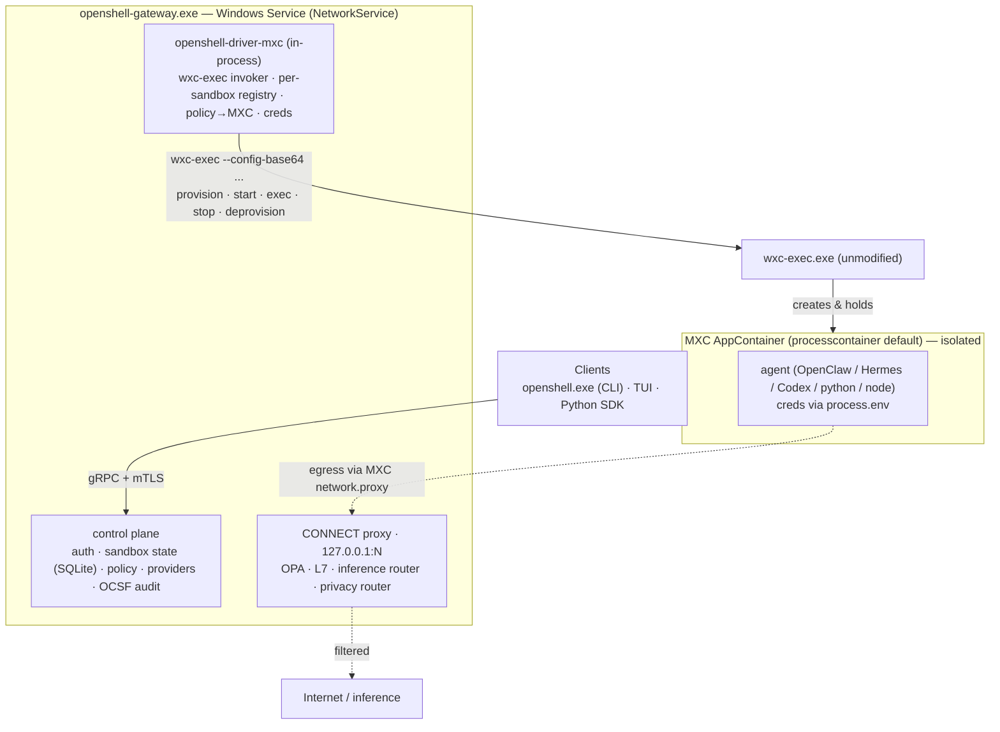
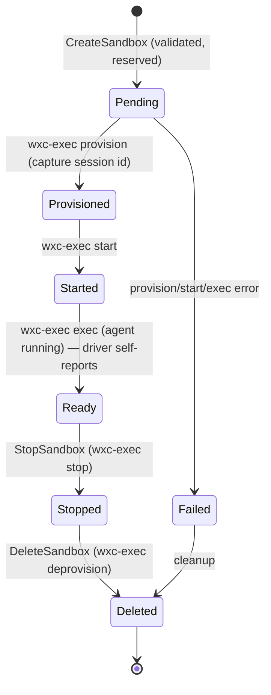

---
authors:
  - "@shailendra-nv"
state: review
links:
  - https://github.com/NVIDIA/OpenShell/issues/2050
---

# RFC 0013 - Native Windows Support via the MXC Compute Driver

<!--
See rfc/README.md for the full RFC process and state definitions.
-->

## Summary

This RFC proposes extending OpenShell to run natively on Windows 11 (x64 and
ARM64) without a Linux VM, Docker Desktop, or WSL. It will produce a new
compute driver, `openshell-driver-mxc`, that will use Microsoft
Execution Containers (MXC, via `wxc-exec.exe`) as the sandbox primitive.

The central architectural conclusion is that OpenShell does not need to port its
Linux in-sandbox supervisor to Windows. The value layers the supervisor delivers
on Linux — egress policy enforcement (OPA), L7 HTTP inspection — are relocated to
the host by running OpenShell's existing CONNECT proxy inside the driver process
and pointing MXC's built-in `network.proxy` redirect at it. The integration therefore collapses to
three moving parts: the OpenShell gateway (largely unchanged from Linux), a
Windows-only MXC compute driver crate, and an unmodified `wxc-exec` binary, with
no OpenShell binary running inside the sandbox.

## Motivation

OpenShell sandboxes autonomous AI agents. On Linux it does so through the
Docker, Podman, Kubernetes, and libkrun-VM compute drivers, each pairing a
compute backend with an in-sandbox `openshell-sandbox` supervisor that enforces
policy and runs the agent. None of those drivers give a first-class experience on
Windows: Docker Desktop pulls in a Linux VM and licensing constraints, WSL2 adds
install and networking complexity, and Hyper-V/Windows Sandbox are heavy and
require elevation. Today a Windows developer or enterprise host cannot run an
OpenShell sandbox without standing up a Linux runtime underneath it.

Windows is a primary environment for the agents OpenShell targets, particularly
for GeForce and enterprise Windows users. We want native, OS-level isolation
that runs unelevated, with the same policy, inference, and audit guarantees users
get on Linux. Windows 11-Preview Builds now supports MXC (`processcontainer`, backed by
AppContainer + a Low Integrity token) as an OS-native sandbox primitive that
already honors a `network.proxy` egress redirect. That makes a supervisor-free,
host-enforced design feasible without any changes to Microsoft's runtime.

This is worth an RFC rather than a single issue because it is a cross-cutting
architectural decision: it adds a new compute-driver model (in-process,
supervisor-free), a new platform target with its own build/CI lane, a new
policy-translation seam between OpenShell policy and MXC config, and a new
deployment shape (the gateway as a long-lived Windows Service). It also commits
OpenShell to a set of dependencies on the Microsoft MXC team. These decisions
deserve broad review and a durable record.

If we leave the current design unchanged, OpenShell remains Linux-only in
practice, Windows users are pushed toward heavyweight VM-based workarounds, and
the Windows work continues to live outside the public project.

## Non-goals

- Porting `openshell-sandbox` (the Linux supervisor) to Windows, or shipping any
  in-sandbox OpenShell binary. Defense-in-depth via an in-sandbox enforcer
  is explicitly deferred.
- Making Windows a Docker, Podman, Kubernetes, or VM runtime host. Those drivers
  remain compile-only configuration stubs that return an unsupported error.
- Named-pipe driver IPC, a cross-process MXC driver binary, or a tonic
  `ComputeDriverService` adapter for MXC. The driver is in-process.
- Full L7/port/binary-scoped policy enforcement inside MXC itself. MXC network
  filtering is host/IP/CIDR-level; rich policy stays on the host proxy.
- MSI/WinGet packaging and installer UX
- GPU passthrough into MXC sandboxes.
- Changing Linux or macOS build, runtime, or driver behavior. All Windows code is
  gated behind `cfg(target_os = "windows")`.

## Proposal

### Layered architecture

OpenShell on Windows is a four-layer stack with a single hard trust boundary at
the MXC sandbox. The gateway runs as a long-lived Windows Service; the MXC
compute driver and the host CONNECT proxy live inside that one process. The agent
runs inside an MXC AppContainer with all egress redirected back to the host
proxy.

The defining property is that the OpenShell value layers — egress policy, L7
inspection, inference routing, and the privacy router — live on the host inside
the gateway process, not inside the sandbox. A native Windows agent therefore
gets the Linux feature set without an in-sandbox supervisor.

### Part 1 - Native Windows build

This effort compiles the gateway and CLI for
`x86_64-pc-windows-msvc` and `aarch64-pc-windows-msvc` while keeping Linux and
macOS unchanged. The dominant change is a consistent cfg-gating pattern: each
crate whose implementation is Unix-specific moves its Unix body into a
`*_unix.rs` module and adds a small `windows.rs` (or stub), preserving public
library entry points and configuration structs on both platforms.

- Unsupported drivers (Docker, Podman, Kubernetes, VM) become compile-only
  configuration stubs. The gateway still parses existing config files for every
  driver name and returns a clear unsupported error at gateway construction
  (Docker/Kubernetes/Podman) or at spawn (VM), never a parse failure or silent
  no-op.
- `openshell-core/build.rs` selects a vendored `protoc` per platform
  (`protoc-bin-vendored` on Windows, `protobuf-src` elsewhere) so proto
  compilation succeeds under MSVC.
- Windows path defaults resolve SQLite/data under `%APPDATA%`/`%ProgramData%`.
- Validation runs through a dedicated `mise` lane (`tasks/windows.toml` →
  `tasks/scripts/windows-msvc.ps1`) invoked as `mise run --skip-tools windows:*`,
  separate from the default Linux `ci` task. The wrapper discovers Visual
  Studio's `VsDevCmd.bat`, adds rustup MSVC targets, and clears inherited
  `RUSTC_WRAPPER`.
- A `windows-msvc` GitHub Actions job runs x64 check/build/test plus the
  unsupported-driver contract tests on `windows-2025`; ARM64 is scaffolded and
  disabled until an ARM64 runner is available.

### Part 2 - The MXC compute driver

`openshell-driver-mxc` is a library crate entirely behind
`cfg(target_os = "windows")` (an empty shell elsewhere). It is linked
in-process into `openshell-server` and implements a plain Rust `ComputeBackend`
trait — there is no separate binary, no surrogate, and no tonic adapter.

| Module | Responsibility |
|---|---|
| `driver.rs` (`MxcComputeBackend`) | Orchestrator: owns the registry, validates specs, runs the lifecycle, drives `wxc-exec` phases, runs the agent, resolves provider credentials (Windows Credential Manager) and injects them, self-reports readiness, emits watch events. |
| registry | In-memory `Arc<Mutex<…>>` mapping OpenShell sandbox id/name ⇄ MXC session id + phase state + exec/PTY handles. Source of truth for Get/List/Watch (MXC has no list-sessions API). |
| `mxc.rs` | Builds MXC config JSON, base64-encodes it, runs `wxc-exec`, parses envelopes; encapsulates exec-vs-non-exec stdout semantics and error-code mapping. |
| `policy.rs` | Translates the `SandboxPolicy` proto → MXC config and rejects unenforceable rules. Delegates to the embedded policy mapper (see Part 3). |
| `proxy.rs` | Hosts the existing OpenShell CONNECT proxy on `127.0.0.1:N`, attributes inbound loopback connections to a sandbox, applies that sandbox's policy. Reuses the Linux proxy/OPA/L7/router code unchanged. |

#### The `wxc-exec` interface contract

The `mxc.rs` invoker is the boundary to MXC. Invocation is always
`wxc-exec.exe --config-base64 <base64(JSON)> --experimental [--debug]`;
`configurationId` defaults to `composable` (never `small` — a known OS bug). The
invoker must branch on phase for I/O semantics:

| Phase(s) | stdout | Exit code | Parse as |
|---|---|---|---|
| `provision` / `start` / `stop` / `deprovision` | single JSON envelope `{"result":…}` or `{"error":…}` | 0 success / 1 error | JSON envelope |
| `exec` | live process output (not JSON) | the script's exit code | raw bytes / stream |

`provision` returns the session id to capture. MXC `error.code` values
(`not_provisioned`, `already_started`, `policy_validation`,
`backend_unavailable`, …) map to typed errors. A non-zero `exec` exit is the
script's result, not a driver error.

#### State model and lifecycle

MXC has no remote inventory API, so the in-memory registry is the single source
of truth.

`Ready` is self-reported once the agent launches; it does not depend on any
supervisor connection. Every transition emits a `WatchSandboxes` event.
`CreateSandbox` translates policy → MXC config, resolves and injects credentials,
then runs `provision → start → exec`. Live `connect`/`exec` spawns a fresh
`wxc-exec phase=exec` in a ConPTY and bridges the gateway's bidi stream to its
stdin/stdout — no `ConnectSupervisor`, no in-sandbox SSH server, no relay socket.

#### Governed egress

Governed egress is the core value layer. When the agent opens a connection, MXC's
`network.proxy = { localhost: N }` redirect sends it to the host CONNECT proxy on
`127.0.0.1:N` (loopback inside an AppContainer is host loopback). The proxy
attributes the connection to a sandbox (source-port → sandbox mapping), loads
that sandbox's policy, evaluates L4 host:port allow/deny via OPA, intercepts
`inference.local` (terminate TLS with the sandbox CA, run the privacy router,
route via `openshell-router`), applies L7 method/path rules for other HTTPS, and
emits OCSF events. Because the default `processcontainer` backend already honors
`network.proxy`, governed egress works with no MXC changes.

### Part 3 - Policy translation between OpenShell and MXC

OpenShell policy is authored as YAML and parsed to the `SandboxPolicy` proto by
the shared cross-platform `openshell-policy` crate. The MXC driver does not
re-parse YAML; a dedicated Rust policy mapper (embedded in the driver and called
automatically) maps the proto IR to MXC `ContainerConfig` and **rejects rather
than silently drops** anything MXC cannot enforce. MXC imposes a provision-time
vs exec-time split.

| OpenShell policy | Where enforced | MXC mapping | When |
|---|---|---|---|
| filesystem read/write paths | MXC | `filesystem.readwritePaths` | provision |
| filesystem read-only paths | MXC | `filesystem.readonlyPaths` | provision |
| filesystem denied paths | MXC | limited / unsupported | provision |
| process (uid/gid/seccomp) | — (no analog) | reject (default) | — |
| network (OPA / L7 / inference / privacy) | host CONNECT proxy | `network.proxy = { localhost: N }` redirect | provision |

The driving constraint is that MXC network filtering is host/IP/CIDR-level only:
it cannot encode ports, protocols, per-binary scope, or L7 rules. The mapper
therefore emits the coarsest safe approximation and a structured loss report.
Critically, MXC defaults to `defaultPolicy: "allow"` when the network block is
omitted, so the mapper must always emit `network.defaultPolicy: "block"`.

Across the five OpenShell example policies, every generated MXC config is
schema-valid but lossy: an aggregate of 64 access-broadening errors, 32
warnings, and 4 info items. The dominant gaps are binary-scoped network policy,
port-scoped outbound policy, protocol-aware (REST/WebSocket/GraphQL) policy, and
access presets. The mapper's fail-safe posture is: always emit
`defaultPolicy: "block"`, never silently broaden access, and treat binary scoping
and L7 rules as strict-mode failures. The unenforceable remainder is what the
host CONNECT proxy enforces; the MXC-only path is a coarse kernel-level
allowlist beneath it.

To consume OpenShell policy more faithfully over time, MXC would need
kernel-enforceable additions such as port-scoped network endpoints, a filesystem
`defaultPolicy`, per-process/binary network scoping, and DNS/wildcard handling. A
proposed two-surface direction for Microsoft keeps `ContainerConfig` as the
execution manifest (add portable kernel-enforceable fields such as ports and
filesystem `defaultPolicy`) and adds a separate `policyProxy` surface for L7 and
dynamic policy so HTTP/WebSocket/GraphQL parsing, credential rewrite, audit, and
hot-reload stay out of every backend runner. None of these are required for the
host-enforced design proposed here; they are enhancements that would deepen
kernel-level defense-in-depth.

### Design decisions (D1–D4)

- **D1 — MXC as the Windows sandbox primitive**, over Docker Desktop, WSL2, and
  Windows Sandbox/Hyper-V. MXC is OS-native, needs no VM, and runs unelevated.
  Default backend `processcontainer`; `isolation_session` opt-in. Requires
  Windows 11 build ≥ 26100 and `wxc-exec.exe` present.
- **D2 — Do not port the supervisor** (host proxy + MXC
  `network.proxy` redirect - supported by MXC), (host-side surrogate behavior in the
  driver) for credentials and exec, and no in-sandbox OpenShell binary.
  Consequence: governed egress on the opt-in `isolation_session` backend depends
  on Microsoft extending `network.proxy` to that backend; until then the design
  defaults to `processcontainer`, where it works today.
- **D3 — Gateway as a long-lived Windows Service** under
  `NT AUTHORITY\NetworkService`. Clients connect over gRPC (loopback or remote
  mTLS). SQLite at `%ProgramData%\OpenShell\openshell.db`, Windows Event Log
  integration, mTLS bootstrap on first run.
- **D4 — Reduce the gRPC footprint to the client-facing API only.** Supervisor
  removal deletes the supervisor and sandbox-relay boundaries; in-process MXC
  removes the wire protocol on the gateway↔driver boundary. Only client↔gateway
  gRPC survives on Windows.

## Implementation plan

All Windows code is gated behind `cfg(target_os = "windows")`, so Linux and macOS
are never affected and the changes can land additively.

- **Compile.** Land the MSVC cfg-gating, per-platform `protoc` selection,
  Windows path defaults, the `mise` Windows lane, and the `windows-msvc` CI job.
  Unsupported drivers become contract stubs with tests asserting they return
  unsupported.
- **MXC driver and host proxy.** Add `openshell-driver-mxc` driving the default
  `processcontainer` backend: lifecycle, policy translation, governed egress +
  inference + privacy on the host CONNECT proxy, credential injection, and
  interactive exec via the driver's ConPTY bridge. Unenforceable policy is
  rejected in `ValidateSandboxCreate` with `invalid_argument` naming the rule.
- **Gateway as a Windows Service.** Package `openshell-gateway.exe` as a Windows
  Service with SQLite under `%ProgramData%`, Windows Event Log integration, and
  mTLS bootstrap on first run.
- **Hardening.** Confirm reliable per-sandbox loopback attribution and
  `processcontainer` concurrency, and persist the sandbox-id ⇄ session-id mapping
  so a gateway restart can reconcile or clean up orphaned sessions.
- **Opt-in `isolation_session` egress.** Becomes available if and when Microsoft
  extends `network.proxy` to that backend; the same host proxy then governs its
  egress.

Validation follows a layered pyramid: pure-Rust unit tests for the JSON
builders/parsers and policy mapper (on the Windows MSVC test lane), a mock
`wxc-exec` shim (`OPENSHELL_MXC_MOCK_WXC=1`) for lifecycle logic, egress-proxy
component tests for redirect → attribution → OPA decision, gated integration
tests against a real `wxc-exec` (`#[ignore]` unless present), and manual E2E on a
real Windows 11 host. User-facing configuration is documented in the gateway
config reference and the architecture docs.

## Risks

| Risk | Mitigation |
|---|---|
| MXC `allowedHosts`/`blockedHosts` not enforced on Windows yet, so there is no kernel-level defense-in-depth beneath the host proxy. | Rely on the host proxy for host-level allow/deny |
| The host proxy must reliably attribute an inbound loopback connection to its originating sandbox; AppContainer source-port attribution is not guaranteed across MXC versions. | Use a per-sandbox source-port window or per-sandbox `127.0.0.x` address, and validate attribution as a hardening step. |
| `--config-base64` carries credentials in argv (briefly visible in process listings). | Zero-fill after invocation; prefer passing config on stdin. |
| Concurrency: `isolation_session` is single-session; `processcontainer` limits are unverified. | Validate `processcontainer` concurrency and document any cap. |
| OCSF fidelity: with no in-sandbox supervisor, arbitrary in-process events are not visible (only network + lifecycle). | Accept reduced fidelity; an ETW/callback hook from the Microsoft MXC team will help restore in-process visibility later. |
| Restart durability: the registry is in-memory; a gateway restart orphans live sessions. | Persist the sandbox-id ⇄ session-id mapping in SQLite and reconcile or deprovision orphans on startup. |
| Policy fidelity: MXC cannot enforce port/binary/L7 policy, so the MXC-only tier is a coarse approximation. | Fail-safe mapper (always `block`, never silently broaden) + host proxy as the real enforcer + a published loss report. |
| Microsoft dependency: several deepening improvements are outside OpenShell's control. | Ship the host-enforced design with no MXC changes required; treat MXC enhancements as optional, not blockers. |

## Alternatives Considered

- **Run OpenShell on Windows via Docker Desktop, WSL2, or Hyper-V/Windows
  Sandbox.** Reuses the existing Linux drivers unchanged, but reintroduces a
  Linux VM, heavier install/network complexity, licensing constraints, and (for
  Hyper-V/Windows Sandbox) elevation. It defeats the goal of OS-native,
  unelevated Windows isolation.
- **Port `openshell-sandbox` to Windows (in-sandbox supervisor).** Maximizes
  Linux parity and defense-in-depth, but requires Windows analogs of
  Landlock/seccomp/netns, a Windows relay protocol, and an in-sandbox binary —
  far more surface for the same user-visible feature set, which the host-proxy
  design already delivers. Kept as future hardening, not the chosen
  path.
- **Cross-compile the Windows binaries from Linux only.** Cheaper CI, but cannot
  validate runtime correctness on real Windows hardware, which is essential for
  MXC integration.
- **A cross-process MXC driver binary (like the VM driver) with a tonic
  adapter.** Matches the existing VM driver shape, but adds a wire protocol and a
  second process for no benefit when the driver can be linked in-process and the
  supervisor is gone.
- **Do nothing.** OpenShell stays Linux-only in practice and Windows users rely
  on VM-based workarounds.

## Prior art

- **OpenShell's existing compute drivers** (Docker, Podman, Kubernetes, VM)
  establish the `ComputeDriver`/`ComputeBackend` contract and the
  driver-selection model this RFC extends with an in-process, supervisor-free
  variant.
- **RFC 0001 (core architecture)** and `architecture/sandbox.md` define the
  supervisor/relay model that the Windows design deliberately removes.
- **Microsoft MXC (`wxc-exec`)** provides the Windows AppContainer-based
  sandbox primitive and the `network.proxy` redirect that makes host-side
  enforcement possible without an in-sandbox agent.
- **Open Policy Agent and OpenShell's CONNECT proxy / L7 / inference / privacy
  stack** are reused unchanged on the host, demonstrating that the value layers
  are already cross-platform Rust.
