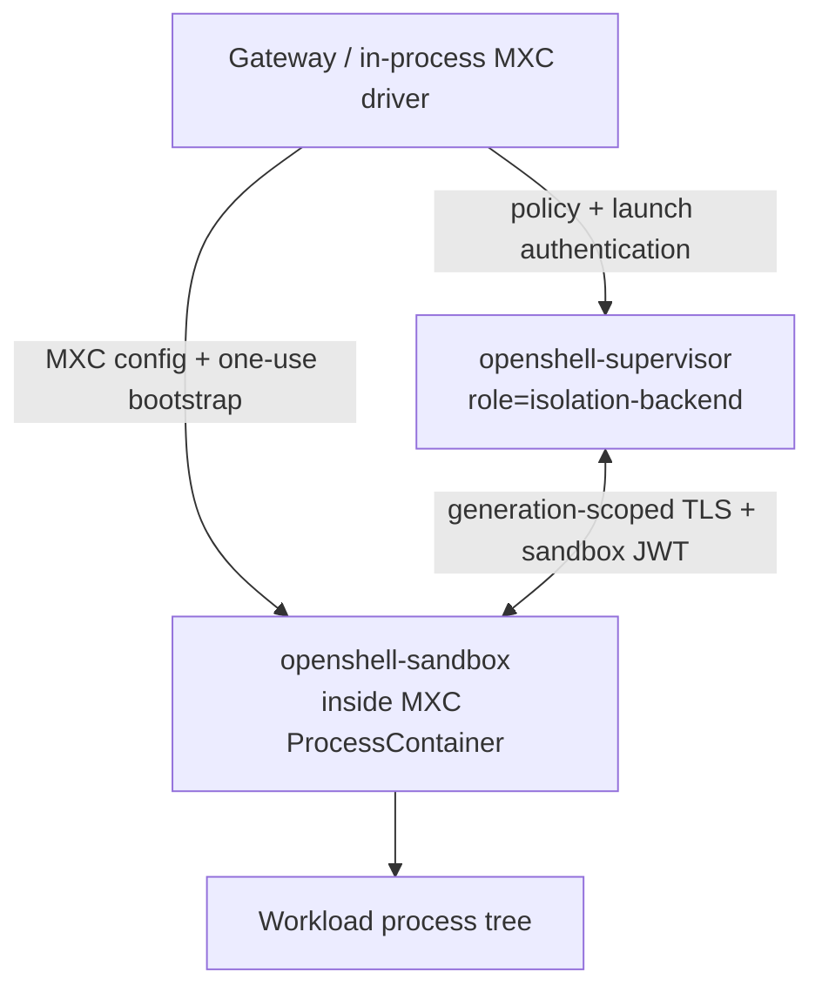

---
authors:
  - "@shailendra-nv"
state: review
links:
  - https://github.com/NVIDIA/OpenShell/issues/2050
  - https://github.com/NVIDIA/OpenShell/pull/2071
  - https://github.com/NVIDIA/OpenShell/pull/3370
---

# RFC 0013 - Native Windows Support via the MXC Compute Driver

## Summary

OpenShell runs natively on Windows 11 by using Microsoft Execution Containers
(MXC, through `wxc-exec.exe`) as an RFC 0012 isolation backend. The gateway's
in-process MXC compute driver provisions a host
`openshell-supervisor --role=isolation-backend` and an `openshell-sandbox`
boundary inside each ProcessContainer.

The authenticated Sandbox Protocol is the only runtime control and forwarding
transport. MXC supplies the Windows outer fence; the existing supervisor owns
policy evaluation, credentials, network proxying, and the gateway session.

## Motivation

Docker Desktop and WSL2 add a Linux VM to Windows workflows. MXC provides a
native AppContainer and ProcessContainer boundary, but the earlier
supervisor-free prototype duplicated lifecycle, credential, forwarding, and
proxy behavior in the driver and a workload relay. That duplicated security
protocols and diverged from sandbox authentication introduced in the common
runtime.

Reusing RFC 0012 keeps Windows backend-specific code at the isolation edge and
preserves one supervisor session model across Docker, Podman, Kubernetes, VM,
and MXC. It also lets forwarding and provider credential refresh use existing
authenticated paths instead of MXC-only side channels.

## Non-goals

- Supporting Docker, Kubernetes, Podman, VM, WSL, or Hyper-V compute drivers on
  Windows.
- Supporting MXC `isolation_session`; the initial runtime requires
  `process_container`.
- Starting Windows sandboxes from OCI images.
- MSI, WinGet, Windows service, or background gateway installation.
- GPU passthrough.
- Full terminal resize before a Windows ConPTY implementation is available.
- Durable recovery of live MXC generations after gateway restart.

## Proposal

### Runtime composition

```mermaid
flowchart TD
    Gateway[Gateway / in-process MXC driver]
    Supervisor[openshell-supervisor<br/>role=isolation-backend]
    Sandbox[openshell-sandbox<br/>inside MXC ProcessContainer]
    Workload[Workload process tree]

    Gateway -->|policy + launch authentication| Supervisor
    Gateway -->|MXC config + one-use bootstrap| Sandbox
    Supervisor <-->|generation-scoped TLS + sandbox JWT| Sandbox
    Sandbox --> Workload
```

The driver owns provisioning and pairwise lifecycle monitoring. If either the
host supervisor or ProcessContainer exits unexpectedly, the driver terminates
the other. Stop and delete wait for pair termination before publishing success.
The gateway treats the standard supervisor session, not a driver-specific port
probe, as runtime readiness.

### Outer fence and confirmation

MXC receives the mapped filesystem, UI, and network constraints before
`openshell-sandbox` starts. The boundary consumes and deletes its one-use
configuration and TLS private key before releasing workload code. It confirms
the ProcessContainer generation, resource claims, filesystem fence, egress
fence, authenticated control transport, and controller-loss behavior through
the backend-neutral isolation contract.

The boundary terminates owned workload processes if no authenticated supervisor
recovers within the bounded reconnect deadline. Host auth bundles and runtime
descriptors are stored beneath an owner-only Windows DACL.

### Networking and credentials

MXC denies direct Internet egress and permits the loopback route used by the
Sandbox Protocol and explicit proxy. The host supervisor owns a distinct proxy
listener and random authorization value for every sandbox generation.
`openshell-sandbox` injects the proxy URL and public CA paths only into workload
children. The supervisor retains private CA keys and provider secrets, applies
network policy, and refreshes provider state through the ordinary session.

The listener rejects missing, duplicate, malformed, and cross-generation proxy
authorization before policy evaluation. The initial implementation assigns
requests to the admitted main workload binary because Windows socket-owner
identity is not yet carried by the explicit-proxy transport. Policies that rely
on different network rights for descendant executables are therefore outside
the initial enforcement contract. The loopback exception also does not isolate
unrelated services bound to `127.0.0.1`; the gateway host remains trusted.

### Process lifecycle and forwarding

The Windows boundary implements authenticated start, exec, attach, wait,
signal, terminate, retained stdout/stderr, provider environment refresh, and
loopback connect operations. Standard gateway dynamic forwarding reaches the
target through `BoundaryLoopbackConnector`; there is no reverse WebSocket,
stdin/stdout JSON protocol, or MXC-specific relay binary.

ProcessContainer teardown remains the outer kill boundary. ConPTY terminal
resize is deferred; non-terminal exec and byte-stream I/O are supported first.

### Configuration and packaging

The Windows release contains `openshell-gateway.exe`, `openshell.exe`,
`openshell-supervisor.exe`, and `openshell-sandbox.exe`. The runtime binaries
default to siblings of the gateway and may be overridden for development.
Gateway TLS uses the gateway-owned guest certificate bundle.

The MXC driver configuration contains only host/runtime settings. Workload
command, working directory, environment, and policy stay sandbox-scoped.
Relay paths, relay target ports, and driver-owned proxy enable/seed settings are
removed.

## Implementation plan

1. Make the sandbox, supervisor, and supervisor-process crates compile on
   Windows without enabling Linux-only controls.
2. Add the Windows Sandbox Protocol boundary and MXC confirmation evidence.
3. Provision the host supervisor and in-ProcessContainer sandbox as one
   generation from the MXC driver.
4. Reuse the supervisor network and process sessions for forwarding,
   credentials, exec, output, and controller-loss handling.
5. Remove the relay crate and MXC-only forwarding/credential side channels.
6. Build all four Windows binaries on x64 and ARM64, then validate on a native
   MXC host.

## Risks

- MXC and AppContainer networking can differ across Windows preview builds.
  Native-host qualification remains required in addition to cross-compilation.
- The explicit proxy cannot yet distinguish descendant executable identities.
  This limitation is documented and must fail review for policies that require
  per-child network separation until socket-owner attribution is added.
- Loopback transport exposes unrelated host listeners to the AppContainer if
  those listeners lack their own authentication. OpenShell listeners always
  require generation-scoped credentials, but operators must treat the host as
  trusted.
- Gateway restart recovery is not durable. Orphan discovery and persisted
  generation reconciliation are follow-up work.
- Windows process-tree and terminal semantics differ from Unix. The
  ProcessContainer remains the final teardown boundary while ConPTY support is
  incomplete.

## Alternatives

### Driver-owned relay and proxy

The prototype launched a relay inside MXC and implemented forwarding,
credentials, readiness, and proxy lifecycle in the driver. It reduced the
initial Windows porting work but created a second security protocol and repeated
existing supervisor patterns. This proposal removes it.

### Supervisor-only host proxy without `openshell-sandbox`

Running only the host supervisor cannot provide authenticated in-boundary
process lifecycle, retained I/O, controller-loss handling, or loopback target
connection. It also leaves the driver responsible for these behaviors.

### Windows VM or WSL2

The existing Linux runtime can run inside a VM, but that does not deliver the
native, low-overhead Windows isolation workflow this RFC targets.

### Do nothing

Keeping the supervisor-free prototype would preserve protocol duplication and
make sandbox authentication, forwarding, credential rotation, and policy fixes
diverge by platform.

## Prior art

- RFC 0012 defines the backend-neutral isolation contract and authenticated
  supervisor/boundary pairing used here.
- The VM backend already runs the supervisor on the host while a capability-free
  boundary runs inside a stronger isolation primitive.
- Docker, Podman, and Kubernetes use the same supervisor session for network
  policy, credentials, lifecycle, and forwarding.
- Windows AppContainer and ProcessContainer provide the native outer fence but
  not OpenShell's application-layer policy semantics.

## Open questions

- Which Windows API should provide race-resistant socket-owner executable
  identity for per-descendant binary network policy?
- Should MXC restart recovery persist enough generation metadata to reconnect,
  or should startup always terminate and recreate orphaned ProcessContainers?
- What ConPTY surface is required before Windows interactive exec is considered
  complete?
