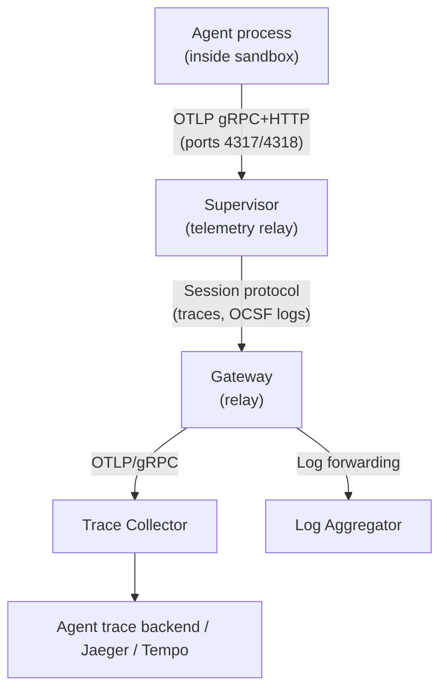

---
authors:
  - "@rhuss"
state: draft
links:
  - https://github.com/NVIDIA/OpenShell/issues/1055
  - https://github.com/NVIDIA/OpenShell/issues/2508
  - https://github.com/NVIDIA/OpenShell/issues/1922
---

# RFC 0014 - Agent-level observability (OTLP relay)

## Summary

This RFC proposes a supervisor-local telemetry relay that collects agent-emitted traces from inside network-isolated sandboxes, enriches them with sandbox context, and forwards them through the gateway to an external collector. The relay also extends the existing log push mechanism to carry OCSF security events for centralized collection.

The supervisor acts as a telemetry sidecar for the isolated sandbox. For traces, it listens on standard OpenTelemetry Protocol (OTLP) ports, accepts spans from any OpenTelemetry (OTel)-instrumented agent framework, and forwards them to the gateway. The agent developer exports to a fixed, auto-injected `OTEL_EXPORTER_OTLP_ENDPOINT` and never needs to know about collector topology, authentication, transport encryption, or routing. The platform handles the rest.

Infrastructure-level observability (driver instrumentation, Helm config, OCSF-to-OTel correlation, metrics catalog) is covered in companion RFC 0013.

## Persona workflows

Each section of this RFC is motivated by a concrete workflow that a persona needs to perform today but cannot.

### Agent developer: seeing tool calls and LLM invocations without platform-specific code

A developer runs a LangChain agent inside an OpenShell sandbox. The agent makes tool calls to external APIs and LLM invocations to OpenAI. The developer wants to see these in their LLM observability tool (MLflow, Langfuse, or similar) to debug a reasoning failure. Today, the sandbox is network-isolated, so the agent's OTel SDK cannot reach the external collector. The developer either gives up on tracing or hacks an egress allowlist exception for the collector endpoint, which the security team will not approve.

**What this RFC enables:** The supervisor automatically sets `OTEL_EXPORTER_OTLP_ENDPOINT` in the agent's environment. The agent's OTel SDK exports to a local address. The supervisor enriches the spans with sandbox context (sandbox ID, policy, user, workspace) and forwards them to the gateway, which relays them to the configured agent trace backend. The developer sees their traces in MLflow/Langfuse with full infrastructure context, without writing any OpenShell-specific code or requesting egress exceptions. This also works for short-lived agents (CI tasks, one-shot scripts) that exit before their OTel SDK's batch exporter would normally flush, because the supervisor outlives the agent process and drains any buffered spans before the sandbox tears down.

### Platform operator: investigating repeated API rate limiting from a sandbox

An operator notices elevated 429 (rate limit) responses on outbound connections from sandbox `sb-xyz` in the supervisor's network spans. The supervisor traces show repeated CONNECT attempts to `api.openai.com` with 429 responses, but the operator cannot tell what the agent is doing that triggers this volume. The supervisor's infrastructure traces show the network activity but not the agent's reasoning.

**What this RFC enables:** The operator filters spans in Tempo by `openshell.sandbox.id = sb-xyz` and finds the agent's traces alongside the supervisor's network spans. The agent trace reveals a `call_llm` tool invocation in a retry loop with no backoff. The operator reports the finding to the agent developer, who fixes the retry logic. The key is that both the agent's tool call spans and the supervisor's network spans carry the same `openshell.sandbox.id` attribute, so the operator can correlate them without needing to know anything about the agent's internals.

### Workspace administrator: routing traces per tenant

A workspace administrator manages a multi-tenant deployment. Team A's agent traces should go to their MLflow instance, Team B's agent traces should go to Langfuse. Today, all traces go to the same OTLP endpoint and the administrator has no way to separate them.

**What this RFC enables:** The `openshell.workspace.id` resource attribute is attached to every span during enrichment. The administrator configures collector-side routing rules based on this attribute, or (as a future extension) configures per-workspace OTLP endpoints at the gateway. Each team sees only their own traces in their own backend.

### Security/compliance reviewer: centralized Open Cybersecurity Schema Framework (OCSF) event collection

A security reviewer needs to audit all network deny events across sandboxes for a compliance report. OCSF JSONL events are generated inside each sandbox but stay local. The reviewer has to SSH into each sandbox to collect them, which does not scale.

**What this RFC enables:** The log relay extends the existing `PushSandboxLogs` mechanism to carry OCSF events from sandboxes to the gateway. The reviewer queries their centralized log aggregator and sees all deny events across all sandboxes, enriched with sandbox and workspace context.

## The relay

### Design

The sandbox supervisor (hereafter "supervisor") acts as a telemetry sidecar for the isolated sandbox, mediating traces, logs, and metrics between the sandbox and the platform. The session protocol between supervisor and gateway provides the transport.

For traces, the supervisor listens on standard OTLP ports inside the sandbox, accepting both gRPC (port 4317) and HTTP (port 4318). Agent frameworks export traces to this address. The supervisor buffers, optionally enriches, and forwards spans to the gateway over the existing session protocol. The gateway relays them to the configured external OTLP endpoint.

The supervisor:

1. Accepts OTLP spans from the agent process (both gRPC and HTTP protocols, matching standard OTel Collector receiver behavior)
2. Buffers in memory (bounded, with explicit drop semantics matching [#2508](https://github.com/NVIDIA/OpenShell/issues/2508)'s transport design)
3. Optionally enriches spans with sandbox resource attributes (see span enrichment below)
4. Forwards to the gateway over the existing session protocol
5. Flushes buffered spans before shutdown, surviving agent process termination

Point 5 matters for short-lived agents. A CI agent that runs for 10 seconds and exits may not flush its OTel SDK's batch exporter before the process terminates. With direct export, those spans are lost. The supervisor outlives the agent process and flushes any buffered spans to the gateway before the sandbox tears down, so short-running agent traces are captured even when the agent exits abruptly.

The gateway:

1. Receives spans from supervisors via the session protocol
2. Relays to the configured external OTLP endpoint alongside its own spans
3. Applies head or tail sampling when configured (see Risks section for the tradeoffs)

For agents, the experience is: `OTEL_EXPORTER_OTLP_ENDPOINT` is set automatically in the sandbox environment, pointing at the supervisor's OTLP receiver. Any OTel-instrumented framework works without OpenShell-specific code.

### Separation of concerns

The relay creates a clean separation between three roles:

- **Agent developer**: Exports to a fixed, auto-injected endpoint. Never thinks about collector topology, authentication, transport encryption, or routing. The same agent code works in every sandbox, every deployment, every workspace.
- **Workspace administrator**: Decides where their workspace's telemetry goes (which collector, which agent trace backend, what sampling rates) without touching agent configuration.
- **Global administrator**: Configures the default OTLP endpoint and platform-wide policies like rate limits and enrichment.

With direct collector access, the agent developer would need to know the collector address, and that address varies by deployment and workspace. The relay makes observability routing an operational concern rather than a development one.

### OTLP receiver reachability per driver

All container-based drivers share a networking subtlety that affects how the OTLP receiver is reached. The supervisor creates an internal workload network namespace for the agent process, connected to the supervisor's namespace via a veth pair. The proxy already binds to the host-side veth IP (available from `netns.host_ip()`) to intercept agent traffic. This means `localhost` inside the agent's network namespace is not the same `localhost` the supervisor sees.

The OTLP receiver follows the same pattern as the proxy: bind to the veth host IP that is routable from inside the workload netns.

| Driver | Supervisor-agent network relationship | OTLP receiver binding |
|---|---|---|
| Docker | Same container, agent enters separate workload netns via `setns()` | Bind to `netns.host_ip():4318` (same IP the proxy uses) |
| Podman | Identical to Docker | Same as Docker |
| K8s (embedded) | Supervisor side-loaded into agent container | Same as Docker |
| K8s (sidecar) | Sidecar + agent share the pod network namespace, nftables for interception | Bind to `localhost:4318` directly (shared namespace, no veth) |
| VM | Supervisor is PID 1 inside a libkrun microVM | Same as Docker (within the VM) |

The OTLP receiver reuses the same networking plumbing the proxy already uses. The infrastructure for making a supervisor-hosted service reachable from the agent process already exists, and the OTLP receiver is just another listener on that address.

This pattern follows [Dapr](https://github.com/dapr/dapr)'s [sidecar](https://docs.dapr.io/concepts/dapr-services/sidecar/) approach, where a co-located proxy intercepts application communication and generates distributed traces through an [OTLP collector](https://docs.dapr.io/operations/observability/tracing/otel-collector/open-telemetry-collector/) without requiring application-level instrumentation.

## Span enrichment

When forwarding agent-emitted spans, the supervisor attaches sandbox context as resource attributes:

| Attribute | Source | Example |
|---|---|---|
| `openshell.sandbox.id` | Sandbox metadata | `sb-abc123` |
| `openshell.sandbox.policy` | Active policy name | `default-policy` |
| `openshell.sandbox.user` | Authenticated user | `user@example.com` |
| `openshell.sandbox.image` | Container image | `ubuntu:22.04` |
| `openshell.sandbox.driver` | Compute driver type | `kubernetes` |
| `openshell.workspace.id` | Workspace/tenant identifier | `ws-prod-team-a` |

Enrichment is configurable and can be disabled for pass-through forwarding. Without enrichment, an operator sees "LangChain called tool X" but cannot tell which sandbox, user, or policy was active. With enrichment, the trace carries full context without the agent needing any OpenShell-specific instrumentation.

The primary correlation mechanism between agent traces and infrastructure traces is `openshell.sandbox.id`. Because both the agent's spans and the supervisor's network spans carry this attribute, an operator can query "show me all spans for sandbox sb-xyz" and see both domains together. This is what makes the platform operator workflow above work: the operator filters by sandbox ID and finds agent tool calls alongside supervisor network activity.

In addition to resource attributes, the supervisor can optionally add [span links](https://opentelemetry.io/docs/concepts/signals/traces/#span-links) from agent root spans to the gateway's `sandbox.create` span for one-click navigation in backends that support it (Jaeger, Tempo). Span links are a convenience layer, not the primary correlation mechanism. Backends that do not render span links lose nothing because attribute-based filtering works equally well. A gateway-owned parent span (passing `TRACEPARENT` to make agent spans children of a long-lived sandbox span) was considered and rejected because sandbox lifetimes are unpredictable (seconds to days) and long-lived parent spans delay export, strain backends, and hold gateway memory.

## Trace context propagation on agent egress

When an agent inside the sandbox makes an outbound HTTP request (e.g., to `api.openai.com`), the supervisor's egress proxy intercepts it. The proxy can propagate W3C `traceparent` context on the outbound request, connecting the agent's tool call span to the supervisor's network span for the same connection.

The recommended behavior is inject-if-missing: if the agent's request already carries a `traceparent` header (because the agent's OTel SDK instrumented the HTTP client), the supervisor passes it through unchanged. If the request has no `traceparent`, the supervisor injects one from its own network span context. This way, OTel-instrumented agents keep their trace continuity, and non-instrumented agents get trace context for free.

This fits the relay's philosophy: the platform handles what the agent does not configure. An agent using LangChain with OTel already propagates trace context; the supervisor respects it. A simple Python script with no OTel gets trace context injected automatically, making its API calls visible in the supervisor's trace without any agent-side code.

## Log relay for centralized OCSF collection

OCSF events inside the sandbox are generated exclusively by the OpenShell supervisor, not by agent frameworks. No agent harness (LangChain, CrewAI, AutoGen, Claude Code) produces OCSF events, and OCSF has no GenAI or agent-specific event classes. OCSF is a cybersecurity schema covering network activity, authentication, and process lifecycle. The log relay centralizes the supervisor's security events, not the agent's output. That said, these events describe the agent's workload behavior (which endpoints it connects to, which connections were denied, which processes it spawned), so they are part of agent-level observability even though the supervisor generates them.

A log push mechanism already exists. The supervisor streams tracing events to the gateway via the `PushSandboxLogs` client-streaming RPC. Each log line carries the sandbox ID, timestamp, level, target, message, and structured key-value fields. The push is best-effort.

This existing mechanism covers supervisor-level tracing events but does not push OCSF JSONL events. OCSF events go through a separate JSONL layer and stay local to the sandbox. These are the supervisor's security-relevant structured events (network decisions, L7 enforcement, SSH authentication) that operators and compliance reviewers need centralized access to (the security reviewer workflow above).

Extending the log push to include OCSF events means either adding OCSF records to the existing `SandboxLogLine` format (with a source field to distinguish them) or adding a dedicated OCSF push alongside the existing log push. Log enrichment follows the same pattern as span enrichment: the supervisor attaches sandbox resource attributes to log records before forwarding.

Agent stdout/stderr is explicitly out of scope. Agent sandboxes are interactive sessions with terminal UIs, ANSI escape codes, and multiplexed SSH channels. That output stream is user-facing interaction, not structured log data.

OCSF is evolving toward AI agent support. OCSF v1.8 introduced an `ai_operation` profile with model and token usage attributes, and v1.9 adds a native `ai_agent` object with delegation, charter, and prompt/response fields. The OWASP [Agent Observability Standard (AOS)](https://owasp.org/www-project-agent-observability-standard/) maps agent activities (tool calls, reasoning steps) to OCSF event classes. OpenShell currently targets OCSF v1.7.0. If these standards mature and agent frameworks adopt OCSF emission, the log relay architecture would carry those events unchanged since it is transport-agnostic.

## Visibility domains

Two distinct visibility domains flow through the relay pipeline:

1. **Infrastructure traces** (operator-only): supervisor network/process/middleware spans from inside the sandbox. Locked as operator-only per [#2508](https://github.com/NVIDIA/OpenShell/issues/2508).
2. **Agent traces** (agent developer): tool calls, LLM invocations, reasoning steps from agent frameworks inside sandboxes.

The supervisor's infrastructure traces originate inside the sandbox and depend on the same relay transport to reach the gateway. Once the relay exists for agent traces, supervisor traces use it too. It would be artificial to separate them when they share the same transport path, enrichment pipeline, and scale considerations. Gateway and driver traces (which run outside the sandbox) remain in the infrastructure-level RFC 0013.

These two domains serve different user groups with different backend needs. Infrastructure traces go to the platform operator's monitoring stack (Tempo, Jaeger). Agent traces go to the agent developer's LLM observability tools (e.g., MLflow, Langfuse).

Initially, both domains go to the same configured OTLP endpoint, and the platform integrator separates them at the collector level using resource attributes. As a future extension, the gateway could support per-domain OTLP endpoints (`infra_endpoint` and `agent_endpoint`) so it can route directly without collector-side rules.

## Multi-tenant observability

Multi-tenant deployments need per-workspace observability isolation. Different workspaces may route agent traces to different backends, and one tenant's trace data must not leak to another's endpoint.

The `openshell.workspace.id` resource attribute (added during span enrichment) enables collector-side routing for deployments that use a shared collector with attribute-based routing. Per-workspace sampling and rate limits follow the same pattern as per-sandbox limits, but scoped to the workspace level.

Per-workspace OTLP endpoint routing requires a workspace-level configuration surface that does not exist today. The `Workspace` resource is immutable after creation with no configuration fields (PR [#2243](https://github.com/NVIDIA/OpenShell/pull/2243)), and the settings cascade has only two tiers (global > sandbox) with no workspace tier.

A workspace settings tier (making the cascade global > workspace > sandbox) would be the natural fit. However, this is a cross-cutting infrastructure feature that affects settings resolution, CLI/TUI, authorization (who can set workspace settings?), database schema, and potentially the K8s namespace mapping work in [#2485](https://github.com/NVIDIA/OpenShell/issues/2485)/[#2486](https://github.com/NVIDIA/OpenShell/issues/2486). It would serve needs well beyond OTLP endpoints (default sandbox policies, resource quotas, log retention). Designing it inside an observability RFC would undersell its scope.

This RFC assumes a workspace configuration surface will exist and describes what OTLP-related settings it would consume (`otlp_endpoint`, `otlp_agent_endpoint`, sampling rates). The design of the workspace settings tier itself should be covered by a dedicated specification.

Precedence: sandbox OTLP setting > workspace OTLP setting > global `[openshell.gateway.otlp]` endpoint. If no per-workspace or per-sandbox override is set, the global default applies.

## Risks

### Supervisor complexity and the hot path

The OTLP relay adds an OTLP receiver, buffering, enrichment, and forwarding to the supervisor, which is already a complex component sitting on every outbound agent connection. Span construction on the egress path has a cost, and that cost needs measuring rather than assuming it is negligible.

A dropped span is worse than a dropped log because it corrupts the parent-child structure of a trace. The relay needs explicit, documented drop behavior when the gateway is unreachable or the buffer fills up.

### Span attribute cardinality

The supervisor traces agent network activity, and the agent controls values like destination hostname and URL path. A misbehaving agent could connect to thousands of unique hostnames, each becoming a distinct attribute value in the backend's index. The mitigation is to normalize high-cardinality attributes before they reach the backend: record known values as-is, replace arbitrary hostnames with hashed or bucketed values, or move them to span events (not indexed) instead of span attributes (indexed).

### Relay scale and gateway bottleneck

The session protocol was designed for control plane traffic. Using it for telemetry changes the traffic profile:

| Pillar | Per-sandbox rate | Per-record size | Per-sandbox bandwidth |
|---|---|---|---|
| Traces | 10-100 spans/sec | 200-500 bytes | 2-50 KB/sec |
| OCSF logs | 10-300 events/sec | 1-5 KB | 10 KB - 1.5 MB/sec |
| Supervisor tracing events | Varies | 100-500 bytes | 1-10 KB/sec |

At 100 concurrent sandboxes, the aggregate could reach 1-10 MB/second sustained. OCSF logs may be the dominant stream. The gateway accumulates buffered data if the external collector is slow.

Log sampling has different constraints than trace sampling. OCSF events serve compliance/audit, so dropping them silently is not acceptable. Rate limiting (cap events/second) is preferred over probabilistic sampling.

Mitigations:

- Separate transport channel for telemetry (no backpressure on control plane)
- Head sampling at the supervisor (configurable per-sandbox or globally)
- Per-sandbox rate limits with counter metrics for drops
- Async batch forwarding at the gateway
- Backpressure signaling from gateway to supervisor
- Bypass option: set `OTEL_EXPORTER_OTLP_ENDPOINT` directly

## Alternatives

### Use `host.openshell.internal` for agent trace collection

Sandboxes can already reach host-side services via `host.openshell.internal` ([#2478](https://github.com/NVIDIA/OpenShell/issues/2478)). An agent could export OTLP directly to a collector on the gateway host. This works today (when the Server-Side Request Forgery (SSRF) engine does not block it) and requires no new supervisor code.

The supervisor relay is preferred as the default for five reasons:

- **Security**: `host.openshell.internal` routes through the egress proxy with no per-sandbox authentication. Any sandbox can write to the collector port. The relay authenticates through the existing sandbox-scoped session.
- **Multi-tenancy**: Direct export sends all sandboxes to the same collector endpoint with no per-workspace routing. The relay lets the gateway route by workspace.
- **Reliability**: The SSRF engine blocks `host.openshell.internal` on newer gateway versions ([#2478](https://github.com/NVIDIA/OpenShell/issues/2478)), and direct export requires per-sandbox policy exceptions. The relay uses the existing session protocol with no policy changes.
- **Enrichment**: Direct export sends raw spans with no sandbox context. The relay attaches `openshell.sandbox.id`, `openshell.workspace.id`, and other resource attributes that make cross-domain correlation possible.
- **Separation of concerns**: Direct export requires the agent developer to know the collector address, which varies by deployment. The relay auto-injects a fixed local endpoint.

These approaches are not mutually exclusive. The relay is the zero-config default, and users can override `OTEL_EXPORTER_OTLP_ENDPOINT` to `host.openshell.internal:<port>` or any other endpoint if they prefer direct export.

### Gateway-owned root span with TRACEPARENT

Long-lived parent spans are an OTel antipattern for unpredictable sandbox lifetimes. Resource attribute enrichment (`openshell.sandbox.id` on every span) provides correlation without duration coupling.

### Direct OTLP export from the sandbox

Requires an egress allowlist hole for the collector endpoint in every sandbox. Routing through the gateway keeps the sandbox egress policy closed.

## Prior art

[Dapr](https://github.com/dapr/dapr)'s sidecar model is the closest prior art. The three-tier architecture (application -> sidecar -> collector -> backend) maps directly to OpenShell's design (agent -> supervisor -> gateway -> collector). Transparent trace collection through a co-located proxy scales across diverse application frameworks.

The [OpenTelemetry GenAI semantic conventions](https://opentelemetry.io/docs/specs/semconv/gen-ai/) define the emerging standard for agent trace attributes. Agent-emitted spans from inside sandboxes should follow these conventions for compatibility with agent trace backends.

## Open questions

- Should the supervisor implement the OTLP receiver from scratch using `opentelemetry-proto` (smaller binary, more control) or embed a lightweight collector library (more features, larger dependency)?
- What is the configuration model for per-workspace OTLP endpoints?

## Spike: OTLP relay validation

Before finalizing this RFC, a spike should validate the relay design:

1. Implement a minimal OTLP receiver in the supervisor that accepts `ExportTraceServiceRequest` on the veth host IP
2. Forward spans to the gateway over the session protocol
3. Measure: latency overhead per span, memory usage under sustained load, behavior when the gateway is unreachable
4. Test across Docker, Podman, and K8s sidecar topologies
5. Stress test: 100 spans/second sustained for 10 minutes, measure drop rate and gateway memory growth

The spike findings should be folded back into this RFC before it advances to review.
