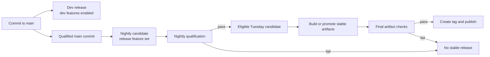

---
authors:
  - "@anewberry"
state: review
links:
  - https://github.com/NVIDIA/OpenShell/pull/2148
  - https://github.com/NVIDIA/OpenShell/pull/2695
---

# RFC 0014 - Alpha Exit Criteria and Stable Release Policy

## Summary

The goal of this RFC is to define OpenShell's exit from alpha and establish a
predictable release cycle for production users and ecosystem developers.
It defines release qualification requirements, compatibility guidelines for
stable and evolving APIs, per-commit development releases, nightly builds, and
weekly stable releases.

- Publish per-commit development releases, nightly candidates, and qualified
  stable releases every Tuesday.
- Establish stable and experimental API maturity, compatibility and versioning
  rules, and maintenance for the latest and N-1 minor release lines.
- Block stable publication on conformance, upgrade, breaking API change, and
  security qualification across the supported release matrix.
- Promote qualified binary payloads unchanged across standalone downloads,
  packages, and container images, with recorded digests, SBOMs, and provenance.

## Motivation

OpenShell's alpha process supports rapid iteration but does not define which
artifacts qualify for release, which interfaces users can rely on, or how long
release lines are maintained. OpenShell 0.1.0 is considered suitable for
production use within the published support matrix. This suitability means
that supported platform, architecture, installation method, compute driver,
deployment topology, and capability combinations have passed the required
conformance and upgrade qualification; stable interfaces have an established
compatibility baseline; supported upgrade and rollback paths have been tested;
release artifacts have verified provenance, SBOMs, and digests; and required
security review has found no unresolved blocking issues. Experimental and
unsupported combinations remain clearly identified and are not covered by the
production support promise.

## Proposal

### Release cadence

Starting with 0.1.0, OpenShell documents each release by its version, support
status, and the maturity of individual capabilities.

OpenShell publishes stable tagged releases intended for production use within
the published support matrix. Stable releases occur every Tuesday and increment
the patch version, for example `0.1.1` followed by `0.1.2`. A stable tag is
published only when there are changes and every blocking qualification suite
passes.

OpenShell publishes a development release for every commit to `main`. Each
development release identifies its source commit and artifact manifest, and the
floating `dev` alias points to the newest one. Development releases enable all
development compilation flags and features. They are not qualification
evidence, are not supported deployment pins, and are not candidates for stable
promotion.

OpenShell also publishes nightly prereleases of the next expected patch
release. After `0.1.1`, a nightly release may be identified as
`0.1.2-nightly.20260811.1`, where the final component distinguishes multiple
candidates created on the same date. Git tags add the normal `v` prefix. Each
nightly identifies one source commit and one artifact manifest. A floating
`nightly` alias may point to the newest candidate for convenience, but the alias
is not qualification evidence and is not a supported deployment pin.

Release tooling maps development and nightly versions into the syntax and
ordering rules required by Python, Cargo, Debian, RPM, Snap, OCI, Helm, and
other publication targets. The mapping must preserve the invariant that these
releases sort before their corresponding stable release wherever the package
ecosystem supports prerelease ordering.

### Project version and compatibility contract

Version 0.1.0 begins OpenShell's supported compatibility contract. For
the 0.x series:

- Patch releases may contain bug fixes and additive, backward-compatible
  functionality. They do not intentionally break a stable interface.
- An unavoidable breaking change to any stable interface starts a new minor
  release and resets the patch version, for example `0.1.x` to `0.2.0`.
- Security fixes may make the narrowest necessary incompatible change when no
  safe compatible remediation exists. The release notes and security guidance
  must describe the operator action without exposing embargoed information.
- Deprecation is preferred to removal. Except for urgent security or safety
  reasons, a deprecated stable interface remains available for the rest of its
  minor release line and is removed only in a later minor release.

The project version covers more than protobuf wire compatibility. Before
0.1.0, OpenShell publishes an inventory that classifies at least these surfaces:

| Surface | Stable promise when designated stable |
| --- | --- |
| Protobuf and generated SDK APIs | Source, wire, JSON, and documented semantic compatibility |
| Hand-written SDK APIs | Documented public types, methods, and behavior remain compatible |
| CLI | Documented commands, flags, exit behavior, and machine-readable output remain compatible |
| Gateway configuration | Existing supported configuration continues to parse with equivalent semantics |
| Sandbox policy schema | Existing supported policies continue to validate and enforce equivalent intent |
| Helm and installation configuration | Supported values, environment variables, and upgrade paths remain compatible |
| Extension contracts | Stable driver, interceptor, and middleware contracts evolve additively |
| Persisted operational state | Supported upgrades migrate state without requiring a clean installation |

The 0.1.0 schemas, SDK signatures, CLI contract fixtures, configuration and
policy schemas, and upgrade fixtures become the initial compatibility baseline.
Every later stable release records which baseline it was checked against.

### Capability maturity and release availability

Capability maturity is independent from the release that contains it:

| Maturity | API naming | Compatibility |
| --- | --- | --- |
| Stable | Stable protobuf packages such as `v1` or `v2` | Covered by the release compatibility contract |
| Experimental | Explicit unstable package such as `v1beta1` | May change with documented migration guidance |

Stable and experimental capabilities may be included in stable, nightly, or
development artifacts according to the release configuration. Availability
only in a development or nightly build is not a third maturity level and does
not make the capability experimental. The capability must still be classified
independently as stable or experimental. A capability absent from stable
artifacts has no stable release availability or support promise.

A new API that is useful to release but whose design is still evolving starts
with a package such as `v1beta1`. It may evolve to `v1beta2` in a patch release
because the package name advertises the lack of stable compatibility. Release
notes still explain the change and any migration path. Graduation creates a
stable `v1` package; it does not rename the experimental package in place.

Features that are not ready to be released are protected by named compile-time
features such as `unstable-<feature>` and collected under a `dev` feature.
Development releases are built with all development compilation flags and
features enabled. Stable tagged releases and nightlies build service binaries,
CLI commands, configuration fields, and documentation without those features.
For now, SDK packages may include the generated types and client methods for
development capabilities in every release so the project does not need to
publish separate development and release SDK variants. Their presence in an SDK
does not make the capability available or supported: the target service must
advertise and implement it, and only stable SDK interfaces are covered by the
compatibility contract. CI for every commit to `main` builds and tests both the
development feature set and the release feature set so compile-gated
development cannot silently break supported builds.

### Breaking changes and API versioning

A project release version bump and a protocol package revision solve different
problems and are applied together when appropriate.

If a breaking change affects a stable OpenShell surface, the release moves to
the next minor version. If the same change is incompatible with a stable
protobuf contract, the protocol also moves to a new major-versioned package,
for example `openshell.v1` to `openshell.v2`. The supported server retains the
old protocol for the maintenance window or supplies an explicit migration path;
the package revision does not by itself satisfy the project-level versioning
requirement.

A breaking CLI, SDK, configuration, policy, Helm, or state change still requires
a minor project release even when no protobuf package changes. Conversely, a
new experimental `v1beta2` package does not require a minor project release
when it does not break any stable interface.

Breaking-change detection runs during code review and again during nightly
qualification. Stable protobuf packages use Buf's `FILE` rules against the
latest stable baseline and any additional supported baseline needed for the
N-1 maintenance promise. Language-specific API checks or agent review skills
cover the public SDKs.
Contract fixtures cover CLI, configuration, policy, and Helm surfaces. Upgrade
and version-skew tests cover semantic and persisted-state behavior that a schema
diff cannot detect.

### Nightly qualification and stable release promotion

The release system separates candidate creation, qualification, and stable
publication:

Every nightly candidate produces a manifest containing its canonical version,
full source commit, build inputs, artifact names and digests, SBOM and provenance
references, and qualification results. Qualification installs and exercises the
candidate artifacts wherever practical rather than substituting a source build.

Release qualification consists of four suites defined in the
[release qualification supplement](release-qualification.md):

- **Conformance** runs across supported driver and gateway configurations. It
  verifies core sandbox behavior, policy enforcement, and extension contracts.
- **Upgrade** runs once per supported installation package and verifies its
  upgrade path, state migration, post-upgrade health, and rollback where
  promised.
- **Breaking API change review** runs once per candidate and compares stable
  protobuf and SDK interfaces with every applicable compatibility baseline.
- **Security review** runs once per candidate and verifies security scan
  results, reviews changes to security-sensitive boundaries, and confirms that
  every finding has the required disposition.

The initial release targets are defined in the [build matrix](build-matrix.md),
and blocking coverage is defined in the
[release qualification supplement](release-qualification.md).

The weekly release selects the newest eligible nightly candidate published
before a documented cutoff. No source change is allowed between candidate
qualification and stable publication. The candidate build produces canonical
binary payloads once; standalone downloads, OCI images, and installation
packages use those same payloads. Content-addressable artifacts such as OCI
images are promoted by digest rather than rebuilt. Package formats whose
metadata embeds the release version may rebuild only the package envelope. They
must not recompile executables or libraries, and the packaged payload digests
must match the candidate manifest. Any payload change creates a new release
candidate that must receive its own digest, SBOM, and provenance and pass the
applicable blocking qualification suites before the stable tag and publication
are created.

The stable qualification record contains the final artifact digests, SBOM and
provenance references, and results, and links them to the qualifying nightly
manifest. A nightly result cannot be copied to a different artifact digest.

The workflow creates the stable Git tag only after all blocking checks pass.
It must not push a tag first and attempt qualification afterward. A failed
weekly run publishes nothing; the next run selects the newest eligible nightly
candidate.

### Maintenance and backports

OpenShell maintains two minor release lines: the latest minor and N-1. Support
applies to the newest patch on each line. Users on an older patch update to the
new maintenance patch rather than receiving a separate fix for every historical
patch.

Maintenance releases contain critical reliability fixes and security fixes.
They do not backport features. A fix is developed on the appropriate primary
branch and backported to a `release/<major>.<minor>` branch when the older line
is affected. Each backport passes the compatibility, regression, packaging,
and supported upgrade qualification appropriate to that line.

For example, if `0.3.1` is current and a vulnerability also affects the 0.2
line, OpenShell publishes the next available `0.2.x` patch from the maintained
0.2 branch. A security release may occur immediately rather than waiting for
the next Tuesday release.

The documentation identifies the supported minor lines, their latest patches,
and their end-of-support dates. When a new minor release makes an older line
N-2, the older line remains supported for at least 90 days after the replacing
minor release becomes stable. The project announces the end-of-support date
when the replacing minor is released. This calendar floor supplements the N-1
rule; it does not shorten a line's support while it remains N-1.

## Implementation plan

1. **Keep per-commit dev releases and publish 0.1.0 nightlies.** Build every
   commit to `main` with all development features, and publish
   `0.1.0-nightly` candidates with the release feature set leading to 0.1.0.
2. **Make the necessary breaking API changes.** Use the pre-0.1.0 window to
   finalize stable interfaces, move evolving APIs to experimental packages,
   and establish the compatibility baseline.
3. **Build qualification tests and release machinery.** Automate compatibility
   detection, conformance, upgrade, breaking API change review, security
   qualification, artifact validation, and release publication gates.
4. **Release 0.1.0.** Promote a qualified nightly candidate, publish the stable
   artifacts and support guidance, and begin the weekly release cadence.
