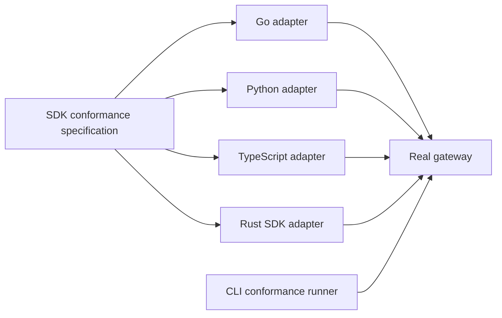

---
authors:
  - "@jiripetrlik"
state: draft
links:
  - https://github.com/NVIDIA/OpenShell/issues/3028
  - https://github.com/jiripetrlik/OpenShell/pull/1
---

# RFC 0015 - SDK Conformance Testing

## Summary

This RFC introduces an SDK conformance specification: versioned Markdown
scenario documents that define the observable gateway behavior supported
OpenShell SDKs must provide. Language-native SDK conformance adapters implement
the specification against a real gateway; together, the specification and
adapters form the SDK conformance suite.

The first implementation is a Go adapter based on the exploratory work in the
related pull request. The prototype currently uses a Podman-backed gateway;
this RFC proposes a Docker-backed gateway as the portable default conformance
environment. The first adapter covers sandbox lifecycle and execution,
providers, and workspaces. Rust, Python, and TypeScript adapters follow
incrementally.

## Motivation

The Go SDK has extensive unit coverage and an opt-in `go:test:integration`
smoke suite. Its health-check and sandbox-exec tests can exercise a gateway
supplied through `OPENSHELL_GATEWAY_ADDRESS`, but the task neither builds nor
starts a gateway, is not included in `go:ci` or the aggregate `e2e` task, and
covers only a narrow smoke path. It does not implement scenarios from the SDK
conformance specification. That leaves a gap: a protocol, conversion,
authentication, or asynchronous-lifecycle regression can pass SDK checks while
breaking SDK consumers in a deployed system.

Adding a Go-only E2E suite would improve that situation, but would leave the
project with independently selected scenarios, assertions, harnesses, and CI
requirements for every SDK. The result would be uneven compatibility coverage
and no durable statement of which gateway behavior all official SDKs promise to
support.

OpenShell already has reusable CLI conformance scenarios in
`openshell-conformance`, and language-specific E2E suites for Rust and Python.
Those establish useful patterns, but CLI conformance cannot validate typed SDK
interfaces, conversions, error classification, or SDK conveniences such as
readiness waiting. An SDK conformance specification is needed alongside them.

This deserves an RFC because it defines a testing strategy and compatibility
boundary across SDKs, gateway behavior, E2E infrastructure, and CI. It also
sets an extension boundary that future SDKs should follow.

## Non-goals

- Replacing unit tests, generated-protobuf checks, or each SDK's language-native
  integration tests.
- Defining every public SDK method as conformant in the initial release.
- Replacing the existing `openshell-conformance` CLI runner or changing its
  scenarios and plan format.
- Requiring every scenario to run against every compute driver, identity mode,
  or operating system on every pull request.
- Standardizing language APIs, error types, package layouts, or async models.
- Providing cross-version compatibility testing against released gateway and SDK
  versions in the first implementation.

## Proposal

### SDK conformance specification

Add the versioned SDK conformance specification under `e2e/conformance/sdk/`.
The specification defines scenarios in terms of externally observable gateway
behavior: setup inputs, ordered operations, expected successful results,
expected classified failures, and cleanup requirements. It does not encode
language syntax or require one generic test runner to call every SDK.

The initial specification version covers these workflows:

| Area | Required behavior |
| --- | --- |
| Sandbox lifecycle | Create, get, list, wait for ready, delete, observe eventual removal, and exercise the lifecycle error scenarios defined below. |
| Sandbox execution | Run a successful command, preserve sandbox filesystem state across executions, and surface a failed command's exit status and stderr. |
| Providers | Create, get, list, update, attach, detach, and delete a provider; exercise the provider error scenarios defined below; verify a sandbox receives placeholders rather than raw credential values. |
| Workspaces | Create, get, list, delete, apply labels, scope sandbox visibility, and exercise the workspace error scenarios defined below. |

A scenario may be reported as `unsupported` only when the SDK's published API
does not expose the exact required capability. Test-harness limitations, missing
fixtures, and adapter implementation gaps are failures, not unsupported
outcomes. An adapter reports every required scenario in its declared
specification version as `passed`, `failed`, `unsupported`, `not_implemented`,
or `skipped`; it must not silently skip one.

`unsupported` does not satisfy a scenario. It requires a reviewed capability
exception recorded in the versioned SDK conformance specification. Each
exception records the specification version, SDK and applicable SDK version or
release range, scenario and exact omitted operation, evidence that the public
API lacks it, rationale, approval reference, and removal condition. Adding,
changing, or removing an exception is a compatibility change.

An adapter is conformant only when every required scenario in its declared
specification version passes. It is conformant with documented capability
exceptions only when every `unsupported` result has a matching exception and
every supported scenario passes. A `failed` or `not_implemented` required
scenario, unrecorded omission, or omission of all required operations in one
workflow area makes the adapter non-conformant. `skipped` is permitted only for
a focused local run with a recorded reason, never in a full adapter CI lane.
Adding an SDK feature that makes an omitted scenario available requires enabling
that scenario and removing its exception in the same change.

The specification is a set of versioned Markdown scenario documents. Each
document gives a stable scenario identifier, preconditions, ordered operations,
expected observable results, cleanup expectations, and permitted SDK-specific
variations. Markdown is the normative specification because it keeps the
behavior reviewable without introducing a parser or a general gateway workflow
language.

### Scenario identifiers

A scenario identifier has the form `sdk.<area>.<scenario>`, where `<area>` and
`<scenario>` are lowercase ASCII kebab-case tokens:

```text
^sdk\.[a-z][a-z0-9-]*\.[a-z][a-z0-9-]*$
```

Examples include `sdk.sandbox.create-wait-get-delete`,
`sdk.sandbox.exec-persistence-and-failure`,
`sdk.provider.placeholder-safety`, and `sdk.workspace.scope-and-labels`.
Scenario identifiers are immutable and must not be repurposed. A new required
observation for the same behavior increments the specification version but keeps
the identifier; splitting, replacing, or materially changing a behavior creates
new identifiers, while prior version directories retain the former identifiers.

Every adapter test that implements a scenario includes its exact identifier in a
language-native test name or annotation. Each executed scenario entry in the
adapter coverage report includes a repository-relative test reference, allowing
reviewers to locate its implementation without inferring it from test names.

Every scenario document uses those sections. The following abbreviated document
illustrates the required shape; the versioned scenario documents remain the
normative artifacts.

```md
# Sandbox lifecycle

- ID: `sdk.sandbox.create-wait-get-delete`
- Specification version: `1`

## Preconditions

- A reachable Docker-backed gateway, a unique sandbox name, and a sandbox
  fixture guaranteed to remain running until cleanup.

## Operations and expected observations

1. Create the sandbox; its returned name matches the requested name and its ID is nonempty.
2. Wait for ready; a subsequent get reports the SDK-native phase corresponding
   to protobuf enum value `SANDBOX_PHASE_READY`.
3. Get the sandbox; its name and ID match the create result.
4. List sandboxes; the created sandbox is present; ordering is not significant.
5. Delete the sandbox.
6. Poll get until it reports `NotFound`; list no longer contains the sandbox.

## Cleanup

- On failure, delete the created sandbox within the cleanup deadline.

## Permitted variations

- Adapters use native waiting, error, and assertion APIs.
```

Adapters translate the Markdown requirements into native test code. The
specification includes a machine-readable `manifest.json` in each version
directory that enumerates scenario IDs and requiredness. The manifest is
metadata only: Markdown remains normative for scenario behavior. CI validates
that it enumerates exactly the correctly formatted scenario IDs in that
version's Markdown documents.

Each registered adapter emits a machine-readable coverage report for its
declared specification version. The report identifies the adapter and
specification version and lists every manifest scenario ID exactly once with its
status; `unsupported` and `skipped` entries include their exception reference or
skip reason. CI compares the report with the corresponding manifest, rejects an
unknown, missing, or duplicate scenario ID and version mismatch, and requires
every required scenario to report `passed` or `unsupported` with a matching
documented capability exception. A required `not_implemented` result, and any
`skipped` result in a full adapter CI lane, fail the completeness check. This
metadata does not define operations or introduce a shared test runner.

### Error classification

The SDK conformance specification defines failure classes for adapter
assertions, not a common public SDK error type. An adapter may use its
language-native error type, status accessor, exception predicate, or wrapped
cause, but it must demonstrate the specified classification.

Version 1 defines these failure classes and negative scenarios:

| Failure class | Required gateway status | Required negative scenario |
| --- | --- | --- |
| `NotFound` | gRPC `NOT_FOUND` | Get or delete a nonexistent sandbox, provider, or workspace. |
| `AlreadyExists` | gRPC `ALREADY_EXISTS` | Create a sandbox, provider, or workspace twice with the same name. |
| `InvalidArgument` | gRPC `INVALID_ARGUMENT` | Submit a server-validated invalid sandbox specification; create a provider with an unknown profile type; or change an existing provider's type. |
| `FailedPrecondition` | gRPC `FAILED_PRECONDITION` | Create a sandbox with, or attach to an existing sandbox, a nonexistent provider. |

A scenario passes only when the adapter recognizes the required gateway status
as its specified failure class; a generic or unclassified error does not meet
the requirement. Diagnostic message text is not part of the contract. Later
specification versions may add classes and scenarios for other gateway statuses,
such as `UNAUTHENTICATED`, `PERMISSION_DENIED`, or `ABORTED`.

Unexpected transport and RPC failures are not expected classified scenario
results.
Connection, DNS, TLS, gRPC `UNAVAILABLE`, `DEADLINE_EXCEEDED`, `CANCELLED`,
`INTERNAL`, and unknown-status failures fail the scenario. Adapters must not add
retries that turn these failures into success. Bounded polling is permitted only
where a scenario explicitly requires eventual readiness or deletion; deletion
polling recognizes only `NotFound` as successful removal. This rule does not
prohibit an SDK's documented internal behavior, such as authentication refresh.

### Observation precision

Each scenario specifies exact observable assertions. An adapter must verify the
stated field values, status transitions, output sentinels, and shared failure
classes; a successful return, nonempty response, or arbitrary error is
insufficient. The versioned scenario documents define generated resource names
and fixed sentinel values. They do not require equality for server-generated
identifiers, timestamps, list ordering, or diagnostic text unless a scenario
explicitly states otherwise. When the specification names a protobuf enum value
or request field, an adapter may use its SDK's native representation, but that
representation must map to the named wire value.

Version 1 uses these minimum observations:

| Workflow | Required observations |
| --- | --- |
| Create, get, and list | Create returns a resource with the requested name and a nonempty identifier. Get returns the requested name and the same identifier. List contains that resource; list ordering is not significant. |
| Wait for ready | After readiness waiting succeeds, a follow-up get reports the SDK-native phase corresponding to protobuf enum value `SANDBOX_PHASE_READY`. |
| Delete | After delete, bounded polling ends only when get reports `NotFound` and list no longer contains the resource. |
| Successful exec | A non-interactive, non-PTY execution exits with code zero, stdout equals the scenario's success sentinel, and stderr is empty. |
| Persistent execution state | One execution writes the scenario's marker; a later execution returns that exact marker. |
| Failed exec | A non-interactive, non-PTY execution returns the scenario's exact nonzero exit code, stdout is empty, and stderr equals the scenario's failure sentinel. |
| Provider placeholders | A sandbox command reads the named credential and returns a value matching the specification's placeholder matcher for that exact key. The value must differ from the raw synthetic secret. |
| Workspaces | Get returns the requested name and labels exactly, and list membership and sandbox visibility match the scenario's named workspace scope. |

The version 1 lifecycle fixture remains running until scenario cleanup. Reaching
`SANDBOX_PHASE_COMPLETED`, `SANDBOX_PHASE_STOPPED`, or another terminal phase
before the follow-up get fails the scenario; adapters must not accept a terminal
phase as an alternative to `SANDBOX_PHASE_READY`.

Execution scenarios use each SDK's non-interactive execution operation. The
resulting `ExecSandboxRequest` has `tty = false` and `no_login_shell = true`, so
stdout and stderr remain separate and shell profile output cannot affect the
observations. An SDK does not need to expose options with those literal names if
its non-interactive operation guarantees the same wire behavior. The success
command emits only its fixed ASCII sentinel to stdout without a trailing newline
and exits with code zero. The failure command emits only its fixed ASCII sentinel
to stderr without a trailing newline and exits with the exact nonzero code named
by the scenario. Adapters compare the collected output without trimming or other
normalization.

Provider placeholder scenarios use a shared conformance fixture containing a
credential key, a synthetic raw credential value, and the accepted placeholder
matcher. For fixture key `K`, the observed value must match one of these forms:

```text
openshell:resolve:env:K
openshell:resolve:env:v<decimal_revision>_K
openshell:resolve:env:s<64-lowercase-hex-handle>_K
```

Equivalently, adapters may construct this matcher from the fixture key:

```text
^openshell:resolve:env:(?:K|v[0-9]+_K|s[0-9a-f]{64}_K)$
```

The adapter must positively match the value captured from the sandbox command
and assert that it differs from the raw synthetic secret. Empty or absent
values, encoded copies of the secret, placeholders for another key, and other
`openshell:resolve:env:` values fail the scenario.

### Specification versioning

The SDK conformance specification has one monotonic integer version, initially
`1`. The version applies to the complete normative Markdown scenario set, not
to individual scenarios. `e2e/conformance/sdk/README.md` records the current
version and adapter support matrix, and the scenario documents for each version
live under `e2e/conformance/sdk/v<version>/`.

A specification change increments the version when it adds, removes, or changes
a required scenario, required observation, classified failure, cleanup rule, or
capability exception. Editorial wording, examples, formatting, and
clarifications that do not change an adapter's required assertions do not
increment the version.

Each adapter declares the highest specification version it implements and
reports that version in its CI results. An adapter behind the current version is
recorded in the adapter support matrix and may run only scenarios from its
declared version. It must not silently skip requirements while claiming support
for the current version. This permits incremental adapter rollout; once every
supported adapter exists, CI may require every adapter to implement the current
version.

### Fixture ownership and isolation

In this RFC, a fixture is predefined test data or setup that makes a scenario
repeatable. Fixtures have three ownership levels:

| Fixture type | Owner | Examples | Reuse rule |
| --- | --- | --- | --- |
| Conformance fixture | SDK conformance specification | A standard sandbox policy, an exec command, expected exit code, credential key, synthetic raw credential value, accepted placeholder matcher, or expected `NotFound` result. | Used by every SDK adapter that implements the scenario. |
| Adapter fixture | One SDK adapter | Go `TestMain`, a configured Go client, context deadlines, helper functions, and language-native assertions. | Local to that SDK because its runtime and testing idioms differ. |
| Live test resource | One test invocation | A sandbox, provider, workspace, credential value, or temporary file created while a test runs. | Never shared between parallel tests; each test uses a unique name and cleans it up. |

The shared Markdown scenario is authoritative for conformance fixtures. It
states the inputs and observations each SDK must use or verify, such as a
failing command's exit code and stderr content. It does not prescribe how Go,
Python, Rust, or TypeScript construct a client or express assertions.

Adapter fixtures remove repeated language-specific setup without crossing SDK
boundaries. They may share a gateway connection within one test process only
when the adapter can do so safely. They must not cause tests to share mutable
gateway objects or credentials.

Live resources are deliberately isolated. Every test creates its own uniquely
named sandbox, provider, and workspace as needed; it registers bounded cleanup
before later operations can fail. A scenario may define a synthetic credential
value for placeholder testing, but the adapter creates the provider that holds
it for that invocation and must verify that the raw value is never returned to
the sandbox.

Each adapter run assigns its resources the name prefix
`sdk-conformance-<adapter>-<unix-seconds>-<random>-`, where `<adapter>` is its
stable adapter identifier. Before running against a gateway that can outlive
the test process, the adapter must perform a bounded scavenging pass. It must
remove resources bearing its adapter prefix whose encoded start time is older
than the documented stale-run TTL; that TTL must exceed the maximum conformance
lane duration, so concurrent healthy runs are not selected. It deletes
dependent sandboxes first, then providers, then workspaces, and polls only as
needed to observe their deletion. Failure to remove an eligible stale resource
is a setup failure and must report its identity. This recovery pass supplements
rather than replaces per-test cleanup.

### Native SDK adapters

Each supported SDK owns a native adapter and test entry point under `e2e/`.
An adapter implements scenarios from the SDK conformance specification,
performs the corresponding SDK calls, and checks the standardized observations
using that language's normal test framework. It may add language-specific
assertions where they validate the SDK surface, such as Go context cancellation
or TypeScript typing, without changing the SDK conformance specification.

The Go adapter lives in `e2e/go/` as a separate Go module. Python conformance
tests live in `e2e/python/conformance/` beside, but separate from, the existing
Python E2E suite and may reuse its shared pytest fixtures. The existing
`e2e/rust/` crate remains the CLI and gateway E2E suite; the Rust SDK adapter
lives in a separate `e2e/rust-sdk/` crate. The TypeScript adapter lives in
`e2e/typescript/`.

This split is intentional. `e2e/conformance/sdk/` owns the language-neutral,
versioned specification, while adapter code stays in language-owned E2E roots
so it can use each SDK's native module, test framework, and existing fixtures.
The older `e2e/mcp-conformance/` directory is a protocol-specific executable
suite, not the directory model for native SDK adapters.

The adapters have a common responsibility:

- create unique test resources and register cleanup before making later calls;
- use bounded operation and cleanup deadlines;
- tolerate documented asynchronous deletion by polling only the specified
  observable state;
- scavenge stale, adapter-owned resources before using an external gateway;
- emit enough resource identity and gateway diagnostics to make CI failures
  actionable;
- require `OPENSHELL_GATEWAY` to name the registered gateway configuration
  explicitly supplied by the caller.

The Go module has a local `replace` directive to `sdk/go/`, and its files use
the `e2e` build tag. The related draft PR demonstrates this shape and currently
uses the Podman gateway harness, but it must be rebased, moved to the Docker
default lane, and adjusted to the SDK conformance specification before it is
accepted.



### Gateway harness and runtime coverage

The default SDK conformance lane starts one Docker-backed gateway through the
existing `e2e/with-docker-gateway.sh` harness. This gives all SDK adapters one
repeatable local command and prevents the general `mise run e2e` task from
implicitly requiring both Docker and Podman.

Each adapter provides an `e2e:sdk:<language>:adapter` task that requires
`OPENSHELL_GATEWAY` to name the registered gateway configuration supplied by
its caller and never starts or stops a gateway. Adapters do not accept
`OPENSHELL_GATEWAY_ADDRESS` or `OPENSHELL_GATEWAY_ENDPOINT` as alternate
inputs. Its standalone `e2e:sdk:<language>` task wraps that adapter task in
`e2e/with-docker-gateway.sh`. The harness accepts
`OPENSHELL_GATEWAY_ENDPOINT` as an input only for its existing-endpoint mode,
registers that endpoint as a named gateway configuration, and exports the name
through `OPENSHELL_GATEWAY` before invoking an adapter. The older
`go:test:integration` smoke tests retain their separate
`OPENSHELL_GATEWAY_ADDRESS` convention. The existing `e2e:rust` and
`e2e:python` tasks retain their CLI and Python E2E meanings; `e2e:go` is a
stable convenience alias for `e2e:sdk:go` required by the initial Go
implementation. The `e2e:sdk` umbrella task likewise wraps all adapter-only
tasks in one invocation of that harness and runs them concurrently against the
shared gateway. It waits for every adapter, fails if any adapter fails, and
tears down the gateway only after every adapter completes. The general `e2e`
aggregate depends on `e2e:sdk`, rather than on individual SDK tasks, so it
starts one shared Docker gateway for all SDK adapters. Sharing bounds the number
of concurrent gateway containers and reduces CPU, memory, and dynamic-port
pressure while preserving adapter parallelism; it does not depend on mise task
dependencies running sequentially.
This also allows the harness's `OPENSHELL_GATEWAY_ENDPOINT` mode to supply an
existing gateway without changing adapter task behavior. Raw endpoint mode is
HTTP-only and therefore provides functional conformance coverage but does not
qualify TLS, mTLS, OIDC, or other authentication behavior. The required default
CI lane uses the harness-managed HTTPS gateway and its named mTLS configuration;
only that lane contributes TLS and mTLS authentication coverage.

Runtime-specific SDK scenarios are allowed when the expected result depends on
a compute driver or deployment mode. They belong in explicitly named tasks and
CI jobs, such as `e2e:sdk:go:podman`; they do not redefine the portable SDK
conformance specification.
The initial Go adapter therefore runs in the Docker default lane. A Podman lane
may be added later to validate its harness and driver behavior, but is not a
prerequisite for the SDK conformance specification.

Every CI lane must capture gateway logs on failure. Per-language test timeouts
must be shorter than the job timeout and should report the last observed state
instead of relying on a global test-framework timeout.
Captured gateway logs and adapter diagnostics must not contain tokens, TLS key
material, or credential values; adapters must redact such data and must never
print raw credential values, including synthetic fixture values, on failure.

### Relationship to existing tests

`openshell-conformance` remains the portable CLI conformance suite. It invokes
the `openshell` binary and validates command-line behavior, so it is not an SDK
adapter and does not consume scenarios from the SDK conformance specification.

SDK unit tests continue to validate conversion details, retry behavior, and
language-specific ergonomics cheaply. Existing Rust and Python E2E tests remain
valid and are not moved wholesale. When one covers a specification scenario,
its coverage is mapped in the adapter support matrix and the conformance adapter
becomes the portable assertion owner. Existing tests remain where they are when
they cover language-specific, CLI-specific, runtime-specific, or otherwise
non-conformance behavior.

Gateway-dependent portable behavior defined by the SDK conformance specification
belongs in its native conformance adapter. SDK-local integration tests may retain
temporary smoke coverage while an adapter is introduced, but do not count toward
conformance coverage. Once equivalent adapter coverage exists, SDK-local
integration tests should cover SDK-specific behavior such as context
cancellation, streaming, authentication, or transport negotiation.

The SDK conformance specification is the source of truth for portable SDK behavior.
Its scenario identifiers, required observations, and capability exceptions are
reviewed as compatibility changes.

## Implementation plan

1. Add `e2e/conformance/sdk/README.md`, the version-one Markdown scenario
   documents and `manifest.json` under `e2e/conformance/sdk/v1/`, and a short
   contributor guide. Record the initial adapter support matrix and any
   capability exceptions. Include the required `NotFound`, `AlreadyExists`,
   `InvalidArgument`, and `FailedPrecondition` scenarios and the minimum
   observations and shared credential-placeholder fixture defined above.
2. Rebase the Go prototype onto current `main`, move it to the Docker gateway
   harness, and implement it as the first adapter. Strengthen its assertions to
   check returned resource state, readiness state, provider read/list/update,
   failed exec behavior, and missing-sandbox errors. Emit its coverage report.
3. Add `mise run e2e:sdk:go:adapter`, its standalone `mise run e2e:sdk:go`
   wrapper, and the `mise run e2e:go` convenience alias, plus a focused Go CI
   lane. The wrapper starts the Docker-backed gateway harness, runs the
   separate `e2e/go/` adapter against the SDK conformance specification through
   the named configuration in `OPENSHELL_GATEWAY`, and validates its coverage
   report. It complements `go:test:integration`; this RFC does not modify or
   retire the existing SDK-local smoke tests. Map the portable assertions in
   `TestIntegration_HealthCheck`, `TestIntegration_SandboxExecSmoke`, and
   `TestIntegration_FileTransfer` to their `e2e/go/` scenarios as they are
   implemented. Once equivalent adapter coverage exists, `e2e:sdk:go` (and
   its `e2e:go` alias) is the authoritative portable lane; a separately scoped
   Go SDK change may then reduce those tests to Go-specific coverage.
4. Add adapters for the Rust SDK, Python SDK, and TypeScript SDK. Migrate or
   map existing E2E coverage where it matches a scenario, retaining
   language-specific tests where it does not. Each provides the same
   adapter-only and standalone task pair.
5. Add `mise run e2e:sdk`, which starts one Docker-backed gateway, invokes every
   adapter-only task concurrently, waits for all adapters, and tears down the
   gateway after they complete. Keep it out of the aggregate `e2e` task until
   the Docker default path is in place; then add this umbrella task, not the
   individual SDK tasks, to the aggregate.
6. Add runtime-specific lanes only for scenarios whose expected behavior varies
   by runtime. Document supported capability exceptions and their rationale.
7. Update the relevant architecture and contributor documentation when the SDK
   conformance suite is accepted and implemented.

## Risks

- A broad DSL could become a second orchestration framework. Markdown keeps the
  specification descriptive, while adapters retain control flow in native code.
- The SDK conformance specification could flatten meaningful language
  differences. Its scenarios define gateway-visible outcomes, while each SDK
  retains its own type, error, and cancellation assertions.
- Running every SDK against every runtime would make CI too slow and flaky. The
  default lane uses Docker and adds specialized lanes only for
  runtime-dependent behavior.
- Process-level timeouts can bypass language-level cleanup and leave resources
  on an external gateway. Run-prefixed names, bounded per-test cleanup, and the
  pre-run scavenger recover stale adapter-owned resources without disturbing
  active runs.
- A scenario may accidentally codify a gateway implementation detail. Reviews
  should specify observable behavior and avoid asserting storage internals,
  polling intervals, or transport implementation details.

## Alternatives

### Keep a Go-only E2E suite

This delivers value quickly and the related PR is a useful starting point.
However, it does not establish an SDK conformance specification, leaving
other bindings to independently choose what they test. It is retained as the
first implementation phase, but not as the final design.

### Put all E2E tests inside each SDK directory

Keeping tests beside SDK code simplifies ownership, but makes the SDK
conformance specification and common gateway-harness conventions harder to
discover and reuse.
The separate `e2e/` adapters make the real-gateway boundary explicit while SDK
unit and integration tests remain near their implementation.

### Extend the existing CLI conformance runner

The runner already has reusable plans and lifecycle scenarios, but it executes
the CLI. Adding language SDK invocation would couple it to multiple language
runtimes and would still not validate SDK-native APIs. Scenarios in the SDK
conformance specification can align, while the runners remain separate.

### Use only generated-protobuf compatibility checks

Schema checks detect wire changes, but cannot verify SDK conversions, readiness
helpers, credential-placeholder safety, cleanup behavior, or error
classification against a running gateway.

## Prior art

- `crates/openshell-conformance` provides a versioned plan and registered
  scenario model for CLI conformance. This RFC adopts the idea of explicit,
  reviewable scenarios while retaining SDK-native execution.
- The existing `e2e/with-docker-gateway.sh` harness supplies a repeatable real
  gateway lifecycle for Rust and Python E2E tests. It is the portable default
  for the SDK conformance suite.
- The Go SDK's fake client and bufconn tests demonstrate the complementary
  unit-test layer. They remain appropriate for fast, isolated tests that do
  not need a real gateway.
- The related Go E2E draft demonstrates parallel-safe resource naming,
  placeholder assertions, and eventual-deletion handling that the first adapter
  should preserve.

## Open questions

- Which SDKs are in the initial supported-adapter set? This RFC assumes Go,
  Rust, Python, and TypeScript, subject to confirmation of release support.
- Should independently released SDKs run the same scenarios against the
  latest gateway only, a release compatibility range, or both?
- Which provider type can provide deterministic placeholder coverage without
  requiring a live external credential service in every CI lane?
