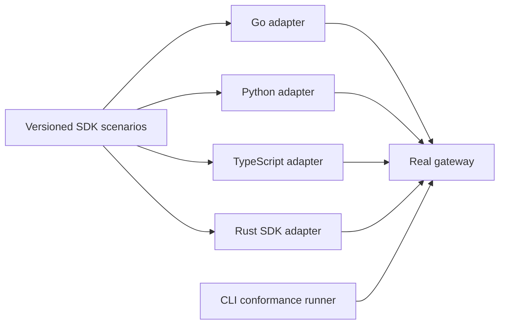

---
authors:
  - "@jiripetrlik"
state: draft
links:
  - https://github.com/NVIDIA/OpenShell/issues/3028
  - https://github.com/jiripetrlik/OpenShell/pull/1
---

# RFC 0015 - SDK Conformance Testing

## Summary

This RFC introduces a shared SDK conformance suite that verifies the supported
OpenShell SDKs against a real gateway. The suite defines the observable
behavior that an SDK must provide for selected gateway workflows, while each
language keeps native test code and idioms.

The first implementation is a Go adapter based on the exploratory work in the
related pull request. The prototype currently uses a Podman-backed gateway;
this RFC proposes a Docker-backed gateway as the portable default conformance
environment. The first adapter covers sandbox lifecycle and execution,
providers, and workspaces. Rust, Python, and TypeScript adapters follow
incrementally.

## Motivation

The Go SDK has extensive unit coverage, but its client tests use an in-process
transport and do not exercise a built `openshell-gateway`. That leaves a gap:
a protocol, conversion, authentication, or asynchronous-lifecycle regression
can pass SDK unit tests while breaking SDK consumers in a deployed system.

Adding a Go-only E2E suite would improve that situation, but would leave the
project with independently selected scenarios, assertions, harnesses, and CI
requirements for every SDK. The result would be uneven compatibility coverage
and no durable statement of which gateway behavior all official SDKs promise to
support.

OpenShell already has reusable CLI conformance scenarios in
`openshell-conformance`, and language-specific E2E suites for Rust and Python.
Those establish useful patterns, but CLI conformance cannot validate typed SDK
interfaces, conversions, error classification, or SDK conveniences such as
readiness waiting. A shared SDK contract is needed alongside them.

This deserves an RFC because it defines a testing strategy and compatibility
contract across SDKs, gateway behavior, E2E infrastructure, and CI. It also
sets an extension boundary that future SDKs should follow.

## Non-goals

- Replacing unit tests, generated-protobuf checks, or each SDK's language-native
  integration tests.
- Defining every public SDK method as conformant in the initial release.
- Replacing the existing `openshell-conformance` CLI runner or changing its
  scenarios and plan format.
- Requiring every scenario to run against every compute driver, identity mode,
  or operating system on every pull request.
- Standardizing language APIs, error types, package layouts, or async models.
- Providing cross-version compatibility testing against released gateway and SDK
  versions in the first implementation.

## Proposal

### A shared behavioral specification

Add a versioned SDK conformance specification under `e2e/conformance/sdk/`.
The specification defines scenarios in terms of externally observable gateway
behavior: setup inputs, ordered operations, expected successful results,
expected classified failures, and cleanup requirements. It does not encode
language syntax or require one generic test runner to call every SDK.

The initial specification version covers these workflows:

| Area | Required behavior |
| --- | --- |
| Sandbox lifecycle | Create, get, list, wait for ready, delete, and observe eventual removal. |
| Sandbox execution | Run a successful command, preserve sandbox filesystem state across executions, and surface a failed command's exit status and stderr. |
| Providers | Create, get, list, update, attach, detach, and delete a provider; verify a sandbox receives placeholders rather than raw credential values. |
| Workspaces | Create, get, list, delete, apply labels, scope sandbox visibility, and classify missing resources as not found. |

A scenario may explicitly mark an operation as unsupported for an SDK only when
the SDK's published API does not expose that capability. The adapter must report
the omission in its results; it must not silently skip it. Adding an SDK feature
that makes an omitted scenario available requires enabling that scenario in the
same change.

The specification is a set of versioned Markdown scenario documents. Each
document gives a stable scenario identifier, preconditions, ordered operations,
expected observable results, cleanup expectations, and permitted SDK-specific
variations. Markdown is the normative contract because it keeps the behavior
reviewable without introducing a parser or a general gateway workflow language.

Adapters translate the Markdown requirements into native test code. A future
machine-readable companion may reduce duplicated fixture data or produce
coverage reports, but it must derive from the Markdown contract and is not
required for the initial implementation.

### Fixture ownership and isolation

In this RFC, a fixture is predefined test data or setup that makes a scenario
repeatable. Fixtures have three ownership levels:

| Fixture type | Owner | Examples | Reuse rule |
| --- | --- | --- | --- |
| Conformance fixture | Shared scenario documents | A standard sandbox policy, an exec command, expected exit code, placeholder expectation, or expected `NotFound` result. | Shared by every SDK adapter that implements the scenario. |
| Adapter fixture | One SDK adapter | Go `TestMain`, a configured Go client, context deadlines, helper functions, and language-native assertions. | Local to that SDK because its runtime and testing idioms differ. |
| Live test resource | One test invocation | A sandbox, provider, workspace, credential value, or temporary file created while a test runs. | Never shared between parallel tests; each test uses a unique name and cleans it up. |

The shared Markdown scenario is authoritative for conformance fixtures. It
states the inputs and observations each SDK must use or verify, such as a
failing command's exit code and stderr content. It does not prescribe how Go,
Python, Rust, or TypeScript construct a client or express assertions.

Adapter fixtures remove repeated language-specific setup without crossing SDK
boundaries. They may share a gateway connection within one test process only
when the adapter can do so safely. They must not cause tests to share mutable
gateway objects or credentials.

Live resources are deliberately isolated. Every test creates its own uniquely
named sandbox, provider, and workspace as needed; it registers bounded cleanup
before later operations can fail. A scenario may define a synthetic credential
value for placeholder testing, but the adapter creates the provider that holds
it for that invocation and must verify that the raw value is never returned to
the sandbox.

### Native SDK adapters

Each supported SDK owns a native adapter and test entry point under `e2e/`.
An adapter loads the shared scenarios, performs the corresponding SDK calls,
and checks the standardized observations using that language's normal test
framework. It may add language-specific assertions where they validate the SDK
surface, such as Go context cancellation or TypeScript typing, without changing
the shared contract.

The adapters have a common responsibility:

- create unique test resources and register cleanup before making later calls;
- use bounded operation and cleanup deadlines;
- tolerate documented asynchronous deletion by polling only the specified
  observable state;
- emit enough resource identity and gateway diagnostics to make CI failures
  actionable;
- run only when the harness explicitly supplies a reachable gateway.

The Go adapter lives in `e2e/go/` as a separate Go module with a local
`replace` directive to `sdk/go/`. Its files use the `e2e` build tag. The related
draft PR demonstrates this shape and currently uses the Podman gateway harness,
but it must be rebased, moved to the Docker default lane, and adjusted to the
shared scenarios before it is accepted.

### Gateway harness and runtime coverage

The default SDK conformance lane starts one Docker-backed gateway through the
existing `e2e/with-docker-gateway.sh` harness. This gives all SDK adapters one
repeatable local command and prevents the general `mise run e2e` task from
implicitly requiring both Docker and Podman.

Runtime-specific SDK scenarios are allowed when the expected result depends on
a compute driver or deployment mode. They belong in explicitly named tasks and
CI jobs, such as `e2e:go:podman`; they do not redefine the portable contract.
The initial Go suite therefore runs in the Docker default lane. A Podman lane
may be added later to validate its harness and driver behavior, but is not a
prerequisite for the shared SDK contract.

Every CI lane must capture gateway logs on failure. Per-language test timeouts
must be shorter than the job timeout and should report the last observed state
instead of relying on a global test-framework timeout.

### Relationship to existing tests

`openshell-conformance` remains the portable CLI conformance suite. It invokes
the `openshell` binary and validates command-line behavior, so it is not an SDK
adapter and does not consume SDK scenarios.

SDK unit tests continue to validate conversion details, retry behavior, and
language-specific ergonomics cheaply. Existing Rust and Python E2E tests remain
valid. Their scenarios should be mapped to the shared specification over time;
the project should not rewrite stable coverage merely to satisfy a new layout.

The conformance specification is the source of truth for portable SDK behavior.
Its scenario identifiers, required observations, and capability exceptions are
reviewed as compatibility changes.

## Implementation plan

1. Add the version-one Markdown scenario documents and a short contributor
   guide under `e2e/conformance/sdk/`. Start with sandbox, exec, provider, and
   workspace workflows defined above.
2. Rebase the Go prototype onto current `main`, move it to the Docker gateway
   harness, and implement it as the first adapter. Strengthen its assertions to
   check returned resource state, readiness state, provider read/list/update,
   failed exec behavior, and missing-sandbox errors.
3. Add `mise run e2e:go` and a focused Go CI lane. Keep it out of the aggregate
   `e2e` task until the Docker default path is in place; then add it to the
   aggregate task.
4. Add adapters for the Rust SDK, Python SDK, and TypeScript SDK. Migrate or
   map existing E2E coverage where it matches a scenario, retaining
   language-specific tests where it does not.
5. Add runtime-specific lanes only for scenarios whose expected behavior varies
   by runtime. Document supported capability exceptions and their rationale.
6. Update the relevant architecture and contributor documentation when the
   suite is accepted and implemented.

## Risks

- A broad DSL could become a second orchestration framework. Markdown keeps the
  contract descriptive, while adapters retain control flow in native code.
- The contract could flatten meaningful language differences. Shared scenarios
  define gateway-visible outcomes, while each SDK retains its own type, error,
  and cancellation assertions.
- Running every SDK against every runtime would make CI too slow and flaky. The
  default lane uses Docker and adds specialized lanes only for
  runtime-dependent behavior.
- Asynchronous cleanup can leave leaked sandboxes or providers after failures.
  Adapters must register bounded cleanup early and failure diagnostics must
  identify resources for manual recovery.
- A scenario may accidentally codify a gateway implementation detail. Reviews
  should specify observable behavior and avoid asserting storage internals,
  polling intervals, or transport implementation details.

## Alternatives

### Keep a Go-only E2E suite

This delivers value quickly and the related PR is a useful starting point.
However, it does not establish a shared SDK compatibility contract, leaving
other bindings to independently choose what they test. It is retained as the
first implementation phase, but not as the final design.

### Put all E2E tests inside each SDK directory

Keeping tests beside SDK code simplifies ownership, but makes a shared scenario
catalog and common gateway-harness conventions harder to discover and reuse.
The separate `e2e/` adapters make the real-gateway boundary explicit while SDK
unit and integration tests remain near their implementation.

### Extend the existing CLI conformance runner

The runner already has reusable plans and lifecycle scenarios, but it executes
the CLI. Adding language SDK invocation would couple it to multiple language
runtimes and would still not validate SDK-native APIs. Shared scenario concepts
can align, while the runners remain separate.

### Use only generated-protobuf compatibility checks

Schema checks detect wire changes, but cannot verify SDK conversions, readiness
helpers, credential-placeholder safety, cleanup behavior, or error
classification against a running gateway.

## Prior art

- `crates/openshell-conformance` provides a versioned plan and registered
  scenario model for CLI conformance. This RFC adopts the idea of explicit,
  reviewable scenarios while retaining SDK-native execution.
- The existing `e2e/with-docker-gateway.sh` harness supplies a repeatable real
  gateway lifecycle for Rust and Python E2E tests. It is the portable default
  for the SDK suite.
- The Go SDK's fake client and bufconn tests demonstrate the complementary
  unit-test layer. They remain appropriate for fast, isolated tests that do
  not need a real gateway.
- The related Go E2E draft demonstrates parallel-safe resource naming,
  placeholder assertions, and eventual-deletion handling that the first adapter
  should preserve.

## Open questions

- When, if ever, should repeated fixture data or coverage reporting justify a
  machine-readable companion to the Markdown scenarios?
- Which SDKs are in the initial supported-adapter set? This RFC assumes Go,
  Rust, Python, and TypeScript, subject to confirmation of release support.
- Should independently released SDKs run the same scenarios against the
  latest gateway only, a release compatibility range, or both?
- Which provider type can provide deterministic placeholder coverage without
  requiring a live external credential service in every CI lane?
- Should scenario results be emitted as a machine-readable report for release
  qualification, or are native test reports sufficient initially?
