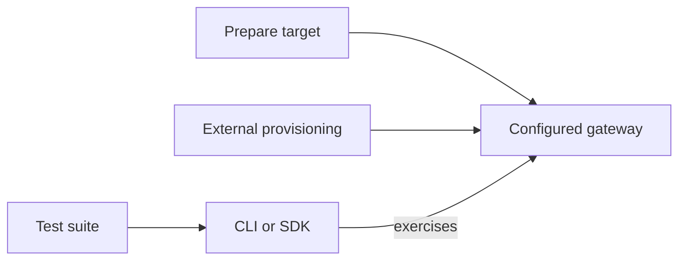

---
authors:
  - "@elezar"
state: draft
links:
  - https://github.com/NVIDIA/OpenShell/issues/3954
  - https://github.com/NVIDIA/OpenShell/pull/3460
---

# RFC 0016 - OpenShell testing strategy

## Summary

Establish a shared testing strategy for OpenShell so required public behavior
is verified consistently across drivers and deployment environments. Separate
conformance end-to-end tests from feature-specific and driver-specific coverage, and
separate target preparation from test execution.

Run end-to-end tests on request for PRs and during release qualification. Adopt the
strategy incrementally using the existing infrastructure.

## Motivation

Existing end-to-end binaries mix public behavior, runtime inspection, external
integrations, and performance measurements. This makes coverage difficult to
reuse across drivers and obscures whether a failure reflects the product or
its test infrastructure.

Clear test categories help contributors decide where tests belong and reviewers
understand what they verify.

## Non-goals

- Implement the framework or CI matrices in this PR.
- Classify every existing test; retain that work in migration issues.
- Introduce certification or a review board.
- Define a cross-version compatibility matrix.
- Define SDK-specific compatibility testing.
- Define benchmark execution policy or performance thresholds.

## Proposal

### 1. Organise tests by family

Test families describe the scope and purpose of a check. Use them to decide
where a test belongs and what a passing result establishes.

| Test Family | Description |
| --- | --- |
| Lint | Check formatting, style, and static rules. |
| Unit | Verify one component in isolation. Place tests inline in its Rust module or in an adjacent `test.rs` file under `src/`. |
| Integration | Verify interactions between components. Place Rust integration tests in the crate's top-level `tests/` directory. |
| End-to-end (e2e) | Verify a configured OpenShell target through a client interface. Place suites in `e2e/suites/`. |
| Benchmark | Measure performance or scale. Place crate benchmarks in crate-level `benchmarks/` directories and full-system benchmarks in a root `benchmarks/` directory. |

Within the e2e family, group tests by the behavior they verify. This separates
reusable public behavior checks from checks tied to particular integrations
or drivers.

| e2e type | What it verifies | Proposed folder |
| --- | --- | --- |
| Conformance | Required public behavior, including continuity across gateway restarts and upgrades. | `e2e/suites/conformance/` |
| Feature | Behavior requiring a named external service or special gateway configuration. | `e2e/suites/features/` |
| Driver | Behavior specific to a driver, its host integration, or its configuration. | `e2e/suites/drivers/` |

Conformance may include disruption tests. Add these under
`e2e/suites/disruption/` initially, with their harness developed separately.

### 2. Define conformance e2e requirements

Conformance is the e2e test type that verifies required public behavior against
a configured gateway. Each test must pass; a failure indicates a conformance
gap. These tests provide common expectations across supported targets.

Conformance tests can be grouped into broad behavioral areas. The following
section gives examples.

#### Conformance areas

These user stories illustrate each area from a user or administrator's
perspective. Tests requiring external services or special gateway configuration
belong in feature-specific suites.

| Area | User stories |
| --- | --- |
| Sandbox lifecycle and continuity | I can create, inspect, start, stop, and delete a sandbox. I can observe workload status and exit codes. My sandbox retains its expected state across stops and gateway restarts, including upgrades. Ephemeral sandboxes are removed when their workloads finish. |
| Sandbox I/O | I can execute commands with input and receive complete output and exit status. I can connect interactively and reconnect as supported. I can upload and download files safely. I can forward a port to a sandbox service. |
| Workspaces and resource management | I can create, inspect, and delete workspaces. My resources remain scoped to their workspace. I can label and filter resources. Deletion guards prevent accidental removal of resources still in use. |
| Policy management | I can validate, apply, inspect, and update policy. I can see which policy is effective and when an update takes effect. Invalid policy is rejected without weakening existing protection. |
| Sandbox enforcement | My workload can access permitted files, processes, and network destinations. Prohibited access is blocked. Updating policy changes enforcement as promised. |
| Providers | I can create, attach, update, detach, and delete providers. Authorized workloads receive usable credentials without exposing secrets. Credential changes and revocation take effect as promised. |
| Identity and authorization | I can authenticate and access resources I am authorized to use. Unauthorized requests are rejected. Access through another client interface does not bypass authorization. |
| Settings | I can read, change, and remove settings through public APIs. I can inspect effective values. Global overrides take precedence and prevent conflicting sandbox changes. |
| Middleware | My requests use the selected middleware in the configured order. Transformations and failure handling follow the configured behavior. |
| Interceptors | My gateway requests are transformed or rejected as configured. Interception preserves authorization boundaries. |

#### Test requirements

Each conformance test documents its expected behavior, preconditions, required
permissions, and significant side effects alongside its implementation. Use a
descriptive, stable test name that identifies the behavior being verified and
allows results to be tracked across runs.

Tests exercise a configured gateway through public client interfaces. Assertions
verify observable behavior and structured output. They must not depend on native
runtime details, incidental presentation, or diagnostic availability.

Tests exercise public APIs within their declared permissions. Keep end-user and
administrative interactions in separate tests. Tests may change resources and
settings through public APIs, but must not change deployment configuration.

Tests must clean up their changes. Behavioral checks must not depend on public
internet services.

Run tests across supported targets. Changes or removals must distinguish
corrections to tests from changes to promised behavior.

#### Failure handling

Investigate each failure and track the underlying product, test, or
infrastructure issue. Notify the responsible maintainers of new failures.
Do not automatically retry failed tests; intermittent failures may expose races
that affect larger installations.

Failures may be explicitly waived. Record each waiver's scope, rationale, and
tracking issue, and retain the failed result.

Retain test results, failure logs, revision, target configuration, and run
duration for investigation.

### 3. Separate target preparation from test execution

Prepare the target separately from test execution so the same suite can run
against locally provisioned or externally managed gateways.

Target preparation supplies deployment configuration, credentials, images, and
tools. Test runs accept the gateway endpoint and credentials. Host and runtime
access supports provisioning, diagnostics, and disruption mechanisms.

Tests must not depend on a particular provisioning tool. Conformance requirements
remain the same across supported target configurations.



### 4. Select and trigger test runs

Test execution depends on the purpose of the run:

| Context | Tests to run |
| --- | --- |
| Pull requests | Automatically run lint, unit, and component integration checks. Run e2e tests when requested. |
| Release qualification | Run those checks and all applicable e2e tests for dev and stable releases. |
| Additional schedules | Add scheduled runs where further coverage is needed. |

Allow conformance, feature-specific, and driver-specific tests to be requested
independently or together. Conformance includes disruption tests. Add separate
disruption, feature, or driver subcategory selection only when run durations
justify it.

Release qualification validates installation and uninstall behavior using
candidate artifacts. Upgrade qualification verifies continuity across gateway
replacement.

## Implementation plan

### Execution infrastructure

Nix pins build inputs and produces artifacts and test archives. Tmachine
composes a `Machine` and `Environment` for setup, an `Installer` for installation,
and a `Testsuite` for execution. Other provisioners may supply targets tmachine
cannot represent.

CI reuses provisioning definitions across selected target configurations.

### Layout and migration

Existing conformance tests use the CLI against a configured gateway. Planned
work will extend coverage to direct API usage.

Move suites to `e2e/suites/`; keep provisioning under `tests/`:

```text
tests/
├── config.nix
├── artifacts.nix
└── ansible/
e2e/
└── suites/
    ├── conformance/
    │   ├── cli/
    │   └── README.md              # Requirements, authoring, and execution
    ├── disruption/              # Added in a later phase
    ├── drivers/podman/
    └── features/provider-refresh/keycloak/
```

1. Classify and migrate existing tests by behavioral intent, preserving coverage
   and updating build and CI references together. Track migration work and
   conformance gaps in implementation issues.
2. Assess conformance tests against the requirements and document their
   contracts. Validate execution against externally prepared gateways and ensure
   behavioral checks do not depend on public internet services. Resolve fixture
   networking as part of this work.
3. Retain results and diagnostic evidence, notify maintainers of new failures,
   and support issue tracking and explicit waivers. Preserve failed results
   without automatic retries.
4. Implement independent and combined PR selection for the three e2e streams.
   Run applicable suites during dev and stable release qualification, including
   candidate installation and uninstall checks.
5. Update testing and CI documentation as each part is implemented. Record
   actual gates and remaining gaps.

### CI selection

PR labels select e2e streams: `test:e2e/conformance` runs conformance tests,
including disruption tests when added, `test:e2e/features` runs feature-specific
tests, and
`test:e2e/drivers` runs driver-specific tests. `test:e2e` selects all three
streams. Migrate existing GPU and Kubernetes labels according to test intent.

### Later phase: disruption tests

Add restart and upgrade continuity tests in a later phase. Design their harness
separately from the migration of existing suites. Include these tests in
conformance PR runs and release qualification. Consolidate shared contracts and
helpers when practical.

### Follow-up work

Package the conformance suite to run without a source checkout as a follow-up.

### Documentation

`TESTING.md` defines test families and links to suite READMEs.
`e2e/suites/conformance/README.md` owns conformance requirements, authoring, and
execution guidance. `CI.md` records merge and release gates as qualification
workflows are implemented. Agent guidance links to these sources.

## Risks

- Two Linux drivers can share accidental OS assumptions. Review probe portability
  and expand platform coverage; a pass applies only to the tested configuration.
- Shared-library and provisioning changes can conflict with parallel migrations.
  Sequence common infrastructure changes before dependent work.

## Alternatives

- **Independent driver e2e suites:** less migration now, but duplicated public
  checks and diverging expectations. Retain only genuinely driver-specific work.
- **Tests provision their own gateways:** convenient locally, but harder to reuse
  against installed artifacts or externally prepared targets.
- **Separate API and CLI frameworks immediately:** adds overlapping runners
  before shared execution needs are understood; retain SDK-specific coverage
  separately.

## Prior art

- [Kubernetes conformance testing](https://github.com/kubernetes/community/blob/main/contributors/devel/sig-architecture/conformance-tests.md)
  informs public-contract testing and per-test specifications. OpenShell uses
  normal PR review rather than its promotion process, soak period, or governance,
  and defers a cross-version compatibility matrix.
- OpenShell's reusable CLI scenarios and Cargo execution provide the starting
  implementation. Earlier sandbox-continuity work motivates separating portable
  recovery assertions from environment-specific disruption actuators.

## Open questions

None. Fixture networking and disruption harness design are deferred to
implementation.
