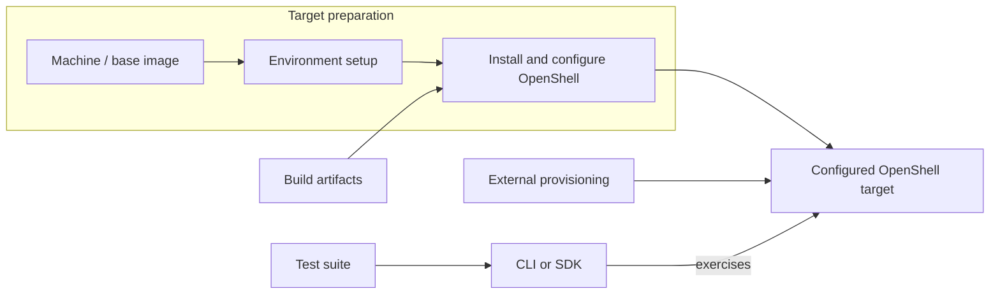

---
authors:
  - "@elezar"
state: draft
links:
  - https://github.com/NVIDIA/OpenShell/issues/3954
  - https://github.com/NVIDIA/OpenShell/pull/3460
---

# RFC 0016 - OpenShell testing strategy

## Summary

Define a common testing strategy for OpenShell that separates the behavioral
contract being tested from the environment, installation, client interface,
and CI policy used to validate it. Reuse tests of public behavior across
configured targets, while keeping implementation-specific checks and performance
measurements distinct. A passing test establishes the same contract regardless
of how its target was prepared.

Use Nix for reproducible build inputs and test artifacts, and tmachine for
integration and Linux installation environments it can represent. Keep test
contracts independent of those tools. Initially exercise general conformance
through the OpenShell CLI; using an SDK does not create a different test category.
This is a proposal for incremental implementation, not a description of gates
already enforced by CI.

## Motivation

How do we establish that OpenShell behaves as promised across supported
configurations without duplicating behavioral tests for every driver and
environment? Tests tied to particular environments make it difficult to
distinguish product requirements from implementation details, reuse coverage,
or determine what a passing suite establishes.

OpenShell tests have accumulated across crate-local tests, E2E binaries,
driver wrappers, installed-artifact suites, and CI workflows. A single binary
can mix public behavior, native runtime inspection, an external integration,
and performance measurements. Without a shared model, contributors must either
duplicate this coverage for new targets or carry assumptions that do not apply
to them. Reviewers cannot reliably distinguish missing product support from
missing test infrastructure.

The migration tracked by #3712 makes this concrete: the tmachine e2e-podman
suite supplies interim coverage, but the intended outcome is to move the source
tests into suites that own their behavioral intent and then remove the catch-all.
The strategy needs to support that migration without making its source inventory
the definition of OpenShell conformance.

## Non-goals

- Implement the proposed framework, capability API, or CI matrices in this PR.
- Finalize the destination of every existing E2E assertion; migration issues
  retain that analysis and their task lists.
- Establish a certification program, review board, or reporting service.
- Replace the SDK compatibility proposal in #3238 or standardize language SDK
  APIs through the CLI runner.

## Proposal

### 1. Define contracts and organise tests by purpose

A behavioral contract specifies the expected observable result of an operation
under stated conditions. A test case exercises that behavior; an assertion
checks an observation against an expectation. A suite groups related test cases.
For example, a contract may require that a deleted sandbox is absent from the
sandbox list; the assertion checks that its identifier is absent. Assertions
that verify test setup do not each define a separate product contract.

Group tests by the contracts they exercise, not by their current binary or
runner. Split binaries when they mix unrelated contracts or prerequisites.

| Family | Purpose |
| --- | --- |
| Unit and component integration | Internal logic, configuration selection, translation, and implementation mechanics; use the lowest effective layer. |
| General conformance | Public behavioral contracts that hold across drivers and environments, independent of implementation details. |
| Feature-specific | Public feature behavior requiring configured external integration, or currently implemented on only one driver; one representative driver suffices. |
| Driver-specific | Driver configuration, runtime and host integration, and implementation contracts; exercise applicable environments for that driver. |
| Disruption conformance | Portable continuity or recovery assertions using environment-specific disruption actuators; one working actuator suffices initially. |
| Load/scale | Throughput, latency, concurrency, saturation, and scaling measurements, reported separately from behavioral correctness. |

The placement of portable, capability-dependent tests in general conformance
or feature-specific suites remains open until a concrete migration example
requires that decision. Capability dependence alone does not determine a family.

The client interface is separate from the test family. A public contract tested
through an SDK can belong to general conformance just as it can through the CLI.
SDK-specific behavior, such as language-specific conversion and cancellation,
needs focused coverage; #3238 retains its SDK compatibility design scope.

Security portability is a workstream spanning these families. Define a separate
security family only if multiple tests need common specialized infrastructure.
For example, bypass prevention is an intended universal guarantee, but the
existing seccomp-oriented probe needs separate analysis before its portable
migration. Core-dump protection similarly needs a portable contract and probe.

### 2. Define general conformance through observable contracts

Conformance tests exercise a behavioral contract against an already configured
OpenShell gateway. The initial suite remains CLI-based until direct API access
is strictly required; this is an execution choice, not a classification rule.
Assertions should use observable outcomes and structured output;
incidental presentation text is not a conformance contract. Native runtime
inspection may provide best-effort failure diagnostics, but must not determine
whether general conformance passed.

Tests must not update gateway startup configuration, driver flags, deployment
manifests, or gateway.toml. They may create and mutate public API-managed state,
including sandboxes, policies, providers, workspaces, and settings. Use unique
resource names and cleanup. Avoid conflicting global-state mutations within one
run. Restoring a pre-existing global setting is recommended, not a hard
conformance requirement; the global effects still need to be clear to callers.

A short-lived service fully owned by a test or harness can be a conformance
fixture. An external service requiring gateway configuration is a feature-suite
prerequisite. Public capabilities must not become an inventory of third-party
services, credentials, or fixture configuration. Missing prerequisites for a
selected feature suite are setup errors.

Start with existing general-purpose workload images and a small common toolset.
The harness supplies an appropriate image for each target. Missing fixture
tooling is an infrastructure error. Defer a dedicated image until concrete
incompatibilities justify it. A default-image scenario deliberately omits the
image and checks that a usable sandbox results; precise configuration selection
and registry resolution belong in lower-level or integration coverage.

Two-driver validation is the minimum evidence for admitting general conformance,
not a limit on subsequent execution. Run it against every supported driver for
which infrastructure exists. Docker and Podman are acceptable initial targets.
Unavailable infrastructure is a coverage gap. A successful test against one
configuration does not establish success for all deployments of its driver.

Disruption conformance has a separate execution family. Portable assertions
describe continuity or recovery; actuators induce gateway restart, runtime loss,
or another disruption. An absent actuator prevents selection for that environment;
a broken configured actuator is an infrastructure error. One actuator is enough
to begin migrating a portable disruption contract.

Timing limits normally bound readiness, polling, and hangs. A performance
threshold belongs in load/scale unless the deadline is itself a specified public
contract.

### 3. Distinguish capabilities, scenario selection, and results

Use flat, namespaced boolean capability identifiers describing precise effective
product behavior. Namespaces can organize names without implying parent/child
support. Parameters and named profiles are deferred. A driver name, a fixture
prerequisite, and a selectable test-family prefix are not product capabilities.
In particular, the leaf selection introduced by #3768 is separate from API
capability reporting.

The gateway reports support for its running configuration. Obtain the snapshot
through machine-readable CLI output backed by the public API. Reporting is a
hard requirement: failure to discover capabilities aborts the conformance run.
Each scenario encodes its expected behavior and whether that behavior is
mandatory. A missing mandatory capability fails; a missing optional capability
is unsupported. An advertised capability must satisfy its contract, including
when support for that capability is optional.

Non-universal behavior supported by at least two drivers is a signal to extend
the public capability API. Prefer adding the capability and its concrete test
in the same PR. The eventual suite classification of optional portable contracts
is deferred, but their result semantics are not: absent optional support is
unsupported, and advertised behavior that violates its contract fails.

| Outcome | Meaning |
| --- | --- |
| Passed | The selected behavioral assertions held. |
| Failed | A mandatory capability is missing or the exercised contract was violated. |
| Unsupported | An optional capability was not advertised. |
| Skipped | A scenario was deliberately excluded from this invocation. |
| Error | Infrastructure, fixture, runner, or actuator failure prevented evaluation. |

Keep these distinctions as lightweight as practical. An advisory CI job can
report behavioral failures without blocking a merge; that job policy must not
turn those failures into passing scenario results. Mock-MXC execution, for
example, needs to identify the mock target and cannot qualify the production
driver. A focused or incomplete invocation must not imply complete coverage.

### 4. Keep execution reusable and select CI gates explicitly

A test run exercises selected test cases against a configured target and records
their results. Target preparation supplies the environment, installs artifacts,
and configures the gateway. Behavioral tests consume that target through a
client interface. CI policy selects runs and decides which results gate a merge
or release; it does not redefine the tested contracts.



In the current tmachine configuration, a `Machine` identifies a base image.
An `Environment` references a machine and supplies setup playbooks. A separate
`Installer` supplies installation playbooks and artifact inputs, and a
`Testsuite` supplies test playbooks and inputs. Selecting an environment,
installer, and suite composes a run without making test ownership depend on
target preparation.

Runs vary along several dimensions; not every combination is meaningful:

| Dimension | Examples |
| --- | --- |
| Platform | Host and workload OS and architecture |
| Driver | Docker, Podman, Kubernetes, VM, MXC |
| Environment | Local runtime, Kubernetes cluster, rootful/rootless Podman |
| Configuration | Gateway settings, in-process/external driver wiring |
| Installation | Candidate binaries/images, RPM, DEB, Snap, Helm, Homebrew |
| Client interface | CLI, language SDK |
| Suite | General conformance, feature-specific, driver-specific, disruption |

For example, rootful and rootless Podman change the environment, not the driver
or expected contract. They do not supply two-driver admission evidence. Select
combinations for meaningful coverage rather than requiring a full cross-product.

Nix pins source-check dependencies and builds candidate artifacts and test
archives. Tmachine provisions supported environments, applies installation and
configuration, and runs a selected suite. Tests should consume an already
configured target; general conformance must not require tmachine to have created
it. Native Windows/macOS, GPU, or other environments tmachine cannot represent
may use a suitable external provisioner with the same behavioral contracts.

Keep environment definitions in tests/config.nix, artifact construction in
tests/artifacts.nix, and provisioning/installation in tests/ansible. Workflow
matrices select declared environment/suite combinations rather than duplicating
their setup logic. Existing mise commands remain usable migration entry points
until replacements provide equivalent coverage.

After #3866 removes the standalone conformance executable, consolidate
crates/openshell-conformance under tests/suites/conformance. Preserve a shared
library for scenarios and execution helpers alongside the Cargo test entry
points that exercise the openshell CLI. Update workspace membership, lockfiles,
archive inputs, and CI references together. Extract utilities shared by feature
or disruption suites only when actual consumers require them.

Source checks cover formatting, lint, unit tests, feature/platform compilation,
and existing dependency/security checks. The earlier target-state proposal used
Linux x86_64, Linux ARM64, and macOS ARM64 as the initial source matrix. SDK-local
changes run the relevant SDK checks; protobuf changes run all affected SDK
checks. Packaging selection includes transitive inputs and uses broader coverage
when impact cannot be determined safely.

General conformance should run across available drivers, with expensive or
platform-constrained environments using appropriate dedicated or scheduled
workflows. Feature suites run where prerequisites exist; driver suites exercise
applicable environments; disruption suites require actuators. The exact required
merge checks, schedules, and release gates remain review decisions. The earlier
five-environment matrix is an initial candidate, not a permanent ceiling.

Release validation installs exact candidate artifacts and then runs applicable
suites before publication. Representative RPM/Fedora, DEB/Ubuntu, Snap/Ubuntu,
and Helm/Kubernetes paths can reuse conformance. Native Homebrew qualification
uses its appropriate platform. Passing behavior after installation does not by
itself prove package ownership, service setup, upgrade, or uninstall contracts;
installation-specific assertions must cover those separately. Upgrade and
version-skew obligations remain explicit follow-up decisions.

Start report attribution with the OpenShell Git SHA and the tmachine
configuration used for a run. Preserve enough configuration identity to recover
the effective configuration. Other provisioners supply equivalent target
identification. This is a placeholder, not a complete report schema; richer
capability, scenario, and artifact reporting can follow a concrete need.

## Implementation plan

### Build on the existing suite layout

Retain the existing suite locations and extend them as contracts are migrated:

```text
tests/
├── config.nix                            # Existing tmachine definitions
├── artifacts.nix                         # Existing artifact construction
├── ansible/                              # Existing provisioning and execution
├── CONFORMANCE.md                        # Proposed agreed conformance policy
└── suites/
    ├── conformance/
    │   ├── cli/                          # Existing CLI test entry points
    │   └── README.md                     # Proposed suite contributor guidance
    ├── drivers/
    │   └── podman/                       # Existing driver-specific tests
    └── features/
        └── provider-refresh/
            └── keycloak/                 # Existing external-integration tests
```

Move the shared `crates/openshell-conformance` library under
`tests/suites/conformance` alongside its existing CLI entry points; choose its
precise internal layout in that relocation. Extend `drivers/` and `features/`
with focused suites rather than new catch-all binaries. Unit and component
integration tests remain alongside their components, and SDK-native tests may
remain in their SDK trees. Folder placement does not define the behavioral
contract. Disruption and load/scale locations remain open pending their concrete
infrastructure needs.

### Publish the agreed model

Documentation records the testing model and its implementation; reorganising
documentation is not a substitute for implementing reusable suites and target
preparation. Publish agreed policy as implementation lands:

| Document | Responsibility |
| --- | --- |
| This RFC and its PR | Strategy discussion, rationale, alternatives, unresolved decisions |
| TESTING.md | Contributor entry point, concise routing rules, currently working local commands |
| Proposed tests/CONFORMANCE.md | Conformance contracts, admission, capabilities, result semantics, and agreed policy |
| tests/suites/conformance/README.md | Authoring and running the suite, fixtures, library extension points, selection, cleanup |
| Other suite READMEs | Their fixtures, prerequisites, commands, and specialized contracts |
| CI.md | Implemented workflow triggers, matrices, gates, and artifact investigation |
| AGENTS.md and contributor skills | Short routing instructions linking to canonical guidance |
| #3954 and focused issues | Strategy follow-ups, migration tasks, dependencies, and completion tracking |

The suite README owns the relocated library's contributor guidance. A separate
crate README need not duplicate it. SDK specifications remain owned by the SDK
proposal while sharing terminology and provisioning boundaries. Accepted policy
is published in the living guides as implementation lands; current references
must not describe proposed gates as already enforced.

### Adopt incrementally

1. Discuss this RFC through existing PR #3460 and track follow-ups in #3954.
   Resolve policy questions independently from per-test migration details.
2. Reconcile #3768, #3864, and #3866 for leaf selection, obsolete parity removal,
   and Cargo execution. Relocate the shared library in a focused follow-up,
   coordinating the same files with Windows work in #3769.
3. Add effective capability reporting and stable CLI discovery. Migrations can
   be developed in parallel, but qualification under this proposal requires the
   mandatory reporting contract. Add further capability/test pairs together.
4. Rescope #3945 around the documentation ownership above. Align SDK RFC #3238
   with the shared strategy. Assess #2182 and #2873 for supersession and preserve
   unique assertions; this RFC does not automatically close those PRs.
5. Migrate coherent behavioral intent in parallel by destination family. One PR
   can add destination coverage and remove covered source tests. Delete empty
   binaries and rename or split residual binaries. Require two-driver evidence
   for general conformance, one representative driver for feature tests, and
   one working actuator for disruption. Keep implementation tests at the lowest
   effective layer.
6. Use #3712 for the Podman migration inventory, including security portability
   investigations and load/scale routing. Retire the e2e-podman feature, follow-up
   exclusion list, and temporary tmachine suite when all source intent is covered
   or explicitly retired. Do not introduce inventory-check machinery unless
   continued source churn demonstrates a need.
7. Expand destination-suite CI and candidate-installation validation, documenting
   actual gates and coverage gaps as they become operational. Preserve existing
   coverage until its intent has a validated destination; no mandatory overlap
   period is needed solely for migration.

## Risks

- Optional capability reporting can hide regressions if an implementation simply
  stops advertising support. Mandatory contracts remain test-owned; policy for
  reviewing optional-support removal needs an explicit decision.
- Two Linux container drivers can pass a scenario containing OS assumptions.
  Admission evidence is a starting point; broader platform validation and probe
  review remain necessary.
- Global API state mutation can affect other workloads or test processes.
  Document side effects, coordinate conflicts within a run, and recommend
  restoration. Cross-process coordination is not designed here.
- Nix, provisioning, and test-archive changes create migration cost and merge
  conflicts. Keep scenario contracts independent of provisioners and sequence
  shared library changes before many concurrent migrations.
- Declaring a contract mandatory can turn an existing product limitation into a
  visible failure. Decide the product contract explicitly rather than weakening
  a test or treating setup failure as unsupported.

## Alternatives

### Maintain independent driver-specific E2E suites

Each driver could retain a complete E2E suite tailored to its runtime. This
minimises initial migration, but duplicates public behavioral checks and allows
expectations to diverge. Reuse portable contracts across targets and reserve
driver-specific coverage for implementation and integration requirements.

### Couple behavioral tests to target provisioning

Each suite could provision and configure its own gateway. This simplifies local
setup for that suite, but makes it harder to validate installed artifacts or an
externally prepared gateway with the same tests. Separate target preparation
from behavioral testing while allowing a harness to orchestrate both.

### Introduce separate API and CLI conformance frameworks immediately

The older #2182 and #2873 proposals offer direct API coverage, but add another
runner and overlapping scenarios before a CLI limitation requires them. Keep
general conformance CLI-based initially; SDK interface testing remains a
separate justified consumer under #3238.

### Require every tested behavior on every configuration

This gives a uniform baseline but excludes useful portable behavior that some
drivers do not implement. Mandatory scenarios plus precise optional capabilities
allow useful coverage while requiring advertised behavior to pass. Whether
optional portable contracts belong in general conformance or feature-specific
suites is deferred; this alternative concerns support requirements, not naming.

## Prior art

- [Kubernetes conformance testing](https://github.com/kubernetes/community/blob/main/contributors/devel/sig-architecture/conformance-tests.md)
  separates stable behavioral requirements from execution infrastructure and
  defines promotion, reliability, version compatibility, and normative test
  descriptions. Those are useful policy questions for OpenShell; its mandatory
  GA baseline and governance process are not adopted wholesale here.
- #2925, #3768, and #3866 establish reusable OpenShell CLI scenarios, independent
  selection, and installed Cargo execution. They provide implementation pieces
  without independently defining the entire strategy.
- #3107 introduced sandbox-continuity testing and #3342 reverted that
  infrastructure. Separating portable assertions from disruption actuators
  remains useful without committing to the former implementation.
- SDK RFC #3238 treats SDK-native behavior as its own compatibility surface.
  Shared gateway provisioning does not require identical language runners.

## Open questions

- Should portable, capability-dependent tests belong in general conformance or
  feature-specific suites? Resolve this using the first concrete migration
  example that requires the distinction, without adding a category in advance.
- What constitutes a complete conformance claim, and how are suite versions
  matched to gateway/CLI releases? Which version-skew guarantees are required?
- What maturity and reliability evidence is required beyond two-driver success?
  How are promotion, material changes, and demotion reviewed without imposing
  an unnecessary new governance process?
- What minimal normative description and stable identity must each scenario
  carry, and how is removal of previously advertised support reviewed?
- Should general conformance explicitly require offline execution after artifact
  provisioning, and what host privileges and fixture reachability assumptions
  are allowed for externally provisioned gateways?
- Which source and integration jobs are required for merges and release
  promotion? How should Windows, GPU, disruption, and load/scale runs be scheduled?
- Where should disruption and load/scale suites live, and what is the smallest
  actuator interface needed by the first migration?
- Which fields beyond SHA and configuration become necessary when the first
  report consumer needs completeness or cross-version comparisons?
