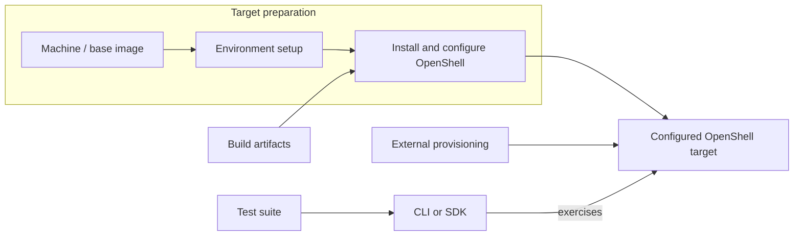

---
authors:
  - "@elezar"
state: draft
links:
  - https://github.com/NVIDIA/OpenShell/issues/3954
  - https://github.com/NVIDIA/OpenShell/pull/3460
---

# RFC 0016 - OpenShell testing strategy

## Summary

Organise tests by the behavior they verify, independently of how OpenShell is
deployed. Reuse public-contract tests across drivers and environments, keep
implementation-specific coverage separate, and make each test's contract and
each run's coverage explicit.

This proposal defines test categories, conformance rules, and an execution model
that builds on Nix and tmachine without requiring tests to depend on them.
Adopt it incrementally; it does not describe CI gates already in place.

## Motivation

Existing E2E binaries mix public behavior, runtime inspection, external
integrations, and performance measurements. This makes coverage difficult to
reuse across drivers and obscures whether a failure reflects the product or
its test infrastructure.

A shared model lets contributors place tests by purpose and reviewers understand
what passing establishes. The Podman migration in #3712 is an initial consumer,
not the definition of OpenShell conformance.

## Non-goals

- Implement the framework, capability API, or CI matrices in this PR.
- Classify every existing test; retain that work in migration issues.
- Introduce certification, a review board, or version-skew testing.
- Replace the SDK compatibility design in #3238.

## Proposal

### 1. Organise tests by contract

A behavioral contract specifies an operation's expected observable result under
stated conditions. A test case exercises it, an assertion checks an observation,
and a suite groups related cases. For example, deleting a sandbox must remove
it from the sandbox list; an assertion checks that its identifier is absent.

| Family | Purpose |
| --- | --- |
| Unit and component integration | Internal logic and implementation mechanics, at the lowest effective layer. |
| General conformance | Public behavioral contracts across drivers and environments. |
| Feature-specific | Features requiring configured external integration or currently implemented on only one driver. |
| Driver-specific | Driver configuration, runtime and host integration, and implementation contracts. |
| Disruption conformance | Portable continuity or recovery behavior under deliberately induced disruption. |
| Load/scale | Performance and scaling measurements, separate from behavioral correctness. |

The client interface is not a test category: CLI and SDK tests can exercise the
same public contract. SDK-specific semantics retain focused coverage. Security
tests span these families; introduce a separate family only if tests need shared
specialized infrastructure. Performance thresholds belong in load/scale unless
the deadline is itself a public contract.

### 2. Define conformance through public behavior

Each test owns its contract: keep its stable identity, preconditions, expected
behavior, mandatory/optional status, and significant side effects alongside the
test. Do not maintain a duplicate specification elsewhere.

General conformance uses an already configured gateway, initially through the
CLI until direct API access is necessary. Assert observable behavior and
structured output, not incidental presentation or native runtime details.
Pass/fail requires only public CLI/API access and sandbox operations.
Administrative access belongs to provisioning, diagnostics, or disruption
actuators; unavailable diagnostics must not affect results.

Tests must not change gateway startup configuration. They may mutate public
API-managed state, using unique names and cleanup and avoiding conflicting
global-setting changes within a run. Document global effects; restoring prior
global settings is recommended, not mandatory.

Test-owned short-lived services are allowed. External services requiring gateway
configuration belong in feature-specific suites. Behavioral assertions must not
depend on public internet services; provisioning may download dependencies and
images. Use existing workload images and a small common toolset, supplied by the
harness. Missing prerequisites are setup errors. Dedicated fixture images and
enforced offline validation are follow-ups, not migration gates.

General-conformance admission requires evidence from at least two drivers;
Docker and Podman suffice initially. Then run against every supported driver
with available infrastructure, recording gaps. Feature tests need one
representative driver. Disruption tests need one working actuator initially;
an absent actuator prevents selection, while a broken configured actuator is
an infrastructure error.

Use normal PR review, without a soak period or separate promotion PR. Resolve
known flakiness rather than hiding it with retries. Changes or removals must
distinguish test corrections from changes to promised behavior, including
withdrawal of advertised support.

### 3. Make applicability and coverage explicit

The gateway must report effective capabilities for its running configuration
through the public API and machine-readable CLI output. Discovery failure aborts
conformance. Start with flat, namespaced booleans; defer hierarchy, parameters,
and profiles. Capabilities describe product behavior, not test selectors,
credentials, or external-service prerequisites.

Portable, non-universal behavior is a reason to extend capability reporting;
prefer adding the capability and its test together. Whether those tests belong
in general conformance or feature-specific suites remains open until a concrete
migration example requires a decision.

| Result | Meaning |
| --- | --- |
| Passed | The behavioral assertions held. |
| Failed | Mandatory support is absent or an exercised contract was violated. |
| Unsupported | Optional support was not advertised. |
| Skipped | The test was deliberately excluded. |
| Error | Infrastructure or fixture failure prevented evaluation. |

Advertised behavior must pass even when support is optional. A complete run
accounts for the entire identified suite without filtering; evaluated optional
unsupported cases count as accounted for. Filtered or interrupted runs are
partial. Completeness is not success: failures and errors cannot yield a complete
pass. Advisory CI policy must not relabel failed tests as passing.

Initially, suite, CLI, and gateway use the same OpenShell revision; no
cross-version claim is made. Start reports with that SHA and the tmachine
configuration, or equivalent target identity. Record mock targets as mocks,
not evidence for production drivers.

### 4. Separate target preparation from test execution

A run combines a configured target with a selected suite. Platform, driver,
environment, gateway configuration, installation method, and client interface
may vary without changing the contract. Rootful and rootless Podman are two
environments of one driver, not two-driver evidence.



Nix pins build inputs and produces artifacts and test archives. Tmachine
composes a `Machine` and `Environment` for setup, an `Installer` for installation,
and a `Testsuite` for execution. Other provisioners may supply targets tmachine
cannot represent. General conformance must also run against externally prepared
gateways.

CI selects meaningful combinations, not a full cross-product, and reuses setup
definitions rather than duplicating them. Keep source checks and affected SDK
checks; protobuf changes require all affected SDK checks. Packaging selection
must include transitive inputs and broaden when impact is uncertain.
Release validation installs exact candidate artifacts before running applicable
suites. Installation, upgrade, and uninstall behavior need separate assertions;
successful conformance alone does not validate packaging.

## Implementation plan

Build on the existing layout; only the marked documents are proposed additions:

```text
tests/
├── config.nix                     # tmachine definitions
├── artifacts.nix                  # Artifact construction
├── ansible/                       # Provisioning and execution
├── CONFORMANCE.md                 # Proposed: agreed policy
└── suites/
    ├── conformance/
    │   ├── cli/                   # CLI test entry points
    │   └── README.md              # Proposed: contributor guidance
    ├── drivers/podman/
    └── features/provider-refresh/keycloak/
```

1. Consolidate the conformance library under `tests/suites/conformance` alongside
   Cargo test entry points after standalone CLI removal. Update build and CI
   references together. Keep component tests and SDK-native tests in their
   existing trees; extract shared helpers only when consumers need them.
2. Add effective capability discovery and the result semantics above.
   Migrations may proceed in parallel, but conformance qualification requires
   reporting. Keep test contracts alongside their implementations.
3. Migrate by behavioral intent, in parallel by destination family. One PR may
   add coverage and remove covered source tests; delete empty binaries and
   split or rename residual ones. Preserve coverage until validated replacement
   or explicit retirement, without a mandatory overlap period.
4. Track dependencies in #3954 and the Podman inventory in #3712. Retire the
   temporary e2e-podman feature, exclusion list, and tmachine suite when its
   source intent is covered or explicitly retired. Add no inventory machinery
   unless source churn warrants it.
5. Expand CI and candidate-installation validation, then demonstrate offline
   runs once provisioning supplies their dependencies. Document actual gates
   and remaining gaps, not proposed gates as if already enforced.

As implementation lands, `TESTING.md` owns routing and working commands,
`tests/CONFORMANCE.md` owns shared policy, suite READMEs own authoring and
execution guidance, and `CI.md` owns implemented CI behavior. Agent guidance
links to these sources. Per-test contracts stay in tests; detailed migration
inventories and PR coordination belong in tracking issues.

## Risks

- Two Linux drivers can share accidental OS assumptions. Review probe portability
  and expand platform coverage; a pass applies only to the tested configuration.
- Capability withdrawal can hide regressions. Review it as a contract change,
  and do not weaken mandatory requirements to accommodate product limitations.
- Global-state changes can affect other workloads. Disclose side effects and
  coordinate within a run; cross-process coordination remains undesigned.
- Shared-library and provisioning changes can conflict with parallel migrations.
  Sequence common infrastructure changes before dependent work.

## Alternatives

- **Independent driver E2E suites:** less migration now, but duplicated public
  checks and diverging expectations. Retain only genuinely driver-specific work.
- **Tests provision their own gateways:** convenient locally, but harder to reuse
  against installed artifacts or externally prepared targets.
- **Separate API and CLI frameworks immediately:** adds overlapping runners
  before a CLI limitation requires them; retain SDK-specific coverage separately.
- **Require every behavior everywhere:** uniform, but excludes useful optional
  behavior. Require advertised support to work without yet deciding its category.

## Prior art

- [Kubernetes conformance testing](https://github.com/kubernetes/community/blob/main/contributors/devel/sig-architecture/conformance-tests.md)
  informs public-contract testing and per-test specifications. OpenShell uses
  normal PR review rather than its promotion process, soak period, or governance,
  and defers version-skew testing.
- OpenShell's reusable CLI scenarios and Cargo execution provide the starting
  implementation. Earlier sandbox-continuity work motivates separating portable
  recovery assertions from environment-specific disruption actuators.
- SDK proposal #3238 retains interface-specific compatibility concerns without
  making the client interface a separate behavioral test family.

## Open questions

- Where do portable capability-dependent tests belong? Decide from a concrete
  migration example, without adding a category in advance.
- How should test-owned fixtures be reachable from externally prepared gateways?
- Which jobs gate merges and releases, and which expensive/platform-specific runs
  are scheduled? What upgrade coverage is required?
- Where should disruption and load/scale suites live, and what actuator interface
  does the first disruption migration need?
- What report fields beyond SHA and configuration do actual consumers require?
