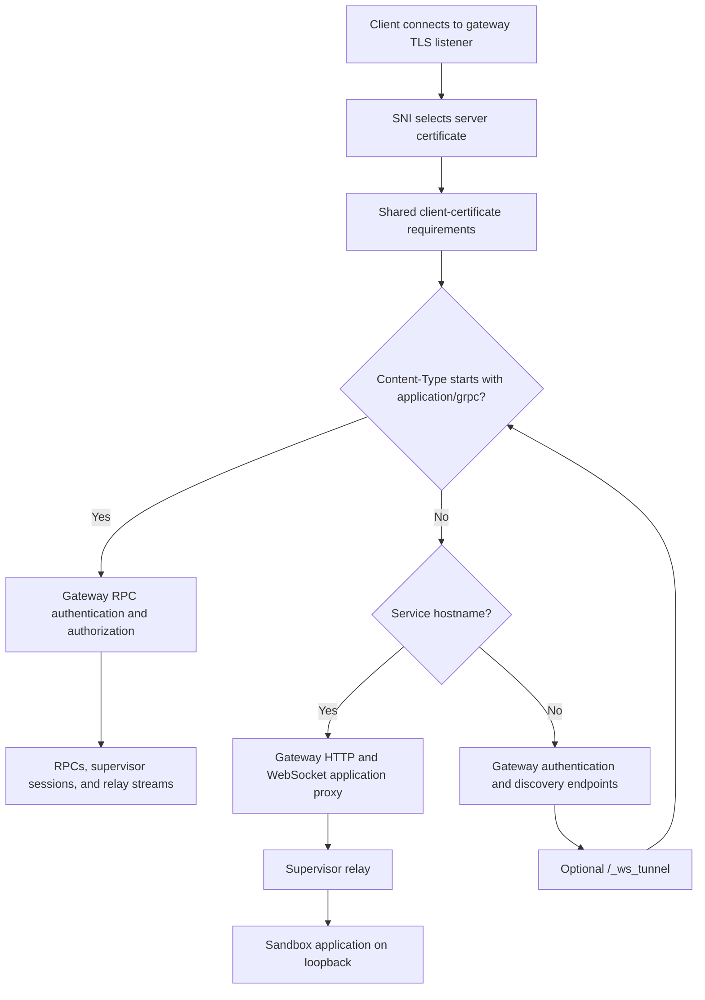
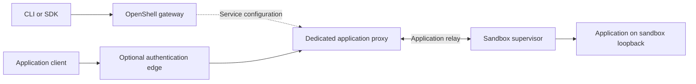
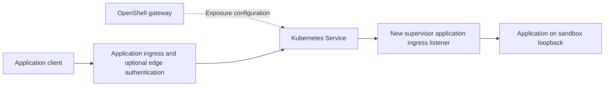

---
authors:
  - "@drew"
state: review
links:
  - https://github.com/NVIDIA/OpenShell/issues/4266
  - https://github.com/NVIDIA/OpenShell/issues/994
  - https://github.com/NVIDIA/OpenShell/issues/1791
  - https://github.com/NVIDIA/OpenShell/issues/4210
  - https://github.com/NVIDIA/OpenShell/pull/4213
  - https://github.com/NVIDIA/OpenShell/issues/1794
  - https://github.com/NVIDIA/OpenShell/issues/3402
  - https://github.com/NVIDIA/OpenShell/issues/4229
  - https://github.com/NVIDIA/OpenShell/issues/2469
  - https://github.com/NVIDIA/OpenShell/issues/3715
---

# RFC 0017 - Sandbox service exposure

## Summary

Define sandbox service exposure as an application data plane with independent scaling and access requirements. In this RFC, the data plane carries HTTP and WebSocket traffic to applications running inside sandboxes. Port forwarding and file uploads remain part of the gateway/control plane.

Keep hostname-routed application traffic on the gateway for simple, low-volume deployments. Compare three options for deployments that need more separation: a dedicated application proxy, separate control-plane and application listeners in the gateway, and Kubernetes Services targeting supervisor application listeners. The proposal establishes requirements and boundaries; which independent data path to implement first remains an open decision. Separate listeners address access restrictions but do not provide independent scaling.

## Motivation

OpenShell users run web previews, API servers, webhook receivers, and other HTTP or WebSocket applications inside sandboxes. Those applications need a reachable service endpoint without making every application client a privileged OpenShell control-plane caller. Some applications own authentication; others rely on an operator's edge authentication infrastructure.

Today, the gateway handles both management requests and application payloads. Adding an external frontend does not remove that coupling because application traffic still traverses the gateway process and its supervisor relays. Higher application load can therefore consume resources needed for responsive management operations. A shared listener also couples TLS client-authentication requirements and limits the network boundaries operators can enforce.

The original ingress discussion in [#994](https://github.com/NVIDIA/OpenShell/issues/994) established the need for portable service declarations and raised delegated data paths. [#1791](https://github.com/NVIDIA/OpenShell/issues/1791) requested Kubernetes-native service discovery and exposure. [#4210](https://github.com/NVIDIA/OpenShell/issues/4210) and [PR #4213](https://github.com/NVIDIA/OpenShell/pull/4213) address separate gateway listeners. An RFC is needed to distinguish these outcomes and agree on the architecture across gateway, supervisor, compute drivers, and deployment infrastructure.

## Non-goals

- Move port forwarding, file uploads, gateway RPCs, or gateway tunnels out of the control plane.
- Scale or replicate the sandbox application itself.
- Add arbitrary public TCP/UDP exposure or a general service mesh.
- Require a separate application proxy for every deployment or remove the existing gateway-routed path.
- Make native control-plane OIDC or workspace authorization automatically apply to application requests.
- Specify final CLI flags, gateway TOML fields, relay protocols, or Kubernetes resource schemas before selecting an architecture.

## Proposal

### Requirements and user workflow

Service exposure has four requirements:

1. **Independent scaling.** Scale application traffic handling independently of the control plane, keeping application bytes out of the gateway process when that mode is selected.
2. **Independent access restrictions.** Apply separate network rules to control-plane and application traffic.
3. **Application-owned authentication.** Serve applications without requiring OpenShell request authentication so applications can authenticate their own clients.
4. **Platform-managed authentication.** Allow application routes to use the same edge authentication infrastructure as the control plane, such as Cloudflare tunnels or zero-trust proxies, with separately configured application policies.

Preserve the service declaration workflow:

```shell
openshell service expose my-sandbox 8080 web
```

OpenShell returns a service URL shaped like:

```text
https://default--my-sandbox--web.<gateway-base-domain>/
```

The gateway remains responsible for service configuration and authorized management operations. Deployment choices determine where application bytes flow. Existing named services and create-time exposures must retain their identities and authentication behavior; a deployment change may require DNS, certificate, or advertised endpoint updates. The exact configuration and migration contract remain open.

### Current routing and authentication boundaries

The shared TLS listener uses SNI to select the external or internal server certificate and applies shared client-certificate requirements. Once TLS is established, the multiplexer checks the request's Content-Type before HTTP hostname routing:



SNI certificate selection does not authorize an application route. HTTP hostname routing occurs after the gRPC/HTTP dispatch decision. This description covers the shared external listener; the existing loopback-only plaintext service router does not provide an independently scalable deployment.

Application routes bypass control-plane RPC authentication. They support application-owned authentication, including an explicit bearer-token passthrough mode; the default strips Authorization. Passing through an application bearer token does not establish that OpenShell validated it, and gateway identity headers must not become application credentials. Application requests on the shared listener still inherit its TLS client-certificate requirements.

An upstream edge proxy can protect applications through the same authentication infrastructure used for the control plane. That protection is an edge policy: application routes do not automatically inherit OpenShell's native OIDC or workspace authorization. A protected deployment must prevent clients from bypassing the edge and reaching an unprotected backend.

These boundaries are reflected in the current [multiplexer](../../crates/openshell-server/src/multiplex.rs), [HTTP routers](../../crates/openshell-server/src/http.rs), [TLS configuration](../../crates/openshell-server/src/tls.rs), and [service routing](../../crates/openshell-server/src/service_routing.rs). PR #4213 is a proposed listener split, not part of this baseline.

### Option 1: Dedicated application proxy

Deploy an application proxy independently of the gateway. It could reuse the gateway's existing HTTP/WebSocket proxy and relay components or evaluate a proxy such as Envoy with reverse tunnels. The gateway manages service exposure configuration; the application proxy carries service traffic and the supervisor connections needed for that traffic. Control-plane supervisor communication remains a separate concern.



This option can satisfy independent scaling and access restrictions only if both application proxying and application relay transport leave the gateway. A frontend that forwards payloads back through gateway-owned relays does not achieve that separation. Proxy replicas need authenticated service configuration, a way to find the supervisor serving a sandbox, and bounded handling of unavailable or stale routes. The configuration distribution and connection ownership protocols require further design.

A dedicated proxy provides a potentially portable approach across compute drivers, but introduces another deployed component, routing-state coordination, certificate management, connection draining, and observability responsibilities. Existing relay components are building blocks, not evidence that they can be extracted without changes.

### Option 2: Separate control-plane and application listeners

[PR #4213](https://github.com/NVIDIA/OpenShell/pull/4213), tracked by [#4210](https://github.com/NVIDIA/OpenShell/issues/4210), adds a dedicated application ingress port while retaining the primary gateway listener. Application ingress serves HTTP and WebSockets without gateway RPC, authentication, or gateway-tunnel handlers. Operators can independently restrict the listener ports and use different TLS client-authentication requirements. Shared-port routing remains the default when the split is not configured.

Both listeners still run in the same gateway process, share deployment resources, and carry application traffic through gateway-owned relays. This option addresses independent exposure and access restrictions. It does not satisfy independent scaling, although it may be useful on its own or as an incremental deployment improvement.

Gateway API can also describe separate named listeners for `gateway.example.com` and `*.gateway.example.com`. Listener names and hostname routing alone do not enforce different access policies. Controller-specific listener or route policies may provide CIDR restrictions. Standard Kubernetes NetworkPolicy requires appropriate pod and port targets; two hostnames on the same proxy pod and port do not create that boundary. Independently deployed proxies or separate backend listener ports can provide distinct policy targets. See the [Kubernetes NetworkPolicy model](https://kubernetes.io/docs/concepts/services-networking/network-policies/).

### Option 3: Kubernetes Services targeting sandbox supervisors

When a user exposes an application, reconcile a Kubernetes Service for that endpoint and route application ingress to it. The Service selects the sandbox's supervisor pod using sandbox identity and role labels and targets a new application ingress listener on that pod. The supervisor forwards the request to the application's loopback port inside the sandbox.



A Service cannot directly reach an application listening on sandbox `127.0.0.1`; adding the supervisor listener is necessary. Kubernetes updates a selector-based Service's backend endpoints as matching pods become ready or are replaced. Reconciliation must preserve the correct sandbox identity, prevent selection of unrelated pods, and remove obsolete exposure resources. Pod readiness does not by itself establish application readiness.

This option keeps application bytes out of the gateway and uses standard Kubernetes backends for external proxies. Application ingress and the control plane can have separate network and authentication policies. Access to the supervisor listener must be limited to the intended application ingress and declared service targets; it must not expose supervisor management operations or arbitrary sandbox ports.

The approach is Kubernetes-specific and adds Service, route, and NetworkPolicy lifecycle work. Application traffic still shares resources with its sandbox's supervisor, and it does not scale the application itself. Other drivers retain the gateway-routed path unless a portable independent path is also implemented.

### Comparison and shared invariants

| Approach | Independent application traffic scaling | Independent access restrictions | Authentication choices | Main tradeoff |
|----------|----------------------------------------|---------------------------------|------------------------|---------------|
| Existing shared gateway listener | No | Limited to edge policies on a shared backend listener | Application or edge authentication, subject to shared TLS requirements | Simplest deployment |
| Dedicated application proxy | Yes, if application relays also leave the gateway | Separate deployments and policy targets | Application or edge authentication | New proxy and routing-state lifecycle |
| Separate gateway listeners | No | Separate ports and TLS client-authentication requirements | Application or edge authentication | Application load still competes with gateway operations |
| Kubernetes Service to supervisor | Yes for application ingress; supervisor resources remain shared per sandbox | Separate ingress deployment and supervisor listener policies | Application or edge authentication | Kubernetes-only path and new supervisor listener |

Every option retains gateway-owned service declarations and authorized exposure management. An application request must resolve to an existing, permitted service target. An application-only ingress boundary must not become a path to gateway RPCs, authentication handlers, gateway tunnels, or supervisor management. These properties need explicit tests in any selected implementation.

Removing a service, replacing a sandbox, losing a supervisor connection, or receiving stale routing configuration must not redirect traffic to another sandbox or expose undeclared ports. The exact revocation timing, handling of existing WebSockets, and failure behavior during control-plane outages remain open questions. Data-plane deployments need bounded connections and buffering so a slow or abusive application client cannot exhaust management capacity through shared supervisor resources.

## Implementation plan

This RFC is a design deliverable. Implementation proceeds through separate issues after reviewers choose a direction; the originating issue tracks delivery of the RFC rather than rollout of the capability.

1. **Select the data path.** Agree whether to pursue a portable dedicated proxy, Kubernetes-native exposure, or both. Record whether the listener split is an independent improvement or a migration step. Resolve trust, routing-state ownership, and lifecycle questions before defining new interfaces.
2. **Define the contract.** Specify service configuration distribution, supervisor target validation, route revocation, TLS and edge trust, observability, and driver support. Preserve existing service declarations and create-time exposures. Any public protobuf changes follow [proto/README.md](../../proto/README.md).
3. **Implement an opt-in path.** Keep gateway routing available. For option 1, move application relay ownership with proxying; for option 3, add the supervisor listener and reconcile Kubernetes resources and network access. Coordinate option 2 with #4210 / #4213 rather than duplicating that work.
4. **Validate behavior and isolation.** Exercise HTTP requests, WebSocket upgrades and draining, application bearer passthrough, and edge authentication. Verify application ingress cannot reach control-plane handlers, forged or stale routes cannot select another sandbox, and service deletion and sandbox replacement revoke the right targets. Test proxy/supervisor restarts and the supported control-plane outage behavior in the relevant sandbox E2E lane.
5. **Demonstrate scaling and migration.** Load application ingress while measuring control-plane latency and resource use; agree on workload and acceptance thresholds before implementation. Verify independent replica changes, bounded supervisor load, and routing recovery. Validate shared-mode compatibility, endpoint advertisement, DNS/certificate changes, and rollback.
6. **Document and release.** Document supported deployment modes, authentication responsibility, network restrictions, operational diagnostics, and migration. Update affected configuration and runtime docs and relevant skills with implementation, including the cluster-debugging skill for deployment changes. Coordinate health reporting with #4229.

## Risks

- **Authentication bypass.** Moving application ingress creates new trust boundaries. A backend reachable around an authenticating edge can defeat platform policy. Restrict backend reachability and specify how trusted edge identity is conveyed; bearer passthrough alone is not authentication.
- **Stale or incorrect routing.** Independent proxies or Kubernetes reconcilers can lag service deletion or sandbox replacement. Bind routes to sandbox identity and validate targets at the supervisor boundary. Revocation deadlines and behavior during outages need agreement.
- **Resource contention persists in the supervisor.** Separating the gateway protects its byte path but does not automatically isolate per-sandbox supervisor CPU, memory, connections, or scheduling. Load tests and resource limits must account for long-lived WebSockets and slow clients.
- **Operational complexity and migration.** A second proxy deployment or per-service Kubernetes resources adds certificates, policies, health signals, upgrades, and failure modes. Preserve the simple deployment and make new modes opt-in, with an explicit rollback path.
- **Driver divergence.** A Kubernetes-only implementation can produce different reachability and lifecycle behavior across drivers. Keep service declarations consistent and make deployment support explicit rather than silently changing their meaning.

## Alternatives

### Retain only the current gateway path

The existing path keeps one deployment and a portable supervisor relay model. It remains appropriate for small deployments, but it leaves application load coupled to gateway operations and does not meet the independent scaling requirement.

### Add only an external ingress frontend

An external proxy can supply edge authentication, TLS termination, and route-level access restrictions. If it still forwards application traffic to the gateway, the gateway continues carrying those bytes. This improves the edge but does not establish an independently scalable OpenShell application data path. Option 1 differs by moving application relay ownership as well.

### Publish the application port directly

Attaching a Kubernetes Service to a pod does not make sandbox loopback reachable. Direct pod networking, namespace forwarding, or a different isolation topology would require a separate security and portability design. Option 3 instead identifies the supervisor listener that would bridge this boundary, while leaving its protocol and enforcement contract open.

### Extend existing request hooks only

Gateway interceptors, supervisor middleware, and credential providers can address specific request or authentication behavior. They do not by themselves change listener ownership, deployment resources, or the application relay byte path, so they cannot meet the independent scaling requirement alone.

## Prior art

- [Kubernetes API server proxy](https://kubernetes.io/docs/tasks/access-application-cluster/access-cluster-services/#discovering-builtin-services): a useful comparison for the current path, where application access traverses a management server instead of a separately deployed application ingress.
- [Envoy reverse tunnels](https://www.envoyproxy.io/docs/envoy/latest/configuration/other_features/reverse_tunnel): a candidate building block for a dedicated proxy whose backends initiate connectivity. Compatibility with OpenShell supervisor identity, routing, and relay semantics still needs evaluation.
- [#994](https://github.com/NVIDIA/OpenShell/issues/994) and [#1791](https://github.com/NVIDIA/OpenShell/issues/1791): the original portable ingress and Kubernetes-native exposure discussions. #1791 was closed as a duplicate of #994; that closure does not mean per-sandbox Kubernetes Service exposure was implemented. Historical claims that service APIs are absent no longer describe the current code.
- [#4210](https://github.com/NVIDIA/OpenShell/issues/4210) / [PR #4213](https://github.com/NVIDIA/OpenShell/pull/4213): the open listener-separation work informs option 2. [#1794](https://github.com/NVIDIA/OpenShell/issues/1794), closed as not planned, records the external bearer-token use case; current code independently provides explicit bearer passthrough. [#3402](https://github.com/NVIDIA/OpenShell/issues/3402) records create-time service exposure, whose workflow must remain compatible.
- [#4229](https://github.com/NVIDIA/OpenShell/issues/4229) tracks continuous service readiness observations. [#2469](https://github.com/NVIDIA/OpenShell/issues/2469) and [#3715](https://github.com/NVIDIA/OpenShell/issues/3715) track dedicated and shared agentgateway ingress integration. Coordinate those deployment and health surfaces without assuming they already remove the gateway from the application byte path.

## Open questions

- Which independently scalable path should OpenShell implement first: a portable dedicated proxy, Kubernetes Services targeting supervisors, or both? Is the listener split an independent improvement or a prerequisite for migration?
- For a dedicated proxy, how do supervisors establish application relay connections, how do proxy replicas discover the owning connection, and how does the gateway distribute authenticated service configuration?
- For Kubernetes exposure, who owns reconciliation of Services, ingress routes, and NetworkPolicies? Which sandbox identity and role labels safely select replacement supervisor pods?
- How does the new supervisor listener authenticate the application ingress, validate each declared target, and preserve isolation across sandbox replacements? What protocol and TLS configuration does it use?
- What are the route-revocation deadline and behavior for existing HTTP connections and WebSockets on deletion, policy changes, sandbox replacement, and control-plane outages?
- How should operators select deployment modes and configure public addresses while preserving CLI/SDK compatibility and a practical rollback path?
- What application workload, control-plane latency target, and per-supervisor resource limits will demonstrate independent scaling without moving the bottleneck into management work on the supervisor?
- How should application health from #4229 relate to proxy backend selection and Kubernetes readiness? The current readiness proposal is observational, so changing routing based on it requires a separate decision.
