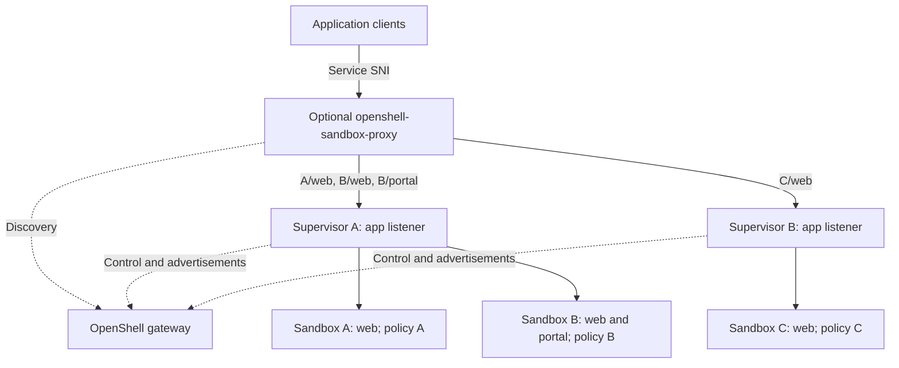

---
authors:
  - "@drew"
  - "@TaylorMutch"
state: draft
links:
  - https://github.com/NVIDIA/OpenShell/issues/4266
  - https://github.com/NVIDIA/OpenShell/pull/4267
  - https://github.com/NVIDIA/OpenShell/issues/994
  - https://github.com/NVIDIA/OpenShell/issues/1791
  - https://github.com/NVIDIA/OpenShell/issues/4210
  - https://github.com/NVIDIA/OpenShell/pull/4213
  - https://github.com/NVIDIA/OpenShell/issues/1794
  - https://github.com/NVIDIA/OpenShell/issues/3402
  - https://github.com/NVIDIA/OpenShell/issues/4229
  - https://github.com/NVIDIA/OpenShell/issues/2469
  - https://github.com/NVIDIA/OpenShell/issues/3715
---

# RFC 0017 - Sandbox service exposure

## Summary

Add a dedicated application listener to supervisors and an optional `openshell-sandbox-proxy`. Supervisors advertise sandbox services to the gateway. The proxy discovers those services through the gateway and uses TLS Server Name Indication (SNI) to select the correct supervisor. The supervisor resolves the hostname and forwards traffic to the service inside its sandbox.

HTTP and WebSocket traffic bypasses the gateway and its supervisor control connection. Operators can scale application ingress separately or use existing ingress infrastructure against the same supervisor listeners. Keep gateway routing available for simple deployments.

## Motivation

Service exposure needs the following:

1. **Independent scaling.** Prevent application traffic from consuming resources needed for responsive control-plane operations.
2. **Independent access restrictions.** Apply separate network rules to control-plane and application traffic.
3. **Application-owned authentication.** Serve applications without requiring OpenShell request authentication, so applications can authenticate their own clients.
4. **Platform-managed authentication.** Protect applications through the authentication infrastructure used for the control plane, such as Cloudflare tunnels and zero-trust proxies.
5. **Routing to shared supervisors.** Support a future supervisor serving several sandboxes, each with its own policy.
6. **Optional proxy deployment.** Discover routes through the gateway while supporting OpenShell's proxy and existing ingress infrastructure.

## Non-goals

- Implement multi-tenant supervisors; accommodate them in the routing design.
- Move SSH, execution, CLI port forwarding, or file uploads out of their current paths.
- Add arbitrary TCP/UDP exposure, automatic port discovery, or application replication.
- Replace egress policy, provider handling, or the isolation backend contract.
- Remove gateway routing or automatically migrate existing URLs.

## Proposal

### What we have today

`openshell service expose my-sandbox 8080 web` registers a service and returns a URL shaped like `https://default--my-sandbox--web.<gateway-base-domain>/`.

The gateway resolves the HTTP hostname and carries application traffic through a supervisor relay to the sandbox's loopback port. Service requests bypass control-plane RPC authorization but share the gateway process, listener TLS requirements, and supervisor transport.

### What is missing

- **Independent scaling.** Another frontend or gateway listener still sends application payloads through the gateway. We need a separate path to supervisor app listeners.
- **Independent access restrictions.** Applications need separate listener ports and TLS policies. Different hostnames alone do not provide a network access boundary.
- **Authentication flexibility.** Applications can already receive bearer credentials or sit behind edge authentication, but inherit gateway TLS requirements. They need an independent application listener; service routes do not automatically inherit OpenShell OIDC or workspace authorization.
- **Service discovery.** Ingress needs to find the supervisor serving each sandbox and follow ownership changes, including when one supervisor serves several sandboxes.

### Architecture

The gateway manages service declarations and discovery. Supervisors have application-only listeners, separate from their gateway connections and management APIs. The optional proxy connects directly to these listeners.

Supervisors reach services through each sandbox's isolation backend loopback connector, as defined in [RFC 0012](../0012-isolation-backend/README.md). Traffic never reaches sandboxes directly.



Solid arrows carry application traffic; dashed arrows carry control traffic. Discovery identifies the supervisor app endpoint independently of which gateway replica owns its control session.

Proxy replicas scale independently of the gateway. Supervisors still share resources between application and control work, so connection, buffer, and per-sandbox concurrency limits must preserve control-plane capacity.

### Services and discovery

Keep the existing workflow, including create-time exposure and unnamed services:

```shell
openshell service expose sandbox-a 8080 web
openshell service expose sandbox-b 8080 web
openshell service expose sandbox-b 9000 portal
openshell service expose sandbox-c 8080 web
```

The gateway sends declarations to the owning supervisor. The supervisor installs permitted routes under each sandbox's policy and advertises them back. The gateway validates ownership and publishes accepted routes. An advertisement cannot broaden a declaration, and an advertised route does not prove the application is healthy.

Add authenticated, read-only discovery with a snapshot and a watch for changes. Each route contains its hostname, sandbox and service IDs, supervisor identity and app address, revision, runtime generation, and expiry. Addresses come from trusted operator/driver configuration. Discovery access is scoped to the router's workspaces and includes no workload secrets.

Routers cache routes rather than querying the gateway for each connection. Revisions and generations distinguish updates and sandbox replacements. Deletion, rejected configuration, or loss of ownership withdraws a route. Supervisors reject stale routes even if a proxy still has them cached; new owners advertise only after accepting the route.

During discovery outages, the proposed default permits unexpired routes and rejects new connections after expiry. Revocation or sandbox teardown closes affected connections. Lease and draining rules remain open questions. Failures do not automatically fall back through the gateway.

### SNI routing and policy

The proposed default is TLS passthrough: the proxy reads SNI, selects the advertised supervisor, and forwards the TLS stream. The supervisor terminates TLS and proxies HTTP/WebSockets to the declared loopback port. Missing SNI and unknown or expired routes are rejected.

For workspace `default`, the example routes are:

| Service URL | Supervisor | Sandbox destination |
| --- | --- | --- |
| `https://default--sandbox-a--web.svc.openshell.internal/` | A | A: web, port 8080 |
| `https://default--sandbox-b--web.svc.openshell.internal/` | A | B: web, port 8080 |
| `https://default--sandbox-b--portal.svc.openshell.internal/` | A | B: portal, port 9000 |
| `https://default--sandbox-c--web.svc.openshell.internal/` | B | C: web, port 8080 |

The supervisor checks each HTTP `Host` or HTTP/2 `:authority` against the connection's SNI and installed route. Mismatches are rejected. WebSockets stay bound to their admitted service.

Before opening the sandbox connector, the supervisor checks ownership, generation, readiness, and that sandbox's policy. Clients cannot choose arbitrary ports. Connection pools, quotas, and logs stay scoped to the sandbox and service. A future shared supervisor must authenticate its authority over each sandbox separately.

The ingress policy schema needs definition. Existing egress rules must not implicitly grant ingress access.

### TLS and authentication

Application TLS is configured separately from gateway TLS. Operators provide DNS and certificates; `svc.openshell.internal` is an example domain. Certificate provisioning and rotation remain open questions.

SNI selects a route; it does not authenticate a user. Applications can handle authentication, or operators can apply an edge access policy. Preserve existing header handling: strip `Authorization` by default, allow explicit `bearer-passthrough`, and strip gateway/edge identity headers and edge authentication cookies. Native OpenShell user/workspace authorization is not the proposed default for application requests.

A passthrough proxy cannot inspect HTTP credentials. An edge that terminates TLS must reconnect with the correct service SNI and authority. Restrict supervisor listener access to prevent bypassing required edge authentication; use authenticated backend transport where network restrictions are insufficient.

### Deployment and compatibility

`openshell-sandbox-proxy` is a separate binary with its own listener, discovery credentials, cache, limits, and metrics. Replicas can sit behind a load balancer and discover routes independently.

It also serves as a reference implementation for users integrating their own ingress with gateway service discovery, showing how to consume route updates and connect to the correct supervisor.

The proxy is optional, consistent with the [PR discussion](https://github.com/NVIDIA/OpenShell/pull/4267#issuecomment-6053456908). Kubernetes operators can use existing ingress plus a discovery adapter to route to supervisor Services. Several sandbox services can share one supervisor Service. A Service spanning supervisors with different sandbox owners still needs routing that selects the correct owner. Ingress must preserve service SNI or use an explicitly supported TLS termination mode.

Enable the new path explicitly and retain existing gateway-mode behavior. CLI/SDK URLs must use the application ingress domain and public port independently of the gateway endpoint. Status should distinguish configured, advertised, and unavailable routes. Domain migrations require coordinated DNS, TLS, and client changes.

## Implementation plan

Start with one sandbox per supervisor while preserving routing boundaries needed for shared supervisors.

1. Define ingress policy, TLS, discovery credentials, route leases, and advertisement/discovery APIs following `proto/README.md`.
2. Add supervisor app listeners, service configuration sync, boundary routing, limits, and OCSF events.
3. Add gateway discovery and build `openshell-sandbox-proxy` with cached routes and direct supervisor connections.
4. Integrate a supported driver and Kubernetes ingress path. Update CLI/SDK URLs, deployment configuration, docs, and related skills.
5. Run sandbox E2E tests for HTTP/WebSockets, SNI/host mismatches, tenant policies, authentication, deletion, replacement, and discovery outages. Use fixtures for shared-supervisor routing until that runtime exists. Measure control-plane responsiveness under application load and test gateway-mode compatibility.

## Risks

- **Supervisor contention.** Application traffic still shares supervisor resources. Limits and load tests must show that control operations remain responsive.
- **Stale discovery.** Ownership changes and outages can interrupt service. Revisions, generations, expiry, and local checks must prevent routing to another sandbox.
- **Ingress security.** New listeners increase supervisor exposure. Bound connection/parser work, reject undeclared services, and prevent edge-authentication bypass.
- **Operational complexity.** Certificates, direct supervisor reachability, and two supported data paths add deployment and maintenance work.

## Alternatives

- **Keep gateway routing or split gateway listeners.** Separate listeners (#4210 / #4213) improve access control but retain gateway payload traffic.
- **Require the proxy everywhere.** This standardizes ingress but adds a component where operators already have suitable infrastructure.
- **Terminate TLS at the proxy.** This centralizes certificates and enables HTTP authentication, but requires a trusted proxy-to-supervisor routing contract.
- **Use reverse application tunnels.** These avoid inbound supervisor reachability but add tunnel ownership and reconnection machinery. Consider them for deployments behind NAT.

## Prior art

- #4266 and [PR #4267](https://github.com/NVIDIA/OpenShell/pull/4267) define the original requirements and options. This revision proposes supervisor listeners with an optional proxy.
- [RFC 0012](../0012-isolation-backend/README.md) provides the protected loopback connector into each sandbox.
- #994 and #1791 cover service declarations and Kubernetes ingress; #1794 and #3402 cover bearer handling and create-time exposure.
- #4229 covers service health. #2469 and #3715 cover dedicated/shared ingress integrations.

## Open questions

- Should TLS terminate at supervisors or the proxy? How are certificates provisioned and rotated?
- Does `service expose` grant ingress permission, or must policy also allow it? Which policy and middleware checks apply?
- How are discovery credentials scoped, and how does a shared supervisor authenticate ownership of each sandbox?
- What route expiry, outage grace, revocation acknowledgement, and connection-draining rules should apply?
- Which driver and ingress integration ship first? What backend authentication is required?
- What per-sandbox limits and control-plane latency targets demonstrate adequate resource isolation?
