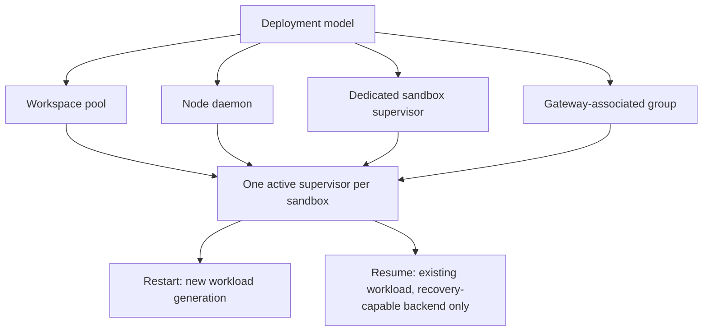
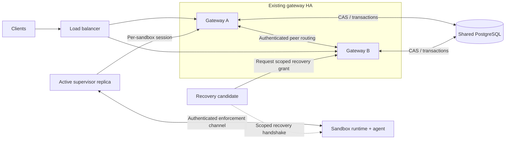
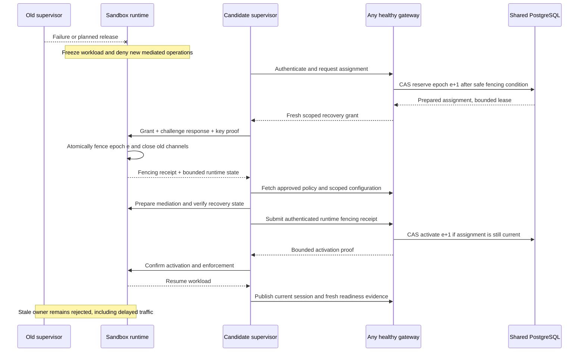

---
authors:
  - "@FrostGod"
state: draft
links:
  - https://github.com/NVIDIA/OpenShell/issues/4311
  - https://github.com/NVIDIA/OpenShell/issues/2385
  - https://github.com/NVIDIA/OpenShell/pull/3661
---

# RFC 0018 - Multi-sandbox and HA Supervisors

## Summary

This RFC proposes four ways to deploy supervisors so that one supervisor can watch several sandboxes and a failed supervisor can be replaced: per workspace, per node, per sandbox, and per gateway. It does not pick one yet. One goal of this RFC is to compare the four models and choose the best one.

All four models share the same safety rules, listed here:

- One supervisor process can look after one sandbox or several.
- Each sandbox keeps its own policy, credentials, runtime connection, gateway session, and resource limits. Sharing a supervisor does not merge sandboxes or their permissions.
- Each sandbox has only one active supervisor at a time. Before a replacement takes over, the old supervisor must lose its power to act. This is called fencing.
- A replacement can keep the agent process running only if the sandbox runtime can safely recover. Otherwise, recovery starts a fresh sandbox run.
- If only a gateway fails, the supervisor reconnects to another gateway. This does not require replacing the supervisor or restarting the agent.

## Motivation

Today, Kubernetes runs the workload and the supervisor in separate Pods. Gateway HA handles a gateway failing. It does not replace a failed supervisor while keeping its workload running. Sharing supervisors would save Pods, but one failure would then affect more sandboxes.

Operators need to know three things: what fails together, what recovers without restarting the agent, and what isolation is left. The design must cover upgrades, crashes, network partitions, overload, and node loss. It must not promise connections that never drop, and it must not weaken enforcement.

### What the supervisor does

These duties apply to every deployment model, separately for each sandbox:

- **Prove who it is:** log in to the gateway and the sandbox runtime with credentials tied to that sandbox and run. Renew tokens and keep TLS connections trusted.
- **Keep the gateway link alive:** open the sandbox's control session, send heartbeats, receive connection requests, and reconnect when a gateway goes away or sends it elsewhere.
- **Load policy and configuration:** fetch, check, and apply approved policy, provider, and middleware updates, and report what is actually installed. It does not approve its own policy changes.
- **Start the agent safely:** attach to the chosen isolation backend, confirm the boundary and networking are ready, then ask the runtime to start the agent.
- **Decide which network requests are allowed:** check destinations against policy. Where configured, also check HTTP, API, and MCP operations, using the identity of the calling program that the runtime provides.
- **Provide the network path:** resolve DNS, open allowed connections upstream, proxy traffic, and run configured inspection and middleware. The agent does not get unrestricted direct network access.
- **Protect provider credentials:** fetch and refresh credentials and add them only to authorized requests. Prepare provider environment values for future commands only when explicitly configured.
- **Provide interactive access:** serve SSH, terminals, command execution, and file transfer. Ask the backend to run processes, carry I/O, resize terminals, and send signals inside the sandbox.
- **Forward allowed connections:** handle gateway relay requests and use the backend to reach services inside the sandbox without exposing the workload directly.
- **Report health and process state:** publish policy and provider readiness, endpoint observations, and the main process's exit result, so the gateway can show the real sandbox status.
- **Send audit and operational data:** forward logs and traces, record allow and deny decisions, and send activity summaries and policy-analysis proposals.
- **Manage its own sandbox lifecycle:** on exit or shutdown, close proxy and access tasks and release backend handles, without disturbing other sandboxes. The driver still cleans up infrastructure.

The sandbox runtime, not the supervisor process, owns the actual workload processes, the kernel isolation controls, and the checks of which executable is running. The runtime freezes or stops the workload when required supervision is lost. The gateway owns user authorization, policy approval, and durable control-plane state. Its compute driver creates and deletes runtime resources.

## Goals

- **Choose the ideal deployment model.** Compare the four proposed models (per workspace, per node, per sandbox, per gateway) on failure scope, recovery, isolation, Pod cost, and operating effort, and choose the ideal one, or the best default and the cases where another model is better.
- **Define one set of safety rules** that every model follows, so the choice of model changes cost and failure scope but never weakens isolation.
- **Define how a failed supervisor is replaced**, and when the running agent can be kept.

## Non-goals

- Picking a model before it has been compared and tested. The four models below are proposals.
- Saving or live-moving agent memory from a failed node.
- Moving existing TCP, SSH, forwarding, or upstream HTTP connections to another supervisor.
- Running arbitrary external side effects exactly once.
- Removing the trusted sandbox runtime, the outer network fence, or per-sandbox authorization.

## Proposal

### 1. Four proposed models: where supervisors run and what happens if they fail

This section proposes four models. They are candidates to compare, not a decision. The table below lists what each one gives and costs, and the open questions and implementation plan say how we will choose.

Two settings describe each deployment:

- **Where it runs:** per workspace, per node, per sandbox, or per gateway.
- **How it recovers:** replace the supervisor and keep the running agent when that is safe, or start a fresh sandbox run.

All four proposed models follow the same safety rules for each sandbox, described in the rest of this proposal. The rules do not depend on which model is chosen.

A **workspace** groups OpenShell sandboxes, providers, and access control. It is not always a Kubernetes namespace: the driver supports shared, managed, and operator mappings. Assign supervisors by immutable IDs, not by names, Pod IPs, or a shared namespace.

A **supervisor replica** is a real process or Pod. A **logical supervisor session** owns exactly one sandbox boundary. One replica can host many sessions. Each session has its own backend handle, policy, credentials, gateway session, queues, and cleanup. Several replicas can be active for different sandboxes, but only one owns a given boundary at a time.

| Placement | Unit of assignment and recovery | Benefits | Limits and choices needed for HA |
| --- | --- | --- | --- |
| Per workspace | A replica or pool for one workspace | Trust and quotas stay within a workspace; fewer Pods | A failure affects every sandbox assigned to it. Small workspaces pay the cost of redundancy. Needs explicit namespace mapping, separate failure domains, and spare capacity that is allowed to be used. |
| Per node | A DaemonSet replica for the sandboxes on that node | Local traffic; Pod count follows node count | A failure affects the local sandboxes, possibly across workspaces. One Pod per node has no standby ready right away, so choose one of: local replacement, temporary overlap, or an allowed remote fallback. Losing the node also loses the workloads. |
| Per sandbox | One dedicated active supervisor, with an optional warm standby | Smallest failure scope; simplest isolation | Most Pods; slow cold start. Standbys can be placed independently, but they cannot save a sandbox whose workload node failed. |
| Per gateway | A group of supervisors tied to each gateway replica | Capacity follows gateway groups; easy to operate as a group | Putting them together couples failure, upgrade, and scaling. Separate Pods reduce that coupling. Needs a stable group identity, spare capacity, explicit reassignment, and gateway routing ownership that is independent. |

For per-gateway placement, "gateway" means the group tied to one gateway replica, not the whole OpenShell installation. Forcing supervisors onto the same node as their gateway is an optional rule, not part of the HA promise. Per-node deployments that only allow local replacement, and per-gateway deployments that force co-location, must report when those rules prevent recovery.

**Restart recovery** stops the old execution environment and starts a new generation. Persistent storage can survive, but process memory cannot. **Resume recovery** keeps the live workload and runtime, freezes it for a short time, and attaches a new supervisor using the protocol below. It still breaks the affected network connections. If the node or runtime is lost, restart is the only option, whatever the supervisor placement.

### 2. Keep gateway ownership separate from enforcement ownership

Gateway HA already uses active-active replicas, PostgreSQL, authenticated peers, and durable session ownership. The merged PR #3661 hashes each sandbox to a preferred gateway, and the published live owner is still the final authority. Changes to the hash ring do not move working sessions on their own.

Keep one authenticated outbound gateway session per sandbox. Do not use one identity that covers many sandboxes. When a gateway fails, sessions reconnect and enforcement ownership does not change. When a supervisor is replaced, it first gets recovery authority, and only then publishes new gateway sessions.

The supervisor opens the connection to the gateway, not the other way around. The gateway then uses that connection to send requests and set up relay streams that the supervisor starts. The gateway that holds a sandbox's session is its routing owner. It is not the parent of the process that runs the supervisor.

For exec, SSH, file transfer, and forwarding, the request path is:

`Client → receiving gateway → owning gateway (if different) → supervisor → sandbox runtime`.

For these operations, the gateway does not connect directly to the workload. Managing infrastructure is different: the gateway's compute driver still talks to Kubernetes or another runtime to create, stop, and delete resources. The sandbox workload also cannot call the gateway directly. All of its network access goes through the supervisor.

For example, one shared supervisor serving sandboxes A and B keeps a separate authenticated gateway session for each. A's session may be on gateway 1 and B's on gateway 2. Sharing the process does not force both sandboxes onto the same gateway. Keep the current session and peer-relay design. Add ownership checks so that requests from a replaced supervisor are rejected.

Add a per-sandbox record called `SupervisorAssignment`. It holds: installation and scope IDs, immutable sandbox and workload identities, runtime generation, the identity of the owning Pod or process, an ownership epoch, a time-limited lease, the transition state, and a storage version. The epoch says **which supervisor may enforce**. Keep it separate from credential rotation and from the gateway connection epoch.

Add the parent ownership epoch to the existing gateway session-owner record. After ownership changes, reject relays, policy acknowledgements, readiness reports, and late cleanup from the old owner. A higher connection epoch alone cannot replace the enforcement owner. A sandbox is ready only when it has a current gateway session and the runtime has confirmed enforcement. Do not reuse the previous owner's endpoint evidence.

Any gateway can reconcile using compare-and-swap (CAS) and per-sandbox work leases. Driver operations must be safe to repeat and must be fenced across processes, because today's in-process mutation gate is not enough. Do not add a single coordinator, a fleet-wide lock, or a database lock held across network calls.

Pick a healthy, compatible candidate within the allowed scope and capacity budget, and keep healthy assignments where they are. Pool health and load help choose a candidate, but they never grant authorization. Scaling out adds candidates. Scaling in drains assignments. Do not use the gateway hash ring to rebalance enforcement owners.

### 3. Use fenced recovery, not reusable launch credentials

RFC 0012 today allows transport recovery only by the same supervisor process. Upgrades start a fresh generation. The Kubernetes driver also ties bootstrap authorization to one supervisor Pod and one Sandbox resource. So sharing and replacement need explicit changes to the protocol and to authorization. A different Pod template is not enough.

Add a versioned backend recovery extension. It needs fencing, bounded state recovery, and conformance tests. Backends without it stay valid. Admission checks exactly what a backend supports. A resume request cannot quietly switch backends or weaken policy.

Recovery has its own lifecycle: `recover` → frozen/prepared → `confirm_recovery` → running (the operation names are examples). It never calls `start_agent`, and it never reuses the normal `attach` on a live boundary. If the runtime cannot freeze the workload or verify that enforcement is still in place, it stops the workload instead of issuing a recovery receipt.

The driver checks the candidate's identity using TokenReview plus an explicit mapping from scope to sandbox. TokenReview alone is not authorization. Neither are namespace membership, labels, or network reachability. Issue a short-lived `RecoveryGrant` with its own audience. Tie it to the candidate's key, the immutable workload and runtime identities, the ownership epoch, a challenge, and an expiry time. Launch credentials cannot authorize a replacement. Issue new TLS material for each candidate, and never copy the old supervisor's private key.

A new owner can only be reserved after one of these: the old owner confirmed it was released and disabled, a lease that is enforced has expired, or there is trusted proof of hard fencing. A missing heartbeat is not enough, and neither is a deleted Kubernetes Pod. The runtime accepts a newer authorized epoch, closes the old channels, and stays frozen during preparation. Activation needs an authenticated fencing receipt from the runtime. A failed candidate never extends the original recovery deadline, and epochs never go backwards.

The runtime and the supervisor both enforce lease expiry and epoch checks, including during partitions where the old process is still alive. A row in the database does not fence sockets. External effects that were already forwarded cannot be undone. Callers cannot choose candidates or raise epochs.

Today's [gateway ownership](https://github.com/NVIDIA/OpenShell/blob/e1f3c82caa3ed3b65de22889ae7ef32a774878ef/crates/openshell-server/src/supervisor_owner.rs) has a 45-second TTL, while the [runtime's authenticated reconnect window](https://github.com/NVIDIA/OpenShell/blob/e1f3c82caa3ed3b65de22889ae7ef32a774878ef/crates/openshell-sandbox/src/boundary_server.rs) is 30 seconds. Waiting for the routing TTL to run out cannot meet the current resume timing. So add a separate enforcement lease and a checked, bounded recovery window. Update gateway ownership through the parent epoch instead of waiting for the old routing ownership to expire. The following must hold:

`detection + safe fencing + candidate startup + state restoration + confirmation + safety margin < recovery window`.

Order events by the database, allow a bounded clock skew, and use monotonic local deadlines. Reject unsafe configurations. If the clocks are uncertain or the authority has expired, fail closed. The lifetime of a gateway-session JWT is not an enforcement lease. If PostgreSQL is lost, no new assignments or renewals happen. Enforcement that is already valid may continue only until its bounded lease ends. Then the workload freezes and stops by the documented deadline. This is a deliberate trade-off between availability and security.

HA for resume needs durable epoch commits, a fenced PostgreSQL primary, and the same grant-signing trust on every gateway. A database failover or restore must never reuse an epoch that was already accepted. If the authority is unavailable or inconsistent, recovery is blocked. Having more standbys does not help if the database or the issuer is a single point of failure.

### 4. Keep authoritative state and preserve isolation

The runtime keeps the process handles, exec IDs, digests and deadlines, exit observations, supported stream cursors, and enforcement state. A replacement restores the supervisor's state from the authenticated runtime state and the approved gateway configuration. The binary-identity pins (TOFU, trust on first use) and the effective policy revisions must either survive or block resume. Do not learn them again from a workload that is already running.

Keep the existing exec IDs and the 30-second absolute admission deadlines across a replacement. Never extend a deadline on retry. Keep bounded protection against replays. Report missing output as truncated, and report outcomes that cannot be proven as unknown. Never rerun a command. Close old proxy connections and do not replay HTTP requests. Fetch fresh credentials with the right scope. Never store plaintext provider secrets in recovery records, and never restore revoked credentials from old state.

| Current limit | Proposed change | What stays guaranteed |
| --- | --- | --- |
| One supervisor Pod per Sandbox resource | A shared replica registry plus explicit per-sandbox assignments | Authorization stays exact for one workload and runtime generation. |
| Reconnect only by the same process | Replacement with a fresh grant and fencing, through the recovery extension | Never two active owners; no takeover with a launch token. |
| Supervisor state lives only in memory | State kept by the runtime, plus reloading approved configuration | No policy rollback, no relearning of identity, no duplicate exec. |
| Supervisor lifecycle belongs to one Sandbox resource | Shared groups managed by the driver, with cleanup per session | Deleting one sandbox cannot delete a shared replica or another sandbox's resources. |
| Fixed recovery timeout | A checked, bounded lease and recovery policy | No workload left running with no manager, and no fallback to open egress. |
| A dedicated bootstrap and network identity chain | An identity for each candidate and a trusted scope mapping | The workload never receives supervisor credentials and cannot choose its supervisor. |

Do **not** relax the outer network fence, the completeness of backend enforcement, or running workloads without extra capabilities. Per-node supervision does not need host PID or network namespaces, privileged Pods, or moving seccomp listeners out of the runtime. If a backend needs more privilege, that needs its own security review. It is not a hidden requirement of HA.

Separate policy, credentials, middleware and caches, upstream connection pools, process handles, relays, logs, and cleanup by sandbox identity and generation. Require quotas, fair scheduling, bounded buffers, and backpressure. If a shared process is compromised, more sandboxes are exposed. Software separation is not the same as a dedicated process.

### 5. Define operator behavior, capacity, and failure outcomes

The proposed deployment settings choose the placement, the recovery mode (restart or resume), which fallbacks to other locations are allowed, replica and spare-capacity limits, resource quotas for each sandbox, and bounded drain and recovery times. These are new settings, not existing flags. A workload's policy cannot give itself wider placement or recovery rights. Record the choices that were admitted for each generation, and show operators the effective mode and the reason for any recovery failure. By default, a failed resume ends the sandbox. Restarting afterward must be an explicit operator policy.

For `N` sandboxes and `R` standalone supervisor Pods, the runtime Pod count is about `N + R`, not counting gateways and support services. Today's dedicated layout is `2N`. With one warm standby per sandbox it is `3N`. In a shared setup, `R` includes standby and rollout capacity, not just active replicas. Putting supervisor containers in the same Pod removes extra Pods but not the CPU and memory cost or the shared failure. The number of gateway sessions still follows the number of sandboxes, not the number of supervisor Pods. The current budgets of 256 pending relays per replica and 32 per sandbox limit relays that nobody has claimed yet. They do not limit the number of active supervisors or sandboxes.

Plan for sessions, mediation throughput and latency, memory, file descriptors, bandwidth, and the largest group that can fail together. Include credential issuance, PostgreSQL leases and pools, CNI addresses, and topology limits. Spare capacity must be usable by the affected scope. An idle replica in another workspace is not automatically usable. Reject admission, or mark HA as degraded, when the declared failure budget cannot be met.

| Event | Required behavior |
| --- | --- |
| Gateway failure or rollout; supervisor healthy | Use the existing gateway reconnect, handoff, and peer routing. No supervisor replacement and no workload restart. Gateway transports in flight may break. |
| Supervisor crash or OOM; runtime alive | Freeze. Get safe replacement authority. Resume if supported and in time. Otherwise stop the workload and follow the explicit restart policy. |
| Partition between supervisor and runtime, or with the database | Reject any takeover that is not fenced. Let the bounded authority expire. Never restore direct workload egress. |
| Candidate unavailable, incompatible, or overloaded | Retry within limits and show the failure or degraded status. No wider scope and no silent switch of backend. |
| Workload node or runtime lost | Restart a new generation if policy allows. Whether persistent storage is available is a separate question. Process memory is lost. |
| Supervisor upgrade, scale-in, or node drain | Stop new assignments, move each eligible session with fencing, then stop. If the deadline passes, follow the explicit restart or terminate policy. |
| Sandbox stop or delete, workspace deletion, or supervisor authority revoked | Cancel the authority and grants. Trusted cleanup wins over a pending recovery and cannot affect unrelated sessions. |

Draining a gateway and draining a supervisor are separate operations. The existing ring and readiness removal still apply. One draining shared supervisor must not make unrelated gateway replicas unready. Remove a gateway-associated group only after its assignments are moved or ended. Remote fallback for per-node supervisors is opt-in. A temporary DaemonSet surge helps planned upgrades, but it is not a standby for crashes. Reserve resources before allowing overlap. See [Kubernetes DaemonSet update guidance](https://kubernetes.io/docs/tasks/manage-daemon/update-daemon-set/).

Use topology spread and anti-affinity, resource reservations, rollouts in bounded batches, and PDBs where they apply. PDBs do not stop unplanned failures, and they do not limit rolling updates run by a controller, so set rollout limits separately. See [Kubernetes disruption guidance](https://kubernetes.io/docs/concepts/workloads/pods/disruptions/).

Report the assignment and recovery state, rejections of fenced owners, recovery time and outcome, available eligible capacity, and the load of each replica. Keep metric labels bounded. Put sandbox and workspace identities in authenticated status, logs, and traces, not in metric labels that can grow without limit. A sandbox is ready only when its effective policy is loaded, mediation is initialized, its authority is current, and the runtime has confirmed it. A listening Pod is not enough. Measure p95 and p99 workload freeze time separately from client reconnect time. Publish measured recovery bounds for each backend, and do not promise one value for all of them.

### 6. Keep compatibility and component duties clear

- Gateway: assignments, grants, and routing.
- Compute driver: create candidates and do trusted, fenced cleanup.
- Backend and runtime: fencing and process state.
- Supervisor: separate contexts and approved configuration.
- Controllers and Helm: pools, placement, resources, and disruption settings. They do not have takeover authority.

Existing installations keep the dedicated, restart-only behavior unless operators opt in, so nothing breaks. Mixed versions reject resume they do not support. Backend and protocol versions change together. Existing generations keep the mode they were admitted with. Changing placement needs a new generation unless it is separately validated. Docker, Podman, VM, and MXC keep their baseline behavior until each one passes the conformance tests.

## Implementation plan

1. Agree on the recovery and security contract that all four models share, and amend RFC 0012's same-process restriction. Define lease ordering, authenticated fencing receipts, clocks, and versioned wire messages before turning on sharing.
2. Build assignment and grant storage, distributed driver fencing, runtime recovery state, and supervisor replacement. Test the protocol first with dedicated supervisors, so sharing does not hide ownership bugs.
3. Add hosting of many isolated sessions and a prototype of each of the four proposed models, behind explicit admission controls. Publish an honest table of which models and backends are supported. Do not call a model HA until its failure cases pass.
4. Test each topology: crashes, OOMs, SIGTERM, gateway churn, node drain and loss, partitions, stale grants, duplicate claims, failures in the middle of a handoff, stop and delete races, policy and credential changes, incompatible versions, and running out of capacity. Check that there is no split brain, no credential leak, no policy bypass, and no duplicate exec. Run sandbox e2e and conformance tests, and a security review.
5. Measure recovery from a single failure and the effect of noisy neighbors for each model. Compare the results against the goals, and **choose the ideal model** (or the default model and where each other model fits). Record the decision by updating this RFC.
6. Canary mixed versions. Write deployment and configuration guidance. Then promote the chosen model and any other combinations that passed. To roll back, first stop new admissions. Then stop or restart any generation that has resume enabled if an older binary cannot enforce its contract.

## Risks

- Shared processes widen the damage from a compromise or a crash. Scope separation and quotas reduce accidental interference, but some deployments may still need dedicated supervision.
- Lease expiry means that a PostgreSQL or control-plane outage can affect enforcement availability. Longer leases tolerate outages better but slow down takeover. Shorter leases need more renewals and can expire falsely. Benchmark and check the full timeout budget.
- Recovering security and execution state is much harder than reconnecting a stream. If the state cannot be trusted, resume must be refused, even if restarting is inconvenient.
- Comparing four proposed models makes the matrix of configurations to support and test larger. Release only combinations that have been validated, and show which guarantees are not met. A higher replica count is not proof of HA.

## Alternatives

- **Restart-only recovery:** works for all four deployment models without keeping the agent's process. It is simpler when restarting the workload is acceptable, but it does not recover a running process.
- **Rely on Kubernetes restarts alone:** brings Pods back, but it does not get around authorization that is tied to a process, and it does not recover the state of a running boundary. It cannot give safe resume on its own.
- **Active-active supervision of one sandbox:** creates conflicting owners of policy, processes, and credentials. Active-active pools across different sandboxes are still supported. Two owners of the same boundary at once are not.
- **An external proxy or shared service without the supervisor contract:** can centralize upstream networking, but it cannot replace process operations, executable identity, gateway sessions, and boundary enforcement.

## Related work

- [Issue #4311: Multi-sandbox and HA Supervisors](https://github.com/NVIDIA/OpenShell/issues/4311): the original work item for supervising many sandboxes and for high availability.
- [RFC 0012: Isolation Backend](https://github.com/NVIDIA/OpenShell/blob/e1f3c82caa3ed3b65de22889ae7ef32a774878ef/rfc/0012-isolation-backend/README.md): roles that do not depend on placement, strict isolation for each boundary, and today's same-process recovery limit. This draft extends recovery. It does not change the enforcement rules.
- [Kubernetes driver](https://github.com/NVIDIA/OpenShell/blob/e1f3c82caa3ed3b65de22889ae7ef32a774878ef/crates/openshell-driver-kubernetes/README.md) and [runtime authentication](https://github.com/NVIDIA/OpenShell/blob/e1f3c82caa3ed3b65de22889ae7ef32a774878ef/crates/openshell-sandbox-backend/src/sandbox_auth.rs): today's Pod identity and the limits on replacement processes.
- [Gateway HA documentation](https://github.com/NVIDIA/OpenShell/blob/e1f3c82caa3ed3b65de22889ae7ef32a774878ef/docs/kubernetes/high-availability.mdx) and [PR #3661](https://github.com/NVIDIA/OpenShell/pull/3661): placement of gateways by hashing, and durable routing ownership. Do not confuse these with enforcement ownership.
- [Issue #2385](https://github.com/NVIDIA/OpenShell/issues/2385): an earlier proposal for shared supervision, with Pod-density requirements.

## Open questions

- Which of the four proposed models is the best fit, and should it be the only model or the default with the others as options?
- What capacity and recovery targets must each of the four models meet, and in what order should they be delivered?
- What lease, clock-skew, startup, and recovery limits can be reliably reached?
- Which local-node and gateway-group affinity rules may operators relax?
- Which security and execution state must be saved before resume is safe?- Is the exposure from a compromised shared process acceptable, or do we need separate worker processes?
