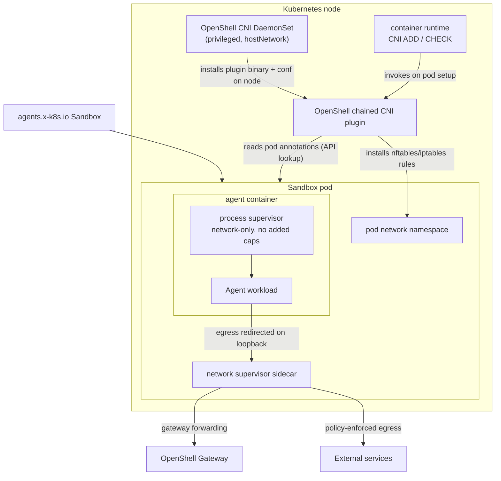

---
authors:
  - "@russellb"
state: draft
links:
  - https://github.com/NVIDIA/OpenShell/pull/2074 - kubernetes combined topology
  - https://github.com/NVIDIA/OpenShell/pull/2076 - kubernetes sidecar topology
  - https://github.com/NVIDIA/OpenShell/pull/2078 - original cni-sidecar topology PR from TaylorMutch
---

# RFC NNNN - CNI-Sidecar Supervisor Topology (and OpenShift/Multus Enablement)

<!--
See rfc/README.md for the full RFC process and state definitions. This RFC is
intentionally unnumbered: a number is assigned by maintainers from the
originating issue before it moves out of draft.
-->

## Summary

This RFC proposes `cni-sidecar`, a third Kubernetes supervisor topology for
OpenShell sandbox pods. It keeps the split-supervisor runtime model of the
existing `sidecar` topology — a network-enforcement sidecar plus a
low-privilege process supervisor in the agent container — but moves pod-network
rule installation out of the sandbox pod entirely. A privileged, node-level
OpenShell CNI DaemonSet installs a chained CNI plugin on every node; during CNI
`ADD` the plugin reads OpenShell pod annotations and installs the
bypass-prevention rules in the pod's network namespace before the workload
starts. This removes the per-pod privileged network init container that
`sidecar` topology requires.

The RFC also proposes the configuration surface needed to run this topology on
managed CNI platforms — specifically OpenShift with Multus and OVN-Kubernetes —
where there is no `.conflist` to append to and where pods run under restrictive
SecurityContextConstraints (SCC). This includes a second CNI install mode
(`multus-chain`), an accompanying set of host-path defaults, and two gated,
minimal SCC grants (one for the CNI DaemonSet, one for the sandbox pod).

## Motivation

OpenShell's `combined` topology runs the full supervisor — network, filesystem,
and process controls — inside the agent container, which requires that container
to carry elevated Linux capabilities (`SYS_ADMIN`, `NET_ADMIN`, `SYS_PTRACE`,
and others). Many clusters will not admit a workload container with those
capabilities. The `sidecar` topology addresses part of this by moving network
enforcement into a dedicated sidecar and running the agent container as a
low-privilege, network-only process supervisor. But `sidecar` still needs a
**privileged network init container** in every sandbox pod to install the
pod-local nftables rules that fence egress through the sidecar. That init
container needs `NET_ADMIN`/`NET_RAW`, which is exactly the kind of per-pod
privilege stricter clusters — and stricter runtime classes like gVisor — want to
eliminate.

The problem is worse on OpenShift. There, the sandbox pod init container's
capabilities collide with `restricted-v2`, and even if the sidecar model is
used, the network init container is a per-pod privileged surface that cluster
security teams object to. Operators who want OpenShell's network policy
enforcement on OpenShift currently have no clean path.

If we leave the design unchanged, OpenShell's network enforcement remains
coupled to either a highly privileged agent container (`combined`) or a
per-pod privileged init container (`sidecar`). Neither fits clusters that push
network-privileged operations to the node/CNI layer, which is where cluster
admins already expect that privilege to live. Node-level CNI installation is a
one-time, admin-scoped grant; per-pod privileged init containers are a
recurring, workload-adjacent grant. Moving the rule installation to the CNI
layer aligns the privilege boundary with how clusters are actually governed.

## Non-goals

- **Fail-closed networking.** The chained-plugin model is fail-open: if the
  OpenShell CNI conf is absent (e.g., briefly after a node reboot before the
  DaemonSet re-asserts it), pod networking is not blocked. This is inherent to
  the `cni-sidecar` approach and is left as a follow-up, not addressed here.
- **Configuring Multus.** This RFC consumes the Multus `vendor-cni-chain`
  auxiliary chain when it is present; it does not propose configuring or
  installing Multus, nor setting `auxiliaryCNIChainName`.
- **Replacing `combined` or `sidecar`.** Both remain; `combined` stays the
  default and the only topology that provides the full supervisor contract
  (filesystem policy, privilege drop, mount isolation).
- **Non-Kubernetes drivers.** Docker, Podman, and VM drivers are unaffected.

## Proposal

### Topology overview

`cni-sidecar` reuses the `sidecar` runtime split and changes only where the
network rules come from:



Key difference from `sidecar`: there is **no per-pod network init container**.
The DaemonSet's chained plugin installs the loopback-redirect fence during pod
network setup, so the pod itself never needs `NET_ADMIN`/`NET_RAW`.

### Component privilege model

The privilege of each component is the central design point. The goal is that
the only privileged surface is the node-level installer (admin-scoped), and the
sandbox pod carries the minimum needed for the enforcement mode in use.

| Component | Scope | UID | Privilege escalation | Capabilities | Notes |
|---|---|---|---|---|---|
| CNI installer DaemonSet | Node | 0 | true | `privileged: true` | `hostNetwork`, host-path mounts into CNI dirs. One privileged surface, installed once per node by an admin. |
| Agent container (process supervisor, `network-only`) | Pod | `sandbox_uid:sandbox_gid` | false | drops `ALL` | The workload runs here with no added Linux capabilities. |
| Network sidecar — binary-aware mode (default) | Pod | `0:sandbox_gid` | false | drops `ALL`, adds `SYS_PTRACE` + `DAC_READ_SEARCH` | UID 0 is required to inspect the agent's `/proc` across UID boundaries (see below). |
| Network sidecar — endpoint/L7-only mode | Pod | `proxyUid:sandbox_gid` | false | drops `ALL` | Non-root; enforces endpoint/L7 policy without `policy.binaries` matching. |
| Network rule setup | — | N/A | N/A | N/A | Performed by the node CNI plugin; **no pod-local init container**. |

**Why the binary-aware sidecar must be UID 0.** Kubernetes `SecurityContext`
has no ambient-capability field. A process that starts as non-root loses added
capabilities across `execve`, because ambient caps are what carry capabilities
into a non-root program's effective set. To keep `SYS_PTRACE` and
`DAC_READ_SEARCH` effective — which the sidecar needs to read the agent
process's `/proc` entries across the UID boundary for binary-aware policy — the
sidecar must run as UID 0. This is not an OpenShell preference; it is the only
configuration in which Kubernetes keeps those capabilities effective for
cross-UID `/proc` inspection. The nftables fence exempts UID 0, so operators
must not inject other root containers into these pods.

Operators who do not need binary matching can set
`processBinaryAwareNetworkPolicy: false`. The sidecar then runs as the non-root
`proxyUid` with no added capabilities and enforces endpoint/L7 policy only. On
OpenShift this variant admits under the built-in `restricted-v2` SCC with no
custom SCC required.

### CNI install modes

The CNI DaemonSet installs the `openshell-cni` binary into the host CNI bin
directory in all cases. How it wires the plugin into the node's CNI
configuration is selected by `cni.mode`:

- **`conflist`** (default; k3s / vanilla): find the first non-OpenShell
  `*.conflist` in `cni.confDir`, back it up, and append `openshell-cni` to its
  `.plugins` array. `preStop` removes the plugin entry. This is the pre-existing
  behavior and is unchanged.
- **`multus-chain`** (OpenShift): write a standalone CNI `.conf` into a Multus
  `vendor-cni-chain` subdirectory. Multus runs an isolated auxiliary chain for
  every pod from that directory **without modifying any operator-managed file**.
  `preStop` removes the `.conf` and credential files.

The mode split isolates the OpenShift-specific difference to a script branch,
path defaults, and RBAC/SCC — no separate DaemonSet, no operator.

### Why `multus-chain` on OpenShift

On OpenShift 4.x (RHCOS, cri-o, OVN-Kubernetes + Multus), the CNI layout defeats
the `conflist` approach:

- CNI bin dir is `/var/lib/cni/bin` (cri-o `plugin_dirs`); `/opt/cni/bin` does
  not exist.
- CNI conf dir is `/etc/kubernetes/cni/net.d/`; the only file is
  `00-multus.conf` (type `multus-shim`), a single `.conf` with **no `.plugins`
  array** to append to.
- The delegated OVN config is CNO-managed and regenerated, so patching it would
  be reverted and risks breaking cluster networking.

Multus's thick daemon, when configured with `auxiliaryCNIChainName`
(`vendor-cni-chain`, default on OpenShift 4.x), loads additional per-pod CNI
configs from a `vendor-cni-chain/` subdirectory of the cluster-network config
path. Dropping a standalone `openshell-cni.conf` there runs our plugin as an
isolated auxiliary chain for all pods without touching CNO-managed files. The
plugin already no-ops for pods lacking the OpenShell annotation and passes
`prevResult` through, so it does not disturb other pods.

### Configuration surface

New/changed chart values. Chart defaults remain non-OpenShift; OpenShift
settings live in the overlay `ci/values-cni-sidecar-openshift.yaml`.

| Value | Default | OpenShift overlay | Purpose |
|---|---|---|---|
| `supervisor.topology` | `combined` | `cni-sidecar` | Select the topology. |
| `supervisor.sidecar.proxyUid` | `1337` | `1337` | UID for the relaxed endpoint/L7 sidecar; must be non-root and != sandbox UID. |
| `supervisor.sidecar.processBinaryAwareNetworkPolicy` | `true` | `true` | Keep binary-aware policy (sidecar as UID 0). |
| `cni.enabled` | `false` | `true` | Install the node CNI DaemonSet. Required for `cni-sidecar`. |
| `cni.mode` | `conflist` | `multus-chain` | Install strategy. |
| `cni.binDir` | `/opt/cni/bin` | `/var/lib/cni/bin` | Host CNI binary directory. |
| `cni.chainDir` | `""` | `/run/multus/cni/net.d/vendor-cni-chain` | Multus aux-chain dir (multus-chain only). |
| `cni.stateDir` | `""` (falls back to `confDir`) | `/etc/kubernetes/cni/openshell` | **Persistent** credential dir (chainDir is tmpfs). |
| `cni.openshift.privilegedSCC` | `false` | `true` | Grant `privileged` SCC to the CNI ServiceAccount. |
| `sandboxServiceAccount.openshift.binaryAwareSCC` | `false` | `true` | Create + grant the minimal sandbox SCC. |

Guardrails enforced at template render time:

- `supervisor.topology=cni-sidecar` requires `cni.enabled=true` (existing
  guard).
- `cni.mode` must be `conflist` or `multus-chain`.
- `cni.mode=multus-chain` requires `cni.chainDir`.

Because `cni.chainDir` is tmpfs (under `/run`), credentials cannot live there.
The DaemonSet writes kubeconfig/token/ca.crt to the persistent `cni.stateDir`,
references those paths from the plugin `.conf`, and its periodic loop (already
refreshing the SA token every 300s) re-asserts the chain `.conf` if it goes
missing, so the config survives a Multus restart; a node reboot is covered by
the DaemonSet re-writing on startup.

### SCC model (OpenShift)

Two independent, gated, minimal SCC grants — each off by default so non-OpenShift
installs never reference OpenShift-only APIs:

1. **CNI DaemonSet** (`cni.openshift.privilegedSCC`): a ClusterRole granting
   `use` on the built-in `privileged` SCC, bound to the CNI ServiceAccount. The
   installer genuinely needs `privileged` for host-path writes into node CNI
   directories.

2. **Sandbox pod** (`sandboxServiceAccount.openshift.binaryAwareSCC`): a
   purpose-built minimal SCC, plus a ClusterRole/ClusterRoleBinding granting it
   to the sandbox ServiceAccount. It is the `restricted-v2` baseline plus exactly
   what binary-aware `/proc` inspection needs — `runAsUser: RunAsAny` (permits
   UID 0), `SYS_PTRACE`, `DAC_READ_SEARCH`, and the `image` volume type used to
   sideload the supervisor binary. Everything else stays locked down:
   `allowPrivilegedContainer: false`, `allowPrivilegeEscalation: false`, no host
   namespaces, `requiredDropCapabilities: [ALL]`, `seccompProfiles:
   [runtime/default]`. When `processBinaryAwareNetworkPolicy: false`, this SCC is
   unnecessary and `restricted-v2` suffices.

Neither uses `anyuid` (grants UID 0 but adds no capabilities) or the full
`privileged` SCC for the sandbox pod (wildly overbroad). The custom minimal SCC
is the smallest grant that retains functionality.

### How it works end to end

1. Operator installs the chart with the OpenShift overlay. Helm renders the
   gateway, the CNI DaemonSet (`multus-chain`), the CNI `privileged` SCC grant,
   and the minimal sandbox SCC + grant.
2. The DaemonSet, on each node, copies `openshell-cni` into `/var/lib/cni/bin`,
   writes credentials into the persistent `stateDir`, and drops
   `openshell-cni.conf` into the Multus `vendor-cni-chain` dir.
3. A `cni-sidecar` sandbox is created. The agent-sandbox controller reconciles
   the `Sandbox` CR into a pod. OpenShift SCC admission evaluates the sandbox SA
   and admits the pod under the minimal SCC (recorded in the
   `openshift.io/scc` annotation).
4. During pod network setup, the runtime invokes the Multus aux chain; the
   OpenShell plugin reads the pod's OpenShell annotations (via API lookup, since
   Multus does not pass annotations through `CNI_ARGS`) and installs the
   nftables/iptables loopback-redirect fence in the pod netns.
5. The sidecar starts (UID 0, `SYS_PTRACE` + `DAC_READ_SEARCH`), the process
   supervisor starts network-only in the agent container, and workload egress is
   fenced through the sidecar to the gateway and policy-enforced destinations.

### Sample manifests

Install (OpenShift overlay):

```shell
helm install openshell deploy/helm/openshell \
  -f deploy/helm/openshell/ci/values-cni-sidecar-openshift.yaml
```

Overlay values (abridged):

```yaml
cni:
  enabled: true
  mode: multus-chain
  binDir: /var/lib/cni/bin
  chainDir: /run/multus/cni/net.d/vendor-cni-chain
  stateDir: /etc/kubernetes/cni/openshell
  openshift:
    privilegedSCC: true
supervisor:
  topology: cni-sidecar
sandboxServiceAccount:
  openshift:
    binaryAwareSCC: true
```

Equivalent gateway TOML for the driver:

```toml
[openshell.drivers.kubernetes]
topology = "cni-sidecar"

[openshell.drivers.kubernetes.sidecar]
proxy_uid = 1337
```

Rendered minimal sandbox SCC (abridged):

```yaml
apiVersion: security.openshift.io/v1
kind: SecurityContextConstraints
metadata:
  name: openshell-sandbox
allowPrivilegedContainer: false
allowPrivilegeEscalation: false
allowHostNetwork: false
allowHostPID: false
allowHostIPC: false
requiredDropCapabilities:
  - ALL
allowedCapabilities:
  - SYS_PTRACE
  - DAC_READ_SEARCH
runAsUser:
  type: RunAsAny        # permits UID 0 for the binary-aware sidecar
seLinuxContext:
  type: MustRunAs
seccompProfiles:
  - runtime/default
volumes:
  - configMap
  - csi
  - downwardAPI
  - emptyDir
  - ephemeral
  - image               # sideloads the supervisor binary
  - persistentVolumeClaim
  - projected
  - secret
```

Standalone Multus aux-chain `.conf` the DaemonSet writes into `chainDir`:

```json
{
  "cniVersion": "1.0.0",
  "name": "openshell-cni",
  "type": "openshell-cni",
  "openshell": {
    "kubeconfig": "/etc/kubernetes/cni/openshell/openshell-cni-kubeconfig",
    "sandboxNamespaces": ["openshell"],
    "logLevel": "info",
    "logFile": "/var/log/openshell-cni.log"
  }
}
```

## Implementation plan

The work is incremental and gated so no phase changes non-OpenShift behavior
until explicitly enabled.

1. **CNI install mode.** Add `cni.mode` (+ `chainDir`, `stateDir`) to the chart;
   branch the DaemonSet install/`preStop` script on mode; add `multus-chain`
   volumes/mounts and the conf re-assert loop. Keep all existing `conflist`
   render output byte-for-byte (existing `cni_daemonset_test.yaml` stays green).
2. **CNI SCC.** Add `templates/cni-scc.yaml` gated on
   `cni.openshift.privilegedSCC`, with unit tests.
3. **Sandbox SCC.** Add `templates/sandbox-scc.yaml` +
   `openshell.sandboxSccName` helper gated on
   `sandboxServiceAccount.openshift.binaryAwareSCC`, with unit tests.
4. **RBAC.** Grant the CNI ServiceAccount `pods: get` scoped to the sandbox
   namespace(s), needed because Multus does not pass annotations via `CNI_ARGS`.
5. **Overlay + docs.** Add `ci/values-cni-sidecar-openshift.yaml`; document the
   topology, privilege model, and SCCs in `docs/kubernetes/topology.mdx` and
   `architecture/compute-runtimes.md`; regenerate the chart README.
6. **Validation.** `mise run pre-commit`, `mise run test`, `mise run helm:test`,
   `mise run helm:lint`; then a live cluster verify: DaemonSet Running, plugin
   binary and conf present, a throwaway pod confirms the aux chain does not break
   normal networking, and a `cni-sidecar` sandbox demonstrates the fence
   (allowed dest works, direct bypass blocked) with the sidecar performing a
   cross-UID `/proc` read under the minimal SCC.

Existing users are unaffected: `combined` stays the default, and every OpenShift
behavior is behind a default-off value.

## Risks

- **Fail-open window.** If the OpenShell CNI conf is missing (post-reboot before
  the DaemonSet re-asserts), pods can network without the fence. Mitigation: the
  re-assert loop and startup write shrink the window; true fail-closed is a
  follow-up. Operators diagnose via `kubectl logs daemonset/openshell-cni` and
  the tailed plugin log.
- **Dependency on Multus aux chain.** `multus-chain` requires the Multus thick
  daemon to have `auxiliaryCNIChainName` set. It is default on OpenShift 4.x but
  not guaranteed everywhere. Mitigation: document the requirement; the chart does
  not attempt to configure Multus.
- **Privileged node DaemonSet.** The installer runs `privileged` with
  host-path access to CNI directories — a real node-level surface. Mitigation:
  it is admin-scoped, installed once per node, and its SCC grant is gated and
  explicit; this is the standard privilege location for CNI components.
- **UID 0 sidecar.** The binary-aware sidecar runs as root in the sandbox pod.
  Mitigation: it drops `ALL` and adds only two capabilities; the nftables fence
  exempts UID 0 (so no other root container may be injected); operators can opt
  down to the non-root endpoint/L7 mode.
- **Experimental runtime coverage.** `cni-sidecar` targets normal runtimes
  first; Kata/gVisor must honor CNI-installed pod-network rules for enforcement
  to hold. Mitigation: ship as experimental with those as validation targets.
- **SCC drift / cluster policy.** A cluster that further restricts SCC or blocks
  custom SCCs could reject the sandbox pod. Mitigation: the SCC is minimal and
  documented; the lower-privilege endpoint/L7 mode admits under `restricted-v2`.

## Alternatives

### Do nothing

Operators keep choosing between a highly privileged agent container
(`combined`) or a per-pod privileged network init container (`sidecar`). On
OpenShift, neither is clean, and there is no supported path for CNI-layer
enforcement. Rejected: it leaves a real class of clusters unserved.

### Separate OpenShift DaemonSet template

Ship a dedicated OpenShift DaemonSet instead of a mode switch. Rejected: it
duplicates the pod spec, volumes, cert-refresh loop, and RBAC, doubling
maintenance for a difference that is really just install path + SCC.

### Bespoke OpenShift operator

Manage installation via a custom operator. Rejected as YAGNI for a
chained-plugin drop-in; it adds a large surface and a new support obligation for
no capability the DaemonSet lacks.

### Patch the CNO-managed CNI config directly

Append `openshell-cni` to the OVN/Multus config. Rejected: CNO regenerates and
reverts these files, and a bad edit risks cluster-wide networking outages. The
Multus aux chain exists precisely to avoid touching operator-managed files.

### Broader SCC (`anyuid` or `privileged`) for the sandbox pod

Use an existing SCC rather than a custom one. Rejected: `anyuid` permits UID 0
but adds no capabilities (so binary-aware policy breaks), and `privileged` is
far broader than needed. The minimal custom SCC is the smallest grant that
retains functionality.

## Prior art

- **Multus auxiliary CNI chains** (`vendor-cni-chain`): the upstream mechanism
  for injecting vendor plugins per-pod without modifying primary CNI config.
  Lesson: use the platform's sanctioned extension point instead of patching
  managed files.
  <https://k8snetworkplumbingwg.github.io/multus-cni/docs/configuration.html>
- **Chained CNI plugins** (CNI spec `plugins` arrays): the general pattern of
  composing a plugin that reads prior results and adds behavior; the OpenShell
  plugin no-ops for non-OpenShell pods and passes `prevResult` through.
- **OpenShell `sidecar` topology**: the split-supervisor and control-socket
  bootstrap model this topology reuses; `cni-sidecar` changes only rule
  installation. See `docs/kubernetes/topology.mdx`.
- **OpenShift SCC model**: `restricted-v2` as the secure baseline and minimal
  custom SCCs as the sanctioned way to grant narrowly scoped extra privilege.

## Open questions

- Should fail-closed enforcement (deny pod networking when the OpenShell conf is
  absent) be promoted from follow-up to a required part of graduating
  `cni-sidecar` out of experimental?
- Is `pods: get` for the CNI ServiceAccount acceptable cluster-wide, or should
  it be namespace-scoped via Role/RoleBinding per sandbox namespace by default?
- Should the chart detect Multus `auxiliaryCNIChainName` and fail fast (or warn)
  when `multus-chain` is selected but the aux chain is not configured?
- What is the graduation criteria (which runtime classes, which CNIs) for
  removing the experimental label?
